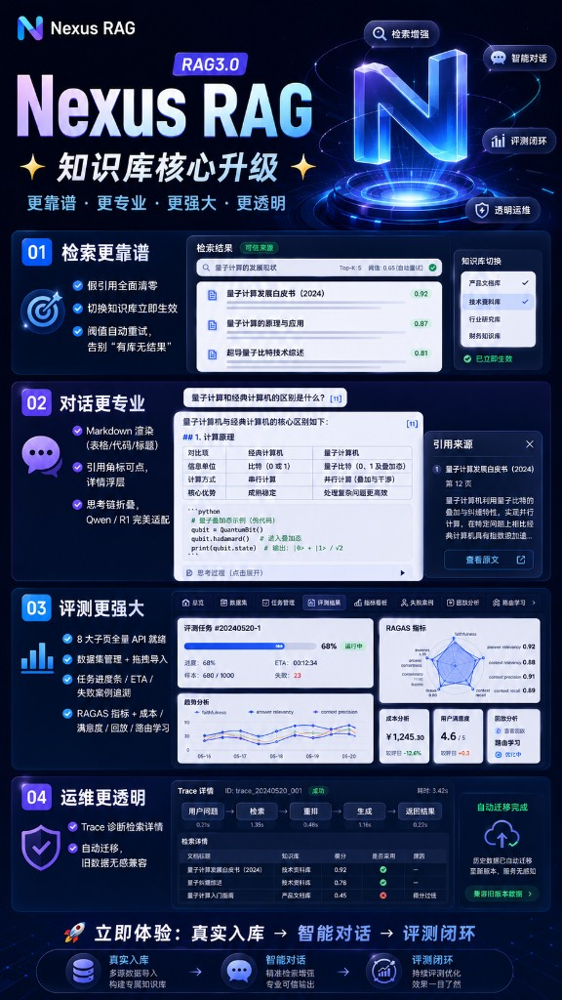

<div align="center">

# NexusRAG

**企业级 RAG 3.0 混合架构 · 检索更靠谱 · 对话更专业 · 评测更强大 · 运维更透明**

[English README](./README.en.md)

基于 [RAGFlow](https://github.com/infiniflow/ragflow) 深度文档理解，扩展 PageIndex、LLM Wiki、四分类器路由与多通道融合。

<br/>

<!-- 技术栈 -->
[](LICENSE)
[](COMMERCIAL-LICENSE.md)
[](THIRD-PARTY-NOTICES.md)
[](./docs/tech/5-企业级RAG知识库3.0实现方案.md)
[](./backend/README.md)
[](./frontend/rag3-web)
[](./frontend/rag3-web)
[](./frontend/rag3-web)
[](./backend/README.md)

<br/>

<!-- 代码托管（Gitee 主仓 · GitHub 镜像请替换 OWNER/REPO） -->
[](https://gitee.com/zeus-maker/rag-turbo/stargazers)
[](https://gitee.com/zeus-maker/rag-turbo/members)
[](https://github.com/zeus-maker/NexusRAG)
[](https://github.com/zeus-maker/NexusRAG)
[](https://github.com/zeus-maker/NexusRAG/commits/main)

> GitHub 徽章指向计划镜像 `zeus-maker/NexusRAG`；当前主仓：[Gitee · rag-turbo](https://gitee.com/zeus-maker/rag-turbo)

<br/>

[快速开始](#快速开始全栈本地) ·
[产品亮点](#产品亮点) ·
[架构概览](#架构概览) ·
[API 对接](#模块对接状态rag3-web) ·
[文档索引](#文档索引) ·
[License](#license) ·
[English](./README.en.md) ·
[Gitee 仓库](https://gitee.com/zeus-maker/rag-turbo)

</div>

> **仓库说明**：Monorepo 目录名为 `agentic-rag`，产品品牌为 **NexusRAG**（RAG 3.0）。  
> **开发入口**：[`frontend/rag3-web`](./frontend/rag3-web) + [`backend/ragflow_rag30`](./backend/ragflow_rag30) · 原型参考 [`web/rag3-bolt-v1.5`](./web/rag3-bolt-v1.5)（只读） · 协作规范 [`CLAUDE.md`](./CLAUDE.md)

<p align="center">
  
</p>

---

## 产品亮点

| | 检索更靠谱 | 对话更专业 | 评测更强大 | 运维更透明 |
|---|:---:|:---:|:---:|:---:|
| **一句话** | 零幻觉引用、即时切库 | Markdown + 可点引用 + 思考链 | 8 Tab 全 API、RAGAS 闭环 | L1–L5 Trace、OTLP 导出 |
| **典型能力** | 多通道检索 + 阈值重试 | 流式输出、答案对比、分块深链 | 数据集 / 任务 / A/B / 成本 / 路由学习 | 监控仪表盘、链路诊断、配置中心 |
| **前端入口** | 检索测试台 | 智能对话 | 评测中心 | 系统监控 · 链路追踪 |

**闭环路径**：真实入库 → 智能对话 → 评测反馈 → 路由/策略优化 → 再评测。

---

## 项目趋势（v1 基线）

> 以下为当前代码库能力快照，随 Devlog 持续更新。GitHub 镜像启用后，Star/Fork 徽章将自动反映远程统计。

| 维度 | 指标 | 说明 |
|------|------|------|
| 前端页面 | **40+** 路由页 | 知识库 / Hub / 对话 / 评测 / 系统管理 |
| 真实 API 域 | **10+** 模块 | 知识库、对话、Hub、评测、Admin、Trace… |
| 系统管理 | **16** 子页 | `/v1/admin/*` 租户配置 + 运维 Job |
| 评测中心 | **8** Tab | `/v1/eval/*` RAGAS 任务与数据集 |
| 检索通道 | **5** 路 | 向量 · BM25 · PageIndex · GraphRAG · Wiki |
| 路由分层 | **L1–L5** | 分类 → 路由 → 检索 → 融合 → 生成 |

<!-- GitHub Star 趋势图：镜像仓库可用后取消注释并替换 OWNER/REPO
<p align="center">
  <a href="https://star-history.com/#zeus-maker/NexusRAG&Date">
    <picture>
      <source media="(prefers-color-scheme: dark)" srcset="https://api.star-history.com/svg?repos=zeus-maker/NexusRAG&type=Date&theme=dark" />
      
    </picture>
  </a>
</p>
-->

---

## 核心能力

| 能力 | 说明 |
|------|------|
| 四分类器路由 | Query Tier / Doc Type / User Intent / Security → 流水线矩阵（L1–L2） |
| 五通道检索 | 向量、BM25、PageIndex、GraphRAG、LLM Wiki 并行召回（L3） |
| 混合融合 | Weighted RRF + Cross-Encoder 精排（L4） |
| 增强索引 | GraphRAG、PageIndex、LLM Wiki 摄取与 Hub 管理 |
| 智能对话 | RAG3 流式对话、Query Trace、答案对比、引用跳转 |
| 评测中心 | RAGAS 评测任务、数据集、A/B、满意度、成本、路由学习 |
| 系统管理 | 16 子模块：流水线/分类器/融合/策略/监控/链路追踪/运维配置等 |
| 可观测性 | QueryLog 聚合、L1–L5 Trace 树、OTLP 导出、监控仪表盘 |

权威设计文档：[`docs/tech/5-企业级RAG知识库3.0实现方案.md`](./docs/tech/5-企业级RAG知识库3.0实现方案.md)

---

## 架构概览

```
用户浏览器
    ↓
frontend/rag3-web          React 18 + Vite + TypeScript + Tailwind
    ↓  /api/v1/*  (dev 代理 → :9380)
backend/ragflow_rag30      Quart/Flask · api/ragflow_server.py
    ├─ router/              四分类器 + 路由引擎
    ├─ pipelines/           向量 / PageIndex / Graph / Wiki / Tool 五流水线
    ├─ fusion/              RRF + Cross-Encoder
    ├─ security/            块级 ACL、注入防御
    ├─ rag3/                对话、评测、Trace、系统配置、Hub 服务层
    ├─ rag/ deepdoc/ agent/ graphrag/   RAGFlow 复用模块
    └─ api/apps/            REST 自动注册（@manager.route）
         ├─ rag3_app.py           /v1/rag3/*
         ├─ restful_apis/admin_api.py   /v1/admin/*
         ├─ restful_apis/evaluation_api.py   /v1/eval/*
         └─ restful_apis/dataset_api.py 等   /v1/datasets/* …
    ↓
Docker 中间件              MySQL · Redis · MinIO · Elasticsearch
(ragflow-0.25.6/docker)
```

---

## 仓库结构

```
NexusRAG/                    # 产品名 · 仓库目录 agentic-rag
├── README.md                 # 本文件（项目总览）
├── CLAUDE.md                 # AI 协作与目录约定（必读）
├── frontend/
│   └── rag3-web/             # ★ 生产前端（唯一 UI 开发入口）
├── backend/
│   ├── README.md             # 后端启动、排障、同步说明
│   └── ragflow_rag30/        # ★ RAGFlow 二开 + RAG3 扩展
│       ├── router/ pipelines/ fusion/ security/
│       ├── rag3/             # RAG3 业务服务（chat、eval、trace、config…）
│       ├── api/apps/         # API 蓝图
│       ├── conf/             # service_conf.yaml
│       └── scripts/          # install.sh / start.sh / start-task-executor.sh
├── web/
│   └── rag3-bolt-v1.5/       # 交互原型（mock，只读，勿改）
├── ragflow-0.25.6/           # 上游 RAGFlow 镜像（本地，gitignore）
├── docs/
│   ├── prd/                  # 产品需求与界面契约
│   ├── tech/                 # 架构与技术方案
│   └── devlog/               # 按日变更记录
└── scripts/
    └── sync-from-ragflow.sh  # 从上游同步复用模块
```

---

## 前置条件

| 依赖 | 说明 |
|------|------|
| Docker Desktop | MySQL / ES / Redis / MinIO |
| Python **3.13** | 与 `uv.lock` 一致 |
| [uv](https://docs.astral.sh/uv/) | `pipx install uv` |
| Node.js **18+** | 前端构建 |
| 内存 | 建议 ≥ 16 GB（Elasticsearch 较吃内存） |
| 上游镜像 | 本地克隆 RAGFlow 0.25.6 至 `ragflow-0.25.6/`（不入库） |

---

## 快速开始（全栈本地）

### 1. 启动中间件

```bash
cd ragflow-0.25.6/docker
cp .env.example .env    # 若无则沿用目录内已有 .env
docker compose -f docker-compose-base.yml up -d
```

建议 `/etc/hosts` 增加：`127.0.0.1 es01 infinity mysql minio redis`

### 2. 安装并启动后端

详细步骤与排障见 **[backend/README.md](./backend/README.md)**。

```bash
# 安装 Python 依赖（含 DeepDoc 模型）
./backend/ragflow_rag30/scripts/install.sh

# 首次：创建管理员 admin@ragflow.io / admin
./backend/ragflow_rag30/scripts/start.sh --init-superuser

# 启动 API（默认 :9380）
./backend/ragflow_rag30/scripts/start.sh

# 另开终端：文档解析 worker（上传/向量化必需）
./backend/ragflow_rag30/scripts/start-task-executor.sh 0
```

健康检查：

```bash
curl http://localhost:9380/v1/rag3/health
curl http://localhost:9380/v1/system/healthz
```

### 3. 启动前端

```bash
cd frontend/rag3-web
npm install
cp .env.example .env.local
```

`.env.local` 推荐配置：

```env
VITE_USE_REAL_API=true
VITE_PROXY_TARGET=http://localhost:9380
# 可选：跳过登录调试
# VITE_RAGFLOW_AUTH_TOKEN=your-token
```

```bash
npm run dev    # http://localhost:5173
```

登录默认账号：`admin@ragflow.io` / `admin`

### 4. 验证构建

```bash
cd frontend/rag3-web && npm run build
cd backend/ragflow_rag30 && .venv/bin/ruff check rag3 router pipelines fusion
```

---

## 前端 API 模式

前端通过 `useApiMode()`（[`src/services/http.ts`](./frontend/rag3-web/src/services/http.ts)）判断：

- `VITE_USE_REAL_API=true`，或
- 已登录（localStorage token），或
- 设置了 `VITE_RAGFLOW_AUTH_TOKEN`

为 **true** 时走真实 API；否则使用 `src/data/*Mock.ts` 离线演示。

### 模块对接状态（rag3-web）

| 模块 | API 前缀 / 说明 | 状态 |
|------|-----------------|------|
| 登录 / 用户 | `/v1/auth/*`、`/v1/users/me` | ✅ 已对接 |
| 知识库管理 | `/v1/datasets/*` | ✅ 列表/CRUD/模型配置 |
| 文档与分块 | `/v1/datasets/:id/documents/*`、`/v1/documents/*` | ✅ 上传/解析/预览/分块审阅 |
| 检索测试 | `POST .../datasets/:id/search` | ✅ 多通道 + 精排 |
| 摄取与索引 | `/v1/rag3/datasets/:id/index`、ingestions | ✅ GraphRAG / PageIndex / Wiki 进度 |
| PageIndex Hub | `/v1/rag3/datasets/:id/pageindex/*` | ✅ 树/检索/统计/设置 |
| LLM Wiki Hub | `/v1/rag3/datasets/:id/wiki/*` | ✅ 条目/检索/统计 |
| 智能对话 | `/v1/conversations/*`（RAG3 chat_service） | ✅ 流式/Markdown/Trace |
| 评测中心 8 Tab | `/v1/eval/*` | ✅ 数据集/任务/RAGAS/A/B/成本/回放/路由学习 |
| 系统管理 16 页 | `/v1/admin/*` | ✅ 配置 CRUD、监控、Trace、运维 Job |
| 链路追踪 | `/v1/admin/traces/*` | ✅ stats/sessions/详情/OTLP |
| 模型管理 | `/v1/llm/my_llms` | ✅ 提供商列表 |
| 知识库权限/数据源/导出 | — | 🟡 仍为 mock（无 RAGFlow 等价 API） |
| Agent / 搜索应用 | — | 🟡 原型交互，待接 API |
| 监控部分图表 / 成本导出 | — | 🟡 部分为 mock 壳或会话内状态 |

变更细节见 [`docs/devlog/`](./docs/devlog/)（近期：`2026-06-07` §58、`2026-06-11` §1）。

---

## 后端 API 概览

| 前缀 | 文件 | 用途 |
|------|------|------|
| `/v1/rag3/health` | `api/apps/rag3_app.py` | RAG3 健康检查 |
| `/v1/rag3/query` | 同上 | 分类 + 多通道检索 + 融合（核心） |
| `/v1/rag3/classify` | 同上 | 仅四分类器调试 |
| `/v1/rag3/datasets/:id/*` | 同上 | PageIndex / Wiki / 增强索引 |
| `/v1/conversations/*` | `restful_apis/conversations_api.py` | RAG3 对话与 trace_json 写入 |
| `/v1/datasets/*` | `restful_apis/dataset_api.py` 等 | RAGFlow 知识库 CRUD |
| `/v1/eval/*` | `restful_apis/evaluation_api.py` | 评测中心全栈 |
| `/v1/admin/*` | `restful_apis/admin_api.py` | 系统管理（用户/配置/Trace/运维） |

租户级 RAG3 配置持久化：`TenantRag3Config`（pipeline、classifier、fusion、security_rules 等 JSON）。

---

## 开发规范

1. **最小 diff**：只改任务相关文件；`web/rag3-bolt-v1.5` 禁止修改。
2. **契约优先**：先对齐 `docs/prd/` 再写代码。
3. **双模式前端**：API 模式下禁止静默回落 mock（与评测中心、系统管理一致）。
4. **Devlog**：代码变更收尾写 `docs/devlog/YYYY-MM-DD-*.md` 并 commit（见 [`.cursor/rules/devlog.mdc`](./.cursor/rules/devlog.mdc)）。
5. **验证**：前端 `npm run build`；后端 `ruff check` / `py_compile` 新增模块。

---

## 常用命令

```bash
# 前端开发 / 构建
cd frontend/rag3-web && npm run dev
cd frontend/rag3-web && npm run build

# 后端 API / Worker
./backend/ragflow_rag30/scripts/start.sh
./backend/ragflow_rag30/scripts/start-task-executor.sh 0

# DeepDoc 模型（PDF 解析失败时）
./backend/ragflow_rag30/scripts/download-deepdoc-models.sh

# 对比上游 RAGFlow（需本地 ragflow-0.25.6）
./scripts/sync-from-ragflow.sh --dry-run api rag deepdoc common conf
./scripts/sync-from-ragflow.sh api rag deepdoc

# 停止 Python 进程
pkill -f "ragflow_server.py|task_executor.py"
```

---

## 文档索引

| 文档 | 说明 |
|------|------|
| [README.en.md](./README.en.md) | English overview |
| [CLAUDE.md](./CLAUDE.md) | 开发规范、Monorepo 约定、常用命令 |
| [backend/README.md](./backend/README.md) | 后端安装、配置、排障、前端联调 |
| [frontend/rag3-web/README.md](./frontend/rag3-web/README.md) | 前端环境变量与模块说明 |
| [docs/tech/5-企业级RAG知识库3.0实现方案.md](./docs/tech/5-企业级RAG知识库3.0实现方案.md) | 架构总纲 |
| [docs/prd/后端逻辑开发方案.md](./docs/prd/后端逻辑开发方案.md) | 后端模块与 API 契约 |
| [docs/prd/前端界面实现方案.md](./docs/prd/前端界面实现方案.md) | 前端页面契约 |
| [docs/prd/前端原型实现进度.md](./docs/prd/前端原型实现进度.md) | 原型 vs rag3-web 进度对照 |
| [docs/devlog/](./docs/devlog/) | 按日变更记录（实现细节与验证步骤） |
| [LICENSE](./LICENSE) / [LICENSE.zh-CN.md](./LICENSE.zh-CN.md) | NexusRAG 许可（非商业免费 · 商业须授权） |
| [COMMERCIAL-LICENSE.md](./COMMERCIAL-LICENSE.md) | 商业授权申请说明 |
| [THIRD-PARTY-NOTICES.md](./THIRD-PARTY-NOTICES.md) | RAGFlow Apache-2.0 与第三方声明 |

---

## 已知限制（v1）

- **备份/恢复/向量库迁移**：AdminJob stub，无真实存储操作。
- **链路追踪**：Langfuse 外链占位；environment 筛选仅前端；历史 QueryLog 无 `trace_json` 时详情较空。
- **监控告警**：规则启停/恢复为会话内状态，未持久化；部分趋势图为 mock 壳。
- **路由矩阵**：Classifier 路由表可读可写，RouterEngine 核心矩阵仍有硬编码。
- **上游同步**：`ragflow-0.25.6/` 需本地自行放置；同步后需核对 `service_conf.yaml` 端口。

---

## License

本仓库采用 **双重许可**：

| 范围 | 许可 | 商业使用 |
|------|------|----------|
| **NexusRAG 原创**（`frontend/rag3-web`、`router/`、`pipelines/`、`fusion/`、`rag3/` 等） | [LICENSE](./LICENSE) · [中文摘要](./LICENSE.zh-CN.md) | **须单独书面授权** → [COMMERCIAL-LICENSE.md](./COMMERCIAL-LICENSE.md) |
| **RAGFlow 衍生**（`backend/ragflow_rag30` 上游同步部分） | [Apache-2.0](./licenses/Apache-2.0.txt) | 遵循 Apache-2.0 及上游条款 |

第三方组件说明：[THIRD-PARTY-NOTICES.md](./THIRD-PARTY-NOTICES.md)

商业授权联系：`commercial-license@nexusrag.io`（发布前请替换为正式邮箱）

---

<div align="center">

**如果 NexusRAG 对你有帮助，欢迎 Star ⭐**

[](https://gitee.com/zeus-maker/rag-turbo/stargazers)
[](https://github.com/zeus-maker/NexusRAG)

</div>
