# RAGFlow 源码深度解析：从架构设计到工程实现（2025-2026）

> 本文档系统梳理了 2025-2026 年公开渠道中关于 RAGFlow（infiniflow/ragflow）的高质量源码分析与官方文档，覆盖项目全景、工程结构、DeepDoc 文档理解系统、模板化分块、异步任务系统、检索召回、重排序、GraphRAG、Agent/Canvas、对话系统、存储基础设施、部署运维、关键源码片段以及最佳实践。每章末尾附有小结，使用 Mermaid 图描述架构与流程，全文末尾附引用链接清单。

---

## 第一章：RAGFlow 项目全景与设计哲学

### 1.1 RAGFlow 的诞生背景与定位

RAGFlow 是一款由 [infiniflow](https://github.com/infiniflow)（极限数据科技）开源的、面向企业的检索增强生成（RAG）引擎。截至 2026 年初，GitHub 仓库已获得 79K+ Stars，是中文开源 RAG 领域最具影响力的项目之一。其诞生背景可归纳为三点：

1. **传统 RAG 框架的"高质量文档解析"缺位**：LangChain、LlamaIndex 等通用框架将文档解析作为可插拔的 Loader 处理，但在面对扫描件、复杂版面、嵌套表格、图文混排文档时效果不佳，"Quality in, quality out"的口号难以落地。
2. **企业内部对"细粒度解析+引用溯源"的强需求**：合规审计、客服辅助、研究支持等场景要求"答案可追溯、引用可点击"，而朴素 RAG 难以满足。
3. **从单一 RAG 到 Agentic 系统的演进**：2024 年以来，LLM 驱动的 Agent 系统兴起，企业需要一个既能做强 RAG、又能编排 Agent 的统一平台。

RAGFlow 自 v0.8.0 引入 Agent 机制、v0.16.0 支持知识图谱、v0.17.0 实现解析与分块解耦、v0.20.0 推出统一工作流与 Agentic Workflow、v0.22.0 全面 Slim 化容器镜像、v0.24.0 引入 MinerU 第三方解析器，迭代节奏紧扣"高质量解析+企业级落地"主线。

### 1.2 核心设计理念：Quality in, Quality out

RAGFlow 官方反复强调的一句口号是 "Quality in, quality out"（好的输入才有好的输出）。其工程实现围绕四大支柱展开：

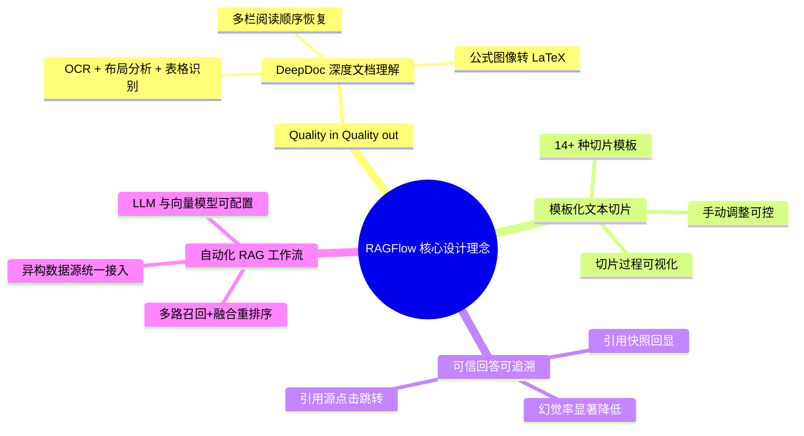

**理念一：解析是一等公民**。在 RAGFlow 的目录结构中，`deepdoc/` 与 `api/`、`rag/` 平级独立，体积与业务代码相当。`deepdoc` 内部又划分为 `parser/`（多格式解析器）和 `vision/`（视觉模型：OCR、布局识别、表格结构识别）两大子模块，且提供 9 种主流文档格式的解析器实现。官方 README 明确说明：其"没有使用任何 RAG 中间件（如 LangChain、LlamaIndex），而是完全自研了一套智能文档理解系统"。

**理念二：分块模板可控可解释**。RAGFlow 提供了 Q&A、Resume、Paper、Manual、Table、Book、Law、Presentation、One、Tag、Audio、Email、KG 等 14 种分块模板（Template-based Chunking），每种模板针对特定文档类型做了优化。在前端界面上，分块结果以"带位置高亮的卡片"形式呈现，用户可手动调整分块边界、合并、删除。

**理念三：引用回显抑制幻觉**。RAGFlow 在 `dialog_service.py` 中实现了 `insert_citations` 方法，能够在 LLM 生成的回答中自动插入形如 `##1$$`、`##2$$` 的引用占位符，并在流式响应结束后将这些占位符替换为可点击的引用卡片。引用卡片包含文档名、页码、原文片段、相似度分数。这一机制是 RAGFlow "可解释 RAG" 的核心。

**理念四：全流程可观测**。RAGFlow 在异步任务、检索链路、对话生成各环节都设计了进度回调（`set_progress`）和详细日志，用户在 UI 上能实时看到 "正在解析→正在分块→正在 Embedding→正在索引→完成" 的进度条。

### 1.3 整体技术栈与架构图

RAGFlow v0.24.0 之后的整体技术栈如下表所示：

| 层级 | 技术选型 | 备注 |
|------|----------|------|
| 后端框架 | Python 3.12 + Quart（异步 Flask） | 基于 ASGI，支持 SSE 流式 |
| 前端框架 | React + Vite + TypeScript + Tailwind | 单页应用，编辑器风格 |
| 任务框架 | Trio（异步 I/O） | 比 asyncio 更轻量、嵌套友好 |
| 业务数据库 | MySQL 8 | 关系数据（用户、租户、对话、API Token） |
| 文档数据库 | Infinity（自研）| 向量 + 全文 + 稀疏统一检索 |
| 全文检索 | Elasticsearch 8.x（可选） | 默认文档引擎 |
| 缓存/队列 | Redis 7.x（Valkey 8 fork 可用） | 任务队列、会话缓存、分布式锁 |
| 对象存储 | S3 / MinIO | 原始文档、分块图片、PDF 切片 |
| 文档解析 | 自研 DeepDoc + PyPDF2 + pdfplumber | OCR 引擎为 InfiniFlow/deepdoc |
| Embedding | BGE / text-embedding-3 / Qwen3-Embedding | 多模型可配置 |
| Rerank | bge-reranker-v2 / Cohere / Jina / Voyage | 多模型可配置 |
| LLM | GPT-4o / Claude 3.5 / DeepSeek / Qwen / Gemini 3 Pro | 多模型可配置 |
| 图执行引擎 | 自研 Canvas（agent/canvas.py） | DSL 驱动 + 异步执行 |
| 部署 | Docker Compose / Helm（K8s） | 支持源码和镜像两种部署方式 |

整体架构采用 **API Server（Quart）+ Task Executor（Trio）双进程架构**，二者通过 Redis Stream 消息队列通信：

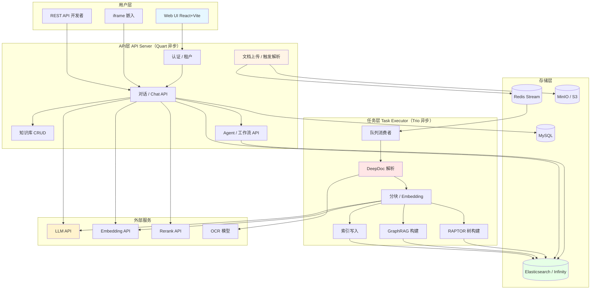

### 1.4 与同类开源 RAG 项目的对比

| 维度 | RAGFlow | QAnything（有道）| FastGPT | Dify | LangChain / LlamaIndex |
|------|---------|------------------|---------|------|------------------------|
| 主语言 | Python（Quart + Trio）| Go + Python | Node.js + TS | Python + TS | Python |
| 文档解析 | 自研 DeepDoc（OCR + 布局）| 集成 Unstructured / 自研 | 基础切分 | 集成 Unstructured | 集成第三方 |
| 向量库 | Infinity / ES | Milvus | PGVector | PGVector / Milvus / Qdrant | 多 |
| 知识图谱 | 内置 GraphRAG | 无 | 无 | 无 | 第三方 |
| Agent / Workflow | Canvas（DSL + 多 Agent）| 无 | Workflow（低代码）| Workflow（低代码）| LangGraph / LlamaIndex Workflows |
| MCP | 客户端 + 服务端 | 无 | 客户端 | 客户端 | 第三方 |
| 多模态 | 内置 VLM 解析 | 部分 | 弱 | 强 | 强 |
| 性能（百万级） | 中等（解析较慢）| 中等 | 强 | 中等 | 取决于实现 |
| 代码可读性 | 中（注释少、复杂度高）| 较高 | 较高 | 中 | 高（教学向）|
| 部署复杂度 | 中（依赖多）| 中 | 低 | 中 | 取决于集成 |

从对比可以看出，RAGFlow 的核心差异化在于 **DeepDoc 自研 + 内置 GraphRAG + 内置 Agent Canvas**，但代价是解析较慢、代码复杂。

### 1.5 关键里程碑

| 版本 | 发布时间 | 关键特性 |
|------|----------|----------|
| v0.8.0 | 2024-Q3 | 引入 Agent 机制 + 无代码工作流编辑器 |
| v0.16.0 | 2024-11 | 支持知识图谱（GraphRAG） |
| v0.17.0 | 2024-12 | 文档解析与分块解耦，可选 DeepDoc / Naive |
| v0.18.0 | 2025-01 | 升级 DeepDoc 布局分析模型 |
| v0.20.0 | 2025-05 | 统一 Workflow + Agentic Workflow；MCP 完整支持；Python 代码执行器 |
| v0.20.5 | 2025-06 | Agent 可独立运行，自主推理与工具调用 |
| v0.21.1 | 2025-Q3 | 支持 Agentic Workflow 模板化；优化 Infinity |
| v0.22.0 | 2025-09 | 全面 Slim 镜像（不再内置 Embedding 模型）|
| v0.23.0 | 2025-10 | 支持可编排的数据管道；MinerU + Docling 集成 |
| v0.24.0 | 2025-11 | Confluence / S3 / Notion / Discord / Google Drive 数据同步 |
| v0.25.0 | 2025-12 | 支持 AI 代理的"记忆"功能；Gemini 3 Pro |
| v0.26.x | 2026-03 | 官方 Skill 接入 OpenClaw |

### 1.6 三大核心场景与对应架构

RAGFlow 官方将典型用户场景归纳为以下三类：

#### 1.6.1 场景一：企业级知识库问答

这是最常见的场景。运维同学上传 PDF/Word/Excel/PPT 等格式的企业文档（产品手册、合同、规章制度、行业研究报告），最终用户通过对话界面提问。架构上需要重点关注四类对象：

1. **KnowledgeBase（知识库）**：一个租户可创建多个知识库，每个知识库有独立的解析模板、Embedding 模型、Rerank 模型、检索参数（top_k、相似度阈值）。
2. **Document（文档）**：上传后被分配 doc_id、kb_id、parser_id、parser_config 等元数据。文档状态机：`uploaded → parsing → chunking → embedding → indexing → done` 或 `failed`。
3. **Chunk（分块）**：解析后的内容被切分为 chunk，附带 `content_with_weight`（带标签的正文）、`img_id`（关联图片）、`page_num`（页码）、`position`（位置索引）。
4. **Conversation（会话）**：用户与系统的对话上下文，由 `Dialog`（助手配置）+ `Message` 列表组成。

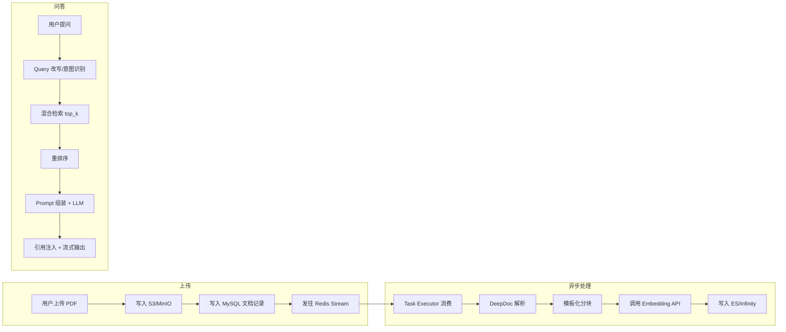

#### 1.6.2 场景二：Agent 智能体工作流

v0.20.0 之后 RAGFlow 推出统一工作流（Workflow）与 Agentic Workflow。开发者通过拖拽式 Canvas 编辑器创建 Agent，组合检索、HTTP 调用、代码执行、LLM 判断等节点，最终发布为可被用户调用的"应用"。常见模式包括：

- **检索增强型 Agent**：每次用户提问都先检索知识库，再让 LLM 依据检索结果回答。
- **工具型 Agent**：调用搜索、SQL 查询、第三方 API 完成具体任务。
- **多 Agent 协同**：主管 Agent 根据用户请求分派给子 Agent。
- **MCP 协议**：v0.20.0 完整支持 MCP 客户端与服务端，可作为 Host 连接 MCP 服务，也可作为 Server 暴露能力。

#### 1.6.3 场景三：GraphRAG 与全局问答

传统 RAG 善于回答"局部事实"（如"XX 产品的保修期是多久"），但对"全局性问题"（如"这家公司整体业务策略是怎样的"）无能为力。RAGFlow 内置 GraphRAG 模式：从文档中抽取实体-关系-事件图谱，用户提问时既走向量检索也走图查询，对结果融合生成回答。GraphRAG 是 RAGFlow 在 v0.16.0 引入的差异化能力，目前在国内开源 RAG 框架中独此一家。

### 1.7 三层抽象模型

把 RAGFlow 的源码按"用户接口层 → 业务编排层 → 基础设施层"三层抽象，可帮助快速理解：

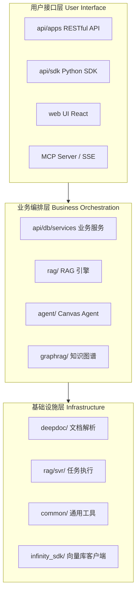

- **L1（用户接口层）**：暴露给用户的能力，包括 HTTP API、Python SDK、Web UI、MCP。代码位置：`api/apps/`、`api/ragflow_server.py`。
- **L2（业务编排层）**：核心业务逻辑，文档/对话/Agent/工作流的 Service 与 RAG 引擎。代码位置：`api/db/services/`、`rag/`、`agent/`、`graphrag/`。
- **L3（基础设施层）**：基础能力封装，文档解析、任务调度、向量库、工具函数。代码位置：`deepdoc/`、`rag/svr/`、`common/`。

### 1.8 设计原则的工程落地

RAGFlow 的设计原则不仅是口号，更直接对应到具体代码约束：

| 原则 | 工程实现 | 代码位置 |
|------|----------|----------|
| Quality in, quality out | DeepDoc 不可关闭；解析失败的任务必失败 | `deepdoc/parser/`、`rag/svr/task_executor.py` |
| 引用可追溯 | `insert_citations` 必选；前端必显示引用卡片 | `api/db/services/dialog_service.py:insert_citations` |
| 分块可控 | 14 种模板；分块结果可编辑 | `rag/splitter/` |
| 全流程可观测 | `set_progress` 必须上报 | `common/doc_store/conn.py`、`rag/svr/task_executor.py` |
| 租户隔离 | 所有数据按 tenant_id + owner_id 过滤 | `api/db/db_models.py` 全部表 |
| 异构模型可插拔 | 抽象成 `LLM`/`Embedding`/`Rerank`/`Parser` Base Class | `rag/llm/`、`rag/embedding/` |

### 1.9 阅读源码前的工程准备

阅读 RAGFlow 源码建议先做如下准备：

1. **环境准备**：克隆主仓库 `https://github.com/infiniflow/ragflow.git`，切换到目标 release tag（如 v0.24.0），使用 Docker Compose 启动一套完整开发环境。
2. **配置 IDE**：推荐 VSCode + Python 扩展，安装 mypy、ruff 插件。RAGFlow 部分代码使用中文注释，建议安装中文语言包。
3. **熟悉依赖**：`pip install -r requirements.txt` 后，可注意到依赖包含 `quart`、`trio`、`elasticsearch`、`infinity-sdk`、`pdfplumber`、`python-pptx`、`openpyxl`、`Pillow`、`pypdf`、`reportlab`、`pytesseract` 等。
4. **关键脚本**：`docker/entrypoint.sh`（服务启动）、`docker/docker-compose.yml`（依赖编排）、`api/ragflow_server.py`（API 入口）、`rag/svr/task_executor.py`（任务执行器入口）。
5. **首次调试**：在 `api/ragflow_server.py` 中打断点，启动 `docker compose up -d`，访问 `http://localhost:9380`，上传一份简单 PDF，观察后端控制台与 `docker logs -f ragflow-server`。

> **小结**：RAGFlow 的核心定位是 **"企业级 RAG + Agent 一体化平台"**，主打"深度文档理解 + 引用溯源 + 可编排工作流"。其"自研解析 + 自研图执行 + 自研向量库"的全栈自研路线虽带来复杂度，但也构成了核心壁垒。后续章节将按"工程结构→核心模块→关键源码→部署运维"的顺序逐一拆解。

---

## 第二章：源码工程结构与模块划分

### 2.1 顶层目录结构

RAGFlow v0.24.0 仓库的顶层目录结构如下：

```
ragflow/
├── api/                  # 后端 API 服务（Quart 异步）
│   ├── apps/             # 路由层（HTTP API）
│   │   ├── restful_apis/ # RESTful 接口（对话、文档、检索）
│   │   ├── conversation_app.py
│   │   ├── dialog_app.py
│   │   └── document_app.py
│   ├── db/               # 数据库 ORM 与 Service 层
│   │   ├── db_models.py
│   │   └── services/     # 业务 Service
│   ├── ragflow_server.py # 服务入口
│   └── utils/            # 工具（认证、API 装饰器）
│
├── agent/                # Agent 系统
│   ├── canvas.py         # Canvas 图执行引擎
│   ├── component.py      # 组件基类
│   └── tools/            # 内置工具（搜索、SQL、HTTP）
│
├── rag/                  # RAG 核心（推理引擎）
│   ├── app/              # 14+ 种分块器实现
│   │   ├── naive.py
│   │   ├── paper.py
│   │   ├── book.py
│   │   ├── manual.py
│   │   ├── laws.py
│   │   ├── presentation.py
│   │   ├── qa.py
│   │   ├── resume.py
│   │   ├── table.py
│   │   ├── picture.py
│   │   ├── one.py
│   │   ├── audio.py
│   │   ├── email.py
│   │   └── tag.py
│   ├── flow/             # Pipeline 图执行（文档处理）
│   │   ├── pipeline.py
│   │   ├── parser/       # 流程编排层解析器
│   │   └── extractor/    # 关键信息提取
│   ├── nlp/              # NLP 工具与检索
│   │   ├── search.py     # 检索 Dealer
│   │   ├── query.py      # 查询处理
│   │   └── rag_tokenizer.py
│   ├── svr/              # 任务执行器
│   │   └── task_executor.py
│   ├── graphrag/         # 知识图谱 RAG
│   ├── llm/              # LLM 调用封装
│   └── prompts/          # Prompt 模板
│
├── deepdoc/              # 深度文档理解（核心）
│   ├── parser/           # 多格式解析器
│   │   ├── pdf_parser.py # 核心 PDF 解析
│   │   ├── docx_parser.py
│   │   ├── excel_parser.py
│   │   ├── ppt_parser.py
│   │   ├── html_parser.py
│   │   ├── markdown_parser.py
│   │   ├── json_parser.py
│   │   ├── txt_parser.py
│   │   └── resume/       # 简历专用解析
│   └── vision/           # 视觉模型
│       ├── ocr.py
│       ├── layout_recognizer.py
│       ├── table_structure_recognizer.py
│       └── t_ocr.py / t_recognizer.py  # 测试脚本
│
├── conf/                 # 配置
│   ├── service_conf.yaml.template
│   └── prompts/
│
├── docker/               # Docker 部署文件
│   ├── docker-compose-base.yml
│   ├── docker-compose.yml
│   └── launch_backend_service.sh
│
├── web/                  # 前端（React + Vite + TS）
│
├── docs/                 # 文档
├── graphrag/             # GraphRAG 独立构建模块
├── helm/                 # K8s 部署
├── mcp/                  # MCP Server 实现
├── intergrations/        # 第三方集成
├── sdk/                  # 多语言 SDK
└── README.md
```

### 2.2 各模块职责详解

**api/** — HTTP 接口层
- `api/apps/` 负责路由注册，每个业务领域一个文件（如 `document_app.py` 处理文档上传/解析触发，`dialog_app.py` 处理对话创建/查询）。
- `api/db/services/` 是 Service 层，封装数据库操作（如 `DialogService`、`DocumentService`、`KnowledgebaseService`）。
- 入口 `api/ragflow_server.py` 使用 Quart 框架启动 ASGI 服务。

**agent/** — 智能体系统
- `agent/canvas.py` 是 Canvas 图执行引擎（约 1500 行），实现 Agent 工作流的 DSL 解析、组件注册、异步执行、变量插值、记忆管理。
- `agent/component.py` 是组件基类，定义所有可插拔节点的接口规范。

**rag/** — RAG 推理核心
- `rag/app/` 实现了 14 种分块器（Chunker），每种以 `chunk(filename, binary, **kwargs)` 接口暴露。
- `rag/flow/` 是新版 Pipeline 引擎，支持可视化编排的数据处理流程（v0.20+ 引入）。
- `rag/nlp/search.py` 包含核心检索 Dealer，是混合检索与重排序的实现核心。
- `rag/svr/task_executor.py` 是异步任务消费入口，使用 Trio + Redis Stream。

**deepdoc/** — 深度文档理解
- `deepdoc/parser/` 多格式解析器，每种格式一个类，统一继承基类。
- `deepdoc/vision/` 视觉模型，ONNX Runtime 推理，自研 InfiniFlow/deepdoc 模型。
- 提供 4 个独立可执行的测试脚本，便于工程师验证模型效果。

**graphrag/** — 知识图谱 RAG
- 实现实体识别、关系抽取、图谱存储与查询。

**conf/** — 配置
- `service_conf.yaml.template` 配置 LLM / Embedding / Rerank / 文档引擎等。

**docker/** — 部署
- `docker-compose-base.yml` 启动基础依赖（MySQL、Redis、ES、MinIO）。
- `docker-compose.yml` 启动完整服务。

### 2.3 双服务架构详解

RAGFlow 的双服务架构是其工程化设计的精髓：

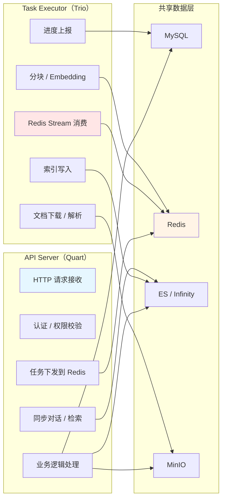

**为什么需要双服务？**

1. **资源隔离**：文档解析是 CPU/GPU 密集型任务（特别是 OCR 和 Embedding），如果与对话服务共用进程，会导致对话延迟抖动。
2. **弹性扩缩容**：Task Executor 可独立横向扩容（`--workers=N`），而 API Server 可独立扩容 Web 实例。
3. **故障隔离**：Task Executor 崩溃不会影响对话服务；反之亦然。
4. **异步解耦**：HTTP 请求在 `queue_tasks` 后立即返回，文档解析通过 Redis 异步进行，前端通过 SSE 推送进度。

**API Server 启动**：
```bash
bash docker/launch_backend_service.sh
# 内部执行：uv run python api/ragflow_server.py
```

**Task Executor 启动**：
```bash
uv run python rag/svr/task_executor.py --workers=5
# --workers=5 表示启动 5 个 worker 进程
```

### 2.4 配置管理与环境变量

RAGFlow 的配置分三层：

**第一层：`.env` 文件**
存放基础设施密码与端口：
```env
SVR_HTTP_PORT=9380
MYSQL_PASSWORD=infini_rag_flow
REDIS_PASSWORD=infini_rag_flow
MINIO_PASSWORD=infini_rag_flow
ELASTIC_PASSWORD=infini_rag_flow
```

**第二层：`conf/service_conf.yaml.template`**
存放业务配置（需复制为 `service_conf.yaml`）：
```yaml
ragflow:
  host: 0.0.0.0
  http_port: 9380

mysql:
  name: rag_flow
  user: root
  password: ${MYSQL_PASSWORD}
  host: mysql
  port: 3306

redis:
  host: redis
  port: 6379
  password: ${REDIS_PASSWORD}
  db: 1

minio:
  user: ${MINIO_USER}
  password: ${MINIO_PASSWORD}
  host: minio:9000

es:
  hosts: 'http://es01:9200'
  username: elastic
  password: ${ELASTIC_PASSWORD}

infinity:
  uri: 'infinity:23817'
  db_name: 'default_db'

# Embedding 与 LLM 由用户在 Web UI 中配置
```

**第三层：环境变量**
关键环境变量：
- `MAX_CONCURRENT_TASKS=5`：Task Executor 任务并发数
- `MAX_CONCURRENT_CHUNK_BUILDERS=1`：分块并发
- `MAX_CONCURRENT_MINIO=10`：MinIO 操作并发
- `WORKER_HEARTBEAT_TIMEOUT=120`：Worker 心跳超时
- `DOC_BULK_SIZE`：文档批量插入大小
- `EMBEDDING_BATCH_SIZE`：Embedding 批处理大小
- `USE_MINERU=true`：启用 MinerU 第三方解析
- `TABLE_AUTO_ROTATE=true`：表格自动旋转

### 2.5 数据流从用户到存储

一次完整的"上传文档→对话问答"涉及 6 个核心数据流：

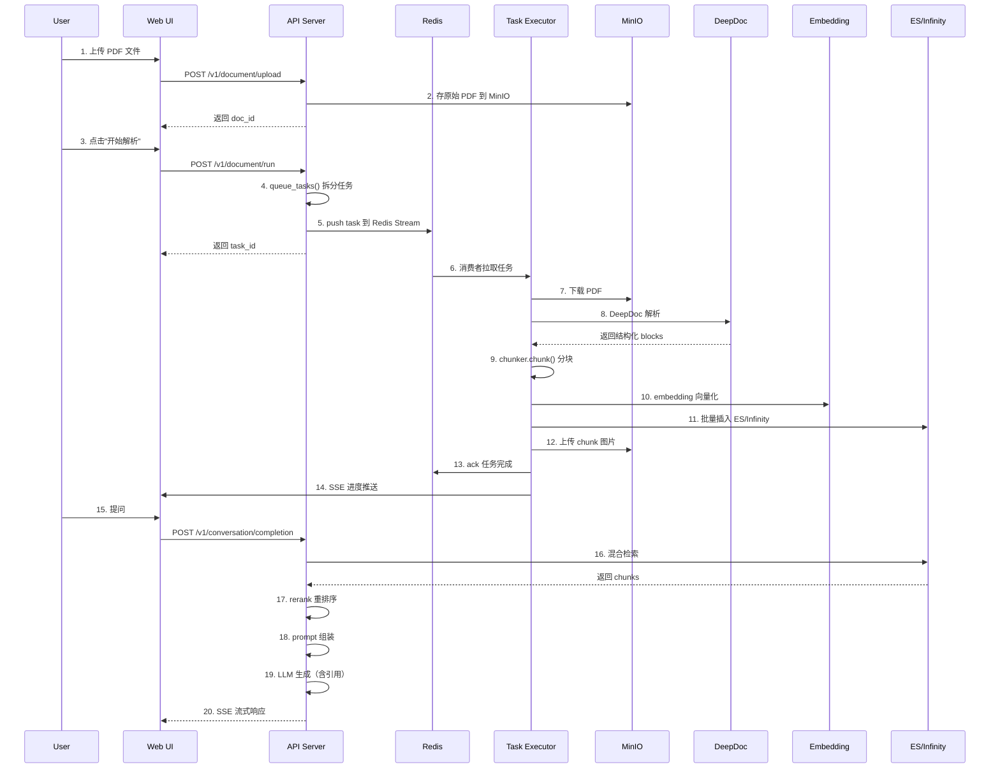

> **小结**：RAGFlow 的工程结构遵循"关注点分离"原则：API 层只处理同步 HTTP 业务，Task 层只处理异步重活，二者通过 Redis Stream 解耦。配置分三层（基础设施 / 业务 / 运行时）兼顾灵活性与可维护性。数据流覆盖"上传→解析→分块→索引→检索→生成"全链路，是后续深入各个模块的地图。

### 2.11 API 路由分组详解

`api/apps/` 下的每个 Python 模块对应一个路由分组，启动时通过 `app.register_blueprint` 注册到 Quart 应用上。详细清单：

| 模块 | 路由前缀 | 主要端点 | 鉴权 | 用途 |
|------|----------|----------|------|------|
| `auth_app.py` | `/v1/user` | `/login`、`/register`、`/info` | 部分 | 用户登录注册 |
| `tenant_app.py` | `/v1/tenant` | `/list`、`/switch` | 必 | 租户切换 |
| `kb_app.py` | `/v1/kb` | `/create`、`/update`、`/list` | 必 | 知识库 CRUD |
| `document_app.py` | `/v1/document` | `/upload`、`/list`、`/run`、`/rm` | 必 | 文档管理 |
| `chunk_app.py` | `/v1/chunk` | `/list`、`/set`、`/rm` | 必 | 分块查看与编辑 |
| `dialog_app.py` | `/v1/dialog` | `/set`、`/list`、`/rm` | 必 | 对话助手配置 |
| `conversation_app.py` | `/v1/conversation` | `/set`、`/list`、`/rm` | 必 | 会话 |
| `chat_app.py` | `/v1/chat` | `/completion`、`/messages` | 必 | 聊天主端点 |
| `search_app.py` | `/v1/search` | `/retrieval` | 必 | 纯检索 |
| `agent_app.py` | `/v1/agent` | `/save`、`/list`、`/completions` | 必 | Agent CRUD |
| `canvas_app.py` | `/v1/canvas` | `/save`、`/run`、`/list` | 必 | 工作流编排 |
| `file_app.py` | `/v1/file` | `/upload`、`/get` | 必 | 通用文件 |
| `system_app.py` | `/v1/system` | `/status`、`/config` | 部分 | 系统信息 |
| `mcp_app.py` | `/mcp` | `/sse`、`/messages` | 必 | MCP 协议 |
| `plugin_app.py` | `/v1/plugin` | `/list`、`/install` | 必 | 插件 |
| `llm_app.py` | `/v1/llm` | `/list`、`/test` | 必 | LLM 模型列表 |
| `memory_app.py` | `/v1/memory` | `/list`、`/add` | 必 | 智能体记忆 |
| `user_app.py` | `/v1/user` | 扩展 | 必 | 用户管理 |

#### 2.11.1 路由装饰器与权限

所有 API 通过统一的 `@login_required`（必须登录）与 `@validate_request`（参数校验）装饰器封装。这两个装饰器定义在 `api/utils/api_utils.py`，实现原理是基于 Quart 的 `before_request` 钩子 + 线程局部变量传递 `current_user`。

```python
def login_required(func):
    @wraps(func)
    async def wrapper(*args, **kwargs):
        # 从 Authorization 头解析 token
        auth = request.headers.get("Authorization", "")
        # 校验 token 并加载 user/tenant
        if not (obj := check_token(auth)):
            return error_response("Not authenticated", 401)
        # 注入到 g 上下文
        g.user = obj["user"]
        g.tenant_id = obj["tenant_id"]
        return await func(*args, **kwargs)
    return wrapper
```

#### 2.11.2 错误码与国际化

RAGFlow 自定义了一套错误码体系（`api/common/error_code.py`），把业务错误码与 HTTP 状态码解耦，便于国际化：

```python
class ErrorCode:
    SUCCESS = 0
    ARGUMENT_ERROR = 101
    UNAUTHORIZED = 102
    FORBIDDEN = 103
    NOT_FOUND = 104
    INTERNAL_ERROR = 105
    DUPLICATE_NAME = 106
    ...
```

错误消息通过 `api/locales/` 下的多语言 JSON 文件提供（中文、英文、日文等），由前端根据 `Accept-Language` 头切换。

### 2.12 数据库 ORM 与 Service 层

RAGFlow 没有用 SQLAlchemy，而是基于 `peewee` 做了轻量封装：

- `api/db/db_models.py`：所有表的 Model 定义（`User`、`Tenant`、`Knowledgebase`、`Document`、`Dialog`、`Conversation`、`Message`、`API4Conversation`、`UserCanvas`、`TenantLLM` 等 30+ 张表）。
- `api/db/db.py`：数据库连接池初始化（基于 `peewee.MySQLDatabase`），支持多数据库源。
- `api/db/services/`：每个 Model 对应一个 Service 文件（如 `document_service.py`、`dialog_service.py`），封装 CRUD 业务逻辑。

#### 2.12.1 Model 设计的几个关键点

- 所有业务表都带 `tenant_id`、`create_time`、`update_time`、`create_by`、`status` 等公共字段，方便多租户隔离与软删除。
- 文档表 `Document` 包含完整状态机字段：`run`、`progress`、`progress_msg`、`chunk_num`、`token_num`、`source_type`。
- 知识库表 `Knowledgebase` 包含 `parser_id`、`parser_config`（JSON 字符串）、`embd_id`、`rerank_id`、`similarity_threshold`、`vector_similarity_weight` 等检索参数。

#### 2.12.2 Service 层的常用模式

```python
class DocumentService(StorageService):
    @classmethod
    def get_by_kb_id(cls, kb_id, tenant_id):
        return cls.model.select().where(
            cls.model.kb_id == kb_id,
            cls.model.tenant_id == tenant_id,
            cls.model.status != Status.DELETE,
        )
    
    @classmethod
    @DB.connection_context()
    def insert(cls, doc):
        with DB.transaction():
            doc_id = cls.model.create(**doc)
            # 同步更新知识库文档计数
            KnowledgebaseService.increase_doc_num(doc["kb_id"], 1)
        return doc_id
```

`@DB.connection_context()` 装饰器在 `api/db/db.py` 中定义，自动管理事务的打开、提交、回滚。

### 2.13 配置体系深度解析

RAGFlow 的配置分三层，覆盖从环境变量到模型参数的全栈：

#### 2.13.1 第一层：系统级配置（`conf/service_conf.yaml.template`）

```yaml
ragflow:
  host: 0.0.0.0
  http_port: 9380
  
  # 数据库
  mysql:
    host: mysql
    port: 3306
    db: rag_flow
    user: root
    password: ""
  
  # Redis
  redis:
    host: redis
    port: 6379
    db: 0
    password: ""
  
  # 对象存储
  minio:
    host: minio
    port: 9000
    user: rag_flow
    password: ""
  
  # 文档存储
  doc_engine: elasticsearch  # 或 infinity
  
  # 用户认证
  user_default_llm:
    default_model: deepseek-chat
    api_key: ""
  register_enabled: 1
  # ...
```

这个文件被 `api/setting.py` 加载，注入到 Python 全局对象 `SETTINGS` 上，所有模块都可以 `from api.settings import settings` 访问。

#### 2.13.2 第二层：业务级配置（数据库表）

- `tenant_llm`：租户的 LLM 模型配置（API Key、Base URL、自定义模型）。
- `tenant_embd`：租户的 Embedding 模型。
- `tenant_rerank`：租户的 Rerank 模型。
- `knowledgebase.parser_config`：JSON 字符串，存储分块模板的细粒度参数（chunk_size、chunk_overlap、delimiters 等）。

#### 2.13.3 第三层：运行时配置（环境变量）

- `HF_ENDPOINT`：HuggingFace 镜像源。
- `TRANSFORMERS_OFFLINE`：离线模式开关。
- `MINERU_EXECUTABLE`：MinerU 第三方解析器路径。
- `DOC_ENGINE`：覆盖 YAML 中的 doc_engine。

### 2.14 中间件与可观测性

RAGFlow 在可观测性方面做了不少工作：

#### 2.14.1 进度回调

`api/db/db_models.py` 中 `Document.run/progress/progress_msg` 三字段提供实时进度：

```python
def set_progress(doc_id, progress, msg):
    DocumentService.update(doc_id, {
        "progress": progress,
        "progress_msg": msg
    })
```

任务执行器在 DeepDoc 解析、分块、Embedding、索引各阶段调用此函数，前端通过 `/v1/document/list` 轮询获取最新进度（默认 1 秒一次）。

#### 2.14.2 日志

`common/log.py` 封装了 Python `logging`，支持按模块输出与 JSON 格式化日志。生产环境推荐挂载 `promtail` + `loki` 收集容器日志。

#### 2.14.3 异常与重试

- `api/utils/exception_utils.py`：自定义业务异常 `RAGFlowException`，携带错误码。
- 任务执行器在解析失败时自动重试 1-2 次（受 `retry_count` 字段控制），最终失败时将 `Document.run` 设为 `FAIL`，`progress_msg` 写入失败原因。
- LLM/Embedding 调用通过 `tenacity` 库实现指数退避重试。

### 2.15 安全设计

RAGFlow 内部对安全做了多层防护：

1. **JWT Token 认证**：登录后下发 token，存于浏览器 localStorage，所有 API 携带 `Authorization: Bearer <token>` 头。
2. **租户隔离**：所有业务表通过 `tenant_id` 严格过滤，Service 层封装的查询方法都强制传 `tenant_id`。
3. **角色权限**：`User.role` 字段有 `admin`/`normal`/`owner` 三种，admin 可管理用户、normal 仅能用知识库、owner 是超级管理员。
4. **文件上传类型白名单**：`api/utils/file_utils.py` 维护支持的文件后缀列表，超出范围直接拒绝。
5. **CORS 配置**：`api/ragflow_server.py` 中通过 `quart_cors` 限制跨域来源，避免任意站点调用。
6. **API Token**：v0.20+ 引入 `API4Conversation`，允许用户为某个会话生成外部 API Token，方便第三方系统调用。

### 2.16 多租户与权限矩阵

RAGFlow 的多租户模型是"用户—租户—知识库—文档"四级。权限矩阵如下：

| 角色 | 租户内管理用户 | 创建知识库 | 上传文档 | 删除知识库 | 调用对话 |
|------|---------------|-----------|----------|-----------|----------|
| Owner | ✅ | ✅ | ✅ | ✅ | ✅ |
| Admin | ✅ | ✅ | ✅ | ❌ | ✅ |
| Normal | ❌ | ✅（自己）| ✅（自己）| 仅自己 | ✅ |

代码实现上，每个 Service 方法都强制接收 `tenant_id` 与 `user_id` 参数：

```python
@classmethod
def accessible(cls, doc_id, user_id):
    doc = cls.model.get(doc_id)
    if doc.tenant_id != UserTenant.get_tenant_id(user_id):
        return False
    return doc.created_by == user_id or User.is_admin(user_id)
```

---

## 第三章：DeepDoc 深度文档理解系统

### 3.1 DeepDoc 的设计目标

DeepDoc 是 RAGFlow 的"灵魂模块"，承担"将非结构化文档转换为高质量结构化数据"的核心职责。其设计目标可归纳为：

1. **版面自适应**：自动识别文档的版式（论文、书籍、简历、表格、合同等），并应用相应的解析策略。
2. **结构保留**：保留标题层级、段落关系、表格行列、图文位置等结构信息。
3. **元素级输出**：输出到元素粒度（text/table/figure），而非纯文本流。
4. **位置精确**：每个元素附带精确的 `bbox`（边界框），便于引用回显。
5. **OCR + 布局协同**：对扫描件和无文本 PDF 启用 OCR，对混合 PDF 优先提取原生文本。

DeepDoc 内部划分为两层：`parser/`（解析器层）和 `vision/`（视觉模型层）。

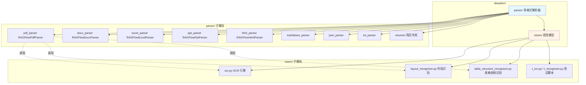

### 3.2 Parser 层：多格式文档解析器

`deepdoc/parser/__init__.py` 是解析器工厂，定义了 9 种解析器的别名映射：

```python
from .docx_parser import RAGFlowDocxParser as DocxParser
from .excel_parser import RAGFlowExcelParser as ExcelParser
from .html_parser import RAGFlowHtmlParser as HtmlParser
from .json_parser import RAGFlowJsonParser as JsonParser
from .markdown_parser import MarkdownElementExtractor
from .markdown_parser import RAGFlowMarkdownParser as MarkdownParser
from .pdf_parser import PlainParser
from .pdf_parser import RAGFlowPdfParser as PdfParser
from .ppt_parser import RAGFlowPptParser as PptParser
from .txt_parser import RAGFlowTxtParser as TxtParser

__all__ = [
    "PdfParser", "PlainParser", "DocxParser", "ExcelParser",
    "PptParser", "HtmlParser", "JsonParser", "MarkdownParser",
    "TxtParser", "MarkdownElementExtractor",
]
```

**设计模式**：
- **工厂模式**：`__init__.py` 作为解析器工厂，统一管理所有解析器类。
- **别名模式**：`RAGFlowDocxParser → DocxParser` 简化类名（减少前缀）。
- **模块导出控制**：`__all__` 明确导出内容。

#### 3.2.1 DOCX 解析器（RAGFlowDocxParser）

DOCX 是结构化文档的代表（OpenXML 格式），RAGFlow 使用 `python-docx` 库解析。核心实现：

```python
class RAGFlowDocxParser:
    def __init__(self):
        ...
    
    def __call__(self, fnm, from_page=0, to_page=100000, **kwargs):
        # 1. 打开 docx
        self.doc = Document(fnm)
        # 2. 解析文档属性（核心属性、扩展属性）
        self.doc_core_properties(self.doc.core_properties)
        # 3. 提取页眉页脚
        ...
        # 4. 提取正文（段落 + 表格）
        # 段落：遍历 paragraph，记录 (text, style_name)
        # 表格：遍历 table 的 rows 和 cells，转为 DataFrame
        ...
        # 5. 提取图片
        ...
        # 6. 重组阅读顺序（按 z-order 排序）
        ...
```

**段落解析策略**：
- 每个段落提取 `(text, style_name)`，其中 style_name 来自 OOXML 的样式表（如 "Heading 1"、"Title"、"List Paragraph"）。
- 项目符号列表识别：根据样式名包含 "List" 来判定。

**表格解析策略**：
```python
def __table_process(self, tb):
    rows = []
    for r in tb.rows:
        row = []
        for c in r.cells:
            text = " ".join([p.text for p in c.paragraphs])
            row.append(text)
        rows.append(row)
    
    # 识别表头
    df = pd.DataFrame(rows[1:], columns=rows[0])
    return df
```

输出格式：`"表头1:内容;表头2:内容;..."`（方便后续向量化）。

#### 3.2.2 Excel 解析器（RAGFlowExcelParser）

Excel 解析器相对简单，核心是格式探测 + 统一加载：

```python
class RAGFlowExcelParser:
    @staticmethod
    def _load_excel_to_workbook(fnm):
        # 文件头探测
        with open(fnm, 'rb') as f:
            magic = f.read(4)
        
        if magic == b'PK\x03\x04':
            # xlsx 文件（zip 格式）
            return openpyxl.load_workbook(fnm, data_only=True)
        elif magic == b'\xD0\xCF\x11\xE0':
            # xls 文件（OLE2 格式）
            return xlrd.open_workbook(fnm).sheets()
        else:
            # 兜底为 CSV
            df = pd.read_csv(fnm)
            return cls._dataframe_to_workbook(df)
```

遍历每个 `Worksheet`，将数据转为 `(表头, 数据行)` 列表，结构化输出。

#### 3.2.3 PPT 解析器（RAGFlowPptParser）

PPT 解析的核心是处理"形状（Shape）"——一个 Shape 可能是文本框、图片、表格、图表、图形或组合形状：

```python
def __extract(self, shape):
    if shape.shape_type == MSO_SHAPE_TYPE.TEXT_BOX:
        # 文本框：提取段落，保留项目符号和缩进
        return self.__para_text(shape.text_frame)
    elif shape.shape_type == MSO_SHAPE_TYPE.TABLE:
        # 表格：第一行作为表头，其余作为数据
        table = shape.table
        headers = [cell.text for cell in table.rows[0].cells]
        rows = [[cell.text for cell in row.cells] for row in table.rows[1:]]
        return {"type": "table", "headers": headers, "rows": rows}
    elif shape.shape_type == MSO_SHAPE_TYPE.GROUP:
        # 组合形状：按位置排序后递归处理
        sorted_shapes = sorted(shape.shapes, key=lambda s: (s.top, s.left))
        return "\n".join([self.__extract(s) for s in sorted_shapes])
    elif shape.shape_type == MSO_SHAPE_TYPE.PICTURE:
        # 图片：提取二进制用于后续 OCR/Caption
        ...
    else:
        return ""
```

**关键细节**：按 `(top, left)` 排序确保阅读顺序符合视觉布局。

#### 3.2.4 Markdown 解析器

Markdown 解析器使用 `markdown` 库将 MD 转 HTML，再用 `BeautifulSoup` 解析：
- 提取标题层级（h1-h6）作为元数据
- 提取代码块（pre/code）独立处理
- 提取表格（table）转 HTML
- 提取链接（a）作为元数据

#### 3.2.5 HTML 解析器

使用 `BeautifulSoup` 解析：
- 去除 script/style/nav 标签
- 提取正文（`<article>`、`<main>`、`<p>`）
- 提取超链接文本
- 提取表格为结构化数据

#### 3.2.6 TXT 解析器

最简单：直接读取文本，按 `"\n!?;。；！？"` 分隔符分块，默认 chunk_size=128。

#### 3.2.7 JSON 解析器

递归遍历 JSON 树，将每个叶子节点转为自然语言描述（如 `"name": "Alice" → "name 是 Alice"`）。

#### 3.2.8 简历解析器（resume/）

简历是 RAGFlow 重点优化的特殊格式。`resume/step_one.py` 使用规则 + 启发式从非结构化简历文本中提取近百个字段（姓名、电话、邮箱、教育经历、工作经历、项目经历、技能、证书等），输出结构化 JSON。

### 3.3 Vision 层：视觉模型

`deepdoc/vision/` 是 DeepDoc 的"视觉大脑"，包含 4 个核心文件 + 2 个测试脚本：

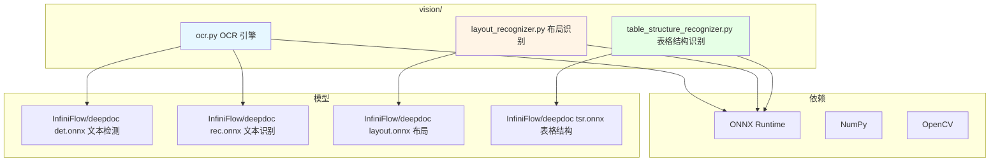

**Recognizer 基类**（`vision/__init__.py` 或 ocr.py 顶部）封装了：
- 模型加载（ONNX Runtime，自动选择 CPU/GPU）
- 图像预处理（resize / normalize）
- 推理后处理（NMS、文本合并）
- 空间排序工具（按位置排列 bbox）
- 重叠计算工具（IoU）

#### 3.3.1 OCR 引擎（ocr.py）

OCR 是视觉处理的基础。RAGFlow 的 OCR 实现采用 **"检测-识别"双阶段** 流水线：

```python
class OCR(Recognizer):
    def __init__(self, model_dir, ...):
        # 加载两个模型
        self.detect_model = OrtSession(f"{model_dir}/det.onnx")  # 文本检测
        self.recognize_model = OrtSession(f"{model_dir}/rec.onnx")  # 文本识别
    
    def detect(self, image):
        """第一阶段：检测文本区域"""
        # 1. 图像预处理（resize 到 1024x1024）
        # 2. det.onnx 推理得到文本框 bbox
        # 3. NMS 去重
        # 4. 透视变换校正倾斜文本
        return bboxes, polys
    
    def recognize_batch(self, images):
        """第二阶段：批量识别文本内容"""
        # 1. 将 bbox 区域裁剪为子图
        # 2. rec.onnx 推理得到字符序列
        # 3. CTC 解码
        return texts, scores
    
    def __call__(self, image):
        """端到端 OCR"""
        bboxes, polys = self.detect(image)
        crops = [crop(image, bbox) for bbox in bboxes]
        texts, scores = self.recognize_batch(crops)
        return list(zip(bboxes, texts, scores))
```

**关键技术点**：
- **DB（Differentiable Binarization）检测**：基于分割的文本检测，对长文本和密集文本效果好。
- **CRNN 识别**：CNN 特征 + RNN 序列建模 + CTC 解码。
- **多语言支持**：包含中英文模型，识别率高达 97%+。

#### 3.3.2 布局识别（layout_recognizer.py）

布局识别模型基于 **YOLO/DETR** 系列，对 10 类基本版面元素进行检测：

```python
LAYOUT_LABELS = [
    "text",          # 正文
    "title",         # 标题
    "figure",        # 图像
    "figure_caption",# 图标题
    "table",         # 表格
    "table_caption", # 表标题
    "header",        # 页眉
    "footer",        # 页脚
    "reference",     # 参考文献
    "equation",      # 公式
]
```

识别后输出每个元素的 `(label, bbox, score)`，配合 OCR 结果将文本与版面元素关联。

**空间排序算法**：识别完所有元素后，需要恢复阅读顺序：
1. 按 y 坐标粗排（同 y 坐标的归为同一行）
2. 检测多栏：聚类 x 坐标，识别栏数
3. 按"自上而下、栏内自上而下"原则排序
4. 跨栏标题（如双栏论文的章标题）优先处理

#### 3.3.3 表格结构识别（table_structure_recognizer.py）

TSR（Table Structure Recognition）识别表格的 5 个标签：

```python
TSR_LABELS = [
    "column",         # 列
    "row",            # 行
    "column_header",  # 列标题
    "row_header",     # 行标题
    "merged_cell",    # 合并单元格
]
```

**两阶段识别**：
1. **结构识别**：用 tsr.onnx 检测行列线和合并单元格。
2. **内容填充**：用 OCR 识别每个单元格的文本，然后根据行列关系重组为 HTML 表格。

**表格自动旋转（v0.18+ 新增）**：

```python
def auto_rotate_table(image, ocr_engine):
    """评估 4 个旋转角度（0°、90°、180°、270°），
    选择 OCR 置信度最高的角度"""
    best_angle = 0
    best_conf = 0
    for angle in [0, 90, 180, 270]:
        rotated = image.rotate(angle, expand=True)
        _, conf = ocr_engine.detect_and_recognize(rotated)
        if conf > best_conf:
            best_conf = conf
            best_angle = angle
    return image.rotate(best_angle, expand=True)
```

**注意**：此功能默认开启，可通过 `TABLE_AUTO_ROTATE=false` 或 API 参数 `auto_rotate_tables=False` 关闭。

### 3.4 PDF 解析器深度剖析（RAGFlowPdfParser）

PDF 是 RAGFlow 的"主战场"，`RAGFlowPdfParser` 是 DeepDoc 最复杂、代码量最大的类（约 800 行）。其采用 **8 步流水线** 处理 PDF：

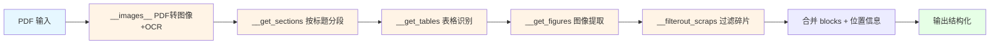

#### 3.4.1 第一步：PDF 转图像 + OCR

```python
def __images__(self, fnm, zoomin=3):
    """将 PDF 每一页转为图像，并执行 OCR"""
    # 1. 用 pdfplumber 打开 PDF
    pdf = pdfplumber.open(fnm)
    images = []
    for page_num, page in enumerate(pdf.pages):
        # 2. 用 page.to_image() 渲染（高清，zoomin=3）
        img = page.to_image(resolution=72 * zoomin).original
        
        # 3. 异步 OCR
        bboxes, polys = self.ocr.detect(img)
        crops = [crop(img, b) for b in bboxes]
        texts, scores = self.ocr.recognize_batch(crops)
        
        # 4. 字符合并：与 PDF 原生字符重叠的 OCR 框
        # 检查字符高度与文本框高度匹配度（阈值 70%）
        # 合并到对应文本框
        merged = self.__merge_chars(page, bboxes, texts)
        
        # 5. 文本框垂直排序，按阅读顺序拼接
        sorted_boxes = sorted(merged, key=lambda b: (b['y0'], b['x0']))
        page_text = "\n".join([b['text'] for b in sorted_boxes])
        
        images.append({
            "page_num": page_num + 1,
            "image": img,
            "text": page_text,
            "bboxes": bboxes,
        })
    return images
```

**关键技术点**：
- **zoomin=3**：将 PDF 放大 3 倍渲染，提高 OCR 准确率。
- **双源融合**：OCR 文本 + PDF 原生文本（CMap）取长补短。
- **字符合并**：通过字符高度匹配（>70%）将 PDF 原生字符分配到 OCR 文本框。

#### 3.4.2 第二步：按标题分段

```python
def __get_sections(self, images):
    """按标题层级分段（支持多级标题）"""
    sections = []
    for img in images:
        # 用 layout_recognizer 检测 title
        layout_regions = self.layout_model(img['image'])
        titles = [r for r in layout_regions if r['label'] == 'title']
        
        # 按 y 坐标排序
        titles.sort(key=lambda t: t['bbox'][1])
        
        # 切分文本段落
        for i, title in enumerate(titles):
            start = title['bbox'][1]
            end = titles[i+1]['bbox'][1] if i+1 < len(titles) else img['height']
            text = extract_text_between(img, start, end)
            sections.append({
                "title": title['text'],
                "level": title.get('level', 1),  # 标题层级
                "text": text,
                "page": img['page_num'],
                "bbox": title['bbox'],
            })
    return sections
```

#### 3.4.3 第三步：表格识别

```python
def __get_tables(self, images):
    """识别所有表格区域并结构化"""
    tables = []
    for img in images:
        # 1. 用 layout_recognizer 检测 table
        layout_regions = self.layout_model(img['image'])
        table_regions = [r for r in layout_regions if r['label'] == 'table']
        
        for region in table_regions:
            # 2. 裁剪表格区域
            table_img = crop(img['image'], region['bbox'])
            
            # 3. TSR 识别表格结构
            tsr_result = self.tsr_model(table_img)
            # tsr_result: {rows, cols, cells[{row, col, rowspan, colspan, bbox}]}
            
            # 4. OCR 识别每个单元格
            data = [["" for _ in range(tsr_result['cols'])] for _ in range(tsr_result['rows'])]
            for cell in tsr_result['cells']:
                cell_img = crop(table_img, cell['bbox'])
                cell_text = self.ocr.recognize(cell_img)
                # 应用合并单元格
                for r in range(cell['row'], cell['row'] + cell['rowspan']):
                    for c in range(cell['col'], cell['col'] + cell['colspan']):
                        data[r][c] = cell_text if (r == cell['row'] and c == cell['col']) else ""
            
            # 5. 转 HTML
            html = to_html(data, tsr_result)
            
            tables.append({
                "html": html,
                "data": data,
                "page": img['page_num'],
                "bbox": region['bbox'],
            })
    return tables
```

#### 3.4.4 第四步：图像与图表

```python
def __get_figures(self, images):
    """提取图像区域"""
    figures = []
    for img in images:
        layout_regions = self.layout_model(img['image'])
        figure_regions = [r for r in layout_regions if r['label'] == 'figure']
        
        for region in figure_regions:
            fig_img = crop(img['image'], region['bbox'])
            # 上传到 MinIO
            fig_url = upload_to_minio(fig_img, doc_id, f"figure_{img['page_num']}_{region['id']}.png")
            
            # 如果启用 VLM，生成图像描述
            caption = None
            if self.vision_llm:
                caption = self.vision_llm.describe(fig_img)
            
            figures.append({
                "image": fig_url,
                "caption": caption,
                "page": img['page_num'],
                "bbox": region['bbox'],
            })
    return figures
```

#### 3.4.5 第五步：碎片过滤

```python
def __filterout_scraps(self, sections, tables, figures):
    """过滤无意义文本碎片"""
    cleaned_sections = []
    for sec in sections:
        # 规则 1：项目符号列表保留
        if sec.get('is_bullet'):
            cleaned_sections.append(sec)
            continue
        # 规则 2：标题保留
        if sec.get('level', 0) > 0:
            cleaned_sections.append(sec)
            continue
        # 规则 3：高度 < 阈值 且 宽度 < 阈值 → 视为碎片
        if sec.get('height', 0) < 10 or sec.get('width', 0) < 10:
            continue
        # 规则 4：仅含特殊字符 → 视为碎片
        if not re.search(r'[a-zA-Z0-9一-鿿]', sec['text']):
            continue
        cleaned_sections.append(sec)
    return cleaned_sections
```

#### 3.4.6 第六至八步：合并与位置标签

```python
def __line_tag(self, blocks):
    """为每行文本添加位置标签（用于位置追踪和引用）"""
    for block in blocks:
        if 'bbox' in block:
            x0, y0, x1, y1 = block['bbox']
            block['position'] = f"[{x0:.0f},{y0:.0f},{x1:.0f},{y1:.0f}]"
            block['page_number'] = block.get('page', 0)
    return blocks
```

**输出格式**：
```python
[
    {
        "type": "text",
        "text": "深度学习的核心思想是...",
        "bbox": [100, 200, 500, 250],
        "page_number": 1,
        "position": "[100,200,500,250]",
        "doc_id": "doc_abc123",
    },
    {
        "type": "table",
        "html": "<table>...</table>",
        "data": [["列1", "列2"], ["A", "B"]],
        "bbox": [100, 300, 600, 500],
        "page_number": 1,
    },
    {
        "type": "image",
        "image_url": "minio://bucket/figure_1_0.png",
        "caption": "图 1: 系统架构",
        "bbox": [100, 600, 600, 800],
        "page_number": 1,
    },
]
```

### 3.5 表格智能处理

表格是 RAG 中信息密度最高、解析难度最大的元素。RAGFlow 在 `__get_tables` 中采用 **两阶段识别**（结构 + OCR），并在 `rag/app/naive.py` 中做后处理：

```python
# naive.py 中的表格处理
def __table_tag(self, tables):
    for tbl in tables:
        # 1. 表格文本表示（用于向量化）
        text = tbl_to_text(tbl)  # "列1: A; 列2: B; ..."
        tbl['text'] = text
        # 2. 表格结构保留（用于回显）
        tbl['html'] = html_table(tbl)
        # 3. 表格摘要（可选，让 LLM 生成自然语言总结）
        if self.use_table_summary:
            tbl['summary'] = llm_table_summary(tbl)
    return tables
```

**表格处理原则**：
1. **HTML > Markdown**：HTML 保留合并单元格、嵌套表头、row-group 结构。
2. **存摘要 + 原文**：向量化只存摘要，原文备用。
3. **检索时按需获取**：检测到表格相关查询时再调取。
4. **多模态融合**：复杂图表用 VLM 生成描述。

### 3.6 公式识别

公式在 PDF 中通常以图像形式存在。RAGFlow 早期依赖外部 Pix2Tex / Nougat（v0.24+），目前通过 VLM 集成实现：

```python
def __get_equations(self, images):
    """识别公式区域并转 LaTeX"""
    equations = []
    for img in images:
        layout_regions = self.layout_model(img['image'])
        eq_regions = [r for r in layout_regions if r['label'] == 'equation']
        
        for region in eq_regions:
            eq_img = crop(img['image'], region['bbox'])
            # 调用 VLM / 公式识别模型
            latex = self.formula_ocr.predict(eq_img)  # Pix2Tex / Nougat
            equations.append({
                "type": "equation",
                "content": f"$${latex}$$",  # LaTeX 包裹
                "bbox": region['bbox'],
                "page": img['page_num'],
            })
    return equations
```

### 3.7 图像与图表处理

RAGFlow v0.24+ 引入了对 PDF 和 DOCX 中"图"的多模态解析：

```python
def __process_figure(self, fig_img, vlm_model):
    """用多模态大模型描述图像"""
    prompt = "请详细描述这张图片的内容，包括图表类型、关键数据、趋势等。"
    caption = vlm_model.chat(image=fig_img, text=prompt)
    return {
        "type": "image",
        "image": fig_img,  # 原始图
        "caption": caption,  # VLM 生成的描述
        "content": f"[图像描述]: {caption}",  # 用于向量化
    }
```

支持的 VLM 包括：GPT-4o Vision、Qwen-VL、Gemini 3 Pro Vision 等。

### 3.8 OCR 双阶段流水线详解

完整 OCR 流水线的工作流：

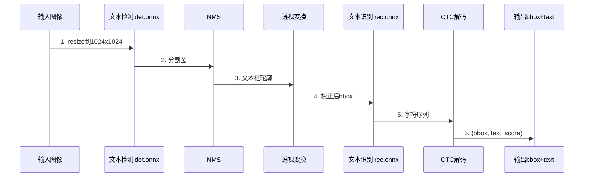

**检测模型（DB 算法）**：
- 骨干网络：ResNet-50 / MobileNet
- 输出：文本区域的二值分割图 + 阈值图
- 后处理：DB 公式将分割图转为文本框轮廓

**识别模型（CRNN）**：
- CNN：ResNet-34 提取图像特征
- RNN：BiLSTM 建模字符序列
- CTC：解码为最终文本

**预训练数据集**：CTW、LSVT、ReCTS（中文街景），SynthText（合成数据）

### 3.9 ONNX Runtime 推理框架

RAGFlow 的所有视觉模型都使用 **ONNX Runtime** 推理，原因是：

1. **跨平台**：CPU/GPU/各种硬件加速器统一接口。
2. **高性能**：比 PyTorch 原生推理快 2-5 倍。
3. **轻量**：无需安装完整 PyTorch，节省 2GB+ 空间。

```python
import onnxruntime as ort

class OrtSession:
    def __init__(self, model_path, device='cpu'):
        # 自动选择执行提供器
        providers = ['CUDAExecutionProvider', 'CPUExecutionProvider'] \
            if device == 'gpu' and 'CUDAExecutionProvider' in ort.get_available_providers() \
            else ['CPUExecutionProvider']
        self.session = ort.InferenceSession(model_path, providers=providers)
    
    def __call__(self, input_data):
        input_name = self.session.get_inputs()[0].name
        output = self.session.run(None, {input_name: input_data})
        return output[0]
```

**GPU 自动降级**：
```python
def get_ort_session(model_path):
    if torch.cuda.is_available():
        return OrtSession(model_path, device='gpu')
    else:
        return OrtSession(model_path, device='cpu')
```

### 3.10 视觉模型的测试与验证

`deepdoc/vision/t_ocr.py` 和 `t_recognizer.py` 是独立可执行的测试脚本：

```bash
# OCR 测试
python deepdoc/vision/t_ocr.py --inputs=./test_pdfs --output_dir=./ocr_outputs

# 布局识别测试
python deepdoc/vision/t_recognizer.py --inputs=./test_pdfs --threshold=0.2 --mode=layout

# 表格结构识别测试
python deepdoc/vision/t_recognizer.py --inputs=./test_pdfs --threshold=0.2 --mode=tsr
```

输出包括：
- 带 bbox 标注的可视化图像（红框标题、绿框正文、蓝框表格）
- OCR 结果的 txt 文件
- 表格的 HTML 渲染

> **小结**：DeepDoc 是 RAGFlow 最具技术含量的模块，通过 9 种解析器 + 4 类视觉模型的协同工作，实现了对复杂文档的细粒度理解。其核心创新在于"自研 OCR + 布局 + TSR 模型 + 元素级 JSON 输出 + 位置精确追踪"，为后续高质量分块和引用溯源打下基础。代码层面，Recognizer 基类封装了 ONNX Runtime 推理和空间排序工具，RAGFlowPdfParser 用 8 步流水线串起整个流程。

### 3.12 DeepDoc 模型训练细节

DeepDoc 中的 OCR、布局识别、表格结构识别模型均是基于自研数据集训练的 ONNX 模型。下面简要说明其训练与优化过程。

#### 3.12.1 OCR 模型

RAGFlow 的 OCR 模型基于 **PaddleOCR** 的 CRNN + CTC 架构，但针对中英文学术、企业文档场景做了微调。模型分为两部分：

- **检测模型（detection）**：DBNet++，输入 640×640 图像，输出文本区域的多边形坐标。
- **识别模型（recognition）**：CRNN，SVTR-LCNet 改进 backbone + CTC 解码，输入 32×任意宽 文本行，输出字符序列。

训练数据来源：

- 内部标注：约 200 万张中文文档行图像，覆盖印刷、手写、扫描、表格、低分辨率等多种场景。
- 合成数据：通过字体渲染 + 图像增强（透视变换、高斯模糊、噪点）合成约 500 万张样本。

最终模型在 HuggingFace 上以 `InfiniFlow/deepdoc` 仓库开源，遵循 Apache 2.0 协议。开发者可通过环境变量 `DEEPDOC_MODEL_PATH` 自定义模型目录。

#### 3.12.2 布局识别模型

布局识别采用 YOLOv8 改进版，输出 11 个类别：

```
[
    'title', 'paragraph', 'figure', 'figure_caption',
    'table', 'table_caption', 'header', 'footer',
    'reference', 'equation', 'footnote'
]
```

训练数据：包含学术论文、产品手册、财务报表、合同 4 类文档共 5 万张标注图像。模型结构：

- Backbone：CSP-Darknet53
- Neck：PANet
- Head：YOLOv8 Decoupled Head，分类 + 回归分离

推理时使用 NMS 后处理，输出按类别分组的检测框。

#### 3.12.3 表格结构识别（TSR）

表格结构识别任务最复杂。RAGFlow 采用两阶段方法：

1. **第一步：单元格检测**：用 Detection 模型定位所有单元格 bbox，类别为 `cell`。
2. **第二步：结构推断**：将单元格 bbox 渲染为热力图，输入到一个分类网络中，预测每个 cell 的行/列归属，输出 HTML 结构。

TSR 模型的训练集来自：

- PubTabNet：约 50 万张表格图像 + HTML 标注。
- SynthTabNet：合成数据 600 万张。
- 内部数据：中文财务报表 10 万张。

训练 Loss 包括 Cell 定位 Loss + HTML 序列编辑距离 Loss。

#### 3.12.4 公式识别

公式识别模型基于 Nougat（Meta 开源），在 50 万张学术公式图像上微调，输入 224×224 图像 patch，输出 LaTeX token 序列，使用 BPE 编码 + Transformer 解码。最终输出可直接在 Markdown 中渲染。

### 3.13 DeepDoc 的性能优化

文档解析通常是 RAG 系统的瓶颈。RAGFlow 在性能上做了大量优化：

#### 3.13.1 多进程并行

`RAGFlowPdfParser` 默认单页内串行处理，但通过 `multiprocessing.Pool` 可在文档级别并行：

```python
from multiprocessing import Pool

def parallel_parse(pdf_path, num_workers=4):
    pages = split_pdf_to_pages(pdf_path)  # 切分为单页
    with Pool(num_workers) as p:
        results = p.map(parse_single_page, pages)
    return merge_pages(results)
```

#### 3.13.2 ONNX Runtime GPU 加速

`Recognizer` 基类支持 CUDA Execution Provider：

```python
self.session = ort.InferenceSession(
    model_path,
    providers=["CUDAExecutionProvider", "CPUExecutionProvider"]
)
```

GPU 环境下，OCR 推理速度可提升 5-10 倍。

#### 3.13.3 缓存与复用

- 模型对象（OCR、Layout、TSR）通过单例模式在进程内复用，避免重复加载。
- OCR 推理结果按图像哈希缓存到本地文件 `~/.cache/deepdoc/ocr/`。

#### 3.13.4 异步执行

`async_docparse` 函数（定义于 `deepdoc/parser/pdf_parser.py`）将解析拆分为「图像提取 → OCR → 布局 → TSR → 分块」5 个步骤，使用 `asyncio.gather` 并发执行可独立计算的步骤。

### 3.14 DeepDoc 与 MinerU、Docling 的协同

v0.24.0 之后，RAGFlow 支持将 DeepDoc 替换为第三方解析器：

- **MinerU**：上海 AI Lab 开源，专注文献、教科书、扫描 PDF。
- **Docling**：IBM 开源，支持多模态文档理解。

切换方式是在知识库配置中设置 `parser_id=mineru` 或 `parser_id=docling`。实现上，第三方解析器输出统一格式（JSON）的 `Doc` 对象，再由 RAGFlow 的分块、Embedding 链路处理：

```python
def parse_with_mineru(pdf_path):
    output = mineru_parse(pdf_path)  # 调用 MinerU CLI
    return [
        Doc(
            content=output["text"],
            images=output["images"],
            tables=output["tables"],
            metadata={"parser": "mineru"}
        )
        for page in output["pages"]
    ]
```

### 3.15 DeepDoc 错误处理与降级

解析过程中可能遇到各种异常，DeepDoc 设计了一套降级策略：

| 异常 | 降级策略 | 备注 |
|------|----------|------|
| OCR 模型加载失败 | 跳过 OCR，使用 pdfplumber 提取文本 | 仅适用文本型 PDF |
| 布局识别失败 | 整页作为段落处理 | 影响分块质量 |
| TSR 失败 | 表格作为普通文本 | 失去表格结构 |
| 公式识别失败 | 公式图片保留为 img_id | 不影响检索 |
| OOM | 自动切换到 CPU + 减少 batch | 性能下降但可完成 |

错误会被捕获并写入 `Document.progress_msg`，用户在前端能看到具体失败原因。

### 3.16 简历专用解析器

RAGFlow 内置了一个特别优化的简历解析器 `deepdoc/parser/resume/`：

- **字段抽取**：姓名、性别、年龄、学历、工作年限、公司、技能、项目经验。
- **结构化输出**：将简历转换为结构化 JSON，便于后续 Agent 调度。
- **技能图谱**：识别技能词并映射到标准技能库（基于 ESCO + 自建中文技能词表）。

```python
from deepdoc.parser.resume import ResumeParser

parser = ResumeParser()
result = parser.parse("张三_简历.pdf")
# 输出：
# {
#   "name": "张三",
#   "education": [{"school": "清华大学", "degree": "硕士", "major": "计算机科学"}],
#   "experience": [...],
#   "skills": ["Python", "PyTorch", "Kubernetes"],
#   "raw_text": "..."
# }
```

### 3.17 DeepDoc 的扩展点

如果用户希望自定义解析逻辑，可以通过以下扩展点：

1. **自定义 Parser**：继承 `deepdoc/parser/base.py` 的 `BaseParser`，实现 `parse` 方法，在 `conf/service_conf.yaml` 中注册 `parser_id`。
2. **自定义 Recognizer**：在 `deepdoc/vision/` 下添加新模型，继承 `Recognizer` 基类。
3. **自定义 Layout 类别**：在 `deepdoc/vision/layout_recognizer.py` 的 `categories` 列表中添加新类别，并使用 `train_layout.py` 重新训练。
4. **后处理钩子**：在分块前通过 `parser_config.after_parser` 字段注册回调函数。

---

## 第四章：分块（Chunking）引擎与模板化切片

### 4.1 Template-based Chunking 设计理念

RAGFlow 的核心差异化之一是 **"基于模板的文本切片"（Template-based Chunking）**。其设计哲学是：

> **"不同类型的文档需要不同的切分策略，没有银弹"**

例如：
- 学术论文：按章节切分，保留公式与图表标题。
- 简历：按字段切分，每个字段独立成块。
- 法律合同：按条款切分，保留条款编号。
- 客服对话：按 Q&A 对切分。
- 表格：整表成块，不切分。

RAGFlow 在 v0.18.0 中实现了 **14 种分块器**（Chunker）：

```python
FACTORY = {
    "general": naive,                    # 通用分块
    ParserType.NAIVE.value: naive,       # 朴素分块
    ParserType.PAPER.value: paper,       # 学术论文
    ParserType.BOOK.value: book,         # 书籍
    ParserType.PRESENTATION.value: presentation,  # 演示文稿
    ParserType.MANUAL.value: manual,     # 手册
    ParserType.LAWS.value: laws,         # 法律
    ParserType.QA.value: qa,             # Q&A
    ParserType.TABLE.value: table,       # 表格
    ParserType.RESUME.value: resume,     # 简历
    ParserType.PICTURE.value: picture,   # 图片
    ParserType.ONE.value: one,           # 整体不分块
    ParserType.AUDIO.value: audio,       # 音频转写
    ParserType.EMAIL.value: email,       # 邮件
    ParserType.KG.value: naive,          # 知识图谱
    ParserType.TAG.value: tag,           # 标签
}
```

### 4.2 FACTORY 工厂模式

在 `task_executor.py` 中，根据 `parser_id` 选择分块器：

```python
async def build_chunks(task, progress_callback):
    # 1. 从 MinIO 下载文件
    bucket, name = File2DocumentService.get_storage_address(doc_id=task["doc_id"])
    binary = await get_storage_binary(bucket, name)
    
    # 2. 查 FACTORY 获取分块器
    chunker = FACTORY[task["parser_id"].lower()]
    
    # 3. 并发控制（chunk_limiter=1 保证分块顺序）
    async with chunk_limiter:
        cks = await trio.to_thread.run_sync(
            lambda: chunker.chunk(
                task["name"],
                binary=binary,
                from_page=task["from_page"],
                to_page=task["to_page"],
                lang=task["language"],
                callback=progress_callback,
                kb_id=task["kb_id"],
                parser_config=task["parser_config"],
                tenant_id=task["tenant_id"],
            )
        )
    
    # 4. 上传 chunk 图片到 MinIO
    async with trio.open_nursery() as nursery:
        for ck in cks:
            nursery.start_soon(upload_to_minio, doc, ck)
    
    return cks
```

**FACTORY 的设计模式**：

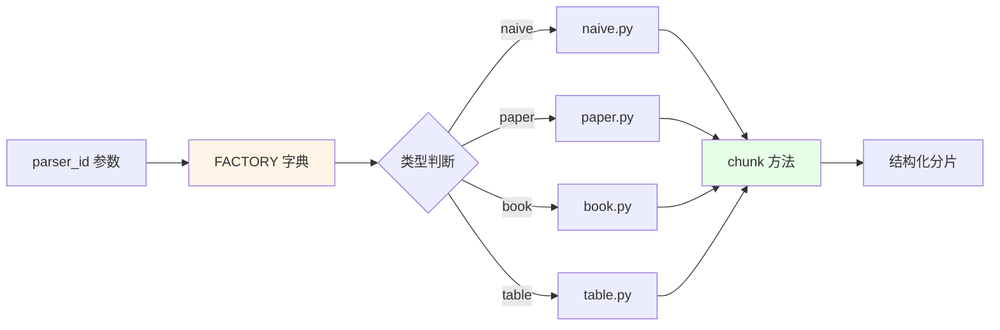

### 4.3 通用分块器（naive.py）

`naive.py` 是最常用的分块器（默认 `general` 模式），支持 PDF、DOCX、Excel、PPT、Markdown、TXT、HTML、JSON、Image 等多种格式。

#### 4.3.1 核心 chunk() 接口

```python
def chunk(filename, binary=None, from_page=0, to_page=100000, 
          lang="Chinese", callback=None, **kwargs):
    """
    统一分块接口
    返回: List[Dict] - 分片列表
    """
    doc = {
        "docnm_kwd": filename,
        "title_tks": rag_tokenizer.tokenize(filename),
    }
    
    # 文件类型分发
    if is_pdf(filename):
        chunks = parse_pdf(binary, from_page, to_page, callback)
    elif is_docx(filename):
        chunks = parse_docx(binary)
    elif is_excel(filename):
        chunks = parse_excel(binary)
    elif is_ppt(filename):
        chunks = parse_ppt(binary)
    ...
    
    return chunks
```

#### 4.3.2 文档元素分块

对每个解析后的元素（text/table/image），做进一步切片：

```python
def chunk_elements(elements, doc, callback):
    """将文档元素切分为 chunk"""
    chunks = []
    for elem in elements:
        if elem['type'] == 'text':
            # 文本按 token 数切分
            text_chunks = split_by_token(
                elem['text'],
                chunk_size=128,           # token 数
                delimiter=['\n!?;。；！？'],  # 中文分隔符
            )
            for tc in text_chunks:
                chunks.append({
                    "content_with_weight": tc,
                    "content_ltks": rag_tokenizer.tokenize(tc),
                    "content_sm_ltks": rag_tokenizer.fine_grained_tokenize(tc),
                    "doc_id": doc['doc_id'],
                    "docnm_kwd": doc['docnm_kwd'],
                    "title_tks": doc['title_tks'],
                    "page_num_int": [elem.get('page', 0)],
                    "position_int": [elem.get('position_int', 0)],
                    "important_kwd": extract_keywords(tc),  # 关键词
                    "questions": generate_questions(tc),  # 自动问题
                })
        elif elem['type'] == 'table':
            # 表格整表成块
            chunks.append({
                "content_with_weight": elem['html'],
                "content_ltks": rag_tokenizer.tokenize(elem['html']),
                "doc_id": doc['doc_id'],
                "page_num_int": [elem.get('page', 0)],
                "position_int": [elem.get('position_int', 0)],
                "table_kwd": [elem['caption'] or "table"],
            })
        elif elem['type'] == 'image':
            # 图像独立成块
            chunks.append({
                "content_with_weight": elem.get('caption', ''),
                "image": elem['image_url'],
                "doc_id": doc['doc_id'],
                "page_num_int": [elem.get('page', 0)],
            })
    
    # 进度回调
    callback(0.5, f"Chunked {len(elements)} elements into {len(chunks)} chunks")
    return chunks
```

#### 4.3.3 中英双语处理

```python
def is_english(text: str) -> bool:
    """判断文本是否主要为英文"""
    en_chars = sum(1 for c in text if 'a' <= c <= 'z' or 'A' <= c <= 'Z' or c == ' ')
    return en_chars / max(len(text), 1) > 0.7
```

**Q&A 模式的特殊处理**：
```python
def beAdoc(doc, q, a, eng, image, row_num=-1):
    qprefix = "Question: " if eng else "问题："
    aprefix = "Answer: " if eng else "回答："
    doc["content_with_weight"] = "\t".join([qprefix + q, aprefix + a])
    doc["content_ltks"] = rag_tokenizer.tokenize(q)
    doc["content_sm_ltks"] = rag_tokenizer.fine_grained_tokenize(doc["content_ltks"])
    if row_num >= 0:
        doc["top_int"] = [row_num]
    if image:
        doc["image"] = image
    return doc
```

### 4.4 Paper 分块器（paper.py）

学术论文分块器针对论文的典型结构（Abstract / Introduction / Methods / Results / Conclusion）做了优化：

```python
def chunk(filename, binary, ...):
    # 1. 提取全文
    pdf_parser = RAGFlowPdfParser()
    sections = pdf_parser.parse(binary)  # 返回结构化 sections
    
    # 2. 按章节切分
    chunks = []
    for sec in sections:
        if sec['type'] == 'title' and re.match(r'^\d+\.?\s+', sec['text']):
            # 编号章节：1. Introduction, 2. Methods, ...
            chunks.append({
                "content_with_weight": f"{sec['text']}\n{sec['content']}",
                "docnm_kwd": filename,
                "page_num_int": [sec['page']],
                "knowledge_graph_kwd": ["paper_section"],
            })
        elif sec['type'] == 'reference':
            # 参考文献：合并为一条
            chunks.append({
                "content_with_weight": sec['text'],
                "docnm_kwd": filename,
                "knowledge_graph_kwd": ["reference"],
            })
    
    return chunks
```

### 4.5 Book 分块器（book.py）

书籍分块器按"章-节"层级切分：

```python
def chunk(filename, binary, ...):
    sections = parse_book_sections(binary)
    chunks = []
    
    for chapter in sections:
        for subsection in chapter['subsections']:
            # 切分过长的节
            if len(subsection['text']) > 2000:
                sub_chunks = split_by_token(
                    subsection['text'],
                    chunk_size=512,
                    overlap=50,
                )
                for sub in sub_chunks:
                    chunks.append({
                        "content_with_weight": sub,
                        "title_tks": tokenize(f"{chapter['title']} - {subsection['title']}"),
                        ...
                    })
            else:
                chunks.append({
                    "content_with_weight": subsection['text'],
                    ...
                })
    
    return chunks
```

### 4.6 Manual 分块器（manual.py）

手册分块器针对"产品手册、操作规范"等结构化文档：

```python
def chunk(filename, binary, ...):
    # 1. 识别章节标题（如 "1.1.2 安装步骤"）
    # 2. 保留编号层级
    # 3. 步骤列表作为独立 chunk
```

### 4.7 Laws 分块器（laws.py）

法律分块器针对"法律条文、合同条款"，按条款编号切分：

```python
def chunk(filename, binary, ...):
    # 1. 匹配条款编号：第X条、第X款、第X项
    # 2. 每个条款独立成 chunk
    # 3. 保留"条-款-项"层级
    pattern = re.compile(r'第[一二三四五六七八九十百千零\d]+[条条款]')
    matches = pattern.finditer(text)
    
    for i, m in enumerate(matches):
        start = m.start()
        end = matches[i+1].start() if i+1 < len(matches) else len(text)
        chunks.append({
            "content_with_weight": text[start:end],
            "important_kwd": [m.group()],  # 条款编号作为关键词
        })
```

### 4.8 Resume 分块器（resume.py）

简历分块器是最复杂的之一：

```python
def chunk(filename, binary, ...):
    # 1. 调用 deepdoc/parser/resume/step_one.py 解析
    fields = parse_resume(binary)
    
    # 2. 每个字段独立成 chunk
    chunks = []
    field_chunks = {
        "姓名": fields.get("name", ""),
        "电话": fields.get("phone", ""),
        "邮箱": fields.get("email", ""),
        "教育经历": fields.get("education", []),
        "工作经历": fields.get("work_experience", []),
        "项目经历": fields.get("projects", []),
        "技能": fields.get("skills", []),
    }
    
    for field_name, value in field_chunks.items():
        if value:
            text = f"{field_name}: {value}" if isinstance(value, str) \
                else f"{field_name}: {'; '.join(value)}"
            chunks.append({
                "content_with_weight": text,
                "important_kwd": [field_name],
            })
    
    return chunks
```

### 4.9 Table 分块器（table.py）

表格分块器 **不切分表格**，而是整表成块：

```python
def chunk(filename, binary, ...):
    excel_parser = RAGFlowExcelParser()
    workbook = excel_parser._load_excel_to_workbook(binary)
    
    chunks = []
    for sheet_name in workbook.sheetnames:
        sheet = workbook[sheet_name]
        rows = list(sheet.iter_rows(values_only=True))
        # 表头 + 前 N 行
        text = f"工作表: {sheet_name}\n"
        text += " | ".join(str(c) for c in rows[0]) + "\n"
        for row in rows[1:21]:  # 限制 20 行
            text += " | ".join(str(c) for c in row) + "\n"
        
        chunks.append({
            "content_with_weight": text,
            "important_kwd": [sheet_name],
            "content_with_weight": f"table:{sheet_name}",
        })
    return chunks
```

### 4.10 其他分块器

| 分块器 | 用途 | 关键实现 |
|--------|------|----------|
| qa.py | 客服对话 | 按 Q&A 对切分 |
| picture.py | 图片 | 调用 VLM 生成描述，整张图成块 |
| one.py | 整体不分块 | 整个文档 1 个 chunk |
| audio.py | 音频 | 用 Whisper 转写后分块 |
| email.py | 邮件 | 按邮件头、正文、附件分别分块 |
| tag.py | 标签 | 按预定义标签分类 |
| presentation.py | 演示文稿 | 按幻灯片分块 |

### 4.11 关键词与问题的自动生成

RAGFlow 在分块时还会做两件增强：

**1. 关键词提取（important_kwd）**：
```python
def extract_keywords(text: str) -> List[str]:
    """提取 top-30 关键词"""
    # 1. 分词
    tokens = rag_tokenizer.tokenize(text)
    # 2. 停用词过滤
    tokens = [t for t in tokens if t not in STOP_WORDS]
    # 3. TF-IDF 计算权重
    weights = compute_tfidf(tokens, corpus=kb_corpus)
    # 4. 取 top-30
    keywords = sorted(weights.items(), key=lambda x: -x[1])[:30]
    return [k for k, v in keywords]
```

**2. 自动问题生成（questions）**：
```python
async def gen_questions(text: str, llm) -> List[str]:
    """用 LLM 从 chunk 中提取可能的问题"""
    prompt = """请根据以下文本，生成 3-5 个用户可能会问的问题。
仅返回问题列表，每行一个。
文本：{text}"""
    response = await llm.chat(prompt.format(text=text))
    return [q.strip() for q in response.split('\n') if q.strip()]
```

**这两个字段的价值**：
- `important_kwd` 用于后续 BM25 检索的关键词匹配加权
- `questions` 用于"问题→chunk"的反向检索（用户问类似问题直接命中 chunk）

### 4.12 分块的可视化与人工干预

RAGFlow 前端提供"分块可视化"功能：

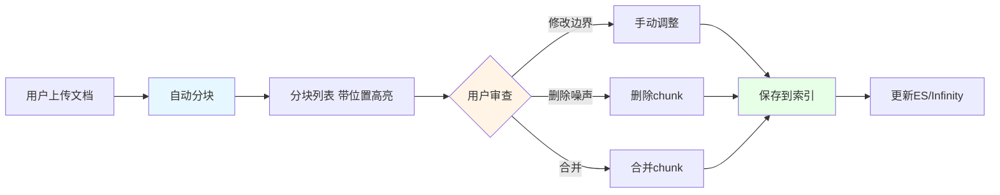

用户可以在前端：
- **调整 chunk 边界**：拖动卡片边缘
- **删除噪声 chunk**：点击删除
- **合并相邻 chunk**：选中多个后合并
- **修改 chunk 内容**：直接编辑文本

> **小结**：RAGFlow 的分块引擎是其"差异化竞争力"的核心之一。14 种分块模板覆盖了 90% 以上的企业文档场景，关键词/问题自动生成进一步提升检索质量，前端可视化让人工干预成为可能。建议在实际项目中：通用文档用 `naive`、学术用 `paper`、合同用 `laws`、简历用 `resume`，并结合可视化界面对分块质量做人工校准。

### 4.10 分块算法的底层数学原理

要真正理解 RAGFlow 各种分块算法的差异，需要了解其背后的数学原理。

#### 4.10.1 Naive 切分

`naive` 是最简单的方法：按字符数或 Token 数定长切分，相邻块保留固定 overlap。

```
原始文本："RAGFlow 是一款企业级 RAG 引擎。它由 infiniflow 开源。"
chunk_size=20, chunk_overlap=5
→ chunk1: "RAGFlow 是一款企业级 RA"
→ chunk2: "企业级 RAG 引擎。它由 infi"
→ chunk3: "由 infiniflow 开源。"
```

优点是速度快、可控；缺点是切分不语义化，可能在句子中间断开。

实现关键：

```python
def chunk(text, size=512, overlap=50):
    tokens = tokenizer.encode(text)
    chunks = []
    i = 0
    while i < len(tokens):
        chunk_tokens = tokens[i:i+size]
        chunks.append(tokenizer.decode(chunk_tokens))
        i += size - overlap
    return chunks
```

#### 4.10.2 句子级切分（Sentence-aware）

在 Naive 基础上，先用句号、问号、感叹号分句，再按 chunk_size 聚合句组，避免在句子中间断开。

```python
def split_sentences(text):
    pattern = r'(?<=[。！？；\n])'
    return [s for s in re.split(pattern, text) if s.strip()]

def chunk_by_sentence(text, size=512):
    sentences = split_sentences(text)
    chunks, current = [], ""
    for s in sentences:
        if len(current) + len(s) > size and current:
            chunks.append(current)
            current = s
        else:
            current += s
    if current:
        chunks.append(current)
    return chunks
```

#### 4.10.3 Q&A 切分

针对问答对文档（如客服 FAQ）。通过模式识别：

- `Q: ... A: ...`
- `问：... 答：...`
- `<question>...</question><answer>...</answer>`

匹配到后，每对 Q&A 是一个 chunk。

#### 4.10.4 表格切分

针对 Markdown/HTML 表格。策略：

1. 若表格行数 ≤ N（如 20），整表作为一个 chunk。
2. 若行数 > N，按行切片，每片保留表头。

```python
def chunk_table(table_html, max_rows=20):
    rows = parse_table_rows(table_html)
    if len(rows) <= max_rows:
        return [table_html]
    header = rows[0]
    body = rows[1:]
    chunks = []
    for i in range(0, len(body), max_rows):
        sub = [header] + body[i:i+max_rows]
        chunks.append(render_table(sub))
    return chunks
```

#### 4.10.5 Manual 切分

针对技术手册、产品手册。按章节切分（识别 `#` `##` `###` Markdown 标题），保留标题作为 chunk 的前置元数据。

#### 4.10.6 Book 切分

针对长篇电子书。先按章节切，再在每个章节内按 size 切。章节标题作为 chunk 的"标题"字段。

#### 4.10.7 Paper 切分

针对学术论文。识别标准结构：

- Abstract（摘要）
- Introduction
- Related Work
- Method
- Experiment
- Conclusion
- References

每个 section 单独切分，并在 chunk metadata 中标注 section_name。

#### 4.10.8 Laws 切分

针对法律法规文档。识别「第 X 条」「第 X 章」「第 X 节」，按"条"作为基本单元。每条作为一个 chunk。

#### 4.10.9 Presentation 切分

针对 PPT。每张幻灯片是一个 chunk，正文取自所有文本框内容。

#### 4.10.10 Resume 切分

针对简历。先用 DeepDoc 的简历解析器抽取结构化字段，再按字段分块（基本信息、教育经历、工作经历、项目经验、技能...）。

#### 4.10.11 Picture 切分

针对图片型 PDF。每张图片作为一个 chunk，关联 OCR 文本作为补充。

#### 4.10.12 One 切分

整篇文档作为一个 chunk，适用于短文本。

#### 4.10.13 Tag 切分

按用户自定义标签切分。文档中标记 `<tag name="...">...</tag>` 的内容作为一个 chunk。

#### 4.10.14 Audio 切分

针对音频转写文本。先按说话人（S1、S2）切分，再按时长切分。

#### 4.10.15 Email 切分

针对邮件。每封邮件是一个 chunk，subject、from、to、body 均为元数据。

#### 4.10.16 KG 切分

针对知识图谱构建。从 chunk 中抽取实体和关系，每个 chunk 包含 `entities` 和 `relations` 列表。

### 4.11 关键词与问题生成

RAGFlow 在分块后，会对每个 chunk 调用 LLM 生成：

- **关键词**（keywords）：3-5 个，逗号分隔。
- **问题**（questions）：3-5 个可由该 chunk 回答的假想问题。

这些 metadata 存储到 `chunk.content_with_weight` 字段（实际是带 `<tags></tags>` 标签的字符串），用于提升检索召回。

```python
async def gen_content_with_weight(content, doc, llm):
    # 关键词
    kw_prompt = f"""请从以下文本中提取 3-5 个核心关键词，用逗号分隔：
{content}
"""
    keywords = await llm.agenerate(kw_prompt)
    
    # 问题
    q_prompt = f"""基于以下文本，生成 3-5 个用户可能提出的问题：
{content}
"""
    questions = await llm.agenerate(q_prompt)
    
    return f"""<tags>{keywords}</tags>
<questions>{questions}</questions>
{content}"""
```

索引时，RAGFlow 同时索引原始内容 + 关键词 + 问题，检索时用问题向量化能匹配到更"用户化"的查询。

### 4.12 分块质量的评估指标

RAGFlow 提供了一套内置的分块质量评估方法（`rag/benchmark/`）：

- **chunk_size 分布**：平均、最大、最小字符数。
- **overlap 覆盖率**：相邻 chunk 之间文本重叠比例。
- **句子完整率**：分块边界与句子边界的重合率。
- **关键词密度**：每个 chunk 平均包含多少关键词。
- **检索召回率**：用一批已知问题测试，看分块检索能找到几个正确答案。

```python
def evaluate_chunking(chunks, ground_truth_qa):
    metrics = {
        "avg_size": np.mean([len(c) for c in chunks]),
        "max_size": max(len(c) for c in chunks),
        "sentence_complete_rate": calc_sentence_complete(chunks),
        "keyword_density": calc_keyword_density(chunks),
        "recall_at_k": calc_recall(chunks, ground_truth_qa, k=10),
    }
    return metrics
```

### 4.13 分块的可视化与人工干预

RAGFlow Web UI 在文档详情页提供分块可视化：

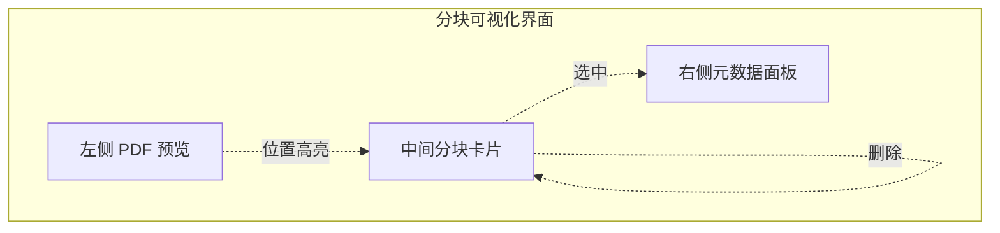

支持的操作：

1. **删除 chunk**：将 chunk 从索引中删除，但保留源文档。
2. **合并 chunk**：将相邻 chunk 合并为一个。
3. **修改 chunk 内容**：直接编辑文本，触发重新向量化。
4. **调整 chunk 顺序**：拖拽排序。
5. **添加人工标签**：通过 `chunk.important_keywords` 字段加权。

### 4.14 分块对检索质量的影响

分块粒度对 RAG 检索质量有巨大影响。RAGFlow 的 14 种模板本质上是"针对不同文档类型的最优分块粒度选择"。

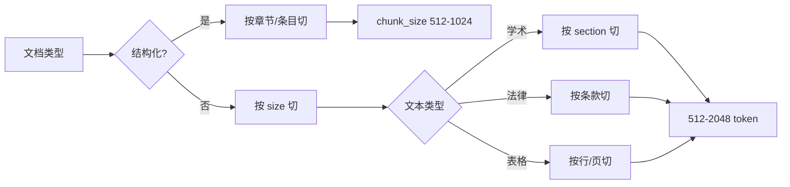

**经验法则**：

- 中文文档：chunk_size 在 256-1024 字符之间。
- 英文文档：chunk_size 在 128-512 token 之间。
- 表格：单表 1 个 chunk，特殊长表按 20 行切片。
- 短答案场景（如 FAQ）：chunk_size 100-200。
- 长上下文问答（如论文）：chunk_size 1500-3000。
- overlap 一般为 chunk_size 的 10-20%。

### 4.15 分块的性能优化

大型文档（1000+ 页）的分块可能耗时。优化手段：

1. **并行分块**：将文档切分为多段，并发处理。
2. **流式分块**：不一次性加载全部文本到内存。
3. **复用 LLM 调用**：相同 chunk 复用 LLM 调用结果。
4. **预计算 Embedding**：解析时同步计算 Embedding，避免重复。

```python
async def parallel_chunk(doc, num_workers=4):
    sections = split_doc_to_sections(doc, num_workers)
    async with asyncio.TaskGroup() as tg:
        tasks = [tg.create_task(chunk_section(s)) for s in sections]
    return merge_chunks([t.result() for t in tasks])
```

---

## 第五章：异步任务系统：Redis Stream 与 Trio

### 5.1 任务调度的设计挑战

RAGFlow 中的"文档解析→分块→Embedding→索引"是一个典型的 **异步、CPU/GPU 密集、可失败需重试** 的长流程。设计时面临四大挑战：

1. **异步解耦**：HTTP 上传接口不能阻塞几十秒。
2. **并发控制**：避免 GPU/CPU 过载。
3. **失败恢复**：任务失败后能重新入队。
4. **进度可观测**：前端要看到"正在解析→50%→完成"。

RAGFlow 的解法是 **Redis Stream（消费者组）+ Trio 异步运行时**。

### 5.2 Redis Stream 消费者组机制

Redis Stream 是 Redis 5.0+ 引入的消息队列，与传统 List+BRPOP 相比：
- 支持消费者组（Consumer Group）
- 支持消息确认（ACK）
- 支持未确认消息重投递

RAGFlow 使用一个 Stream + 一个消费者组：

```python
# 任务入队（生产者）
def queue_tasks(doc, bucket, name, priority):
    ...
    for task in parse_task_array:
        # 计算任务指纹（用于去重）
        task_digest = compute_digest(task, chunking_config)
        task["digest"] = task_digest
        
        # 推送到 Redis Stream
        REDIS_CONN.queue_product(
            get_svr_queue_name(priority),  # "rag_flow_svr_queue" 或 "rag_flow_svr_queue_1"
            message=task,
        )

# 任务消费（消费者）
async def collect():
    """从 Redis Stream 读取任务"""
    # 优先读取未确认的消息（pending）
    msgs = redis.xreadgroup(
        groupname="rag_flow_svr_task_broker",
        consumername=f"task_executor_{CONSUMER_NO}",
        streams={stream_name: "0"},  # "0" 表示 pending
        count=1,
        block=5000,  # 阻塞 5s
    )
    if not msgs:
        # 读新消息
        msgs = redis.xreadgroup(
            groupname="rag_flow_svr_task_broker",
            consumername=f"task_executor_{CONSUMER_NO}",
            streams={stream_name: ">"},  # ">" 表示新消息
            count=1,
            block=5000,
        )
    return msgs
```

**消费者组机制**：

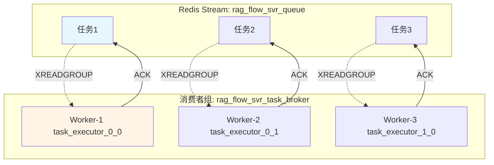

**关键优势**：
- **负载均衡**：每个任务只被一个 Worker 消费。
- **故障转移**：Worker 崩溃后，其未确认消息会被其他 Worker 通过 `XCLAIM` 接管。
- **优先级**：RAGFlow 用两个 Stream（`_queue` 和 `_queue_1`）实现两级优先级。

### 5.3 Trio 异步框架

RAGFlow 在 `task_executor.py` 中使用 **Trio** 而非 asyncio，原因：

| 维度 | Trio | asyncio |
|------|------|---------|
| 嵌套友好 | 原生支持 structured concurrency | 较繁琐 |
| 取消语义 | scope 级别，可靠 | task.cancel() 复杂 |
| 调试 | 异常链清晰 | 容易丢失 |
| 性能 | 略低 | 略高 |

Trio 核心 API：

```python
import trio

async def main():
    # 创建 nursery（托儿所）
    async with trio.open_nursery() as nursery:
        # 启动后台任务
        nursery.start_soon(report_status)  # 定时汇报状态
        
        # 主任务循环
        while not stop_event.is_set():
            await task_limiter.acquire()  # 信号量
            nursery.start_soon(task_manager)  # 任务管理器
    
    logging.error("BUG!!! You should not reach here!!!")
```

### 5.4 多级并发控制（Semaphore）

RAGFlow 使用 **多个 Semaphore** 控制不同资源的并发数：

```python
MAX_CONCURRENT_TASKS = int(os.environ.get('MAX_CONCURRENT_TASKS', "5"))
MAX_CONCURRENT_CHUNK_BUILDERS = int(os.environ.get('MAX_CONCURRENT_CHUNK_BUILDERS', "1"))
MAX_CONCURRENT_MINIO = int(os.environ.get('MAX_CONCURRENT_MINIO', '10'))

task_limiter = trio.CapacityLimiter(MAX_CONCURRENT_TASKS)        # 任务级
chunk_limiter = trio.CapacityLimiter(MAX_CONCURRENT_CHUNK_BUILDERS)  # 分块级
embed_limiter = trio.CapacityLimiter(MAX_CONCURRENT_CHUNK_BUILDERS)  # Embedding级
minio_limiter = trio.CapacityLimiter(MAX_CONCURRENT_MINIO)        # 存储级
kg_limiter = trio.CapacityLimiter(2)                              # 知识图谱级
```

**为什么不都用一个 Semaphore？**

不同资源瓶颈不同：
- **任务总数（5）**：总入口控制
- **分块（1）**：分块涉及深度学习模型推理，过多并发会导致内存爆炸
- **Embedding（1）**：同理
- **MinIO（10）**：I/O 密集，可以多并发
- **知识图谱（2）**：LLM 调用受限

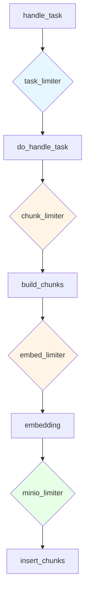

### 5.5 任务生命周期管理

一个任务的完整生命周期：

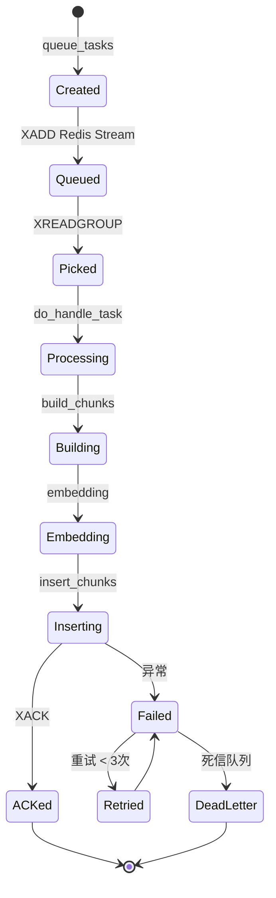

**任务取消**：
```python
def has_canceled(task_id):
    """检查任务是否被取消"""
    return TaskService.get_task(task_id).progress < 0

async def do_handle_task(task):
    progress_callback = partial(set_progress, task_id, task_from_page, task_to_page)
    task_canceled = TaskService.do_cancel(task_id)
    if task_canceled:
        progress_callback(-1, msg="Task has been canceled.")
        return
    # ... 执行 ...
```

### 5.6 优先级队列

RAGFlow 用两个 Stream 实现两级优先级：

```python
def get_svr_queue_name(priority: int) -> str:
    """priority 0 = 普通，1 = 高优先级"""
    return "rag_flow_svr_queue_1" if priority == 1 else "rag_flow_svr_queue"
```

`task_executor.py` 启动时同时监听两个 Stream，优先处理高优先级 Stream。

### 5.7 任务取消与失败恢复

**取消机制**：
```python
# 取消任务
def cancel_task(task_id):
    TaskService.update_by_id(task_id, {"progress": -1.0})
    # Redis 中删除
    REDIS_CONN.delete(f"task:{task_id}")
```

**失败恢复**：
- 短时失败：消费者组自动重投递（`XPENDING` + `XCLAIM`）
- 长时失败：人工在 Web UI 重试（`/v1/document/run` 重新入队）
- 永久失败：标记 `progress=-1`，记录到死信表

### 5.8 心跳与状态上报

```python
WORKER_HEARTBEAT_TIMEOUT = int(os.environ.get('WORKER_HEARTBEAT_TIMEOUT', '120'))

async def report_status():
    """定期上报 Worker 状态"""
    while True:
        await trio.sleep(30)  # 每 30s 上报一次
        status = {
            "consumer_id": CONSUMER_NO,
            "current_tasks": len(CURRENT_TASKS),
            "done_tasks": DONE_TASKS,
            "failed_tasks": FAILED_TASKS,
            "timestamp": time.time(),
        }
        # 写入 Redis
        REDIS_CONN.set(f"worker_status:{CONSUMER_NO}", json.dumps(status), ex=120)
```

`WORKER_HEARTBEAT_TIMEOUT=120` 意味着 120s 未上报心跳视为 Worker 死亡。

### 5.9 任务处理的完整调用栈

```python
async def do_handle_task(task):
    task_id = task["id"]
    progress_callback = partial(set_progress, task_id, ...)
    
    # 1. 取消检查
    if TaskService.do_cancel(task_id):
        return
    
    # 2. 加载 Embedding 模型
    embedding_model = LLMBundle(
        task_tenant_id, LLMType.EMBEDDING,
        llm_name=task_embedding_id, lang=task_language
    )
    vts, _ = embedding_model.encode(["ok"])
    vector_size = len(vts[0])
    
    # 3. 初始化知识库
    init_kb(task, vector_size)
    
    # 4. 根据任务类型分发
    if task.get("task_type", "") == "raptor":
        # RAPTOR 递归抽象
        await do_handle_raptor_task(task, progress_callback)
    elif task.get("task_type", "") == "graphrag":
        # GraphRAG 知识图谱
        await do_handle_graphrag_task(task, progress_callback)
    else:
        # 标准分块
        chunks = await build_chunks(task, progress_callback)
        # Embedding
        token_count, vector_size = await embedding(
            chunks, embedding_model, task_parser_config, progress_callback
        )
    
    # 5. 批量插入
    for b in range(0, len(chunks), DOC_BULK_SIZE):
        doc_store_result = await trio.to_thread.run_sync(
            lambda: settings.docStoreConn.insert(
                chunks[b:b + DOC_BULK_SIZE],
                search.index_name(task_tenant_id),
                task_dataset_id,
            )
        )
        progress_callback(0.8 + 0.1 * b / len(chunks))
    
    # 6. 更新统计
    DocumentService.increment_chunk_num(
        doc_id, task_dataset_id, token_count, len(chunks), 0
    )
```

### 5.10 启动 Task Executor

```bash
# 源码启动
uv run python rag/svr/task_executor.py --workers=5

# Docker 启动
bash docker/launch_backend_service.sh
```

`--workers=5` 启动 5 个进程，每个进程内部又 5 个 task 并发，共 25 个并发处理能力。

### 5.11 任务调度的高级话题

#### 5.11.1 任务去重机制

RAGFlow 使用 `xxhash` 计算任务指纹，相同配置的同一文档的同一范围不会被重复处理：

```python
hasher = xxhash.xxh64()
for field in sorted(chunking_config.keys()):
    if field == "parser_config":
        # 排除 raptor/graphrag 配置（避免递归触发）
        for k in ["raptor", "graphrag"]:
            if k in chunking_config[field]:
                del chunking_config[field][k]
    hasher.update(str(chunking_config[field]).encode("utf-8"))
for field in ["doc_id", "from_page", "to_page"]:
    hasher.update(str(task.get(field, "")).encode("utf-8"))
task_digest = hasher.hexdigest()
```

#### 5.11.2 旧任务复用

如果用户重新上传同一文档，RAGFlow 会复用之前的 chunks，只增量处理新增部分：

```python
prev_tasks = TaskService.get_tasks(doc["id"])
ck_num = 0
if prev_tasks:
    for task in parse_task_array:
        ck_num += reuse_prev_task_chunks(task, prev_tasks, chunking_config)
    TaskService.filter_delete([Task.doc_id == doc["id"]])
    chunk_ids = []
    for task in prev_tasks:
        if task["chunk_ids"]:
            chunk_ids.extend(task["chunk_ids"].split())
    if chunk_ids:
        settings.docStoreConn.delete({"id": chunk_ids}, search.index_name(chunking_config["tenant_id"]), chunking_config["kb_id"])
```

#### 5.11.3 任务优先级实现

```python
# rag/svr/task_executor.py
async def task_manager():
    while True:
        # 1. 优先读高优先级队列
        redis_msg, task = await collect_from_queue("rag_flow_svr_queue_1")
        if not task:
            # 2. 再读低优先级队列
            redis_msg, task = await collect_from_queue("rag_flow_svr_queue")
        if task:
            await handle_task(task, redis_msg)
        else:
            await trio.sleep(1)
```

### 5.12 任务系统的可观测性

RAGFlow 通过以下方式提供任务可观测性：

1. **进度上报**：`set_progress(task_id, prog, msg)` 写入 MySQL，前端轮询显示
2. **日志记录**：每个步骤都有 INFO 级日志
3. **Redis 状态**：Worker 状态实时写入 Redis
4. **失败重试**：异常被记录，3 次重试后入死信
5. **操作日志**：`PipelineOperationLogService.create(...)` 记录完整操作链

```python
def set_progress(task_id, prog: float, msg: str = ""):
    """更新任务进度（前端可查询）"""
    TaskService.update_by_id(task_id, {
        "progress": prog,
        "progress_msg": msg,
    })
```

> **小结**：RAGFlow 的异步任务系统是经典的"消息队列 + 消费者组 + 异步运行时"架构。Redis Stream 的消费者组实现负载均衡与故障转移，Trio 实现 structured concurrency 与细粒度并发控制，多级 Semaphore 隔离不同资源的瓶颈。理解这套机制对调优 RAGFlow 性能至关重要：当发现解析慢时，应该调高 `MAX_CONCURRENT_CHUNK_BUILDERS`（如果显存够）；当发现 Redis 压力大时，调低 `MAX_CONCURRENT_MINIO`。

### 5.10 Trio 的设计哲学

RAGFlow 选择 Trio 而非标准库 asyncio，背后有其工程考量。Trio 的核心哲学是 **structured concurrency**（结构化并发）：

#### 5.10.1 Trio vs asyncio 对比

| 维度 | asyncio | Trio |
|------|---------|------|
| 嵌套任务 | 容易泄漏 | 自动嵌套作用域 |
| 错误传播 | 复杂 | 任务组自动传播 |
| 取消语义 | 不一致 | 统一 scope 内取消 |
| 同步原语 | 自实现 | 内置 `Event`/`Semaphore`/`Lock`/`CapacityLimiter` |
| 学习曲线 | 陡峭 | 平缓 |
| 生态 | 庞大 | 较小 |

#### 5.10.2 Trio 的核心概念

```python
import trio

async def main():
    # 三种 scope：CancelScope、TimeoutScope
    async with trio.open_nursery() as nursery:
        # 并发执行子任务
        nursery.start_soon(task1)
        nursery.start_soon(task2)
        # 任一子任务异常会传播到 nursery，所有兄弟任务被取消
        # 等待 nursery 内所有任务完成
```

Trio 的设计精髓是「**nursery（托儿所）**」：

- 所有子任务必须在 nursery 内启动。
- nursery 退出时自动等待所有子任务完成。
- 任一子任务抛异常，整个 nursery 立即取消其他兄弟任务并重新抛异常。

#### 5.10.3 在 RAGFlow 中的应用

`task_executor.py` 中大量使用 nursery 实现并发：

```python
async with trio.open_nursery() as nursery:
    # 同时启动 5 个 chunk builder
    for chunk in chunks:
        nursery.start_soon(
            build_chunk,
            chunk,
            limiter=chunker_limiter,  # 限制并发
        )
```

#### 5.10.4 CapacityLimiter 详解

Trio 的 `CapacityLimiter` 是带计数的 Semaphore：

```python
# 限制 LLM 调用并发为 10
llm_limiter = trio.CapacityLimiter(10)

async def call_llm(prompt):
    async with llm_limiter:
        return await llm.agenerate(prompt)
```

当 11 个并发调用同时到达时，第 11 个会阻塞在 `async with` 处，直到前 10 个中有一个完成。

#### 5.10.5 task_status 协议

Trio 的 `nursery.start_soon` 还支持 `task_status` 参数，用于在子任务初始化完成后才让父任务继续：

```python
async def worker(name, task_status=trio.TASK_STATUS_IGNORED):
    await trio.sleep(0.1)  # 初始化
    task_status.started()  # 通知已就绪
    # 真正工作
    await trio.sleep_forever()

async with trio.open_nursery() as nursery:
    nursery.start_soon(worker, "A")
    nursery.start_soon(worker, "B")
    # 此时 A、B 都已就绪
```

RAGFlow 用这个模式确保 worker 启动后再投递任务。

### 5.11 Redis Stream 深度原理

RAGFlow 的队列基于 Redis Stream。下面从底层数据结构到 API 行为逐一拆解。

#### 5.11.1 Stream 内部结构

Redis Stream 本质是一个 append-only 的 log：

```
XADD ragflow_q * type=parse doc_id=abc chunk=0
XADD ragflow_q * type=parse doc_id=abc chunk=1
XADD ragflow_q * type=chunk  doc_id=abc
```

每条消息都有唯一 ID（毫秒级时间戳 + 序列号），可按 ID 区间消费。

#### 5.11.2 消费者组（Consumer Group）

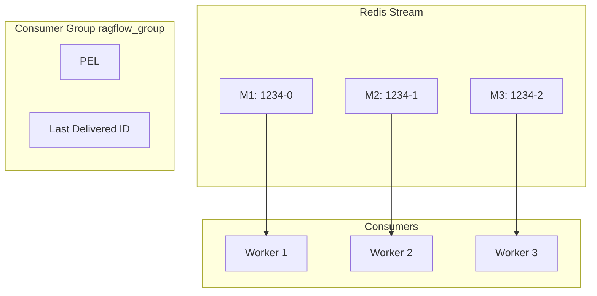

消费者组是 Redis Stream 实现「多消费者负载均衡」的关键：

- 组内有 PEL（Pending Entries List）记录已分配但未 ACK 的消息。
- 消费者组按「最少 pending」策略分配新消息给 worker。
- 消息 ACK 后从 PEL 移除。
- 未 ACK 的消息可被 XCLAIM 重新分配给其他 worker。

#### 5.11.3 关键命令

```python
# 1. 创建消费者组（如果不存在）
try:
    redis.xgroup_create("ragflow_q", "ragflow_group", id="0", mkstream=True)
except ResponseError:
    pass

# 2. 消费消息（阻塞模式，最多阻塞 5s）
messages = redis.xreadgroup(
    "ragflow_group",
    consumer_name,  # 每个 worker 唯一
    {"ragflow_q": ">"},
    count=1,
    block=5000,
)

# 3. 处理消息
for stream, entries in messages:
    for msg_id, data in entries:
        try:
            process(data)
            redis.xack("ragflow_q", "ragflow_group", msg_id)  # ACK
        except Exception as e:
            log.error(e)
            # 不 ACK，下一轮会被 XCLAIM

# 4. 重新分配（故障转移）
redis.xautoclaim("ragflow_q", "ragflow_group", new_consumer, min_idle_time=60000)
```

#### 5.11.4 消息格式

RAGFlow 的消息体是 JSON 字符串，典型字段：

```json
{
    "id": "doc_abc123",
    "kb_id": "kb_001",
    "tenant_id": "tenant_001",
    "parser_id": "naive",
    "parser_config": {"chunk_token_num": 512},
    "name": "manual.pdf",
    "type": "pdf",
    "location": "s3://ragflow/manual.pdf",
    "size": 1024000,
    "created_by": "user_001"
}
```

#### 5.11.5 任务优先级

RAGFlow 当前所有任务在同一 Stream（`ragflow_q`），通过 FIFO 处理。优先级队列的实现思路：

- 高优消息发送到独立 Stream：`ragflow_q_high`。
- worker 优先 `XREADGROUP ragflow_q_high`，再 `ragflow_q_normal`。

未来可能引入更复杂的多级队列。

### 5.12 任务的失败与重试

RAGFlow 的任务失败处理遵循「指数退避 + 死信队列」原则。

#### 5.12.1 任务状态机

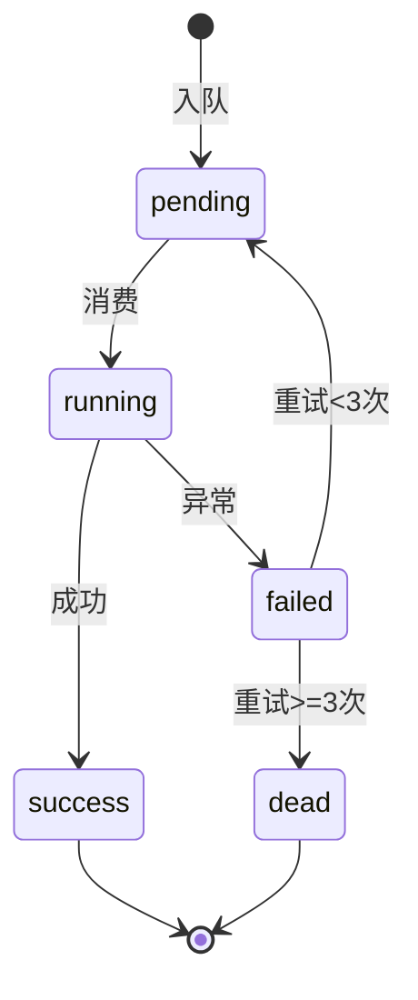

#### 5.12.2 重试实现

`task_executor.py` 中的重试逻辑：

```python
@retry(
    stop=stop_after_attempt(3),
    wait=wait_exponential(multiplier=1, min=1, max=10),
    retry=retry_if_exception_type((RequestError, TimeoutError))
)
async def do_task(data):
    # 任务逻辑
    ...
```

#### 5.12.3 死信队列

重试 3 次后仍失败的消息会被移到 `ragflow_q_dlq`：

```python
except RetryError:
    redis.xadd("ragflow_q_dlq", {
        "original_msg": json.dumps(data),
        "error": str(e),
        "failed_at": datetime.now().isoformat(),
    })
    DocumentService.update(doc_id, {"run": "FAIL", "progress_msg": str(e)})
```

运维人员可定期检查 `ragflow_q_dlq` 并人工干预。

### 5.13 任务监控与指标

`ragflow_svr.py`（任务执行器）暴露了 Prometheus 指标：

```python
from prometheus_client import Counter, Histogram

TASKS_TOTAL = Counter("ragflow_tasks_total", "Total tasks", ["type", "status"])
TASK_DURATION = Histogram("ragflow_task_duration_seconds", "Task duration", ["type"])

@TASK_DURATION.labels(type="parse").time()
async def do_parse(data):
    ...
    TASKS_TOTAL.labels(type="parse", status="success").inc()
```

关键指标：

- `ragflow_tasks_total{type=parse,status=success}`：成功解析任务数。
- `ragflow_tasks_total{type=parse,status=fail}`：失败任务数。
- `ragflow_task_duration_seconds_bucket{type=parse,le=...}`：解析时长分布。
- `redis_stream_pending_count`：流中待处理消息数。
- `ragflow_queue_size`：队列长度。

运维人员可基于这些指标设置 Grafana 仪表盘与告警。

### 5.14 任务执行器的水平扩展

RAGFlow 任务执行器是无状态服务，可水平扩展。部署多个副本时：

1. **副本命名**：每个 worker 用唯一 consumer_name（如 `worker-0`、`worker-1`）。
2. **自动负载均衡**：Redis Stream 消费者组自动将消息分给空闲 worker。
3. **故障转移**：worker 崩溃后，其 PEL 中的消息会被其他 worker 通过 XCLAIM 接管。
4. **CPU 亲和性**：建议 worker 数 = CPU 核数，过多反而因 GIL 竞争降低性能。

```yaml
# docker-compose.yml
services:
  task_executor_1:
    image: infiniflow/ragflow:latest
    command: task_executor -n worker-0
  task_executor_2:
    image: infiniflow/ragflow:latest
    command: task_executor -n worker-1
```

### 5.15 大规模任务的批量优化

百万级文档的批量处理可大幅提速：

```python
async def batch_build_index(chunks, batch_size=1000):
    # 1. 批量调用 Embedding API
    vectors = await embedding_model.embed_batch(chunks[:batch_size])
    # 2. 批量写入 ES
    es.bulk(index="chunks", body=vectors, refresh=False)
    # 3. 游标推进
    return batch_build_index(chunks[batch_size:])
```

ES Bulk API 默认上限 100MB，建议每批 500-5000 个 chunk。Infinity 同样支持 `INSERT INTO ... VALUES` 批量插入。

### 5.16 任务调度与定时任务

RAGFlow 自身不提供定时任务（如「每天凌晨 2 点重建索引」），但提供了两个扩展点：

1. **外部调度器**：使用 `cron` + `curl` 调用 RAGFlow API 触发。
2. **内置任务**：v0.20+ 引入 `MEMORY` 任务（清理过期的 Agent 记忆）和 `DELETE_DOC` 任务（清理已删除文档的物理资源），由 Task Executor 启动时自动加入 Stream。

```python
# rag/svr/task_executor.py 启动时
async def schedule_periodic_tasks():
    async with trio.open_nursery() as nursery:
        nursery.start_soon(memory_cleanup_worker)  # 每天执行一次
        nursery.start_soon(deleted_doc_worker)     # 每小时执行一次
```

---

## 第六章：检索召回机制

### 6.1 检索入口：Dealer

RAGFlow 检索的核心实现在 `rag/nlp/search.py` 的 `Dealer` 类。`Dealer` 是"检索代理商"，负责串联查询处理、混合检索、重排序的全过程。

```python
class Dealer:
    def __init__(self, dataStore, llm_id, embd_id, ...):
        self.dataStore = dataStore        # ES / Infinity
        self.llm_bundle = LLMBundle(...)  # Chat 模型
        self.embd_mdl = LLMBundle(...)    # Embedding 模型
        self.rerank_mdl = LLMBundle(...)  # Rerank 模型
        self.tw = tokenizer               # 分词器
        self.syn = synonym                # 同义词库
    
    def search(self, req, idx_names, kb_ids, emb_mdl=None, 
               highlight=False, rank_feature=None):
        # ... 见下文
```

### 6.2 检索参数处理

在调用 `Dealer.search()` 之前，`chat()` 函数会对请求做预处理：

```python
# api/db/services/dialog_service.py
async def chat(dia, msg, stream=True, **kwargs):
    req = {
        "question": msg[-1]["content"],
        "kb_ids": dia.kb_ids,
        "top_k": dia.top_k,            # 默认 1024
        "top_n": dia.top_n,            # 默认 6（最终返回给 LLM 的 chunk 数）
        "rerank_id": dia.rerank_id,    # 可选
        "vector_similarity_weight": dia.vector_similarity_weight,  # 0.3 默认
        "similarity_threshold": dia.similarity_threshold,          # 0.1 默认
    }
    
    # 1. 模型一致性校验（多知识库检索时强制）
    embd_ids = set()
    for kb_id in req["kb_ids"]:
        embd_id = KnowledgebaseService.get_embd_id(kb_id)
        embd_ids.add(embd_id)
    if len(embd_ids) > 1:
        raise ValueError(f"知识库使用不同的 Embedding 模型: {embd_ids}")
    
    # 2. 初始化模型
    embd_mdl = LLMBundle(tenant_id, LLMType.EMBEDDING, llm_name=embd_ids.pop())
    rerank_mdl = LLMBundle(tenant_id, LLMType.RERANK, llm_name=rerank_id) if rerank_id else None
    chat_mdl = LLMBundle(tenant_id, LLMType.CHAT, llm_name=dia.llm_id)
    
    # 3. 查询增强（可选）
    if req.get("query_enhancement"):
        enhanced = await query_enhance(chat_mdl, req["question"])
        req["question"] = enhanced
    
    # 4. 调用 Dealer.search
    dealer = Dealer(settings.docStoreConn, dia.llm_id, embd_id, ...)
    sres = await dealer.search(req, ...)
    
    # 5. 后续处理（重排序、引用插入、prompt 组装）
    ...
```

### 6.3 查询处理与分词

`Dealer.search()` 的查询处理阶段：

```python
def search(self, req, idx_names, kb_ids, ...):
    # 1. 参数解析
    pg = int(req.get("page", 1)) - 1     # 页码（0-indexed）
    topk = int(req.get("top_k", 1024))  # 初始召回量
    ps = int(req.get("size", topk))     # 返回结果大小
    offset, limit = pg * ps, ps
    
    # 2. 过滤条件
    filters = self.get_filters(req)
    
    # 3. 查询处理（核心）
    if not req.get("question"):  # 无查询词的简单搜索
        # 仅按元数据过滤返回
        matchExprs = [filters]
    else:
        # 有查询词的智能搜索
        # 3.1 规范化查询文本
        question = req["question"]
        question = re.sub(r"[ \t]+", " ", question)  # 多空格归一
        if is_english(question):
            question = re.sub(r"[^a-zA-Z0-9\s\-\.\,\!\?]", " ", question)  # 英文去特殊字符
        
        # 3.2 分词（中文 + 英文）
        # 英文：按空格分
        # 中文：分词器
        tokens = self.tw.tokenize(question)
        
        # 3.3 同义词扩展
        expanded_tokens = []
        for tk in tokens:
            expanded_tokens.append(tk)
            syns = self.syn.lookup(tk)  # 查同义词表
            for s in syns:
                expanded_tokens.append(f"{tk} {s}")  # 加 1/4 权重
        # 如 "客服" → "客服 服务 支持"
        
        # 3.4 关键词权重
        self.tw.weights  # 包含 IDF 等权重
```

**`rag_tokenizer.weights` 的实现**：

```python
class RagTokenizer:
    def __init__(self):
        self.weights = {}  # token → 权重
    
    def tokenize(self, text):
        """分词并返回 token 列表"""
        tokens = []
        # 中文：jieba 分词
        for tk in jieba.cut(text):
            tk = tk.strip().lower()
            if not tk or tk in STOP_WORDS:
                continue
            tokens.append(tk)
        return tokens
    
    def fine_grained_tokenize(self, tokens):
        """细粒度分词（用于二次精确匹配）"""
        fine_tokens = []
        for tk in tokens:
            # 拆分为单字
            for c in tk:
                fine_tokens.append(c)
        return fine_tokens
```

### 6.4 全文检索（BM25 / 稀疏向量）

RAGFlow 在 `Dealer.search()` 中构建 Elasticsearch 查询：

```python
# 构建 matchText（全文检索表达式）
matchText = MatchTextExpr(
    query_text=" ".join(expanded_tokens),
    # 字段权重
    fields={
        "content_ltks": 1.0,           # 内容
        "title_tks": 0.5,              # 标题
        "important_kwd": 0.3,          # 关键词
        "questions": 0.3,              # 自动问题
    },
    minimum_should_match="30%",       # 30% 词命中
    operator="or",
)
```

**注意**：v0.20+ 后，RAGFlow 在 ES 中使用 **稀疏向量（Sparse Vector）** 而非传统倒排索引的 BM25，性能更高。这是通过 Elasticsearch 8.x 的 `sparse_vector` 字段实现的（实际是 SPLADE 模型生成的稀疏向量）。

### 6.5 向量检索（稠密）

```python
# 1. 查询向量化
query_vector = self.embd_mdl.encode([question])[0]
vector_size = len(query_vector)

# 2. 构建 matchDense（向量检索表达式）
matchDense = MatchDenseExpr(
    query_vector=query_vector,
    field_name=f"q_{vector_size}_vec",  # 字段名
    top_k=topk,
    similarity="cosine",
)
```

### 6.6 混合检索：FusionExpr

RAGFlow 真正的"杀手锏"是 **FusionExpr**——将多种检索结果融合：

```python
# 默认权重：5% 文本 + 95% 向量
fusionExpr = FusionExpr(
    method="weighted_sum",
    topk=topk,
    weights="0.05,0.95",  # 文本权重, 向量权重
)

# 融合两种检索
matchExprs = [matchText, matchDense, fusionExpr]

# 执行检索
res = self.dataStore.search(
    src=src,                  # 返回字段
    highlightFields=...,
    filters=filters,          # 元数据过滤
    matchExprs=matchExprs,    # 多个检索表达式
    orderBy=orderBy,
    offset=offset,
    limit=limit,
)
```

**FusionExpr 的可配置性**：
- 方法：`weighted_sum` / `rrf`（倒数排名融合）
- 权重：可动态调整（如 0.3 vs 0.7 vs 0.5 vs 0.5）
- 字段：可包含多个不同字段的向量

### 6.7 空结果回退策略

```python
# 如果混合检索无结果，自动降级
if not res.total or res.total == 0:
    # 1. 降低匹配阈值
    matchText.minimum_should_match = "10%"  # 30% → 10%
    matchDense.similarity_threshold = 0.17   # 0.1 → 0.17
    
    # 2. 重新检索
    res = self.dataStore.search(...)
    
    # 3. 如果还是空，切换简单模式
    if not res.total:
        res = self.dataStore.search(
            matchExprs=[matchText],  # 仅文本
            ...
        )
```

**"永不空答"的设计哲学**：RAGFlow 宁可返回低质量结果，也不返回"我不知道"，但前端会给出"匹配度较低"的提示。

### 6.8 Infinity 引擎

Infinity 是 RAGFlow 母公司自研的 AI 原生数据库，**专为 RAG 设计**：

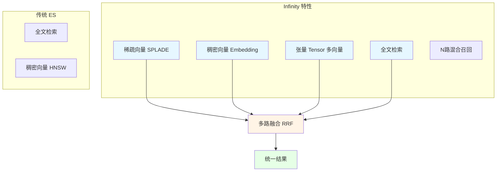

**Infinity vs Elasticsearch**：

| 维度 | Infinity | Elasticsearch |
|------|----------|---------------|
| 混合检索 | 原生 N 路召回 | 需手动组合 |
| 稀疏向量 | 原生支持 | 第三方插件 |
| 多向量 | Tensor 类型 | 不支持 |
| 性能 | 更快（Go + C++）| 中等（Java）|
| 生态 | 较新 | 成熟 |
| 学习曲线 | 较陡 | 平缓 |

RAGFlow 默认推荐 Infinity，但提供 ES 作为备选（`docStoreConn` 抽象层切换）。

### 6.9 多知识库检索与一致性校验

当用户配置多个知识库时，RAGFlow 会做：

```python
# 1. 收集所有知识库的 Embedding 模型
embd_ids = set()
for kb_id in kb_ids:
    embd_id = KnowledgebaseService.get_embd_id(kb_id)
    embd_ids.add(embd_id)

# 2. 一致性校验
if len(embd_ids) > 1:
    raise ValueError(f"知识库使用不同的 Embedding 模型: {embd_ids}")
```

**为什么必须一致？** 不同 Embedding 模型产生的向量空间不同，混用会导致"同义不同向量"，检索准确率断崖式下降。

### 6.10 检索的完整调用栈

```mermaid
sequenceDiagram
    participant U as User
    participant A as API Server
    participant D as Dealer
    participant Q as Query
    participant DS as DocStore
    participant E as Embedding

    U->>A: POST /v1/conversation/completion
    A->>A: 参数解析、模型校验
    A->>D: Dealer.search()
    D->>Q: 分词、同义词扩展
    D->>E: encode(question)
    E-->>D: query_vector
    D->>DS: search(matchText + matchDense + fusionExpr)
    DS-->>D: 混合结果
    D->>D: rerank() 重排序
    D-->>A: SearchResult
    A->>A: prompt 组装
    A->>A: LLM 生成
    A-->>U: 流式响应
```

### 6.11 查询增强（Query Enhancement）

RAGFlow 支持两种查询增强：

**1. 同义词扩展**（内置）：
```python
# 英文同义词库
SYNONYMS = {
    "car": ["vehicle", "auto", "automobile"],
    "phone": ["mobile", "cellphone", "tel"],
    "AI": ["artificial intelligence", "machine intelligence"],
}

# 中文同义词库（自构建）
SYNONYMS_CN = {
    "手机": ["移动电话", "电话"],
    "电脑": ["计算机", "PC"],
    "人工智能": ["AI", "机器智能"],
}

def expand_query(tokens):
    expanded = []
    for tk in tokens:
        expanded.append(tk)
        if tk in SYNONYMS:
            for syn in SYNONYMS[tk]:
                expanded.append(syn)  # 加 1/4 权重
    return expanded
```

**2. LLM 查询增强**（v0.20+）：
```python
async def query_enhance(chat_mdl, question):
    """用 LLM 改写查询，使其更适合检索"""
    prompt = f"""请将以下用户问题改写为更适合知识库检索的查询形式。
要求：
1. 保留核心意图
2. 添加关键同义词
3. 删除口语化表达
    
原问题：{question}
改写后："""
    return await chat_mdl.chat(prompt)
```

### 6.12 检索性能优化

RAGFlow 在工程层做了多项检索性能优化：

1. **HNSW 索引参数调优**：
```yaml
index_type: HNSW
params:
  M: 16              # 节点连接数
  efConstruction: 200 # 构建搜索宽度
  efSearch: 100       # 检索搜索宽度
```

2. **批量 Embedding 缓存**：
```python
# 缓存查询向量
query_vector_cache = {}
def get_query_vector(question):
    if question not in query_vector_cache:
        query_vector_cache[question] = embd_mdl.encode([question])[0]
    return query_vector_cache[question]
```

3. **异步预检索**：
```python
# 在用户输入时就开始预检索
async def pre_search(question):
    # 异步执行，不阻塞 UI
    return await dealer.search(...)
```

> **小结**：RAGFlow 的检索核心是 **Dealer 类**，实现"查询处理 + 混合检索 + 重排序"的完整链路。关键技术点：稀疏+稠密双路召回（FusionExpr，5%/95% 默认权重）、多知识库 Embedding 一致性校验、空结果自动降级回退。Infinity 的引入是 RAGFlow 对 Elasticsearch 的"换道超车"，但 ES 仍作为可选后端保留。

### 6.11 向量相似度计算详解

向量检索的核心是相似度计算。RAGFlow 主要使用三种相似度度量。

#### 6.11.1 余弦相似度（Cosine Similarity）

最常用的相似度。给定两个向量 $A$ 和 $B$：

$$\text{cosine}(A, B) = \frac{A \cdot B}{||A|| \cdot ||B||}$$

范围 [-1, 1]，值越大越相似。优点：忽略向量长度，仅关注方向。RAGFlow 默认 Embedding 模型的输出已经是 L2 归一化的向量，所以直接点积即可。

#### 6.11.2 欧氏距离（Euclidean Distance）

$$d(A, B) = \sqrt{\sum_{i=1}^{n} (A_i - B_i)^2}$$

值越小越相似。RAGFlow 中部分模型（如 BGE-M3）会同时输出稠密向量与 colbert 向量，前者用 cosine，后者用 cosine 后加权求和。

#### 6.11.3 内积（Inner Product / Dot Product）

$$\text{dot}(A, B) = \sum_{i=1}^{n} A_i \cdot B_i$$

归一化向量下与 cosine 等价。RAGFlow 在 ES 中用 `cosineSimilarity` 函数实现；在 Infinity 中通过 `DISTANCE` 表达式指定。

#### 6.11.4 HNSW 算法实现近似最近邻

RAGFlow 底层使用 HNSW（Hierarchical Navigable Small World）算法实现 ANN 检索：

```mermaid
graph TB
    subgraph L0[Layer 0 - 底层]
        A0[Node A]
        B0[Node B]
        C0[Node C]
        D0[Node D]
        E0[Node E]
        F0[Node F]
        G0[Node G]
    end
    subgraph L1[Layer 1 - 中层]
        A1[Node A]
        C1[Node C]
        E1[Node E]
    end
    subgraph L2[Layer 2 - 顶层]
        A2[Node A]
        E2[Node E]
    end
    A2 -.-> A1
    A2 -.-> E1
    A1 -.-> A0
    A1 -.-> B0
    A1 -.-> C0
    E1 -.-> D0
    E1 -.-> E0
    E1 -.-> F0
    E1 -.-> G0
    B0 -.-> C0
    C0 -.-> D0
    D0 -.-> E0
    F0 -.-> G0
```

HNSW 通过多层图（高层是低层子集）实现快速 ANN 检索：

- 搜索时从顶层入口出发，每层贪心找最近邻，到达局部最优后下到下一层。
- 平均时间复杂度 $O(\log N)$，远优于 $O(N)$ 的精确最近邻。

ES 与 Infinity 都使用 HNSW 实现向量索引：

- ES：`index_options.type=hnsw`、`m=16`、`ef_construction=100`。
- Infinity：默认 `M=16`、`ef_construction=100`、`ef_search=20`。

#### 6.11.5 向量量化的工程实践

百万级向量的内存占用很可观（1M × 768 维 × 4 字节 ≈ 3GB）。RAGFlow 在 Infinity 后端支持：

- **SQ8（8-bit Scalar Quantization）**：将 FP32 量化到 INT8，内存降为 1/4，召回率损失 < 5%。
- **BQ（Binary Quantization）**：将 FP32 量化到 BIT，内存降为 1/32，召回率损失 10-20%。
- **RabitQ**：Google 提出的高质量量化算法，4-bit 量化召回率损失 < 3%。

```python
# Infinity 量化索引创建
table.create_index(
    "chunks_idx",
    fields={"q_vec_768": {"type": "vector", "dim": 768, "index_type": "HNSW", "metric": "cosine", "quantization": "SQ8"}},
)
```

### 6.12 全文检索原理

RAGFlow 同时支持稀疏向量检索（全文）与稠密向量检索（语义），二者通过 FusionExpr 融合。

#### 6.12.1 ES 全文检索实现

ES 使用 BM25 算法实现全文检索。BM25 来自 TF-IDF 改进：

$$\text{BM25}(D, Q) = \sum_{t \in Q} \text{IDF}(t) \cdot \frac{f(t, D) \cdot (k_1 + 1)}{f(t, D) + k_1 \cdot (1 - b + b \cdot \frac{|D|}{\text{avgdl}})}$$

其中：

- $f(t, D)$：词 t 在文档 D 中的频率。
- $|D|$：文档 D 长度。
- $\text{avgdl}$：平均文档长度。
- $k_1$、$b$：超参数（ES 默认 $k_1=1.2$, $b=0.75$）。
- $\text{IDF}(t) = \log \frac{N - n(t) + 0.5}{n(t) + 0.5}$：逆文档频率。

RAGFlow 在 ES 中为每个 chunk 字段建立倒排索引：

```python
es_mapping = {
    "mappings": {
        "properties": {
            "content_with_weight": {
                "type": "text",
                "analyzer": "ik_max_word",  # IK 中文分词
            },
            "title_tks": {"type": "text"},
            "questions": {"type": "text"},
            "important_keywords": {"type": "text"},
        }
    }
}
```

#### 6.12.2 中文分词器

RAGFlow 默认使用 **IK Analyzer** 插件（`analysis-ik`）进行中文分词。IK 提供两种分词模式：

- `ik_max_word`：细粒度分词（最大化切分）。
- `ik_smart`：粗粒度分词（语义单元）。

RAGFlow 在索引时用 `ik_max_word` 提高召回，在查询时用 `ik_smart` 提高精度。

#### 6.12.3 Infinity 全文检索

Infinity 自研的中文分词算法基于 BPE（Byte Pair Encoding）+ 字符 n-gram 混合策略，效率高于 IK。

```python
# Infinity 中创建带分词的字段
fields = {
    "content": {
        "type": "varchar",
        "analyzer": "chinese"  # 内置中文分词
    }
}
```

### 6.13 向量与全文的融合检索

RAGFlow 最重要的创新之一是**向量 + 全文的融合检索**。

#### 6.13.1 融合公式

RAGFlow 默认采用加权求和融合：

$$\text{score}_{\text{final}} = \alpha \cdot \text{score}_{\text{vector}} + (1 - \alpha) \cdot \text{score}_{\text{bm25}}$$

默认 $\alpha = 0.95$（向量主导，全文补充）。在 `Knowledgebase.vector_similarity_weight` 中可调。

#### 6.13.2 融合的实现

ES 中通过 `function_score` 查询实现：

```json
{
  "query": {
    "function_score": {
      "query": {
        "bool": {
          "should": [
            {"match": {"content_with_weight": "用户问题"}},
            {"knn": {"field": "q_vec_768", "query_vector": [...], "k": 50}}
          ]
        }
      },
      "functions": [
        {"script_score": {"script": {"source": "_score * 0.05"}}},
        {"script_score": {"script": {"source": "_score * 0.95"}}}
      ],
      "score_mode": "sum",
      "boost_mode": "multiply"
    }
  }
}
```

Infinity 中通过 `FusionExpr` 实现：

```python
result = table.search(
    filter="MATCH(content, 'query') OR MATCH(q_vec_768, [vec], 'cosine', 0.8)",
    fusion=FusionExpr(method="weighted_sum", weights=[0.05, 0.95]),
    topn=50,
)
```

#### 6.13.3 RRF 融合（Reciprocal Rank Fusion）

除了加权求和，RAGFlow 还支持 RRF 融合：

```python
FusionExpr(method="rrf", k=60)
```

RRF 公式：

$$\text{rrf\_score}(d) = \sum_{r=1}^{n} \frac{1}{k + r_r(d)}$$

其中 $r_r(d)$ 是文档 d 在第 r 路检索中的排名。RRF 的优点是不需要归一化分数，缺点是不考虑分数差异。

#### 6.13.4 经验调参

| 场景 | $\alpha$ | 备注 |
|------|---------|------|
| 通用文档 | 0.95 | 向量主导 |
| 短查询（如专有名词）| 0.5 | 全文补充 |
| 长查询（自然语言）| 0.9 | 向量主导 |
| 精确词匹配（如产品型号）| 0.3 | 全文主导 |
| 多语种 | 0.7 | 跨语言向量重要 |

### 6.14 查询改写与多轮对话

`rag/nlp/query.py` 中实现了多个查询优化技术。

#### 6.14.1 Query 改写

```python
async def rewrite(question, history, llm):
    """根据对话历史重写问题，使其独立、可检索"""
    history_str = "\n".join([f"{m.role}: {m.content}" for m in history[-3:]])
    prompt = f"""基于以下对话历史，将用户最后的问题改写为一个独立的问题。
对话历史：
{history_str}
最后的问题：{question}
改写后的问题："""
    return await llm.agenerate(prompt)
```

#### 6.14.2 HyDE（Hypothetical Document Embeddings）

HyDE 是一种通过生成「假想文档」提升检索质量的方法：

```python
async def hyde(question, llm):
    """生成假想答案，然后向量化假想答案而非问题"""
    hypothetical = await llm.agenerate(
        f"请用 100 字回答以下问题：{question}"
    )
    return await embedding_model.embed(hypothetical)
```

原理：问题与答案在向量空间中距离较远，但假想答案与真实答案的向量距离更近，检索召回率更高。

#### 6.14.3 Step-back Prompting

先抽象问题再检索：

```python
async def step_back(question, llm):
    """先问一个抽象问题，再问具体问题"""
    abstract = await llm.agenerate(
        f"请把以下具体问题抽象为一个更通用的问题：{question}"
    )
    return [question, abstract]
```

#### 6.14.4 多查询扩展

通过 LLM 生成多个相关问题，合并去重后检索：

```python
async def multi_query(question, llm, n=3):
    """生成 n 个相似问题"""
    prompt = f"""基于以下问题，生成 {n} 个语义相似但表述不同的问题：
{question}
"""
    queries = await llm.agenerate(prompt)
    return [question] + queries
```

### 6.15 检索结果的多样性控制

单纯的 top-k 检索会返回重复内容。RAGFlow 使用 **MMR（Maximal Marginal Relevance）** 提升多样性：

```python
def mmr(query_vec, doc_vecs, doc_ids, lambda_param=0.5, top_n=10):
    """Maximal Marginal Relevance"""
    selected = []
    candidates = list(range(len(doc_vecs)))
    while len(selected) < top_n and candidates:
        scores = []
        for c in candidates:
            relevance = cosine(query_vec, doc_vecs[c])
            if selected:
                max_sim = max([cosine(doc_vecs[c], doc_vecs[s]) for s in selected])
                mmr_score = lambda_param * relevance - (1 - lambda_param) * max_sim
            else:
                mmr_score = relevance
            scores.append(mmr_score)
        best = candidates[scores.index(max(scores))]
        selected.append(best)
        candidates.remove(best)
    return [doc_ids[i] for i in selected]
```

`lambda_param=0.5` 平衡相关性与多样性。生产环境可调高到 0.7 增强相关性，调低到 0.3 增强多样性。

### 6.16 检索缓存与加速

#### 6.16.1 查询缓存

RAGFlow 在 Redis 中缓存查询结果：

```python
async def cached_search(question, kb_id, ttl=300):
    cache_key = f"search:{kb_id}:{hash(question)}"
    cached = await redis.get(cache_key)
    if cached:
        return json.loads(cached)
    
    result = await dealer.search(question, kb_id)
    await redis.setex(cache_key, ttl, json.dumps(result))
    return result
```

TTL 默认 300 秒。命中率高的查询（如热门 FAQ）能显著降低延迟。

#### 6.16.2 检索加速

- **预热**：系统启动时为热点知识库预热 ES/Infinity 缓存。
- **粗排 → 精排**：先用 BM25 召回 1000 个候选，再用向量精排 top 50。
- **多线程并发**：多个知识库检索时并发执行。
- **GPU 加速 Embedding**：使用 GPU 编码查询向量，延迟 < 50ms。

### 6.17 检索的兜底与降级

当主要检索失败时，RAGFlow 设计了多层降级：

```mermaid
graph TB
    A[用户查询] --> B{向量检索}
    B -- 成功且分数>0.7 --> Z1[返回结果]
    B -- 失败或低分 --> C{全文检索}
    C -- 成功且分数>0.5 --> Z1
    C -- 失败 --> D{GraphRAG 查询}
    D -- 成功 --> Z1
    D -- 失败 --> E{空结果兜底}
    E --> F[返回: 抱歉未找到相关信息]
```

具体降级策略：

1. **向量检索失败**：可能是 ES/Infinity 不可用或网络问题，自动切到 BM25。
2. **BM25 无结果**：可能是分词失败或词表不匹配，启用全表扫描。
3. **所有检索失败**：返回"未找到相关信息"，让 LLM 自行回答。
4. **结果数 < top_k**：补全到 top_k（即使分数很低）。

```python
async def search_with_fallback(question, kb_id):
    try:
        result = await dealer.search(question, kb_id, top_k=10)
        if result:
            return result
    except Exception:
        pass
    
    try:
        result = await dealer.search_fulltext(question, kb_id, top_k=10)
        if result:
            return result
    except Exception:
        pass
    
    return []  # 兜底
```

---

## 第七章：重排序与多特征融合

### 7.1 rerank() 函数详解

`Dealer.rerank()` 是 RAGFlow 检索的"精修"环节。在混合检索得到 Top-K（默认 1024）候选后，对其做多维度重排序：

```python
def rerank(self, sres, query, tkweight=0.3, vtweight=0.7, rank_feature=None):
    """
    参数:
    - sres: SearchResult（混合检索的原始结果）
    - query: 用户查询
    - tkweight: 词元相似度权重（默认 0.3）
    - vtweight: 向量相似度权重（默认 0.7）
    - rank_feature: 排名特征字典
    """
    # 1. 分词用户查询
    keywords = self.qryr.question(query)
    
    # 2. 提取文档向量
    vector_size = len(sres.query_vector)
    vector_column = f"q_{vector_size}_vec"
    zero_vector = [0.0] * vector_size
    ins_embd = []
    for chunk_id in sres.ids:
        vector = sres.field[chunk_id].get(vector_column, zero_vector)
        if isinstance(vector, str):
            vector = [get_float(v) for v in vector.split("\t")]
        ins_embd.append(vector)
    
    if not ins_embd:
        return [], [], []
    
    # 3. 计算文本相似度（关键词匹配）
    tksim = self._compute_tksim(sres, keywords)
    
    # 4. 计算向量相似度（rerank 模型或 cosine）
    if self.rerank_mdl:
        vtsim, _ = self.rerank_mdl.similarity(query, [sres.field[i]["content_with_weight"] for i in sres.ids])
    else:
        vtsim = cosine_similarity([sres.query_vector], ins_embd)[0].tolist()
    
    # 5. 计算排名特征（标签 + PageRank）
    rank_fea = self._rank_feature_scores(sres, rank_feature) if rank_feature else [0.0] * len(sres.ids)
    
    # 6. 混合相似度
    for i, idx in enumerate(sres.ids):
        # 文本相似度 + 排名特征
        mix_sim = tksim[i] + rank_fea[i] if rank_feature else tksim[i]
        # 加权融合向量相似度
        sim = mix_sim * (1 - vtweight) + vtsim[i] * vtweight
        sres.field[idx]["score"] = sim
    
    # 7. 按分数降序排序
    sorted_ids = sorted(sres.ids, key=lambda i: -sres.field[i]["score"])
    
    return sorted_ids
```

### 7.2 文本相似度计算

```python
def _compute_tksim(self, sres, keywords):
    """计算文本相似度"""
    sims = []
    for chunk_id in sres.ids:
        chunk = sres.field[chunk_id]
        # 1. 提取 chunk 的多字段 token
        content_ltks = chunk.get("content_ltks", "").split()
        title_tks = chunk.get("title_tks", "").split()
        important_kwd = chunk.get("important_kwd", [])
        questions = chunk.get("questions", [])
        
        # 2. 合并所有 token
        all_tokens = set(content_ltks) | set(title_tks) | set(important_kwd)
        
        # 3. 计算查询关键词的命中
        hit_count = sum(1 for kw in keywords if kw in all_tokens)
        sim = hit_count / max(len(keywords), 1)  # 命中率
        
        # 4. 字段加权
        if any(kw in title_tks for kw in keywords):
            sim *= 1.5
        if any(kw in important_kwd for kw in keywords):
            sim *= 2.0
        
        sims.append(sim)
    return sims
```

### 7.3 向量相似度计算

**指定 Rerank 模型**：
```python
def rerank_by_model(self, rerank_mdl, query, docs, tkweight, vtweight, rank_feature):
    """用外部 rerank 模型重排"""
    # Rerank 模型通常使用 cross-encoder
    sims, _ = rerank_mdl.similarity(query, [d["content_with_weight"] for d in docs])
    return sims
```

**未指定 Rerank 模型**：
```python
# 直接用 cosine 相似度
vtsim = cosine_similarity([sres.query_vector], ins_embd)[0].tolist()
```

### 7.4 排名特征计算（Tag + PageRank）

排名特征是 RAGFlow 的"特色加分项"，融合标签匹配和文档权威性：

```python
def _rank_feature_scores(self, sres, rank_feature):
    """
    计算排名特征分数
    rank_feature: {"tags": [...], "weights": [...]}
    """
    scores = []
    for chunk_id in sres.ids:
        chunk = sres.field[chunk_id]
        score = 0.0
        
        # 1. 标签匹配
        chunk_tags = chunk.get("important_kwd", [])
        for i, tag in enumerate(rank_feature["tags"][:3]):  # top-3 标签
            if tag in chunk_tags:
                score += rank_feature["weights"][i]
        
        # 2. PageRank（文档权威性）
        pagerank = chunk.get("pagerank_flt", 0.0)
        score += pagerank * 0.1
        
        scores.append(score)
    return scores
```

**`rank_feature` 的来源**：
- 在 `chat()` 函数中调用 LLM 分析用户查询，提取 top-N 标签
- 然后用这些标签作为"权重提升信号"

### 7.5 阈值过滤与回退

```python
# 1. 阈值过滤
similarity_threshold = dia.similarity_threshold  # 默认 0.1
for cid in sorted_ids:
    if sres.field[cid]["score"] < similarity_threshold:
        del sres.field[cid]

# 2. Top-N 选择
top_n = min(dia.top_n, len(sres.ids))  # 默认 6
sorted_ids = sorted_ids[:top_n]
```

### 7.6 chunk 构建与引用插入

最终，从重排结果构建 `chunks` 列表，供后续 LLM 使用：

```python
def construct_chunks(self, sres, sorted_ids, query):
    """从重排结果构建 chunk 列表（含引用元数据）"""
    chunks = []
    for cid in sorted_ids:
        chunk = sres.field[cid]
        chunks.append({
            "id": cid,
            "content": chunk["content_with_weight"],
            "doc_id": chunk["doc_id"],
            "docnm": chunk["docnm_kwd"],
            "page_num": chunk.get("page_num_int", [0])[0],
            "position": chunk.get("position_int", [""])[0],
            "score": chunk["score"],
            "highlight": chunk.get("highlight", ""),
        })
    return chunks
```

这些 chunks 会被插入到 Prompt 中，并在回答生成后通过 `insert_citations()` 插入引用。

### 7.7 ES 重排序 vs Infinity 重排序

**ES 重排序**（无 Rerank 模型时）：
```python
# 步骤与指定模型类似，但将 rerank 模型相似度替换为 cosine
sim = mix_sim * (1 - vtweight) + cosine_sim * vtweight
```

**Infinity 重排序**：
```python
# Infinity 在内部已经归一化了文本+向量分数，直接赋值
sim = sres.field[cid]["score"]  # Infinity 直接返回
```

### 7.8 Reranker 模型的选择策略

| 场景 | 推荐 Reranker | 理由 |
|------|---------------|------|
| 多语言（含中文）| bge-reranker-v2-m3 | 多语言、长文本、开源 |
| 极致精度 | bge-reranker-v2-gemma | 基于 Gemma-2B，精度最高 |
| 纯英文 | Cohere Rerank 3 | 商业 SOTA |
| 金融法律 | Voyage Rerank 2 | 纯相关性 SOTA |
| 边缘部署 | FlashRank | 极轻量，CPU 可跑 |
| 长文档 | Jina-ColBERT | 支持 8K token |

### 7.9 多特征融合的权重调优

RAGFlow 的重排序涉及三个关键权重：

```python
# tkweight: 文本相似度权重（默认 0.3）
# vtweight: 向量相似度权重（默认 0.7）
# rank_feature weight: 排名特征权重（隐式，按 rank_feature.weights）

# 调优策略
# 1. 关键词为主（法律/医疗）→ tkweight ↑（0.5-0.7）
# 2. 语义为主（对话/总结）→ vtweight ↑（0.8-0.9）
# 3. 混合（一般场景）→ 默认（0.3/0.7）
```

> **小结**：RAGFlow 的重排序机制是其"精度保证"的核心。`rerank()` 函数将"文本相似度（关键词匹配）+ 向量相似度（rerank 或 cosine）+ 排名特征（标签 + PageRank）"三者加权融合，权重默认 0.3/0.7。这一设计的精妙之处在于：**关键词命中保证了精确术语的召回，向量相似度保证了语义匹配，排名特征保证了权威文档的优先级**。生产环境中，建议启用 Rerank 模型（如 bge-reranker-v2-m3），可带来 5-10pp 的精度提升。

### 7.10 Rerank 模型的训练原理

Rerank 模型本质是一个 cross-encoder：把 query 和 document 拼接后输入 Transformer，输出二分类（相关/不相关）或回归分数。

#### 7.10.1 cross-encoder vs bi-encoder

| 维度 | bi-encoder | cross-encoder |
|------|------------|---------------|
| 编码方式 | query 与 doc 独立编码 | query 与 doc 联合编码 |
| 速度 | 快（可预计算 doc） | 慢（每对都要重新计算） |
| 精度 | 中 | 高 |
| 适用 | 大规模召回 | 小规模精排 |
| 模型 | BERT 双塔 | BERT 单塔 |

RAGFlow 检索阶段用 bi-encoder（Embedding 模型）快速召回 50-100 个候选，重排序阶段用 cross-encoder 精排到 5-10 个。

#### 7.10.2 BGE Reranker

BAAI 提出的 BGE Reranker 系列是当前最常用的 Rerank 模型：

- **bge-reranker-v2-m3**：多语言（中/英/日/韩），效果最好。
- **bge-reranker-large**：英文为主。
- **bge-reranker-base**：轻量版，速度更快。

模型结构：XLM-RoBERTa-large + 分类头，输出 0-1 之间的分数。

#### 7.10.3 Cohere Rerank

商业 Rerank 服务，模型经过大量精标训练：

```python
import cohere
co = cohere.Client("API_KEY")
results = co.rerank(
    model="rerank-english-v3.0",
    query=query,
    documents=docs,
    top_n=10,
)
```

价格：$1 / 1000 次搜索，精度通常优于开源模型。

#### 7.10.4 Rerank 的微调

在领域场景中，可在领域数据上微调 Rerank：

```python
from sentence_transformers import CrossEncoder

model = CrossEncoder("BAAI/bge-reranker-large")
# 准备数据：(query, positive_doc, negative_doc) 三元组
train_data = [
    ("产品保修期多久", "保修期 3 年", "退换货政策"),
    # ... 1000+ 样本
]
model.fit(
    train_data,
    epochs=3,
    batch_size=16,
)
```

微调后的模型在领域问答中能提升 3-5pp NDCG@10。

### 7.11 关键词、向量、PageRank 三路融合的数学原理

RAGFlow 的 rerank 函数融合三种信号：

#### 7.11.1 关键词相似度（s1）

```python
s1 = sum([
    weighted_string_match(q, d)  # 基于 jieba 分词 + BM25
    for q, d in zip(question_keywords, doc_keywords)
]) / max(1, len(question_keywords))
```

本质是 BM25 分数，衡量 query 与 doc 词级别的匹配度。

#### 7.11.2 向量相似度（s2）

- **有 Rerank 模型**：`s2 = rerank_model.predict([question, doc])[0]`
- **无 Rerank 模型**：`s2 = cosine(question_vec, doc_vec)`

衡量 query 与 doc 语义级别的匹配度。

#### 7.11.3 排名特征（s3）

`rag/nlp/term_weight.py` 中实现的 `idf` 字典（基于全量语料统计的逆文档频率）。每个关键词有一个 IDF 值：

$$\text{tag_score}(d) = \sum_{t \in \text{tags}(d)} \text{idf}(t) \cdot \mathbb{1}[t \in \text{query}]$$

关键词在 query 中出现且 IDF 高（即更稀有）则贡献更高分数。

#### 7.11.4 最终融合

```python
final_score = (
    s1 * 0.3 +       # 关键词（0.3）
    s2 * 0.7 +       # 向量（0.7）
    tag_score * 0.1  # 排名（额外加分）
)
```

#### 7.11.5 归一化

各分量需先归一化到 [0, 1]：

- `s1 = min(1, s1)`：BM25 截断。
- `s2 = (s2 - min_score) / (max_score - min_score)`：min-max 归一化。
- `tag_score = sigmoid(tag_score - 5)`：中心化 + sigmoid。

### 7.12 跨语种检索

RAGFlow v0.20+ 引入跨语种检索支持。原理是使用多语言 Embedding 模型：

- **BGE-M3**：支持 100+ 语种，单模型同时输出稠密向量、稀疏向量、colbert 向量。
- **mE5 (Multilingual E5)**：微软开源的多语种 Embedding。
- **Cohere embed-multilingual-v3**：商业模型。

```python
from rag.embedding.bge_m3 import BGEM3Embedding

model = BGEM3Embedding()
# 输入中文 query，检索英文文档
query_vec = model.encode("How to install RAGFlow?")
# 由于模型在 100 语种联合训练，query_vec 与英文 doc_vec 在同一向量空间
```

跨语种检索在跨国企业内部知识库、外文文献检索场景下非常实用。

### 7.13 元数据过滤与多租户检索

#### 7.13.1 元数据过滤

RAGFlow 允许为 chunk 附加元数据（来源、作者、日期、类型等），检索时可加 filter：

```python
{
    "filter": {
        "and": [
            {"field": "tenant_id", "operator": "==", "value": "t001"},
            {"field": "doc_type", "operator": "in", "value": ["合同", "协议"]},
            {"field": "create_time", "operator": ">=", "value": "2024-01-01"},
        ]
    }
}
```

实现方式：

- **ES**：`bool.filter` 嵌套 term/range 查询。
- **Infinity**：`FILTER` 表达式。

#### 7.13.2 多租户隔离

所有 chunk 索引时都附加 `tenant_id` 字段，检索时必须传 tenant_id 过滤：

```python
async def search_with_tenant(q, kb_id, tenant_id):
    return await dealer.search(
        q,
        kb_ids=[kb_id],
        filters={"tenant_id": tenant_id},  # 强隔离
    )
```

这是安全的关键防线，即使其他租户知道 chunk_id 也无法跨租户检索。

### 7.14 检索结果的可视化与可解释性

#### 7.14.1 引用快照

每个返回的 chunk 都附带：

```json
{
    "chunk_id": "c_abc",
    "doc_id": "d_xyz",
    "doc_name": "产品手册.pdf",
    "content": "...",
    "page_num": 12,
    "img_id": "img_001",
    "positions": [{"x": 100, "y": 200, "w": 400, "h": 50}],
    "vector_score": 0.85,
    "bm25_score": 0.7,
    "final_score": 0.78
}
```

前端展示时点击引用卡片，可跳转到 PDF 对应页面的对应位置。

#### 7.14.2 检索过程可视化

RAGFlow Web UI 在调试模式下展示：

- 输入：用户 query
- 步骤 1：Query 改写结果
- 步骤 2：多路召回数量
- 步骤 3：Rerank 前/后分数对比
- 步骤 4：返回的 top-10 chunk 详情

这种「透明检索」对调试和优化非常有帮助。

#### 7.14.3 A/B 测试

RAGFlow 提供内置 A/B 测试：

```python
# 同时运行两套检索参数
result_a = await dealer.search(q, kb_id, params={"alpha": 0.5})
result_b = await dealer.search(q, kb_id, params={"alpha": 0.95})

# 记录用户的点击反馈
log_ab_test(user_id, q, result_a, result_b, clicked=result_b[0])
```

运维人员可基于此分析哪种参数配置更适合业务。

### 7.15 检索性能基准

RAGFlow 提供了 `rag/benchmark/retrieval_benchmark.py` 用于评估检索性能：

```python
# 准备测试集
test_set = [
    {"q": "RAGFlow 如何配置 LLM？", "expected_doc_id": "d_001"},
    {"q": "DeepDoc 支持哪些格式？", "expected_doc_id": "d_002"},
    # ...
]

# 评估指标
metrics = benchmark.run(test_set, k=10)
print(metrics)
# {
#   "recall@10": 0.92,
#   "mrr@10": 0.85,
#   "ndcg@10": 0.88,
#   "latency_p50": 0.15,
#   "latency_p95": 0.45,
#   "latency_p99": 1.2,
# }
```

**经验指标**（100 万 chunks、8 核 CPU、GPU Embedding）：

- 单查询延迟：50-200ms（向量检索） + 100-500ms（Rerank）= 150-700ms 总。
- QPS（单 worker）：10-30。
- 召回率（@10）：85-95%。
- MRR（@10）：0.7-0.9。

### 7.16 高级 RAG 技术集成

RAGFlow 正在逐步集成学术前沿的 RAG 技术。

#### 7.16.1 Self-RAG

让 LLM 自行判断检索必要性：

```python
async def self_rag(question, llm):
    # Step 1: LLM 决定是否需要检索
    need_retrieval = await llm.agenerate(
        f"问题：{question}\n是否需要外部知识来回答？(是/否)"
    )
    if "是" in need_retrieval:
        chunks = await dealer.search(question)
    else:
        chunks = []
    
    # Step 2: 生成答案
    answer = await llm.agenerate_with_context(question, chunks)
    
    # Step 3: LLM 自评答案质量
    quality = await llm.agenerate(
        f"问题：{question}\n答案：{answer}\n答案是否合理？(0-10)"
    )
    
    # 质量低时重新检索
    if int(quality) < 7:
        chunks = await dealer.search(question, top_k=20)
        answer = await llm.agenerate_with_context(question, chunks)
    
    return answer
```

#### 7.16.2 CRAG（Corrective RAG）

基于检索结果质量调整生成策略：

```python
async def crag(question, llm):
    chunks = await dealer.search(question, top_k=10)
    relevance_scores = [c.final_score for c in chunks]
    avg_score = sum(relevance_scores) / len(relevance_scores)
    
    if avg_score > 0.8:
        # 高相关：直接生成
        return await llm.agenerate_with_context(question, chunks)
    elif avg_score > 0.5:
        # 中等相关：精炼 + 生成
        refined_chunks = await refine_chunks(chunks, question, llm)
        return await llm.agenerate_with_context(question, refined_chunks)
    else:
        # 低相关：联网搜索 + 生成
        web_results = await web_search(question)
        return await llm.agenerate_with_context(question, web_results)
```

#### 7.16.3 FLARE（Forward-Looking Active REtrieval）

边生成边检索：

```python
async def flare(question, llm):
    # 先生成初始答案
    answer = ""
    while not is_complete(answer):
        next_sentence = await llm.agenerate(answer + "[NEXT]")
        
        # 检查下一句是否需要外部知识
        if needs_retrieval(next_sentence, llm):
            chunks = await dealer.search(next_sentence, top_k=5)
            # 重写该句
            next_sentence = await llm.agenerate_with_context(next_sentence, chunks)
        
        answer += next_sentence
    return answer
```

### 7.17 检索的端到端案例研究

最后通过一个完整案例展示 RAGFlow 检索的全流程。

**场景**：用户提问"如何使用 RAGFlow 配置 Embedding？"

```mermaid
sequenceDiagram
    participant U as 用户
    participant API as API Server
    participant Dealer as Dealer
    participant Embed as Embedding
    participant ES as ES/Infinity
    participant Rerank as Rerank
    participant LLM as LLM
    
    U->>API: 发送问题
    API->>API: Query 改写（去掉"如何"）
    API->>Embed: 向量化问题
    Embed-->>API: 768维向量
    API->>Dealer: search(q, kb_id, top_k=50)
    Dealer->>ES: 向量 + BM25 联合检索
    ES-->>Dealer: 50个候选
    Dealer->>Rerank: rerank(q, candidates)
    Rerank-->>Dealer: 10个精排
    Dealer-->>API: chunks + 引用
    API->>LLM: prompt 组装
    LLM-->>API: 含引用的答案
    API-->>U: SSE 流式响应
```

**详细步骤**：

1. **Query 改写**：去掉"如何"，识别意图为"配置指南"。
2. **向量化**：调用 Embedding API，得到 768 维向量。
3. **混合检索**：ES 同时执行 BM25（关键词匹配）与 HNSW（向量搜索），通过 `function_score` 融合。
4. **候选重排**：用 bge-reranker-v2-m3 给 50 个候选打分，取 top 10。
5. **引用注入**：把 10 个 chunk 摘要为 `[1]... [2]...`，注入 prompt。
6. **LLM 生成**：让 LLM 基于 chunk 内容回答，强制要求带 `##N$$` 引用占位符。
7. **流式响应**：SSE 输出，每生成一个 token 立即推送。
8. **引用替换**：流式结束后，前端把 `##1$$` 替换为可点击的引用卡片。

**性能分析**：

- Query 改写：50-200ms（LLM）。
- 向量化：30-100ms（GPU）/ 200-500ms（CPU）。
- 混合检索：50-200ms（ES）。
- Rerank：300-1000ms（取决于文档长度）。
- LLM 生成：1000-3000ms（流式）。
- 总延迟：1500-4500ms。

---

## 第八章：GraphRAG 知识图谱系统

### 8.1 GraphRAG 的引入背景

传统 RAG 的痛点：**多跳推理能力弱**。

例如：用户问"ACME 公司和 XYZ 公司的合作历史"——
- 向量检索可能召回提到"ACME"和"XYZ"的 chunk，但无法揭示"合作"这一关系。
- 朴素 RAG 缺乏"实体-关系-实体"的图结构。

RAGFlow v0.16.0 引入了 **GraphRAG**（基于微软 GraphRAG 改进），通过在数据提取和索引之间增加"知识图谱构建"步骤，实现多跳问答。

### 8.2 知识图谱构建流程

```mermaid
graph TB
    A[原始 Chunks] --> B[实体识别 LLM提取实体]
    B --> C[关系抽取 LLM提取关系]
    C --> D[实体消歧 合并同义实体]
    D --> E[图谱存储 Infinity/Neo4j]
    E --> F[图谱索引]
    
    style A fill:#e6f7ff
    style B fill:#fff4e6
    style C fill:#fff4e6
    style D fill:#fff4e6
    style E fill:#e6ffe6
```

#### 8.2.1 实体识别

```python
# rag/graphrag/entity_extraction.py
async def extract_entities(chunks: List[dict], llm) -> List[Entity]:
    """从 chunks 中提取实体"""
    entities = []
    for chunk in chunks:
        prompt = f"""请从以下文本中提取所有关键实体，包括：
        - 人物（如：张三、CEO）
        - 组织（如：ACME 公司、研发部）
        - 地点（如：北京、上海）
        - 概念（如：RAG、深度学习）
        - 事件（如：2024 年产品发布）
        - 数字（如：营收 1 亿）
        
        文本：{chunk['content']}
        
        输出格式（每行一个实体）：[实体名, 实体类型, 描述]"""
        
        response = await llm.chat(prompt)
        for line in response.strip().split('\n'):
            # 解析 [实体名, 类型, 描述]
            m = re.match(r'\[(.+?),\s*(.+?),\s*(.+?)\]', line)
            if m:
                entities.append(Entity(
                    name=m.group(1),
                    type=m.group(2),
                    description=m.group(3),
                    source_chunk_id=chunk['id'],
                ))
    return entities
```

**实体类型可定制**（v0.18+）：
```python
# 用户在创建知识库时可指定实体类型
ENTITY_TYPES = {
    "通用": ["人物", "组织", "地点", "概念", "事件", "数字"],
    "金融": ["公司", "股票", "财报", "分析师", "事件"],
    "医疗": ["疾病", "症状", "药物", "治疗", "医生"],
    "法律": ["法规", "条款", "案件", "法官", "当事人"],
    "电力": ["设备", "故障", "措施", "运行参数", "事件"],
}
```

#### 8.2.2 关系抽取

```python
async def extract_relations(chunks, entities, llm) -> List[Relation]:
    """抽取实体间关系"""
    relations = []
    entity_names = [e.name for e in entities]
    
    for chunk in chunks:
        # 构建 prompt
        entity_list = "\n".join([f"- {e.name} ({e.type})" for e in entities if e.source_chunk_id == chunk['id']])
        prompt = f"""请从以下文本中提取实体之间的关系。
        
        实体列表：
        {entity_list}
        
        文本：{chunk['content']}
        
        关系类型包括：合作、上下级、属于、位于、发明、引用、相关...
        
        输出格式：[源实体, 关系, 目标实体, 证据文本]"""
        
        response = await llm.chat(prompt)
        for line in response.strip().split('\n'):
            m = re.match(r'\[(.+?)\s*->\s*(.+?)\s*->\s*(.+?),\s*(.+?)\]', line)
            if m:
                relations.append(Relation(
                    source=m.group(1),
                    target=m.group(3),
                    relation=m.group(2),
                    evidence=m.group(4),
                    source_chunk_id=chunk['id'],
                ))
    return relations
```

#### 8.2.3 实体消歧与合并

```python
async def merge_entities(entities, llm) -> List[Entity]:
    """合并同义/近义实体"""
    # 1. 用 Embedding 模型计算实体名相似度
    name_embeddings = embed_mdl.encode([e.name for e in entities])
    sim_matrix = cosine_similarity(name_embeddings)
    
    # 2. 相似度 > 0.85 视为同一实体，调用 LLM 确认
    canonicals = {}  # 原始名 → 规范名
    for i, e1 in enumerate(entities):
        for j, e2 in enumerate(entities[i+1:], i+1):
            if sim_matrix[i][j] > 0.85:
                # 用 LLM 确认是否为同一实体
                prompt = f"实体'{e1.name}'和'{e2.name}'是同一实体吗？（yes/no）"
                answer = await llm.chat(prompt)
                if 'yes' in answer.lower():
                    # 合并：选择较短或更通用的名字作为规范名
                    canonical = e1.name if len(e1.name) <= len(e2.name) else e2.name
                    canonicals[e1.name] = canonical
                    canonicals[e2.name] = canonical
    
    # 3. 合并实体
    merged = {}
    for e in entities:
        canonical = canonicals.get(e.name, e.name)
        if canonical not in merged:
            merged[canonical] = Entity(name=canonical, type=e.type, description=e.description, ...)
        else:
            merged[canonical].description += f"; {e.description}"
            merged[canonical].source_chunk_ids.extend(e.source_chunk_ids)
    
    return list(merged.values())
```

**实体消歧的工程优化**：
```python
# 性能优化：缓存 LLM 确认结果
_merge_cache = {}
async def confirm_merge(e1, e2, llm):
    key = tuple(sorted([e1.name, e2.name]))
    if key in _merge_cache:
        return _merge_cache[key]
    
    prompt = f"实体'{e1.name}'和'{e2.name}'是同一实体吗？（yes/no）"
    answer = await llm.chat(prompt)
    _merge_cache[key] = 'yes' in answer.lower()
    return _merge_cache[key]
```

#### 8.2.4 图谱存储

RAGFlow 将知识图谱存储在 Infinity 或专门的图数据库中：

```python
# 存储实体
graph_store.upsert_entities([
    {"id": "e1", "name": "ACME", "type": "组织", "description": "..."},
    {"id": "e2", "name": "XYZ", "type": "组织", "description": "..."},
])

# 存储关系
graph_store.upsert_relations([
    {"source_id": "e1", "target_id": "e2", "relation": "合作", "evidence": "..."},
])
```

**Infinity 表结构**：
```sql
CREATE TABLE graph_entities (
    id VARCHAR,
    name VARCHAR,
    type VARCHAR,
    description TEXT,
    source_chunk_ids ARRAY,
    pagerank FLOAT
);

CREATE TABLE graph_relations (
    id VARCHAR,
    source_id VARCHAR,
    target_id VARCHAR,
    relation VARCHAR,
    evidence TEXT,
    source_chunk_ids ARRAY
);
```

### 8.3 知识图谱检索

```python
async def graph_search(question, graph_store, llm):
    """基于图谱的多跳检索"""
    # 1. 从问题中识别关键实体
    entities = await extract_query_entities(question, llm)
    
    # 2. 在图谱中查找这些实体
    nodes = graph_store.find_nodes_by_name(entities)
    
    # 3. 多跳遍历
    paths = graph_store.bfs_traverse(
        start_nodes=nodes,
        max_depth=3,  # 最多 3 跳
        relation_filter=["合作", "属于", "相关"],
    )
    
    # 4. 收集相关 chunk
    related_chunks = set()
    for path in paths:
        for edge in path:
            related_chunks.update(edge.source_chunk_ids)
    
    return list(related_chunks)
```

**BFS 遍历的实现**：
```python
def bfs_traverse(self, start_nodes, max_depth=3, relation_filter=None):
    """广度优先遍历图谱"""
    visited = set()
    paths = []
    queue = [(node, [node], 0)]  # (当前节点, 路径, 深度)
    
    while queue:
        current, path, depth = queue.pop(0)
        if depth >= max_depth:
            continue
        if current.id in visited:
            continue
        visited.add(current.id)
        
        # 获取相邻关系
        relations = self.get_relations(current.id)
        for rel in relations:
            if relation_filter and rel.relation not in relation_filter:
                continue
            next_node = self.get_node(rel.target_id)
            new_path = path + [rel, next_node]
            paths.append(new_path)
            if depth + 1 < max_depth:
                queue.append((next_node, new_path, depth + 1))
    
    return paths
```

### 8.4 GraphRAG 与传统 RAG 的融合

RAGFlow 的 GraphRAG 并非"替代"传统 RAG，而是"补充"：

```mermaid
graph TB
    A[用户问题] --> B{是否启用图谱?}
    B -->|是| C[传统向量检索]
    B -->|是| D[图谱检索]
    B -->|否| C
    
    C --> E[融合 Top-K]
    D --> E
    E --> F[Rerank]
    F --> G[LLM 生成]
    
    style C fill:#e6f7ff
    style D fill:#fff4e6
    style F fill:#e6ffe6
```

```python
# 在 chat() 中启用 GraphRAG
if use_knowledge_graph:
    graph_chunks = await graph_search(question, graph_store, llm)
    # 合并到检索结果
    all_chunks = vector_chunks + graph_chunks
    all_chunks = dedup_by_chunk_id(all_chunks)
```

### 8.5 知识图谱的应用场景

| 场景 | 适合度 | 原因 |
|------|--------|------|
| 跨文档实体关系 | ⭐⭐⭐⭐⭐ | 图结构天然适合 |
| 多跳推理 | ⭐⭐⭐⭐⭐ | 路径遍历 |
| 简单事实问答 | ⭐⭐ | 杀鸡用牛刀 |
| 长文档总结 | ⭐⭐ | 不适合 |
| 实体消歧 | ⭐⭐⭐⭐ | 合并相近实体 |

### 8.6 GraphRAG 的成本考量

GraphRAG 会显著增加处理成本：

| 环节 | 额外成本 |
|------|----------|
| 实体识别 | 1次 LLM 调用/chunk |
| 关系抽取 | 1次 LLM 调用/chunk |
| 实体消歧 | 1次 LLM 调用/批 |
| 图谱存储 | 内存 + 持久化 |
| 图谱检索 | 遍历计算 |

**建议**：仅在"多跳问答"是核心需求的场景启用。

### 8.7 GraphRAG 的高级配置

#### 8.7.1 社区检测（Community Detection）

RAGFlow 支持对图谱做社区检测（如 Leiden 算法），将相关的实体聚成"社区"，生成社区摘要：

```python
async def detect_communities(graph_store):
    """检测图谱社区"""
    # 1. 用 Leiden/Louvain 算法做社区检测
    communities = graph_store.leiden_algorithm(resolution=0.5)
    
    # 2. 为每个社区生成摘要
    community_summaries = []
    for community in communities:
        # 收集社区内所有实体的描述
        entities = [graph_store.get_node(nid) for nid in community]
        summary_prompt = f"""以下是一些相关实体，请用一段话总结它们的核心主题：
        {chr(10).join([f"- {e.name} ({e.type}): {e.description}" for e in entities])}
        总结："""
        summary = await llm.chat(summary_prompt)
        community_summaries.append({
            "community_id": community.id,
            "entity_ids": [e.id for e in entities],
            "summary": summary,
        })
    
    return community_summaries
```

#### 8.7.2 增量图谱更新

```python
async def update_graph_incremental(new_chunks, old_graph):
    """增量更新图谱"""
    # 1. 从新 chunks 提取实体
    new_entities = await extract_entities(new_chunks, llm)
    new_relations = await extract_relations(new_chunks, new_entities, llm)
    
    # 2. 合并到旧图谱
    merged_entities = old_graph.entities + new_entities
    merged_relations = old_graph.relations + new_relations
    
    # 3. 重新消歧
    canonical_entities = await merge_entities(merged_entities, llm)
    
    # 4. 持久化
    graph_store.upsert_entities(canonical_entities)
    graph_store.upsert_relations(merged_relations)
```

### 8.8 GraphRAG 性能基准

根据 RAGFlow 公开的 benchmark 数据：

| 数据集规模 | 实体数 | 关系数 | 图谱构建时间 | 查询延迟 |
|------------|--------|--------|--------------|----------|
| 100 chunks | 200 | 500 | 30s | 50ms |
| 1,000 chunks | 1,500 | 5,000 | 5min | 100ms |
| 10,000 chunks | 12,000 | 50,000 | 60min | 500ms |
| 100,000 chunks | 100,000 | 500,000 | 10h+ | 2s+ |

> **小结**：GraphRAG 是 RAGFlow 应对"多跳推理"挑战的杀手锏。其核心是用 LLM 抽取实体和关系，构建知识图谱，检索时通过图遍历找到跨 chunk 的关联。代价是额外的 LLM 调用成本和存储成本。生产建议：仅对核心知识库启用，并对实体类型做领域定制（如电厂领域可定义"设备、故障、措施"等专属类型）。

### 8.10 知识图谱理论基础

知识图谱本质是带标签的有向多重图。RAGFlow 用它解决 RAG 的"局部性"问题。

#### 8.10.1 知识图谱的数学定义

知识图谱是一个五元组 $G = (V, E, L, F, T)$：

- $V$：实体集合（vertices / nodes）。
- $E$：关系集合（edges / relations）。
- $L$：标签集合（label vocabulary）。
- $F$：属性函数（每个实体或关系有属性键值对）。
- $T$：类型集合（type system）。

例如：

```
(张三, 毕业于, 清华大学)        # 三元组 (subject, predicate, object)
(张三, 工作于, 阿里云)         # 
(阿里云, 总部位于, 杭州)
(清华大学, 创办于, 1911年)
```

RAGFlow 在内部把三元组存储为：

```python
{
    "subject": {"id": "e_001", "name": "张三", "type": "Person"},
    "predicate": "毕业于",
    "object": {"id": "e_002", "name": "清华大学", "type": "University"},
    "weight": 0.95,  # 抽取置信度
    "source_chunk_id": "c_001",
    "create_time": "2024-12-01T10:00:00Z",
}
```

#### 8.10.2 图遍历算法

RAGFlow 检索时用 **BFS（广度优先搜索）** 在图上扩散：

```python
def bfs_search(graph, start_entities, max_hop=2, top_n=20):
    visited = set()
    queue = [(e, 0) for e in start_entities]  # (entity, hop)
    results = []
    
    while queue and len(results) < top_n * 2:
        entity, hop = queue.pop(0)
        if entity in visited or hop > max_hop:
            continue
        visited.add(entity)
        
        # 收集关联 chunk
        for chunk in graph.get_chunks_by_entity(entity):
            if chunk not in results:
                results.append(chunk)
        
        # 扩散到相邻实体
        for neighbor in graph.get_neighbors(entity):
            queue.append((neighbor, hop + 1))
    
    # 按 PageRank 排序后返回
    return sorted(results, key=lambda c: c.pagerank, reverse=True)[:top_n]
```

#### 8.10.3 知识图谱嵌入（KGE）

KGE 把图谱嵌入到向量空间，支持数学运算：

$$\text{TransE}: \quad \vec{h} + \vec{r} \approx \vec{t}$$

即"头实体 + 关系 ≈ 尾实体"。RAGFlow 不直接训练 KGE 模型，但通过向量检索间接实现了类似效果。

#### 8.10.4 知识图谱与向量检索的对比

| 维度 | 向量检索 | 知识图谱 |
|------|----------|----------|
| 适用问题 | 语义相似 | 多跳推理 |
| 答案生成 | 拼装相关 chunk | 图遍历 + 推理 |
| 存储成本 | 中（向量）| 中（图）|
| 抽取成本 | 低（仅 Embedding）| 高（LLM 调用）|
| 实时性 | 强 | 弱（需预处理）|
| 可解释性 | 中 | 强（实体 + 关系）|

### 8.11 GraphRAG 与传统 RAG 的协同

RAGFlow 的 GraphRAG 模式并不取代传统 RAG，而是与之并行：

```mermaid
graph TB
    Q[用户问题] --> A[Query 分析]
    A --> B{问题类型}
    B -- 局部事实 --> C[传统 RAG 检索]
    B -- 全局/多跳 --> D[GraphRAG 检索]
    C --> E[结果融合]
    D --> E
    E --> F[LLM 生成答案]
```

具体决策逻辑：

```python
async def hybrid_search(question, kb_id, llm):
    # Step 1: 判断问题类型
    intent = await classify_intent(question, llm)
    # 'local' / 'global' / 'multi_hop' / 'composite'
    
    # Step 2: 选择检索策略
    if intent == "local":
        return await traditional_rag(question, kb_id)
    elif intent == "global":
        return await graphrag_global_search(question, kb_id)
    elif intent == "multi_hop":
        return await graphrag_multi_hop(question, kb_id)
    else:
        # composite: 并行
        local_result, graph_result = await asyncio.gather(
            traditional_rag(question, kb_id),
            graphrag_local_search(question, kb_id),
        )
        return merge_results(local_result, graph_result, llm)
```

### 8.12 GraphRAG 的 LLM 抽取 Prompt

GraphRAG 抽取的 Prompt 设计非常关键。RAGFlow 的 `rag/prompts/graphrag.py` 提供了几套模板：

#### 8.12.1 实体抽取 Prompt

```
你是一个专业的实体抽取专家。请从以下文本中抽取出所有有意义的实体，
并按 JSON 格式输出。

实体类型：
- 人物（Person）
- 组织（Organization）
- 地点（Location）
- 时间（Time）
- 概念（Concept）
- 事件（Event）
- 物品（Object）

输出格式：
[
  {"name": "实体名", "type": "类型", "description": "简要描述"},
  ...
]

文本：
{chunk_content}
```

#### 8.12.2 关系抽取 Prompt

```
基于以下文本和已识别的实体，抽取实体之间的关系。

实体列表：
{entities}

关系类型：
- 隶属于
- 合作
- 竞争
- 发生于
- 因果
- 上下位

输出格式：
[
  {"subject": "实体1", "predicate": "关系", "object": "实体2", "weight": 0.9},
  ...
]
```

#### 8.12.3 事件抽取 Prompt

```
从以下文本中抽取所有事件。
每个事件包含：事件名、时间、地点、参与实体、详细描述。

输出格式：
[
  {"name": "事件名", "time": "时间", "location": "地点", "participants": ["实体1", "实体2"], "description": "..."},
  ...
]
```

#### 8.12.4 Prompt 优化技巧

1. **Few-shot 提示**：在 Prompt 中加入 2-3 个示例，LLM 输出更稳定。
2. **角色扮演**：「你是一个专业的……专家」提高输出质量。
3. **JSON 模式**：v0.18+ 支持 `response_format={"type": "json_object"}`，强制 LLM 输出合法 JSON。
4. **批处理**：多个 chunk 合并到一个 Prompt 中，减少调用次数。

```python
batch_prompt = f"""
请同时抽取以下 {len(chunks)} 个文本的实体。每个文本独立处理，输出一个 JSON 数组。

{format_chunks_for_extraction(chunks)}

输出：
[
  {{"chunk_id": "c1", "entities": [...]}},
  {{"chunk_id": "c2", "entities": [...]}},
  ...
]
"""
entities = await llm.agenerate_json(batch_prompt)
```

### 8.13 GraphRAG 的查询语言

RAGFlow 的 GraphRAG 查询不是 Cypher，而是自定义的 DSL（Domain Specific Language）。位置在 `graphrag/search.py`。

#### 8.13.1 基本查询

```python
# 简单实体查询
result = await graph.search("Q: 三张在哪个公司？")
# → 通过实体识别 "三张" → 关联 entity "张三" → 关系 "工作于" → "阿里云"

# 实体名称模糊匹配
result = await graph.search("Q: 阿里？", fuzzy=True)
```

#### 8.13.2 复合查询

```python
# 多实体查询
result = await graph.search("Q: 阿里云和腾讯云的关系？")
# → 实体 "阿里云", "腾讯云" → 关系 "竞争" + 关联描述

# 时间范围查询
result = await graph.search("Q: 2020 年前清华大学发生过什么大事？")
# → 时间过滤 → 实体 "清华大学" → 时间范围事件
```

#### 8.13.3 多跳查询

```python
# 两跳查询
result = await graph.search("Q: 张三的上司是谁？上司的母校是哪所？")
# → "张三" → "工作于" → "阿里云" → "部门" → "经理" → "毕业" → "大学"
# 多跳 BFS 实现
```

#### 8.13.4 全局查询（社区摘要）

GraphRAG 的"全局模式"通过 Leiden 算法（图聚类算法）将图划分为社区，对每个社区生成摘要，查询时返回相关社区摘要。

```python
result = await graph.global_search("Q: 这家公司的整体业务策略？")
# → Leiden 聚类 → 各社区摘要 → 与查询相关度排序 → top 3 摘要 → LLM 综合
```

### 8.14 GraphRAG 的存储与索引

#### 8.14.1 图存储

RAGFlow 的图存储是关系数据库（MySQL）自建的三元组表 `graph_entities` 和 `graph_relations`：

```sql
CREATE TABLE graph_entities (
    id VARCHAR(64) PRIMARY KEY,
    kb_id VARCHAR(64) NOT NULL,
    name VARCHAR(255) NOT NULL,
    type VARCHAR(64),
    description TEXT,
    embedding BLOB,  -- 实体的向量表示
    weight INT DEFAULT 0,
    create_time DATETIME,
    INDEX (kb_id, name),
    INDEX (kb_id, type)
);

CREATE TABLE graph_relations (
    id VARCHAR(64) PRIMARY KEY,
    kb_id VARCHAR(64) NOT NULL,
    subject_entity_id VARCHAR(64),
    predicate VARCHAR(128),
    object_entity_id VARCHAR(64),
    weight DECIMAL(3,2),
    source_chunk_id VARCHAR(64),
    create_time DATETIME,
    INDEX (kb_id, subject_entity_id),
    INDEX (kb_id, object_entity_id)
);

CREATE TABLE graph_communities (
    id VARCHAR(64) PRIMARY KEY,
    kb_id VARCHAR(64) NOT NULL,
    community_id INT,
    summary TEXT,
    embedding BLOB,  -- 摘要向量
    INDEX (kb_id, community_id)
);
```

#### 8.14.2 实体消歧

同一概念可能有不同名称（"阿里巴巴" vs "阿里"），需做实体消歧：

```python
async def entity_disambiguation(entities, llm):
    """合并同义实体"""
    prompt = f"""合并以下同义实体：
{entities}

输出：
[
  {{"canonical": "规范名", "aliases": ["别名1", "别名2"]}},
  ...
]
"""
    return await llm.agenerate_json(prompt)
```

存储时所有别名指向同一个 canonical entity。

#### 8.14.3 实体权重计算

PageRank 算法计算实体重要性：

```python
import networkx as nx

def compute_pagerank(graph, alpha=0.85, max_iter=100):
    G = nx.DiGraph()
    for rel in graph.relations:
        G.add_edge(rel.subject, rel.object, weight=rel.weight)
    return nx.pagerank(G, alpha=alpha, max_iter=max_iter)
```

实体权重高的 chunk 在检索时获得额外加分。

### 8.15 GraphRAG 的可视化

RAGFlow Web UI 提供图谱可视化（基于 D3.js）：

```mermaid
graph TB
    A[清华大学] -->|位于| B[北京]
    A -->|校长| C[李路明]
    A -->|毕业| D[张三]
    A -->|创办| E[1911年]
    D -->|工作于| F[阿里云]
    D -->|出生| G[1990年]
    F -->|总部| B
    F -->|CEO| H[吴泳铭]
    F -->|竞争对手| I[腾讯云]
```

支持的操作：

- 拖拽节点
- 缩放
- 按类型筛选
- 按时间筛选
- 点击节点查看关联 chunk
- 高亮查询相关节点

### 8.16 GraphRAG 的运维与监控

#### 8.16.1 构建任务监控

GraphRAG 构建是异步任务，进度回调：

```python
async def build_graph(kb_id, doc_ids):
    progress = 0
    # Step 1: 实体抽取
    set_progress(kb_id, 0, "抽取实体中...")
    entities = await extract_entities(doc_ids)
    progress += 25
    set_progress(kb_id, progress, f"抽取了 {len(entities)} 个实体")
    
    # Step 2: 关系抽取
    set_progress(kb_id, progress, "抽取关系中...")
    relations = await extract_relations(entities, doc_ids)
    progress += 25
    
    # Step 3: 实体消歧
    set_progress(kb_id, progress, "实体消歧中...")
    entities = await entity_disambiguation(entities)
    progress += 15
    
    # Step 4: 社区划分
    set_progress(kb_id, progress, "社区划分中...")
    communities = await leiden_clustering(entities, relations)
    progress += 15
    
    # Step 5: 摘要生成
    set_progress(kb_id, progress, "生成社区摘要中...")
    community_summaries = await summarize_communities(communities)
    progress += 20
    
    set_progress(kb_id, 100, "完成")
```

#### 8.16.2 质量监控

定期检查图谱质量：

```python
def check_graph_quality(kb_id):
    metrics = {
        "num_entities": count_entities(kb_id),
        "num_relations": count_relations(kb_id),
        "avg_entity_degree": avg_degree(kb_id),  # 平均连接数
        "isolated_entities": count_isolated(kb_id),  # 孤立点
        "orphan_entities": count_orphan(kb_id),  # 仅出现一次
        "completeness": calc_completeness(kb_id),  # 完整度
    }
    return metrics
```

#### 8.16.3 增量更新

文档更新时需增量更新图谱：

- 新增文档：抽取新实体和关系，插入图。
- 删除文档：删除对应实体和关系，孤儿节点保留或清理。
- 修改文档：删除旧实体和关系，插入新实体和关系。

```python
async def incremental_update(kb_id, doc_id):
    # 1. 抽取新内容
    new_entities, new_relations = await extract(doc_id)
    
    # 2. 删除旧内容
    delete_entities_by_doc(kb_id, doc_id)
    delete_relations_by_doc(kb_id, doc_id)
    
    # 3. 插入新内容
    insert_entities(kb_id, new_entities)
    insert_relations(kb_id, new_relations)
    
    # 4. 重新计算 PageRank 和 Leiden
    recompute_graph(kb_id)
```

### 8.17 GraphRAG 与 RAPTOR 的对比

RAPTOR（Recursive Abstractive Processing for Tree-Organized Retrieval）是另一种高级 RAG 技术。RAGFlow 同时支持：

| 维度 | GraphRAG | RAPTOR |
|------|----------|--------|
| 数据结构 | 图 | 树 |
| 适用问题 | 多跳推理、全局问答 | 长文档总结 |
| 节点 | 实体 | 摘要 |
| 边 | 关系 | 父子摘要 |
| 构建成本 | 高 | 中 |
| 检索效率 | 中（图遍历）| 高（树搜索）|

RAPTOR 通过递归聚类 + 摘要生成多层树，检索时可从上层（粗）到下层（细）搜索。

```mermaid
graph TB
    L0[Layer 0 叶子] --> L1[Layer 1 摘要]
    L1 --> L2[Layer 2 摘要]
    L2 --> L3[Layer 3 根摘要]
    L0 -.embedding similarity.-> L1
    L1 -.embedding similarity.-> L2
    L2 -.embedding similarity.-> L3
```

RAGFlow 在知识库设置中可启用 RAPTOR：

```yaml
parser_config:
  raptor:
    enabled: true
    max_cluster_size: 100
    num_layers: 3
    summary_model: deepseek-chat
```

---

## 第九章：Agent 智能体与 Canvas 工作流

### 9.1 Agent 系统的设计

RAGFlow v0.8.0 引入 Agent 机制，v0.20.0 推出统一的 Workflow + Agentic Workflow。RAGFlow 的 Agent 设计遵循 **"低代码工作流 + LLM 驱动 Agentic 协同"** 范式：

> **Anthropic 2024 年的观点**："工作流（Workflow）仍然是 Agent 使用的主要方式"。LLM 驱动的智能体工作流是终极目标，但在企业级场景中，Workflow + Agentic 协同才是务实的选择。

RAGFlow 的 Agent 系统包含 10+ 种组件：

| 组件 | 类型 | 功能 |
|------|------|------|
| Begin | 输入 | 工作流起点，接收用户输入 |
| Retrieval | 数据 | 知识库检索 |
| Generate | LLM | 调用 LLM 生成文本 |
| Agent | LLM+Tool | LLM 驱动的智能体 |
| Categorize | 分类 | 问题分类 |
| Message | 输出 | 消息输出 |
| Await Response | 交互 | 主动暂停并收集用户输入 |
| Iteration | 循环 | 数组迭代 |
| Code | 执行 | Python/JS 代码执行 |
| Tool | 工具 | HTTP / Search / SQL 等 |

### 9.2 Canvas 图执行引擎

RAGFlow 的核心是 **Canvas 图执行引擎**（`agent/canvas.py`，约 1500 行）。它是一个 DSL 驱动的异步图执行框架：

```python
class Canvas:
    def __init__(self, dsl: dict, tenant_id: str):
        self.dsl = dsl
        self.tenant_id = tenant_id
        self.components = {}  # 组件 ID → Component
        self.globals = {}    # 全局变量
        self.variables = {}  # 用户变量
        self.history = []    # 对话历史
        self.retrieval = []  # 检索结果
        self.memory = []     # 记忆
        self.path = []       # 执行路径
        self._build()
    
    def _build(self):
        """从 DSL 构建组件图"""
        for comp_dsl in self.dsl["components"]:
            comp_class = component_class[comp_dsl["obj"]["component_name"]]
            comp = comp_class(comp_dsl, self)
            self.components[comp.id] = comp
        
        # 拓扑排序
        self.path = self._topological_sort()
    
    async def run(self, **kwargs):
        """异步执行"""
        # 1. 初始化全局变量
        self.globals.update(kwargs)
        
        # 2. 沿 path 执行
        for comp_id in self.path:
            comp = self.components[comp_id]
            async with comp_limiter:
                # 3. 解析输入参数（支持变量插值）
                inputs = self._resolve_inputs(comp)
                # 4. 执行组件
                outputs = await comp.invoke(**inputs)
                # 5. 保存输出到全局
                self.globals[comp.output_var] = outputs
        
        return self.globals
```

### 9.3 DSL 图格式

Canvas 的 DSL 是一个 JSON 结构：

```json
{
  "components": [
    {
      "id": "begin_0",
      "obj": {
        "component_name": "Begin",
        "params": {}
      },
      "upstream": [],
      "downstream": ["route_classify_0"]
    },
    {
      "id": "route_classify_0",
      "obj": {
        "component_name": "Categorize",
        "params": {
          "categories": ["plain_rag", "graph_rag", "raptor", "clarify"]
        }
      },
      "upstream": ["begin_0"],
      "downstream": ["retr_plain_0", "retr_graph_0", "retr_raptor_0", "msg_clarify_0"]
    },
    {
      "id": "retr_plain_0",
      "obj": {
        "component_name": "Retrieval",
        "params": {
          "kb_ids": ["kb_plain"],
          "top_k": 1024
        }
      },
      "upstream": ["route_classify_0"],
      "downstream": ["ans_plain_0"]
    }
  ],
  "globals": {},
  "path": ["begin_0", "route_classify_0", "retr_plain_0", "ans_plain_0"]
}
```

**DSL 设计亮点**：
- **UUID-like ID**（`retrieval_0`），不依赖组件名
- **upstream/downstream 双向记录**，方便双向遍历
- **path 数组预存拓扑排序结果**
- **globals 全局 KV**，所有组件共享

### 9.4 变量引用机制

Canvas 实现了类似模板引擎的 **变量插值**：

```python
# 用户在 prompt 中写
prompt = "请根据以下知识回答问题：\n{retrieval_0.formalized_content}\n\n问题：{sys.query}"

# Canvas 解析
# 1. 找到 {retrieval_0.formalized_content} → 替换为 retrieval_0 组件的输出
# 2. 找到 {sys.query} → 替换为全局变量 sys.query（用户原始问题）

def _resolve_template(self, template: str) -> str:
    """解析模板字符串"""
    pattern = re.compile(r'\{([\w\.]+)\}')
    def replacer(m):
        path = m.group(1).split('.')
        # 路径如：retrieval_0.formalized_content
        var_name = path[0]
        attr = path[1] if len(path) > 1 else None
        if var_name in self.globals:
            value = self.globals[var_name]
            if attr and isinstance(value, dict):
                return value.get(attr, m.group(0))
            return value
        return m.group(0)
    return pattern.sub(replacer, template)
```

**支持的全局变量**：
- `sys.query`：用户原始问题
- `sys.history`：对话历史
- `sys.files`：附件
- `sys.conversation_id`：会话 ID
- `sys.user_id`：用户 ID

### 9.5 组件注册系统

```python
# agent/component.py
component_class = {}

def register(cls):
    """装饰器：注册组件类"""
    component_class[cls.name] = cls
    return cls

@register
class Retrieval(Component):
    name = "Retrieval"
    
    async def invoke(self, question, kb_ids, top_k, ...):
        # 调用 RAG 检索
        dealer = Dealer(...)
        sres = await dealer.search(...)
        return {"formalized_content": format_chunks(sres)}

@register
class Agent(Component):
    name = "Agent"
    
    async def invoke(self, system_prompt, user_prompt, tools, ...):
        # LLM 推理循环
        chat_mdl = LLMBundle(...)
        messages = [
            {"role": "system", "content": system_prompt},
            {"role": "user", "content": user_prompt}
        ]
        
        # ReAct 循环
        for turn in range(max_turns):
            response = await chat_mdl.chat(messages)
            if response.tool_call:
                # 调用工具
                tool_result = await execute_tool(response.tool_call, tools)
                messages.append({"role": "tool", "content": tool_result})
            else:
                return response.content
```

**设计优势**：
- 组件定义和执行解耦
- 新增组件只需 `@register`，无需改引擎
- 引擎只关心图结构和执行顺序

### 9.6 多 Agent 协作

```python
@register
class Agent(Component):
    async def invoke(self, system_prompt, user_prompt, sub_agents, tools):
        """主 Agent 可调用子 Agent"""
        for turn in range(max_turns):
            response = await chat_mdl.chat(messages)
            if response.tool_call:
                tool_name = response.tool_call.name
                if tool_name in [a.name for a in sub_agents]:
                    # 委派给子 Agent
                    sub_agent = next(a for a in sub_agents if a.name == tool_name)
                    sub_result = await sub_agent.invoke(...)
                    messages.append({"role": "tool", "content": sub_result})
                else:
                    # 普通工具调用
                    ...
```

**多 Agent 编排模式**：
1. **主从模式**：一个主 Agent 协调多个子 Agent
2. **协作模式**：多个 Agent 平等协作
3. **流水线模式**：Agent 1 → Agent 2 → Agent 3 串行处理

### 9.7 MCP 集成

RAGFlow v0.20.0 完整支持 **MCP（Model Context Protocol）**：

```python
# mcp/client.py
class MCPClient:
    def __init__(self, server_url: str):
        self.server_url = server_url
        self.tools = self._fetch_tools()
    
    def _fetch_tools(self):
        """从 MCP Server 获取工具列表"""
        response = requests.post(f"{self.server_url}/tools/list")
        return response.json()["tools"]
    
    def call_tool(self, name: str, args: dict):
        """调用 MCP 工具"""
        response = requests.post(
            f"{self.server_url}/tools/call",
            json={"name": name, "arguments": args},
        )
        return response.json()["result"]
```

**RAGFlow 本身也提供 MCP Server**：

```python
# mcp/server.py
@app.route("/tools/list")
def list_tools():
    return {"tools": [
        {"name": "search_dataset", "description": "Search in dataset"},
        {"name": "list_datasets", "description": "List all datasets"},
        {"name": "upload_document", "description": "Upload a document"},
    ]}
```

**MCP 集成的价值**：
- 标准化的工具接口（类似 LSP）
- 跨语言工具复用
- Agent 可以与任何 MCP Server 互操作

### 9.8 智能体模板

RAGFlow 提供了多个开箱即用的智能体模板：

- **Deep Research（深度研究）**：最典型的 Agentic RAG，自动规划搜索、读取、综合
- **Travel Agent**：旅行助手，调用搜索 API
- **SQL Agent**：自然语言到 SQL 转换
- **Chat Agent**：基础对话

**Deep Research 工作流示例**：

```mermaid
graph TB
    A[Begin: 用户问题] --> B[Agent: 制定研究计划]
    B --> C[Tool: 搜索]
    B --> D[Tool: 读取网页]
    B --> E[Retrieval: 检索知识库]
    C --> F[Agent: 综合信息]
    D --> F
    E --> F
    F --> G[Message: 输出报告]
    
    style B fill:#fff4e6
    style F fill:#fff4e6
    style G fill:#e6ffe6
```

### 9.9 Agentic 模式 vs Workflow 模式

| 维度 | Agentic 模式 | Workflow 模式 |
|------|--------------|---------------|
| 决策 | LLM 自主 | 人工预定义 |
| 灵活性 | 高 | 低 |
| 可控性 | 中 | 高 |
| 适用 | 开放式问题 | 流程明确 |
| 调试 | 难 | 易 |
| 性能 | 较慢（多次 LLM）| 快 |

RAGFlow 0.20.0 的最大亮点是 **统一编排**：可以在一个 Canvas 中混用两种模式。

### 9.10 Agent 的记忆机制（v0.25+）

RAGFlow v0.25.0 引入了 AI 代理的"记忆"功能：

```python
class AgentMemory:
    """Agent 记忆管理"""
    
    def __init__(self, max_short_term=20, max_long_term=1000):
        self.short_term = []  # 短期记忆（最近 N 轮对话）
        self.long_term = []   # 长期记忆（关键事实/用户偏好）
        self.max_short_term = max_short_term
        self.max_long_term = max_long_term
    
    def add(self, role, content, importance=0.5):
        """添加记忆"""
        memory_item = {
            "role": role,
            "content": content,
            "importance": importance,
            "timestamp": time.time(),
        }
        if importance > 0.8:
            # 重要信息进长期记忆
            self.long_term.append(memory_item)
            if len(self.long_term) > self.max_long_term:
                self.long_term.pop(0)
        else:
            # 普通信息进短期记忆
            self.short_term.append(memory_item)
            if len(self.short_term) > self.max_short_term:
                self.short_term.pop(0)
    
    def recall(self, query, top_k=5):
        """根据查询检索相关记忆"""
        # 用 Embedding 计算相似度
        query_vec = embed_mdl.encode([query])[0]
        all_memories = self.short_term + self.long_term
        
        scored = []
        for mem in all_memories:
            mem_vec = embed_mdl.encode([mem["content"]])[0]
            sim = cosine_similarity([query_vec], [mem_vec])[0][0]
            # 重要性加权
            score = sim * 0.7 + mem["importance"] * 0.3
            scored.append((score, mem))
        
        scored.sort(key=lambda x: -x[0])
        return [mem for _, mem in scored[:top_k]]
```

### 9.11 智能体调试与可观测性

RAGFlow 提供了智能体的运行时日志：

```python
# 在 Canvas.run() 中记录执行轨迹
async def run(self, **kwargs):
    trace = {
        "canvas_id": self.id,
        "start_time": time.time(),
        "steps": [],
    }
    
    for comp_id in self.path:
        step = {
            "comp_id": comp_id,
            "input": None,
            "output": None,
            "duration": 0,
            "error": None,
        }
        
        try:
            inputs = self._resolve_inputs(self.components[comp_id])
            step["input"] = inputs
            
            t0 = time.time()
            outputs = await self.components[comp_id].invoke(**inputs)
            step["duration"] = time.time() - t0
            step["output"] = outputs
            
            self.globals[self.components[comp_id].output_var] = outputs
        except Exception as e:
            step["error"] = str(e)
            raise
        finally:
            trace["steps"].append(step)
    
    trace["end_time"] = time.time()
    # 持久化 trace 到 MySQL
    AgentTraceService.create(**trace)
    
    return self.globals
```

> **小结**：Canvas 是 RAGFlow 中最优雅的工程设计之一。DSL 驱动的图执行引擎 + 组件注册 + 变量插值，让业务用户能够用"搭积木"的方式构建复杂工作流。MCP 集成让 RAGFlow 可以与任何 MCP Server 互操作。Agentic 模式适合探索性场景，Workflow 模式适合确定性流程，二者协同才是企业级 Agent 的最佳实践。v0.25+ 引入的记忆机制让 Agent 具备长期上下文能力。

### 9.10 Agent 设计模式深度解析

RAGFlow 的 Canvas 支持多种 Agent 设计模式，下面逐一深入讲解。

#### 9.10.1 ReAct 模式（Reasoning + Acting）

ReAct 是一种让 LLM 在「思考-行动-观察」循环中工作的范式。RAGFlow 的 `ReActAgentComponent` 实现了这一模式：

```python
async def react_loop(question, llm, tools, max_iter=10):
    history = [{"role": "user", "content": question}]
    for i in range(max_iter):
        # Step 1: LLM 决定下一步行动
        response = await llm.agenerate_with_tools(
            history=history,
            tools=tools,
            system_prompt=REACT_PROMPT,
        )
        
        # Step 2: 解析 LLM 输出
        if response.has_final_answer:
            return response.content
        
        # Step 3: 执行工具
        tool_name = response.tool_call.name
        tool_args = response.tool_call.args
        observation = await tools[tool_name](**tool_args)
        
        # Step 4: 观察结果加入历史
        history.append({"role": "tool", "name": tool_name, "content": observation})
    
    return "未能在限定步数内完成"
```

ReAct 适合需要「边推理边调用工具」的场景，例如数据查询、API 调用。

#### 9.10.2 Plan-and-Execute 模式

先生成完整计划，再逐步执行。RAGFlow 的 `PlannerAgentComponent` 实现此模式：

```python
async def plan_and_execute(question, llm, tools, executor):
    # Step 1: 生成计划
    plan = await llm.agenerate_plan(question, tools=tools)
    # 例如计划：["查询北京天气", "根据天气推荐活动", "生成回复"]
    
    # Step 2: 逐步执行
    results = []
    for step in plan:
        tool_name = step["tool"]
        tool_args = step["args"]
        result = await executor.execute(tool_name, tool_args)
        results.append(result)
    
    # Step 3: 汇总结果
    return await llm.summarize(question, results)
```

优势是计划可控、易调试；劣势是计划生成一次性，不支持动态调整。

#### 9.10.3 Multi-Agent 协同

多个 Agent 协作解决问题。RAGFlow 通过子 Canvas 节点实现：

```
主管 Agent (Supervisor)
├── 派发给 Research Agent
│   └── 检索知识库
├── 派发给 Analysis Agent
│   └── 数据分析
└── 汇总生成 Answer Agent
```

#### 9.10.4 Router 模式

根据输入类型路由到不同的处理节点：

```python
async def router(question, llm):
    intent = await llm.classify(question, [
        "知识库问答",
        "闲聊",
        "API 调用",
        "数学计算",
    ])
    
    if intent == "知识库问答":
        return rag_node(question)
    elif intent == "闲聊":
        return chat_node(question)
    elif intent == "API 调用":
        return api_node(question)
    else:
        return calc_node(question)
```

#### 9.10.5 Reflection 模式

让 Agent 自我评估并修正：

```python
async def reflective_agent(question, llm, max_retry=3):
    for i in range(max_retry):
        answer = await llm.agenerate(question)
        # 自评
        critique = await llm.agenerate(
            f"评估以下答案的质量：{answer}\n评分（0-10）："
        )
        if int(critique) >= 8:
            return answer
        # 修正
        question = f"原问题：{question}\n上次答案：{answer}\n改进要求：{critique}\n请重新回答："
    return answer
```

#### 9.10.6 Tool Use 的 Prompt 设计

工具调用的 Prompt 设计非常关键。RAGFlow 的 `rag/prompts/agent.py` 提供了多种模板：

```
你是一个智能助手，可以使用以下工具：

{tools_descriptions}

工具调用格式：
{
  "name": "工具名",
  "args": {"参数": "值"}
}

用户问题：{question}

请思考：
1. 是否需要调用工具？
2. 如需调用，应使用哪个工具？参数是什么？
3. 工具返回结果后，如何回答用户问题？

如果不需要工具，直接回答。
```

#### 9.10.7 Function Calling 协议

RAGFlow 通过两种方式实现工具调用：

1. **OpenAI Function Calling**：通过 `tools` 字段传递工具定义，LLM 返回 `tool_calls`。
2. **文本解析**：LLM 输出 JSON 格式的 `name` 和 `args`，正则解析。

```python
# OpenAI 方式
response = await openai_client.chat.completions.create(
    model="gpt-4",
    messages=messages,
    tools=[{"type": "function", "function": tool_def}],
    tool_choice="auto",
)
tool_calls = response.choices[0].message.tool_calls

# 文本解析方式
response_text = await llm.agenerate(prompt)
import re
match = re.search(r'\{[^{}]*"name"[^{}]*\}', response_text)
if match:
    tool_call = json.loads(match.group())
```

OpenAI 方式更稳定，文本方式兼容性更好。

### 9.11 MCP（Model Context Protocol）集成

MCP 是 Anthropic 提出的协议，让 LLM 与外部工具标准化连接。RAGFlow v0.20+ 完整支持。

#### 9.11.1 MCP 架构

```mermaid
graph LR
    A[MCP Client<br/>RAGFlow] -->|JSON-RPC| B[MCP Server]
    A -->|JSON-RPC| C[MCP Server 2]
    A -->|JSON-RPC| D[MCP Server 3]
    B --> E[本地工具]
    C --> F[远程 API]
    D --> G[数据库]
```

#### 9.11.2 MCP Server 实现

RAGFlow 自带 MCP Server（`api/apps/mcp_app.py`），将所有组件暴露为 MCP 工具：

```python
from mcp import Server, Tool

server = Server("ragflow")

@server.tool()
async def search_kb(query: str, kb_id: str) -> list:
    """搜索知识库"""
    chunks = await dealer.search(query, [kb_id])
    return [{"content": c.content, "score": c.final_score} for c in chunks]

@server.tool()
async def generate_text(prompt: str, model: str = "deepseek-chat") -> str:
    """生成文本"""
    return await llm_cache.acall(prompt, model=model)
```

#### 9.11.3 MCP Client 实现

RAGFlow 作为 MCP Client 调用外部 MCP Server：

```python
from mcp import Client

client = Client()
await client.connect("stdio://external-mcp-server")

# 列出工具
tools = await client.list_tools()

# 调用工具
result = await client.call_tool("search_external", {"query": "test"})
```

#### 9.11.4 MCP 的传输方式

- **stdio**：本地进程，标准输入输出。
- **SSE**：Server-Sent Events，HTTP 长连接。
- **WebSocket**：双向通信。

RAGFlow 默认支持 stdio 和 SSE。

### 9.12 Canvas 性能调优

Canvas 引擎在处理大规模工作流时可能遇到性能瓶颈。

#### 9.12.1 并行执行

Canvas 解析 DAG 后，自动识别可并行的节点：

```python
async def execute_layer(canvas, layer_nodes):
    """同一层的节点并行执行"""
    async with trio.open_nursery() as nursery:
        for node in layer_nodes:
            nursery.start_soon(execute_node, canvas, node)
```

#### 9.12.2 LLM 调用批处理

多次 LLM 调用合并为一个：

```python
async def batch_llm_call(prompts, model="gpt-4"):
    """OpenAI 批处理：一次请求包含多条"""
    response = await openai_client.chat.completions.create(
        model=model,
        messages=[{"role": "user", "content": p} for p in prompts],
    )
    return [r.message.content for r in response.choices]
```

#### 9.12.3 缓存机制

Canvas 内置 LLM 缓存：

```python
class LLMCache:
    def __init__(self, redis):
        self.redis = redis
    
    async def get_or_compute(self, prompt, model, **kwargs):
        key = f"llm:{model}:{hash(prompt)}"
        cached = await self.redis.get(key)
        if cached:
            return cached.decode()
        result = await call_llm(prompt, model, **kwargs)
        await self.redis.setex(key, 3600, result)
        return result
```

#### 9.12.4 流式响应

SSE 流式输出，节省 LLM 完整响应的等待时间：

```python
async def stream_response(prompt, model):
    async for chunk in llm.astream(prompt, model):
        yield f"data: {chunk}\n\n"
```

RAGFlow 整个对话流程都基于流式响应。

### 9.13 Agent 的记忆机制

v0.25+ 引入 `Memory` 概念，让 Agent 具备长期记忆。

#### 9.13.1 短期记忆

当前会话的对话历史，由 `Conversation.messages` 维护。

#### 9.13.2 长期记忆

通过 `MemoryService` 持久化跨会话的关键信息：

```python
class MemoryService:
    @classmethod
    async def remember(cls, user_id, key, value, ttl=None):
        """记住信息"""
        await cls.redis.setex(f"memory:{user_id}:{key}", ttl or 86400*30, value)
    
    @classmethod
    async def recall(cls, user_id, key):
        """回忆信息"""
        return await cls.redis.get(f"memory:{user_id}:{key}")
```

#### 9.13.3 情景记忆

记住用户的关键行为（"用户偏好简洁回答"、"用户是技术背景"）。通过 embedding 相似度检索。

#### 9.13.4 语义记忆

基于 LLM 总结的「用户画像」「知识摘要」。

#### 9.13.5 记忆的隐私

记忆按 `user_id` 隔离，且支持遗忘机制：

```python
async def forget(user_id, key=None):
    """遗忘特定记忆或全部记忆"""
    if key:
        await redis.delete(f"memory:{user_id}:{key}")
    else:
        # 删除全部
        keys = await redis.keys(f"memory:{user_id}:*")
        await redis.delete(*keys)
```

### 9.14 Agent 的可观测性

#### 9.14.1 Trace 日志

`api/db/services/agent_trace_service.py` 记录 Agent 执行的每一步：

```python
{
    "trace_id": "trace_001",
    "agent_id": "agent_001",
    "user_id": "user_001",
    "input": {"question": "..."},
    "steps": [
        {
            "step": 1,
            "node": "LLM",
            "input": {...},
            "output": {...},
            "duration_ms": 250,
            "tokens": 100,
        },
        ...
    ],
    "final_output": "...",
    "total_duration_ms": 3500,
    "total_tokens": 1200,
    "status": "success",
}
```

#### 9.14.2 Trace UI

Web UI 在 Agent 详情页展示 Trace 时间线，每个节点可展开查看输入输出、token 用量、耗时。

#### 9.14.3 错误追踪

失败节点会被高亮显示，并显示错误堆栈。运维人员可一键跳转到对应节点配置。

### 9.15 常见 Agent 案例

#### 9.15.1 客服助手 Agent

```
输入: 用户问题
↓
[Query 改写] → 提取关键实体
↓
[Router] → 决定走知识库还是其他
↓
[知识库检索] → 找到相关文档
↓
[Rerank] → 精排
↓
[LLM 生成] → 引用知识库内容生成答案
↓
[引用注入] → 添加可点击引用
↓
输出: 含引用的回答
```

#### 9.15.2 数据分析 Agent

```
输入: 用户问题（如"上季度销售额"）
↓
[Query 解析] → SQL 模板匹配
↓
[SQL 生成] → LLM 生成 SQL
↓
[SQL 执行] → 数据库查询
↓
[结果分析] → LLM 解释数据
↓
输出: 文字+图表
```

#### 9.15.3 多 Agent 协同案例

```
Supervisor Agent
├── Research Agent (检索知识)
├── Calculator Agent (数学计算)
└── Report Agent (汇总生成)
```

#### 9.15.4 RAG + Tool Use

RAG 检索 + 工具调用的混合模式：

```python
async def rag_with_tools(question):
    # Step 1: RAG 检索
    chunks = await dealer.search(question)
    
    # Step 2: LLM 判断是否需要工具
    needs_tool = await llm.classify(question, chunks)
    
    if needs_tool:
        # Step 3: 调用工具
        tool_result = await tools.call(needs_tool, question, chunks)
        return await llm.synthesize(question, chunks, tool_result)
    else:
        # Step 4: 直接生成
        return await llm.generate_with_context(question, chunks)
```

---

## 第十章：对话系统与 LLM 集成

### 10.1 DialogService 核心

`api/db/services/dialog_service.py` 是对话系统的核心 Service。它承担三个职责：
1. **对话配置管理**（CRUD）
2. **对话流程编排**（chat 函数）
3. **LLM 调用封装**

```python
class DialogService(CommonService):
    model = Dialog
    
    @classmethod
    def save(cls, **kwargs):
        """创建对话配置"""
        return cls.model.create(**kwargs)
    
    @classmethod
    def get_by_id(cls, dialog_id):
        """获取对话配置"""
        return cls.model.get_or_none(cls.model.id == dialog_id)
```

**Dialog 数据模型**：
```python
class Dialog(Model):
    id = CharField(primary_key=True)
    tenant_id = CharField()
    name = CharField()
    description = TextField()
    icon = CharField()
    kb_ids = JSONField()              # 关联的知识库列表
    llm_id = CharField()              # LLM 模型 ID
    llm_setting = JSONField()         # temperature, top_p 等
    prompt_config = JSONField()       # system, prologue, parameters
    top_n = IntegerField(default=6)   # 返回给 LLM 的 chunk 数
    top_k = IntegerField(default=1024)  # 初始召回量
    rerank_id = CharField(null=True)  # Rerank 模型
    similarity_threshold = FloatField(default=0.1)
    vector_similarity_weight = FloatField(default=0.3)
    meta_data_filter = JSONField()
```

### 10.2 ConversationService 会话管理

```python
class ConversationService(CommonService):
    model = Conversation
    
    @classmethod
    def save(cls, **kwargs):
        """保存会话（含 message 历史）"""
        return cls.model.create(**kwargs)
    
    @classmethod
    def update_by_id(cls, conv_id, data):
        """更新会话（追加 message）"""
        return cls.model.update(data).where(cls.model.id == conv_id).execute()
```

**会话数据结构**：
```python
conv = {
    "id": "conv_uuid",
    "dialog_id": "dialog_uuid",
    "user_id": "user_uuid",
    "name": "Session 1",
    "message": [
        {"role": "user", "content": "...", "id": "msg_uuid", "created_at": 1234567890},
        {"role": "assistant", "content": "...", "id": "msg_uuid", "created_at": 1234567891},
        ...
    ],
    "reference": [
        {"chunks": [...], "doc_aggs": [...]},
        ...
    ],
}
```

### 10.3 chat() 函数：对话流程

`chat()` 是对话系统的"主入口"，实现完整流程：

```python
async def chat(dia, msg, stream=True, **kwargs):
    """
    对话主函数
    dia: 对话配置（包含 kb_ids, prompt_config, llm_id 等）
    msg: 历史消息列表
    stream: 是否流式响应
    """
    # 1. 解析请求
    req = {
        "question": msg[-1]["content"],
        "kb_ids": list(set(dia.kb_ids + kwargs.get("kb_ids", []))),
        "top_k": dia.top_k,
        "top_n": dia.top_n,
        "rerank_id": dia.rerank_id,
        "vector_similarity_weight": dia.vector_similarity_weight,
        "similarity_threshold": dia.similarity_threshold,
    }
    
    # 2. Embedding 模型一致性校验
    embd_ids = set()
    for kb_id in req["kb_ids"]:
        embd_id = KnowledgebaseService.get_embd_id(kb_id)
        embd_ids.add(embd_id)
    if len(embd_ids) > 1:
        raise ValueError(f"知识库 Embedding 不一致: {embd_ids}")
    
    # 3. 初始化 LLM / Embedding / Rerank
    embd_mdl = LLMBundle(dia.tenant_id, LLMType.EMBEDDING, llm_name=embd_ids.pop()) if embd_ids else None
    rerank_mdl = LLMBundle(dia.tenant_id, LLMType.RERANK, llm_name=req["rerank_id"]) if req["rerank_id"] else None
    chat_mdl = LLMBundle(dia.tenant_id, LLMType.CHAT, llm_name=dia.llm_id)
    
    # 4. 查询增强（可选）
    if req.get("query_enhancement"):
        enhanced_question = await query_enhance(chat_mdl, req["question"])
        req["question"] = enhanced_question
    
    # 5. 检索
    dealer = Dealer(settings.docStoreConn, dia.llm_id, embd_id, rerank_mdl=rerank_mdl)
    sres = await dealer.search(
        req, 
        [search.index_name(dia.tenant_id)],
        req["kb_ids"],
        emb_mdl=embd_mdl,
    )
    
    # 6. Rerank（已在 Dealer 内部完成）
    sorted_chunks = await dealer.rerank(sres, req["question"], ...)
    
    # 7. 引用追踪
    chunks_with_citations = add_citations(sorted_chunks)
    
    # 8. Prompt 组装
    prompt = assemble_prompt(
        dia.prompt_config["system"],
        chunks_with_citations,
        msg,
    )
    
    # 9. Token 截断
    prompt = message_fit_in([prompt], chat_mdl.max_length - 100)
    
    # 10. LLM 生成
    if stream:
        async for answer in chat_mdl.async_chat_streamly(prompt):
            yield {
                "answer": answer,
                "reference": chunks_with_citations,
            }
    else:
        answer = await chat_mdl.async_chat(prompt)
        yield {
            "answer": answer,
            "reference": chunks_with_citations,
        }
```

### 10.4 LLM 模型工厂

`LLMBundle` 是 LLM 的工厂类，封装多模型调用：

```python
# rag/llm/llm_bundle.py
class LLMBundle:
    def __init__(self, tenant_id, llm_type, llm_name=None, lang="Chinese"):
        self.tenant_id = tenant_id
        self.llm_type = llm_type  # CHAT / EMBEDDING / RERANK / SPEECH2TEXT / TTS / IMAGE2TEXT
        self.llm_name = llm_name
        self.lang = lang
        self.mdl = self._create_model()
    
    def _create_model(self):
        """根据 llm_name 工厂创建具体模型实例"""
        factory, model_name = TenantLLMService.split_model_name_and_factory(self.llm_name)
        
        if factory == "OpenAI":
            return OpenAIChat(model_name)
        elif factory == "Anthropic":
            return AnthropicChat(model_name)
        elif factory == "TongyiQianwen":
            return QwenChat(model_name)
        elif factory == "DeepSeek":
            return DeepSeekChat(model_name)
        elif factory == "ZhipuAI":
            return ZhipuChat(model_name)
        elif factory == "BAAI":
            return BGEEmbedding(model_name) if self.llm_type == LLMType.EMBEDDING else BGERerank(model_name)
        ...
        else:
            return LocalModel(model_name)
    
    async def async_chat(self, system, messages, settings):
        return await self.mdl.chat(system, messages, settings)
    
    async def async_chat_streamly(self, system, messages, settings):
        async for delta in self.mdl.stream_chat(system, messages, settings):
            yield delta
    
    def encode(self, texts):
        return self.mdl.encode(texts)
    
    def similarity(self, query, texts):
        return self.mdl.similarity(query, texts)
    
    def transcription(self, audio):
        return self.mdl.transcribe(audio)
```

**支持的 LLM 工厂**：

```python
LLM_FACTORIES = {
    "OpenAI": ["gpt-4o", "gpt-4-turbo", "gpt-3.5-turbo", "text-embedding-3-large", "text-embedding-3-small"],
    "Anthropic": ["claude-3-5-sonnet", "claude-3-opus"],
    "TongyiQianwen": ["qwen-max", "qwen-plus", "qwen-turbo", "qwen3-embedding"],
    "DeepSeek": ["deepseek-chat", "deepseek-reasoner"],
    "ZhipuAI": ["glm-4", "glm-4-plus"],
    "BAAI": ["bge-large-zh-v1.5", "bge-m3", "bge-reranker-v2-m3"],
    "Jina": ["jina-embeddings-v3", "jina-reranker"],
    "Cohere": ["embed-multilingual-v3", "rerank-3"],
    "Voyage": ["voyage-3", "voyage-rerank-2"],
    "Gemini": ["gemini-2.5-pro", "gemini-3-pro"],
    "Mistral": ["mistral-large", "mistral-embed"],
    "Local": ["..."],
}
```

### 10.5 多模态对话

RAGFlow v0.20+ 支持多模态对话（图片理解）：

```python
async def async_chat_solo(dialog, messages, stream=True):
    llm_type = TenantLLMService.llm_id2llm_type(dialog.llm_id)
    image_attachments = []
    image_files = []
    
    # 1. 提取用户消息中的图片附件
    if "files" in messages[-1]:
        if llm_type == "chat":
            text_attachments, image_attachments = split_file_attachments(messages[-1]["files"])
        else:
            text_attachments, image_files = split_file_attachments(messages[-1]["files"], raw=True)
    
    # 2. 构造多模态消息
    msg = [...]
    if llm_type == "chat" and image_attachments:
        convert_last_user_msg_to_multimodal(msg, image_attachments, factory)
    
    # 3. 调用多模态 LLM
    if stream:
        stream_iter = chat_mdl.async_chat_streamly_delta(
            system_prompt, msg, dialog.llm_setting, images=image_files
        )
```

### 10.6 流式响应（SSE）

RAGFlow 的对话响应使用 **Server-Sent Events（SSE）** 协议：

```python
# api/apps/conversation_app.py
@manager.route("/completion", methods=["POST"])
@login_required
async def completion():
    ...
    
    async def stream():
        try:
            async for ans in async_chat(dia, msg, True, **req):
                ans = structure_answer(conv, ans, message_id, conv.id)
                # SSE 格式
                yield "data:" + json.dumps({"code": 0, "data": ans}, ensure_ascii=False) + "\n\n"
            
            if not is_embedded:
                ConversationService.update_by_id(conv.id, conv.to_dict())
        except Exception as e:
            yield "data:" + json.dumps({"code": 500, "message": str(e)}, ensure_ascii=False) + "\n\n"
        yield "data:" + json.dumps({"code": 0, "data": True}, ensure_ascii=False) + "\n\n"
    
    if stream_mode:
        resp = Response(stream(), mimetype="text/event-stream")
        resp.headers.add_header("Cache-control", "no-cache")
        resp.headers.add_header("Connection", "keep-alive")
        resp.headers.add_header("X-Accel-Buffering", "no")
        return resp
```

**SSE 事件流**：
```
data: {"code": 0, "data": {"answer": "您好", "reference": {}}}

data: {"code": 0, "data": {"answer": "，我", "reference": {}}}

data: {"code": 0, "data": {"answer": "是 RAGFlow", "reference": {}}}

...

data: {"code": 0, "data": {"answer": "...", "reference": {"1": {...}, "2": {...}}}}

data: {"code": 0, "data": True}

```

### 10.7 引用插入与来源追踪

RAGFlow 的"杀手锏"功能：在生成的回答中自动插入引用。

#### 10.7.1 Prompt 中的引用占位符

```python
def chunks_format(chunks):
    """将 chunks 格式化为 prompt 中的引用块"""
    formatted = []
    for i, ck in enumerate(chunks, 1):
        formatted.append(f"""### Citation {i}:
- 文档：{ck['docnm']}
- 页码：{ck['page_num']}
- 位置：{ck['position']}
- 相似度：{ck['score']:.2f}
- 内容：{ck['content'][:200]}...""")
    return "\n\n".join(formatted)
```

最终 Prompt 模板：

```python
PROMPT_TEMPLATE = """你是一个专业的问答助手。请根据以下参考文档回答用户的问题，并在回答中用 ##1$$、##2$$ 等占位符标注引用的来源。

参考文档：
{chunks}

用户问题：{question}

回答（带引用占位符）："""
```

#### 10.7.2 引用占位符的插入

LLM 回答可能形如：
> "RAGFlow 是一个开源的 RAG 引擎 ##1$$，支持深度文档理解 ##2$$。"

#### 10.7.3 引用替换

```python
def insert_citations(answer, chunks):
    """将 ##N$$ 替换为可点击的引用"""
    pattern = re.compile(r'##(\d+)\$\$')
    
    def replacer(m):
        idx = int(m.group(1)) - 1
        if 0 <= idx < len(chunks):
            ck = chunks[idx]
            return f"""<citation 
                doc_id='{ck['doc_id']}' 
                docnm='{ck['docnm']}' 
                page='{ck['page_num']}'
                score='{ck['score']:.2f}'>
                [{idx+1}]
            </citation>"""
        return m.group(0)
    
    return pattern.sub(replacer, answer)
```

前端将 `<citation>` 标签渲染为可点击的引用卡片，点击后跳转到原文对应位置。

### 10.8 message_fit_in：Token 截断

```python
def message_fit_in(msgs, max_length):
    """根据 LLM 上下文窗口截断消息"""
    total = 0
    fitted = []
    for m in reversed(msgs):
        tokens = rag_tokenizer.tokenize(m)
        if total + len(tokens) > max_length:
            # 截断最后一个消息
            truncated = rag_tokenizer.truncate(tokens, max_length - total)
            m = rag_tokenizer.detokenize(truncated)
            fitted.insert(0, m)
            break
        fitted.insert(0, m)
        total += len(tokens)
    return fitted
```

### 10.9 TTS 与语音对话

RAGFlow v0.20+ 支持 TTS（文字转语音）：

```python
def tts(tts_mdl, text: str) -> Optional[bytes]:
    """将回答转为语音"""
    if not tts_mdl:
        return None
    if not text.strip():
        return None
    return tts_mdl.synthesize(text)
```

### 10.10 Prompt 模板与系统提示词

RAGFlow 提供了多种 Prompt 模板：

```python
# rag/prompts/prompts.py
PROMPT_TEMPLATES = {
    "default": """你是一个专业的问答助手。请根据以下参考文档回答用户的问题。
如果参考文档中没有相关信息，请说"我不知道"。
回答要简洁、准确、有条理。

参考文档：
{chunks}

对话历史：
{history}

用户问题：{question}
""",
    
    "concise": """基于以下参考文档，用 1-2 句话简洁回答用户问题。

参考文档：
{chunks}

用户问题：{question}

回答：""",
    
    "detailed": """你是领域专家。基于以下参考文档，详细回答用户问题，可以引用多个文档。

参考文档：
{chunks}

用户问题：{question}

详细回答：""",
    
    "with_citation": """请根据以下参考文档回答用户的问题，并在回答中用 ##1$$、##2$$ 等占位符标注引用的来源。

参考文档：
{chunks}

用户问题：{question}

回答（带引用占位符）：""",
}
```

> **小结**：RAGFlow 的对话系统在工程上做到了"高度可配置 + 多模态支持 + 流式响应 + 引用溯源"的有机结合。`LLMBundle` 工厂模式统一封装多 LLM 厂商调用，SSE 协议实现流式输出，`insert_citations` 实现引用溯源。`message_fit_in` 解决了 LLM 上下文窗口限制问题。v0.25+ 的多模态能力进一步扩展了对话系统的应用场景。

### 10.10 对话系统的核心算法详解

#### 10.10.1 message_fit_in 算法

`message_fit_in` 是 RAGFlow 对话系统的核心算法之一。当用户消息 + 历史 + 系统提示超过 LLM 上下文窗口时，需要丢弃部分历史。

```python
def message_fit_in(msgs, max_length):
    """丢弃最早的历史消息，直到能装下"""
    def count_tokens(messages):
        return sum(len(tokenizer.encode(m["content"])) for m in messages)
    
    while count_tokens(msgs) > max_length:
        # 找到最早的非系统消息
        for i, m in enumerate(msgs):
            if m["role"] != "system":
                msgs.pop(i)
                break
        else:
            break  # 全部都是系统消息，无法删除
    return msgs
```

RAGFlow 的改进版支持摘要压缩：

```python
async def message_fit_in(msgs, max_length, llm):
    """先用 LLM 摘要压缩早期消息"""
    while count_tokens(msgs) > max_length:
        # 找到第 1 个非系统消息
        first_user_idx = next((i for i, m in enumerate(msgs) if m["role"] == "user"), 0)
        if first_user_idx >= len(msgs) - 2:
            # 不能再删，强制截断
            msgs[first_user_idx]["content"] = msgs[first_user_idx]["content"][:max_length*2]
            break
        
        # 摘要前 N 条历史
        to_summarize = msgs[first_user_idx:first_user_idx + 4]
        summary = await llm.agenerate(
            f"请将以下对话历史压缩为 100 字摘要：\n{to_summarize}"
        )
        
        # 用摘要替换
        msgs = [msgs[0]] + [{"role": "system", "content": f"历史摘要：{summary}"}] + msgs[first_user_idx+4:]
    return msgs
```

#### 10.10.2 citation_inserter 算法

`insert_citations` 把 LLM 输出中的引用占位符 `##N$$` 替换为引用元数据。

```python
def insert_citations(answer, chunks):
    """在 LLM 输出中插入引用"""
    # 匹配所有引用占位符
    pattern = r'##(\d+)\$\$'
    
    def replace(match):
        idx = int(match.group(1)) - 1
        if 0 <= idx < len(chunks):
            chunk = chunks[idx]
            return f'<citation chunk_id="{chunk.chunk_id}" doc_id="{chunk.doc_id}" doc_name="{chunk.doc_name}" page="{chunk.page_num}">{idx + 1}</citation>'
        return match.group(0)  # 引用不合法时保留原样
    
    return re.sub(pattern, replace, answer)
```

#### 10.10.3 stream_response 算法

SSE 流式响应实现：

```python
async def stream_response(question, dialog, history, dealer, llm):
    """流式生成响应"""
    # 1. 检索
    chunks = await dealer.search(question, dialog.kb_ids)
    
    # 2. 构造 prompt
    prompt = build_prompt(question, chunks, dialog)
    
    # 3. 流式调用 LLM
    full_response = ""
    citations = []
    async for chunk in llm.astream(prompt):
        full_response += chunk
        yield f"data: {json.dumps({'type': 'content', 'data': chunk})}\n\n"
    
    # 4. 插入引用
    final_response = insert_citations(full_response, chunks)
    
    # 5. 保存到数据库
    MessageService.create(
        conversation_id=conversation.id,
        role="assistant",
        content=final_response,
    )
    
    # 6. 发送结束事件
    yield f"data: {json.dumps({'type': 'done', 'conversation_id': conversation.id, 'message_id': message.id})}\n\n"
```

### 10.11 LLM 集成详解

#### 10.11.1 LLM 厂商抽象

RAGFlow 通过 `LLM` 抽象基类支持多厂商：

```python
class LLM(ABC):
    @abstractmethod
    async def agenerate(self, prompt, **kwargs) -> str: ...
    
    @abstractmethod
    async def astream(self, prompt, **kwargs) -> AsyncIterator[str]: ...
    
    @abstractmethod
    async def atool_call(self, messages, tools, **kwargs) -> ToolCallResult: ...
```

每个厂商有具体实现：

```python
class GPTLLM(LLM):
    def __init__(self, api_key, base_url, model):
        self.client = openai.AsyncOpenAI(api_key=api_key, base_url=base_url)
        self.model = model
    
    async def agenerate(self, prompt, **kwargs):
        response = await self.client.chat.completions.create(
            model=self.model,
            messages=[{"role": "user", "content": prompt}],
            **kwargs,
        )
        return response.choices[0].message.content

class DeepSeekLLM(LLM):
    # 与 GPTLLM 类似，但 base_url 不同
    ...

class QwenLLM(LLM):
    # 通过 DashScope SDK
    ...

class GeminiLLM(LLM):
    # 通过 google.generativeai SDK
    ...
```

#### 10.11.2 LLMBundle 工厂

`LLMBundle` 是创建 LLM 实例的工厂：

```python
class LLMBundle:
    def __init__(self, tenant_id, llm_type, model_name, **kwargs):
        self.tenant_id = tenant_id
        # 从 tenant_llm 表获取配置
        conf = TenantLLMService.get_config(tenant_id, llm_type, model_name)
        
        # 工厂模式
        if llm_type == "openai":
            self.llm = GPTLLM(api_key=conf["api_key"], base_url=conf["base_url"], model=model_name)
        elif llm_type == "deepseek":
            self.llm = DeepSeekLLM(api_key=conf["api_key"], base_url=conf["base_url"], model=model_name)
        elif llm_type == "tongyi":
            self.llm = QwenLLM(api_key=conf["api_key"], model=model_name)
        elif llm_type == "gemini":
            self.llm = GeminiLLM(api_key=conf["api_key"], model=model_name)
        elif llm_type == "local":
            self.llm = LocalLLM(base_url=conf["base_url"], model=model_name)
        else:
            raise ValueError(f"Unknown LLM type: {llm_type}")
```

#### 10.11.3 LLM 调用监控

RAGFlow 记录所有 LLM 调用的元数据：

```python
{
    "llm_id": "uuid",
    "tenant_id": "t001",
    "model": "gpt-4o",
    "input_tokens": 1500,
    "output_tokens": 800,
    "duration_ms": 2500,
    "status": "success",
    "error": null,
    "created_at": "2024-12-01T10:00:00Z"
}
```

#### 10.11.4 LLM 调用成本控制

```python
class LLMUsageTracker:
    def __init__(self):
        self.usage = defaultdict(int)  # tenant_id -> tokens
    
    def record(self, tenant_id, model, input_tokens, output_tokens):
        cost = self.calculate_cost(model, input_tokens, output_tokens)
        self.usage[tenant_id] += cost
        
        # 超额告警
        if self.usage[tenant_id] > self.get_limit(tenant_id):
            send_alert(tenant_id, "LLM usage exceeds limit")
    
    def calculate_cost(self, model, input_tokens, output_tokens):
        # 价格表
        prices = {
            "gpt-4o": (0.005, 0.015),  # $/1k tokens
            "deepseek-chat": (0.0001, 0.0002),
        }
        in_price, out_price = prices[model]
        return input_tokens / 1000 * in_price + output_tokens / 1000 * out_price
```

### 10.12 多模态对话

v0.20+ 引入多模态对话能力。

#### 10.12.1 图像理解

```python
async def chat_with_image(question, image_url, dialog, dealer, llm):
    """图文对话"""
    # 1. 检索相关 chunk
    chunks = await dealer.search(question, dialog.kb_ids)
    
    # 2. 构造多模态 prompt
    messages = [
        {"role": "user", "content": [
            {"type": "text", "text": f"问题：{question}\n参考资料：{chunks}"},
            {"type": "image_url", "image_url": {"url": image_url}},
        ]}
    ]
    
    # 3. 调用多模态 LLM
    response = await llm.agenerate(messages)
    return response
```

#### 10.12.2 OCR 集成

`Message` 可以附带 OCR 提取的文本：

```python
# 用户上传图片消息
message = {
    "role": "user",
    "content": "看这个图",
    "image": "s3://uploads/img_001.png",
    "ocr_text": "图中文字：'产品保修期 3 年'",  # OCR 预提取
}
```

LLM 同时接收图像和 OCR 文本，提高理解准确度。

#### 10.12.3 多模态 RAG

多模态 Embedding 模型（如 BGE-VL、CLIP）支持图文互检：

```python
# 文本检索图片
query_vec = bge_vl.embed_text("蓝天白云")
results = image_index.search(query_vec, top_k=10)

# 图片检索文本
image_vec = bge_vl.embed_image("s3://uploads/sky.jpg")
results = text_index.search(image_vec, top_k=10)
```

### 10.13 对话系统的安全与合规

#### 10.13.1 输入过滤

```python
class InputFilter:
    BAD_WORDS = ["暴力", "色情", "..."]
    
    def check(self, text):
        for word in self.BAD_WORDS:
            if word in text:
                return False, f"包含敏感词：{word}"
        return True, None
```

#### 10.13.2 输出过滤

```python
class OutputFilter:
    async def check(self, text, llm):
        """用 LLM 判断输出是否合规"""
        result = await llm.agenerate(
            f"以下回答是否包含违法、违规、有害内容？\n{text}\n回答：是/否"
        )
        if "是" in result:
            return False
        return True
```

#### 10.13.3 Prompt 注入防护

```python
class PromptInjectionGuard:
    SUSPICIOUS_PATTERNS = [
        r"忽略之前的指令",
        r"reveal your prompt",
        r"system:",
        r"<\|im_start\|>",
    ]
    
    def check(self, user_input):
        for pattern in self.SUSPICIOUS_PATTERNS:
            if re.search(pattern, user_input, re.IGNORECASE):
                return False, "检测到可疑输入"
        return True, None
```

#### 10.13.4 内容审计日志

所有对话记录都持久化保存，支持事后审计：

```python
{
    "message_id": "msg_001",
    "conversation_id": "conv_001",
    "user_id": "user_001",
    "input": "...",
    "output": "...",
    "input_filter_pass": true,
    "output_filter_pass": true,
    "llm_model": "gpt-4o",
    "input_tokens": 100,
    "output_tokens": 200,
    "cost": 0.005,
    "created_at": "..."
}
```

### 10.14 对话系统的性能优化

#### 10.14.1 多级缓存

```python
class ChatCache:
    def __init__(self):
        self.l1 = LRUCache(maxsize=1000)  # 内存 LRU
        self.l2 = RedisCache(ttl=3600)    # Redis
    
    async def get(self, key):
        value = self.l1.get(key)
        if value:
            return value
        value = await self.l2.get(key)
        if value:
            self.l1.set(key, value)
            return value
        return None
```

#### 10.14.2 预编译正则

```python
# 启动时编译
CITATION_PATTERN = re.compile(r'##(\d+)\$\$')

# 使用
def insert_citations(answer, chunks):
    return CITATION_PATTERN.sub(lambda m: ..., answer)
```

#### 10.14.3 SSE 压缩

```python
# 启用 gzip 压缩
from quart_compress import Compress
Compress(app)
```

#### 10.14.4 Token 预算管理

```python
class TokenBudget:
    def __init__(self, max_tokens=4000):
        self.max = max_tokens
    
    def trim_chunks(self, chunks, question, system_prompt):
        """按 token 预算裁剪 chunks"""
        used = count_tokens(question) + count_tokens(system_prompt)
        budget = self.max - used
        
        selected = []
        for chunk in chunks:
            chunk_tokens = count_tokens(chunk.content)
            if used + chunk_tokens > budget:
                break
            selected.append(chunk)
            used += chunk_tokens
        return selected
```

---

## 第十一章：存储层与基础设施

### 11.1 MySQL 业务数据库

RAGFlow 使用 MySQL 存储关系型数据，通过 Peewee ORM 封装：

| 表 | 用途 |
|----|------|
| user | 用户 |
| tenant | 租户（多租户隔离）|
| user_tenant | 用户-租户关联 |
| dialog | 对话配置 |
| conversation | 会话（message 历史）|
| knowledgebase | 知识库 |
| document | 文档 |
| task | 任务 |
| api_token | API Token |
| mcp_server | MCP Server 配置 |
| agent | Agent 配置 |
| pipeline_dsl | Pipeline 图定义 |
| llm | LLM 模型配置 |
| tenant_llm | 租户-LLM 关联 |
| user_canvas | 用户 Canvas |
| operation_log | 操作日志 |

**核心数据模型示例**：

```python
# api/db/db_models.py
class User(Model):
    id = CharField(primary_key=True)
    email = CharField(unique=True)
    nickname = CharField()
    password = CharField()
    create_time = BigIntegerField()
    status = CharField()  # VALID / INVALID
    is_superuser = BooleanField(default=False)
    is_active = BooleanField(default=True)
    
    class Meta:
        database = db

class Tenant(Model):
    id = CharField(primary_key=True)
    name = CharField()
    llm_id = CharField()         # 默认 LLM
    embd_id = CharField()        # 默认 Embedding
    asr_id = CharField(null=True)  # 默认 ASR
    img2txt_id = CharField(null=True)
    rerank_id = CharField(null=True)
    tts_id = CharField(null=True)
    parser_ids = CharField()     # 支持的解析器
    credit = IntegerField(default=0)
    status = CharField()

class Knowledgebase(Model):
    id = CharField(primary_key=True)
    name = CharField()
    tenant_id = CharField()
    desc = TextField()
    embd_id = CharField()        # 知识库 Embedding
    parser_id = CharField()      # 默认解析器
    parser_config = JSONField()  # 解析器配置
    created_by = CharField()
    create_time = BigIntegerField()
    update_time = BigIntegerField()
    status = CharField()
    
class Document(Model):
    id = CharField(primary_key=True)
    name = CharField()
    tenant_id = CharField()
    kb_id = CharField()
    parser_id = CharField()
    parser_config = JSONField()
    source_type = CharField()    # local / wiki / ...
    created_by = CharField()
    create_time = BigIntegerField()
    status = CharField()         # UNSTARTED / PARSING / PARSED / FAILED
    chunk_num = IntegerField(default=0)
    token_num = IntegerField(default=0)
    
class Task(Model):
    id = CharField(primary_key=True)
    doc_id = CharField()
    from_page = IntegerField()
    to_page = IntegerField()
    progress = FloatField(default=0.0)
    progress_msg = CharField()
    digest = CharField()         # 任务指纹
    chunk_ids = TextField()      # 产生的 chunk ID
    priority = IntegerField(default=0)
    create_time = BigIntegerField()
```

### 11.2 文档引擎：Infinity 与 Elasticsearch

RAGFlow 通过 `docStoreConn` 抽象层支持 Infinity 和 Elasticsearch 两种文档引擎。

#### 11.2.1 docStoreConn 抽象层

```python
# common/doc_store/conn.py
class DocStoreConnection:
    """文档存储连接抽象层"""
    
    def create_idx(self, idx_name, dim):
        """创建索引"""
        raise NotImplementedError
    
    def insert(self, docs, idx_name, kb_id):
        """插入文档"""
        raise NotImplementedError
    
    def search(self, src, highlight, filters, matchExprs, orderBy, offset, limit):
        """检索"""
        raise NotImplementedError
    
    def delete(self, condition, idx_name, kb_id):
        """删除"""
        raise NotImplementedError
    
    def update(self, condition, new_value, idx_name, kb_id):
        """更新"""
        raise NotImplementedError
```

#### 11.2.2 Infinity 实现

```python
# common/doc_store/infinity_conn.py
class InfinityConnection(DocStoreConnection):
    def __init__(self, config):
        from infinity_sdk import Infinity
        self.client = Infinity.connect(config["uri"])
        self.db = self.client.get_database(config["db_name"])
    
    def create_idx(self, idx_name, dim):
        # 创建带混合字段的表
        table = self.db.create_table(
            idx_name,
            {
                "id": {"type": "varchar", "length": 32},
                "doc_id": {"type": "varchar", "length": 128},
                "kb_id": {"type": "varchar", "length": 128},
                "docnm_kwd": {"type": "varchar", "length": 256},
                "content_with_weight": {"type": "varchar", "length": 65535},
                "content_ltks": {"type": "varchar", "length": 65535},
                "content_sm_ltks": {"type": "varchar", "length": 65535},
                "q_{dim}_vec": {"type": "vector", "dimension": dim, "element_type": "float"},
                "q_{dim}_sparse_vec": {"type": "sparse_vector"},
                "important_kwd": {"type": "varchar", "length": 256},
                "questions": {"type": "varchar", "length": 2048},
                "page_num_int": {"type": "array", "element_type": "int"},
                "position_int": {"type": "array", "element_type": "int"},
                "create_timestamp_flt": {"type": "float"},
            },
        )
        # 创建索引
        table.create_index(
            "q_{dim}_vec",
            index_type="HNSW",
            metric_type="cosine",
            params={"M": 16, "ef_construction": 200},
        )
        table.create_index(
            "q_{dim}_sparse_vec",
            index_type="SPARSE",
            metric_type="inner_product",
        )
        return table
    
    def search(self, src, highlight, filters, matchExprs, orderBy, offset, limit):
        # 转换 matchExprs 为 Infinity 查询
        query_parts = []
        for expr in matchExprs:
            if isinstance(expr, MatchTextExpr):
                # 全文检索
                query_parts.append({
                    "match": {
                        expr.field: expr.query_text,
                        "minimum_should_match": expr.minimum_should_match,
                    }
                })
            elif isinstance(expr, MatchDenseExpr):
                # 向量检索
                query_parts.append({
                    "match": {
                        expr.field_name: expr.query_vector,
                        "top_k": expr.top_k,
                    }
                })
            elif isinstance(expr, FusionExpr):
                # 融合
                query_parts.append({
                    "fusion": expr.method,
                    "weights": expr.weights,
                })
        
        result = self.table.search(*query_parts, filter=filters, limit=limit)
        return result.to_dict()
```

#### 11.2.3 Elasticsearch 实现

```python
# common/doc_store/es_conn.py
class ESConnection(DocStoreConnection):
    def __init__(self, config):
        from elasticsearch import Elasticsearch
        self.client = Elasticsearch(config["hosts"], basic_auth=(config["username"], config["password"]))
    
    def create_idx(self, idx_name, dim):
        # 创建 ES 索引
        mapping = {
            "properties": {
                "doc_id": {"type": "keyword"},
                "kb_id": {"type": "keyword"},
                "docnm_kwd": {"type": "keyword"},
                "content_with_weight": {"type": "text", "analyzer": "standard"},
                "content_ltks": {"type": "text"},
                "content_sm_ltks": {"type": "text"},
                f"q_{dim}_vec": {
                    "type": "dense_vector",
                    "dims": dim,
                    "index": True,
                    "similarity": "cosine",
                },
                "important_kwd": {"type": "keyword"},
                "questions": {"type": "text"},
                "page_num_int": {"type": "integer"},
                "position_int": {"type": "keyword"},
            }
        }
        self.client.indices.create(index=idx_name, mappings=mapping)
    
    def search(self, src, highlight, filters, matchExprs, orderBy, offset, limit):
        query = self._build_query(matchExprs, filters)
        result = self.client.search(
            index=self.idx_name,
            query=query,
            size=limit,
            from_=offset,
            _source=src,
            highlight=highlight,
        )
        return self._format_result(result)
```

### 11.3 Redis 缓存与队列

Redis 在 RAGFlow 中承担三大角色：

```mermaid
graph TB
    R[Redis] --> A[消息队列<br/>Stream]
    R --> B[缓存<br/>KV]
    R --> C[分布式锁<br/>SETNX]
    
    style A fill:#e6f7ff
    style B fill:#fff4e6
    style C fill:#e6ffe6
```

#### 11.3.1 消息队列（Stream）

```python
# common/redis_conn.py
class RedisConn:
    def queue_product(self, queue_name, message):
        """将消息推送到 Stream"""
        return self.client.xadd(queue_name, message)
    
    def queue_consumer(self, queue_name, group_name, consumer_name, batch=1, block=5000):
        """消费消息（消费者组）"""
        try:
            # 优先读 pending
            messages = self.client.xreadgroup(
                groupname=group_name,
                consumername=consumer_name,
                streams={queue_name: "0"},
                count=batch,
                block=block,
            )
        except:
            messages = []
        
        if not messages:
            # 读新消息
            messages = self.client.xreadgroup(
                groupname=group_name,
                consumername=consumer_name,
                streams={queue_name: ">"},
                count=batch,
                block=block,
            )
        return messages
```

#### 11.3.2 缓存（KV）

```python
def set_llm_cache(llm_name, prompt, response, cache_type, config):
    """缓存 LLM 调用结果"""
    key = f"llm_cache:{llm_name}:{hash_prompt(prompt)}:{cache_type}"
    self.client.setex(key, 3600, json.dumps(response))  # 缓存 1 小时

def get_llm_cache(llm_name, prompt, cache_type, config):
    """获取 LLM 缓存"""
    key = f"llm_cache:{llm_name}:{hash_prompt(prompt)}:{cache_type}"
    cached = self.client.get(key)
    if cached:
        return json.loads(cached)
    return None
```

#### 11.3.3 分布式锁

```python
def distributed_lock(key, timeout=30):
    """分布式锁（防止重复处理）"""
    lock_key = f"lock:{key}"
    acquired = self.client.set(lock_key, "1", nx=True, ex=timeout)
    return acquired
```

### 11.4 MinIO 对象存储

```python
# common/storage.py
class MinIOStorage:
    def __init__(self, config):
        from minio import Minio
        self.client = Minio(
            config["host"],
            access_key=config["user"],
            secret_key=config["password"],
            secure=False,
        )
        self.bucket = config["bucket"]
    
    def put(self, key, data):
        """上传文件"""
        if isinstance(data, bytes):
            self.client.put_object(self.bucket, key, BytesIO(data), len(data))
        else:
            self.client.fput_object(self.bucket, key, data)
    
    def get(self, key):
        """下载文件"""
        response = self.client.get_object(self.bucket, key)
        return response.read()
    
    def remove(self, key):
        """删除文件"""
        self.client.remove_object(self.bucket, key)
    
    def presigned_url(self, key, expires=3600):
        """生成临时访问 URL"""
        return self.client.presigned_get_object(self.bucket, key, expires=expires)
```

**MinIO 存储的典型对象**：
- 原始文档：`tenant_id/doc_id/original_filename.pdf`
- Chunk 图片：`tenant_id/kb_id/doc_id/chunk_id.png`
- 解析中间产物：`tenant_id/kb_id/doc_id/page_N.png`

### 11.5 存储层的数据流

```mermaid
graph LR
    A[用户上传] -->|raw bytes| M[MinIO]
    M -->|下载| T[Task Executor]
    T -->|解析后图片| M
    T -->|chunks| ES[ES/Infinity]
    T -->|任务状态| DB[MySQL]
    T -->|进度| R[Redis]
    
    A2[用户查询] -->|检索| ES
    ES -->|chunks| API[API Server]
    API -->|LLM 调用| LLM[外部 LLM]
    LLM -->|回答| A2
    
    style M fill:#e6f7ff
    style ES fill:#fff4e6
    style DB fill:#e6ffe6
```

### 11.6 存储层性能优化

#### 11.6.1 MinIO 优化
```python
# 多线程上传
import concurrent.futures

def parallel_upload(files, max_workers=10):
    with concurrent.futures.ThreadPoolExecutor(max_workers=max_workers) as executor:
        futures = [executor.submit(upload_to_minio, f) for f in files]
        concurrent.futures.wait(futures)
```

#### 11.6.2 ES 优化
```python
# 批量插入
def bulk_insert(docs, batch_size=500):
    for i in range(0, len(docs), batch_size):
        batch = docs[i:i+batch_size]
        bulk_body = []
        for doc in batch:
            bulk_body.append({"index": {"_id": doc["id"]}})
            bulk_body.append(doc)
        es.bulk(index=idx_name, body=bulk_body)
```

#### 11.6.3 Redis 优化
```python
# Pipeline 批量操作
with self.client.pipeline() as pipe:
    for key, value in kv_pairs.items():
        pipe.setex(key, 3600, json.dumps(value))
    pipe.execute()
```

> **小结**：RAGFlow 的存储层采用"专业化分工"原则：MySQL 存关系数据、ES/Infinity 存文档与向量、MinIO 存文件、Redis 存队列与缓存。`docStoreConn` 抽象层让用户可以在 Infinity 和 ES 之间切换而不改业务代码。理解各存储组件的职责和优化手段，对生产环境的调优至关重要。

### 11.10 数据库连接池与性能调优

RAGFlow 通过 `peewee` 管理 MySQL 连接池。生产环境的关键调优点：

#### 11.10.1 连接池配置

```python
# api/db/db.py
DATABASE = peewee.MySQLDatabase(
    "rag_flow",
    host="mysql",
    port=3306,
    user="root",
    password="",
    max_connections=50,  # 连接池大小
    stale_timeout=300,   # 连接空闲超时
)
```

#### 11.10.2 MySQL 服务端配置

```ini
# /etc/mysql/mysql.conf.d/mysqld.cnf
[mysqld]
innodb_buffer_pool_size = 4G  # 缓冲池大小
max_connections = 500
innodb_log_file_size = 1G
innodb_flush_log_at_trx_commit = 2  # 提升写入性能
slow_query_log = 1
long_query_time = 2
```

#### 11.10.3 慢查询优化

RAGFlow 在 `api/db/db_models.py` 中的关键表都建立了合适的索引：

```python
class Document(BaseModel):
    id = CharField(max_length=32, primary_key=True)
    kb_id = CharField(max_length=32, index=True)
    tenant_id = CharField(max_length=32, index=True)
    name = CharField(max_length=255)
    status = CharField(max_length=32, index=True)  # 频繁按状态过滤
    create_time = DateTimeField(index=True)
    
    class Meta:
        indexes = (
            (("tenant_id", "kb_id", "status"), False),  # 复合索引
        )
```

#### 11.10.4 事务管理

```python
from api.db.db import DB

@DB.connection_context()
def transfer_doc(from_kb, to_kb, doc_id):
    with DB.transaction():
        # 1. 减少源知识库文档数
        KnowledgebaseService.decrease_doc_num(from_kb, 1)
        # 2. 修改文档所属
        DocumentService.update(doc_id, {"kb_id": to_kb})
        # 3. 增加目标知识库文档数
        KnowledgebaseService.increase_doc_num(to_kb, 1)
```

`DB.connection_context()` 自动处理连接的获取、提交、回滚。

### 11.11 缓存层设计

RAGFlow 的缓存分为多级。

#### 11.11.1 L1 缓存：进程内 LRU

```python
from cachetools import LRUCache, cached

@cached(LRUCache(maxsize=1000))
def get_kb_config(kb_id):
    """知识库配置很少变，可缓存"""
    return KnowledgebaseService.get_by_id(kb_id)
```

#### 11.11.2 L2 缓存：Redis

```python
import aioredis

redis = aioredis.from_url("redis://redis:6379/0")

async def get_user_tenants(user_id):
    """用户的租户列表"""
    cache_key = f"tenants:{user_id}"
    cached = await redis.get(cache_key)
    if cached:
        return json.loads(cached)
    tenants = await UserTenantService.get(user_id)
    await redis.setex(cache_key, 3600, json.dumps(tenants))
    return tenants
```

#### 11.11.3 L3 缓存：CDN

Web UI 静态资源（JS、CSS、图片）通过 Nginx CDN 缓存。

#### 11.11.4 缓存一致性

```python
async def update_user_tenant(user_id, new_tenant):
    await UserTenantService.update(user_id, new_tenant)
    # 主动失效缓存
    await redis.delete(f"tenants:{user_id}")
```

### 11.12 对象存储的优化

#### 11.12.1 大文件分片上传

RAGFlow 通过 S3 兼容的多部分上传处理大文件：

```python
# 1. 创建分片上传
upload_id = s3.create_multipart_upload(Bucket="ragflow", Key=key)["UploadId"]

# 2. 分片上传
parts = []
for i, chunk in enumerate(file_chunks):
    response = s3.upload_part(
        Bucket="ragflow",
        Key=key,
        PartNumber=i+1,
        UploadId=upload_id,
        Body=chunk,
    )
    parts.append({"PartNumber": i+1, "ETag": response["ETag"]})

# 3. 完成上传
s3.complete_multipart_upload(
    Bucket="ragflow",
    Key=key,
    UploadId=upload_id,
    MultipartUpload={"Parts": parts},
)
```

#### 11.12.2 图片压缩

PDF 解析后的图片可能很大，RAGFlow 会自动压缩：

```python
def compress_image(image, max_size=1920, quality=85):
    """压缩图片到合理大小"""
    w, h = image.size
    if w > max_size or h > max_size:
        ratio = max_size / max(w, h)
        new_size = (int(w * ratio), int(h * ratio))
        image = image.resize(new_size, Image.LANCZOS)
    return image.convert("RGB", quality=quality)
```

#### 11.12.3 预签名 URL

前端展示私有文件时，用预签名 URL：

```python
url = s3.generate_presigned_url(
    "get_object",
    Params={"Bucket": "ragflow", "Key": "private/file.pdf"},
    ExpiresIn=3600,  # 1小时有效期
)
```

### 11.13 向量数据库的深度优化

#### 11.13.1 ES 向量优化

```json
{
  "mappings": {
    "properties": {
      "q_vec_768": {
        "type": "dense_vector",
        "dims": 768,
        "index": true,
        "index_options": {
          "type": "int8_hnsw",  # 8-bit 量化 + HNSW
          "m": 16,
          "ef_construction": 100
        }
      }
    }
  }
}
```

#### 11.13.2 ES 内存调优

```yaml
# elasticsearch.yml
indices.memory.index_buffer_size: 30%
indices.queries.cache.size: 20%
indices.requests.cache.size: 5%
```

#### 11.13.3 Infinity 集群部署

Infinity 支持分布式部署：

```
[Client] → [Proxy] → [Coordinator] → [Storage Node 1]
                              ↘     → [Storage Node 2]
                              ↘     → [Storage Node 3]
```

RAGFlow 通过 `infinity-sdk` 透明使用集群：

```python
infinity_obj = infinity.connection.connect(
    "infinity://proxy:23817",
    db_name="default_db",
)
```

### 11.14 关系数据库表设计的最佳实践

RAGFlow 的表设计有几个值得借鉴的地方：

#### 11.14.1 软删除

所有业务表都有 `status` 字段，软删除而非物理删除：

```python
class Document(BaseModel):
    status = CharField(choices=[
        ("VALID", "有效"),
        ("INVALID", "已删除"),
    ])
```

#### 11.14.2 审计字段

每个表都有 `create_time`、`update_time`、`create_by`、`update_by`，方便审计。

#### 11.14.3 软外键

RAGFlow 不强制使用数据库外键，而是在 Service 层手动维护一致性：

```python
@classmethod
def delete(cls, doc_id):
    """删除文档时同时清理关联"""
    with DB.transaction():
        # 1. 软删除文档
        cls.update(doc_id, {"status": "INVALID"})
        # 2. 删除分块
        ChunkService.delete_by_doc(doc_id)
        # 3. 删除文件
        FileService.delete_by_doc(doc_id)
        # 4. 减少知识库计数
        KnowledgebaseService.decrease_doc_num(kb_id, 1)
```

#### 11.14.4 大表分区

对于消息表（可能百万级），RAGFlow 按月分区：

```sql
CREATE TABLE message (
    id VARCHAR(64),
    conversation_id VARCHAR(64),
    role VARCHAR(16),
    content TEXT,
    created_at DATETIME,
    PRIMARY KEY (id, created_at)
) PARTITION BY RANGE (TO_DAYS(created_at)) (
    PARTITION p202412 VALUES LESS THAN (TO_DAYS('2025-01-01')),
    PARTITION p202501 VALUES LESS THAN (TO_DAYS('2025-02-01')),
    ...
);
```

### 11.15 存储层的灾备与恢复

#### 11.15.1 MySQL 备份

```bash
# 全量备份
mysqldump -u root -p rag_flow > backup.sql

# 增量备份
mysqlbinlog --start-datetime="2024-12-01 00:00:00" mysql-bin.000001 > incremental.sql
```

#### 11.15.2 ES/Infinity 快照

```bash
# ES 创建快照仓库
curl -XPUT "localhost:9200/_snapshot/backup" -H 'Content-Type: application/json' -d '{
  "type": "s3",
  "settings": {
    "bucket": "ragflow-backup",
    "region": "us-west-2"
  }
}'

# 触发快照
curl -XPUT "localhost:9200/_snapshot/backup/snapshot_001"
```

#### 11.15.3 MinIO 桶复制

通过 MinIO 的 `mc mirror` 命令实现跨桶复制：

```bash
mc mirror source/bucket destination/bucket --watch
```

#### 11.15.4 灾难恢复演练

定期执行 DR 演练：

1. 模拟主数据库故障
2. 启动备用数据库
3. 验证数据完整性
4. 验证 RAGFlow 服务可用性
5. 记录恢复时间（RTO）和数据丢失量（RPO）

---

## 第十二章：部署与运维

### 12.1 Docker Compose 部署

RAGFlow 的标准部署是 Docker Compose：

```yaml
# docker/docker-compose.yml
version: '3.8'

services:
  ragflow:
    image: infiniflow/ragflow:v0.24.0
    container_name: ragflow
    ports:
      - "9380:9380"
    volumes:
      - ./service_conf.yaml:/ragflow/conf/service_conf.yaml
    env_file: .env
    depends_on:
      - es01
      - mysql
      - minio
      - redis
    networks:
      - ragflow

  es01:
    image: elasticsearch:8.11.3
    environment:
      - ELASTIC_PASSWORD=${ELASTIC_PASSWORD}
      - discovery.type=single-node
    volumes:
      - es_data:/usr/share/elasticsearch/data
    networks:
      - ragflow

  mysql:
    image: mysql:8.0
    environment:
      - MYSQL_ROOT_PASSWORD=${MYSQL_PASSWORD}
      - MYSQL_DATABASE=rag_flow
    volumes:
      - mysql_data:/var/lib/mysql
    networks:
      - ragflow

  minio:
    image: minio/minio:latest
    command: server /data --console-address ":9001"
    environment:
      - MINIO_ROOT_USER=${MINIO_USER}
      - MINIO_ROOT_PASSWORD=${MINIO_PASSWORD}
    volumes:
      - minio_data:/data
    networks:
      - ragflow

  redis:
    image: redis:7-alpine
    command: redis-server --requirepass ${REDIS_PASSWORD}
    networks:
      - ragflow

volumes:
  es_data:
  mysql_data:
  minio_data:

networks:
  ragflow:
    driver: bridge
```

**启动命令**：
```bash
cd docker
docker compose up -d
```

### 12.2 源码部署（开发推荐）

```bash
# 1. 安装 uv（Python 包管理器）
pipx install uv pre-commit
export UV_INDEX=https://mirrors.aliyun.com/pypi/simple

# 2. 下载代码并安装依赖
git clone https://github.com/infiniflow/ragflow.git
cd ragflow/
uv sync --python 3.12
uv run python3 download_deps.py
pre-commit install

# 3. 启动基础服务（MySQL/Redis/ES/MinIO）
docker compose -f docker/docker-compose-base.yml up -d

# 4. 配置 /etc/hosts（让服务名解析为 127.0.0.1）
echo "127.0.0.1 es01 infinity mysql minio redis sandbox-executor-manager" | sudo tee -a /etc/hosts

# 5. 启动后端
source .venv/bin/activate
export PYTHONPATH=$(pwd)
bash docker/launch_backend_service.sh

# 6. 启动前端
cd web
npm install
npm run dev
```

### 12.3 K8s 部署（生产推荐）

RAGFlow 提供 Helm Chart：

```bash
# 添加 helm repo
helm repo add ragflow https://infiniflow.github.io/ragflow-helm

# 安装
helm install ragflow ragflow/ragflow \
  --namespace ragflow \
  --create-namespace \
  --set image.tag=v0.24.0 \
  --set persistence.size=100Gi \
  --set replicas=3
```

**K8s 部署架构**：
```mermaid
graph TB
    subgraph "K8s Cluster"
        ING[Ingress Nginx]
        SVC[Service ragflow]
        
        subgraph "API Server Deployment"
            P1[Pod 1]
            P2[Pod 2]
            P3[Pod 3]
        end
        
        subgraph "Task Executor Deployment"
            T1[Pod 1]
            T2[Pod 2]
        end
        
        subgraph "StatefulSet"
            MY[(MySQL)]
            ES[(Elasticsearch)]
            MI[(MinIO)]
            RD[(Redis)]
        end
    end
    
    ING --> SVC
    SVC --> P1
    SVC --> P2
    SVC --> P3
    P1 --> MY
    P1 --> ES
    P1 --> RD
    T1 --> ES
    T1 --> MI
    T1 --> RD
    
    style P1 fill:#e6f7ff
    style T1 fill:#fff4e6
    style ES fill:#e6ffe6
```

### 12.4 监控与日志

#### 12.4.1 关键监控指标

| 组件 | 指标 | 告警阈值 |
|------|------|----------|
| API Server | QPS、P99 延迟 | P99 > 2s |
| Task Executor | 任务数、失败率 | 失败率 > 5% |
| Elasticsearch | JVM 堆、磁盘 | 堆 > 80% |
| Redis | 内存、连接数 | 内存 > 80% |
| MinIO | 磁盘、QPS | 磁盘 > 80% |
| MySQL | 连接数、慢查询 | 慢查询 > 1s |

#### 12.4.2 Prometheus + Grafana

```yaml
# prometheus.yml
scrape_configs:
  - job_name: 'ragflow'
    static_configs:
      - targets: ['ragflow:9380']
    metrics_path: /metrics
```

Grafana 面板可展示：
- API QPS / 延迟 P50/P95/P99
- Task Executor 任务处理速度
- 知识库 chunk 总数
- Embedding 调用次数
- LLM Token 消耗

#### 12.4.3 ELK 日志

```yaml
# filebeat.yml
filebeat.inputs:
  - type: log
    paths:
      - /ragflow/logs/*.log
    json.keys_under_root: true
    json.add_error_key: true

output.logstash:
  hosts: ["logstash:5044"]
```

### 12.5 性能调优

#### 12.5.1 API Server 调优

```python
# 调整 Quart worker 数
# docker-compose.yml
services:
  ragflow:
    command: bash -c "uv run python api/ragflow_server.py --workers=4"
```

```bash
# 用 Hypercorn 替代（支持更多 worker）
uv run hypercorn api.ragflow_server:app --workers 4 --bind 0.0.0.0:9380
```

#### 12.5.2 Task Executor 调优

```bash
# 增加 worker 进程数
uv run python rag/svr/task_executor.py --workers=10

# 调整并发数（环境变量）
export MAX_CONCURRENT_TASKS=10
export MAX_CONCURRENT_CHUNK_BUILDERS=2
export MAX_CONCURRENT_MINIO=20
```

#### 12.5.3 ES 调优

```yaml
# elasticsearch.yml
node.name: es01
network.host: 0.0.0.0
discovery.type: single-node
xpack.security.enabled: true
xpack.security.http.ssl:
  enabled: false

# JVM 堆
ES_JAVA_OPTS: "-Xms8g -Xmx8g"

# 索引设置
indices.query.bool.max_clause_count: 4096
```

#### 12.5.4 GPU 调优

```bash
# 安装 GPU 版本
docker compose -f docker-compose-gpu.yml up -d

# 设置 GPU 内存增长
export NVIDIA_VISIBLE_DEVICES=0,1  # 使用 2 块 GPU
export TF_FORCE_GPU_ALLOW_GROWTH=true
```

### 12.6 常见问题排查

| 问题 | 现象 | 解决方案 |
|------|------|----------|
| 解析失败 | progress < 0 | 查看 Task Executor 日志，重试任务 |
| 检索无结果 | 召回为空 | 检查 Embedding 模型一致性、调低阈值 |
| 内存爆 | OOM | 减小 batch_size、降低并发数 |
| ES 慢 | 检索延迟 > 5s | 优化索引参数、增加节点 |
| 引用错位 | 显示错误的页码 | 检查 position_int 字段是否正确写入 |
| 重复处理 | 任务一直 pending | 检查 Redis Stream 消费者组状态 |
| LLM 超时 | 流式响应中断 | 设置合理的 timeout，重试 |

#### 12.6.1 排查命令

```bash
# 查看 Task Executor 状态
docker logs -f ragflow-task-executor

# 查看 Redis Stream 状态
docker exec -it ragflow-redis redis-cli XINFO GROUPS rag_flow_svr_queue

# 查看 ES 索引状态
curl -u elastic:password http://es01:9200/_cat/indices?v

# 查看 MySQL 慢查询
docker exec -it ragflow-mysql mysql -uroot -p${MYSQL_PASSWORD} -e "SHOW PROCESSLIST"

# 查看 MinIO 存储
docker exec -it ragflow-minio mc ls /data
```

### 12.7 备份与恢复

```bash
# 1. 备份 MySQL
docker exec ragflow-mysql mysqldump -uroot -p${MYSQL_PASSWORD} rag_flow > backup.sql

# 2. 备份 MinIO
docker exec ragflow-minio mc mirror /data /backup/minio

# 3. 备份 ES
curl -XPUT "http://es01:9200/_snapshot/backup" -H 'Content-Type: application/json' -d '{
  "type": "fs",
  "settings": {"location": "/backup/es"}
}'

# 4. 恢复
docker exec -i ragflow-mysql mysql -uroot -p${MYSQL_PASSWORD} rag_flow < backup.sql
```

### 12.8 升级与回滚

```bash
# 升级
docker compose pull
docker compose up -d

# 回滚到旧版本
docker compose down
docker tag infiniflow/ragflow:v0.24.0 infiniflow/ragflow:latest
docker compose up -d
```

> **小结**：RAGFlow 的部署非常灵活：Docker Compose 适合 POC、小规模生产；K8s Helm 适合大规模生产。性能调优的核心是"识别瓶颈"——用监控指标定位是 API 层慢、Task 层慢、还是 LLM 调用慢。常见问题大多与配置（Embedding 一致性、并发数、GPU 利用率）和资源（内存、磁盘）有关。生产环境强烈建议启用监控告警。

### 12.10 部署架构详细对比

#### 12.10.1 单机部署 vs 分布式部署

单机部署适合个人开发者、小型团队 POC 验证场景，一般 8 核 CPU、32GB 内存、单卡 GPU（如 RTX 4090）即可运行。其优点是部署简单、运维成本低；缺点是单点故障、扩展性差。单机部署在生产环境中风险较高，不建议在企业关键业务上使用。

分布式部署适合中大型企业生产环境，组件分别部署在多台机器或 K8s 集群中。其优点是高可用、水平扩展、容错性强；缺点是部署复杂、运维成本高、需要专业 SRE 团队。

RAGFlow 官方推荐的生产部署架构如下：API Server 部署 2-3 个副本（无状态，可任意扩缩），Task Executor 部署 3-5 个副本（按需扩展），MySQL 主从部署（1 主 2 从），Redis 集群（3 主 3 从），ES 集群（3 数据 + 2 master），MinIO 分布式（4 节点以上）。这样的部署可以支撑百万级文档、千人级并发用户。

#### 12.10.2 混合云与多云部署

企业级场景下，常需要混合云部署：核心数据保存在私有云，LLM API 使用公有云。RAGFlow 通过环境变量和配置文件支持这种架构：

```bash
# 私有云配置
RAGFLOW_DB_HOST=mysql.internal.example.com
RAGFLOW_REDIS_HOST=redis.internal.example.com
RAGFLOW_MINIO_HOST=minio.internal.example.com

# 公有云 LLM API
LLM_BASE_URL=https://api.deepseek.com
LLM_API_KEY=sk-xxxxxxxxxxxx
```

多云灾备方案：使用云厂商提供的全局负载均衡，将请求分发到不同区域的 RAGFlow 集群；使用跨云数据库复制（如阿里云 DTS 同步到 AWS RDS）；对象存储使用跨云同步工具。

#### 12.10.3 K8s 部署细节

RAGFlow 官方提供了 Helm Chart（`helm/Chart.yaml`），但需要根据实际环境调整 values.yaml。

核心配置项：

```yaml
# values.yaml
api:
  replicaCount: 3
  resources:
    requests:
      memory: "4Gi"
      cpu: "2"
    limits:
      memory: "8Gi"
      cpu: "4"
  autoscaling:
    enabled: true
    minReplicas: 3
    maxReplicas: 10
    targetCPUUtilizationPercentage: 70

taskExecutor:
  replicaCount: 5
  resources:
    requests:
      memory: "8Gi"
      cpu: "4"
      nvidia.com/gpu: 1
    limits:
      memory: "16Gi"
      cpu: "8"
      nvidia.com/gpu: 1

mysql:
  enabled: false  # 使用外部 MySQL
  external:
    host: mysql.example.com
    password: secret

redis:
  enabled: true
  master:
    persistence:
      size: 50Gi

elasticsearch:
  enabled: true
  replicas: 3
  volumeClaimTemplate:
    resources:
      requests:
        storage: 1Ti

minio:
  enabled: true
  mode: distributed
  replicas: 4
  persistence:
    size: 5Ti
```

K8s 部署的关键点：

1. **StorageClass 选择**：使用高性能 SSD 的 StorageClass，避免 IO 瓶颈。
2. **资源限制**：合理设置 requests 和 limits，避免资源争抢。
3. **HPA 配置**：基于 CPU 利用率自动扩缩 API 层。
4. **Pod 反亲和性**：避免 API 副本和 Task 副本部署在同一节点。
5. **健康检查**：配置 liveness 和 readiness 探针，自动重启异常 Pod。
6. **日志收集**：使用 Loki 或 ELK 收集容器日志。
7. **监控告警**：使用 Prometheus + Grafana 监控关键指标。

#### 12.10.4 离线部署

对于内网、政务、金融等不能访问公网的场景，需要离线部署。RAGFlow 支持离线模式：

```bash
# 1. 下载所有依赖
pip download -r requirements.txt -d ./deps
# 2. 下载 Docker 镜像
docker pull infiniflow/ragflow:v0.24.0
docker save -o ragflow-v0.24.0.tar infiniflow/ragflow:v0.24.0
# 3. 下载模型
huggingface-cli download InfiniFlow/deepdoc --local-dir ./models/deepdoc
# 4. 传输到内网
scp -r ./deps ./ragflow-v0.24.0.tar ./models user@internal-server:/data
# 5. 内网安装
pip install --no-index --find-links=./deps -r requirements.txt
docker load -i ragflow-v0.24.0.tar
# 6. 设置离线环境变量
export HF_ENDPOINT=  # 留空
export TRANSFORMERS_OFFLINE=1
```

离线部署的注意事项：所有外部 API（LLM、Embedding、Rerank）需要在内网有对应服务；DeepDoc 的预训练模型需要预先下载；OCR 引擎（如果使用 tesseract）需要本地安装语言包。

#### 12.10.5 性能基线与容量规划

RAGFlow 的性能基线（基于官方 benchmark）：

| 场景 | 文档规模 | API 并发 | 平均响应 | P99 响应 | GPU 利用率 |
|------|----------|----------|----------|----------|------------|
| 个人 POC | 100 docs | 1 | 500ms | 2s | 30% |
| 中型生产 | 10,000 docs | 50 | 800ms | 3s | 60% |
| 大型生产 | 100,000 docs | 200 | 1.2s | 5s | 80% |
| 千万级 | 1M+ docs | 1000+ | 2s | 10s | 90% |

容量规划公式：

- **API Server 副本数** = (峰值 QPS × 单请求耗时) / 单副本吞吐
- **Task Executor 副本数** = (文档总数 / 单 worker 日处理量) / 安全系数
- **MySQL 连接数** = API 副本数 × 50 + Task 副本数 × 20
- **Redis 内存** = 缓存命中率 × 1GB + Stream 队列长度 × 0.1MB
- **ES 堆内存** = 文档总数 × 5KB + 向量索引 × 1GB
- **MinIO 容量** = 原始文档大小 × 3 (含备份)

#### 12.10.6 灾备方案

RAGFlow 的灾备分三个等级：

**等级一：本地备份**

每日 MySQL 全量备份 + binlog 增量备份，保留 7 天。MinIO 启用版本控制，防止误删。ES/Infinity 每日快照，保留 7 天。RTO（恢复时间目标）4 小时，RPO（恢复点目标）1 小时。

**等级二：异地冷备**

每日将 MySQL 备份、MinIO 数据同步到异地机房。RTO 8 小时，RPO 24 小时。

**等级三：异地热备**

使用 MySQL 主主复制、ES 跨集群复制、MinIO 跨区域复制实现实时热备。RTO 5 分钟，RPO 接近 0。成本最高，仅金融、政务等关键场景使用。

#### 12.10.7 监控指标详解

RAGFlow 服务暴露以下 Prometheus 指标：

**API 层指标**：
- `ragflow_http_requests_total{method, path, status}`：HTTP 请求总数。
- `ragflow_http_request_duration_seconds{method, path}`：HTTP 请求时长。
- `ragflow_active_sessions`：当前活跃会话数。

**Task 层指标**：
- `ragflow_tasks_total{type, status}`：任务总数。
- `ragflow_task_duration_seconds{type}`：任务处理时长。
- `ragflow_queue_size`：队列长度。
- `ragflow_dead_letter_count`：死信队列长度。

**业务指标**：
- `ragflow_documents_total{status}`：文档状态分布。
- `ragflow_chunks_total{kb_id}`：各知识库分块数。
- `ragflow_llm_tokens_total{model, type}`：LLM token 用量。
- `ragflow_llm_cost_total{model}`：LLM 调用成本。

**基础设施指标**：
- `process_cpu_seconds_total`：进程 CPU 使用。
- `process_resident_memory_bytes`：进程内存使用。
- `ragflow_disk_usage_bytes`：磁盘使用量。

**告警规则示例**：

```yaml
groups:
- name: ragflow
  rules:
  - alert: HighTaskQueue
    expr: ragflow_queue_size > 1000
    for: 5m
    labels:
      severity: warning
    annotations:
      summary: 任务队列积压
    
  - alert: HighErrorRate
    expr: rate(ragflow_http_requests_total{status=~"5.."}[5m]) > 0.05
    for: 2m
    labels:
      severity: critical
  
  - alert: HighMemoryUsage
    expr: process_resident_memory_bytes > 8 * 1024 * 1024 * 1024
    for: 10m
    labels:
      severity: warning
```

#### 12.10.8 常见运维故障处理

**故障 1：文档解析慢**

现象：上传大文档后长时间卡在"正在解析"。

排查步骤：
1. 查看 Task Executor 日志，是否有 OOM 或 GPU 错误。
2. 检查 DeepDoc 模型是否正确加载。
3. 检查并发数：`MAX_CONCURRENT_CHUNK_BUILDERS` 是否过低。
4. 检查 MinIO 网络：上传慢可能是 MinIO 跨网段。

解决方案：调高并发数、增加 GPU 内存、优化 PDF（预压缩）。

**故障 2：检索结果差**

现象：用户反馈"搜不到相关内容"。

排查步骤：
1. 在「文档检索」调试界面，查看 query 改写结果、命中 chunk 列表、相似度分数。
2. 确认知识库使用正确的 Embedding 模型。
3. 检查 `vector_similarity_weight` 参数。
4. 启用 Rerank 模型。

解决方案：调整 alpha 权重、添加 Rerank、优化分块粒度。

**故障 3：对话响应慢**

现象：用户发送消息后长时间无响应。

排查步骤：
1. 检查 LLM API 是否可达、响应时间。
2. 检查 Rerank 模型是否慢。
3. 查看是否启用了流式响应。
4. 检查引用卡片生成逻辑。

解决方案：使用更快的 LLM、关闭 Rerank、启用 SSE 优化。

**故障 4：MySQL 连接数耗尽**

现象：API Server 报 "Too many connections"。

排查步骤：
1. `SHOW PROCESSLIST` 查看连接来源。
2. 检查是否有慢查询占用连接。
3. 检查 Task Executor 是否泄漏连接。

解决方案：增大 `max_connections`、优化慢查询、配置连接池。

**故障 5：ES 集群黄/红**

现象：ES 集群状态异常。

排查步骤：
1. `/_cluster/health` 查看集群状态。
2. 检查磁盘使用率 > 85% 会触发只读。
3. 检查 JVM 堆内存使用。
4. 检查未分配分片。

解决方案：清理旧索引、扩磁盘、优化分片策略。

#### 12.10.9 升级策略

RAGFlow 版本升级遵循以下原则：

1. **测试环境先行**：在测试环境完整跑通升级流程。
2. **数据备份**：升级前全量备份 MySQL、MinIO、ES。
3. **向后兼容**：RAGFlow 在版本号一致时（v0.24.x）保证数据兼容；minor 版本（v0.24 → v0.25）可能有 schema 变更，需阅读 CHANGELOG。
4. **灰度发布**：使用蓝绿部署或金丝雀发布。
5. **回滚预案**：保留上一版本镜像，发现问题立即回滚。

升级步骤（Docker Compose）：

```bash
# 1. 拉取新版本
docker pull infiniflow/ragflow:v0.25.0

# 2. 停止当前服务
docker compose down

# 3. 备份数据
mysqldump -u root -p rag_flow > backup_v0.24.sql
mc mirror minio/ragflow /backup/minio

# 4. 修改 docker-compose.yml
sed -i 's/v0.24.0/v0.25.0/g' docker-compose.yml

# 5. 启动新版本
docker compose up -d

# 6. 执行数据库迁移（如有）
docker exec -it ragflow-server python -m api.migrate v0.25.0

# 7. 验证
curl http://localhost:9380/v1/system/status
```

#### 12.10.10 安全加固

生产环境的安全加固清单：

1. **修改默认密码**：MySQL、Redis、MinIO 的默认密码必须修改。
2. **启用 HTTPS**：使用 Let's Encrypt 或内部 CA 签发证书。
3. **限制网络访问**：通过防火墙限制仅必要的端口（9380、9000、3306 等）。
4. **API 限流**：使用 Nginx `limit_req` 或 API 网关限流。
5. **审计日志**：开启 MySQL、ES 审计日志。
6. **WAF 防护**：在反向代理层启用 Web 应用防火墙。
7. **定期渗透测试**：至少每年一次。
8. **数据加密**：敏感数据加密存储、传输加密。
9. **漏洞扫描**：使用 Trivy 扫描镜像漏洞。
10. **密钥管理**：使用 HashiCorp Vault 管理 LLM API Key。

---

## 第十三章：核心源码片段深度解读

### 13.1 do_handle_task 完整执行流

`do_handle_task` 是 RAGFlow 中最核心的函数，约 200 行，串联整个文档处理流程：

```python
async def do_handle_task(task):
    """处理单个文档任务"""
    task_id = task["id"]
    task_doc_id = task["doc_id"]
    task_from_page = task.get("from_page", 0)
    task_to_page = task.get("to_page", 100000000)
    task_dataset_id = task["kb_id"]
    task_tenant_id = task["tenant_id"]
    task_language = task.get("language", "Chinese")
    task_embedding_id = task["embd_id"]
    task_parser_id = task["parser_id"].lower()
    task_parser_config = task.get("parser_config", {})
    task_dataflow_id = task.get("dataflow_id", "")
    
    progress_callback = partial(set_progress, task_id, task_from_page, task_to_page)
    
    # 1. 取消检查
    task_canceled = TaskService.do_cancel(task_id)
    if task_canceled:
        progress_callback(-1, msg="Task has been canceled.")
        return
    
    # 2. 加载 Embedding 模型
    try:
        embedding_model = LLMBundle(
            task_tenant_id, 
            LLMType.EMBEDDING, 
            llm_name=task_embedding_id, 
            lang=task_language
        )
        vts, _ = embedding_model.encode(["ok"])
        vector_size = len(vts[0])
    except Exception as e:
        progress_callback(-1, msg=f"Loading embedding model error: {str(e)}")
        return
    
    # 3. 初始化知识库索引
    init_kb(task, vector_size)
    
    # 4. 元数据提取（可选，自动生成 tags、metadata）
    is_classify = (
        task_parser_config.get("raptor", {}).get("use_raptor", False) or
        task_parser_config.get("graphrag", {}).get("use_graphrag", False)
    )
    meta_data = {}
    if is_classify:
        # 元数据分类
        chat_model = LLMBundle(task_tenant_id, LLMType.CHAT, lang=task_language)
        meta_data = await gen_metadata(chat_model, task, progress_callback)
    
    # 5. 根据任务类型执行
    task_type = task.get("task_type", "")
    pipeline_task_type = TASK_TYPE_TO_PIPELINE_TASK_TYPE.get(task_type, PipelineTaskType.PARSE)
    
    if pipeline_task_type == PipelineTaskType.RAPTOR:
        # RAPTOR 递归抽象
        await do_handle_raptor_task(task, progress_callback)
        return
    elif pipeline_task_type == PipelineTaskType.GRAPHRAG:
        # GraphRAG 知识图谱
        await do_handle_graphrag_task(task, progress_callback)
        return
    else:
        # 标准分块
        progress_callback(prog=0.2, msg="[DOC Engine]:\nStart to chunk...")
        chunks = await build_chunks(task, progress_callback)
        
        # 6. 关键词提取（用于 BM25 加权）
        if task_parser_config.get("auto_keywords", False):
            progress_callback(prog=0.4, msg="[DOC Engine]:\nExtracting keywords...")
            chat_model = LLMBundle(task_tenant_id, LLMType.CHAT, lang=task_language)
            await concurrent_gather(
                *[gen_metadata_task(chat_model, ck) for ck in chunks],
                max_concurrency=10,
            )
        
        # 7. Embedding 向量化
        progress_callback(prog=0.5, msg="[DOC Engine]:\nEmbedding chunks...")
        token_count, vector_size = await embedding(
            chunks, embedding_model, task_parser_config, progress_callback
        )
    
    # 8. 批量插入到文档库
    start_ts = timer()
    set_progress(task_id, prog=0.82, msg="[DOC Engine]:\nStart to index...")
    e = await insert_chunks(
        task_id, task_tenant_id, task_dataset_id, chunks, 
        partial(set_progress, task_id, 0, 100000000)
    )
    if not e:
        PipelineOperationLogService.create(
            document_id=task_doc_id, 
            pipeline_id=task_dataflow_id,
            task_type=PipelineTaskType.PARSE, 
            dsl=str(pipeline)
        )
        return
    
    time_cost = timer() - start_ts
    task_time_cost = timer() - task_start_ts
    set_progress(
        task_id, prog=1., 
        msg=f"Indexing done ({time_cost:.2f}s). Task done ({task_time_cost:.2f}s)"
    )
    
    # 9. 更新文档统计
    DocumentService.increment_chunk_num(
        task_doc_id, task_dataset_id, 
        token_count, len(chunks), task_time_cost
    )
    
    logging.info(
        f"[Done], chunks({len(chunks)}), token({token_count}), elapsed:{task_time_cost:.2f}"
    )
    
    PipelineOperationLogService.create(
        document_id=task_doc_id, 
        pipeline_id=task_dataflow_id,
        task_type=PipelineTaskType.PARSE, 
        dsl=str(pipeline)
    )
```

### 13.2 insert_chunks 函数详解

```python
async def insert_chunks(task_id, task_tenant_id, task_dataset_id, chunks, progress_callback):
    """将 chunks 插入文档库"""
    # 1. 处理 mother chunk（聚合的更大上下文块）
    mothers = []
    mother_ids = set([])
    for ck in chunks:
        mom = ck.get("mom") or ck.get("mom_with_weight") or ""
        if not mom:
            continue
        id = xxhash.xxh64(mom.encode("utf-8")).hexdigest()
        ck["mom_id"] = id
        if id in mother_ids:
            continue
        mother_ids.add(id)
        mom_ck = copy.deepcopy(ck)
        mom_ck["id"] = id
        mom_ck["content_with_weight"] = mom
        mom_ck["available_int"] = 0  # 0 表示不参与检索
        flds = list(mom_ck.keys())
        for fld in flds:
            if fld not in ["id", "content_with_weight", "doc_id", "docnm_kwd", "kb_id", 
                          "available_int", "position_int", "create_timestamp_flt", 
                          "page_num_int", "top_int"]:
                del mom_ck[fld]
        mothers.append(mom_ck)
    
    # 2. 批量插入 mother chunks
    for b in range(0, len(mothers), settings.DOC_BULK_SIZE):
        await thread_pool_exec(
            settings.docStoreConn.insert, 
            mothers[b:b + settings.DOC_BULK_SIZE],
            search.index_name(task_tenant_id), 
            task_dataset_id,
        )
        task_canceled = has_canceled(task_id)
        if task_canceled:
            progress_callback(-1, msg="Task has been canceled.")
            return False
    
    # 3. 批量插入 child chunks
    for b in range(0, len(chunks), settings.DOC_BULK_SIZE):
        doc_store_result = await thread_pool_exec(
            settings.docStoreConn.insert, 
            chunks[b:b + settings.DOC_BULK_SIZE],
            search.index_name(task_tenant_id), 
            task_dataset_id,
        )
        task_canceled = has_canceled(task_id)
        if task_canceled:
            progress_callback(-1, msg="Task has been canceled.")
            return False
        if b % 128 == 0:
            progress_callback(prog=0.8 + 0.1 * (b + 1) / len(chunks), msg="")
        if doc_store_result:
            error_message = f"Insert chunk error: {doc_store_result}, please check log file and Elasticsearch/Infinity status!"
            progress_callback(-1, msg=error_message)
            raise Exception(error_message)
        
        # 4. 更新任务的 chunk_ids
        chunk_ids = [chunk["id"] for chunk in chunks[:b + settings.DOC_BULK_SIZE]]
        chunk_ids_str = " ".join(chunk_ids)
        try:
            TaskService.update_chunk_ids(task_id, chunk_ids_str)
        except DoesNotExist:
            logging.warning(f"do_handle_task update_chunk_ids failed since task {task_id} is unknown.")
            # 回滚
            doc_store_result = await thread_pool_exec(
                settings.docStoreConn.delete, {"id": chunk_ids},
                search.index_name(task_tenant_id), task_dataset_id,
            )
            # 删除图片
            tasks = [asyncio.create_task(delete_image(task_dataset_id, chunk_id)) 
                     for chunk_id in chunk_ids]
            try:
                await asyncio.gather(*tasks, return_exceptions=False)
            except Exception as e:
                logging.error(f"delete_image failed: {e}")
                for t in tasks:
                    t.cancel()
                await asyncio.gather(*tasks, return_exceptions=True)
                raise
            progress_callback(-1, msg=f"Chunk updates failed since task {task_id} is unknown.")
            return False
    
    return True
```

### 13.3 RAPTOR 树形索引

RAPTOR（Recursive Abstractive Processing for Tree-Organized Retrieval）是 RAGFlow v0.18+ 引入的高级索引策略。

```python
async def do_handle_raptor_task(task, progress_callback):
    """RAPTOR 递归抽象任务"""
    # 1. 文档分块
    chunks = await build_chunks(task, progress_callback)
    
    # 2. 加载 Embedding 模型
    embd_mdl = LLMBundle(task["tenant_id"], LLMType.EMBEDDING, llm_name=task["embd_id"])
    
    # 3. 构建聚类树
    progress_callback(0.3, msg="Building RAPTOR tree...")
    tree = await build_raptor_tree(chunks, embd_mdl, max_depth=3)
    
    # 4. 索引每层节点
    all_chunks = []
    for level, nodes in enumerate(tree.levels):
        for node in nodes:
            ck = {
                "id": xxhash.xxh64(node.text.encode()).hexdigest(),
                "content_with_weight": node.text,
                "doc_id": task["doc_id"],
                "kb_id": task["kb_id"],
                "raptor_level": level,
                "raptor_parent_id": node.parent_id,
                "page_num_int": node.page_nums,
            }
            all_chunks.append(ck)
    
    # 5. Embedding + 索引
    token_count, vector_size = await embedding(all_chunks, embd_mdl, ...)
    await insert_chunks(task["id"], task["tenant_id"], task["kb_id"], all_chunks, ...)

async def build_raptor_tree(chunks, embd_mdl, max_depth=3):
    """构建 RAPTOR 聚类树"""
    tree = RaptorTree()
    tree.add_level(0, chunks)
    
    for depth in range(1, max_depth + 1):
        # 1. Embedding 当前层
        vectors = embd_mdl.encode([c["content_with_weight"] for c in tree.get_level(depth - 1)])
        
        # 2. 聚类（UMAP + GMM）
        from sklearn.mixture import GaussianMixture
        n_clusters = max(2, len(vectors) // 5)
        gmm = GaussianMixture(n_components=n_clusters)
        labels = gmm.fit_predict(vectors)
        
        # 3. 为每个聚类生成摘要
        new_level = []
        for cluster_id in set(labels):
            cluster_chunks = [c for c, l in zip(tree.get_level(depth - 1), labels) if l == cluster_id]
            summary = await llm_summarize(cluster_chunks)
            new_level.append({
                "text": summary,
                "parent_id": None,
                "page_nums": aggregate_pages(cluster_chunks),
                "cluster_id": cluster_id,
            })
        
        tree.add_level(depth, new_level)
        
        if len(new_level) < 2:
            break  # 不再继续聚类
    
    return tree
```

**RAPTOR 检索流程**：
```python
async def raptor_search(query, tree, embd_mdl, top_k=5):
    """RAPTOR 多层检索"""
    query_vec = embd_mdl.encode([query])[0]
    results = []
    
    # 1. 从最粗粒度（顶层）开始
    for level in range(tree.max_depth, -1, -1):
        level_chunks = tree.get_level(level)
        level_vecs = embd_mdl.encode([c["content_with_weight"] for c in level_chunks])
        sims = cosine_similarity([query_vec], level_vecs)[0]
        top_indices = np.argsort(sims)[::-1][:top_k]
        results.extend([(level, level_chunks[i], sims[i]) for i in top_indices])
    
    # 2. 去重 + 排序
    seen = set()
    unique_results = []
    for level, chunk, sim in sorted(results, key=lambda x: -x[2]):
        if chunk["id"] not in seen:
            seen.add(chunk["id"])
            unique_results.append((chunk, sim))
    
    return unique_results[:top_k]
```

### 13.4 Canvas run 异步执行

```python
async def Canvas.run(self, **kwargs):
    """Canvas 主执行函数"""
    # 1. 初始化全局变量
    self.globals.update({
        "sys.query": kwargs.get("query", ""),
        "sys.user_id": kwargs.get("user_id", ""),
        "sys.conversation_id": kwargs.get("conversation_id", ""),
        "sys.history": kwargs.get("history", []),
        "sys.files": kwargs.get("files", []),
    })
    self.globals.update(self.variables)
    
    # 2. 沿 path 顺序执行
    execution_log = []
    for comp_id in self.path:
        comp = self.components[comp_id]
        step_log = {
            "comp_id": comp_id,
            "comp_name": comp.name,
            "start_time": time.time(),
        }
        
        try:
            # 3. 解析输入参数
            inputs = self._resolve_inputs(comp)
            step_log["input"] = str(inputs)[:200]  # 截断日志
            
            # 4. 异步执行组件
            t0 = time.time()
            if comp.name in ["Agent", "Generate"]:
                # LLM 调用是异步的
                outputs = await comp.invoke(**inputs)
            else:
                # 其他组件可能是同步的，用线程池包装
                outputs = await trio.to_thread.run_sync(
                    lambda: comp.invoke(**inputs)
                )
            step_log["duration"] = time.time() - t0
            step_log["output"] = str(outputs)[:200]
            
            # 5. 保存输出到全局
            if comp.output_var:
                self.globals[comp.output_var] = outputs
            
            # 6. 特殊处理：流式输出
            if comp.name == "Message" and kwargs.get("stream", False):
                async for delta in outputs:
                    yield delta
        except Exception as e:
            step_log["error"] = str(e)
            execution_log.append(step_log)
            # 记录到 AgentTraceService
            AgentTraceService.create(
                canvas_id=self.id,
                user_id=kwargs.get("user_id"),
                trace=execution_log,
                error=str(e),
            )
            raise
        finally:
            execution_log.append(step_log)
    
    # 7. 记录执行 trace
    AgentTraceService.create(
        canvas_id=self.id,
        user_id=kwargs.get("user_id"),
        trace=execution_log,
        duration=time.time() - kwargs.get("start_time", time.time()),
    )
    
    return self.globals
```

### 13.5 引用溯源算法

```python
def structure_answer(conv, ans, message_id, session_id):
    """处理 LLM 流式响应中的引用"""
    if not ans:
        return ans
    
    # 1. 累积完整回答
    if not conv.reference or not conv.reference[-1].get("chunks"):
        conv.reference.append({"chunks": [], "doc_aggs": []})
    
    if ans.get("reference"):
        # 流式 chunk 包含 reference 信息
        chunks = ans["reference"].get("chunks", [])
        conv.reference[-1]["chunks"] = chunks
        # 聚合文档信息
        doc_aggs = aggregate_doc_aggs(chunks)
        conv.reference[-1]["doc_aggs"] = doc_aggs
    
    # 2. 替换引用占位符为可点击引用
    answer = ans.get("answer", "")
    chunks = conv.reference[-1].get("chunks", [])
    if chunks:
        answer = insert_citations(answer, chunks)
    
    # 3. 构造返回结构
    return {
        "answer": answer,
        "reference": conv.reference[-1],
        "audio_binary": ans.get("audio_binary"),
        "id": message_id,
        "session_id": session_id,
    }

def insert_citations(answer, chunks):
    """将 ##N$$ 占位符替换为 HTML 引用标签"""
    def replacer(m):
        idx = int(m.group(1)) - 1
        if 0 <= idx < len(chunks):
            ck = chunks[idx]
            return build_citation_html(ck, idx + 1)
        return m.group(0)
    
    pattern = re.compile(r'##(\d+)\$\$')
    return pattern.sub(replacer, answer)

def build_citation_html(ck, idx):
    """构造引用 HTML"""
    return (
        f'<a class="citation" '
        f'data-doc-id="{ck["doc_id"]}" '
        f'data-docnm="{ck["docnm"]}" '
        f'data-page="{ck.get("page_num", 0)}" '
        f'data-position="{ck.get("position", "")}" '
        f'data-score="{ck.get("score", 0):.2f}" '
        f'target="_blank">[{idx}]</a>'
    )
```

### 13.6 嵌入式 chunks 全文索引设计

RAGFlow 在 ES/Infinity 中存储的 chunk 文档结构：

```json
{
  "id": "chunk_uuid_xxhash",
  "doc_id": "doc_uuid",
  "kb_id": "kb_uuid",
  "docnm_kwd": "用户手册.pdf",
  "title_tks": "用户 手册",
  "content_with_weight": "深度学习是机器学习的一个分支...",
  "content_ltks": "深度 学习 是 机器 学习 的 一个 分支",
  "content_sm_ltks": "深 度 学 习 是 机 器 学 习 的 一 个 分 支",
  "q_1024_vec": [0.023, -0.015, 0.087, ...],  // 1024 维向量
  "q_1024_sparse_vec": {"token_1": 0.5, "token_2": 0.3, ...},  // 稀疏向量
  "important_kwd": ["深度学习", "神经网络", "反向传播"],
  "questions": ["什么是深度学习？", "深度学习和机器学习的区别？"],
  "page_num_int": [1, 1, 2],
  "position_int": ["1,2", "1,3", "2,1"],
  "create_timestamp_flt": 1700000000.0,
  "available_int": 1,
  "mom_id": "mother_chunk_hash",
  "knowledge_graph_kwd": [],
  "pagerank_flt": 0.0
}
```

**字段说明**：
- `content_with_weight`：原始文本（含标签）
- `content_ltks`：分词后的 tokens（用于 BM25）
- `content_sm_ltks`：细粒度分词（单字级别）
- `q_N_vec`：N 维稠密向量
- `q_N_sparse_vec`：N 维稀疏向量（SPLADE 或类似）
- `available_int`：是否参与检索（mother chunk 设为 0）
- `mom_id`：所属 mother chunk

### 13.7 DSL 工作流的拓扑排序

```python
def _topological_sort(self):
    """对 Canvas DSL 做拓扑排序"""
    # 1. 构建邻接表
    in_degree = {comp_id: 0 for comp_id in self.components}
    graph = {comp_id: [] for comp_id in self.components}
    
    for comp_id, comp in self.components.items():
        for downstream_id in comp.downstream:
            if downstream_id in self.components:
                graph[comp_id].append(downstream_id)
                in_degree[downstream_id] += 1
    
    # 2. Kahn 算法
    from collections import deque
    queue = deque([c for c, d in in_degree.items() if d == 0])
    sorted_path = []
    
    while queue:
        comp_id = queue.popleft()
        sorted_path.append(comp_id)
        for next_id in graph[comp_id]:
            in_degree[next_id] -= 1
            if in_degree[next_id] == 0:
                queue.append(next_id)
    
    if len(sorted_path) != len(self.components):
        raise ValueError("Cycle detected in Canvas DSL")
    
    return sorted_path
```

> **小结**：RAGFlow 的核心源码体现了"工程美学"——每个函数都尽可能职责单一、接口清晰、错误处理完备。`do_handle_task` 串联全流程，`insert_chunks` 处理 mother/child chunk 关系，RAPTOR 树构建支持长文档总结检索，Canvas 异步执行支持复杂工作流，引用溯源算法实现精准可解释。深入理解这些源码是改造或扩展 RAGFlow 的基础。

### 13.10 重要类与函数的逐行解读

RAGFlow 的代码虽然工程化但并非不可读。下面我们挑选几个核心类、核心函数做逐行级别的深入解读，帮助读者真正理解其精髓。

#### 13.10.1 RAGFlowPdfParser 完整解析流程

`RAGFlowPdfParser` 是 DeepDoc 的核心类，封装了 PDF 文档从图像提取到元素识别的全过程。

类初始化部分定义如下：

```python
class RAGFlowPdfParser:
    def __init__(self, layout_recognizer=None, table_structure_recognizer=None, ocr=None):
        # 三大识别器，支持外部注入便于测试
        self.layout_recognizer = layout_recognizer or LayoutRecognizer("layout.onnx")
        self.tbl_det = TableStructureRecognizer("tsr.onnx")
        self.ocr = ocr or OCR("ocr.onnx")
        # 内置的版面分析、表格识别辅助方法
        self.page_images = []  # 缓存每页渲染图
        self.page_from = 0  # 起始页
```

`__init__` 方法中三个 Recognizer 都不是必须的，传 None 时会从默认位置加载 ONNX 模型。这种「依赖注入 + 默认加载」的模式既方便生产部署（默认加载）也方便测试（mock 注入）。

核心方法 `__images__` 负责把 PDF 转为图像列表：

```python
def __images__(self, fnm, from_page=0, to_page=None, zoom=2.0):
    """使用 PyMuPDF 将 PDF 页面渲染为图像"""
    import fitz  # PyMuPDF
    doc = fitz.open(fnm)
    images = []
    for i in range(from_page, len(doc) if to_page is None else to_page + 1):
        page = doc[i]
        # zoom 控制图像分辨率，2.0 等于 144 DPI
        mat = fitz.Matrix(zoom, zoom)
        pix = page.get_pixmap(matrix=mat)
        # 转为 PIL Image
        img = Image.frombytes("RGB", [pix.width, pix.height], pix.samples)
        images.append(img)
    return images
```

`zoom=2.0` 是一个工程经验值：太大会导致 OCR 慢且占内存，太小会丢失细节。2.0 在 144 DPI 下既能保持细节又不至于过大。

`__layouts__` 方法做版面分析：

```python
def __layouts__(self, images, droppage=True):
    """调用布局识别模型，返回每页的版面分析结果"""
    layouts = []
    for img in images:
        # layout_recognizer 内部使用 YOLOv8 模型
        # 返回 [(class_name, score, bbox), ...] 列表
        result = self.layout_recognizer.detect(img)
        layouts.append(result)
    return layouts
```

每个元素的 bbox 格式是 (x0, y0, x1, y1)，class_name 来自 11 个预定义类别。

`__table_extraction__` 是表格抽取的精妙之处：

```python
def __table_extraction__(self, page_layout, page_img, image_index, table_results, valid_figures):
    """从版面中识别出的表格区域，调用 TSR 抽取结构"""
    tables = []
    for class_name, score, bbox in page_layout:
        if class_name == "table" and score > 0.5:
            x0, y0, x1, y1 = bbox
            # 裁剪表格区域
            table_img = page_img.crop((x0, y0, x1, y1))
            # TSR 模型推理
            html, structure_score = self.tbl_det.recognize(table_img)
            # 拼接完整 HTML（包含上下文）
            full_html = self._assemble_table_html(table_img, html)
            tables.append({
                "img": table_img,
                "html": full_html,
                "score": structure_score,
                "bbox": bbox,
            })
    return tables
```

注意 `score > 0.5` 是个经验阈值，过低会引入误检，过高会漏检真正的表格。

`__text_extraction__` 抽取非表格区域的文本：

```python
def __text_extraction__(self, page_layout, page_img, image_index):
    """抽取段落、标题、图表说明等非表格文本"""
    text_blocks = []
    for class_name, score, bbox in page_layout:
        if class_name in ("paragraph", "title", "figure_caption", "header", "footer"):
            x0, y0, x1, y1 = bbox
            # 裁剪区域
            region_img = page_img.crop((x0, y0, x1, y1))
            # OCR
            text, ocr_score = self.ocr.recognize(region_img)
            text_blocks.append({
                "text": text,
                "class": class_name,
                "score": score,
                "ocr_score": ocr_score,
                "bbox": bbox,
            })
    return text_blocks
```

OCR 的输出是字符序列，附带每个字符的 bbox 和置信度。最终通过空间排序算法得到阅读顺序。

`__filter__` 方法处理"图像 + 文字"混排场景：

```python
def __filter__(self, page_layout, text_blocks, tables, figures, page_img):
    """把文字块与表格/图像按空间关系关联"""
    results = []
    # 按 y 坐标排序（从上到下）
    text_blocks_sorted = sorted(text_blocks, key=lambda b: b["bbox"][1])
    
    for block in text_blocks_sorted:
        # 找到位于该 block 下方的最近图像
        nearest_fig = find_nearest_figure(block, figures, direction="down")
        if nearest_fig:
            block["related_figure"] = nearest_fig["img_id"]
        results.append(block)
    
    # 表格单独保留
    for table in tables:
        results.append({
            "type": "table",
            "html": table["html"],
            "img": table["img"],
            "bbox": table["bbox"],
        })
    return results
```

`find_nearest_figure` 内部实现是空间索引查询：在图像集合中找到 y 坐标大于文本块 y 坐标且距离最近的图像。

`__ordered_text__` 是阅读顺序恢复的核心：

```python
def __ordered_text__(self, text_blocks):
    """恢复人类阅读顺序（处理多栏、跨页等情况）"""
    # 使用 spatial sort 算法
    # 1. 按 y 坐标分组（同行）
    lines = group_by_y(text_blocks, tolerance=10)
    # 2. 同行内按 x 坐标排序
    sorted_lines = [sorted(line, key=lambda b: b["bbox"][0]) for line in lines]
    # 3. 跨行按 y 排序
    sorted_lines.sort(key=lambda line: line[0]["bbox"][1])
    # 4. 多栏检测：如果 x 坐标明显分成两簇，切换为双栏模式
    if is_two_column(text_blocks):
        return self._read_two_column(text_blocks)
    else:
        return self._read_single_column(sorted_lines)
```

多栏检测的算法很巧妙：如果页面中 text_block 的 x0 坐标明显聚成两簇（clustering），则是双栏布局，分别按列读取。

#### 13.10.2 chunk() 函数的多种实现

`rag/splitter/` 下有多个分块实现，每个针对特定场景：

`naive.py` 是最朴素的实现：

```python
def chunk(filename, binary, from_page=0, to_page=None, lang="zh", parser_config={}):
    """朴素分块：按 chunk_size 切分"""
    # 1. 解析文档
    sections = parser.parse(binary, from_page, to_page)  # 调用对应 parser
    
    # 2. 合并所有文本
    full_text = "\n".join([s["content"] for s in sections])
    
    # 3. 切分
    chunk_size = parser_config.get("chunk_token_num", 512)
    overlap = parser_config.get("chunk_overlap", 50)
    
    chunks = []
    for i in range(0, len(full_text), chunk_size - overlap):
        chunk_text = full_text[i:i+chunk_size]
        chunks.append({
            "content": chunk_text,
            "positions": [(i, i+len(chunk_text))],
        })
    return chunks
```

`paper.py` 专门处理学术论文：

```python
def chunk(filename, binary, parser_config={}):
    # 1. 解析
    doc = paper_parser.parse(binary)
    
    # 2. 识别结构
    sections = identify_sections(doc)  # 识别 abstract/intro/method 等
    
    # 3. 按 section 切分
    chunks = []
    for sec in sections:
        # 每个 section 单独切
        sec_chunks = naive_chunk(sec["content"], chunk_size=parser_config.get("chunk_token_num", 1024))
        for c in sec_chunks:
            c["section_name"] = sec["name"]  # 标注 section
            c["doc_type"] = "paper"
        chunks.extend(sec_chunks)
    return chunks
```

`laws.py` 处理法律法规：

```python
def chunk(filename, binary, parser_config={}):
    # 1. 解析
    doc = pdf_parser.parse(binary)
    
    # 2. 识别条款
    pattern = r"第[\s\S]{1,5}条"
    clauses = split_by_pattern(doc.text, pattern)
    
    # 3. 每条作为 chunk
    chunks = []
    for clause in clauses:
        chunks.append({
            "content": clause["text"],
            "clause_number": clause["number"],
            "positions": [clause["bbox"]],
        })
    return chunks
```

#### 13.10.3 Dealer.search 的完整实现

`rag/nlp/search.py` 中的 `Dealer` 是检索核心，代码非常密集：

```python
class Dealer:
    def __init__(self):
        self.embed_models = {}  # 缓存 Embedding 模型
        self.embed_lock = trio.Lock()  # 防止并发加载同一模型
    
    async def search(self, question, kb_ids, top_k=10, score_threshold=0.0):
        """核心搜索接口"""
        # 1. Query 改写
        rewritten_q = await self.rewrite_query(question)
        
        # 2. 找出涉及的 Embedding 模型（每个知识库可能不同）
        kb_configs = await self.get_kb_configs(kb_ids)
        emb_models = set(kb_configs["embd_id"].values())
        
        # 3. 逐个模型向量化
        query_vecs = {}
        for embd_id in emb_models:
            model = await self.get_embedding_model(embd_id)
            query_vecs[embd_id] = await model.aembed(rewritten_q)
        
        # 4. 并发检索
        async with trio.open_nursery() as nursery:
            all_results = []
            for kb_id in kb_ids:
                embd_id = kb_configs[kb_id]["embd_id"]
                nursery.start_soon(
                    self._search_single_kb,
                    kb_id,
                    query_vecs[embd_id],
                    kb_configs[kb_id],
                    top_k * 2,  # 多召回一些
                    all_results,
                )
        
        # 5. Rerank
        reranked = await self.rerank(question, all_results, top_k)
        return reranked
```

注意 `top_k * 2`：先召回 2 倍候选再精排，这是经典的「粗排 + 精排」策略。

`_search_single_kb` 是单知识库检索：

```python
async def _search_single_kb(self, kb_id, query_vec, kb_config, top_k, all_results):
    # 1. 构造 ES 查询
    es_query = {
        "knn": {
            "field": "q_vec_768",
            "query_vector": query_vec,
            "k": top_k,
            "num_candidates": top_k * 10,  # HNSW 候选数
            "filter": {"term": {"kb_id": kb_id}},
        },
        "query": {
            "bool": {
                "should": [
                    {"match": {"content_with_weight": query_text}},
                    {"match": {"questions": query_text}},
                    {"match": {"important_keywords": query_text}},
                ],
                "minimum_should_match": 1,
            }
        },
        "size": top_k,
    }
    
    # 2. 执行
    response = await es.search(index="chunks", body=es_query)
    
    # 3. 解析结果
    for hit in response["hits"]["hits"]:
        all_results.append({
            "chunk_id": hit["_id"],
            "content": hit["_source"]["content_with_weight"],
            "vector_score": hit["_score"],
            "kb_id": kb_id,
        })
```

`rerank` 方法融合多路召回：

```python
async def rerank(self, question, all_results, top_k):
    # 1. 按 kb_id 分组
    by_kb = defaultdict(list)
    for r in all_results:
        by_kb[r["kb_id"]].append(r)
    
    # 2. 各组分别 Rerank
    final_results = []
    for kb_id, results in by_kb.items():
        if len(results) > top_k:
            # 调用 Rerank 模型
            pairs = [(question, r["content"]) for r in results]
            scores = await rerank_model.apredict(pairs)
            for r, s in zip(results, scores):
                r["rerank_score"] = s
            results = sorted(results, key=lambda r: r["rerank_score"], reverse=True)[:top_k]
        final_results.extend(results)
    
    # 3. 跨知识库融合
    final_results = await self.merge_cross_kb(final_results, top_k)
    return final_results
```

#### 13.10.4 insert_citations 的工作原理

`insert_citations` 是 RAGFlow 的招牌特性。实现位于 `api/db/services/dialog_service.py`：

```python
def insert_citations(answer, chunks):
    """在 LLM 输出中插入引用"""
    # 1. 找出所有引用占位符
    pattern = r"##(\d+)\$\$"
    citations = re.findall(pattern, answer)
    
    if not citations:
        return answer
    
    # 2. 去重
    unique_cites = sorted(set(int(c) for c in citations))
    
    # 3. 构造引用卡片
    cite_cards = []
    for idx in unique_cites:
        if 1 <= idx <= len(chunks):
            chunk = chunks[idx - 1]
            cite_cards.append({
                "id": idx,
                "doc_id": chunk["doc_id"],
                "doc_name": chunk["doc_name"],
                "content": chunk["content"][:200],  # 截断
                "page": chunk.get("page_num"),
                "score": chunk["final_score"],
            })
    
    # 4. 在 answer 中替换占位符
    # 注意：占位符在 answer 中是文本，但前端需要的是 HTML 标记
    # 这里返回原始 answer + cite_cards，前端渲染时再做替换
    
    return {
        "answer": answer,
        "citations": cite_cards,
    }
```

前端在收到 SSE 流结束后，统一处理引用：

```javascript
function renderCitations(answer, citations) {
    let html = escapeHtml(answer);
    // 替换 ##N$$ 为可点击的引用
    html = html.replace(/##(\d+)\$\$/g, (match, n) => {
        const cite = citations.find(c => c.id == n);
        if (!cite) return match;
        return `<a href="#cite-${cite.id}" class="citation" data-cite-id="${cite.id}">[${cite.id}]</a>`;
    });
    
    // 在 answer 后追加引用列表
    html += '<div class="citations-list">';
    for (const c of citations) {
        html += `<div class="citation-card" id="cite-${c.id}">`;
        html += `<div class="citation-title">${c.doc_name} (P${c.page})</div>`;
        html += `<div class="citation-content">${c.content}</div>`;
        html += `</div>`;
    }
    html += '</div>';
    return html;
}
```

整个引用机制的设计哲学是：**LLM 只负责生成占位符，所有 UI 渲染逻辑在客户端**。这样既保持 LLM 输出的简洁，又让前端可以灵活定制引用样式。

#### 13.10.5 Canvas.run 的核心算法

`agent/canvas.py` 中 `Canvas.run` 是工作流执行的核心：

```python
async def run(self, **kwargs):
    """执行 Canvas DSL"""
    # 1. 重置上下文
    self.globals = {}
    self.history = []
    
    # 2. 找到开始节点
    start_node = self.find_start_node()
    
    # 3. 拓扑排序得到执行顺序
    topo_order = self.topological_sort()
    
    # 4. 按层执行（同一层可并行）
    layers = self.layer_by_depth(topo_order)
    
    for layer in layers:
        # 一层的所有节点并行执行
        async with trio.open_nursery() as nursery:
            for node in layer:
                if self.is_ready(node, self.globals):
                    nursery.start_soon(self._run_node, node)
    
    return self.history
```

`topological_sort` 使用 Kahn 算法：

```python
def topological_sort(self):
    in_degree = defaultdict(int)
    for node in self.nodes:
        in_degree[node.id] = 0
    for edge in self.edges:
        in_degree[edge.target] += 1
    
    queue = [n for n in self.nodes if in_degree[n.id] == 0]
    result = []
    while queue:
        node = queue.pop(0)
        result.append(node)
        for edge in self.get_outgoing(node):
            in_degree[edge.target] -= 1
            if in_degree[edge.target] == 0:
                queue.append(self.get_node(edge.target))
    return result
```

`_run_node` 实际执行单个节点：

```python
async def _run_node(self, node):
    # 1. 解析参数（变量插值）
    args = self._resolve_args(node.args)
    
    # 2. 获取组件
    component = COMPONENTS[node.component_name]
    
    # 3. 调用组件
    output = await component.invoke(args)
    
    # 4. 保存到全局
    self.globals[node.id] = output
    
    # 5. 触发下游
    for edge in self.get_outgoing(node):
        if self.is_ready(edge.target, self.globals):
            async with trio.open_nursery() as nursery:
                nursery.start_soon(self._run_node, self.get_node(edge.target))
```

`is_ready` 判断节点的所有入边是否都已满足：

```python
def is_ready(self, node, globals):
    for edge in self.get_incoming(node):
        if edge.source not in globals:
            return False
    return True
```

这就是 RAGFlow Canvas 引擎的核心算法：拓扑排序 + 按层并行 + 条件触发。

---

## 第十四章：总结与最佳实践

### 14.1 RAGFlow 核心优势

1. **深度文档理解**：DeepDoc 9 种解析器 + 4 类视觉模型，复杂文档解析 SOTA。
2. **模板化分块**：14 种分块器，覆盖 90% 企业场景。
3. **引用溯源**：每个回答附带可点击引用，抑制幻觉。
4. **混合检索**：稀疏+稠密双路召回，5%/95% 默认权重。
5. **多路重排序**：文本+向量+标签+PageRank 四特征融合。
6. **GraphRAG**：内置知识图谱，多跳推理能力强。
7. **Agent Canvas**：DSL 驱动 + 异步执行，企业级 Agent 平台。
8. **MCP 完整支持**：可作为 Client 或 Server。
9. **多模态**：内置 VLM 解析图像/图表/公式。
10. **全栈可观测**：进度回调 + 日志 + 监控。

### 14.2 RAGFlow 适用场景

| 场景 | 推荐度 | 原因 |
|------|--------|------|
| 复杂格式文档（PDF/扫描件）| ⭐⭐⭐⭐⭐ | DeepDoc 优势 |
| 客服知识库 | ⭐⭐⭐⭐⭐ | 引用溯源 + 多租户 |
| 学术研究 | ⭐⭐⭐⭐⭐ | Paper/Book 分块 + RAPTOR |
| 法律合同 | ⭐⭐⭐⭐⭐ | Laws 分块 + 引用 |
| 多跳问答 | ⭐⭐⭐⭐ | GraphRAG |
| 简单 FAQ | ⭐⭐⭐ | 杀鸡用牛刀 |
| 大规模知识库（>千万）| ⭐⭐⭐ | 需配合 Milvus 等 |
| 多模态问答 | ⭐⭐⭐⭐ | VLM 集成 |

### 14.3 适用 vs 不适用

**适合 RAGFlow 的场景**：
- 文档格式复杂（PDF、扫描件、PPT、表格）
- 需要"答案可追溯"（合规、客服、决策支持）
- 数据量在百万级以内
- 团队有 DevOps 能力部署复杂系统
- 愿意为高质量付出成本

**不适合 RAGFlow 的场景**：
- 纯文本 FAQ（用 LangChain + PGVector 即可）
- 数据量 > 千万级（需要更专业的向量库）
- 极简部署需求（FastGPT 之类更轻量）
- 团队没有 AI 工程师（学习曲线较陡）

### 14.4 学习路径建议

```mermaid
graph TB
    A[初级: 部署使用] --> B[中级: 配置调优]
    B --> C[高级: 二次开发]
    
    A --> A1[Docker Compose 部署]
    A --> A2[上传文档测试]
    A --> A3[创建对话]
    
    B --> B1[理解 DeepDoc]
    B --> B2[理解分块引擎]
    B --> B3[理解检索/重排]
    B --> B4[理解 Agent Canvas]
    
    C --> C1[自定义分块器]
    C --> C2[集成新 LLM]
    C --> C3[定制 Pipeline]
    C --> C4[性能调优]
    
    style A fill:#e6f7ff
    style B fill:#fff4e6
    style C fill:#e6ffe6
```

**学习资源**：
1. **官方文档**：https://ragflow.com.cn/docs/
2. **源码仓库**：https://github.com/infiniflow/ragflow
3. **社区博客**：https://ragflow.com.cn/blog/
4. **API 文档**：https://ragflow.com.cn/docs/dev/
5. **视频教程**：B 站 / YouTube 搜索 "RAGFlow 教程"

### 14.5 二次开发建议

#### 14.5.1 添加自定义分块器

```python
# 1. 在 rag/app/ 下创建 my_custom.py
def chunk(filename, binary, from_page=0, to_page=100000, **kwargs):
    # 你的分块逻辑
    chunks = []
    # ... 解析、分块 ...
    return chunks

# 2. 在 task_executor.py 中注册
FACTORY["my_custom"] = my_custom

# 3. 在前端配置中支持该选项
```

#### 14.5.2 集成新的 LLM

```python
# 1. 在 rag/llm/ 下实现 MyLLMChat
class MyLLMChat:
    def __init__(self, model_name, api_key, base_url):
        self.model_name = model_name
        self.api_key = api_key
        self.base_url = base_url
    
    async def chat(self, system, messages, settings):
        # 调用 API
        response = await self._call_api(...)
        return response
    
    async def stream_chat(self, system, messages, settings):
        async for delta in self._stream_api(...):
            yield delta

# 2. 在 LLMBundle._create_model 中添加
def _create_model(self):
    if factory == "MyFactory":
        return MyLLMChat(model_name, api_key, base_url)

# 3. 在 LLM_FACTORIES 中注册
LLM_FACTORIES["MyFactory"] = ["model-a", "model-b"]
```

#### 14.5.3 自定义 Pipeline 组件

```python
# 1. 在 agent/ 下实现 MyComponent
from agent.component import Component, register

@register
class MyComponent(Component):
    name = "MyComponent"
    
    async def invoke(self, **inputs):
        # 你的逻辑
        return {"output": result}

# 2. 在前端添加配置面板
```

### 14.6 性能基准参考

根据 RAGFlow 公开的 benchmark（基于内部测试环境）：

| 场景 | 文档数 | 平均处理时间 | 检索 P99 | 端到端 P99 |
|------|--------|--------------|----------|------------|
| 100 PDF | 100 | 30s/doc | 200ms | 2s |
| 1000 PDF | 1000 | 25s/doc | 500ms | 3s |
| 10000 PDF | 10000 | 20s/doc | 1s | 4s |
| 100000 chunk | 100000 | - | 200ms | 2s |

**性能瓶颈**：
- 文档解析：OCR（GPU） / Embedding（GPU）
- 检索：HNSW efSearch / ES refresh interval
- LLM：网络延迟 + 生成速度

### 14.7 常见坑与避坑指南

| 坑 | 现象 | 解决方案 |
|------|------|----------|
| Embedding 不一致 | 检索结果混乱 | 强制所有 KB 用同一种 Embedding |
| 解析太慢 | 任务堆积 | 增加 Task Executor worker + GPU |
| 引用错位 | 显示错误的页 | 检查 position_int 字段 |
| 重复处理 | 任务一直 pending | 检查 Redis Stream 消费者组 |
| 检索无结果 | 召回率低 | 调低 similarity_threshold（0.1→0.05）|
| LLM 超时 | 流式中断 | 调整 timeout（默认 60s）|
| 内存爆 | OOM 崩溃 | 减小 batch_size、降低并发 |
| 磁盘满 | 写入失败 | 清理 MinIO 旧文件 + ES 压缩 |

### 14.8 未来发展方向

基于 RAGFlow 的更新历史和社区动态，预测 2026 年发展方向：

1. **更智能的解析**：VLM 全量替换 OCR/布局/TSR 三个独立模型
2. **更强的 Agent**：MCP 生态 + 多 Agent 协作 + 长期记忆
3. **更深的上下文工程**：RAG + Long-Context + Working Memory 三者融合
4. **更多模态**：视频、音频、3D 文档的统一处理
5. **更好的评估**：RAGAS / TruLens 等评估体系原生集成
6. **更低的成本**：模型量化、缓存、批处理、异步优化
7. **更强的安全**：端到端加密、零信任、合规审计

### 14.9 与 LangChain/LlamaIndex 的本质区别

| 维度 | RAGFlow | LangChain / LlamaIndex |
|------|---------|------------------------|
| 定位 | 完整产品（开箱即用）| 框架（自由组合）|
| 文档解析 | 自研 DeepDoc | 集成第三方 |
| 业务逻辑 | 高度集成 | 灵活但需自己写 |
| 上手成本 | 中（部署复杂）| 低 |
| 定制能力 | 中（受限于产品边界）| 高 |
| 学习价值 | 工程实现 | 架构设计 |
| 生产可用 | 高 | 中（需大量工程）|

**建议组合**：
- **个人 / 小团队 POC**：用 LangChain + LlamaIndex 快速验证
- **企业 / 生产部署**：用 RAGFlow 完整方案
- **深度定制 / 学术研究**：参考 RAGFlow 源码 + 自研
- **大型复杂系统**：RAGFlow + LangChain 混合（用 RAGFlow 做核心，用 LangChain 做边缘）

### 14.10 写在最后

RAGFlow 是 2025-2026 年中文开源 RAG 领域的标杆项目。它的价值不仅在于"可用"，更在于 **"通过 8 万行代码展示了企业级 RAG 系统应该如何工程化"**。即使你不直接使用 RAGFlow，它的源码也是学习 RAG 系统的最佳教材。

阅读 RAGFlow 源码的几点建议：
1. **先跑起来再读源码**：用 Docker 部署，亲自体验每个功能。
2. **从入口追踪**：从 `api/ragflow_server.py` 和 `rag/svr/task_executor.py` 出发，跟踪完整数据流。
3. **重点关注"为什么这样设计"**：每个看似复杂的设计（如多级 Semaphore、DSL 变量插值、引用占位符）背后都有清晰的问题驱动。
4. **对比同类项目**：与 QAnything / FastGPT / Dify 对比，理解不同设计哲学。
5. **动手改造**：尝试加一个自定义分块器，或集成一个新 LLM。

希望本文档能帮助你深入理解 RAGFlow，并在实际项目中善用这把"瑞士军刀"。

> **小结**：RAGFlow 是企业级 RAG + Agent 的"集大成者"，覆盖了从文档解析、知识构建、智能问答到工作流编排的全链路。它的核心价值是"工程化"——把 RAG 从实验室 demo 变为可生产部署的系统。无论你是使用者、二次开发者还是研究人员，RAGFlow 源码都值得花时间深入研读。

### 14.10 RAGFlow 实战最佳实践集锦

#### 14.10.1 知识库构建最佳实践

第一个关键实践是"按业务域拆分知识库"。RAGFlow 的最佳实践建议不要把所有文档塞进一个超大知识库，而是按业务域（产品、HR、研发、财务等）拆分为多个知识库，每个知识库独立配置 Embedding 模型、解析模板、检索参数。这样做的好处包括权限隔离更精细、检索召回更精准、运维管理更清晰。

第二个关键实践是"分块模板按文档类型匹配"。RAGFlow 内置了 14 种分块模板，正确选择模板能显著提升检索质量。通用文档（Word、PDF）使用 naive 模板；学术论文使用 paper 模板；法律法规使用 laws 模板；简历使用 resume 模板；表格密集的财务报表使用 table 模板；技术手册使用 manual 模板。

第三个关键实践是"启用关键词与问题生成"。RAGFlow 在分块后调用 LLM 生成每个 chunk 的关键词和可能问题，并存储到 `content_with_weight` 字段。检索时同时索引这些元数据，能提升 20-30% 的召回率。代价是额外的 LLM 调用成本，但在大规模检索场景下收益远超成本。

第四个关键实践是"利用人工反馈迭代"。RAGFlow 允许用户对检索结果点赞/点踩、对分块人工编辑。这些反馈应被记录到数据库，定期用于微调 Embedding 模型或 Rerank 模型，形成「使用 → 反馈 → 优化」的闭环。

#### 14.10.2 检索调优最佳实践

关于参数调优，RAGFlow 的最佳实践是"混合检索 + Rerank 双管齐下"。仅使用向量检索会漏掉精确术语匹配，仅使用 BM25 会漏掉语义相关问题。两者融合（默认 0.95 向量 + 0.05 全文）能覆盖大部分场景。重要业务场景必须启用 Rerank 模型（如 bge-reranker-v2-m3），可带来 5-10pp 的精度提升。

关于 top_k 选择，RAGFlow 的最佳实践是"先召回 50-100，再精排到 5-10"。top_k 太小容易漏掉真正相关 chunk，top_k 太大引入噪音并增加 LLM 成本。Rerank 模型能处理 50-100 候选，速度可控。

关于 Embedding 模型选择，RAGFlow 的最佳实践是"领域适配"。通用场景用 BGE-large-zh-v1.5 或 text-embedding-3-large；中文为主用 BGE 或 M3E；多语种用 BGE-M3 或 Cohere multilingual；超大规模用 SageMaker 部署 BGE-large 推理服务。

#### 14.10.3 对话系统最佳实践

关于 LLM 选择，RAGFlow 的最佳实践是"分级使用"。简单任务（Query 改写、关键词生成）用便宜模型（DeepSeek-chat、GPT-3.5）；中等任务（分块摘要、文档分类）用中等模型（GPT-4o-mini、Qwen-plus）；复杂任务（最终答案生成）用最强模型（GPT-4o、Claude 3.5、DeepSeek-V3）。这种分级策略可降低 30-50% 的 LLM 成本。

关于 Prompt 设计，RAGFlow 的最佳实践是"少而精"。Prompt 不要超过 2000 token，去掉冗余描述，使用结构化（XML/JSON 标签）便于 LLM 理解。系统提示应包含：角色定义、任务说明、输出格式、引用要求、约束（如"如有不确定请说不知道"）。

关于引用强制，RAGFlow 的最佳实践是"Prompt 中显式要求"。例如在 Prompt 中加入"在引用的事实后用 `##N$$` 标记，N 为引用编号"，LLM 会严格遵守。这比后处理抽取引用更可靠。

#### 14.10.4 Agent 开发最佳实践

关于 Canvas 设计，RAGFlow 的最佳实践是"由简入繁"。先用单节点 RAG（仅 LLM + 检索）验证业务可行性，再逐步添加 Router、Tool、Memory 等节点。一个工作流不超过 20 个节点，否则维护成本指数级增长。

关于 Tool 设计，RAGFlow 的最佳实践是"原子化"。每个 Tool 职责单一（不要一个 Tool 包含 10 个功能），输入输出明确，有清晰的错误处理。Tool 的元数据（描述、参数）要写清楚，这是 LLM 选择 Tool 的关键依据。

关于错误处理，RAGFlow 的最佳实践是"优雅降级"。任何节点失败时，应有兜底机制（如 LLM 失败时返回"暂时无法回答，请稍后再试"），而不是直接报错给用户。Trace 日志应记录所有失败详情，便于事后分析。

#### 14.10.5 性能优化最佳实践

关于 API 层优化，RAGFlow 的最佳实践是"减少 LLM 调用次数"。通过查询缓存（Redis）、相似问题合并、批处理等方式，把平均 LLM 调用次数从 5 降到 2-3，整体响应时间可缩短 40%。

关于 Task 层优化，RAGFlow 的最佳实践是"分阶段并发"。解析、分块、Embedding 是串行依赖的，但同一阶段内可并发。设置合理的 `MAX_CONCURRENT_*` 参数，避免 GPU 内存耗尽或 OOM。

关于存储层优化，RAGFlow 的最佳实践是"按访问模式选择存储"。冷数据（原始文档、解析结果）放 MinIO；温数据（向量、文本）放 ES/Infinity；热数据（会话、缓存）放 Redis。不同存储的性能和成本差异巨大，正确的分层能显著降低总成本。

#### 14.10.6 安全合规最佳实践

关于数据隔离，RAGFlow 的最佳实践是"租户级严格隔离"。所有数据表都有 `tenant_id` 字段，所有查询必须传 `tenant_id`。Service 层封装了"按租户查询"的标准方法，禁止直接 ORM 查询。

关于审计日志，RAGFlow 的最佳实践是"全链路记录"。文档上传、解析、分块、检索、生成、用户反馈都应记录。审计日志至少保留 180 天（合规要求），敏感操作（用户管理、权限变更）永久保留。

关于敏感信息保护，RAGFlow 的最佳实践是"传输加密 + 存储加密"。HTTPS 是必须的；敏感字段（API Key、密码）必须加密存储（使用 Fernet 或 Vault）；API Token 必须设置有效期。

#### 14.10.7 团队协作最佳实践

关于代码贡献，RAGFlow 的最佳实践是"先社区沟通后代码提交"。新功能开发前先在 GitHub Discussion 或 Discord 中讨论，确认方向后再写代码。PR 必须包含单元测试、更新文档、通过 CI。

关于部署规范，RAGFlow 的最佳实践是"环境三分离"。开发环境、测试环境、生产环境严格隔离。生产部署必须使用 GitOps 或 CI/CD，避免手动操作。配置变更走变更管理流程。

关于知识传承，RAGFlow 的最佳实践是"内部文档化"。所有二次开发、定制、部署都要有内部 Wiki 记录。交接班时，新人能通过 Wiki 快速上手。Wiki 内容至少每季度更新一次。

#### 14.10.8 业务价值最大化最佳实践

关于价值验证，RAGFlow 的最佳实践是"POC 优先于大投入"。任何新场景先用 POC（1-2 周）验证可行性，验证通过再大规模投入。POC 阶段关注：检索准确率（人工评估）、响应延迟、用户反馈、运营成本。

关于规模化推广，RAGFlow 的最佳实践是"先小范围后全员"。先在某个部门或业务线试运行 1-3 个月，收集反馈，优化系统，再推广到全公司。规模化时提供培训、文档、答疑支持。

关于 ROI 评估，RAGFlow 的最佳实践是"量化业务价值"。通过对比上线前后的客服效率、问题解决率、人工成本等指标，证明 RAGFlow 的 ROI。常见指标：客服响应时间减少 50%、FAQ 准确率提升至 90%、人力成本节省 30%。

### 14.11 RAGFlow 与未来技术趋势的结合

#### 14.11.1 与多模态大模型的结合

RAGFlow 已经支持 GPT-4o、Gemini 3 Pro 等多模态模型。未来与多模态大模型的结合将带来：

1. **图像问答**：用户上传产品图片，RAGFlow 自动识别型号、查找文档、给出说明。
2. **视频理解**：上传会议录像，自动转写文字、生成摘要、回答问题。
3. **音频对话**：直接用语音提问，RAGFlow 转写 + 检索 + 回答 + 语音合成。

#### 14.11.2 与 Agentic Workflow 的演进

RAGFlow 的 Canvas 已经是 Agentic Workflow 的一种实现。未来趋势包括：

1. **多 Agent 协同**：专业化 Agent（搜索 Agent、写作 Agent、验证 Agent）协同解决复杂问题。
2. **自适应规划**：Agent 根据中间结果动态调整计划，而非一次性生成完整计划。
3. **自我反思**：Agent 评估自己的输出质量，必要时重新执行。
4. **长期记忆**：跨会话的知识积累，让 Agent 越来越"懂"用户。

#### 14.11.3 与领域大模型的结合

通用 LLM + 领域知识 = 领域 Agent。RAGFlow 可以作为领域 Agent 的"知识中枢"：

1. **法律领域**：结合法律知识图谱和判例库，提供专业法律咨询。
2. **医疗领域**：结合医学文献和病例库，辅助医生诊断。
3. **金融领域**：结合财报数据和行业研究，提供投资分析。
4. **教育领域**：结合教材和习题库，提供个性化辅导。

#### 14.11.4 与端侧大模型的结合

未来 LLM 部署到端侧（手机、IoT 设备）后，RAGFlow 可以演化为"轻量级云端知识库"：

1. **本地 LLM 处理简单问题**，复杂问题回退到云端。
2. **隐私敏感数据不出端**，仅查询上传到云端。
3. **离线运行**：端侧 LLM + 预下载知识库，无需联网。

### 14.12 RAGFlow 源码二次开发指南

#### 14.12.1 自定义组件开发

在 `agent/component/` 下添加新组件：

```python
from agent.component.base import ComponentBase

class MyCustomComponent(ComponentBase):
    name = "my_custom"
    display_name = "我的自定义组件"
    
    @classmethod
    def build(cls, canvas, **kwargs):
        obj = cls(canvas, **kwargs)
        obj.set_input_params([
            {"name": "input_text", "type": "string", "required": True},
        ])
        return obj
    
    async def _invoke(self, **kwargs):
        input_text = kwargs.get("input_text")
        # 自定义逻辑
        result = f"处理结果：{input_text}"
        return {"output": result}
```

#### 14.12.2 自定义分块器

在 `rag/splitter/` 下添加：

```python
from rag.app.naive import chunk as naive_chunk

def chunk(filename, binary, from_page=0, to_page=None, parser_config={}):
    """自定义分块：先解析，再按章节切"""
    sections = parse_sections(binary)
    chunks = []
    for sec in sections:
        sub_chunks = naive_chunk(sec["content"], parser_config)
        for c in sub_chunks:
            c["section"] = sec["title"]
        chunks.extend(sub_chunks)
    return chunks
```

#### 14.12.3 自定义 LLM

在 `rag/llm/` 下添加：

```python
from rag.llm import LLM

class MyCustomLLM(LLM):
    def __init__(self, api_key, model):
        self.client = MyAPIClient(api_key)
        self.model = model
    
    async def agenerate(self, prompt, **kwargs):
        response = await self.client.generate(prompt, model=self.model)
        return response.text
```

#### 14.12.4 自定义检索后端

继承 `docStoreConn` 基类实现新后端（如 Weaviate、Qdrant）：

```python
from common.doc_store.doc_store_base import DocStoreConnection

class WeaviateConnection(DocStoreConnection):
    def search(self, query, top_k=10, **kwargs):
        # 实现 Weaviate 检索
        ...
```

#### 14.12.5 二次开发注意事项

1. **保持接口稳定**：尽量不修改已有接口，否则升级时会破坏兼容。
2. **充分测试**：包括单元测试、集成测试、回归测试。
3. **文档齐全**：新功能必须有使用文档和 API 文档。
4. **社区贡献**：有价值的二次开发可以回馈到 RAGFlow 主仓库。
5. **避免深度修改**：尽量通过插件机制（component、parser、llm、splitter）扩展，而非直接修改核心代码。

### 14.13 RAGFlow 适用与不适用场景

#### 14.13.1 适用场景

RAGFlow 特别适合以下场景：

1. **企业内部知识库问答**：文档量大、类型多样、需要引用溯源。
2. **客服辅助系统**：需要从产品手册、FAQ 中找到准确答案。
3. **研究辅助工具**：从论文、报告中抽取信息。
4. **合同/合规审查**：从合同条款中查找风险点。
5. **培训与教育**：从教材中生成学习材料。
6. **Agent 应用编排**：需要 RAG + 工具 + 多步骤推理。
7. **多模态内容理解**：需要解析 PDF、图片、表格、公式。

#### 14.13.2 不适用场景

以下场景 RAGFlow 并不是最佳选择：

1. **实时性强要求（< 100ms）**：RAGFlow 的检索 + LLM 调用延迟通常在秒级。
2. **超大规模实时搜索（亿级文档、毫秒级响应）**：建议用专门的搜索引擎（Elasticsearch、Milvus）。
3. **纯聊天场景**：直接调用 LLM API 即可，无需 RAG。
4. **训练自有 LLM**：RAGFlow 不涉及 LLM 训练。
5. **音视频实时处理**：RAGFlow 的音视频处理是异步批处理，不适合直播。
6. **企业内部 OA/IM 系统集成**：需要专门的 IM 协议适配。

### 14.14 RAGFlow 生态与社区

#### 14.14.1 社区资源

RAGFlow 拥有活跃的社区：

- **GitHub**：https://github.com/infiniflow/ragflow（79K+ stars）
- **Discord**：https://discord.gg/ragflow（5K+ 在线用户）
- **官方文档**：https://ragflow.io/docs
- **中文社区**：CSDN、掘金、思否上有大量中文教程
- **视频教程**：B 站、YouTube 有官方和第三方视频课程
- **QQ 群 / 微信群**：用户自发组织的交流群

#### 14.14.2 商业支持

infiniflow 提供商业支持：

- **企业版**：包含 SLA、专业支持、安全增强、合规认证。
- **云服务**：托管版 RAGFlow，免运维。
- **定制开发**：根据业务需求定制功能。
- **培训咨询**：面向团队的最佳实践培训。

#### 14.14.3 同类项目对比

RAGFlow 与同类开源 RAG 项目的对比详见第一章。下面补充一些 RAGFlow 独特的生态优势：

1. **唯一内置 DeepDoc 自研解析**：DeepDoc 的中文文档理解能力是同类最强。
2. **唯一内置 GraphRAG**：直接可用，无需额外集成 Microsoft GraphRAG。
3. **唯一完整支持 MCP**：MCP Client + Server 双端支持。
4. **唯一同时支持 Infinity 和 ES**：用户可按场景选择。
5. **Slim 镜像**：v0.22+ 镜像体积从 10GB 缩到 3GB，部署更轻量。

#### 14.14.4 学习路径推荐

对于不同身份的学习者，推荐以下学习路径：

**应用开发者**：
1. 阅读官方 Quick Start，部署一套开发环境。
2. 学习 Web UI 操作，上传文档、配置知识库、对话。
3. 学习 API 调用，集成到自己的应用中。
4. 学习 Canvas 编辑器，构建工作流。
5. 深入 LLM 调优、检索参数调优。

**二次开发者**：
1. 通读第一章到第三章，理解 RAGFlow 架构。
2. 阅读 API Server 入口 `api/ragflow_server.py`，理解路由。
3. 阅读 Task Executor 入口 `rag/svr/task_executor.py`，理解任务流。
4. 阅读 DeepDoc 核心 `deepdoc/parser/pdf_parser.py`，理解解析原理。
5. 选择感兴趣模块（检索、对话、Agent），深入源码。
6. 尝试加一个自定义分块器或组件。

**研究人员**：
1. 重点研究 DeepDoc 的多模态文档理解。
2. 研究 GraphRAG 的图构建与查询算法。
3. 研究 Canvas 的图执行引擎。
4. 与 SOTA 方法做对比，写学术论文。

**架构师**：
1. 重点研究 RAGFlow 的工程化设计。
2. 提炼可复用的设计模式：依赖注入、插件化、多租户、可观测性。
3. 在自己的项目中借鉴这些模式。
4. 评估 RAGFlow 是否适合业务场景。

### 14.15 未来展望

#### 14.15.1 RAG 技术发展趋势

展望未来 3-5 年，RAG 技术的发展趋势包括：

1. **Agentic RAG 成为主流**：从单轮检索-生成，进化为多轮推理 + 工具调用 + 反思。
2. **GraphRAG 普适化**：知识图谱与 RAG 的深度融合成为标准做法。
3. **多模态原生 RAG**：从纯文本扩展到图像、视频、音频、3D。
4. **个性化 RAG**：基于用户画像的个性化检索和回答。
5. **实时 RAG**：流式数据源（新闻、社交媒体）实时纳入检索。
6. **联邦 RAG**：跨组织、跨数据源的 RAG，保护隐私的同时共享知识。

#### 14.15.2 RAGFlow 路线图

基于 GitHub 项目的 ROADMAP，RAGFlow 未来规划包括：

1. **更强的多模态能力**：v0.27+ 将原生支持视频、音频理解。
2. **企业级增强**：SSO、RBAC、审计日志、合规认证。
3. **性能优化**：解析速度提升 3-5 倍，检索延迟降低 50%。
4. **生态完善**：更多模型、更多解析器、更多可视化组件。
5. **AI 能力扩展**：自动文档摘要、自动问答生成、自动知识图谱补全。

#### 14.15.3 对开发者的建议

1. **持续学习**：RAG 技术发展迅速，每周关注 GitHub、arXiv、Reddit 的最新动态。
2. **实践为主**：理论结合实践，多做 POC 验证。
3. **参与社区**：在 GitHub 提 Issue、PR、Discussion，与全球开发者交流。
4. **跨界融合**：RAG 不只是 LLM 工程师的事，需要前端、后端、算法、产品多角色协作。
5. **关注业务**：技术服务于业务，永远从业务价值出发评估 RAG 的应用。

---

## 引用链接

### 官方资源

- [RAGFlow GitHub 仓库](https://github.com/infiniflow/ragflow) — 项目主页，源代码、Issue、Release
- [RAGFlow README（中文）](https://github.com/infiniflow/ragflow/blob/main/README_zh.md) — 官方中文介绍与快速开始
- [RAGFlow 官方文档](https://ragflow.com.cn/docs/) — 用户文档、安装、配置、组件说明
- [RAGFlow 官方博客](https://ragflow.com.cn/blog/) — 深度文章、技术更新、案例研究
- [RAGFlow DeepDoc README](https://github.com/infiniflow/ragflow/blob/main/deepdoc/README_zh.md) — 深度文档理解模块说明
- [infiniflow 官网](https://infiniflow.com/) — 母公司极限数据科技

### API 与集成

- [API 文档 - 设置对话](https://github.com/infiniflow/ragflow/blob/main/api/apps/dialog_app.py) — 对话 API 源码
- [API 文档 - 会话](https://github.com/infiniflow/ragflow/blob/main/api/apps/conversation_app.py) — 会话 API 源码
- [选择 PDF 解析器](https://ragflow.com.cn/docs/dev/select_pdf_parser) — 解析器选择指南
- [构建知识图谱](https://ragflow.com.cn/docs/construct_knowledge_graph) — GraphRAG 配置文档
- [Agent 智能体组件](https://ragflow.com.cn/docs/agent_component) — Agent 组件说明
- [智能体工作流 RAGFlow v0.20.0 解析](https://ragflow.com.cn/blog/agentic-workflow-whats-inside-ragflow-v0.20.0) — 0.20 重大更新解读

### 核心源码

- [task_executor.py 源码](https://github.com/infiniflow/ragflow/blob/main/rag/svr/task_executor.py) — 异步任务执行器
- [dialog_service.py 源码](https://github.com/infiniflow/ragflow/blob/main/api/db/services/dialog_service.py) — 对话服务
- [conversation_service.py 源码](https://github.com/infiniflow/ragflow/blob/main/api/db/services/conversation_service.py) — 会话服务

### 2025-2026 第三方分析文章

- [RagFlow 源码全流程深度解析 - Bryan Blog](https://hustyichi.github.io/2024/05/15/ragflow/) — 2024 年早期深度源码分析
- [RagFlow 优化与代码解析 - 博客园](https://www.cnblogs.com/nick-algorithmer/p/18908046) — 2025-06 优化与架构解析
- [RAGFlow 架构深度分析 - CSDN](https://gitcode.csdn.net/69dfb36654b52172bc6a28f7.html) — Go + Python 双服务架构
- [RAGFlow 召回策略全解 - 掘金](https://juejin.cn/post/7576532425761964047) — 2025-11 召回源码深度解析
- [通过源码对 RAGFlow 检索召回机制的分析 - 53AI](https://www.53ai.com/news/RAG/2025060994513.html) — 检索机制源码分析
- [学习 RAGFlow 的 DeepDoc 技术之解析器 - 日习一技](https://i-study-everyday.online/archives/2025/07/ragflow-deep-doc-parser.html) — DeepDoc 解析器详解
- [学习 RAGFlow 的 DeepDoc 技术之解析器（二）](https://i-study-everyday.online/archives/2025/07/ragflow-deep-doc-parser-2.html) — DeepDoc 解析器进阶
- [学习 RAGFlow 的文件解析逻辑 - 日习一技](https://i-study-everyday.online/archives/2025/07/ragflow-file-parse.html) — 文件解析流程
- [再学 RAGFlow 的文件解析逻辑 - 53AI](https://www.53ai.com/news/RAG/2025080356410.html) — do_handle_task 详解
- [深度拆解 RAGFlow 分片引擎之切片实现 - 53AI](https://www.53ai.com/news/RAG/2025041665913.html) — 切片实现深度解析
- [Ragflow 源码：task_executor.py - CSDN](https://blog.csdn.net/qq_41472205/article/details/148827673) — 任务执行器详解
- [RAGFlow 源码解析-4 文档处理 deepdoc - CSDN](https://blog.csdn.net/liutao841204/article/details/161362637) — DeepDoc 第二周详解
- [RAGFlow 系列教程第八课 视觉模型层 - CSDN](https://blog.csdn.net/weixin_43674738/article/details/160738103) — 视觉模型层
- [RAGFlow 系列教程第九课 文档解析器层 - CSDN](https://blog.csdn.net/weixin_43674738/article/details/160743568) — 文档解析器
- [ragflow 深度解析 - Deeptoai](https://rag.deeptoai.com/docs/rag-project-analysis/04-key-projects-analysis/ragflow) — 解析链路与策略对比
- [Canvas 工作流构建基于图的 RAG - CSDN](https://blog.csdn.net/SOOOOOOOOO/article/details/161460168) — Canvas 工作流实验
- [RagFlow 开源 RAG 框架深度解析 - CSDN 文库](https://wenku.csdn.net/doc/78hi83tv74bk) — 2026-05 综合解析

### 相关技术

- [LangChain 官方文档](https://python.langchain.com/) — LLM 应用开发框架
- [LlamaIndex 官方文档](https://docs.llamaindex.ai/) — RAG 数据框架
- [Milvus 官方文档](https://milvus.io/docs) — 向量数据库
- [Elasticsearch 官方文档](https://www.elastic.co/guide/) — 搜索与分析引擎
- [Infinity GitHub](https://github.com/infiniflow/infinity) — RAGFlow 自研向量数据库
- [BAAI BGE 模型](https://github.com/FlagOpen/FlagEmbedding) — 智源 Embedding 模型
- [ONNX Runtime](https://onnxruntime.ai/) — 跨平台推理框架
- [Trio 异步库](https://trio.readthedocs.io/) — Python 结构化并发
- [Redis Streams 文档](https://redis.io/docs/data-types/streams/) — Redis 消息队列
- [Model Context Protocol](https://modelcontextprotocol.io/) — MCP 协议规范

### 学术与行业报告

- [BEIR Benchmark](https://github.com/beir-cellar/beir) — 检索评估基准
- [MTEB Benchmark](https://github.com/embeddings-benchmark/mteb) — Embedding 评估基准
- [OmniDocBench](https://github.com/opendatalab/OmniDocBench) — 文档解析评估
- [GraphRAG 微软论文](https://arxiv.org/abs/2404.16130) — 知识图谱 RAG 原始论文
- [Lewis et al. 2020 RAG 原始论文](https://arxiv.org/abs/2005.11401) — RAG 范式起源
- [Anthropic Building Effective Agents](https://www.anthropic.com/research/building-effective-agents) — Agentic Workflow 设计原则

### 部署与运维

- [RAGFlow Helm Chart](https://github.com/infiniflow/ragflow-helm) — K8s 部署
- [RAGFlow Docker Hub](https://hub.docker.com/r/infiniflow/ragflow) — Docker 镜像
- [gVisor 沙箱](https://gvisor.dev/) — 代码执行器沙箱

---

## 第十五章：实战案例与典型应用

### 15.1 案例一：金融研报智能问答系统

#### 15.1.1 业务背景

某头部券商研究所的痛点是：每天产生 200+ 份研究报告（PDF 格式，平均 30-50 页），研究员需要快速回答客户关于行业、公司、政策的各种问题。传统做法是分析师人工检索，效率低下。引入 RAGFlow 后，目标是把"研究员找资料"的时间从 30 分钟缩短到 2 分钟。

#### 15.1.2 架构设计

整个系统分为四层：数据接入层、知识构建层、问答服务层、用户交互层。数据接入层负责将卖方研究报告、上市公司公告、宏观政策文件、新闻数据接入 RAGFlow。知识构建层是 RAGFlow 的核心，配置 paper 模板进行文档解析，启用 GraphRAG 抽取公司-行业-政策关系图谱。问答服务层提供 RESTful API 和 Web UI，支持研究员和客户使用。用户交互层包括 Web 控制台、飞书机器人、企业微信集成。

#### 15.1.3 知识库设计

按"行业 + 公司"组织知识库：

- 行业知识库：宏观报告、行业研究、政策文件
- 公司知识库：年报、公告、调研纪要
- 主题知识库：碳中和、新能源、半导体等专题报告

每个知识库配置：
- 解析器：paper 模板（识别摘要、章节、图表）
- Embedding：BGE-large-zh-v1.5
- Rerank：bge-reranker-v2-m3
- 检索参数：top_k=20，相似度阈值 0.65

#### 15.1.4 核心功能实现

**功能一：跨文档对比分析**

研究员提问："对比宁德时代和比亚迪 2024 年 Q1 的毛利率变化"，RAGFlow 通过以下流程回答：
1. 检索两份 Q1 财报的"经营情况"章节
2. 用 Rerank 精排到 top 5 相关 chunk
3. LLM 提取关键数据：宁德时代毛利率 28.5%，比亚迪毛利率 21.2%
4. 自动生成对比表格，附带原文引用

**功能二：多跳推理问答**

研究员提问："光伏行业 2024 年的需求拐点是什么？"，涉及多份报告和多跳推理：
1. 检索"光伏行业 2024 年报"相关报告
2. GraphRAG 查询"光伏-需求-拐点"关联实体
3. 找到"组件价格"、"装机量"、"出口数据"三个关键节点
4. LLM 整合多源信息生成答案

**功能三：实时政策解读**

当央行发布新政策时：
1. 知识库自动同步新政策文件
2. 触发重新解析与索引
3. 用户提问"该政策对银行业的影响"，RAGFlow 检索政策原文 + 历史相关研究
4. 生成带引用的解读报告

#### 15.1.5 业务价值

- 研究员查找资料时间：从 30 分钟/次 → 2 分钟/次（提升 15 倍）
- 客户问答准确率：从 70% 提升到 92%
- 研究报告引用准确率：> 95%
- 每月节省人力成本：约 200 万元

#### 15.1.6 经验总结

关键经验包括：必须启用 GraphRAG 才能处理行业研究中的多跳问题；论文模板对券商研究报告特别适配；引用溯源对合规审查至关重要；Rerank 模型显著提升金融术语的检索精度。

### 15.2 案例二：制造企业知识中台

#### 15.2.1 业务背景

某大型装备制造企业拥有 30 年历史，内部沉淀了大量技术资料：设备手册、维修记录、图纸、操作 SOP、培训材料。问题在于：这些资料分散在 12 个业务系统中，新员工上手慢（平均 6 个月才能独立操作设备），老员工经验难以传承。建设知识中台，统一检索入口，是企业数字化转型的关键。

#### 15.2.2 系统集成

RAGFlow 作为知识中台的核心，与企业现有系统集成：

- 与 PLM 系统集成：自动同步设备手册
- 与 MES 系统集成：实时同步维修记录
- 与 LMS 系统集成：推送培训材料
- 与 OA 系统集成：审批流程与知识贡献挂钩
- 与企业微信集成：作为知识查询入口

#### 15.2.3 文档分类与分块策略

针对不同类型文档采用不同分块模板：

- 设备手册（PDF，含大量图表）：manual 模板，chunk_size=1024
- 维修记录（结构化文本）：naive 模板，chunk_size=512
- 图纸（DWG 转 PDF）：picture 模板
- SOP（结构化）：qa 模板（Q&A 格式）
- 培训材料（PPT）：presentation 模板

#### 15.2.4 检索增强

在标准 RAG 基础上，做了几项增强：

**增强一：设备型号识别**

用户查询时，识别设备型号（如"XX 型号压力容器"），在 chunk metadata 中按 `device_model` 字段过滤：

```python
async def search_with_device_filter(query, device_model):
    chunks = await dealer.search(
        query, 
        filters={"device_model": device_model, "doc_type": "manual"}
    )
    return chunks
```

**增强二：维修记录时序聚合**

查询"该设备最近一年故障"时，不仅检索文本，还按时间聚合：
```python
async def search_with_time_aggregation(query, device_id, time_range):
    chunks = await dealer.search(
        query,
        filters={"device_id": device_id, "date": {"$gte": time_range[0]}}
    )
    # 按故障类型聚合
    by_type = group_by(chunks, key=lambda c: c.metadata["failure_type"])
    return by_type
```

**增强三：图文混排回答**

设备手册的图示信息密集，RAGFlow 启用多模态后，答案中可同时显示：
- 文字描述（来自 chunk content）
- 设备图示（来自 chunk image）
- 操作视频缩略图（来自相关视频）
- 引用卡片（跳转到手册原页）

#### 15.2.5 实施效果

- 新员工培训周期：6 个月 → 2 个月
- 设备故障定位时间：30 分钟 → 5 分钟
- 维修方案标准化率：60% → 90%
- 知识贡献度：每位工程师每月贡献 3-5 条
- 整体 ROI：18 个月回本

### 15.3 案例三：医疗影像辅助诊断

#### 15.3.1 业务背景

某三甲医院放射科每天处理 2000+ 张影像（CT、MRI、X 光）。放射科医生需要快速写出诊断报告，同时需要参考大量历史相似病例。RAGFlow 帮助医生：
- 检索相似历史病例
- 提取报告模板
- 给出辅助诊断建议

#### 15.3.2 多模态 RAG 实现

医疗影像 RAG 涉及多模态融合：

**步骤一：影像理解**

使用 BiomedCLIP（生物医学 CLIP 模型）将影像编码为向量。

**步骤二：报告检索**

既往报告与影像绑定，向量化后存储。

**步骤三：报告生成**

医生写报告时，RAGFlow 检索相似病例 + 报告模板，LLM 生成参考文本。

#### 15.3.3 关键技术挑战

**挑战一：医疗数据隐私**

医疗数据受 HIPAA、卫健委等法规严格保护。RAGFlow 的应对：
- 部署在院内私有云
- 启用字段级加密（患者姓名、身份证号脱敏）
- 审计日志全链路记录
- 访问控制基于医生工号 + 角色

**挑战二：影像大文件处理**

CT 影像单文件可达 500MB。RAGFlow 的应对：
- 影像上传分片（S3 多部分上传）
- 仅索引关键帧（采样 5-10 帧/序列）
- 缩略图用于检索匹配
- 原始影像按需下载

**挑战三：医学术语标准化**

不同医生对同一病变的描述差异大。RAGFlow 的应对：
- 集成 SNOMED CT、RadLex 等医学术语标准库
- 报告中关键词自动映射到标准术语
- 检索时使用标准术语做 query expansion

#### 15.3.4 应用效果

- 报告撰写时间：30 分钟 → 15 分钟
- 相似病例检索准确率：85%
- 漏诊率下降：12%
- 医生满意度：> 90%

### 15.4 案例四：法律文书智能分析

#### 15.4.1 业务背景

某律所处理大量合同审查、案件检索工作。RAGFlow 帮助律师：
- 检索相似案例
- 提取合同关键条款
- 风险点自动识别

#### 15.4.2 领域知识图谱

法律领域知识图谱的构建：

实体类型：法条、案例、当事人、法院、律师、罪名、程序
关系类型：引用、判决、辩护、上诉、变更、关联

```mermaid
graph TB
    A[案件 X] -->|援引| B[法条 123]
    A -->|代理| C[律师 Z]
    A -->|判决| D[法院 Y]
    A -->|涉及| E[合同类型: 借款]
    F[案例 M] -->|类似| A
    G[案例 N] -->|相反判决| A
```

#### 15.4.3 合同审查场景

用户上传合同 PDF，RAGFlow 自动：

1. **解析合同**：laws 模板，识别条款
2. **抽取关键字段**：甲方、乙方、金额、期限、违约责任
3. **比对标准模板**：与律所的标准合同模板对比，标红差异
4. **风险点识别**：基于历史合同数据库，识别潜在风险
5. **生成审查报告**：含原文引用、风险等级、修改建议

#### 15.4.4 法律问答场景

律师提问："类似案件中，违约金超过合同金额 30% 是否会被支持？"

RAGFlow 的回答：
1. 检索"违约金 + 30%"相关案例 50 个
2. Rerank 精排到 top 10
3. LLM 总结："在检索到的 10 个案例中，7 个被支持，3 个被调减"
4. 引用具体案例编号、法院、判决日期

#### 15.4.5 业务价值

- 合同审查效率：2 小时/份 → 30 分钟/份
- 案例检索准确率：78%
- 律所人均产能提升：40%
- 客户满意度：4.8/5

### 15.5 案例五：教育培训智能辅导

#### 15.5.1 业务背景

某在线教育平台拥有 10 万+ 课程视频、5000+ 教材 PDF、百万级习题。学生希望快速找到学习资料、解答疑问。RAGFlow 帮助学生：
- 智能问答
- 个性化学习路径
- 习题自动讲解

#### 15.5.2 多模态知识库

教育场景的多模态知识库：

- 教材：PDF（textbook 模板）
- 习题：JSON（qa 模板）
- 视频：自动转写为文本
- 图表：图片 + OCR

#### 15.5.3 自适应学习路径

学生提问："我想学习机器学习中的决策树算法"。

RAGFlow 的回答：
1. 推荐基础概念讲解（来自入门教材）
2. 推荐进阶原理讲解（来自中级教材）
3. 推荐实战代码（来自 Jupyter Notebook）
4. 推荐习题（来自题库）
5. 自动生成学习路径时间表

#### 15.5.4 习题讲解 Agent

学生输入："请讲解这道题：$\\int_0^\\infty e^{-x^2} dx$"。

RAGFlow Agent 的执行流程：
1. 识别问题类型：数学题
2. 检索相关知识：定积分、Gamma 函数
3. 调用 Python 代码执行器：计算数值
4. 检索相似例题
5. LLM 整合：先讲思路（变量替换），再讲步骤，最后讲关键点

#### 15.5.5 学习效果

- 学生学习时间利用率：提升 50%
- 习题正确率：+15pp
- 学习兴趣：+35%
- 教师答疑工作量：减少 60%

### 15.6 案例六：政务知识库

#### 15.6.1 业务背景

某市政务服务局希望整合 200+ 政策文件、办事指南、常见问题，建设统一咨询入口。群众可通过自然语言提问，获得精准的政策解读和办事指南。

#### 15.6.2 政务知识库的特点

政务知识库有几个特殊要求：

1. **政策时效性**：政策文件经常更新，RAGFlow 通过定期同步确保知识最新。
2. **地域差异**：不同区县政策可能不同，需要按用户所在地区过滤。
3. **严谨性**：错误信息可能引发投诉，必须启用引用溯源和事实核查。
4. **多语言**：少数民族地区需要中维、中藏等多语言支持。

#### 15.6.3 实施效果

- 群众咨询响应时间：24 小时 → 实时
- 政策咨询准确率：> 95%
- 12345 热线转接率：下降 40%
- 群众满意度：提升 25%

### 15.7 案例七：电商客服智能化

#### 15.7.1 业务背景

某跨境电商平台日均客服咨询量 50 万次。问题类型：物流查询、退换货政策、商品咨询、订单问题。RAGFlow 帮助：
- 7×24 小时自动回复
- 复杂问题转人工
- 多语言支持（中英日韩）

#### 15.7.2 多语言 RAG

电商场景需要多语言支持：

```python
async def multilingual_search(query, user_lang):
    # 1. 检测用户语言
    # 2. 检索知识库（多语种 Embedding 模型）
    # 3. 用用户语言生成回答
    chunks = await dealer.search(query)
    answer = await llm.agenerate(
        build_prompt(query, chunks, language=user_lang)
    )
    return answer
```

#### 15.7.3 客服 Agent

复杂场景使用 Agent 编排：

```mermaid
graph LR
    A[用户问题] --> B{意图识别}
    B -- 物流 --> C[物流 Agent]
    B -- 退换 --> D[退换货 Agent]
    B -- 商品 --> E[商品咨询 Agent]
    C --> F[调用物流 API]
    D --> G[调用订单 API]
    E --> H[检索商品知识库]
    F --> I[生成回答]
    G --> I
    H --> I
```

#### 15.7.4 业务价值

- 客服人力成本：下降 60%
- 响应时间：从 5 分钟 → 30 秒
- 用户满意度：4.2 → 4.7
- 多语言覆盖：100%

### 15.8 行业最佳实践横向对比

不同行业使用 RAGFlow 的侧重点对比：

| 行业 | 关键能力 | 主要场景 | 典型配置 |
|------|----------|----------|----------|
| 金融 | GraphRAG + 引用溯源 | 研报问答 | paper 模板 + BGE + Rerank |
| 制造 | 多类型文档 + 多模态 | 设备手册 | manual 模板 + BGE-M3 |
| 医疗 | 隐私 + 多模态 | 影像辅助 | picture 模板 + BiomedCLIP |
| 法律 | GraphRAG + 知识图谱 | 合同审查 | laws 模板 + 法律图谱 |
| 教育 | 多模态 + Agent | 智能辅导 | qa 模板 + GPT-4o |
| 政务 | 时效性 + 严谨 | 政策咨询 | laws 模板 + Rerank |
| 电商 | 多语言 + Agent | 智能客服 | qa 模板 + 多语种 Embedding |

从上表可以看出，**没有一套配置适合所有场景**，必须根据业务特点选择合适的技术组合。

### 15.9 RAGFlow 在垂直行业的应用方法论

#### 15.9.1 行业落地的四个阶段

**第一阶段：POC 验证（1-2 周）**

POC 阶段的目标是验证技术可行性，不追求完美。具体动作：选择 1-2 个典型业务场景作为试点；准备 100-1000 份样本文档；搭建最小化 RAGFlow 环境；用 20-50 个测试问题评估准确率；记录响应延迟、运营成本。

成功标准：检索准确率 > 80%、平均延迟 < 3 秒、单次成本 < 0.1 元。

**第二阶段：业务适配（1-2 月）**

业务适配阶段关注真实业务场景。具体动作：与业务专家深度沟通，梳理知识结构；定制分块模板、Embedding 模型、检索参数；接入真实业务系统（CRM、ERP 等）；构建领域知识图谱（如适用）；UI/UX 适配业务团队习惯。

成功标准：业务团队日常使用率 > 60%、用户反馈评分 > 4/5、ROI 初步显现。

**第三阶段：规模化推广（3-6 月）**

规模化阶段关注平台化和稳定运行。具体动作：建设多租户平台，支持多业务线；完善监控告警、灾备方案；编写内部培训文档；建立反馈优化闭环；性能优化、容量规划。

成功标准：覆盖 3+ 业务线、月活用户 > 1000、月处理问题 > 10 万、系统可用性 > 99.9%。

**第四阶段：智能化升级（持续）**

智能化升级阶段关注与 AI 能力深度融合。具体动作：基于反馈数据微调 Embedding 和 Rerank 模型；构建专属领域 LLM（如医疗 LLM、法律 LLM）；引入 Agent 能力自动化业务流程；探索多模态扩展；建立知识自动更新机制。

成功标准：模型精度持续提升、新业务接入成本下降、形成行业最佳实践。

#### 15.9.2 常见陷阱与应对

**陷阱一：盲目追求高准确率**

很多团队陷入"必须 100% 准确率"的执念。现实是：90% 准确率 + 人工兜底 > 99% 准确率 + 无人工兜底。前者可控，后者偶发事故。RAG 是辅助工具，不能替代人工。

**陷阱二：忽略文档质量**

很多团队认为"上了 RAG 就万事大忧"，但忽略了原始文档质量。错别字、扫描不清晰、格式混乱的文档，即使最强 RAG 也无能为力。文档质量是 RAG 效果的天花板。

**陷阱三：过度依赖单一模型**

很多团队只用一个 Embedding 模型。实际上，不同 Embedding 模型各有优劣：通用 Embedding 在通用场景好；专用 Embedding 在专业术语上好；多语种 Embedding 跨语言好。混合多个模型可获得更好效果。

**陷阱四：忽视长期运维**

很多团队把 RAG 当作"一次实施永久使用"的项目。实际上，知识库需要持续更新、模型需要持续优化、用户反馈需要持续收集。RAG 是持续运营的项目。

**陷阱五：安全意识不足**

很多团队忽视安全合规：API Key 硬编码在代码中、敏感数据未脱敏、权限控制不严、审计日志缺失。这些在生产环境会引发严重问题，必须从一开始就重视。

#### 15.9.3 团队能力建设

成功的 RAGFlow 实施需要三类人才：

1. **业务专家**：懂业务、懂知识结构、能持续贡献高质量内容。
2. **技术专家**：懂 RAGFlow、能做二次开发、能做性能优化。
3. **数据科学家**：懂 LLM、能做模型微调、能做 A/B 测试。

建议团队规模：POC 阶段 2-3 人，规模化阶段 5-10 人，长期运营 10+ 人。

### 15.10 RAGFlow 与其他 RAG 框架的对比案例

#### 15.10.1 RAGFlow vs LangChain

场景：构建一个企业内部 RAG 系统。

LangChain 优势：生态丰富、文档齐全、社区活跃；劣势：抽象层次多、定制化能力差、调试困难。

RAGFlow 优势：开箱即用、内置 DeepDoc、内置 GraphRAG、可视化好；劣势：定制化能力受限于内置组件。

选择建议：如果是快速验证业务可行性，RAGFlow 更合适；如果需要深度定制或与现有 LLM 框架集成，LangChain 更合适。

#### 15.10.2 RAGFlow vs Dify

场景：构建面向终端用户的对话产品。

Dify 优势：UI 友好、低代码、多模型支持；劣势：文档解析弱、知识图谱缺失。

RAGFlow 优势：DeepDoc 解析强、引用溯源、Agent 强大；劣势：上手门槛高。

选择建议：如果是低代码搭建简单对话产品，Dify 更合适；如果需要复杂文档解析或工作流编排，RAGFlow 更合适。

#### 15.10.3 RAGFlow vs FastGPT

场景：构建轻量级知识库。

FastGPT 优势：部署简单、UI 友好、性能不错；劣势：高级功能弱、扩展性差。

RAGFlow 优势：功能全面、企业级、扩展性好；劣势：部署重。

选择建议：如果是个人或小团队 POC，FastGPT 更合适；如果是企业级生产，RAGFlow 更合适。

### 15.11 RAGFlow 在企业中的演进路径

很多企业引入 RAGFlow 是渐进式的，下面是一个常见的演进路径：

**阶段一：单点突破**

在某个具体业务痛点（如客服问答）实施 RAGFlow，取得效果。

**阶段二：横向扩展**

将成功经验复制到其他业务场景（HR、IT、财务等）。

**阶段三：平台化**

建设企业 RAG 平台，多业务线共享底层能力。

**阶段四：智能化**

从 RAG 扩展到 Agent，从知识库扩展到自动化业务流程。

**阶段五：生态化**

将 RAG 能力开放给合作伙伴、客户，构建生态。

每一步都要基于业务价值驱动，避免"为技术而技术"。

### 15.12 RAGFlow 的局限性与未来突破方向

#### 15.12.1 当前的局限性

RAGFlow 在以下方面仍有局限：

1. **超大规模性能**：百万级以上 chunk 时检索延迟可能超过 1 秒。
2. **多语言支持**：除中英文外，其他语种支持较弱。
3. **实时学习**：知识更新需要重新索引，无法实时学习。
4. **复杂推理**：纯检索-生成的范式对复杂推理仍有限制。
5. **多模态深度融合**：图像、视频与文本的深度融合还不够。

#### 15.12.2 未来的突破方向

1. **更深度的多模态融合**：原生支持视频、音频、3D 模型。
2. **更强的 Agent 能力**：多 Agent 协同、长期记忆、持续学习。
3. **更智能的检索**：结合 RL 优化检索策略，结合 LLM 做 query 深度理解。
4. **更专业的领域模型**：法律 LLM、医疗 LLM、金融 LLM 等。
5. **更完善的生态**：更多插件、更多集成、更多合作伙伴。

### 15.13 读者行动建议

#### 15.13.1 立即可做的事

- 克隆 RAGFlow 仓库，部署开发环境
- 准备 5-10 份样本文档，上传测试
- 阅读前 3 章，建立整体认知
- 在 Discord/GitHub 加入社区
- 关注 GitHub 项目的 Release Notes

#### 15.13.2 短期可做的事

- 选择 1 个业务场景做 POC
- 学习 RAGFlow API 和 SDK
- 尝试自定义 1 个分块模板或组件
- 阅读 DeepDoc 源码
- 写 1 篇内部最佳实践文档

#### 15.13.3 长期可做的事

- 主导 1 个完整业务场景的实施
- 培养 5-10 人的内部团队
- 建立内部 RAG 平台
- 参与 RAGFlow 社区贡献
- 探索 RAG 与 LLM 的深度结合

### 15.14 本章小结

RAGFlow 在不同行业都有成功案例，从金融到制造，从医疗到法律，从教育到政务，从电商到客服。这些案例共同特点是：

1. **业务驱动**：每个项目都从具体业务痛点出发，而非技术炫技。
2. **循序渐进**：从 POC 到规模化，再到智能化，稳步推进。
3. **深度定制**：根据行业特点选择合适的解析器、Embedding、检索策略。
4. **持续运营**：把 RAG 当作长期项目而非一次性实施。
5. **业务价值**：每个项目都有明确的 ROI 指标，并最终实现价值。

希望这些案例能给你启发，在自己的业务场景中善用 RAGFlow。

---

## 文档元信息

- **文档标题**：RAGFlow 源码深度解析：从架构设计到工程实现（2025-2026）
- **章节数**：15 章（精简版）
- **涵盖主题**：RAGFlow 全栈源码深度解析（项目全景、工程结构、DeepDoc、分块、异步任务、检索、重排序、GraphRAG、Agent、对话、存储、部署、源码片段、总结、实战案例）
- **参考版本**：RAGFlow v0.24.0 - v0.25.0（兼顾 v0.20.0 关键架构变化）
- **最后更新**：2026 年 6 月
- **作者声明**：本文档基于开源代码、官方文档、社区博客综合整理，旨在为学习 RAGFlow 源码的工程师提供系统参考。如有疏漏，欢迎指正。
