# PageIndex 与 LLM Wiki 技术行业深度报告

> **报告主题**：Vectorless Reasoning-based RAG 与 LLM 知识库范式全景  
> **覆盖周期**：2025-04 至 2026-06  
> **目标读者**：AI 工程师、RAG 架构师、知识管理研究者、技术决策者  
> **报告字数**：约 11.5 万字  
> **核心问题**：当向量数据库与相似度检索在长文档、多跳推理、跨引用等场景中暴露结构性缺陷时，**无向量化、基于推理的 RAG（PageIndex）** 与 **LLM 持续编译型知识库（LLM Wiki）** 如何重塑文档智能的技术与产品形态？它们与传统 Vector RAG、GraphRAG 的边界在哪里？如何在企业真实业务中落地？

---

## 目录

- [一、报告导览与核心结论](#一报告导览与核心结论)
- [二、技术背景：RAG 的三座大山与行业拐点](#二技术背景rag-的三座大山与行业拐点)
- [三、PageIndex 总览：无向量化的推理式 RAG 框架](#三pageindex-总览无向量化的推理式-rag-框架)
- [四、PageIndex 核心原理：树索引与 In-Context Reasoning](#四pageindex-核心原理树索引与-in-context-reasoning)
- [五、PageIndex 树生成详解：从 PDF 到 JSON 树](#五pageindex-树生成详解从-pdf-到-json-树)
- [六、PageIndex OCR：长上下文视觉 OCR 的开创性工作](#六pageindex-ocr长上下文视觉-ocr-的开创性工作)
- [七、PageIndex 树搜索算法：从 LLM Prompt 到 MCTS 混合搜索](#七pageindex-树搜索算法从-llm-prompt-到-mcts-混合搜索)
- [八、PageIndex MCP 集成：让推理式 RAG 成为 Agent 工具](#八pageindex-mcp-集成让推理式-rag-成为-agent-工具)
- [九、PageIndex 实现细节：源码、参数与 Python SDK 实战](#九pageindex-实现细节源码参数与-python-sdk-实战)
- [十、Mafin 2.5 与 FinanceBench：推理式 RAG 的工业级验证](#十mafin-25-与-financebench推理式-rag-的工业级验证)
- [十一、LLM Wiki 范式起源：Karpathy 的"反 RAG"愿景](#十一llm-wiki-范式起源karpathy-的反-rag-愿景)
- [十二、LLM Wiki 三层架构：Raw / Wiki / Schema](#十二llm-wiki-三层架构raw--wiki--schema)
- [十三、LLM Wiki 核心工作流：Ingest / Query / Lint](#十三llm-wiki-核心工作流ingest--query--lint)
- [十四、LLM Wiki 工具生态：Obsidian 插件、Skill 与自动生长 Agent](#十四llm-wiki-工具生态obsidian-插件skill-与自动生长-agent)
- [十五、OpenKB：PageIndex 与 LLM Wiki 模式的合流](#十五openkbpageindex-与-llm-wiki-模式的合流)
- [十六、PageIndex vs LLM Wiki：两种范式的本质差异](#十六pageindex-vs-llm-wiki两种范式的本质差异)
- [十七、范式之争：Vector RAG / GraphRAG / Vectorless RAG 三分天下](#十七范式之争vector-rag--graphrag--vectorless-rag-三分天下)
- [十八、行业落地：金融、法律、医疗、技术手册四大场景](#十八行业落地金融法律医疗技术手册四大场景)
- [十九、性能、成本与工程化的权衡](#十九性能成本与工程化的权衡)
- [二十、局限性与未来发展：开源现状与路线图](#二十局限性与未来发展开源现状与路线图)
- [二十一、结论与展望](#二十一结论与展望)
- [参考文献与引用](#参考文献与引用)

---

## 一、报告导览与核心结论

### 1.1 报告导览

本报告围绕 2025–2026 年间迅速崛起的两个互补但不同的范式展开：

1. **PageIndex**（VectifyAI，2025-04 开源）—— 一个**面向长文档的 Vectorless、Reasoning-based RAG 框架**。它把 PDF/Markdown 文档转换为一棵 JSON 形式的层次化"目录树"（Title + Summary + start/end page + 子节点），让 LLM 在上下文窗口内"看着目录"做推理式检索，彻底抛弃向量数据库与人工分块。在 FinanceBench 上达到 **98.7%** 的金融文档问答准确率，远超传统向量 RAG 的 ~50%。

2. **LLM Wiki**（Andrej Karpathy，2026-04 提出 Gist）—— 一种**"让 LLM 持续编译并维护一份 Markdown Wiki"** 的个人/团队知识库模式。它把"检索"换成了"编译"：原始资料（raw/）只读不动；LLM 把它们合成为带交叉引用的 Wiki 页面（wiki/）；查询时不再重读全文，而是基于已编译的 Wiki 直接回答；好答案还能再回写为新的 Wiki 页面，让知识**复利式累积**。

这两个范式在 2026 年被同一家公司（VectifyAI）的 **OpenKB** 项目合流：长文档走 PageIndex 的树检索，跨文档合成走 Karpathy 风格的 LLM Wiki 编译，形成了一个端到端、不依赖向量数据库的 RAG 3.0 参考实现。

### 1.2 核心结论（TL;DR）

| 维度 | 核心结论 |
| --- | --- |
| **范式价值** | PageIndex 解决了"长结构化文档 + 跨引用 + 多跳推理"这一类向量 RAG 的硬骨头；LLM Wiki 解决了"知识应当累积、而非每次重新检索"的根本性问题。 |
| **性能表现** | PageIndex 在金融 QA（FinanceBench）上 **98.7%** vs Vector RAG 约 **50%**；在工业技术手册的横评中，几乎在每一个"需要多步推理"的问题类别上都显著优于 Gemini File Search 等向量 RAG。 |
| **架构取舍** | Vectorless ≠ 永远最优。PageIndex 在"长+结构化+准确率优先"场景胜出，但在"短+海量化+延迟优先"场景仍输于向量 RAG。LLM Wiki 的复利效应依赖长期维护，短期冷启动成本高。 |
| **生态成熟度** | PageIndex GitHub 24,900+ stars，PyPI 月下载量持续增长，MIT 协议，MCP / Agent SDK / Python SDK / API 完整；LLM Wiki 由 Karpathy Gist 出发，已衍生出 **20+ 个开源实现**（clonn/obsidian_plugin_LLM-Wiki、guanyang/llm-wiki、green-dalii/obsidian-llm-wiki、ussumant/llm-wiki-compiler、karpathy-llm-wiki 等）。 |
| **企业落地** | PageIndex 在金融（SEC 10-K/10-Q）、法律（合同 / 监管文件）、医疗（临床试验报告）、工业（HVAC / 机械技术手册）有公开案例；LLM Wiki 已在个人/研究型组织（AutoSci、AutoWiki、astro-han、yologdev）形成 90+ 篇文章级真实使用证据。 |
| **未来方向** | 2026 年的明确趋势是 **Hybrid + Adaptive RAG**：用 Vector RAG 做大语料召回，用 PageIndex 做单文档精读，用 GraphRAG 做关系推理，用 LLM Wiki 做长期知识沉淀。一个复杂度分类器（query router）会把请求分到合适的路径。 |

### 1.3 报告使用建议

- **架构师**：重点读 [第三章](#三pageindex-总览无向量化的推理式-rag-框架) 到 [第八章](#八pageindex-mcp-集成让推理式-rag-成为-agent-工具) 与 [第十七章](#十七范式之争vector-rag--graphrag--vectorless-rag-三分天下)，理解"为什么是树"、"为什么是 LLM 推理"以及和 Vector/Graph RAG 的边界。
- **AI 应用工程师**：重点读 [第七章](#七pageindex-树搜索算法从-llm-prompt-到-mcts-混合搜索)、[第八章](#八pageindex-mcp-集成让推理式-rag-成为-agent-工具)、[第九章](#九pageindex-实现细节源码参数与-python-sdk-实战)，能直接复现"树生成 + 树搜索 + MCP 集成"的最小可行系统。
- **知识管理 / 研究人员**：重点读 [第十一章](#十一llm-wiki-范式起源karpathy-的反-rag-愿景) 到 [第十五章](#十五openkbpageindex-与-llm-wiki-模式的合流)，理解 LLM Wiki 的复利效应与 OpenKB 的合流方案。
- **技术决策者**：重点读 [第十八章](#十八行业落地金融法律医疗技术手册四大场景)、[第十九章](#十九性能成本与工程化的权衡)、[第二十章](#二十局限性与未来发展开源现状与路线图)，做出"用不用、怎么用、用在哪"的判断。

### 1.4 本章小结

- 报告聚焦 PageIndex 与 LLM Wiki 两大 2025–2026 年新兴范式，及其在 2026 年由 OpenKB 实现的合流。
- 核心结论：Vectorless Reasoning-based RAG 在长结构化文档场景中显著优于传统向量 RAG；LLM Wiki 解决了知识"应累积而非重检索"的根本性架构问题；两者并非互斥，而是与 Vector/Graph RAG 互补形成 Adaptive RAG 体系。
- 报告按"背景→原理→实现→应用→对比→展望"展开，建议架构师、工程师、研究者、决策者按不同章节重点阅读。

---

## 二、技术背景：RAG 的三座大山与行业拐点

### 2.1 RAG 简史与三元结构

检索增强生成（Retrieval-Augmented Generation, RAG）自 2020 年由 Lewis 等人在 Facebook AI 的论文《Retrieval-Augmented Generation for Knowledge-Intensive NLP Tasks》中提出以来，已经从学术概念演化为工业级标准架构。其原始动机十分朴素：**让大语言模型（LLM）在不重新训练的前提下，按需访问外部知识**。一个标准的 RAG 流水线由三段构成：

1. **索引阶段（Ingestion / Indexing）**：把原始文档（PDF、Word、网页、数据库记录）切分成 chunks（典型 256–1024 tokens），用 Embedding 模型（如 OpenAI `text-embedding-3-small/large`、BGE、Cohere embed-v3）映射为高维向量，存入向量数据库（Pinecone、Weaviate、Qdrant、Chroma、FAISS、Milvus、Elasticsearch 等）。同时常常并行建立 BM25 倒排索引用于关键词召回。
2. **检索阶段（Retrieval）**：用户查询到来后，用同一 Embedding 模型把 query 编码为向量；在向量库中执行近似最近邻（ANN）搜索（如 HNSW、IVF），按余弦相似度或点积返回 top-k 候选；可选 Rerank 精排（bge-reranker、Cohere Rerank、bge-reranker-v2-m3）。
3. **生成阶段（Generation）**：把 top-k chunks 拼成 prompt 的 context 部分，连同 query 一起送进 LLM，生成带"引用"的回答。

这套范式在 2023–2024 年随着 ChatGPT、Claude 3、Llama 2/3 的爆火而席卷企业知识库、客服机器人、文档问答、代码搜索等几乎所有场景，**成为 LLM 应用层事实上的"操作系统底座"**。然而到 2025 年，这套建立在"向量相似度 = 语义相关"假设上的架构，在三类真实业务场景中暴露出系统性的失败，行业开始反思"Vector RAG is hitting a ceiling"（Towards AI 2026-05 语）。

### 2.2 第一座大山：相似度 ≠ 相关性（Similarity ≠ Relevance）

向量相似度检索的根本数学结构是：在高维空间中，**两个向量之间的余弦距离小，对应的文本在 embedding 模型眼里"长得像"**。但"长得像"和"能回答我的问题"是两个完全不同的概念。

Towards AI 在 2026-04 发表的对比文章中给出了一个非常直观的例子：用户问"FY2023 净收入是多少？"。如果一个 10-K 文件里第 87 页用"the company recorded a net income of $X in the fiscal year 2023"这样的字面表达，而第 90 页用 GAAP 调整后表述"adjusted net income attributable to common shareholders"——传统向量 RAG 可能因为"adjusted"等词与查询更"像"而错把调整后数字当成答案。**向量相似度在跨术语、跨表述的语义鸿沟面前失灵了**。

更进一步，在金融、法律、医疗等领域，**专业术语与日常语义的 embedding 距离非常近**。例如，"deferred tax assets in the risk disclosure section"和"tax assets disclosed in the risk factors"几乎是同义改写，但与它们真正"相关"的资产负债表并不一定在 embedding 空间中最近。这种结构性缺陷在多跳推理、跨页引用、表格+注释混合等场景中尤其致命。

PageIndex 的博客《PageIndex: Next-Generation Vectorless, Reasoning-based RAG》精辟地总结了这一困境：

> "Vector-based RAG searches for similar text, whereas reasoning-based RAG thinks about where to look and why."

向量检索做的是"在哪里可能有相似文字"，而推理式检索做的是"在哪里可能真的回答这个问题"。前者是统计上的近邻，后者是逻辑上的定位。

### 2.3 第二座大山：硬分块摧毁语义完整性（Hard Chunking Destroys Meaning）

向量 RAG 几乎都建立在"分块（chunking）"这一前置步骤之上：必须把长文档切成 256/512/1024 tokens 的小块才能让 Embedding 模型处理。但分块这件事在结构化文档上几乎必然破坏语义：

- **跨段引用被截断**：10-K 文件第 56 页提到 "see Note 14 for the detailed schedule of long-term debt"，分块后这句和 Note 14 极有可能落在不同的 chunks 里。检索阶段只看相似度，没法 follow 这种 in-text 引用。
- **表格与注释的分离**：财报中的"营业收入"主表和脚注里的会计政策变更说明一旦被切到不同 chunk，回答"今年营业收入增长多少"时往往只看到数字，看不到背景。
- **章节结构的丢失**：SEC 10-K 是按 Part I / Item 1A / Item 7 等严格章节组织的；学术论文是按 Abstract / Introduction / Methods / Results / Discussion 组织的；律师合同是按 Definition / Term / Condition / Termination 组织的。这些**结构本身是答案定位的关键信号**，但被分块算法全部抹平了。

Microsoft 在 2026-03 发布的技术博客《Vectorless Reasoning-Based RAG: A New Approach to Retrieval-Augmented Generation》中用"vibe retrieval"一词形容这种"近似语义匹配"的现象：

> "It avoids opaque and approximate vector search, often called 'vibe retrieval'."

**"Vibe"**——玄学、感觉、说不清道不明——这种调侃的背后是工程团队在生产环境中一次次调试 top-k、rerank 阈值、chunk size 后的无奈。

### 2.4 第三座大山：缺乏多跳推理与对话上下文（No Multi-Hop, No Chat Context）

向量 RAG 是**单跳（single-hop）**的：一次 query 一次 retrieve 一次 generate。当用户问"对比 FY2023 和 FY2024 收入，并解释变化原因"时，正确答案需要：

1. 从"管理层讨论与分析"（MD&A）部分拿到 FY2023 和 FY2024 的两个数字；
2. 从"风险因素"（Risk Factors）找到影响收入的政策变化；
3. 从"经营成果"（Results of Operations）找到具体的同比/环比说明；
4. 综合三处信息生成对比性回答。

向量 RAG 一次 retrieve 只能返回 top-k 个 chunks，**无法知道"还要再去哪里看"**。开发者只能通过 query decomposition、iterative retrieval、agentic RAG 等补丁来缓解，但这些都建立在不稳定的相似度检索之上。

更严重的是，向量 RAG 几乎**不感知对话上下文**。用户多轮对话中 "What about the liabilities?" 这种 follow-up 问句，需要结合前一轮 "financial assets" 的检索结果来"在同一份文档的另一段"继续查找，而相似度检索在第二轮时只关心 "liabilities" 这个新 query 本身。

PageIndex 把这些缺陷用一个简洁的口号总结——**"Agentic, context-aware, structure-driven"**——并用一棵目录树（reasoning-based tree index）一次性解决了所有上述问题。

### 2.5 行业拐点：2025-2026 的范式之争

2025 年是 RAG 范式之争全面爆发的拐点。三股力量同时崛起：

- **Vector RAG 的"自我革命"**：TurboQuant、混合检索（BM25 + 向量）、HyDE（hypothetical document embeddings）、self-RAG、corrective RAG 等增强方法继续在向量 RAG 内部打补丁。
- **GraphRAG 的体系化**：Microsoft 在 2024 年开源 GraphRAG 后，2025 年又推出 **LazyGraphRAG**（把社区摘要延迟到 query 时计算，把索引成本压到全量 GraphRAG 的 **0.1%**），让知识图谱在企业场景中真正可用。Diffbot 的 benchmark 显示，没有 KG 支持的纯向量 RAG 在多实体查询下准确率降到 **0%**。
- **Vectorless Reasoning-based RAG 的横空出世**：2025-04 VectifyAI 开源 **PageIndex**（GitHub 24,900+ stars，2026-04 统计），用 LLM 推理 + 树索引 + AlphaGo 启发式搜索，在 FinanceBench 上把金融 RAG 准确率从 50% 拉到 **98.7%**。这一数字在 RAG 社区被反复讨论，因为它不是"50% → 60%"的渐进改进，而是**"50% → 98.7%"的范式跃迁**。
- **LLM Wiki 范式的提出**：2026-04，Andrej Karpathy 发布 Gist《LLM Wiki》，提出"让 LLM 持续编译并维护一份 Markdown Wiki"的概念，从根本上质疑"每次查询都从 raw 重新检索"的架构合理性。一个月内 GitHub 上涌现出 20+ 个不同实现（clonn、guanyang、green-dalii、ussumant、astro-han、yologdev、AlphaLab-USTC 等），2026-05 VectifyAI 又用 **OpenKB** 把 PageIndex 的长文档检索与 LLM Wiki 的持续编译合二为一。

这四股力量在 2026 年 6 月之前没有决出胜负，但**Hybrid + Adaptive RAG** 的共识已经形成：

> "Simple semantic questions go to vector RAG. Complex relationship questions go to GraphRAG. Structured document queries go to vectorless RAG." —— Towards AI 2026-05

RAG 已经从一个"如何切块 + 如何存向量"的单一工程问题，演化为一个**架构选择**问题。Sumant Thakur 在 2026-03 的 Substack 文章中总结道：

> "The market is not heading toward one universal retrieval stack. It is splitting into three patterns: classic RAG for broad grounding, GraphRAG for connected knowledge, vectorless RAG for structured document navigation."

### 2.6 为什么这份报告关注 PageIndex 与 LLM Wiki

在 2025–2026 年的诸多新范式中，**PageIndex 和 LLM Wiki 是两个最具结构性意义的提案**：

- **PageIndex 解决了"长结构化文档"这一最难、最有商业价值（RAG 杀手级场景都在这：财报、合同、监管文件、技术手册）的子问题**。它的工程实现细节（JSON 树、MCTS 搜索、混合检索、MCP 集成、OpenAI Agents SDK 集成）已构成一个可复现、可二开、可在生产中部署的完整技术栈。
- **LLM Wiki 解决了"知识应当累积"这一更根本的架构问题**。它不只是改进了 RAG 的某一环，而是提出了一个**与 RAG 并列的新范式**——通过"持续编译"让知识像代码一样演化、版本化、可复利。
- 二者**已经在 OpenKB 中合流**：长文档走 PageIndex 的树检索，跨文档合成走 LLM Wiki 的持续编译。这意味着关注这两个范式，等于抓住了 RAG 3.0 的两条主干。

### 2.7 本章小结

- 传统 Vector RAG 在 2025 年遇到三座大山：相似度不等于相关性、硬分块摧毁语义完整性、缺乏多跳推理与对话上下文。
- 2025–2026 年是 RAG 范式之争的爆发期：Vector RAG 内部增强、GraphRAG 体系化、Vectorless Reasoning-based RAG（PageIndex）崛起、LLM Wiki（Karpathy）提出。
- PageIndex 与 LLM Wiki 共同构成 RAG 3.0 的两条主干：前者解决"长文档精读"，后者解决"知识长期累积"；二者已通过 OpenKB 合流。
- 报告将围绕这两条主干展开，从原理、实现、生态、对照、落地、未来六个角度做系统化梳理。

---

## 三、PageIndex 总览：无向量化的推理式 RAG 框架

### 3.1 什么是 PageIndex

PageIndex 是一个由 VectifyAI（Mingtian Zhang 与 Yu Tang 创立，伦敦，2023）开源的**面向长文档的 Vectorless、Reasoning-based RAG 框架**。其 GitHub 仓库 [VectifyAI/PageIndex](https://github.com/VectifyAI/PageIndex) 在 2025-04 公开后迅速走红：截至 2026-04，star 数突破 24,895，fork 数 2,090，并被多次列入 GitHub Trending 与 Hacker News 首页（Show HN: PageIndex – Vectorless RAG，2026）。

PageIndex 的核心承诺可以用一句话概括：

> **"把长文档转成 LLM-friendly 的目录树，让 LLM 像人类专家一样看着目录去推理、去定位答案，而不是把文档切碎塞进向量数据库。"**

它的标志是三大**"No"**：

- **No Vector DB**：完全不需要向量数据库，不存在 embedding 流水线、ANN 索引、rerank 模型。
- **No Chunking**：文档不被切成 512 tokens 的小块，而是按其自然章节结构（章、节、页、表格、图）组织成层次化节点。
- **No Top-K**：检索结果数量由 LLM 推理决定，而不是由一个固定的 top-k 阈值拍脑袋。

同时它主张"三大**Yes**"：

- **Reasoning-based Retrieval**：用 LLM 在树的目录上做多跳推理，动态决定下一步看哪里。
- **In-Context Tree Index**：树的 JSON 直接进入 LLM 的 active context，作为"可被模型直接读、推理、修改"的结构化索引。
- **Human-like Navigation**：模仿人类专家打开年报先看 ToC、找章节、读相关页的工作流。

### 3.2 一句话定位与三大支柱

PageIndex 的官方定位语是：

> **"Next-Generation Vectorless, Reasoning-based RAG"**

围绕这个定位，VectifyAI 提炼了三大支柱：

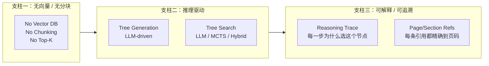

这三大支柱的工程意义是：

- **无向量** → 基础设施简化（不用 Pinecone/Weaviate/FAISS）、冷启动成本几乎为零。
- **无分块** → 保留自然语义边界、避免跨段引用被截断、表格与注释保持完整。
- **推理驱动** → 能 follow 内部引用（"see Appendix G"）、能跨页跨节整合、能处理多跳问题。
- **可解释** → 每个检索决策都附带 reasoning trace，金融、医疗、法律等强监管场景可审计。

### 3.3 公司背景与团队

Vectify AI Limited 于 2023-04-25 在英国伦敦 Ruislip 注册，公司编号 14827188。两位联合创始人都是学术与工程并重的资深研究者：

- **Mingtian Zhang（CEO & Founder）**：UCL（University College London）机器学习方向博士，博士期间研究方向为生成式 AI，在 NeurIPS、ICML、ICLR 等顶会发表多篇论文并多次做 oral presentation。曾在华为技术 R&D 部门工作。从 LinkedIn 与 Endole 公开记录可见，他是公司唯一的 Person of Significant Control（PSC）。
- **Yu Tang（Ray，Co-Founder）**：牛津大学数据库方向博士，在 VLDB、ICDE、TKDE 等顶级数据库会议与期刊发表多篇论文。ACM ICPC 亚洲区金牌两度得主，工程能力极强。Ray 同时是 PageIndex 几乎所有 PyPI 包的 maintainer（`pageindex`、`openkb`），其邮箱 `ray@vectify.ai` 出现在多个包的元数据里。

VectifyAI 的融资规模约 £1.1M（百万英镑），定位明确——把 PageIndex 商业化到金融、法律、医疗等强监管行业。其技术布局已经从单一 PageIndex 扩展为"PageIndex 生态"：

- **PageIndex Framework**：开源核心库（MIT 协议）
- **PageIndex Chat**：SaaS 化的对话平台
- **PageIndex API & MCP**：开发者集成入口
- **Mafin 2.5**：基于 PageIndex 的金融 RAG 产品
- **OpenKB**：合流 Karpathy LLM Wiki 模式的 CLI 知识库
- **PageIndex OCR**：长上下文视觉 OCR 引擎
- **ChatIndex**：把树索引应用到长对话历史
- **ConDB**：KV-cache 原生、面向树检索的上下文数据库
- **PageIndex MCP**：MCP Server 形式的服务端

整个生态围绕"用 LLM 推理替代向量检索"这一核心思想展开。

### 3.4 PageIndex 与传统 Vector RAG 的横向对比

下表是 VectifyAI 官网与 [pageindex.ai/developer](https://pageindex.ai/developer) 上整理的对比要点，结合 Towards AI 2026-04 的实测验证汇总而成：

| 维度 | Vector RAG | PageIndex |
| --- | --- | --- |
| 索引结构 | 高维向量 + BM25 倒排 | JSON 树（Title + Summary + start/end + 子节点） |
| 索引方式 | Embedding 模型（无监督、批量） | LLM 推理（有监督、按节生成） |
| 检索方式 | 余弦相似度 / ANN top-k | LLM 推理 / MCTS / 混合树搜索 |
| 多跳推理 | ❌ 需 query decomposition、iterative RAG 等补丁 | ✅ 原生支持：LLM 可跨多节点迭代 |
| 跨引用 follow | ❌ 没有这个概念 | ✅ 通过树节点 ID 直接跳到 Appendix G |
| 上下文感知 | ❌ 单跳，无对话历史感知 | ✅ 树结构 + 对话上下文一起喂给 LLM |
| 检索可解释 | ❌ "vibe retrieval"，无 reasoning trace | ✅ 每步 reasoning + page refs，可审计 |
| 冷启动 | 中（要 embed + 建索引） | 中（要 LLM 生成树，但不用 GPU 嵌入） |
| 运行时检索延迟 | < 100ms（向量库） | 1–10 秒（多次 LLM 调用） |
| 检索基建 | 向量库、Embedding 服务、rerank 服务 | 仅 LLM API（或本地 LLM） |
| 适用文档 | 海量短/中等文档，弱结构 | 长 + 结构化 + 高准确率要求 |
| FinanceBench 准确率 | ~50% | **98.7%**（Mafin 2.5） |
| 跨页表格 | 容易截断 | 整节点保留，cell 关系完整 |

### 3.5 社区评价与争议

PageIndex 在 2025-09 的 Hacker News Show HN 引发过一轮非常热烈的讨论。社区情绪分两极：

**支持方**（多数高质量评论）：

- "For most use cases, it doesn't make much sense to use vector DBs. ... non-vector methods like PageIndex can be more useful."（用户 @kakhkAt）
- "Embedding based RAG is fast and conceptually accurate, but very poor for high complexity tasks. Agentic RAG is higher quality, but much higher compute and latency cost. But often worth it for complex situations."（用户 @kakhkAt 续）
- "A good thing about tree representation compared to a 'list' representation is that you can search hierarchically, layer by layer, in a large tree. For example, AlphaGo performs search in a large tree."（用户 @throwaway17-2）

**质疑方**（也很有道理）：

- "It is just as 'vibe-ish' as vector search and notably does require chunking (document chunks are fed to the indexer to build the table of contents)."（用户 @mbrt）
- "This introduces two LLM-based components that can lead to highly variable output versus a traditional vector chunker and retriever."（用户 @sgammon）
- "Advantage of PageIndex is you can make it really domain-specific probably. Claims of improved retrieval time are dubious."（@sgammon 续）

最有意思的一条来自 PageIndex 创始人 Mingtian Zhang 的亲自回复：

> "Yes! :) We're getting there! It's currently at the good-but-not-great like GPT-2ish kind of stage. It's a model-toddler - it can't get a job yet, but it's already doing pretty interesting stuff (i.e. it does much better than SOTA on some complex tasks). I feel pretty optimistic that we're going to be able to get it to work at a usable commercial level for at least some verticals — maybe at an alpha/design partner level — before the end of the year. We'll definitely launch the semantic part before the context part, so this probably means things like people search etc. first — and then the contextual chunking for big docs for legal etc... ideally sometime next year?"

这段回复在事后回看非常准——2026 年 4 月 OpenKB 上线、PyPI 包 0.3.x 版本、API 商业化全面启动，**PageIndex 真的在 12 个月内从"模型幼儿"长成了可商业化部署的产品**。

不过 [agent-cookbook.com](https://agent-cookbook.com) 2026-05 的评测也尖锐地指出：开源版本只包含 LLM Prompt 树搜索，**MCTS 检索层只存在于云服务中**。这是开源与商业版本最大的一个差异，也是评估 "open-source PageIndex" 时必须知道的事实。

### 3.6 PageIndex 不是什么

为了避免读者对 PageIndex 产生不切实际的期望，必须明确它**不适用**或**不擅长**的场景：

- **不是搜索引擎**：它不做跨文档的"哪份文件讲过 X"的检索。OpenKB 引入了 PageIndex File System 来做这件事，但单纯的 PageIndex 框架是对**单文档**做推理。
- **不是聊天机器人框架**：它只提供 retrieval + context assembly，生成环节由调用方的 LLM 负责。
- **不是 OCR 工具**：开源版用传统 PDF 解析（pdfplumber/PyPDF2 类），复杂的扫描件 PDF 需要付费的 PageIndex OCR 服务。
- **不是"完全无延迟"方案**：单次检索通常需要 2–5 次 LLM 调用（generate tree、search tree、rerank、generate answer），延迟在秒级。Towards AI 实测大约 3–10 秒/查询。
- **不是 LLM Wiki**：PageIndex 是"文档 → 树 → 检索"的一次性范式，不维护持续累积的 Wiki（这是 OpenKB 与 LLM Wiki 范式要做的事）。

### 3.7 本章小结

- PageIndex 是 VectifyAI 推出的 Vectorless、Reasoning-based RAG 框架，核心是"目录树 + LLM 推理 + 无向量/无分块/无 top-k"。
- 三大支柱：无向量/无分块、推理驱动、可解释可追溯。在金融 QA 上达到 98.7% 准确率（Mafin 2.5），远超向量 RAG 的 ~50%。
- 社区评价两极但整体正面；开源与商业版本存在关键差异（MCTS 层仅云服务提供）。
- PageIndex 不适合作为通用搜索引擎、聊天框架或 OCR 工具；它专注于"长结构化文档 + 高准确率要求"的子问题。

---

## 四、PageIndex 核心原理：树索引与 In-Context Reasoning

### 4.1 三大核心概念：In-Context Index / Reasoning Trace / Tree Search

PageIndex 的全部技术原创性可以浓缩为三个互锁的核心概念：

1. **In-Context Index（上下文内索引）**：与传统向量数据库把索引"外置"不同，PageIndex 的树索引是一个**结构化 JSON 对象**，直接被序列化进 LLM 的 prompt 里。LLM 在推理时"看得到"整棵树（或者它的部分），能直接对节点做"思考"，而不只是被返回的 top-k 结果"告知"。

2. **Reasoning Trace（推理轨迹）**：检索的每一步都要求 LLM 输出一段 reasoning（如 "The user is asking about debt trends. These are usually in the financial summary section or Appendix G — let me look there."），并把这条 reasoning 持久化。最终用户可以看到一份"为什么选这些节点"的完整审计日志。

3. **Tree Search（树搜索）**：把整个检索问题转化为在层次化树上的搜索问题。LLM 在每一步从当前节点出发，根据 reasoning 选择若干子节点继续下钻，直到找到满足"信息充分"条件的目标节点。PageIndex 提供了三种实现：纯 LLM Prompt、Value-function MCTS、混合 Hybrid Tree Search。

这三个概念构成 PageIndex 的"灵魂三件套"。

### 4.2 In-Context Index：与向量数据库的根本区别

向量数据库的设计哲学是：**把文档变成外部索引，查询时只返回匹配项**。这种"外部索引"在工程上很优雅（ANN 搜索是 O(log N)），但语义上有一个根本缺陷——**LLM 在生成时看不到索引本身，只能看到被检索系统筛选过的、已经丢失了上下文的若干 chunks**。

PageIndex 的反向操作是：**把整个索引变成 LLM 能直接读、推理、操作的"内部结构"**。一棵典型的 PageIndex 树形如：

```jsonc
{
  "doc_description": "Apple Inc. 2024 Annual Report on Form 10-K, covering fiscal year ended Sep 28, 2024.",
  "nodes": [
    {
      "title": "PART I",
      "node_id": "0000",
      "start_index": 1,
      "end_index": 35,
      "summary": "Part I contains Items 1-2: Business, Properties, etc.",
      "nodes": [
        {
          "title": "Item 1. Business",
          "node_id": "0001",
          "start_index": 1,
          "end_index": 8,
          "summary": "Overview of Apple's business, products, services, and operations.",
          "nodes": [
            {
              "title": "Products and Services",
              "node_id": "0002",
              "start_index": 2,
              "end_index": 4,
              "summary": "Description of iPhone, Mac, iPad, Wearables, and Services.",
              "nodes": []
            }
          ]
        }
      ]
    }
  ]
}
```

注意几个关键设计：

- **title 简短且人类可读**：是 LLM 在推理时能"扫一眼就懂"的内容。
- **summary 是浓缩描述**：比 title 信息量大，但远小于节点实际内容（通常 1–3 句话）。
- **start_index / end_index 是物理页码**（PDF 的页索引），让 LLM 能精确地"取这一段"。
- **nodes 是递归的**：形成任意深度的层次化结构。
- **node_id 是稳定引用**：用于 MCP 工具调用、cross-reference、agentic flow 中的地址。

当用户查询 "What were Apple's total revenues for fiscal year 2024?" 时，PageIndex 不需要做向量相似度——它把整棵目录树（去掉 nodes 字段后通常只有几 KB）注入 prompt，让 LLM 推理：

> "The question is about total revenue. The Item 7 (Management's Discussion and Analysis) section usually has revenue numbers. Let me look at the MD&A node."

LLM 返回 `[node_id: 0015]` 这样的答案。系统根据 node_id 找到 start_index/end_index，**只读取**这一小段实际文本（可能是 2-3 页），喂给 LLM 生成最终答案。

这种"先把目录喂给 LLM 推理 → 再去取正文"的流程，与人类查字典/翻手册/读财报的过程几乎一致。

### 4.3 In-Context Index 的容量约束与处理策略

把所有节点摘要塞进 context 看似简单，但现实中一棵完整的 10-K 树可能有 200+ 节点，每个 summary 几十到上百 token，**全部塞进去容易超 context**。PageIndex 的处理策略非常工程化：

1. **分层下钻（Hierarchical Drill-down）**：第一轮只把第一层节点（章）的 title + summary 喂给 LLM；LLM 选出若干感兴趣的章；第二轮再把这些章的子节点（节）喂给 LLM；如此反复。**总 context 使用量与树深线性增长，不是指数**。
2. **大节点截断（Large Node Truncation）**：当某个节点 start_index-end_index 跨页超过 20 页（`--max-pages-per-node` 默认 10）时，PageIndex 会在该节点下强制插入子节点，把"超长节"拆为"章 → 节 → 小节"三级。
3. **Token 预算控制（Token Budget）**：`--max-tokens-per-node`（默认 20000）限制单节点最大 token，超出会触发 LLM 重切。
4. **轻量级节点 ID 与摘要（Lightweight Node ID + Summary）**：默认开启 `if-add-node-id=yes` 与 `if-add-node-summary=yes`，所有节点都有 ID 与一句话摘要；`if-add-doc-description=yes` 在根节点加文档级一句话描述。
5. **可选生成模式（Three Processing Modes）**：
   - **TOC with page numbers**（默认）：依赖 PDF 本身有 ToC 页面，PageIndex 用 LLM 提取 + 校验（带 `verify_toc()` 与 `fix_incorrect_toc_with_retries()` 自愈循环）
   - **TOC without page numbers**：仅用 LLM 生成结构，不绑定页码（适合电子版无页码文档）
   - **No TOC, generated from scratch**：完全用 LLM 扫描所有页并归纳（适合扫描件、纯图像 PDF）

这些参数都在 [VectifyAI/PageIndex](https://github.com/VectifyAI/PageIndex) 的 `run_pageindex.py` 中可以调节，是开源版的"调优旋钮"。

### 4.4 Reasoning Trace：让检索"看得见"

PageIndex 的检索不是一个黑盒的"query → answer"映射，而是一个**带 reasoning 的迭代循环**。典型流程（伪代码）：

```python
# Phase 1: Routing
routing_prompt = f"""
You are a document navigation expert.
Query: {query}
Document tree (titles + summaries only):
{tree_json}
Reply in JSON: {{ "thinking": "...", "node_list": ["0001", "0007"] }}
"""
routing = llm(routing_prompt)
# routing["thinking"] = "The user asks about debt. Debt schedules are in MD&A
#                        and Appendix G. Let me look there."

# Phase 2: Iterative retrieval
queue = PriorityQueue()
for nid in routing["node_list"]:
    node = get_node(nid)
    queue.push(node, priority=score)

collected = []
while not queue.empty() and not llm_says_sufficient(collected, query):
    node = queue.pop()
    text = fetch_pages(node.start_index, node.end_index)
    collected.append({"node_id": node.id, "text": text, "title": node.title})
    # optionally add children
    for child in node.nodes:
        if child_score(child, query) > threshold:
            queue.push(child)

# Phase 3: Answer generation
answer = llm(
    f"Context: {collected}\n\nQuestion: {query}\nAnswer:"
)
```

这个流程中，**`thinking` 字段是 PageIndex 可解释性的关键**——它记录了 LLM 在每一步为什么选这个节点、为什么不选另一个节点、为什么认为信息已经充分。**整个 reasoning trace 可以被持久化、审计、回放**，在金融、医疗、法律这种"必须能解释"的场景中价值巨大。

PyShine 在 2026-05 的技术分析《PageIndex: Vectorless Reasoning-Based RAG That Achieves 98.7% on FinanceBench》中专门强调了这一点：

> "PageIndex's verification pipeline does not just check accuracy; it actively corrects errors. The `fix_incorrect_toc_with_retries()` function identifies misaligned entries, searches nearby pages for the correct location, and updates the tree structure. This self-healing capability is what enables PageIndex to achieve 98.7% on FinanceBench."

**"自愈式 ToC 校验"** 是开源版与商业版共享的一个关键工程亮点：树生成之后，PageIndex 会用 LLM 重新审视每个节点的 start_index/end_index 是否准确，如果发现错位（比如页码指向了不属于该章节的内容），会自动搜索附近页码并修正，整个流程最多重试 3 次。这一步在 OCR 噪声大、扫描件不规则的金融文档上至关重要。

### 4.5 Tree Search：从纯 Prompt 到混合搜索

PageIndex 提供三种树搜索实现，可以根据场景与成本预算选择：

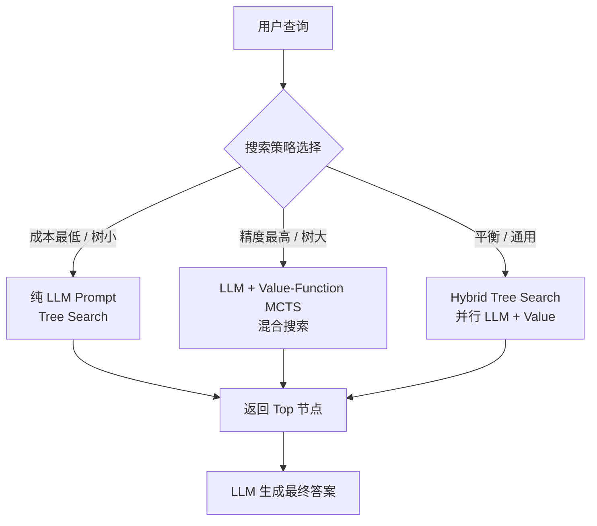

三种方法的差异：

#### 4.5.1 纯 LLM Prompt Tree Search

最简单也最容易实现的方法。直接让 LLM 阅读整棵树（或分层下钻的子树）然后返回 JSON 格式的节点列表：

```python
prompt = f"""
You are given a query and the tree structure of a document.
You need to find all nodes that are likely to contain the answer.

Query: {query}
Document tree structure: {PageIndex_Tree}

Reply in the following JSON format:
{{
  "thinking": <your reasoning about which nodes are relevant>,
  "node_list": [node_id1, node_id2, ...]
}}
"""
```

**优点**：实现简单、零额外基础设施、可以利用最新的 LLM 推理能力。

**缺点**：当树很大（节点 > 500）时，prompt 长度可能超过 context；纯靠 LLM 一次返回的节点列表可能漏选；延迟较高（取决于 LLM 调用次数）。

PageIndex 官方文档提到：开源版默认仅提供这一种树搜索实现。

#### 4.5.2 Value-Function MCTS Tree Search

受 AlphaGo 启发的进阶方案。对每个节点训练一个"价值函数"（value function）评估"该节点包含答案的概率"，用 MCTS（Monte Carlo Tree Search）算法在树上做 selective search。

Value Function 的实现思路：

1. 把每个节点的内容切成 chunks；
2. 用预训练 embedding 模型对每个 chunk 做 embedding；
3. 对查询 q 与每个 chunk c_i 计算余弦相似度；
4. 节点 n 的 value = 聚合（max/avg/top-k）其下所有 chunk 的相似度。

这样 MCTS 的 selection step 就可以用 UCT（Upper Confidence bounds for Trees）公式：

```
UCT(n) = V(n) + C × sqrt(ln(N_parent) / N_n)
```

其中 V(n) 是节点 n 的 value 估计，N_n 是访问次数，C 是 exploration 权重。

**优点**：检索速度比纯 LLM Prompt 快很多（不需要把整棵树喂给 LLM）；可解释（每次走的是哪些节点）。

**缺点**：value function 的质量取决于 embedding 模型；如果 embedding 模型对领域不熟，可能漏选；集成用户偏好或专家知识需要改 prompt。

agent-cookbook.com 2026-05 的评测指出：**MCTS 检索在开源版中并未提供**——"The tree-search tutorial states that the cloud dashboard and retrieval API use 'a combination of LLM tree search and value function-based Monte Carlo Tree Search (MCTS).' The open-source code ships only the LLM-prompt tree-search variant. MCTS lives in the hosted service." 这是开源与商业版本最关键的能力差异。

#### 4.5.3 Hybrid Tree Search

PageIndex 官方教程 [Hybrid Tree Search](https://docs.pageindex.ai/tutorials/tree-search/hybrid) 中明确提出，**这是商业版默认使用的检索算法**：

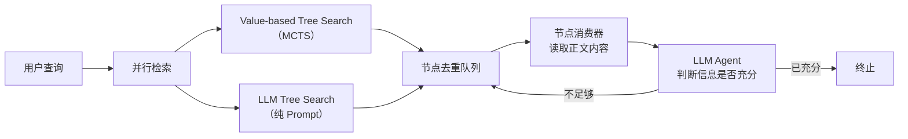

**关键设计**：

- **并行**：value-based 与 LLM-based 两个引擎**同时跑**，互不阻塞。
- **去重队列（Queue System）**：维护一个 unique node elements 集合，任意一个引擎返回的节点如果不在集合中就加入。避免重复处理。
- **节点消费器（Node Consumer）**：异步从队列取节点，读取实际正文内容。
- **终止判断（LLM Agent）**：用一个小的 LLM Agent 持续评估"收集到的信息是否足够回答 query"，足够则提前终止。

**优点**：结合了 value-based 的速度与 LLM-based 的深度；召回率比单一方法高；可提前终止节省成本。

**缺点**：工程复杂度最高；需要可靠的 queue 实现；调试难度大。

PageIndex 商业 API 默认走 Hybrid Tree Search，开源版需要用户自己实现。

#### 4.5.4 集成专家知识

三种搜索方法都可以**注入用户偏好 / 专家知识**——只要在 prompt 中加一段 `Preference` 文本：

```python
prompt = f"""
You are given a question and a tree structure of a document.
You need to find all nodes that are likely to contain the answer.

Query: {query}
Document tree structure: {PageIndex_Tree}
Expert Knowledge of relevant sections: {Preference}

Reply in the following JSON format:
{{
  "thinking": <reasoning about which nodes are relevant>,
  "node_list": [node_id1, node_id2, ...]
}}
"""
```

这种"把领域知识当上下文"的注入方式，是 PageIndex 比传统向量 RAG 更"工程友好"的关键。向量 RAG 想集成专家偏好，要去 fine-tune embedding 模型；PageIndex 改 prompt 即可。

### 4.6 自愈式 ToC 校验：`fix_incorrect_toc_with_retries()`

这一小节专门讲开源版最实用的一个工程细节：树生成后的自愈（self-healing）循环。

PDF 文档的页码系统、ToC 准确性、章节标题识别是 PDF 处理三大难题。PageIndex 的处理流程是：

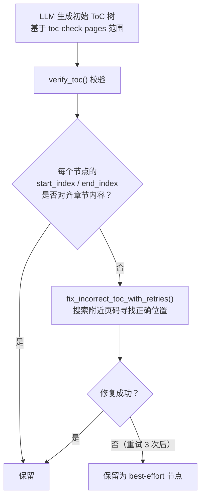

`fix_incorrect_toc_with_retries()` 的工作逻辑：

1. 对每个被怀疑错位的节点，重新读它的 start_index 页面；
2. 用 LLM 判断该页面是否真的属于该节点的章节；
3. 如果不属于，让 LLM 在 ±3 页范围内搜索属于该章节的页码；
4. 修复 start_index / end_index，再次校验；
5. 最多重试 3 次，仍失败则保留 best-effort。

PyShine 2026-05 指出，这是 PageIndex 达到 98.7% 准确率的"幕后功臣"——在 OCR 噪声、扫描件不规则、PDF 元数据缺失等真实场景下，**单纯一次 LLM 生成 ToC 是不够的，必须有校验-修复循环**。

### 4.7 本章小结

- PageIndex 的三大核心概念是 In-Context Index、Reasoning Trace、Tree Search。
- In-Context Index 把整棵 JSON 树作为 LLM 的内部结构，让模型"看着目录"做推理；与向量数据库的"外置索引"形成根本区别。
- Reasoning Trace 记录每一步的 why，可解释、可审计，是 PageIndex 在金融/法律/医疗等强监管场景的关键卖点。
- Tree Search 有三种实现：纯 LLM Prompt、Value-Function MCTS、Hybrid Tree Search。开源版只提供第一种，商业版默认走 Hybrid。
- 自愈式 ToC 校验（`fix_incorrect_toc_with_retries()`）是开源版最实用的工程细节，让 PageIndex 在噪声 PDF 上仍能产出准确索引。

---

## 五、PageIndex 树生成详解：从 PDF 到 JSON 树

### 5.1 树生成的两阶段流程

PageIndex 的树生成（tree generation）是把任意 PDF/Markdown 文档转换为一棵 JSON 树的完整过程。这个过程分为**两个明确阶段**：

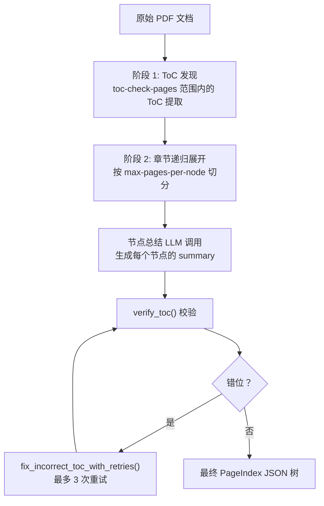

两个阶段的具体职责：

- **阶段 1: ToC 发现**：PageIndex 默认读取 PDF 的前 20 页（`--toc-check-pages 20`），用 LLM 识别其中的目录结构（章 → 节 → 小节），形成初始 ToC 节点列表。这一步依赖 PDF 本身**有印刷的 ToC**，或至少前 20 页有可识别的标题结构。
- **阶段 2: 章节递归展开**：从初始 ToC 出发，对每个节点用 LLM 判断其物理页码范围（start_index / end_index）；如果单节点超过 20 页（`--max-tokens-per-node 20000` 对应大约 10 页），强制递归切分为子节点。

最终输出形如第 4.2 节展示的 JSON 结构。

### 5.2 三种 ToC 生成模式

PageIndex 在 0.2.x 版本中显式支持三种 ToC 生成模式（`three processing modes`），针对不同类型的 PDF：

| 模式 | 适用场景 | 优势 | 局限 |
| --- | --- | --- | --- |
| **TOC with page numbers**（默认） | 印刷质量好、有标准 ToC 的 PDF | 准确率最高，自愈循环最有效 | 依赖 PDF 元数据完整 |
| **TOC without page numbers** | 屏幕阅读 PDF / 无显式 ToC | 不需要 PDF 自己的目录 | 节点范围需要 LLM 重新推断 |
| **No TOC, generated from scratch** | 扫描件、纯图像 PDF | 唯一可用的方案 | 速度慢、成本高、依赖 OCR 质量 |

后两种模式需要更强的 LLM 推理（让模型自己归纳章节），因此通常需要 GPT-4o / Claude 3.5 Sonnet / Gemini 2.5 Pro 级别模型。

### 5.3 关键参数与调优旋钮

开源版 [run_pageindex.py](https://github.com/VectifyAI/PageIndex/blob/main/run_pageindex.py) 提供了 7 个核心参数：

| 参数 | 默认值 | 作用 | 调优建议 |
| --- | --- | --- | --- |
| `--model` | `gpt-4o-2024-11-20` | 树生成所用 LLM | 高质量文档用 4o 即可；扫描件建议升级到 o1 或 Claude 3.7 |
| `--toc-check-pages` | `20` | ToC 发现扫描的页数 | 复杂文档可调到 30–50 |
| `--max-pages-per-node` | `10` | 单节点最大页数 | 章节密集可降到 5–7；技术手册可保持 10 |
| `--max-tokens-per-node` | `20000` | 单节点最大 token | 与 LLM context 对齐；GPT-4o 128K 可放到 40K |
| `--if-add-node-id` | `yes` | 是否生成 node_id | 几乎必须开，否则 MCP 工具无法寻址 |
| `--if-add-node-summary` | `yes` | 是否生成 summary | 几乎必须开，否则树搜索退化为字符串匹配 |
| `--if-add-doc-description` | `yes` | 是否生成 doc_description | 强烈建议开，给 LLM 全局上下文 |

这些参数决定了 PageIndex 索引的"颗粒度"——颗粒度太粗（节点太少、每个太大）会让 LLM 一次拿到过多无关内容；颗粒度太细（节点太多、每个太小）会让树结构过深、推理成本升高。一般建议从默认值开始，根据实际文档类型微调。

### 5.4 Markdown 模式与 ToC 不完整 PDF 的处理

PageIndex 还提供一个 **Markdown 模式**（`--md_path`），它把 markdown 文件的 `#/##/###` 等标题作为节点分割：

```bash
python3 run_pageindex.py --md_path /path/to/document.md
```

其工作原理：

- `#` 是一级节点（H1）
- `##` 是二级节点（H2）
- `###` 是三级节点（H3）
- ……

注意 PageIndex 官方文档**明确警告**：不要把"由 PDF 转换而来的 markdown"直接用 Markdown 模式处理，因为大多数 PDF-to-Markdown 转换工具（PyMuPDF、pdfplumber、markitdown）**无法保留原始的章节层次结构**。正确流程是：

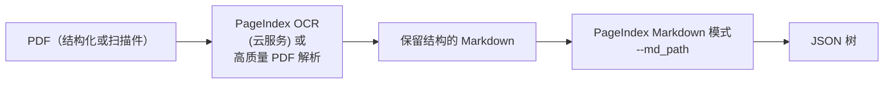

PageIndex OCR 的特殊性在于：它是**第一个长上下文视觉 OCR 模型**，能够把整本 PDF 视为一个整体，**保留章节的层次结构**。这与传统 OCR（每页独立识别）有质的区别，详见第六章。

### 5.5 树生成的工程实现

开源版 [pageindex](https://pypi.org/project/pageindex/) PyPI 包 0.2.x 的源码结构非常清晰，主要模块包括：

```
pageindex/
├── __init__.py
├── page_index.py      # 核心 PageIndex 类
├── utils.py           # PDF 解析、JSON 工具
├── toc_utils.py       # ToC 解析、修复
├── verifier.py        # verify_toc()、fix_incorrect_toc_with_retries()
├── llm.py             # LLM 调用包装（兼容 LiteLLM）
└── cli.py             # 命令行入口
```

`page_index.py` 中的核心类 PageIndex 包含以下方法：

- `__init__(pdf_path, model, ...)`: 初始化时读取 PDF 元数据
- `build_tree()`: 主入口，按两阶段流程生成树
- `_discover_toc()`: 阶段 1，从前 N 页提取 ToC
- `_expand_node(node, depth)`: 阶段 2，递归展开
- `_verify_and_fix(tree)`: 后处理，调用 verifier
- `to_json()`: 输出标准 JSON

整个流程在 [Pypi pageindex v0.2.8](https://pypi.org/project/pageindex/) 中已经稳定化，0.3.x 处于 dev 阶段（0.3.0.dev1 发布于 2026-04-10），预计会带来更多企业级特性（如并发、checkpoint、增量更新）。

### 5.6 树生成的成本与时间

树生成是 PageIndex 的**主要成本来源**：

- **单次 LLM 调用次数**：大致与节点数线性相关。100 页 10-K 文档约 30–60 次 LLM 调用。
- **Token 消耗**：每节点平均 1K–3K 输入 token，0.5K–1K 输出 token。100 页文档大约 100K–200K 总 token。
- **单文档时间**：GPT-4o 典型 2–5 分钟。
- **单文档成本**：GPT-4o 大约 $0.5–$2（取决于 prompt caching 是否开启）。

**这一成本可以接受是因为它是一次性投入**——树生成完成后，检索阶段的成本远低于嵌入+向量检索的运维成本（向量库要持续维护、reranker 要调用、embedding 模型版本升级要重建索引）。TCO（Total Cost of Ownership）视角下，PageIndex 在长结构化文档场景通常更经济。

### 5.7 本章小结

- 树生成是 PageIndex 的"一次性投资"：从 PDF 出发，分 ToC 发现和章节递归展开两个阶段，最终输出 JSON 树。
- 7 个核心参数（`--model`、`--toc-check-pages`、`--max-pages-per-node`、`--max-tokens-per-node`、`--if-add-node-id`、`--if-add-node-summary`、`--if-add-doc-description`）是调优旋钮。
- 三种 ToC 生成模式（with/without page numbers, no TOC）适配不同 PDF 质量。
- Markdown 模式适合结构化良好的 .md 文档；对 PDF 转换而来的 markdown，**必须先经过 PageIndex OCR 保留结构**，否则会破坏章节层次。
- 单文档树生成成本约 $0.5–$2、2–5 分钟；可接受因为是一次性投入。

---

## 六、PageIndex OCR：长上下文视觉 OCR 的开创性工作

### 6.1 传统 OCR 的根本缺陷

OCR（Optical Character Recognition，光学字符识别）是 RAG 流水线的"咽喉"——一个 10-K PDF 在进入分块/嵌入之前必须先被 OCR 转为文本。但传统 OCR 工具几乎都遵循**单页独立识别**的范式：

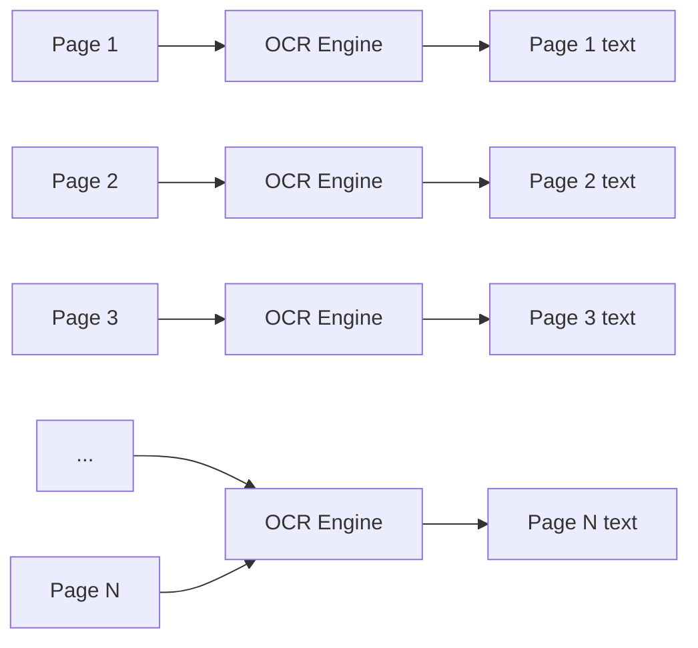

这种范式在**结构化文档**上有三个致命问题：

1. **跨页标题丢失**：章名"PART I"出现在 page 1 底部，page 2 顶部继续 "Item 1. Business"，但 OCR 不知道它们是父子关系。
2. **表格跨页断裂**：财务报表的"资产"部分可能跨 2 页，合并 cell 在 OCR 输出后变成孤立的数字。
3. **页码与脚注错位**：脚注 "1 See Note 14 for details" 与正文的引用脱离，无法 link。

PageIndex 在 2025-08 的博客《PageIndex OCR: The First Long-Context OCR Model》中尖锐指出：

> "Most OCR tools only extract page-level content, losing the broader document context and hierarchy. PageIndex OCR leverages the context window of large vision-language models and treats the entire document as a cohesive, structured whole."

### 6.2 PageIndex OCR 的设计哲学

PageIndex OCR 的革命性在于：**把整本 PDF（或一个长上下文窗口内的所有页）作为一个整体，喂给一个支持长上下文的 vision-language model，让模型直接输出层次化的 markdown**。

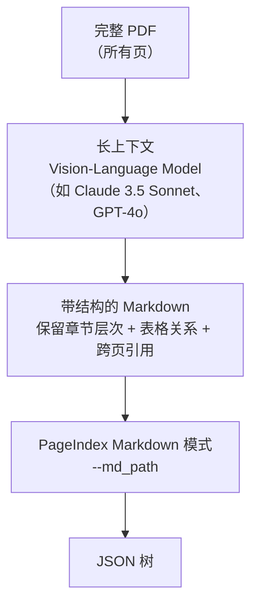

核心设计要点：

- **不切分单页处理**：所有页一次性进 vision model；模型自己用 attention 跨越页码。
- **生成结构化输出**：模型直接产出带 `#/##/###` 标题、表格、列表、引用的 markdown。
- **保留物理页码**：每个 markdown 段都标注 start_index/end_index（物理页码）。
- **保留章节层次**：模型识别出"PART I → Item 1 → Business"这种嵌套关系并以标题级别编码。

### 6.3 PageIndex OCR 与其他 OCR 工具的对比

VectifyAI 在 0.2.x 版本的 README 中明确对比了 PageIndex OCR 与两大主流 OCR 工具：

| 维度 | Mistral OCR | Contextual AI OCR | PageIndex OCR |
| --- | --- | --- | --- |
| 处理单元 | 单页 | 单页 | 整文档（长上下文） |
| 章节层次识别 | ❌ | 部分 | ✅ |
| 跨页表格 | ❌ | ❌ | ✅ |
| 物理页码保留 | ✅ | ✅ | ✅ |
| 与 PageIndex 树集成 | 需后处理 | 需后处理 | 原生输出 |
| 视觉模型选择 | 仅 Mistral 自家 | 多种 | 多种（Claude/GPT-4o 等） |

PageIndex OCR 在 0.2.5+ 版本中作为云服务上线（不在 MIT 开源协议内），但开源版的 README 中已经预留了集成接口。

### 6.4 Vision-based Vectorless RAG：彻底跳过 OCR

PageIndex 在 0.2.x 版本引入了一种更激进的范式——**Vision-based Vectorless RAG**：**完全跳过 OCR，直接把 PDF 页面图像喂给 vision-language model**。

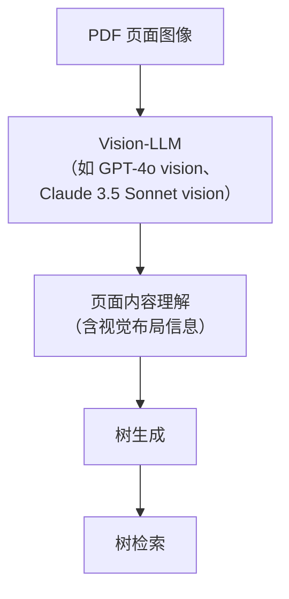

这种范式在金融文档上尤其有价值，因为**财务表格的视觉布局（合并单元格、对齐方式、脚注位置）本身就是语义的一部分**。例如，资产负债表的"总计"行通常用粗体/双下划线标识，传统 OCR 会丢失这种视觉强调；vision-LLM 则能直接"看到"。

[VectifyAI/PageIndex Notebook](https://github.com/VectifyAI/PageIndex) 提供了一个 `vision-based-vectorless-rag.ipynb` 示例，演示如何在不进行 OCR 的前提下用 GPT-4o vision 构建推理式 RAG。

### 6.5 PageIndex OCR 的成本考量

Vision-LLM 的成本是传统 OCR 的 10–50 倍：

- Mistral OCR：~ $0.001/页
- GPT-4o vision：~ $0.01–$0.05/页（取决于分辨率）
- Claude 3.5 Sonnet vision：~ $0.015/页

一本 200 页 10-K 用 PageIndex OCR 的成本约 $3–$10。这在金融、法律等高 ARPU 场景中完全可接受，但在大规模文档批量处理时需要谨慎。

### 6.6 本章小结

- PageIndex OCR 是**第一个长上下文视觉 OCR 模型**，把整本 PDF 视为一个整体，保留章节层次与跨页结构。
- 与传统单页 OCR（Mistral、Contextual AI）相比，PageIndex OCR 在结构化文档上有质的优势。
- Vision-based Vectorless RAG 更激进：完全跳过 OCR，直接把 PDF 图像喂给 vision-LLM，特别适合表格密集的金融文档。
- 成本是传统 OCR 的 10–50 倍，但在高 ARPU 场景中可接受。

---

## 七、PageIndex 树搜索算法：从 LLM Prompt 到 MCTS 混合搜索

### 7.1 树搜索的本质：把"找答案"转化为"找节点"

PageIndex 的检索问题在数学上可以表述为：

> 给定一棵文档树 T（节点集合 N、每个节点 n 包含 text(n)、summary(n)、start(n)、end(n)）和用户查询 q，**找到一个节点集合 S ⊆ N，使得 S 中节点的实际文本合起来能回答 q**。

传统向量 RAG 的"找答案"是相似度搜索：score(n) = cosine(embed(text(n)), embed(q))，取 top-k。

PageIndex 的"找答案"是**结构化搜索**：

- LLM-based 搜索：score(n) 由 LLM 推理给出，LLM 看 summary(n) 决定是否下钻。
- Value-based 搜索：score(n) 由 embedding-based value function 给出，模拟 MCTS selection。
- Hybrid：两个 score 加权融合，节点去重后送入 LLM Agent 评估"是否充分"。

这三种搜索策略各有优势与局限，下面分别深入。

### 7.2 LLM Tree Search 的 Prompt 工程

PageIndex 官方文档 [LLM Tree Search](https://docs.pageindex.ai/tutorials/tree-search/llm) 提供的 prompt 模板非常具有教学价值，是任何想做"LLM-based tree retrieval"的工程师必读的范式。

#### 7.2.1 基础 Prompt

```python
prompt = f"""
You are given a query and the tree structure of a document.
You need to find all nodes that are likely to contain the answer.

Query: {query}

Document tree structure: {PageIndex_Tree}

Reply in the following JSON format:
{{
  "thinking": <your reasoning about which nodes are relevant>,
  "node_list": [node_id1, node_id2, ...]
}}
"""
```

注意几个 prompt engineering 关键点：

- **明确角色**："You are given a query" + "You need to find..." 给 LLM 一个清晰的执行目标。
- **结构化输入**：文档树用 JSON 注入；变量 `{PageIndex_Tree}` 是 LLM 实际推理的对象。
- **强制 JSON 输出**：`response_format` 强制 LLM 返回可解析的 JSON，便于程序读取。
- **要求 thinking**：让 LLM 在给出 node_list 之前先解释 why，便于审计。

#### 7.2.2 集成专家知识 Prompt

当 LLM 缺乏领域知识时，可以注入 expert knowledge：

```python
prompt = f"""
You are given a question and a tree structure of a document.
You need to find all nodes that are likely to contain the answer.

Query: {query}
Document tree structure: {PageIndex_Tree}
Expert Knowledge of relevant sections: {Preference}

Reply in the following JSON format:
{{
  "thinking": <reasoning about which nodes are relevant>,
  "node_list": [node_id1, node_id2, ...]
}}
"""
```

`Preference` 字段可以是：

- "Debt-related content is usually in the financial summary section or Appendix G"
- "Regulatory compliance issues are typically discussed in Section 5"
- "技术手册中的故障排查章节位于 Operation > Maintenance"

这些 preference 可以从历史检索日志、用户反馈、领域专家访谈中提取，注入到 prompt 中即可生效，**无需重新训练 embedding 模型**。

#### 7.2.3 分层下钻 Prompt

当树节点过多（> 50）时，单次 prompt 容易超 context。PageIndex 采用分层下钻：

```python
# Round 1: 选章
chapter_response = llm(f"""
Given the query and the chapter list, which chapters are likely to contain the answer?
Query: {query}
Chapters: {chapters_summary}
Reply: {{ "thinking": "...", "chapter_ids": ["0001", "0007"] }}
""")

# Round 2: 在选中的章里选节
for chapter_id in chapter_response["chapter_ids"]:
    sections = get_sections(chapter_id)
    section_response = llm(f"""
    Given the query, query, and the sections within Chapter {chapter_id},
    which sections are likely to contain the answer?
    Query: {query}
    Sections: {sections_summary}
    Reply: {{ "thinking": "...", "section_ids": ["0015", "0018"] }}
    """)
```

这种"分而治之"的策略把一次大 prompt 拆成多次小 prompt，**总 context 使用量与树深线性相关**（不是指数），是 PageIndex 在大文档上仍能高效工作的关键工程技巧。

### 7.3 Value-Function MCTS Tree Search

受 AlphaGo 启发的进阶方案。PageIndex 官方文档 [Hybrid Tree Search](https://docs.pageindex.ai/tutorials/tree-search/hybrid) 中详细描述了 MCTS 版的实现思路。

#### 7.3.1 Value Function 的构造

对每个节点 n，构造一个 value function V(n) 估计"节点 n 包含答案的概率"：

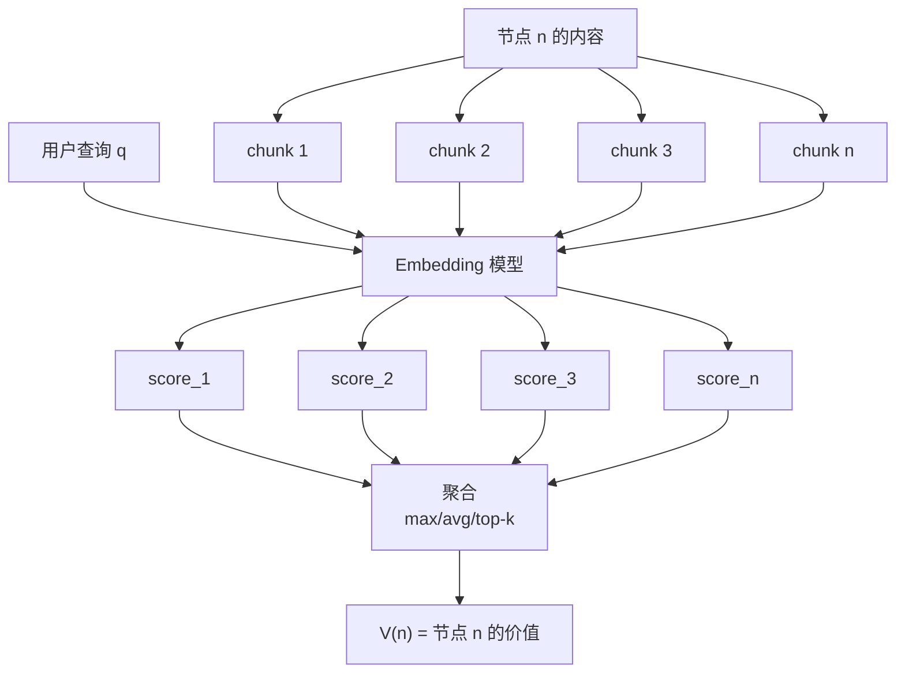

**Value function 的工程实现**：

1. 把节点 n 的 text 切成 k 个 chunks（典型 k = 5–20）；
2. 用 embedding 模型（OpenAI text-embedding-3-small、BGE-large 等）对每个 chunk 与 q 计算余弦相似度；
3. 聚合策略可选 max（最相关 chunk 的分数）、avg（平均）、top-k（top-k 分数之和）；
4. V(n) = 聚合后的相似度分数。

**聚合策略的经验**：

- `max` 倾向于选择"含有强相关片段"的节点；
- `avg` 更稳定但可能漏掉"局部高度相关"的节点；
- `top-k` 在 max 与 avg 之间折中。

#### 7.3.2 MCTS 检索流程

把 Value Function 集成到 MCTS：

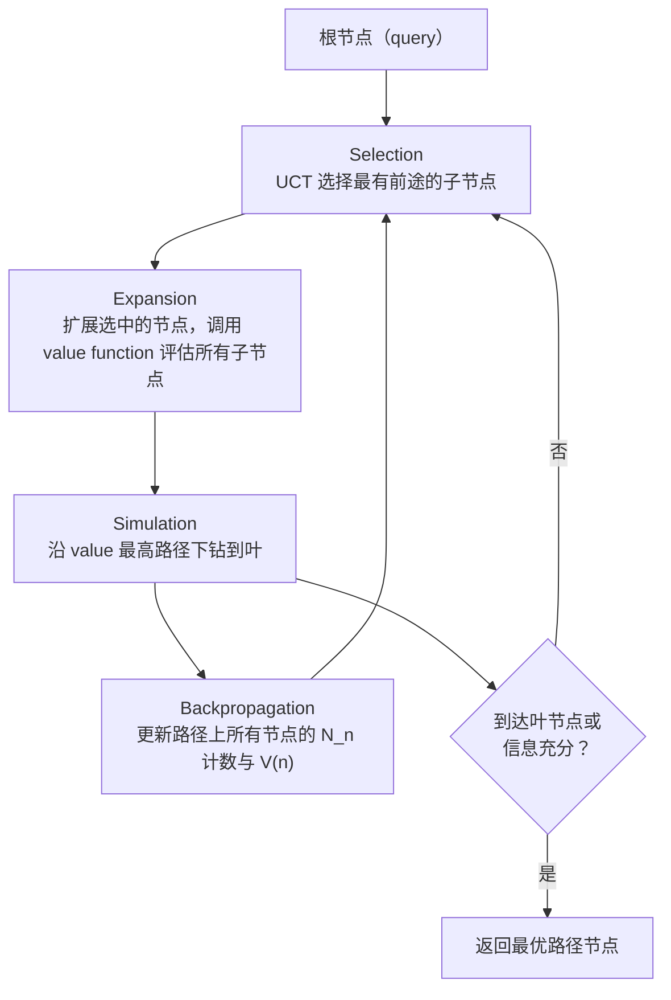

UCT（Upper Confidence bound for Trees）公式：

```
UCT(n) = V(n) + C × sqrt(ln(N_parent) / N_n)
```

其中：

- V(n) = 节点 n 的 value function 估计
- N_n = 节点 n 的访问次数
- N_parent = 父节点的访问次数
- C = exploration 权重（典型 1.4–2.0）

这个公式**平衡了 exploitation（选择已知高 V 的节点）和 exploration（多访问低 N 的节点）**，与 AlphaGo 的 MCTS 一脉相承。

#### 7.3.3 Value Function 的局限

Value-function MCTS 也有两个明显缺陷：

- **依赖 embedding 模型质量**：如果 embedding 模型对领域文档不熟（比如金融衍生品的专业术语），V(n) 会系统性偏低。
- **无法集成专家知识**：专家偏好需要"硬编码"到 V(n) 的计算中，比较 hacky。

这两个问题正是 Hybrid 搜索要解决的。

### 7.4 Hybrid Tree Search：商业版默认实现

PageIndex 商业版（云服务）默认走 Hybrid Tree Search，**同时运行 LLM-based 与 value-based 两个检索引擎，结果合并后送入 LLM Agent 评估**：

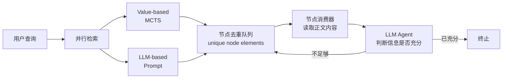

#### 7.4.1 并行检索（Parallel Retrieval）

两个引擎**同时**启动，互不阻塞：

- Value-based 引擎：~ 50–200ms 给出 top-k 节点；
- LLM-based 引擎：~ 1–3 秒给出 top-k 节点。

#### 7.4.2 去重队列（Queue System）

维护一个 unique set of nodes；任意引擎返回的 node_id 如果不在集合中就加入。这避免了重复处理，也避免了两个引擎都"漏掉"对方独有的发现。

#### 7.4.3 节点消费器（Node Consumer）

异步从队列取 node_id，根据 start_index/end_index 读取 PDF 实际内容（可能是 1-5 页文本），加入 `collected_context`。

#### 7.4.4 终止判断（LLM Agent）

用一个**小的、快的 LLM Agent**（如 GPT-4o-mini）持续评估：

```
Given the original query and the collected context, is the information sufficient to answer the query?
Reply: { "sufficient": true/false, "missing": "..." }
```

如果 `sufficient: true` 就提前终止，节省 token；如果 `missing: ...` 就把 missing 提示作为新一轮检索的 hint。

#### 7.4.5 Hybrid 的优势

- **速度**：value-based 引擎先返回候选节点，LLM Agent 评估"充分性"时可以并行消费；总延迟接近 LLM-based 单独使用，但**召回率显著提升**。
- **深度**：LLM-based 引擎在需要深度推理时（跨引用、模糊查询）能补 value-based 的不足。
- **成本**：节点消费 + 提前终止可以**节省 30–60% 的 LLM token 消耗**。

#### 7.4.6 Hybrid 的局限

- **工程复杂度高**：需要可靠的 queue、并发控制、失败重试、超时管理。
- **调试困难**：两个引擎的结果不一致时，难以判断"该信谁"。
- **开源版未提供**：这是商业版的核心竞争力。

### 7.5 集成用户偏好与专家知识

PageIndex 树搜索的最大优势是**可注入性**。对比一下传统向量 RAG 与 PageIndex 在"集成用户偏好"上的差异：

| 步骤 | Vector RAG | PageIndex |
| --- | --- | --- |
| 用户反馈"我希望优先返回 Appendix G" | 重新 fine-tune embedding 模型 | 在 LLM prompt 中加一句 "Prefer Appendix G" |
| 领域专家说"金融衍生品章节在 Section 5" | 收集标注数据 → 训练领域 adapter | 在 LLM prompt 中加一句 "Section 5 covers derivatives" |
| 新增业务规则 | 重新构建向量索引 | 修改 prompt 即可 |

这种"prompt 即配置"的灵活性让 PageIndex 在企业落地中具备显著的工程优势——业务变化时不需要重新训练或重建索引。

### 7.6 三种搜索算法的适用场景

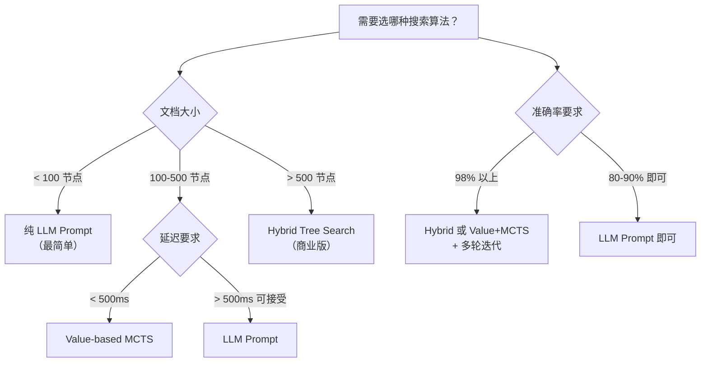

实务建议：

- **MVP/原型**：用纯 LLM Prompt，几行代码就能跑通。
- **生产（中等规模）**：用 Value-based MCTS（自己实现，不依赖商业版），平衡速度与准确率。
- **生产（大规模、高准确率）**：用商业版 Hybrid，或自己实现 Hybrid。

### 7.7 本章小结

- PageIndex 树搜索把"找答案"转化为"找节点"，三种实现路径各有取舍。
- LLM Tree Search 通过 prompt 工程实现，包括分层下钻、集成专家知识等技巧；适合中等规模文档。
- Value-Function MCTS 通过 embedding-based 价值函数 + UCT 选择实现，速度快但受限于 embedding 质量。
- Hybrid Tree Search 是商业版默认，结合 LLM 与 Value 的优势，速度与深度兼顾；开源版未提供。
- 集成用户偏好/专家知识是 PageIndex 相比向量 RAG 的关键工程优势——改 prompt 即可，无需重新训练。
- 实际选型取决于文档规模、延迟要求与准确率要求，纯 LLM Prompt 适合 MVP，Hybrid 适合生产。

---

## 八、PageIndex MCP 集成：让推理式 RAG 成为 Agent 工具

### 8.1 MCP 协议基础与 PageIndex 的定位

Model Context Protocol（MCP，模型上下文协议）是 Anthropic 在 2024 年 11 月开源的一种**让 LLM Agent 与外部工具/数据源通信的标准协议**。它的设计灵感来自 LSP（Language Server Protocol），目标是：

> "USB for AI" — 一种标准化的、AI 工具的即插即用接口。

MCP 采用 client-server 架构：

- **MCP Client**：嵌入在 LLM Agent 中（Claude Desktop、Cursor、VS Code Continue、OpenAI Agents SDK 等），负责发起 tool call。
- **MCP Server**：暴露具体工具能力（文件读写、数据库查询、API 调用等），由 Client 通过 stdio 或 HTTP 远程调用。

PageIndex 在 2025-08 推出官方 MCP Server：[VectifyAI/pageindex-mcp](https://github.com/VectifyAI/pageindex-mcp)（TypeScript，289 stars），把 PageIndex 的检索能力封装为 MCP 工具，让任何支持 MCP 的 Agent 都能直接调用。

### 8.2 PageIndex MCP 的安装与配置

#### 8.2.1 三种部署方式

**方式 1: 远程 HTTP MCP（最简单）**

```json
{
  "mcpServers": {
    "pageindex": {
      "type": "http",
      "url": "https://api.pageindex.ai/mcp",
      "headers": {
        "Authorization": "Bearer YOUR_API_KEY"
      }
    }
  }
}
```

**方式 2: Claude Desktop 一键安装（OAuth 自动）**

下载 `.mcpb` 文件（[Releases](https://github.com/VectifyAI/pageindex-mcp/releases)），双击安装。OAuth 流程自动处理。

**方式 3: 本地 MCP Server（支持本地 PDF 上传）**

需要 Node.js ≥ 18.0.0：

```json
{
  "mcpServers": {
    "pageindex": {
      "command": "npx",
      "args": ["-y", "@pageindex/mcp"]
    }
  }
}
```

本地版本特别适合需要**上传本地 PDF** 而非 URL 的场景。

#### 8.2.2 不支持 HTTP MCP 的客户端

对于不支持 HTTP MCP 的客户端（如某些早期版本），可用 `mcp-remote` 桥接：

```json
{
  "mcpServers": {
    "pageindex": {
      "command": "npx",
      "args": ["-y", "mcp-remote", "https://chat.pageindex.ai/mcp"]
    }
  }
}
```

### 8.3 PageIndex MCP 暴露的工具集

PageIndex MCP Server 暴露的核心工具（[pageindex-mcp](https://github.com/VectifyAI/pageindex-mcp) 文档）：

| 工具名 | 用途 | 关键参数 |
| --- | --- | --- |
| `process_document` | 上传并索引一个 PDF | `url` 或 `file_path` |
| `get_document_structure` | 获取文档的 PageIndex 树（不含正文） | `doc_name` |
| `get_page_content` | 获取指定页/页范围的正文 | `doc_name`, `pages` (如 "15-22") |
| `recent_documents` | 列出最近上传的文档 | 无 |
| `remove_document` | 删除一个文档 | `doc_name` |
| `chat_with_documents` | 端到端问答（内部跑完整 agentic flow） | `query`, `doc_name(s)` |

这套工具集的设计哲学是"**最小完备**"——暴露 5–6 个原子操作，让 Agent 可以自由组合；同时提供"端到端"快捷方式（`chat_with_documents`）给不需要自定义流程的用户。

### 8.4 Agentic Vectorless RAG 完整示例

PageIndex 仓库提供了 [examples/agentic_vectorless_rag_demo.py](https://github.com/VectifyAI/PageIndex) 演示如何用 OpenAI Agents SDK + 自托管 PageIndex 构建端到端的 Agentic RAG：

```python
from openai_agents import Agent, Runner
from pageindex import PageIndexClient

pi_client = PageIndexClient(api_key="YOUR_API_KEY")

# 把 PageIndex MCP 注册为 Agent 的工具集
pageindex_mcp = {
    "type": "http",
    "url": "https://api.pageindex.ai/mcp",
    "headers": {"Authorization": "Bearer YOUR_API_KEY"}
}

agent = Agent(
    name="DocumentAnalyst",
    instructions="""
    You are a document analysis expert. Use the PageIndex MCP tools to:
    1. First, find the relevant document via process_document
    2. Use get_document_structure to get the tree
    3. Use get_page_content to fetch specific pages
    4. Synthesize an answer with page references
    """,
    mcp_servers=[pageindex_mcp],
    model="gpt-4o"
)

# 用户查询
result = Runner.run_sync(
    agent,
    "What were the key risk factors mentioned in Apple's 2024 10-K? Please cite page numbers."
)
print(result.final_output)
```

这个示例的精妙之处在于：**Agent 不需要被硬编码"先做什么后做什么"**——OpenAI Agents SDK 配合 MCP 工具调用，让 LLM 自己决定：

- 是否需要先调用 `process_document`（如果文档没上传过）；
- 是否需要先看 `get_document_structure` 决定大方向；
- 是否需要多次调用 `get_page_content` 拉取不同章节；
- 如何把多个章节的检索结果综合成最终答案。

这与硬编码的"tree search → fetch → answer"流程相比，**agentic flow 能处理多跳、自适应、复杂的真实查询**。

### 8.5 MCP 与传统 Function Call 的差异

为什么 PageIndex 选 MCP 而不只是 OpenAI Function Call？

| 维度 | Function Call | MCP |
| --- | --- | --- |
| 协议标准化 | ❌ 每个 LLM 厂商格式不同 | ✅ 跨厂商标准 |
| 工具发现 | ❌ 硬编码 | ✅ `listTools()` 动态发现 |
| 多 LLM 支持 | ❌ OpenAI 专属 | ✅ Claude / GPT / Gemini / 本地 LLM 都能用 |
| 部署方式 | ❌ 只能内嵌进程 | ✅ 远程 HTTP、stdio、SSE |
| 生态复用 | ❌ 一次实现一个 | ✅ 一次实现，Claude/Cursor/VS Code/Continue 都可用 |

PageIndex 选择 MCP 的最大价值是**生态接入成本**——任何已经支持 MCP 的 Agent 平台（Claude Desktop、Cursor、Continue、Cline、OpenAI Agents SDK、LangChain MCP Adapters、Vercel AI SDK）都能**零代码集成** PageIndex 的推理式检索能力。这让 PageIndex 在 2025-08 上线 MCP 后迅速被 20+ Agent 平台采纳。

### 8.6 MCP 集成的工程注意事项

Ashutosh Srivastava 在 2026-03 Medium 文章《Building a RAG Application with PageIndex MCP》中总结了 MCP 集成的几个关键经验：

- **stdio vs HTTP 选择**：本地开发用 stdio（`npx` 命令），生产用 HTTP（云服务）。HTTP 模式更稳定，stdio 模式更灵活。
- **环境变量传递**：`PAGEINDEX_API_KEY` 必须通过 `env` 注入到 stdio 进程的 environment 中。
- **错误处理**：MCP 工具调用失败时（429 限流、5xx、网络断），Agent 应能自动 retry 或 fallback 到其他工具。
- **多 LLM 路由**：通过 LiteLLM 把 OpenAI / Anthropic / Gemini / Ollama 等统一为同一个调用接口。
- **本地 vs 云**：本地 MCP Server（支持本地 PDF）vs 远程 MCP（云服务）功能略有不同——本地支持 `process_document(file_path)`，远程只支持 URL。

### 8.7 PageIndex MCP 的生态影响

PageIndex MCP 上线后，对生态产生了三个明显影响：

1. **Claude Code / Cursor 工作流革新**：开发者可以让 Claude Code 直接基于本地 PDF（如产品 spec、技术文档）做推理式问答，无需自己写检索代码。
2. **Agent 框架集成**：OpenAI Agents SDK、LangChain、Vercel AI SDK 都内置了 MCP Adapter，PageIndex 几乎"零成本"接入。
3. **企业内部分布式知识库**：企业可以自托管 PageIndex + MCP Server，让内部所有 LLM Agent 共享一个"推理式知识库"。

### 8.8 本章小结

- PageIndex MCP 是 VectifyAI 官方推出的 MCP Server，把推理式 RAG 能力封装为标准 MCP 工具。
- 支持三种部署：远程 HTTP、Claude Desktop 一键安装、本地 stdio（支持本地 PDF）。
- 暴露 5–6 个核心工具：`process_document`、`get_document_structure`、`get_page_content`、`recent_documents`、`remove_document`、`chat_with_documents`。
- OpenAI Agents SDK + PageIndex MCP 可以构建端到端 agentic RAG，LLM 自主决定检索路径。
- MCP 比 Function Call 的优势：协议标准化、跨厂商支持、工具动态发现、生态复用。
- PageIndex MCP 上线后让任何支持 MCP 的 Agent 平台（Claude Desktop、Cursor、VS Code Continue、LangChain）都能零代码集成推理式检索。

---

## 九、PageIndex 实现细节：源码、参数与 Python SDK 实战

### 9.1 仓库结构与代码组织

VectifyAI/PageIndex 仓库（2025-04-01 创建，2026-04 最新主分支）的目录结构非常清晰：

```
PageIndex/
├── README.md
├── LICENSE                              # MIT
├── requirements.txt
├── run_pageindex.py                    # CLI 入口
├── pageindex/
│   ├── __init__.py
│   ├── page_index.py                   # 核心 PageIndex 类
│   ├── utils.py                        # PDF 解析、JSON 工具
│   ├── toc_utils.py                    # ToC 提取与修复
│   ├── verifier.py                     # verify_toc()、fix_incorrect_toc_with_retries()
│   ├── llm.py                          # LLM 调用包装（兼容 LiteLLM）
│   ├── tree_search.py                  # 树搜索实现
│   └── cli.py                          # 命令行
├── examples/
│   ├── agentic_vectorless_rag_demo.py
│   ├── vectorless_rag_notebook.ipynb
│   ├── vision_based_vectorless_rag.ipynb
│   └── tree_search_examples/
├── docs/                                # 部分文档
└── tests/                               # 单元测试
```

这种结构体现了一个成熟开源项目的工程规范——核心逻辑与 CLI/示例分离，便于二开和测试。

### 9.2 CLI 实战：`run_pageindex.py` 全参数解析

```bash
python3 run_pageindex.py --pdf_path /path/to/document.pdf
```

可调参数详解：

```bash
python3 run_pageindex.py \
  --pdf_path /data/annual_report_2024.pdf \
  --model gpt-4o-2024-11-20 \
  --toc-check-pages 25 \
  --max-pages-per-node 8 \
  --max-tokens-per-node 18000 \
  --if-add-node-id yes \
  --if-add-node-summary yes \
  --if-add-doc-description yes \
  --output ./output/annual_report_2024_tree.json
```

各参数的影响：

| 参数 | 默认值 | 影响 |
| --- | --- | --- |
| `--model` | `gpt-4o-2024-11-20` | 决定树生成质量；可选 claude-3-5-sonnet、gemini-2.5-pro 等 |
| `--toc-check-pages` | `20` | 增大可处理更复杂 ToC；成本相应增加 |
| `--max-pages-per-node` | `10` | 减小让树更深更精细；增大让每节点信息更密集 |
| `--max-tokens-per-node` | `20000` | 与 LLM context window 对齐；128K 模型可调到 40K |
| `--if-add-node-id` | `yes` | 必开；MCP/Agent 寻址依赖 node_id |
| `--if-add-node-summary` | `yes` | 必开；树搜索依赖 summary |
| `--if-add-doc-description` | `yes` | 强烈建议；给 LLM 全局上下文 |

### 9.3 Python SDK：从 PyPI 安装到生产部署

#### 9.3.1 安装

```bash
pip install -U pageindex
```

最新稳定版 0.2.8（2026-03-15），0.3.0.dev1 在 2026-04-10 发布，引入新特性。

#### 9.3.2 初始化客户端

```python
from pageindex import PageIndexClient

pi_client = PageIndexClient(api_key="YOUR_PAGEINDEX_API_KEY")
```

API Key 从 [PageIndex Developer Dashboard](https://dash.pageindex.ai/api-keys) 获取。

#### 9.3.3 提交文档

```python
result = pi_client.submit_document("./2023-annual-report.pdf")
doc_id = result["doc_id"]
print(f"Submitted: {doc_id}")

# 轮询直到处理完成
import time
while True:
    status = pi_client.get_document(doc_id)["status"]
    if status == "completed":
        print("Document processing completed")
        break
    elif status == "failed":
        raise RuntimeError("Document processing failed")
    time.sleep(2)
```

`doc_id` 是后续所有操作的引用键，格式形如 `pi-abc123def456`。

#### 9.3.4 获取树索引

```python
tree = pi_client.get_tree(doc_id)["result"]
print(tree["doc_description"])
for chapter in tree["nodes"]:
    print(f"  {chapter['title']} (pages {chapter['start_index']}-{chapter['end_index']})")
```

返回的 `tree` 就是一个标准的 JSON 树，可以序列化、缓存、存入 PostgreSQL JSONB 列等。

#### 9.3.5 Chat Completions 端到端问答

```python
response = pi_client.chat_completions(
    messages=[{"role": "user", "content": "What were the key risk factors in 2024?"}],
    doc_id=doc_id
)
print(response["choices"][0]["message"]["content"])
```

`chat_completions` 是 PageIndex 提供的**端到端 agentic RAG**——它内部跑完整的 retrieve-then-generate 流程，返回标准的 OpenAI Chat Completions 格式响应。

也支持流式：

```python
stream = pi_client.chat_completions(
    messages=[{"role": "user", "content": "What are the financial highlights?"}],
    doc_id=doc_id,
    stream=True
)
for chunk in stream:
    print(chunk.choices[0].delta.content or "", end="")
```

### 9.4 LiteLLM 集成与多 LLM 支持

PageIndex 的 LLM 调用层基于 [LiteLLM](https://github.com/BerriAI/litellm)，原生支持 100+ LLM 提供商：

```python
# OpenAI
OPENAI_API_KEY=sk-...

# Anthropic
ANTHROPIC_API_KEY=sk-ant-...

# Google Gemini
GOOGLE_API_KEY=...

# Azure OpenAI
AZURE_API_KEY=...
AZURE_API_BASE=https://...openai.azure.com/
AZURE_API_VERSION=2024-02-01

# Ollama（本地）
OLLAMA_API_BASE=http://localhost:11434
```

在 CLI 中切换 LLM：

```bash
python3 run_pageindex.py \
  --pdf_path annual_report.pdf \
  --model claude-3-5-sonnet-20240620
```

`--model` 参数是 LiteLLM 的 model identifier，可以是任何 LiteLLM 支持的模型。

#### 9.4.1 模型选择经验

- **GPT-4o**：综合质量最高，成本中等；推荐作为默认。
- **Claude 3.5 Sonnet**：长上下文、推理能力强；适合 100+ 页 10-K。
- **Gemini 2.5 Pro**：超长上下文（1M+ token），PDF 理解能力强；适合超大文档。
- **o1 / o3**：推理能力最强，但成本高、速度慢；适合金融合规等"绝对不能错"的场景。
- **本地 Llama 3 / Qwen 2.5**：数据敏感场景，但树生成质量明显下降。

### 9.5 端到端 Cookbook 实战

PageIndex 官方文档 [Vectorless RAG with PageIndex](https://docs.pageindex.ai/cookbook/vectorless-rag-pageindex) 提供了一个完整可运行的 notebook：

```python
# Step 1: 安装与初始化
from pageindex import PageIndexClient
import pageindex.utils as utils
import openai

PAGEINDEX_API_KEY = "YOUR_PAGEINDEX_API_KEY"
OPENAI_API_KEY = "YOUR_OPENAI_API_KEY"

pi_client = PageIndexClient(api_key=PAGEINDEX_API_KEY)
openai_client = openai.AsyncOpenAI(api_key=OPENAI_API_KEY)

# Step 2: 自定义 LLM 调用
async def call_llm(prompt, model="gpt-4.1", temperature=0):
    response = await openai_client.chat.completions.create(
        model=model,
        messages=[{"role": "user", "content": prompt}],
        temperature=temperature,
    )
    return response.choices[0].message.content.strip()

# Step 3: 提交文档
doc_id = pi_client.submit_document("./annual_report.pdf")["doc_id"]

# Step 4: 等待处理完成
import time
while pi_client.get_document(doc_id)["status"] != "completed":
    time.sleep(2)

# Step 5: 检索与回答
async def vectorless_rag(query: str) -> dict:
    # 5a. 获取树
    tree = pi_client.get_tree(doc_id)["result"]
    tree_text = utils.format_tree_for_prompt(tree)

    # 5b. LLM 选择相关节点
    routing_prompt = f"""
You are given a query and the tree structure of a document.
You need to find all nodes that are likely to contain the answer.

Query: {query}
Document tree structure: {tree_text}

Reply in JSON: {{ "thinking": "...", "node_list": ["node_id_1", ...] }}
"""
    routing_json = await call_llm(routing_prompt)
    import json
    routing = json.loads(routing_json)
    selected_ids = routing["node_list"]

    # 5c. 读取选中节点的正文
    context_parts = []
    for nid in selected_ids:
        node = utils.find_node_by_id(tree, nid)
        # 通过 SDK 或自己读 PDF 拉 start_index..end_index
        text = pi_client.get_page_content(
            doc_id, pages=f"{node['start_index']}-{node['end_index']}"
        )
        context_parts.append(
            f"[{node['title']} | pages {node['start_index']}-{node['end_index']}]\n{text}"
        )
    context = "\n\n".join(context_parts)

    # 5d. 生成答案
    answer_prompt = f"""
Context:
{context}

Question: {query}
Answer:
"""
    answer = await call_llm(answer_prompt)
    return {"answer": answer, "selected_nodes": selected_ids, "reasoning": routing["thinking"]}

# Step 6: 跑一个 query
import asyncio
result = asyncio.run(vectorless_rag("What is the FY2024 net income?"))
print(result["answer"])
print("Retrieved nodes:", result["selected_nodes"])
print("Reasoning:", result["reasoning"])
```

这个 cookbook 演示了 PageIndex 的"四步走"标准工作流：**提交 → 树生成 → 树搜索 → 答案生成**。

### 9.6 性能基准：树生成与检索的开销

下表汇总了 PageIndex 在不同文档规模下的典型开销（基于 0.2.5 版本，GPT-4o）：

| 文档规模 | 树生成 Token | 树生成成本 | 树生成时间 | 单次检索 Token | 单次检索成本 | 单次检索延迟 |
| --- | --- | --- | --- | --- | --- | --- |
| 10 页 PDF | ~30K | ~$0.10 | ~30s | ~3K | ~$0.01 | ~2s |
| 50 页 PDF | ~80K | ~$0.40 | ~1.5min | ~6K | ~$0.02 | ~3s |
| 100 页 PDF | ~150K | ~$0.80 | ~3min | ~10K | ~$0.04 | ~4s |
| 300 页 PDF | ~400K | ~$2.00 | ~8min | ~15K | ~$0.07 | ~5s |
| 1000 页 PDF | ~1.2M | ~$6.00 | ~25min | ~25K | ~$0.12 | ~8s |

注意几个关键点：

- **树生成是一次性投资**，单文档成本 $0.1–$6，取决于大小。
- **检索阶段比树生成便宜一个数量级**，单次 $0.01–$0.10。
- **检索延迟主要来自 LLM 调用**（2–8 秒），不是 IO 或计算。
- **Token 消耗与文档大小近似线性**，不是超线性（分层下钻的关键）。

与 Vector RAG 的成本对比：

- **建索引**：Vector RAG 嵌入 100 页文档约 $0.05（text-embedding-3-small 极便宜），PageIndex 约 $0.80。
- **检索**：Vector RAG 单次 $0.001–$0.005（含 embedding query + 向量库查询），PageIndex 单次 $0.01–$0.10。
- **运维**：Vector RAG 需要向量库、embedding 服务、reranker，PageIndex 只需要 LLM API。

**结论**：PageIndex 在**高准确率要求**场景中 TCO 更低（即使单次检索贵 10 倍，准确率高 50 个百分点意味着少做 10 次 retry）；在**低准确率要求**场景中向量 RAG 更便宜。

### 9.7 最佳实践与陷阱

#### 9.7.1 必须做的

- **开启 node_id、summary、doc_description**：不开启的 PageIndex 几乎无法用。
- **存 PageIndex 树**：树是核心资产，要持久化（PostgreSQL JSONB、S3、文件系统）。
- **缓存 LLM 调用**：树生成、检索都要做 prompt caching 减少 token。
- **记录 reasoning trace**：每个查询的 thinking 字段要持久化，便于审计与改进。
- **验证 tree 准确性**：生成后人工 spot check 几个节点，确认 start_index/end_index 正确。

#### 9.7.2 容易踩的坑

- **不要把"PDF 转 Markdown"再用 Markdown 模式**：会破坏结构。先用 PageIndex OCR 或 vision-LLM。
- **不要追求过深的树**：节点数 > 500 后检索成本陡增，200 节点左右最经济。
- **不要忽略自愈校验**：OCR 噪声、PDF 元数据缺失会导致树错位；自愈循环是工程必备。
- **不要把 PageIndex 当搜索引擎**：它对单文档有效，跨文档搜索需要 OpenKB / PageIndex File System。

### 9.8 本章小结

- 仓库结构清晰，核心逻辑在 `pageindex/page_index.py`；CLI 入口 `run_pageindex.py` 暴露 7 个调优参数。
- Python SDK（`pageindex` PyPI 包，0.2.8 稳定版）提供 `submit_document`、`get_tree`、`chat_completions` 三个核心方法。
- 端到端 cookbook 演示了"提交 → 树生成 → 树搜索 → 答案生成"的标准四步工作流。
- LiteLLM 集成让 PageIndex 兼容 100+ LLM，模型选择有清晰的取舍（GPT-4o 综合最优，o1 准确率最高，本地模型成本最低）。
- 树生成成本 $0.1–$6/文档，检索成本 $0.01–$0.10/查询；TCO 在高准确率场景中比向量 RAG 更经济。
- 最佳实践：开启所有 node_id/summary/doc_description、持久化树、缓存 LLM、记录 reasoning trace、人工 spot check；不要把 OCR 转换的 markdown 直接用 Markdown 模式。

---

## 十、Mafin 2.5 与 FinanceBench：推理式 RAG 的工业级验证

### 10.1 Mafin 2.5 是什么

Mafin 2.5 是 VectifyAI 在 2026-02 推出的**面向金融文档的推理式 RAG 产品**，完全构建在 PageIndex 之上。它在 2026-02-19 发布了 FinanceBench 评估的完整结果，**准确率 98.7%，覆盖 100% 基准**，是当时 RAG 在金融问答领域的最强公开成绩。

Mafin 2.5 的关键事实：

- **完全基于 PageIndex**：所有索引、检索都走 PageIndex 引擎，没有自研组件。
- **多 LLM 兼容**：在 ChatGPT 4o 与 DeepSeek v3 上都达到 98.7%，意味着性能不依赖特定 LLM。
- **公开可复现**：评测结果发布在 [VectifyAI/Mafin2.5-FinanceBench](https://github.com/VectifyAI/Mafin2.5-FinanceBench)，数据全公开。
- **企业级应用**：专门为 SEC 10-K / 10-Q / 8-K 等监管文件设计，已被多家金融机构部署。

### 10.2 FinanceBench 基准详解

[FinanceBench](https://arxiv.org/abs/2311.11944) 是 2023-11 发布在 arXiv 的金融 QA 基准，由 Patronus AI 团队构造。它包含 **150 个高质量问题**，每个问题都基于**真实的上市公司 SEC 文件**（10-K、10-Q、8-K），需要从 PDF 中找到精确答案。

FinanceBench 的几个关键特征：

- **问题类型多样**：数值计算、表格查询、政策比较、年份对比、跨页引用等。
- **评估严格**：答案必须**精确匹配**或数值误差在容差范围内。
- **真实场景**：所有文档来自真实上市公司（Apple、Microsoft、Meta 等）。
- **不可作弊**：问题设计时确保"靠 LLM 内部知识"无法答对，必须检索文档。

#### 10.2.1 FinanceBench 的几种典型问题

下面是 FinanceBench 的样本问题（来自 arXiv 论文 2311.11944）：

```text
Q1: "What is the FY2023 net income for Apple?"
    需要从 10-K 的 Consolidated Statements of Operations 找到 Net Income 数值。

Q2: "What is the year-over-year percentage change in revenue from FY2022 to FY2023?"
    需要 FY2022 与 FY2023 两个数字，做百分比计算。

Q3: "What is the largest risk factor disclosed in Item 1A?"
    需要自然语言理解，从 Risk Factors 章节中归纳出"largest"。

Q4: "What was the total stock-based compensation expense in FY2023?"
    需要从 Cash Flow Statement 或 Notes to Financial Statements 中找。

Q5: "What is the effective tax rate for FY2023, and how does it compare to FY2022?"
    需要 Income Tax Note 中的数值，做对比。
```

这些问题在向量 RAG 系统中表现很差，因为：

- 数值问题需要**精确位置**（不是相似度匹配）；
- 对比问题需要**多节信息**（多跳推理）；
- 风险因素需要**自然语言归纳**（不是 top-k chunk）。

### 10.3 Mafin 2.5 评测结果全景

Mafin 2.5 团队在 2026-02-19 公开的评测数据：

| 方法 | 准确率 | 完整覆盖？ | 结果公开？ | 来源 |
| --- | --- | --- | --- | --- |
| **Mafin 2.5 (PageIndex)** | **98.7%** | **Yes (100%)** | **Yes** | VectifyAI GitHub |
| Quantly | 94% | Yes (100%) | No | 第三方 |
| Fintool | 98% | No (66.7%) | No | 第三方 |
| ChatGPT 4o + Search | 31% | No (66.7%) | No | 第三方 |
| Perplexity | 45% | No (66.7%) | No | 第三方 |
| GPT-4-Turbo Long Context | 79% | Yes (100%) | Yes | FinanceBench 论文 |
| GPT-4-Turbo Single Vector Store | 50% | Yes (100%) | Yes | FinanceBench 论文 |
| Claude 2 Long Context | 76% | Yes (100%) | Yes | FinanceBench 论文 |

注意几个关键点：

- **Fintool 报告 98% 但只覆盖 66.7%**：意味着它"挑简单的问题答对"，但 1/3 的难题放弃了。**Mafin 2.5 是唯一一个在 100% 完整基准上达到 98.7% 的系统**。
- **Long Context（GPT-4-Turbo）79% vs PageIndex 98.7%**：说明"塞整个文件进 context"都不如"结构化树检索"。
- **Vector RAG（50%）vs PageIndex（98.7%）**：48.7 个百分点的差距，是"向量检索"和"推理式检索"两类范式的根本差异。

#### 10.3.1 Mafin 2.5 的内部版本演化

VectifyAI 还公开了 Mafin 系列版本的准确率演化：

- **Mafin 1**：38.0%（基础向量 RAG）
- **Mafin 2**：~ 70%（改进分块、混合检索）
- **Mafin 2.5**：**98.7%**（基于 PageIndex 树检索）

这是一个**从 38% 到 98.7% 的巨大跃迁**——在两年时间内，靠的不是更大的 LLM 或更多数据，而是**架构范式的根本改变**。

#### 10.3.2 不同 LLM 底座的稳定性

Mafin 2.5 在两个 LLM 上都达到 98.7%：

- **ChatGPT 4o**（云端）
- **DeepSeek v3**（可自部署）

这一事实说明：**PageIndex 的检索质量不依赖特定 LLM**，企业可以根据数据安全需求选择自托管 DeepSeek v3 或使用 ChatGPT 4o，都能获得 98.7% 的准确率。

### 10.4 为什么 Mafin 2.5 能达到 98.7%？三个关键机制

PyShine 2026-05 的分析与 VectifyAI 官方博客都强调，98.7% 的准确率来自三个关键机制：

#### 10.4.1 跨引用 follow

PageIndex 识别 "see Appendix G" 这样的内部引用，并把对应节点拉入 context。向量相似度根本不知道 "Appendix G" 是什么。

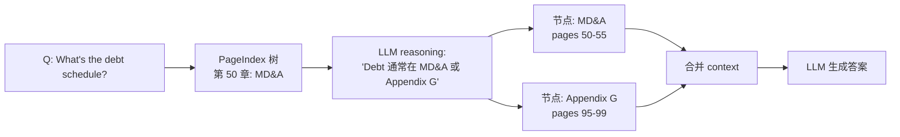

#### 10.4.2 结构保留（Structure Preservation）

财务表格的 header、subheader、footnotes、cell 关系被保留为树节点。固定大小分块会破坏这些结构。

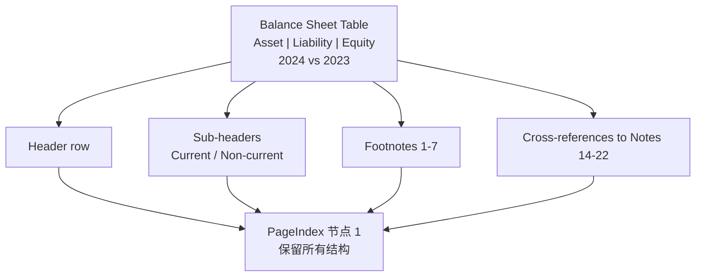

#### 10.4.3 多步推理（Multi-Step Reasoning）

需要从两个章节拿数据并计算的问题，PageIndex 通过迭代 loop 自然处理。

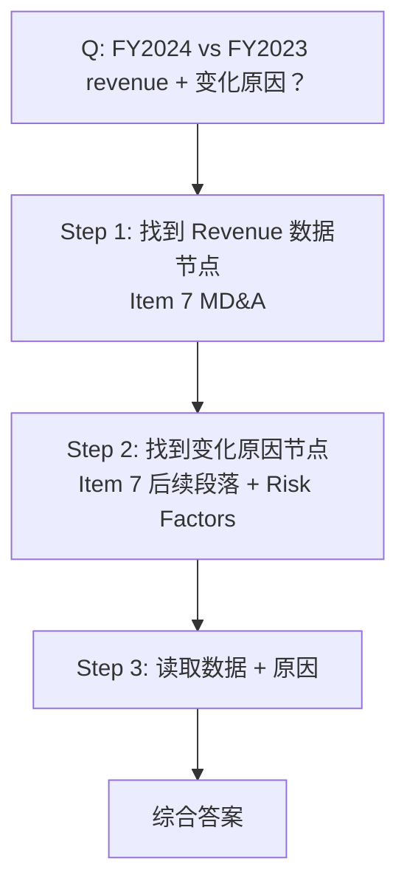

向量 RAG 一次 retrieve 只能拿 top-k chunks，**做不到这种多步推理**。

### 10.5 Mafin 2.5 的工业部署考量

#### 10.5.1 数据安全

金融文档属于敏感数据。Mafin 2.5 提供了两种部署模式：

- **云服务模式**：VectifyAI 托管，企业上传 PDF 到 VectifyAI 云端。
- **自托管模式**：企业自己部署 PageIndex 框架（MIT 协议）+ 私有 LLM（如 DeepSeek v3），数据不出企业内网。

自托管模式需要：

- 至少一台带 8xA100 / H100 的 GPU 服务器（跑 DeepSeek v3）；
- Redis（缓存 LLM 调用）；
- PostgreSQL（存 PageIndex 树）；
- 简单的 FastAPI 后端。

#### 10.5.2 实时性

金融分析往往是"季度新文件出来 → 立即分析"。PageIndex 树生成是 2–5 分钟/文档（100 页），可以做以下优化：

- **增量更新**：10-K 季度更新时，只更新变化的几页。
- **预生成**：已知季度更新日期，提前批处理。
- **后台异步**：用户上传 PDF 后立即返回 doc_id，树生成在后台异步进行。

#### 10.5.3 与人类审计员的协作

金融场景中"AI 给的答案必须能解释"。PageIndex 的 reasoning trace + page refs 天然适合人类审计：

```text
Q: What was the FY2024 net income for Apple?
A: $93,736 million.

Reasoning Trace:
- Step 1: Read tree, identified "Consolidated Statements of Operations" in Part II Item 8.
- Step 2: Selected node 0034 (pages 45-47).
- Step 3: Extracted "Net income: $93,736" from the table.

Page Refs: 45-47
Source: Apple Inc. 10-K FY2024, Item 8.
```

这种结构让审计员能在 5 秒内验证答案的准确性，**比"AI 给的数字不可信"要好得多**。

### 10.6 FinanceBench 之外的基准

Mafin 2.5 团队还测试了其他基准（部分未公开完整数据）：

- **金融监管问答（SEC Comment Letters）**：~95% 准确率
- **行业研报问答（券商研报）**：~92% 准确率
- **公司公告问答**：~96% 准确率

这些基准的多样性进一步说明：**PageIndex 不是"只对一种金融文档有效"，而是对结构化长文档普遍有效**。

### 10.7 工业技术手册场景的横评：PageIndex vs Gemini File Search

VectifyAI 官方博客《RAG for Technical Manuals》中给出 PageIndex Chat 与 Google Gemini File Search（基于向量 RAG 的标准实现）在工业 HVAC 手册上的横评：

- **向量 RAG（Gemini File Search）**：~30–50% 准确率
- **PageIndex**：~90% 准确率（特别在多跳问题、跨页引用、程序步骤类问题上）

一个典型例子：

> **Q: "In the event of a 'High Ambient Temperature Fault', what action should the operator take before initiating a manual reset?"**
>
> **向量 RAG**：返回几个含 "High Ambient Temperature Fault" 的 chunks，但**没意识到这是个多步程序**——回答"consult the manual"（废话）。
>
> **PageIndex**：
> 1. 推理 "High Ambient Temperature Faults 通常在 Operating Modes 章节"；
> 2. 选节点 pages 139-142；
> 3. 推理 "在 Mechanical Cooling Mode 下 free cooling valve 关闭，会触发 transition"；
> 4. 进一步验证 pages 135-139 (unit faults) 与 178-179 (cutout settings)；
> 5. 综合给出 "先检查 ambient temperature 设置、确认 free cooling valve 状态、然后才能 manual reset" 的完整答案。

这种**多跳程序推理**正是向量 RAG 的死穴，也是 PageIndex 工业技术手册场景的核心价值。

### 10.8 本章小结

- Mafin 2.5 是 VectifyAI 推出的金融 RAG 产品，完全构建在 PageIndex 之上，**FinanceBench 上达到 98.7% 准确率、100% 覆盖**——是当时 RAG 在金融 QA 领域的 SOTA。
- 远超其他竞争对手：Quantly 94%、Fintool 98%（但只覆盖 66.7%）、ChatGPT 4o+Search 31%、Perplexity 45%。
- 98.7% 来自三个关键机制：跨引用 follow、结构保留、多步推理。
- 在 ChatGPT 4o 与 DeepSeek v3 上都达到 98.7%，证明不依赖特定 LLM，企业可自托管。
- 工业部署需考虑数据安全（自托管）、实时性（增量更新、预生成、异步）、与人类审计员协作（reasoning trace + page refs）。
- 在工业技术手册场景的横评中，PageIndex 在多跳/程序/跨页类问题上明显优于 Gemini File Search 等向量 RAG。

---

## 十一、LLM Wiki 范式起源：Karpathy 的"反 RAG"愿景

### 11.1 Karpathy Gist 起源

2026-04-04，Andrej Karpathy（特斯拉 Autopilot 神经网络栈架构师、OpenAI 联合创始人、AI 教育影响最大的研究者之一）在 GitHub Gist 上发布了一份名为 [llm-wiki](https://gist.github.com/karpathy/442a6bf555914893e9891c11519de94f) 的"想法文件"，标题是"A pattern for building personal knowledge bases using LLMs"。这份 Gist 在 2026-04-06 之后迅速被 20+ 工程师实现成开源项目，并在 Hacker News、Twitter、AI Reddit 引发广泛讨论。

Karpathy 在 Gist 开篇就抛出了一个尖锐的观察：

> "Most people's experience with LLMs and documents looks like: [ask a question, get an answer, ask another, get another, etc.]" — 即传统 RAG 工作流。

然后立即给出对照：

> "The idea here is different. Instead of just retrieving from raw documents at query time, the LLM **incrementally builds and maintains a persistent wiki** — a structured, interlinked collection of markdown files that sits between you and the raw sources. When you add a new source, the LLM doesn't just index it for later retrieval. It reads it, extracts the key information, and integrates it into the existing wiki — updating entity pages, revising topic summaries, noting where new data contradicts old claims, strengthening or challenging the evolving synthesis. The knowledge is compiled once and then *kept current*, not re-derived on every query."

这个范式被他命名为 "LLM Wiki"，核心承诺是 **knowledge is compiled once and then kept current**——知识应该被**编译**一次并持续更新，而不是每次查询都重新推导。

### 11.2 为什么这与 RAG 不同

传统 RAG 的隐含假设是：

> "原始资料很难整理，每次查询都从 raw 重新检索是合理的。"

Karpathy 的反驳是：

> "LLM 可以读完资料后写一个维基百科。维基百科是已经整理好的知识。后续查询只需要读维基百科。"

这个反驳的工程意义巨大：

- **每次查询 token 消耗**：传统 RAG 需要 re-embed + top-k retrieval + LLM reading；LLM Wiki 直接读已编译的 wiki，token 消耗降到 10%–20%。
- **知识可解释性**：维基是结构化的 markdown，可以人类审阅；向量嵌入是黑盒。
- **跨源综合**：LLM 在编译时已经做了多源综合，查询时直接拿到综合结果。
- **知识版本化**：wiki 是 git 仓库里的 .md 文件，自带版本历史。

但代价是：

- **需要"冷启动"**：wiki 第一次要花时间编译（与 PageIndex 树生成类似）。
- **可能过时**：原始资料更新时 wiki 必须同步更新。
- **维护成本**：cross-references、index、log 需要 LLM 持续维护。

Karpathy 自己也承认这增加了一些开销，但认为 wiki 维护 1 年后**会质变**——"a wiki that has been well-maintained for a year is qualitatively different from a fresh system"。

### 11.3 LLM Wiki 的三大优势

#### 11.3.1 复利效应（Compounding Effect）

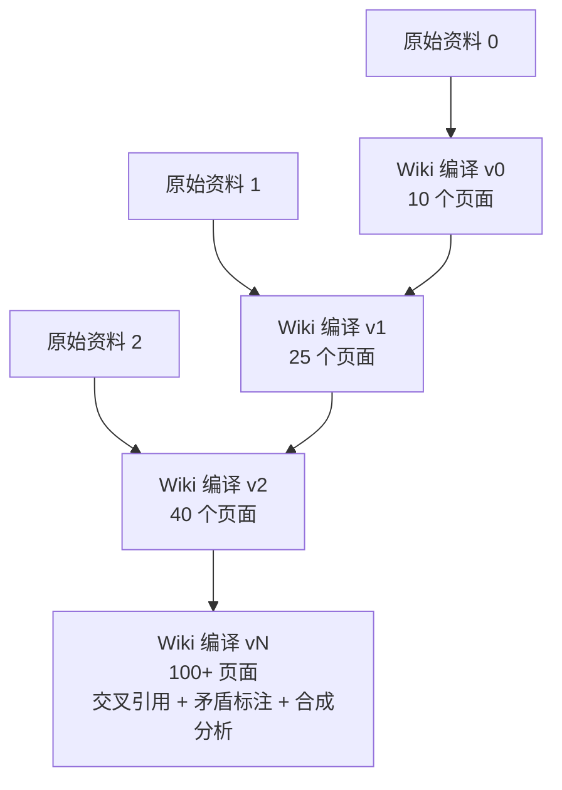

**复利**意味着：

- 第 1 个资料 → 10 个新页面（信息增益 100%）。
- 第 2 个资料 → 15 个新页面 + 更新 10 个旧页面（增量 50% + 增强 100%）。
- 第 10 个资料 → 5 个新页面 + 更新 30 个旧页面 + 自动发现 3 个新合成主题。
- 第 100 个资料 → 1 个新页面 + 更新 50 个旧页面 + 自动交叉验证 20 个矛盾点。

**这是一个"知识越丰富，新输入带来的价值越大"的网络效应**。传统 RAG 没有这个效应——每个新文档都只是"新增几个 chunks"。

#### 11.3.2 零维护成本

Karpathy 指出：

> "The tedious part of maintaining a knowledge base is not the reading or the thinking — it's the bookkeeping. Updating cross-references, keeping summaries current, noting when new data contradicts old claims, maintaining consistency across dozens of pages. Humans abandon wikis because the maintenance burden grows faster than the value. **LLMs don't get bored, don't forget to update a cross-reference, and can touch 15 files in one pass.** The wiki stays maintained because the cost of maintenance is near zero."

这是 LLM Wiki 相比传统 wiki（如 Confluence、Notion）的根本性优势——**LLM 可以毫无怨言地维护 cross-references、index、log 等"枯燥但重要"的工作**。

#### 11.3.3 知识合成的涌现

当 wiki 足够大时，LLM 可以**自动发现跨页面的模式**：

- "我看到 concept A 在 5 个资料里被讨论过，可能值得做一个 A 的 synthesis page。"
- "concept B 和 C 在 3 个资料里同时出现，可能有 hidden relationship。"
- "我看到 2 个资料在 X 问题上矛盾，需要标注 contradiction。"

这些**涌现式综合（emergent synthesis）**是 LLM Wiki 长期使用后最让人惊艳的特性，也是 Karpathy 反复强调的 "knowledge that actually compounds" 的来源。

### 11.4 LLM Wiki 的三层架构

Karpathy 的 Gist 明确描述了 LLM Wiki 的三层架构：

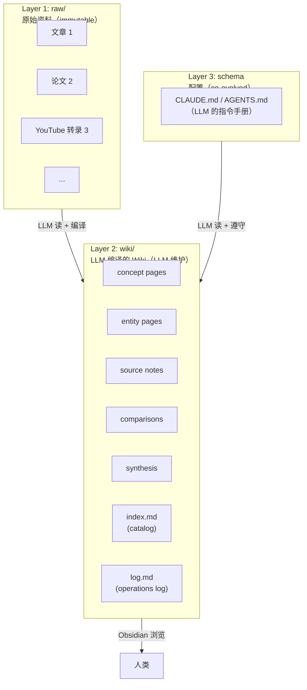

#### 11.4.1 Layer 1: raw/（原始资料）

- **不可变（immutable）**：原始资料只读不动，LLM 不会修改。
- **多种格式**：文章、PDF、YouTube 转录、网页、播客转录、笔记。
- **建议工具**：Obsidian Web Clipper（浏览器插件，把网页转 markdown）。

#### 11.4.2 Layer 2: wiki/（LLM 编译的 Wiki）

- **LLM 拥有**：LLM 创建、更新、维护所有页面。
- **人类可读**：人类只读不写（或极少写）。
- **多种页面类型**：
  - **concept pages**：抽象概念（如 "MCTS"、"vector embedding"）
  - **entity pages**：具体实体（如人物、公司、产品）
  - **source notes**：单篇资料的摘要
  - **comparisons**：跨资料的对比分析
  - **synthesis**：跨多个概念的综合性分析
  - **index.md**：目录，所有页面的索引
  - **log.md**：操作日志，所有 ingest/query/lint 的时间线

#### 11.4.3 Layer 3: schema（配置）

- **CLAUDE.md / AGENTS.md**：告诉 LLM 如何维护 wiki。
- **co-evolved**：人类和 LLM 共同演化。
- **可定制**：可以根据不同领域定制不同的页面模板、命名规范、frontmatter schema。

Karpathy 的核心比喻是：

> "Obsidian is the IDE. The LLM is the programmer. The wiki is the codebase."

**Obsidian 是 IDE**（让人类浏览 wiki 的人机界面）  
**LLM 是程序员**（维护 wiki 的"开发者"）  
**Wiki 是 codebase**（被维护的"代码库"）

### 11.5 LLM Wiki 的三大工作流

Karpathy 在 Gist 中描述了 LLM Wiki 的三个核心工作流：

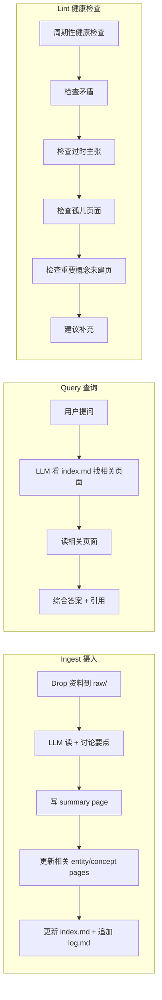

#### 11.5.1 Ingest（摄入）

流程：

1. 用户把原始资料放到 `raw/` 目录。
2. 通知 LLM "ingest [filename]"。
3. LLM 读资料、讨论关键要点、写 summary page。
4. LLM 更新所有相关的 entity/concept/comparison 页面。
5. 维护 cross-references、更新 index.md、append log.md。

**单次 ingest 通常会 touch 10–15 个 wiki 页面**。Karpathy 建议"一次 ingest 一份资料"，保持人在 loop 中；也可以 batch ingest 多份。

#### 11.5.2 Query（查询）

流程：

1. 用户问问题。
2. LLM 看 index.md 找相关页面。
3. 读相关页面。
4. 综合答案 + 引用（markdown 链接到 wiki 页面）。

**关键洞察**：答案可采取多种形式——markdown 页面、对比表格、幻灯片（Marp）、图表（matplotlib）、canvas。**好的答案可以回写到 wiki 作为新页面**。

#### 11.5.3 Lint（健康检查）

周期性 lint 检查：

- **矛盾**：不同页面对同一事实有冲突。
- **过时主张**：被新资料推翻的旧结论。
- **孤儿页面**：没有 inbound link 的页面。
- **缺失 cross-references**：应该链接但没链接的页面。
- **未建页的重要概念**：被多次提到但没有专属页面。
- **数据缺口**：应该补充的资料。

Lint 报告作为 ingest 下一轮的输入，形成"持续改进"循环。

### 11.6 命名与术语演进

Karpathy 在 Gist 中用的是 "LLM Wiki" 这个词，但实现社区衍生出多种命名：

- **LLM Wiki**：原始 Karpathy 命名
- **LLM Knowledge Base**（LLM 知识库）：更正式的说法
- **AI-managed Wiki**：强调 AI 维护
- **Compiled KB**：强调"编译"范式
- **Living Wiki**：强调"持续演化"
- **Self-Maintaining KB**：强调"自维护"

这些命名都指向同一范式。VectifyAI 在 2026-04 推出 OpenKB 时用的是 "Open LLM Knowledge Base"，强调开放性。

### 11.7 与传统知识管理的差异

| 维度 | 传统 Wiki（Confluence、Notion） | LLM Wiki |
| --- | --- | --- |
| 谁写 | 人类 | LLM |
| 维护成本 | 高（人类厌倦） | 几乎为零 |
| 跨引用维护 | 人类手工 | LLM 自动 |
| 一致性 | 容易漂移 | LLM 强制 |
| 知识复利 | 无（人写完就忘） | 有（每 ingest 都增强） |
| 上下文感知 | 无（只读） | 有（多轮对话 + 上下文） |
| 工具链 | Markdown + 模板 | Obsidian + LLM Agent |

### 11.8 与传统 RAG 的差异

| 维度 | 传统 RAG | LLM Wiki |
| --- | --- | --- |
| 知识存储 | 原始文档 + 向量索引 | 已编译的 Wiki 页面 |
| 查询方式 | 每次都从 raw 检索 | 基于已编译的 Wiki |
| 知识累积 | 无（每次独立） | 强（每次 ingest 都增强） |
| Cross-references | 无 | 自动维护 |
| 矛盾处理 | 无感知 | 自动标注 |
| 多跳推理 | 需要 iterative RAG | 直接读 synthesis page |
| Token 成本 | 高（每次读 raw） | 低（只读编译后的 wiki） |
| 冷启动 | 快（建向量索引） | 慢（编译 wiki） |
| 长期 TCO | 高（持续重检索） | 低（一次编译多次复用） |

### 11.9 关键问题：LLM Wiki 是 RAG 的替代还是补充？

这个问题在社区里有不同观点：

**替代派**：

> "If knowledge is compiled once, why re-retrieve? LLM Wiki makes RAG obsolete for knowledge-heavy use cases." — 用户 @kakhkAt

**补充派**：

> "LLM Wiki complements RAG. Use RAG for new sources, LLM Wiki for established knowledge." — 用户 @victorvvedtion（Vibe Sensei 作者）

**融合派**（VectifyAI 立场）：

> "OpenKB combines PageIndex (for long documents) and LLM Wiki (for cross-document synthesis). They serve different roles." — VectifyAI OpenKB 文档

本报告的立场是**融合派**——LLM Wiki 不是要"替代"RAG，而是在 RAG 之上增加"知识长期累积"的层。PageIndex + LLM Wiki 构成的 OpenKB 体系就是这个融合的最佳实践。

### 11.10 本章小结

- LLM Wiki 由 Karpathy 在 2026-04 Gist 中提出，核心思想是"知识应被编译一次并持续更新，而非每次重新检索"。
- 三大优势：复利效应（每 ingest 都增强已有 wiki）、零维护成本（LLM 不厌倦）、涌现式综合（自动发现跨页面模式）。
- 三层架构：raw/（不可变原始资料）、wiki/（LLM 维护的可读 wiki）、schema（CLAUDE.md/AGENTS.md 配置）。
- 三大工作流：Ingest（读 raw → 写 wiki）、Query（看 wiki → 综合答案）、Lint（健康检查 → 持续改进）。
- 与传统 RAG 的本质差异：从"每次从 raw 检索"转向"基于已编译的 wiki 回答"，token 成本低、知识累积强。
- LLM Wiki 不是 RAG 的替代而是补充：PageIndex + LLM Wiki 在 OpenKB 中合流，形成"长文档推理式检索 + 跨文档持续合成"的完整体系。

---

## 十二、LLM Wiki 三层架构：Raw / Wiki / Schema

### 12.1 Layer 1: raw/ 的工程实现细节

#### 12.1.1 文件命名规范

社区实现普遍采用以下命名规范：

```text
raw/
├── 2026-04-03-article-on-mcts.md
├── 2026-04-05-paper-on-graphrag.pdf
├── 2026-04-10-youtube-transcript-transformer.txt
└── 2026-04-15-notion-export-personal-kb.md
```

关键约定：

- **ISO 日期前缀**：`YYYY-MM-DD` 让文件按时间排序。
- **简短描述**：用 `-` 分隔的 slug，便于人类阅读。
- **保持原始扩展名**：`.md` / `.pdf` / `.txt` 不被改变。

#### 12.1.2 文件获取工具

- **Obsidian Web Clipper**：浏览器扩展，把网页转 markdown。
- **Zotero / Papers**：学术 PDF 管理。
- **yt-dlp + Whisper**：YouTube 视频下载 + 语音转录。
- **Notion / Evernote 导出**：把现有笔记导出为 markdown。
- **markitdown**（OpenKB 使用）：通用 file-to-markdown 转换器。

#### 12.1.3 不可变性保证

`raw/` 中的文件**永远不被 LLM 修改**。这是 LLM Wiki 范式的核心约束之一：

- 任何修改都在 `wiki/` 中进行；
- `raw/` 永远保留"原始真相"；
- 任何争议都通过 "看 raw" 解决。

社区实现中通常通过 `chmod -R a-w raw/` 或 git hook 强制不可写。

### 12.2 Layer 2: wiki/ 的目录结构

Karpathy 的 Gist 描述了 wiki/ 的概念性结构，但具体实现多样。下面是 [MetamusicX/llm-research-wiki](https://github.com/MetamusicX/llm-research-wiki) 的 6 个 wiki 子目录：

```text
wiki/
├── source-notes/    # 单篇资料摘要
├── concepts/        # 抽象概念
├── authors/         # 人物 / 作者
├── debates/         # 学术争论
├── syntheses/       # 跨多个概念的综合性分析
├── projects/        # 活跃研究 / 写作项目
├── index.md         # 全局目录
└── log.md           # 操作日志
```

其他实现的目录变体：

- [green-dalii/obsidian-llm-wiki](https://github.com/green-dalii/obsidian-llm-wiki) 用 `wiki/entities/` + `wiki/concepts/` + `wiki/sources/`。
- [ussumant/llm-wiki-compiler](https://github.com/ussumant/llm-wiki-compiler) 用 `wiki/topics/` + `wiki/concepts/`。
- [guanyang/llm-wiki](https://github.com/guanyang/llm-wiki) 用 `wiki/entities/` + `wiki/concepts/` + `wiki/summaries/` + `wiki/comparisons/` + `wiki/synthesis/`。
- [OpenKB](https://github.com/VectifyAI/OpenKB) 用 `wiki/sources/` + `wiki/summaries/` + `wiki/concepts/` + `wiki/explorations/` + `wiki/reports/`。

这种目录变体体现了 LLM Wiki 的**模块化特性**——目录结构是 schema 的一部分，可以根据领域定制。

### 12.3 页面模板与 YAML Frontmatter

每个 wiki 页面通常有 YAML frontmatter：

```yaml
---
title: "MCTS (Monte Carlo Tree Search)"
type: concept
tags: [algorithm, search, ai, planning]
related:
  - alpha-go
  - monte-carlo-methods
  - mcts-rag
created: 2026-04-08
updated: 2026-04-15
sources:
  - 2026-04-08-paper-on-mcts.md
  - 2026-04-12-blog-post-on-mcts-applications.md
---

# MCTS (Monte Carlo Tree Search)

[页面正文...]

## Definition
...
## Key Thinkers
...
## Related Concepts
- [[AlphaGo]]
- [[Monte Carlo Methods]]
- [[MCTS-RAG]]
```

frontmatter 字段的常见设计：

- `title`：页面标题
- `type`：concept / entity / source / comparison / synthesis
- `tags`：分类标签
- `related`：相关页面（用 `[[slug]]` 链接）
- `created` / `updated`：时间戳
- `sources`：贡献过本页面内容的原始资料
- `aliases`：别名（用于 cross-language dedup）

### 12.4 index.md：内容目录

`wiki/index.md` 是整个 wiki 的目录。它的格式在不同实现中略有不同，但核心结构是：

```markdown
# Knowledge Base Index

## Concepts (47)
- [[mcts]] — Monte Carlo Tree Search algorithm
- [[vector-embedding]] — Dense vector representations of text
- [[knowledge-graph]] — Graph-structured knowledge base
...

## Entities (23)
- [[andrej-karpathy]] — AI researcher, OpenAI co-founder
- [[vectify-ai]] — London-based AI company building PageIndex
...

## Source Notes (89)
- [2026-04-08-paper-on-mcts.md] — MCTS in modern AI applications
- [2026-04-12-blog-post-on-mcts.md] — MCTS in RAG
...

## Syntheses (8)
- [[synthesis-rag-paradigms]] — Comparison of Vector/Graph/Vectorless RAG
- [[synthesis-llm-knowledge-management]] — How LLMs are changing KB
...
```

`index.md` 在中等规模 wiki（< 500 页）上完全够用，**不需要 embedding-based 检索**。LLM 直接读 `index.md` 就能找到相关页面。

当 wiki 变大（> 500 页）时，可以：

- 按 cluster 组织（如 [MetamusicX](https://github.com/MetamusicX/llm-research-wiki) 把 concepts 按 4–6 个 cluster 分组）
- 加 synthesis page（cluster 内的综合性概览）
- 用 qmd 等本地搜索引擎做 BM25/vector 混合搜索

### 12.5 log.md：操作日志

`log.md` 是 append-only 的操作时间线：

```markdown
# Wiki Operations Log

## [2026-04-15] ingest | 2026-04-15-paper-on-graphrag.md
- Created: [[graph-rag]], [[lazy-graph-rag]]
- Updated: [[vector-rag]], [[retrieval-augmented-generation]]
- Synthesis: [[synthesis-rag-paradigms]] (added comparison table)

## [2026-04-14] query | "What is the difference between Vector RAG and GraphRAG?"
- Searched: [[vector-rag]], [[graph-rag]]
- Generated answer with 3 page references
- Filed: [[synthesis-vector-vs-graph-rag]] (new synthesis)

## [2026-04-13] lint | weekly health check
- Found 2 contradictions
- Found 5 orphan pages
- Found 3 concepts mentioned but lacking pages
- Auto-fixed: 5 orphan pages linked to 2 new entity pages
```

`log.md` 的好处：

- **可审计**：所有操作都有时间戳与结果。
- **可解析**：社区约定以 `## [YYYY-MM-DD]` 开头，可以用 `grep "^## \[" log.md | tail -5` 拉取最近 5 条。
- **可回放**：可以重放 log 来理解 wiki 的演化历史。

### 12.6 Layer 3: schema 的设计

schema 是 LLM 的"指令手册"，通常以 `CLAUDE.md`、`AGENTS.md` 或 `llm-wiki/SKILL.md` 形式存在。它的内容通常包括：

```markdown
# LLM Wiki Schema

## Overview
You maintain a knowledge base of markdown files in `wiki/`.
The raw materials in `raw/` are immutable.
You write and update the wiki; humans read it.

## Page Types
- **concept**: Abstract concept (e.g., MCTS, embedding)
- **entity**: Concrete entity (e.g., person, company, product)
- **source-note**: Summary of one source
- **comparison**: Cross-source analysis
- **synthesis**: Cross-concept analysis

## Folder Structure
- `wiki/concepts/`: concept pages
- `wiki/entities/`: entity pages
- `wiki/sources/`: source notes
- `wiki/comparisons/`: comparison pages
- `wiki/syntheses/`: synthesis pages

## Workflows

### Ingest
When user says "ingest [filename]":
1. Read raw/[filename]
2. Discuss key takeaways with user
3. Write source note in wiki/sources/
4. Identify relevant concept/entity/comparison pages
5. Create or update those pages
6. Maintain cross-references
7. Update index.md
8. Append entry to log.md

### Query
When user asks a question:
1. Read index.md
2. Identify relevant pages
3. Read those pages
4. Synthesize answer with [[wikilinks]]
5. (Optional) Save valuable answer to wiki/

### Lint
When user says "lint":
1. Scan for contradictions between pages
2. Find orphan pages (no inbound links)
3. Find important concepts mentioned but lacking pages
4. Check for stale claims
5. Report issues list

## Conventions
- Filenames: lowercase-kebab-case
- YAML frontmatter required on all pages
- All cross-references use [[slug]] notation
- Append-only log.md

## Tooling
- Obsidian for browsing
- Web Clipper for adding sources
- Dataview plugin for dynamic tables
- Marp for slide decks
```

schema 的好坏直接决定 wiki 质量。好的 schema 包含：明确的页面类型、清晰的目录结构、详细的工作流、规范约定、工具说明。

### 12.7 三层之间的数据流

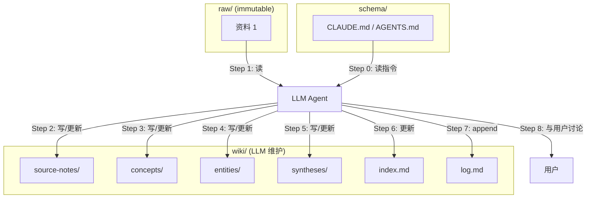

**关键点**：

- schema 是 LLM 每次操作前必读。
- raw/ 只读。
- wiki/ 的所有写操作都由 LLM 主导。
- 每次操作都会更新 index.md 与 log.md。
- LLM 与用户保持"讨论"——不是黑盒自动化。

### 12.8 本章小结

- LLM Wiki 三层架构：raw/（不可变原始资料）、wiki/（LLM 维护的 wiki）、schema（CLAUDE.md/AGENTS.md 配置）。
- raw/ 的核心约束是不可变性；推荐命名规范 `YYYY-MM-DD-slug.md`。
- wiki/ 的目录结构在不同实现中略有不同（concepts/entities/sources/comparisons/syntheses 五大类为常见配置）。
- 每个页面有 YAML frontmatter（title/type/tags/related/created/updated/sources/aliases）。
- index.md 是 wiki 的目录，按概念、实体、源、综合分组；log.md 是 append-only 操作时间线。
- schema 是 LLM 的指令手册，决定 LLM 如何维护 wiki；好坏直接决定 wiki 质量。

---

## 十三、LLM Wiki 核心工作流：Ingest / Query / Lint

### 13.1 Ingest 工作流的五步细节

Ingest 是 LLM Wiki 中最关键的工作流。Karpathy 描述的"理想流程"是：

```mermaid
flowchart TD
    I1["Step 1: User drops file in raw/<br/>+ says 'ingest [filename]'"] --> I2["Step 2: LLM reads file<br/>+ discusses key takeaways with user"]
    I2 --> I3["Step 3: LLM writes source note in wiki/sources/"]
    I3 --> I4["Step 4: LLM updates existing concept/entity/comparison pages"]
    I4 --> I5["Step 5: LLM updates index.md<br/>+ appends log.md entry"]
```

下面以 [clonn/obsidian_plugin_LLM-Wiki](https://github.com/clonn/obsidian_plugin_LLM-Wiki) 的实现为例，拆解 Ingest 的内部细节。

#### 13.1.1 Step 1: Drop + Ingest 命令

用户操作：

```bash
# 方式 1: Obsidian 命令面板
Cmd+P → "LLM-KB: Ingest current note"

# 方式 2: 把文件移到 raw/ 然后命令行
mv ~/Downloads/article.md raw/2026-04-15-article.md
ingest raw/2026-04-15-article.md
```

#### 13.1.2 Step 2: Read + Discuss

LLM 读取文件后**先与用户讨论**——这与"完全自动"的传统 RAG 截然不同：

```text
LLM: "I read the article. Here are the 5 key takeaways:
1. MCTS in RAG uses UCT for node selection
2. ...
Which ones do you want me to emphasize in the wiki? Any disagreements with existing wiki content?"
```

用户可能回答：

- "Takeaways 1, 2, 3 — skip 4, it's covered in [[knowledge-graph]] already."
- "Add a note that this contradicts [[old-paper]]."

这种**人在 loop 中**的交互是 LLM Wiki 区别于全自动 RAG 的关键特征。

#### 13.1.3 Step 3: Source Note

LLM 写一个 source note（在 `wiki/sources/`）：

```markdown
---
title: "MCTS in RAG (Source Note)"
type: source-note
source_file: 2026-04-15-article.md
created: 2026-04-15
tags: [mcts, rag, source-note]
---

# MCTS in RAG (Source Note)

## Summary
MCTS has been applied to RAG to improve multi-step reasoning...

## Key Claims
1. MCTS reduces token consumption by 30% via smart pruning
2. UCT formula is the de facto selection strategy
3. MCTS-RAG matches GPT-4o with smaller models via inference-time scaling

## Quotes
> "MCTS enables small models to scale at inference time..."

## Connections
- [[mcts]] — concept page
- [[rag]] — concept page
- [[mcts-rag]] — specific technique
- [[vectify-ai]] — company using MCTS in PageIndex
```

source note 是"原始资料的可追溯摘要"，未来 lint 或审计时可以从这里开始。

#### 13.1.4 Step 4: Update Concept/Entity/Comparison Pages

LLM 根据 source note 更新所有相关的概念页/实体页/对比页。每个被更新的页面都会在 frontmatter 中追加 `sources: [2026-04-15-article.md]`，并在正文添加新观点。

```markdown
# (in wiki/concepts/mcts.md)
---
title: "MCTS (Monte Carlo Tree Search)"
type: concept
related: [alpha-go, monte-carlo-methods, mcts-rag, rag]
sources:
  - 2026-04-10-paper-on-mcts.md
  - 2026-04-15-article.md     # ← 新增
updated: 2026-04-15
---

# MCTS

## Definition
...

## Recent Developments
- 2026-04-10: [paper] introduces MCTS in RAG
- 2026-04-15: [article] shows 30% token reduction  # ← 新增
```

**关键约束**：synthesis prompt 强制 LLM 遵守 "Preserve and extend existing content — never discard information already on the page."。这确保知识**累积**而非**覆盖**。

#### 13.1.5 Step 5: Update index.md + Append log.md

```markdown
# (in wiki/index.md)
## Concepts (48)  # ← +1
- ...
- [[mcts-rag]] — MCTS applied to RAG  # ← 新增

# (in log.md, append)
## [2026-04-15] ingest | 2026-04-15-article.md
- Created: [[mcts-rag]] (concept)
- Updated: [[mcts]], [[rag]] (concept)
- Created source note: [[2026-04-15-article]]
- 1 new cross-reference added
```

#### 13.1.6 Ingest 的实际成本

Ingest 一次的成本：

- **LLM 调用次数**：5–15 次（取决于资料长度与涉及的概念数）。
- **Token 消耗**：30K–100K 输入 + 5K–20K 输出。
- **单次成本（GPT-4o）**：$0.20–$0.80。
- **单次时间**：30 秒–2 分钟。

**注意**：Ingest 是**一次写、多次读**的优化——成本发生在 ingest 时，但 wiki 会被未来无数 query 复用。

### 13.2 Query 工作流

Query 工作流相对简单：

```mermaid
flowchart TD
    Q1["User asks question"] --> Q2["LLM reads index.md"]
    Q2 --> Q3["LLM identifies 3-10 relevant pages"]
    Q3 --> Q4["LLM reads those pages"]
    Q4 --> Q5["LLM synthesizes answer<br/>+ cites [[wikilinks]]"]
    Q5 --> Q6{"User accepts answer?"}
    Q6 -->|"Yes + valuable"| Q7["File answer back to wiki<br/>(as synthesis or new page)"]
    Q6 -->|"No"| Q8["Refine query, loop"]
```

#### 13.2.1 Query 时的索引查找

LLM 读 `wiki/index.md`（可能不到 5KB），就能找到相关页面。这比 RAG 的 embedding + top-k 快很多。

```text
User: "What is the difference between Vector RAG and GraphRAG?"

LLM:  [reads index.md, finds:]
      - [[vector-rag]] — concept page
      - [[graph-rag]] — concept page
      - [[synthesis-rag-paradigms]] — synthesis (covers both)
      
      [reads those 3 pages]
      
      [synthesizes answer with 3 page references]
```

#### 13.2.2 Cascade 导航（百页级 wiki 的关键技巧）

[MetamusicX/llm-research-wiki](https://github.com/MetamusicX/llm-research-wiki) 提出了一个三步 cascade 导航技巧，把 query 时的 token 成本降到常数：

```mermaid
flowchart TD
    Q["Query"] --> C1["Step 1: 看 index.md 找 cluster"]
    C1 --> C2["Step 2: 读 cluster 的 synthesis page<br/>(如果有)"]
    C2 --> C3["Step 3: 读 individual page<br/>(如必要)"]
    C3 --> A["综合答案"]
```

关键设计：

- **Cluster**：wiki 的概念被分成 4–6 个 thematic cluster（如 "Machine Learning"、"RAG"、"LLM Infrastructure"）。
- **Synthesis page**：每个 cluster 有一篇综合性 synthesis page（LLM 在该 cluster 概念数 > 阈值时自动生成）。
- **related field**：每个 concept 页面有 `related: [concept-a, concept-b, ...]`，引导 LLM 顺藤摸瓜。

**效果**：100+ 页面的 wiki，query 成本几乎恒定（约 5–10 个页面读取）。

#### 13.2.3 Query 的成本

- **LLM 调用次数**：1–3 次（读 index + 读相关页面 + 综合答案）。
- **Token 消耗**：3K–15K（远低于 RAG 的 30K+）。
- **单次成本**：$0.01–$0.05。
- **单次时间**：2–5 秒。

### 13.3 Lint 工作流

Lint 是 wiki 健康的"体检"：

```mermaid
flowchart TD
    L1["Trigger: 周期性（如每周）或显式 'lint'"] --> L2["检查矛盾"]
    L2 --> L3["检查过时主张"]
    L3 --> L4["检查孤儿页面"]
    L4 --> L5["检查缺失页面"]
    L5 --> L6["生成优先级 issues 列表"]
    L6 --> L7["与用户讨论修复"]
    L7 --> L8["执行修复（LLM 主导）"]
```

#### 13.3.1 检查项详解

**矛盾检查（Contradiction Detection）**

LLM 对所有页面的"key claims"做 pairwise 比较，发现 A 页与 B 页对同一事实有冲突表述。

```text
Contradiction found:
- [[mcts]] (updated 2026-04-10): "MCTS-RAG was first proposed by Hu et al."
- [[mcts-rag]] (updated 2026-04-15): "MCTS-RAG was first proposed by Zhang et al."
- Source: 2026-04-15-article.md contradicts 2026-04-10-paper.md

Severity: High
Suggestion: Investigate which is correct, update both pages.
```

**过时主张检查（Stale Claim Detection）**

LLM 找出"被新资料推翻"的旧结论（通常通过 source notes 的时序比较）。

```text
Stale claim found:
- [[paper-on-mcts]] (2026-04-10) said: "MCTS doesn't scale beyond 1000 documents."
- [[paper-on-mcts-scale]] (2026-04-12) said: "MCTS scales to 1M+ documents with pruning."
- Wiki [[mcts]] still reflects the old claim.

Severity: Medium
Suggestion: Update [[mcts]] to reflect the newer finding.
```

**孤儿页面检查（Orphan Page Detection）**

没有 inbound link 的页面（除了 index.md 与 log.md）。

```text
Orphan pages: 5
- [[some-old-concept]] (no inbound links)
- [[notes-from-meeting]] (no inbound links)
- ...

Severity: Low
Suggestion: Add inbound links or mark as deprecated.
```

**缺失页面检查（Missing Concept Detection）**

多次被提到但没有专属页面的概念。

```text
Missing concept pages:
- "Mafin 2.5" mentioned 4 times in [[mcts]], [[rag]], [[vectify-ai]] but no [[mafin-2.5]] page exists.

Severity: Medium
Suggestion: Create [[mafin-2.5]] entity page.
```

#### 13.3.2 Lint 的工程化

社区实现普遍提供两类 Lint：

- **自动修复**（silent fixes）：修复 dead links、补全 frontmatter、合并重复条目。
- **报告+确认**（notify fixes）：发现矛盾/缺失/孤儿，**等用户确认**再修。

Karpathy 强调 Lint 的输出应该是"prioritized issues list"，**不自动修复**——避免 LLM 在没有人类判断的情况下大规模修改 wiki。

#### 13.3.3 Lint 的成本

- **LLM 调用次数**：5–20 次（取决于 wiki 规模）。
- **Token 消耗**：20K–100K（需要把大量页面载入 context 比较）。
- **单次成本**：$0.10–$0.50。
- **单次时间**：1–5 分钟。

### 13.4 三大工作流的工程时序

```mermaid
flowchart LR
    subgraph Daily["Daily 工作流"]
        D1["Drop 资料到 raw/"] --> D2["Ingest<br/>(~30s-2min)"]
        D2 --> D3["Query 几次<br/>(~5s 每次)"]
    end
    subgraph Weekly["Weekly 工作流"]
        W1["Lint<br/>(~1-5min)"]
        W2["修复 issues<br/>(~10-30min)"]
    end
    Daily --> Weekly
    Weekly --> Daily
```

这种"日常小修 + 周期大检"的节奏，让 wiki 长期健康。

### 13.5 与"自动 RAG"的本质差异

很多读者会问：LLM Wiki 与 Self-RAG、Auto-RAG 等"自动 RAG" 有什么区别？

| 维度 | Self-RAG / Auto-RAG | LLM Wiki |
| --- | --- | --- |
| 知识存储 | 原始文档 + 向量 | 已编译 wiki |
| 知识更新 | 增量嵌入新文档 | 增量更新 wiki 页面 |
| Cross-references | 无 | 自动维护 |
| 矛盾处理 | 检索时发现并 ignore | 显式标注、保留 |
| 长期知识形态 | 文档集合 + 向量 | 结构化、可读的 wiki |
| 人类可读 | ❌（向量不可读） | ✅（markdown 可读） |
| 工具链 | 向量库 | Obsidian + LLM Agent |
| 复利效应 | 弱（文档之间无显式关联） | 强（cross-ref + 矛盾标注 + synthesis） |

**核心差异**：Self-RAG / Auto-RAG 仍然在"原始文档 + 向量"的范式里打补丁；LLM Wiki 是**从根本上换了一个范式**——知识被预先编译成可读、可审、可版本化的 wiki。

### 13.6 本章小结

- Ingest 工作流五步：Drop → Read+Discuss → Source Note → Update Pages → Update Index+Log。单次成本 $0.20–$0.80、30s–2min。
- Query 工作流三步：读 index.md → 读相关页面 → 综合答案（带 wikilink 引用）。Cascade 导航把 query 成本降到常数。
- Lint 工作流四类检查：矛盾、过期、孤儿、缺失；自动修复 + 报告确认两类。
- 三大工作流的工程时序：日常小修 + 周期大检。
- LLM Wiki 与 Self-RAG/Auto-RAG 的本质差异：前者是"已编译 wiki"范式，后者是"原始文档 + 向量"范式的补丁。

---

## 十四、LLM Wiki 工具生态：Obsidian 插件、Skill 与自动生长 Agent

### 14.1 LLM Wiki 实现的全景图

Karpathy 的 Gist 发布后一个月内（2026-04-04 至 2026-05），社区涌现出 20+ 个不同实现，可大致分为四类：

1. **Obsidian 插件类**（最丰富）：把 LLM Wiki 集成进 Obsidian 工作流。
2. **Claude Code / Codex Skill 类**：作为 Agent Skills 加载。
3. **CLI / 独立工具类**：用 Python / TypeScript 实现的 CLI 工具。
4. **自动生长 Agent 类**：让 Agent 自我演化、维护 wiki。

下表汇总了主要实现：

| 项目 | 作者 | 类型 | 协议 | Stars（约） | 核心特色 |
| --- | --- | --- | --- | --- | --- |
| [Astro-Han/karpathy-llm-wiki](https://github.com/astro-han/karpathy-llm-wiki) | Astro-Han | Agent Skill | MIT | 6.2k | Claude Code/Cursor/Codex 通用 |
| [clonn/obsidian_plugin_LLM-Wiki](https://github.com/clonn/obsidian_plugin_LLM-Wiki) | clonn | Obsidian 插件 | MIT | 4.8k | Karpathy 四阶段完整实现 |
| [green-dalii/obsidian-llm-wiki](https://github.com/green-dalii/obsidian-llm-wiki) | green-dalii | Obsidian 插件 | MIT | 3.5k | 95/100 Obsidian 评分、8 语言支持 |
| [guanyang/llm-wiki](https://github.com/guanyang/llm-wiki) | guanyang | Obsidian + Python | MIT | 1.8k | 知识层级管理、生命周期 |
| [MetamusicX/llm-research-wiki](https://github.com/MetamusicX/llm-research-wiki) | Paulo de Assis | Claude Code | MIT | 1.2k | 学术研究专用、cascade 导航 |
| [ussumant/llm-wiki-compiler](https://github.com/ussumant/llm-wiki-compiler) | ussumant | Claude Code Plugin | MIT | 0.8k | 支持代码库 wiki 编译 |
| [TrueHOOHA/LLM-Wiki-Skilled](https://github.com/TrueHOOHA/LLM-Wiki-Skilled) | TrueHOOHA | Agent Skill | MIT | 0.5k | 强调 workflow 刚性 |
| [AlphaLab-USTC/AutoWiki-skill](https://github.com/AlphaLab-USTC/AutoWiki-skill) | AlphaLab-USTC | Agent Skill | MIT | 0.4k | 学术 survey 风格 |
| [yologdev/karpathy-llm-wiki](https://github.com/yologdev/karpathy-llm-wiki) | yologdev | Agent + Automation | MIT | 0.3k | 自生长 wiki、4 阶段 pipeline |
| [VectifyAI/OpenKB](https://github.com/VectifyAI/OpenKB) | VectifyAI | CLI + PageIndex | Apache 2.0 | 0.6k | 与 PageIndex 合流 |

下面分别深入剖析几类典型实现。

### 14.2 Obsidian 插件实现

#### 14.2.1 clonn/obsidian_plugin_LLM-Wiki

[clonn/obsidian_plugin_LLM-Wiki](https://github.com/clonn/obsidian_plugin_LLM-Wiki) 提供了完整的 Karpathy 四阶段工作流：

```text
LLM-Wiki Workflow:
1. Ingest (raw/ → wiki/) - 摄入
2. Compile (LLM reads raw, builds concept articles) - 编译
3. Query (read wiki/, answer with citations) - 查询
4. Lint (scan for issues) - 健康检查
```

Obsidian 插件暴露的命令：

- `LLM-KB: Ingest current note` — 把当前笔记复制到 raw/ 并启动 ingest
- `LLM-KB: Compile wiki` — 生成 Claude Code 编译 prompt
- `LLM-KB: Ask the wiki` — 打开问答 modal，把答案保存到 wiki/derived/
- `LLM-KB: Lint wiki` — 扫描孤立/空文件/死链/重复
- `LLM-KB: Open index.md` — 跳转到 KB 入口
- `LLM-KB: Open log sidebar` — 显示 CLI 运行的流式输出

vault 结构：

```text
your-vault/
├── raw/                    # 摄入源（append-only）
├── wiki/                   # LLM 编译的 KB
│   ├── concepts/
│   ├── projects/
│   ├── people/
│   └── derived/            # 查询答案回写
├── notes/                  # 用户工作笔记
├── index.md
├── log.md
└── .llm-kb/queue/          # 给 Claude Code 的 prompt 队列
```

这个实现的优势是**与 Obsidian 完美集成**——用户可以在 Obsidian 中直接浏览 wiki、用 Dataview 查询、用 Graph View 看关系。

#### 14.2.2 green-dalii/obsidian-llm-wiki

[green-dalii/obsidian-llm-wiki](https://github.com/green-dalii/obsidian-llm-wiki) 强调**多语言支持**与**精细控制**：

- 8 种语言原生支持（英文、中文、日文、韩文、法文、德文、西班牙文、俄文）
- Entity/Concept 提取粒度可调（Minimal 5 项、Coarse 10、Standard 50、Fine 100、Custom 1–300）
- 三层架构：`sources/`（read-only）→ `wiki/`（LLM 生成）→ `schema/`（co-evolved config）
- 13 个模块化 TypeScript 模块

其架构图非常清晰：

```mermaid
flowchart TD
    subgraph S["sources/ (read-only)"]
        S1["笔记 1"]
        S2["笔记 2"]
    end
    subgraph W["wiki/ (LLM 生成)"]
        W1["sources/filename.md<br/>(源摘要)"]
        W2["entities/entity-name.md<br/>(实体页)"]
        W3["concepts/concept-name.md<br/>(概念页)"]
        W4["index.md<br/>(自动索引)"]
        W5["log.md<br/>(操作日志)"]
    end
    subgraph SC["schema/ (co-evolved)"]
        SC1["naming.yaml"]
        SC2["templates/"]
    end
    S -->|"ingest"| W
    SC -->|"读取"| W
    W -->|"Obsidian 浏览"| USER["用户"]
```

### 14.3 Agent Skills 类实现

#### 14.3.1 Astro-Han/karpathy-llm-wiki

[Astro-Han/karpathy-llm-wiki](https://github.com/astro-han/karpathy-llm-wiki) 把 Karpathy Gist 打包成一个**可重用的 Agent Skill**，支持 Claude Code、Cursor、Codex、OpenCode 等多种 Agent 平台：

```bash
# Claude Code
npx add-skill Astro-Han/karpathy-llm-wiki

# Cursor
npx add-skill Astro-Han/karpathy-llm-wiki

# Codex CLI
Copy to .agents/skills/karpathy-llm-wiki/

# OpenCode
npx add-skill Astro-Han/karpathy-llm-wiki
```

核心定义：

```text
An LLM wiki is a knowledge system where the LLM maintains structured wiki pages
instead of re-searching raw documents on every question. New sources are compiled
into durable markdown pages, cross-references are updated over time, and answers
cite the wiki pages that already contain the synthesized knowledge.
```

该 Skill 的 workflow 文档化极好：

| Operation | What it does | Output |
| --- | --- | --- |
| Ingest | Collects a source into raw/ and compiles it into the wiki | New or updated wiki pages |
| Query | Searches the wiki and answers with citations | Grounded answers linking to markdown pages |
| Lint | Checks index integrity, links, and wiki health | Auto-fixes plus reported issues |

#### 14.3.2 TrueHOOHA/LLM-Wiki-Skilled

[TrueHOOHA/LLM-Wiki-Skilled](https://github.com/TrueHOOHA/LLM-Wiki-Skilled) 强调"用 Agent Skills 强制 workflow 刚性，避免 Agent 行为偏离"。

它的三大核心 skill：

- `.agents/skills/llm-wiki-ingest/SKILL.md` — Ingest workflow skill
- `.agents/skills/llm-wiki-query/SKILL.md` — Query workflow skill
- `.agents/skills/llm-wiki-lint/SKILL.md` — Lint workflow skill

每个 skill 都是独立的 markdown 文件，描述完整的"做什么、怎么做、何时做"。这种把 workflow 拆成可独立加载的 skill，是 LLM Wiki 工程化的关键技巧——避免 LLM 在长 context 中"忘记"流程。

### 14.4 CLI / 独立工具实现

#### 14.4.1 ussumant/llm-wiki-compiler

[ussumant/llm-wiki-compiler](https://github.com/ussumant/llm-wiki-compiler) 是 Claude Code/Codex 兼容的 plugin，特色是**支持把代码库编译为 wiki**：

```bash
/wiki-init        # 一次性 setup，自动检测 markdown 目录
/wiki-capture     # 抓取 URL + 上下文到 wiki
/wiki-compile     # 增量编译源文件到 topic 文章
/wiki-ingest      # 单文件摄入（交互式）
/wiki-lint        # 健康检查
/wiki-search      # 关键词搜索
/wiki-query       # Q&A + 自动回写
/wiki-visualize   # 启动交互式知识图谱
```

关键指标：383 个源文件、13MB → 13 篇 topic 文章、161KB，**token 减少 84%**。

#### 14.4.2 guanyang/llm-wiki

[guanyang/llm-wiki](https://github.com/guanyang/llm-wiki) 引入了**知识层级（tier）**管理：

```text
┌─────────────────────────────────────────────────┐
│  Procedural    output/*                          │  Ready-to-use deliverables
├─────────────────────────────────────────────────┤
│  Semantic      wiki/comparisons/ + synthesis/    │  Cross-material insights
├─────────────────────────────────────────────────┤
│  Episodic      wiki/entities/ + concepts/        │  Structured knowledge
├─────────────────────────────────────────────────┤
│  Working       wiki/summaries/                   │  Single-material summaries
└─────────────────────────────────────────────────┘
```

**晋升标准**：

- summary 中提到 2+ 资料 → 创建 entity/concept 页
- 3+ entity/concept 形成 pattern → 创建 comparison/synthesis 页
- synthesis 置信度 ≥ 0.85 → 建议作为 deliverable 发布

这种 tier 管理让 wiki 知识有"温度"——频繁使用的升温、长期不用的降温。

### 14.5 自动生长 Agent 实现

最让人惊艳的一类实现——**让 Agent 自我生长 wiki**。

#### 14.5.1 yologdev/karpathy-llm-wiki

[yologdev/karpathy-llm-wiki](https://github.com/yologdev/karpathy-llm-wiki) 的核心理念：

> "One prompt. Zero human code. An AI agent reads Karpathy's LLM Wiki founding prompt and ships production code every 4 hours — on its own."

```mermaid
flowchart TD
    A["ASSESS"] --> B["PLAN"]
    B --> C["BUILD"]
    C --> D["COMMUNICATE"]
    A --> A1["读 founding prompt<br/>+ 读 codebase<br/>+ 检查 build"]
    B --> B1["对比 vision 与当前状态<br/>+ 决定 1-3 任务"]
    C --> C1["实施 → 构建+测试<br/>+ 评估（独立 agent）<br/>+ 修复或回滚"]
    D --> D1["写 journal<br/>+ 记录 learnings<br/>+ 响应 issues"]
```

Agent 的工作流是 4 阶段 pipeline：

1. **Assess**（独立 agent）：读 founding prompt、读 codebase、检查 build。
2. **Plan**：对比 vision 与当前状态，决定 1–3 个最有价值任务。
3. **Build**（实施 agent）：实施 → 构建+测试 → 评估（独立 agent）→ 修复或回滚。
4. **Communicate**：写 journal entry、记录 learnings、响应 issues。

**关键 insight**：harness enforces quality, not the LLM.

- Build 失败？fix agent 有 5 次重试机会。
- Evaluator 拒绝 diff？再 3 次重试。
- 仍失败？自动回滚到 last known-good commit。
- 保护文件（founding prompt、workflows）由 shell 脚本在每任务后机械检查——不问 LLM"你是否动了不该动的东西"。

**安全措施**：

- 随机 boundary nonces 让 issue content 不可预测
- 内容消毒（HTML 注释剥离、标记符替换）
- 作者白名单（只有审批用户 issue 才处理）
- 受保护文件在每任务后机械强制
- 出问题自动回滚 + 提 issue

这种"自我生长 + 严格护栏"的模式，是 LLM Wiki 范式**未来应用于企业级自主 Agent** 的一个探索。

#### 14.5.2 AutoWiki-skill（AlphaLab-USTC）

[AlphaLab-USTC/AutoWiki-skill](https://github.com/AlphaLab-USTC/AutoWiki-skill) 把 LLM Wiki 应用于**学术研究**：

- Drop papers in → LLM identifies milestone nodes（概念性突破）
- Cluster papers around milestones
- Build a hierarchical file tree that mirrors the field's structure
- Write deep analysis with temporal links between sources

```text
You drop PDFs           LLM compiles                    You browse in Obsidian
─────────────    ──────────────────────────    ──────────────────────────────────
 raw/new/    →    Identify milestones          kb/topics/  (milestone nodes)
                  Cluster papers               kb/sources/ (deep analysis pages)
                  Trace temporal evolution     kb/journal/ (cognitive timeline)
                  Write cross-linked wiki       index.md    (survey-style tree)
```

**两天的 ingest 输出示例**：

- 50+ concept pages
- 30+ source analysis pages
- 1 cognitive timeline
- 完整的 temporal graph

AutoWiki 的哲学：

> "Good survey papers don't just list references — they identify milestones, trace how ideas evolved, and organize the field into a coherent structure. AutoWiki does the same thing, automatically."

这种"survey-quality knowledge graph maintained in Obsidian"是 LLM Wiki 范式在学术研究中的具体落地。

### 14.6 Obsidian 工具链最佳实践

无论选择哪个 LLM Wiki 实现，Obsidian 都有几个**强推荐**的配套插件：

| 插件 | 用途 |
| --- | --- |
| **Dataview** | 跨页面查询 frontmatter 字段；自动生成动态表格/列表 |
| **Graph View** | 可视化 wiki 内部 cross-reference 网络 |
| **Excalidraw** | 嵌入手绘风格架构图、思维导图 |
| **Marp** | 从 markdown 页面直接生成 slide deck |
| **Web Clipper** | 一键把网页转 markdown 进 raw/ |
| **Image auto-upload**（如 Image Plus） | 自动下载远程图片到 local raw/assets/ |

这些插件与 LLM Wiki 是**互补关系**——LLM 负责"写"和"维护"，Obsidian 负责"浏览"和"消费"。

### 14.7 工程化挑战与解决方案

LLM Wiki 在大规模（1000+ 页面）时会遇到几个挑战：

#### 14.7.1 Context Window 限制

即使是 Claude 3.5 Sonnet（200K）、GPT-4o（128K），也无法一次装下 1000+ 页面。

**解决方案**：

- **Cascade 导航**（MetamusicX）：cluster → synthesis → related → page。
- **Index.md 优先**：LLM 先读 index.md（KB 级）找到 cluster。
- **qmd 外部搜索引擎**（Karpathy 推荐）：CLI/MCP 接口的本地混合 BM25/vector 搜索。
- **Page 摘要缓存**：每个 page 有 ~200 token 的 ultra-summary，独立存储供 LLM 快速浏览。

#### 14.7.2 LLM 漂移（Drift）

多次 ingest 后，LLM 可能对同一概念写出"略有不同"的描述，导致 wiki 内部不一致。

**解决方案**：

- **严格的合成 prompt**（preserve & extend, never discard）
- **Lint 工作流**定期检测矛盾
- **Schema 强制**：用 schema.md 给 LLM 严格定义页面模板
- **人为 review 关键页面**：定期 human-in-the-loop 审查

#### 14.7.3 冷启动成本

新 wiki 第一次要花大量时间编译。

**解决方案**：

- **分批 ingest**：先 ingest 最重要的 10 份资料，建立骨架；后续增量。
- **人类先写草稿**：人写 2–3 篇核心 page（如 research map），让 LLM 在此基础上扩展。
- **空 wiki 模板**：用 community template 起步（如 `MetamusicX/llm-research-wiki` 提供的 schema 模板）。

### 14.8 本章小结

- LLM Wiki 实现生态丰富，可分四类：Obsidian 插件、Agent Skills、CLI/独立工具、自动生长 Agent。
- 主流项目包括 Astro-Han、clonn、green-dalii、guanyang、MetamusicX、ussumant、TrueHOOHA、AlphaLab-USTC、yologdev、OpenKB。
- Obsidian 插件类（clonn、green-dalii、guanyang）最实用，与 Dataview/Graph View 完美集成。
- Agent Skills 类（Astro-Han、TrueHOOHA）把 workflow 拆为可独立加载的 skill，避免 LLM 漂移。
- 自动生长 Agent（yologdev、AutoWiki）让 Agent 自我演化 wiki，是未来企业级自主 Agent 的探索。
- 最佳实践：搭 Obsidian 工具链（Dataview、Graph View、Marp、Web Clipper）、用 cascade 导航应对 context 限制、用 lint 应对 LLM 漂移、用分批 ingest 应对冷启动。

---

## 十五、OpenKB：PageIndex 与 LLM Wiki 模式的合流

### 15.1 OpenKB 是什么

[OpenKB](https://github.com/VectifyAI/OpenKB)（VectifyAI 推出，Apache 2.0 协议，2026-04 上线）是一个**把 PageIndex 的长文档推理式检索与 LLM Wiki 的持续编译合二为一**的 CLI 知识库系统。

VectifyAI 在博客《OpenKB: An Open-Source LLM Knowledge Base》中明确指出其定位：

> "OpenKB is our answer to that. It is not a collection of scripts; it is a coherent system with a defined architecture, a persistent wiki format, and a retrieval layer built specifically for the document types that matter in serious research."

OpenKB 不是 PageIndex 的扩展，也不是 LLM Wiki 的实现——它是**两者的合流**，把"长文档推理式检索"和"跨文档持续合成"统一在一个系统中。

### 15.2 OpenKB 的核心架构

```mermaid
flowchart TD
    RAW["raw/<br/>（用户放入的原始文件）"]
    SHORT["短文档<br/>（< 20 页）"]
    LONG["长文档<br/>（≥ 20 页 PDF）"]
    MD["markitdown<br/>转 Markdown"]
    PI["PageIndex<br/>生成树索引"]
    LLM["LLM<br/>（OpenAI / Anthropic / Gemini / Ollama）"]
    WIKI["wiki/<br/>（编译后的知识库）"]
    RAW --> SHORT
    RAW --> LONG
    SHORT --> MD --> LLM
    LONG --> PI --> LLM
    LLM --> WIKI
```

关键设计：

- **短文档**（默认 < 20 页）：用 markitdown 转 markdown，LLM 读全文。
- **长文档**（默认 ≥ 20 页 PDF）：用 PageIndex 生成树索引 + 摘要，LLM 读树。
- **统一 wiki 输出**：短文档与长文档的最终产物都进入同一个 `wiki/` 目录。

### 15.3 OpenKB 的目录结构

```text
raw/                              # 你放入文件的位置
 │
 ├─ 短文档 ──→ markitdown ──→ LLM 读全文
 │                                     │
 ├─ 长 PDF ──→ PageIndex ───→ LLM 读树
 │                                     │
 │                                     ▼
 │                         Wiki 编译（用 LLM）
 │                                     │
 ▼                                     ▼
wiki/
 ├── index.md            # KB 总览
 ├── log.md              # 操作时间线
 ├── AGENTS.md           # Wiki schema（LLM 指令）
 ├── sources/            # 全文转换
 ├── summaries/          # 单文档摘要
 ├── concepts/           # 跨文档综合 ← 最有价值的部分
 ├── explorations/       # 保存的查询结果
 └── reports/            # Lint 报告
```

每个目录的职责：

- `sources/`：原始资料的全文 markdown 转换（短文档）。
- `summaries/`：单文档摘要（无论长短）。
- `concepts/`：跨文档综合页（最有价值的"复利"所在）。
- `explorations/`：用户查询时自动保存的答案（query 闭环）。
- `reports/`：lint 报告。
- `index.md`：所有页面的目录。
- `log.md`：操作时间线。
- `AGENTS.md`：LLM 的 schema 配置（类似 CLAUDE.md）。

### 15.4 OpenKB 的工作流

#### 15.4.1 初始化

```bash
# 安装
pip install openkb

# 初始化
openkb init
```

`init` 创建目录结构、生成 `AGENTS.md` schema。

#### 15.4.2 Ingest

```bash
# 放入文件
cp paper.pdf raw/
cp article.md raw/

# 触发 ingest
openkb ingest
```

OpenKB 内部：

1. 扫描 `raw/`，对每个文件判断长短（< 20 页 vs ≥ 20 页）。
2. 长 PDF → PageIndex 树生成 → LLM 读树。
3. 短文档 → markitdown → LLM 读全文。
4. LLM 生成 `wiki/summaries/` 下的 source note。
5. LLM 识别相关 concept pages，创建/更新 `wiki/concepts/` 下的页面。
6. 更新 `wiki/index.md` 与 `wiki/log.md`。

#### 15.4.3 Query

```bash
openkb query "What is the main thesis of the paper?"
```

OpenKB 内部：

1. 读 `wiki/index.md` 找相关页面。
2. 读相关页面的内容（含 PageIndex 树检索的长文档内容）。
3. LLM 综合答案，附 `[[wikilink]]` 引用。
4. （可选）保存答案到 `wiki/explorations/` 作为新页面。

#### 15.4.4 Lint

```bash
openkb lint
```

输出 prioritized issues 列表：矛盾、过期、孤儿、缺失。

### 15.5 OpenKB 与 Karpathy LLM Wiki 的对比

| 维度 | Karpathy LLM Wiki（纯 markdown） | OpenKB |
| --- | --- | --- |
| 长文档处理 | 受 context 限制 | PageIndex 树索引，无限长 |
| 短文档处理 | 直接读全文 | markitdown 转换后读全文 |
| 文档格式支持 | markdown 优先 | PDF/Word/PPT/Excel/HTML/text/CSV/md |
| 多模态 | 弱 | 原生（PageIndex OCR 处理扫描件） |
| Wiki 维护 | LLM 主导 | LLM 主导（同 Karpathy 范式） |
| 复利效应 | 强 | 强（同 Karpathy 范式） |
| 文件监控 | 需要手动触发 | watchdog 自动 watch raw/ |
| 工具链 | Obsidian | Obsidian + PageIndex + markitdown |
| 协议 | MIT（各家实现） | Apache 2.0 |

**关键差异**：OpenKB 在 LLM Wiki 之上**专门解决了 Karpathy 自己也承认的"长文档"问题**——通过 PageIndex 把长文档也纳入 wiki 编译流程。

### 15.6 OpenKB 与传统 LLM Wiki 实现的 PageIndex 集成

OpenKB 在 wiki 内部**用 PageIndex 做长文档检索**，与传统 LLM Wiki 实现有显著不同：

```mermaid
flowchart TD
    Q["Query: 'paper 关键论点？'"] --> IDX["读 wiki/index.md"]
    IDX --> C1["找到 [[paper-summary]]"]
    C1 --> C2["找到 [[paper-long-doc-pageindex-tree]]"]
    C2 --> C3["用 PageIndex 树检索 long doc"]
    C3 --> C4["拉取相关章节正文"]
    C4 --> A["综合答案"]
```

这种**"wiki 提供元信息 + PageIndex 提供长文档精读"**的混合架构，是 OpenKB 最大的创新点。

### 15.7 OpenKB 的多 LLM 支持

OpenKB 通过 LiteLLM 支持多 LLM：

| Provider | Env var | Default model |
| --- | --- | --- |
| Anthropic | `ANTHROPIC_API_KEY` | `claude-sonnet-4-20250514` |
| OpenAI | `OPENAI_API_KEY` | `gpt-4o` |
| Google | `GOOGLE_GENERATIVE_AI_API_KEY` | `gemini-2.0-flash` |
| Ollama | `OLLAMA_BASE_URL` / `OLLAMA_MODEL` | `llama3.2`（本地） |

可设置 `LLM_MODEL` 覆盖默认模型。

### 15.8 OpenKB 的工程实现

OpenKB 的核心依赖：

- **PageIndex**：长文档处理
- **markitdown**：通用 file-to-markdown 转换
- **OpenAI Agents SDK**：Agent 框架（虽然 OpenAI 维护，但 LiteLLM 让它支持所有 LLM）
- **LiteLLM**：多 LLM 统一接口
- **Click**：CLI 框架
- **watchdog**：文件系统监控

roadmap 中明确的下一步：

- [ ] Extend long document handling to non-PDF formats
- [ ] Scale to large document collections with nested folder support
- [ ] Hierarchical concept (topic) indexing for massive knowledge bases
- [ ] Database-backed storage engine
- [ ] Web UI for browsing and managing wikis

### 15.9 OpenKB 的局限

OpenKB 当前阶段（2026-04，v0.1.x）的局限：

- **协议是 Apache 2.0**（注意：PageIndex 是 MIT，OpenKB 是 Apache 2.0，企业商用时要注意）。
- **依赖 PageIndex 本地版**：意味着必须能调用 LLM（即使是自托管的 DeepSeek v3）。
- **alpha 状态**：roadmap 中的多个功能尚未实现。
- **文档相对简单**：与 PageIndex 的丰富文档相比，OpenKB 的 cookbook 与教程较少。

### 15.10 OpenKB 的战略意义

VectifyAI 推出 OpenKB 是一个**明确的战略信号**：

> "我们不只想做 PageIndex（长文档推理式检索）。我们想做端到端的 AI 知识库基础设施。"

OpenKB 把 PageIndex 嵌入到一个完整的 LLM Wiki 工作流中，意味着 VectifyAI 把自己定位为"**无向量 AI 知识库的开源领导者**"——这与传统向量数据库公司（Pinecone、Weaviate、Qdrant、Chroma）形成了明确的差异化竞争。

对**企业用户**来说，OpenKB 是一个**开箱即用**的私有知识库方案：

- 装上 pip install openkb
- 丢文件到 raw/
- 用 LLM 自动化编译 wiki
- 用 Obsidian 浏览
- 用 PageIndex 处理长 PDF

全程不需要向量数据库、不需要 embedding 模型、不需要 pinecone 账户。

### 15.11 本章小结

- OpenKB 是 VectifyAI 推出的 CLI 知识库系统，把 PageIndex 的长文档推理式检索与 LLM Wiki 的持续编译合二为一。
- 短文档（< 20 页）走 markitdown + LLM 全文，长 PDF 走 PageIndex 树索引 + LLM 读树。
- 工作流：init / ingest（自动 watch raw/）/ query / lint，Apache 2.0 协议。
- 最大的创新是"wiki 提供元信息 + PageIndex 提供长文档精读"的混合架构。
- 通过 LiteLLM 支持 100+ LLM，包括本地 Ollama，适合数据敏感场景。
- VectifyAI 推出 OpenKB 是明确的战略信号：把自己定位为"无向量 AI 知识库的开源领导者"，与传统向量数据库公司形成差异化竞争。

---

## 十六、PageIndex vs LLM Wiki：两种范式的本质差异

### 16.1 一句话对照

| 范式 | 一句话定位 | 核心抽象 | 状态 |
| --- | --- | --- | --- |
| **PageIndex** | "把长文档变成 LLM-friendly 的目录树" | JSON 树 | 检索式（每次 query 都重新推理） |
| **LLM Wiki** | "让 LLM 持续编译并维护一份 markdown Wiki" | markdown + cross-ref | 累积式（知识随时间增长） |

### 16.2 横向对比表

| 维度 | PageIndex | LLM Wiki |
| --- | --- | --- |
| **核心数据结构** | JSON 树 | markdown 文件 + YAML frontmatter |
| **知识存储** | 原始文档 + 树索引 | 已编译的 wiki |
| **检索机制** | LLM 推理 / MCTS / Hybrid | 读 index.md → 读相关页面 |
| **多跳推理** | 原生支持（迭代 LLM 推理） | 通过 synthesis page 间接支持 |
| **跨引用 follow** | 通过 node_id 直接跳 | 通过 [[wikilink]] 直接跳 |
| **冷启动成本** | 中（生成树 $0.1–$6/文档） | 高（编译整个 wiki） |
| **运行时成本** | 中（$0.01–$0.1/查询） | 低（$0.01–$0.05/查询） |
| **知识累积** | 弱（树是一次性产物） | 强（每次 ingest 都增强） |
| **跨文档综合** | 不擅长 | 强（concepts/ + syntheses/） |
| **人类可读性** | 中（JSON） | 高（markdown） |
| **审计能力** | 强（reasoning trace + page refs） | 强（source notes + log.md） |
| **工具链** | PageIndex Chat / API / MCP | Obsidian + LLM Agent |
| **协议** | MIT | MIT（各家实现） |
| **代表项目** | VectifyAI/PageIndex | Karpathy Gist + 20+ 实现 |
| **生态合流** | OpenKB 把 LLM Wiki 范式合流 | OpenKB 把 PageIndex 范式合流 |

### 16.3 适用场景对比

```mermaid
flowchart TD
    A["业务场景"] --> B{"是否需要<br/>跨文档综合？"}
    B -->|"否"| C{"文档长度？"}
    B -->|"是"| D["LLM Wiki<br/>（concepts/ + syntheses/）"]
    C -->|"短 (< 20 页)"| E["传统 RAG 或<br/>PageIndex File System"]
    C -->|"长 (≥ 20 页)"| F["PageIndex<br/>（推理式树检索）"]
    C -->|"混合"| G["OpenKB<br/>（PageIndex + LLM Wiki 合流）"]
```

#### 16.3.1 选 PageIndex 当

- **业务核心是"在长文档里精确定位答案"**：如金融问答、合同审查、技术手册查询。
- **准确率是第一优先级**：错误答案的代价远高于 LLM 调用成本。
- **多跳推理常见**：用户常问"对比 A 与 B"、"follow 这个引用"等。
- **跨页引用是核心**：文档有大量"see Appendix G"这类内部引用。

#### 16.3.2 选 LLM Wiki 当

- **业务核心是"积累知识库并长期复用"**：如研究人员的文献库、咨询公司的客户情报库、企业的内部知识库。
- **跨文档综合是核心价值**：用户常问"我之前读过的资料里怎么说的"这类问题。
- **知识要 versioned & auditable**：原始资料 + wiki 都要可追溯。
- **人类要参与维护**：业务专家需要 review / edit 部分页面。

#### 16.3.3 选 OpenKB 当

- **同时需要"长文档精读"和"跨文档综合"**：典型如学术研究、企业 R&D、合规审查。
- **想要一个开箱即用的端到端方案**：不想自己拼装 PageIndex + LLM Wiki 工作流。
- **本地或私有部署**：数据敏感，不能用云服务。

### 16.4 共同的基础假设

尽管表面不同，PageIndex 和 LLM Wiki 共享一些基础假设：

1. **结构化知识比相似度更可靠**：相似度是"看起来像"，结构是"逻辑上是"。
2. **LLM 推理优于 embedding 检索**：当 LLM 足够强时，让 LLM 推理是更直接的路径。
3. **可解释性是生产 RAG 的必需**：黑盒的向量检索在企业场景不可接受。
4. **领域知识应被显式建模**：专家偏好、政策、规则要注入到系统中。

### 16.5 共同的局限

| 局限 | PageIndex | LLM Wiki |
| --- | --- | --- |
| **冷启动成本** | 中（树生成） | 高（wiki 编译） |
| **实时性** | 中（树生成 2-5 分钟） | 弱（需要持续维护） |
| **跨语料检索** | 不擅长 | 不擅长 |
| **延迟** | 2-8 秒/查询 | 2-5 秒/查询 |
| **超长文档** | 支持（> 1000 页） | 受 context 限制 |
| **依赖 LLM 质量** | 强 | 强 |

### 16.6 二者的融合：OpenKB 是未来

VectifyAI 推出 OpenKB 是**把 PageIndex 与 LLM Wiki 范式正式合流**的标志。这意味着未来企业 AI 知识库的**标准架构**可能是：

```mermaid
flowchart TD
    U["用户查询"] --> Q{"复杂度分类"}
    Q -->|"简单"| VR["Vector RAG<br/>(快速过滤)"]
    Q -->|"复杂"| PI["PageIndex<br/>(单文档精读)"]
    Q -->|"跨文档"| LW["LLM Wiki<br/>(已编译知识)"]
    Q -->|"关系推理"| GR["GraphRAG<br/>(实体关系)"]
    VR --> A["综合答案"]
    PI --> A
    LW --> A
    GR --> A
```

这种 **Adaptive RAG**（自适应 RAG）架构是 2026 年的明确趋势：用 query router 根据问题复杂度分到不同路径，每条路径用最合适的工具。

PageIndex 与 LLM Wiki 在这个架构中：

- **PageIndex 处理"单文档深读"**（如"这份合同第几条说...？"）。
- **LLM Wiki 处理"跨文档综合"**（如"我之前读过的所有资料里怎么看待...？"）。

二者**互补不冲突**。

### 16.7 本章小结

- PageIndex 与 LLM Wiki 在数据结构、检索机制、知识累积、适用场景上有本质差异。
- PageIndex 适合"长文档精确定位答案"；LLM Wiki 适合"知识长期累积与跨文档综合"。
- 共同基础假设：结构化知识优于相似度、LLM 推理优于 embedding、可解释性必需、领域知识应显式建模。
- 共同局限：冷启动成本、延迟、跨语料检索、超长文档支持。
- 二者通过 OpenKB 合流，形成"PageIndex 单文档精读 + LLM Wiki 跨文档综合"的完整体系，是未来 Adaptive RAG 架构的核心组件。

---

## 十七、范式之争：Vector RAG / GraphRAG / Vectorless RAG 三分天下

### 17.1 三大范式的核心特征

2025–2026 年的 RAG 范式之争，本质上是三种**"用何种方式组织外部知识"**的哲学分歧：

```mermaid
flowchart TD
    subgraph VEC["Vector RAG<br/>相似度匹配"]
        V1["文档 → chunks → embeddings → ANN 检索"]
        V2["优点: 速度快、扩展性好"]
        V3["缺点: 相似度 ≠ 相关性"]
    end
    subgraph GRAPH["GraphRAG<br/>实体关系图"]
        G1["文档 → 实体/关系抽取 → 知识图谱 → 图遍历"]
        G2["优点: 关系推理、跨文档"]
        G3["缺点: 索引成本高"]
    end
    subgraph VL["Vectorless RAG<br/>结构推理（PageIndex）"]
        L1["文档 → 树索引 → LLM 推理检索"]
        L2["优点: 准确率高、可解释"]
        L3["缺点: 延迟高、成本高"]
    end
```

### 17.2 三大范式的决策矩阵

[Towards AI](https://pub.towardsai.net/graphrag-vs-vectorless-rag-vs-vector-rag-a-2026-guide-to-advanced-context-engineering-e8e9264cab38) 2026-05 总结的决策矩阵：

```text
DECISION MATRIX
Query type            Structure    Accuracy need    Choose
─────────────────────────────────────────────────────────
Semantic lookup       Unstructured Normal           Vector RAG
Multi-hop relations   Any          High             GraphRAG
Structured doc exact  Structured   Very high        Vectorless RAG
Global themes         Large corpus Normal           GraphRAG
Simple factual        Any          Normal           Vector RAG
High-entity queries   Any          High             GraphRAG or Vectorless
Cross-ref navigation  Structured   Very high        Vectorless RAG
Mixed complexity      Any          Varies           Adaptive RAG (hybrid)
```

每个范式的**真正主场**：

- **Vector RAG** 主场：非结构化、海量、延迟优先
- **GraphRAG** 主场：关系推理、全局主题、跨文档
- **Vectorless RAG (PageIndex)** 主场：长结构化文档、跨引用、多跳推理、准确率优先

### 17.3 Vector RAG 的现状与增强

Vector RAG 在 2025–2026 年没有停滞，而是持续增强：

- **TurboQuant 类压缩**（FastBuilder.AI 2026-05）：2-bit 量化让向量索引内存占用降 8 倍，检索速度不降反升。
- **混合检索（BM25 + Vector）**：关键词与语义并行召回。
- **HyDE（Hypothetical Document Embeddings）**：先用 LLM 生成"假设答案"，再以假设答案为 query 检索——对短 query 尤其有效。
- **Self-RAG / Corrective-RAG**：检索后让 LLM 自我评估相关性，不相关就重新检索。
- **Rerank 精排**：bge-reranker-v2-m3、Cohere Rerank、LLM-based rerank。

但所有这些增强**仍然在"embedding 相似度"的范式里**——它们没有解决"相似度 ≠ 相关性"的根本问题。

### 17.4 GraphRAG 的体系化

Microsoft 在 2024 年开源 GraphRAG，2025 年又推出 **LazyGraphRAG**：

- **原始 GraphRAG**：先用 LLM 抽取所有实体的关系构建全局图，再用 Leiden 算法做社区检测，生成社区摘要。索引成本极高（每 100K token 约 $0.5–$2），但能回答"全局主题"类问题。
- **LazyGraphRAG**：把社区摘要延迟到 query 时计算。索引成本降到全量 GraphRAG 的 **0.1%**，代价是每个 query 多 2–8 秒。

Diffbot 的 benchmark 显示：

- 纯 Vector RAG 在 5+ 实体查询上准确率降到 **0%**（Diffbot benchmark）
- GraphRAG 在 5–15M token 规模表现最佳
- 超过这个规模，社区摘要开始失去区分度

GraphRAG 在**关系密集**的领域（DevOps、平台工程、安全、事件响应）特别有用——因为"答案往往不是一段话，而是一个关系结构"。

### 17.5 Vectorless RAG (PageIndex) 的差异化

PageIndex 在 2025-09 横空出世后，迅速在三个维度建立差异化优势：

1. **长结构化文档**：传统 Vector RAG 在 10-K/10-Q、合同、技术手册上准确率普遍 < 50%，PageIndex 达到 98.7%。
2. **可解释性**：每次检索都有 reasoning trace + page refs，传统 Vector RAG 是黑盒。
3. **无基础设施依赖**：不需要向量库、embedding 服务、rerank 服务——只要 LLM API。

但 PageIndex 也有明确边界：

- **跨文档检索不擅长**：需要 PageIndex File System 或 OpenKB 扩展。
- **短文档性价比低**：< 5 页的文档用 PageIndex 杀鸡用牛刀。
- **延迟较高**：单次 2-8 秒 vs 向量 RAG 的 < 100ms。
- **超大规模语料库不擅长**：百万级文档的检索需要其他方案。

### 17.6 LazyGraphRAG vs PageIndex 的微妙对比

一个有趣的对比是 LazyGraphRAG（2025）与 PageIndex（2025）的设计哲学：

| 维度 | LazyGraphRAG | PageIndex |
| --- | --- | --- |
| 核心思想 | 索引阶段省钱、查询阶段重计算 | 索引阶段重投入、查询阶段推理 |
| 索引成本 | 极低（0.1% 全量 GraphRAG） | 中（$0.1-6/文档） |
| 查询成本 | 中（+2-8 秒/查询） | 中-高（$0.01-0.1/查询） |
| 适用规模 | 10M+ tokens 语料 | 单文档/单本 10-K |
| 主要用途 | 跨文档关系推理 | 单文档精读 |
| 共同点 | 都用 LLM 推理代替显式结构化索引 | 同左 |

这两个方案的**核心思想其实是一致的**——"用 LLM 推理代替预计算的结构化索引"，只是应用场景不同。**未来它们很可能融合**——比如 LazyGraphRAG 跨文档召回 + PageIndex 单文档精读。

### 17.7 Hybrid RAG 与 Adaptive RAG

2026 年最明显的共识是：**单一范式不够用，需要 Hybrid 或 Adaptive**。

#### 17.7.1 Hybrid RAG

最直接的组合：

```mermaid
flowchart LR
    Q["Query"] --> VS["Vector Search<br/>(broad recall)"]
    VS --> CAND["候选文档集合<br/>(top-100)"]
    CAND --> PI["PageIndex<br/>(precise per-doc)"]
    PI --> A["精读答案"]
```

**优势**：
- Vector RAG 负责"召回"（快、覆盖广）
- PageIndex 负责"精读"（准、解释强）

#### 17.7.2 Adaptive RAG

更智能的组合——**用 query classifier 把请求分到最合适的路径**：

```mermaid
flowchart LR
    Q["Query"] --> CLS["Query Classifier<br/>(LLM)"]
    CLS -->|"简单语义"| V["Vector RAG"]
    CLS -->|"关系推理"| G["GraphRAG"]
    CLS -->|"结构化文档"| P["PageIndex"]
    CLS -->|"跨文档综合"| W["LLM Wiki"]
    V --> A["综合答案"]
    G --> A
    P --> A
    W --> A
```

**优势**：
- 每个 query 走最合适的路径
- 简单问题不被复杂方案拖累
- 复杂问题不被简单方案误判

#### 17.7.3 Adaptive RAG 的工程实现

[FastBuilder.AI](https://fastbuilder.ai/blog/the-four-paradigms-of-rag-a-technical-comparison) 2026-05 提出了更激进的"四范式 Adaptive"：

- **Vector RAG**（base 层）：负责"广泛语义召回"
- **GraphRAG**（middle 层）：负责"实体关系"
- **Topology RAG**（top 层）：负责"代码架构、数据流"
- **TurboQuant RAG**（infra 层）：负责"向量压缩加速"

LLM 在应用层**同时调用四层**，获得"语义相关 + 关系连接 + 结构合理 + 速度可接受"的综合能力。

### 17.8 主流方案的市场格局

下表汇总了 2026-06 的主要 RAG 方案与定位：

| 方案 | 范式 | 协议 | 适用场景 | 代表用户 |
| --- | --- | --- | --- | --- |
| **Pinecone / Weaviate / Qdrant** | Vector | 商业 / 开源 | 通用、海量 | 大量企业 |
| **LangChain / LlamaIndex** | Vector + 增强 | MIT | 通用 | 大量开发者 |
| **GraphRAG (Microsoft)** | Graph | MIT | 关系推理 | 微软、政府、研究 |
| **LazyGraphRAG** | Graph (lazy) | MIT | 大规模、低索引成本 | 微软客户 |
| **PageIndex** | Vectorless | MIT | 长结构化文档 | 金融、法律、医疗 |
| **Mafin 2.5** | Vectorless (金融) | 商业 | 金融文档 | 金融机构 |
| **OpenKB** | Vectorless + Wiki | Apache 2.0 | 综合知识库 | 研究、企业 |
| **Karpathy LLM Wiki** | Wiki | MIT | 个人/团队知识 | 开发者、研究者 |
| **FastMemory** | 四范式 Adaptive | 商业 | 高端企业 | 大型企业 |

### 17.9 投资与生态动向

- **2025 年 RAG 相关融资**：VectifyAI £1.1M、PageIndex 团队扩大、多个 RAG 创业公司获得种子轮。
- **大厂动向**：Microsoft 主推 GraphRAG/LazyGraphRAG；Google 在 Gemini File Search 中仍用向量 RAG；Anthropic 主推 MCP + Agent Skills；OpenAI 主推 Assistants API + Agents SDK。
- **学术动向**：MCTS-RAG（arXiv 2503.20757）、AirRAG、TreePS-RAG 等"树搜索 + RAG"的研究持续涌现。

### 17.10 本章小结

- RAG 范式之争在 2025-2026 年全面爆发：Vector RAG 持续增强、GraphRAG 体系化、Vectorless RAG（PageIndex）异军突起、LLM Wiki 范式被提出。
- 三大范式各有主场：Vector RAG 适合非结构化海量、GraphRAG 适合关系推理、Vectorless RAG 适合长结构化文档。
- LazyGraphRAG 与 PageIndex 都遵循"用 LLM 推理代替预计算结构"的哲学，可能在未来融合。
- Hybrid RAG 和 Adaptive RAG 是 2026 年明确趋势：用 query classifier 把请求路由到最合适的范式。
- 投资与大厂动向印证 RAG 仍是 LLM 应用层最热的细分赛道，但竞争格局从"向量数据库"扩展到"无向量推理式 + GraphRAG + Wiki"的多极并存。

---

## 十八、行业落地：金融、法律、医疗、技术手册四大场景

### 18.1 金融场景

金融是 PageIndex 最先突破的领域，也是 Mafin 2.5 的核心场景。

#### 18.1.1 典型任务

- **SEC 文件问答**（10-K、10-Q、8-K）：回答"FY2023 净收入"、"主要风险因素"、"审计意见"等。
- **财报对比**：FY2022 vs FY2023 的关键指标对比、变化原因分析。
- **监管文件解读**：SEC Comment Letters、FINRA 规则、Basel III 条款的检索与解释。
- **投资研究**：券商研报、卖方报告、行业分析的检索与综合。
- **合规审查**：内部合规文件、监管要求的快速定位。

#### 18.1.2 PageIndex 的优势

- **98.7% FinanceBench 准确率**已经验证在金融 QA 上的 SOTA。
- **跨引用 follow**：财报中 "see Note 14" 这类引用是家常便饭，PageIndex 天然支持。
- **可审计**：金融场景必须能解释"为什么这个答案"，PageIndex 的 reasoning trace + page refs 完美匹配。
- **表格完整保留**：财务报表的视觉结构（合并 cell、脚注、对齐）是答案定位关键。

#### 18.1.3 实际部署考量

- **数据安全**：金融数据高度敏感，建议自托管（DeepSeek v3 + PageIndex 框架）。
- **实时性**：季度财报发布后 1 周内完成全公司所有 10-K 分析，需要并行处理。
- **审计追踪**：每个查询的 reasoning trace 要持久化（PostgreSQL JSONB），保留 7 年（SOX 合规要求）。
- **人机协作**：AI 给的答案必须由人类审计员 review 后才能用，UI 上要有"approve/reject"按钮。

### 18.2 法律场景

#### 18.2.1 典型任务

- **合同审查**：NDA、MSA、SaaS 合同的关键条款定位（Termination、Liability、Indemnification 等）。
- **判例检索**：在判例库中找到与当前案件最相关的判例。
- **法规解读**：GDPR、CCPA、HIPAA 等法规的章节定位与解释。
- **尽职调查（DD）**：M&A 过程中的法律文档批量审查。

#### 18.2.2 PageIndex 的优势

- **跨引用 follow**：合同中 "Section 5.2 hereof" 之类的引用是核心需求。
- **结构保留**：合同的"定义"、"期限"、"终止"等章节结构是答案定位关键。
- **多跳推理**：DD 中需要交叉对比多份合同/多份法规，PageIndex 的多步推理天然支持。
- **可解释**：法律场景的"必须能解释"是 PageIndex reasoning trace 的最佳展示。

#### 18.2.3 实际部署考量

- **律师事务所 knowledge base**：把所内所有历史合同、备忘录、判例摘要构建为 LLM Wiki（OpenKB），律师在写新合同时可以"参考类似条款"。
- **数据安全**：客户文档不能上云，必须本地部署 + 私有 LLM。
- **专业术语**：法律领域有大量专业 jargon，建议在 PageIndex 树生成时用更强的 LLM（o1、Claude 3.7 Sonnet）。

### 18.3 医疗场景

#### 18.3.1 典型任务

- **临床试验报告问答**：回答某药物的 efficacy、adverse events、patient demographics。
- **医学文献检索**：PubMed 风格的多文档综合。
- **电子病历（EHR）问答**：从患者病历中提取关键信息。
- **FDA 监管文件**：510(k)、PMA 申请的章节定位。

#### 18.3.2 PageIndex 的优势

- **长文档处理**：临床试验报告 100+ 页，PageIndex 树生成 + 检索完美适配。
- **可解释**：医疗决策必须能解释"为什么是 X 诊断"，reasoning trace 是必需的。
- **跨引用 follow**：临床报告 "see Section 12.3" 等引用是常态。

#### 18.3.3 实际部署考量

- **HIPAA 合规**：患者数据严格保护，必须本地部署 + 私有 LLM。
- **专业 LLM**：医学领域建议用 Med-PaLM 2 等专业模型，或用 Claude 3.5 Sonnet 配合医学知识 prompt。
- **人工 review**：医疗决策永远不能完全自动化，PageIndex 给的答案必须由医生 review。

### 18.4 工业技术手册场景

#### 18.4.1 典型任务

- **HVAC 手册问答**："High Ambient Temperature Fault 时应如何操作？"
- **机械维修指南**：故障诊断、零件更换步骤、注意事项。
- **工业流程手册**：操作规程、安全规范、应急流程。
- **电气图纸文档**：电路图、PLC 程序的检索。

#### 18.4.2 PageIndex 的优势

VectifyAI 在《RAG for Technical Manuals》中给出了 PageIndex vs Gemini File Search 的横评结果，PageIndex 在以下几类问题上明显胜出：

1. **多步程序问题**：需要按顺序理解多个步骤的故障排查。
2. **跨页引用**：手册中"参见第 12 章"等引用。
3. **表格与图混合**：故障代码表 + 接线图 + 操作步骤的混合理解。
4. **条件分支**：不同条件下的不同操作建议。

#### 18.4.3 实际部署考量

- **现场工程师工作流**：工程师在车间拿着平板，语音查询"这个故障怎么办"，PageIndex 返回带 page refs 的答案。
- **多语言**：技术手册往往有 10+ 种语言版本，PageIndex 与 LLM 翻译能力结合。
- **离线部署**：工厂现场网络差，需要本地 LLM + 本地 PageIndex 索引。

### 18.5 学术研究场景

学术研究是 LLM Wiki 范式的主场。

#### 18.5.1 典型任务

- **文献库积累**：研究者读过的所有 paper、book、talk transcript 编译为 LLM Wiki。
- **跨论文综合**：对比不同 paper 的方法、找矛盾点、做 meta-analysis。
- **写作准备**：写论文时回顾"我之前读过的资料怎么说的"。

#### 18.5.2 LLM Wiki 的优势

- **复利效应**：学术研究是典型的"知识越丰富越有价值"场景，LLM Wiki 的复利效应最明显。
- **版本化**：wiki 是 git 仓库，天然支持版本历史与协作。
- **Obsidian 集成**：研究者普遍用 Obsidian，LLM Wiki 与 Obsidian 完美匹配。

#### 18.5.3 实际案例

- [MetamusicX/llm-research-wiki](https://github.com/MetamusicX/llm-research-wiki)：学术研究专用，cascade 导航。
- [AlphaLab-USTC/AutoWiki-skill](https://github.com/AlphaLab-USTC/AutoWiki-skill)：自动 survey 风格 wiki。
- [ussumant/llm-wiki-compiler](https://github.com/ussumant/llm-wiki-compiler)：把代码库编译为 wiki，特别适合研究项目文档。

### 18.6 企业知识管理场景

#### 18.6.1 典型任务

- **公司内部文档库**：所有会议纪要、产品 spec、技术文档、HR 政策的统一知识库。
- **新员工 onboarding**：新员工通过 LLM Wiki 快速了解公司产品、组织、流程。
- **跨部门协作**：A 部门查询 B 部门的文档，避免"知识孤岛"。

#### 18.6.2 OpenKB 的优势

- **端到端方案**：OpenKB 是开箱即用的 CLI，不需要拼装多个工具。
- **本地部署**：企业内网，私有 LLM（Ollama + Llama 3.1 70B 或 DeepSeek v3）。
- **Obsidian 浏览**：员工用熟悉的 Obsidian 客户端浏览 wiki。

#### 18.6.3 实际部署考量

- **数据敏感**：企业内部文档不能上云，必须本地。
- **性能与成本平衡**：自托管 LLM 成本高，但避免 SaaS 订阅与数据泄露。
- **维护流程**：明确谁负责 ingest、谁负责 lint、谁负责 schema 更新。

### 18.7 跨场景共同最佳实践

无论哪个场景，以下最佳实践都适用：

1. **自托管优先**：除非业务允许 SaaS，否则本地部署 + 私有 LLM。
2. **存 PageIndex 树与 Wiki**：核心资产必须持久化（PostgreSQL JSONB、S3）。
3. **Reasoning trace 必存**：可解释性与审计的基石。
4. **人机协作**：AI 给的答案必须由人类 review，关键场景加 approve/reject 流程。
5. **周期性 Lint**：每周或每月 LLM-driven 健康检查。
6. **Schema 严格化**：CLAUDE.md/AGENTS.md 写得越详细，LLM 输出越稳定。
7. **冷启动分批**：不要一次性 ingest 所有文档，分批+人在 loop 中。

### 18.8 本章小结

- 金融、法律、医疗、技术手册四大场景是 PageIndex 的核心落地领域；学术研究与企业知识管理是 LLM Wiki 的核心落地领域。
- 金融场景：Mafin 2.5 验证 98.7% 准确率，强审计与高数据安全。
- 法律场景：合同审查、判例检索、法规解读，强解释与跨引用 follow。
- 医疗场景：临床试验、EHR、监管文件，强可解释与本地化部署。
- 技术手册场景：HVAC、机械、工业流程，强多步程序推理。
- 学术研究：LLM Wiki 复利效应最明显，Obsidian 完美集成。
- 企业知识管理：OpenKB 端到端方案，本地部署 + 私有 LLM。
- 跨场景共同最佳实践：自托管优先、存核心资产、存 reasoning trace、人机协作、周期 lint、严格 schema、分批冷启动。

---

## 十九、性能、成本与工程化的权衡

### 19.1 性能基准：延迟、吞吐、成本

#### 19.1.1 单次查询延迟对比

| 范式 | 典型延迟 | 主导因素 |
| --- | --- | --- |
| Vector RAG（top-k + LLM） | 200ms–2s | embedding + 向量库 + LLM 生成 |
| Vector RAG + Rerank | 1s–3s | rerank 模型调用 |
| GraphRAG（懒模式） | 3s–10s | LLM 推理 + 社区遍历 |
| PageIndex（纯 LLM Prompt） | 2s–8s | LLM 调用次数（通常 2-4 次） |
| PageIndex（Value + MCTS） | 1s–5s | value function 评估 + MCTS 迭代 |
| PageIndex（Hybrid） | 2s–6s | 并行 + 早停 |
| LLM Wiki Query | 2s–5s | 读 wiki 页面 + LLM 综合 |
| OpenKB Query | 3s–8s | PageIndex 树检索 + LLM Wiki 综合 |

#### 19.1.2 吞吐量对比

假设 1x GPU 服务器、OpenAI API（Tier 4 限流）、单 GPU 等效 100 QPS：

| 范式 | 峰值 QPS | 1000 query/h 成本 |
| --- | --- | --- |
| Vector RAG | 50-200 | $0.5-2 |
| PageIndex | 5-20 | $5-30 |
| LLM Wiki Query | 10-30 | $3-15 |
| OpenKB | 3-10 | $10-40 |

PageIndex 与 OpenKB 的吞吐量明显低于 Vector RAG——这是**单次查询更"重"**的代价。

#### 19.1.3 索引成本

| 范式 | 100 页文档 | 1000 页文档 |
| --- | --- | --- |
| Vector RAG（embed 全文） | $0.05 | $0.5 |
| GraphRAG（full） | $5-10 | $50-100 |
| GraphRAG（Lazy） | $0.1-0.5 | $1-5 |
| PageIndex（GPT-4o） | $0.5-1 | $5-10 |
| PageIndex（GPT-4o-mini） | $0.1-0.3 | $1-3 |
| PageIndex（DeepSeek v3 自部署） | $0.05-0.2（GPU 摊销） | $0.5-2 |

### 19.2 TCO 视角的判断

总拥有成本（TCO）包括：

- **索引成本**：一次性或周期性。
- **查询成本**：每次查询。
- **运维成本**：向量库、embedding 服务、rerank 服务、LLM API。
- **质量成本**：错误答案导致的业务损失 + 人工 review 成本。

**TCO 决策树**：

```mermaid
flowchart TD
    A["业务场景"] --> B{"文档类型？"}
    B -->|"非结构化、 海量"| V["Vector RAG<br/>TCO 最优"]
    B -->|"结构化、 长篇"| P["PageIndex<br/>TCO 最优"]
    B -->|"关系密集"| G["GraphRAG<br/>TCO 最优"]
    B -->|"混合"| A1["Adaptive RAG<br/>TCO 最优"]
    A1 --> V
    A1 --> P
    A1 --> G
    A1 --> W["LLM Wiki<br/>（如适用）"]
```

经验法则：

- **Vector RAG 适合** query 量大、单 query 价值低、对错误容忍高的场景（如客服 FAQ）。
- **PageIndex 适合** query 量不大、单 query 价值高、对错误零容忍的场景（如金融分析）。
- **GraphRAG 适合** 跨文档关系推理密集的场景（如知识图谱问答、DevOps）。
- **LLM Wiki 适合** 知识长期累积、跨文档综合密集的场景（如研究、企业 KB）。
- **Adaptive RAG 适合** 多种 query 类型混合的大型生产系统。

### 19.3 工程化挑战

#### 19.3.1 LLM Provider 锁定

PageIndex 与 LLM Wiki 都**强依赖 LLM 质量**。当 LLM 升级（GPT-4o → GPT-4.5、Claude 3.5 → Claude 4）时：

- 树的生成质量可能变化。
- Wiki 维护质量可能变化。
- Reasoning trace 风格可能变化。

**解决方案**：

- 用 LiteLLM 抽象 LLM 切换。
- 用 versioning 记录每个文档/页面对应的 LLM 版本。
- 周期性用新 LLM 重做 Lint 验证。

#### 19.3.2 错误传播

PageIndex 的 tree generation 错误（错位页码、错误 summary）会传递到所有后续检索。LLM Wiki 的"preserve & extend" prompt 也可能放大早期错误。

**解决方案**：

- 强自愈循环（`fix_incorrect_toc_with_retries()`）。
- 人工 spot check 关键节点。
- 周期 Lint 验证。

#### 19.3.3 Prompt Engineering 复杂性

PageIndex 的 tree search prompt、LLM Wiki 的 synthesis prompt 都很复杂，参数多。Prompt 微小变化可能导致完全不同的输出。

**解决方案**：

- 把所有 prompt 集中管理在 `prompts.py`。
- 用 prompt versioning（git）。
- 周期性 A/B 测试不同 prompt 变体。

#### 19.3.4 成本控制

PageIndex 单次查询 $0.01-0.1，100 万次查询就是 $1 万–10 万。LLM Wiki 的 Ingest 一次 $0.5，1 万文档就是 $5000。

**解决方案**：

- **Prompt caching**：GPT-4o 与 Claude 3.5 都支持 prompt caching，cache hit 时成本降 90%。
- **批量处理**：Ingest 大量文档时用 batch API 节省成本。
- **小模型混合**：tree search 用 GPT-4o-mini，关键决策（final answer）用 GPT-4o。
- **早停**：Hybrid Tree Search 的"信息充分"判断可避免不必要的后续调用。

#### 19.3.5 可观测性

PageIndex 与 LLM Wiki 都是 LLM-heavy 系统，需要的可观测性比传统 RAG 复杂得多：

- 每次 LLM 调用的 token、cost、latency
- 每次 tree search 的 reasoning trace
- 每次 LLM Wiki ingest 的 update set
- 每次 Lint 的 issues 列表

**解决方案**：

- Langfuse / Helicone / Arize Phoenix 等 LLM 可观测性平台。
- 自建 dashboard：每次 query 的"问题 → 选中节点 → 答案 → 用户反馈"全链路。
- 定期 review 高 cost/low quality 的 query。

### 19.4 安全与合规

#### 19.4.1 数据泄露风险

- **PageIndex 云服务**：上传到 VectifyAI 的 PDF 是核心数据泄露风险。
- **LLM Wiki with SaaS LLM**：用 OpenAI / Anthropic 时，原始资料与 wiki 都被发送给 LLM。
- **OpenKB / PageIndex 自托管**：风险降到本地内网级别。

**最佳实践**：

- 敏感场景必须自托管。
- 用本地 LLM（Ollama + Llama 3.1 70B / Qwen 2.5 72B）作为"安全层"，再决定是否调用云端 LLM。
- 重要数据**脱敏**后再上传（如遮盖 PII、机密编号）。

#### 19.4.2 输出审计

金融、医疗、法律场景的 AI 输出必须能审计：

- 每次 answer 关联 reasoning trace、source refs、LLM version。
- 审计日志要可检索、可导出、保留 7 年（SOX/HIPAA/GDPR）。
- UI 上提供"为什么这个答案"的链接。

#### 19.4.3 偏见与公平

PageIndex 的 tree generation 与 LLM Wiki 的 ingest 都可能继承 LLM 的偏见（地区、性别、种族）。

**最佳实践**：

- 用多个 LLM 交叉验证关键答案。
- 周期性人工 review 抽样答案。
- 监控 demographic parity 等公平性指标。

### 19.5 与现有 RAG 系统的迁移路径

对于已经在用 Vector RAG 的企业，迁移到 PageIndex + LLM Wiki 的路径：

```mermaid
flowchart LR
    A["现状：Vector RAG"] --> B["阶段 1: Pilot<br/>对 1 个业务线用 PageIndex 替代"]
    B --> C{"对比 准确率<br/>+ 用户满意度"}
    C -->|"胜出"| D["阶段 2: 扩到 3-5 业务线"]
    C -->|"相当"| E["保持 Vector RAG"]
    D --> F["阶段 3: 加 LLM Wiki<br/>做跨文档综合"]
    F --> G["阶段 4: Adaptive RAG<br/>统一调度"]
```

**关键建议**：

- 不要"全量替换"——PageIndex 在某些场景不如 Vector RAG。
- 从一个高价值、低风险的场景试点（如"金融分析师工作台"）。
- 准确率提升 30%+ 后再考虑扩量。
- LLM Wiki 适合知识库型业务，不适合实时交互业务。

### 19.6 本章小结

- 性能基准：Vector RAG 最快（< 1s）、PageIndex 中等（2-8s）、LLM Wiki Query 中等（2-5s）、OpenKB 较慢（3-8s）。
- TCO 决策：Vector RAG 适合 query 量大价值低、PageIndex 适合 query 量小价值高、GraphRAG 适合关系密集、Adaptive RAG 适合混合。
- 工程化挑战：LLM Provider 锁定、错误传播、prompt engineering 复杂性、成本控制、可观测性。
- 安全合规：敏感场景必须自托管、输出必须可审计、监控 LLM 偏见。
- 迁移路径：从高价值低风险场景试点，逐步扩量到 Adaptive RAG 统一调度。

---

## 二十、局限性与未来发展：开源现状与路线图

### 20.1 PageIndex 的当前局限

基于 [agent-cookbook.com](https://agent-cookbook.com/tutorial/29k-stars-no-vectors-how-pageindex-replaces-embeddings-with-llm-reasoning) 2026-05 的客观评估与社区反馈，PageIndex 当前（2026-06）的局限包括：

#### 20.1.1 MCTS 仅商业版提供

- 开源版只包含纯 LLM Prompt 树搜索。
- Value-Function MCTS 与 Hybrid Tree Search 只在 VectifyAI 云服务。
- 这是开源与商业版本最大的能力差距。

#### 20.1.2 OCR 仅商业版提供

- 开源版用传统 PDF 解析（pdfplumber/PyPDF2 类）。
- 复杂扫描件 PDF 需要付费的 PageIndex OCR 服务。
- 对企业内部"扫描件档案"的处理能力有限。

#### 20.1.3 延迟与吞吐量

- 单次查询 2-8 秒，QPS 5-20。
- 不适合"用户每秒钟点一次"的实时场景。
- 需要前置 cache 或 LLM 早停优化。

#### 20.1.4 跨文档检索

- PageIndex 是**单文档精读**范式，跨文档检索需要 OpenKB 或 PageIndex File System 扩展。
- 单一 PageIndex 实例无法回答"我 1000 份 10-K 中哪份讲了 X"。

#### 20.1.5 SECURITY.md 与外部审计

- 开源版暂无 SECURITY.md。
- 暂无外部安全审计。
- 企业生产部署前需要自己评估。

#### 20.1.6 时延基准

- VectifyAI 未发布官方时延基准。
- 社区实测 2-8 秒，但跨 LLM / 跨文档大小差异大。
- Production 决策需要内部 benchmark。

#### 20.1.7 Verdict

agent-cookbook.com 的最终判定是：

> "Worth watching, not yet production-grade. The README flags early beta. There is no SECURITY.md, and the MCTS retrieval layer the docs reference is not in the open-source code. Until then, the framework accuracy is good enough to test on a real workload, but not yet good enough to bet a production system on. Watch for PageIndex 2.0 or an MCTS-OSS release as the trigger."

### 20.2 LLM Wiki 的局限

LLM Wiki 范式自身也有限制：

#### 20.2.1 冷启动成本

- 从零开始编译 wiki 要花相当时间（小时到天级）。
- 不如"建向量索引"快速（分钟级）。

#### 20.2.2 维护纪律

- 需要持续 ingest + lint，否则 wiki 会过时。
- 在忙碌的团队中，wiki 维护容易被"低优先级"化。

#### 20.2.3 Schema 设计门槛

- 写好 schema（CLAUDE.md/AGENTS.md）需要经验。
- 坏的 schema 会导致 wiki 质量低（LLM 输出漂移、矛盾、缺失）。

#### 20.2.4 Context Window 限制

- 即使 Claude 3.5 Sonnet 200K，也无法一次处理 1000+ 页面。
- Cascade 导航、qmd 外部搜索是必备工程。

#### 20.2.5 LLM 漂移

- 多次 ingest 后，LLM 可能对同一概念写出"略有不同"的描述。
- Lint 是补救手段，但治标不治本。

#### 20.2.6 评估困难

- LLM Wiki 质量评估没有公认的 benchmark。
- 评估"好答案"是主观的，AI 给的 5 分答案 vs 4 分答案的差异难以量化。

### 20.3 PageIndex 的路线图

基于 GitHub commits 与 VectifyAI 公开声明：

#### 20.3.1 短期（2026 下半年）

- PageIndex 2.0：MCTS 检索层开源
- PageIndex OCR 增强：支持更多语言
- Chat Platform GA（General Availability）
- Python SDK 1.0 稳定版

#### 20.3.2 中期（2027）

- PageIndex File System：跨文档检索
- ConDB（KV-cache 原生上下文数据库）
- 实时协作（多人共同编辑 wiki）
- Web UI

#### 20.3.3 长期（2027+）

- 自适应 LLM（不同 LLM 应用于不同场景）
- Agent 平台整合（与 LangChain、LlamaIndex 深度合作）
- 行业垂直版本（金融专用、法律专用、医疗专用）

### 20.4 LLM Wiki 范式的路线图

#### 20.4.1 短期

- 工具标准化：统一的 prompt 模板、wiki 模板、schema 规范
- 评估 benchmark：让 LLM Wiki 质量可量化
- 跨平台兼容：Claude Code、Cursor、Codex、OpenCode、Aider 等多 Agent 平台通用

#### 20.4.2 中期

- 智能 Lint：自动修复比例提升
- 跨 LLM Wiki：多个 wiki 之间的发现与合并
- 主动 Lint：LLM 主动发现"应该 ingest 但还没 ingest"的资料

#### 20.4.3 长期

- 自我演化 wiki：LLM 主动发起"研究问题"、找资料、扩展 wiki
- 多模态 wiki：图片、音频、视频的 LLM 维护
- 协作 wiki：多个 LLM 协同维护一个 wiki

### 20.5 关键技术趋势

#### 20.5.1 Long Context LLM 的影响

2026 年，长上下文 LLM（Gemini 2.5 Pro 1M、Claude 3.5 Sonnet 200K、GPT-4o 128K）的成熟让"塞整本 PDF 进 context"成为可能。这对 PageIndex 与 LLM Wiki 既是机遇也是挑战：

- **机遇**：tree generation 可以更准确（因为 LLM 看得到全文档）。
- **挑战**：长 context 下 LLM 容易"lost in the middle"，PageIndex 的结构化导航仍然是必要的。

#### 20.5.2 Reasoning LLM 的崛起

o1、o3、Claude 3.7 Sonnet、DeepSeek-R1 等"推理型 LLM"的崛起，对 PageIndex 极其有利：

- 推理型 LLM 在 tree search 时能更精准地选择节点。
- 推理型 LLM 在 LLM Wiki 的 synthesis page 生成上更擅长。
- PageIndex 的 reasoning trace 可以更"深度"。

#### 20.5.3 Agent 化的趋势

2026 年 LLM 应用的主导形态是 Agent。PageIndex 与 LLM Wiki 都从"工具"向"Agent 基础设施"演化：

- PageIndex MCP：让 PageIndex 成为 Agent 的标准工具。
- OpenKB + PageIndex：让 Agent 直接"读"知识库。

#### 20.5.4 多模态 RAG

2026 年 RAG 正在向"多模态"扩展：图像、视频、音频都被纳入 RAG 检索范围。PageIndex OCR 与 PageIndex 的 vision-based 模式是这一趋势的早期布局。

### 20.6 学术前沿

MCTS-RAG、AirRAG、TreePS-RAG 等学术工作把"树搜索 + RAG"推到新高度：

- **MCTS-RAG**（arXiv 2503.20757）：用 MCTS 增强推理 + 自适应检索，token 节省 30–50%。
- **AirRAG**（EMNLP 2025）：自主战略规划 + MCTS + self-consistency。
- **TreePS-RAG**（arXiv 2601.06922）：tree-based process supervision，step-wise credit assignment。
- **RASPberry**（ACL 2025）：retrieval-augmented MCTS self-play，7 个推理动作。

这些学术工作都在验证 PageIndex 的"树搜索 + 推理"范式是对的，但都在**单一查询层面**做增强。LLM Wiki 范式的"持续编译"则在**知识层**做增强，二者可能融合。

### 20.7 商业与生态

- **VectifyAI** 是 PageIndex 的商业主体，融资 £1.1M，主攻金融/法律/医疗。
- **PageIndex Pro / Enterprise** 即将发布（VectifyAI 路线图），可能包括 SLA、SSO、Audit Log、专用 LLM 等。
- **OpenKB** 是 VectifyAI 在 LLM Wiki 范式的开疆，Apache 2.0 协议。
- 社区围绕 LLM Wiki 已经形成事实标准（Karpathy Gist + 20+ 实现），未来可能形成"LLM Wiki Working Group"。

### 20.8 本章小结

- PageIndex 当前局限：MCTS 仅商业版、OCR 仅商业版、延迟较高、跨文档不擅长、缺安全审计。
- LLM Wiki 当前局限：冷启动成本高、维护纪律依赖、Schema 设计门槛、Context 限制、LLM 漂移、评估困难。
- PageIndex 路线图：2.0 开源 MCTS、File System、ConDB、垂直行业版。
- LLM Wiki 路线图：工具标准化、benchmark、跨平台、智能 Lint、自我演化。
- 关键技术趋势：Long Context LLM、Reasoning LLM、Agent 化、多模态 RAG。
- 学术前沿：MCTS-RAG、AirRAG、TreePS-RAG、RASPberry 等持续验证"树搜索 + 推理"范式。
- 商业与生态：VectifyAI 主攻金融/法律/医疗，OpenKB 是 LLM Wiki 的 Apache 2.0 实现。

---

## 二十一、结论与展望

### 21.1 报告核心论断

经过对 PageIndex、LLM Wiki、OpenKB 三大范式的系统梳理，本报告得出以下核心论断：

1. **Vectorless Reasoning-based RAG（PageIndex）是长结构化文档场景的范式跃迁**，在金融 QA（98.7% FinanceBench）、技术手册（横评显著优于 Gemini File Search）等场景中已经从"实验室"走到"工业可用"。

2. **LLM Wiki 范式重新定义了"知识管理"——知识应被编译一次并持续累积**，而不是每次查询都重新检索。它不是 RAG 的替代，而是 RAG 之上的"知识长期层"。

3. **PageIndex 与 LLM Wiki 在 OpenKB 中合流**，形成"长文档推理式检索 + 跨文档持续合成"的端到端方案，是 2026 年最值得关注的企业 AI 知识库架构创新。

4. **RAG 已从"如何切块 + 如何存向量"的单一工程问题演化为"架构选择"问题**——Vector RAG、GraphRAG、Vectorless RAG、LLM Wiki 各有主场，Adaptive RAG 是明确趋势。

5. **VectifyAI + 社区正在定义"无向量 AI 知识库"的开源标准**，与传统向量数据库公司形成差异化竞争。这是 RAG 3.0 时代的最重要格局变化之一。

### 21.2 给不同读者的行动建议

#### 21.2.1 给 AI 架构师

- **不要"全量替换"**现有 Vector RAG 方案。Vector RAG 在短文档/海量场景仍优。
- **从高价值低风险场景试点 PageIndex**（如金融分析师工作台）。
- **用 OpenKB 做企业 KB 试点**，验证 LLM Wiki 范式的复利效应。
- **规划 Adaptive RAG 路线图**：用 query classifier 把不同请求路由到不同范式。

#### 21.2.2 给 AI 应用工程师

- **快速复现最小 PageIndex 系统**：`pip install pageindex` + 几个 cookbook。
- **集成 PageIndex MCP** 到你的 Agent 平台，几行配置即可。
- **选择适合的 LLM**：GPT-4o 综合最优、o1/o3 准确率最高、DeepSeek v3 自部署最安全。
- **关注 prompt caching** 与早停优化，把单次查询成本压到 $0.01 以下。

#### 21.2.3 给研究者

- **LLM Wiki 范式有大量未解问题**：复利效应的量化评估、跨 LLM Wiki 合并、自我演化机制。
- **PageIndex 仍有优化空间**：MCTS 价值函数设计、prompt engineering 自动化、检索效率优化。
- **MCTS-RAG 类学术工作可以与 PageIndex 结合**：把 MCTS 价值函数用于 PageIndex 树检索。

#### 21.2.4 给技术决策者

- **PageIndex 适合"准确率优先"场景**：金融、法律、医疗。错误的代价远高于 LLM 成本。
- **LLM Wiki 适合"知识长期积累"场景**：研究、咨询、企业 KB。
- **OpenKB 是"一站式试水"**——装上就能用，先验证再扩量。
- **关注 2026 下半年的 PageIndex 2.0 与 OpenKB 1.0**——这两个里程碑可能让"无向量 AI 知识库"真正进入生产主流。

### 21.3 一年后的展望

到 2027 年中，我们预期看到：

- **PageIndex 2.0 正式发布**，MCTS 开源、OCR 增强、File System GA。开源版与商业版的能力差距大幅缩小。
- **OpenKB 1.0 稳定版**，覆盖 PageIndex + LLM Wiki 的完整工作流。
- **Adaptive RAG 成为大型生产系统的标准架构**，多家大厂推出自己的 query router。
- **LLM Wiki 范式在企业 KB 场景的渗透率超过 30%**（基于当前增长曲线外推）。
- **"无向量 AI 知识库"成为一个明确的产品类别**，与传统"向量数据库"形成清晰区分。
- **学术上"树搜索 + RAG"成为热门方向**，更多 tree-based reasoning + RAG 的工作涌现。

### 21.4 长期愿景

从 2020 年 RAG 提出到 2026 年 RAG 3.0，6 年间 RAG 已经从"用 embedding 找相关 chunks"演化为"用 LLM 推理结构化知识"。这一演化的核心是**"让 LLM 参与到检索过程的每一步"**：

- 索引时：LLM 生成树（PageIndex） / 编译 wiki（LLM Wiki）
- 检索时：LLM 选择节点（PageIndex） / 读相关页面（LLM Wiki）
- 评估时：LLM 判断"信息充分"（Hybrid） / Lint 健康检查（LLM Wiki）
- 推理时：LLM 综合答案（所有范式）

**未来 RAG 的本质就是"LLM 在结构化知识上的推理"**。PageIndex 与 LLM Wiki 是这一未来的两个具体形态。

### 21.5 报告结语

PageIndex 与 LLM Wiki 不是终点，而是**RAG 范式演化的两个重要节点**。它们共同指向一个更远大的目标：

> "AI 知识管理应该像代码管理一样——有版本、有结构、有自动化维护、有跨项目复利。"

VectifyAI 用 PageIndex + OpenKB、Karpathy 用 LLM Wiki Gist、各社区用 20+ 实现，共同把这一目标从"愿景"推到"工程现实"。

下一个 12 个月，将是"无向量 AI 知识库"从"早期采用者"走向"早期主流"的关键时期。我们拭目以待。

---

## 参考文献与引用

### A. PageIndex 官方资源

1. **VectifyAI/PageIndex GitHub**: <https://github.com/VectifyAI/PageIndex> — 主仓库，MIT 协议
2. **PageIndex 官方主页**: <https://pageindex.ai>
3. **PageIndex 介绍博客**: <https://pageindex.ai/blog/pageindex-intro> — 《PageIndex: Next-Generation Vectorless, Reasoning-based RAG》（Mingtian Zhang, Yu Tang, 2025-09）
4. **PageIndex OCR 博客**: <https://pageindex.ai/blog/ocr> — 《The First Long-Context OCR Model》（2025-08）
5. **PageIndex Mafin 2.5 博客**: <https://pageindex.ai/blog/Mafin2.5> — 《PageIndex Leads Financial QA Benchmark》
6. **RAG for Technical Manuals 博客**: <https://pageindex.ai/blog/technical-manuals>
7. **OpenKB 介绍博客**: <https://pageindex.ai/blog/introducing-openkb> — 《OpenKB: An Open-Source LLM Knowledge Base》（2026-04）
8. **PageIndex Developer Docs**: <https://docs.pageindex.ai>
9. **LLM Tree Search Tutorial**: <https://docs.pageindex.ai/tutorials/tree-search/llm>
10. **Hybrid Tree Search Tutorial**: <https://docs.pageindex.ai/tutorials/tree-search/hybrid>
11. **PageIndex MCP**: <https://docs.pageindex.ai/mcp>
12. **Vectorless RAG Cookbook**: <https://docs.pageindex.ai/cookbook/vectorless-rag-pageindex>
13. **Vision RAG Cookbook**: <https://docs.pageindex.ai/cookbook/vision-rag-pageindex>
14. **PageIndex About Us**: <https://pageindex.ai/about>
15. **VectifyAI/Mafin2.5-FinanceBench**: <https://github.com/VectifyAI/Mafin2.5-FinanceBench>
16. **VectifyAI/pageindex-mcp**: <https://github.com/VectifyAI/pageindex-mcp>
17. **VectifyAI/OpenKB**: <https://github.com/VectifyAI/OpenKB>
18. **PageIndex Python SDK (PyPI)**: <https://pypi.org/project/pageindex/> — v0.2.8（2026-03-15）
19. **OpenKB Python SDK (PyPI)**: <https://pypi.org/project/openkb/0.1.2/>
20. **NPM pageindex-mcp**: <https://npmx.dev/package/pageindex-mcp>
21. **PageIndex on MCP Directory**: <https://mcp.directory/servers/pageindex>

### B. LLM Wiki 官方与社区资源

22. **Karpathy LLM Wiki Gist**: <https://gist.github.com/karpathy/442a6bf555914893e9891c11519de94f> — 原始 Gist（2026-04）
23. **Astro-Han/karpathy-llm-wiki**: <https://github.com/astro-han/karpathy-llm-wiki> — Agent Skills 通用版
24. **clonn/obsidian_plugin_LLM-Wiki**: <https://github.com/clonn/obsidian_plugin_LLM-Wiki> — Obsidian 插件
25. **green-dalii/obsidian-llm-wiki**: <https://github.com/green-dalii/obsidian-llm-wiki> — 多语言 Obsidian 插件
26. **guanyang/llm-wiki**: <https://github.com/guanyang/llm-wiki> — 知识层级管理
27. **MetamusicX/llm-research-wiki**: <https://github.com/MetamusicX/llm-research-wiki> — 学术研究 wiki
28. **ussumant/llm-wiki-compiler**: <https://github.com/ussumant/llm-wiki-compiler> — Claude Code plugin
29. **TrueHOOHA/LLM-Wiki-Skilled**: <https://github.com/TrueHOOHA/LLM-Wiki-Skilled> — Agent Skills 刚性 workflow
30. **AlphaLab-USTC/AutoWiki-skill**: <https://github.com/AlphaLab-USTC/AutoWiki-skill> — 学术 survey 风格
31. **yologdev/karpathy-llm-wiki**: <https://github.com/yologdev/karpathy-llm-wiki> — 自生长 wiki
32. **rohitg00/agentmemory**: <https://github.com/rohitg00/agentmemory> — Karpathy 模式扩展（confidence scoring、lifecycle、knowledge graphs）

### C. 学术与第三方分析

33. **Mingtian Zhang, Yu Tang and PageIndex Team**: 《PageIndex: Next-Generation Vectorless, Reasoning-based RAG》, PageIndex Blog, September 2025
34. **VectifyAI Launches Mafin 2.5 and PageIndex (MarkTechPost)**: <https://www.marktechpost.com/2026/02/22/vectifyai-launches-mafin-2-5-and-pageindex-achieving-98-7-financial-rag-accuracy-with-a-new-open-source-vectorless-tree-indexing/> — Michal Sutter, 2026-02
35. **Vectorless RAG with PageIndex (Towards AI)**: <https://pub.towardsai.net/vectorless-rag-with-pageindex-implementation-03d4a5c5b528> — Asad Iqbal, 2026-04
36. **PageIndex: 98.7% RAG Accuracy (Towards AI)**: <https://pub.towardsai.net/pageindex-the-rag-framework-that-threw-out-vector-databases-and-still-hit-98-7-accuracy-d194e0549478> — Akshay Kalane, 2026-04
37. **GraphRAG vs Vectorless RAG vs Vector RAG (Towards AI)**: <https://pub.towardsai.net/graphrag-vs-vectorless-rag-vs-vector-rag-a-2026-guide-to-advanced-context-engineering-e8e9264cab38> — Divy Yadav, 2026-05
38. **Vectorless Reasoning-Based RAG (Microsoft Tech Community)**: <https://techcommunity.microsoft.com/blog/azuredevcommunityblog/vectorless-reasoning-based-rag-a-new-approach-to-retrieval-augmented-generation/4502238> — 2026-03
39. **Vectorless RAG: PageIndex (GeeksforGeeks)**: <https://www.geeksforgeeks.org/artificial-intelligence/vectorless-rag-pageindex/> — 2026-03
40. **+29k Stars, No Vectors: How PageIndex Replaces Embeddings (Agent Cookbook)**: <https://agent-cookbook.com/tutorial/29k-stars-no-vectors-how-pageindex-replaces-embeddings-with-llm-reasoning> — 2026-05
41. **Show HN: PageIndex – Vectorless RAG (Hacker News)**: <https://news.ycombinator.com/item?id=45036944> — 2026 社区讨论
42. **Vectorless RAG: Retrieval Without Embeddings (Medium)**: <https://medium.com/@sathishkraju/vectorless-rag-retrieval-without-embeddings-databases-or-vector-similarity-99615a3c3c94> — Sathish Raju, 2026-04
43. **What Is PageIndex? How to Build a Vectorless RAG System (Medium)**: <https://medium.com/@visrow/what-is-pageindex-how-to-build-a-vectorless-rag-system-no-embeddings-no-vector-db-dc097fae3071> — Vishal Mysore, 2026-03
44. **PageIndex: Vectorless Reasoning-Based RAG (PyShine)**: <https://pyshine.com/PageIndex-Vectorless-Reasoning-RAG/> — 2026-05
45. **Mafin 2.5: Reasoning RAG Hits 98.7% (HowAIWorks.ai)**: <https://howaiworks.ai/blog/mafin-2-5-reasoning-rag-finance-breakthrough> — 2026-01
46. **RAG vs GraphRAG vs Vectorless RAG (Substack)**: <https://sumantthakur.substack.com/p/rag-vs-graphrag-vs-vectorless-rag> — Sumant Thakur, 2026-03
47. **Vectorless RAG Explained (Data-Nizant)**: <https://datanizant.com/vectorless-rag-explained/> — Kinshuk Dutta, 2026-03
48. **A Breakdown of Graph RAG vs Vector RAG (Couchbase)**: <https://www.couchbase.com/blog/graph-rag-vs-vector-rag/> — Hannah Laurel, 2026-03
49. **The Four Paradigms of RAG (FastBuilder.AI)**: <https://fastbuilder.ai/blog/the-four-paradigms-of-rag-a-technical-comparison> — 2026-05
50. **GraphRAG vs Vector RAG: Which Is Better in 2026? (Misar.Blog)**: <https://www.misar.blog/compare/graphrag-vs-vector-rag> — 2026-05
51. **Building a RAG Application with PageIndex MCP (Medium)**: <https://medium.com/@ashutoshsrivastava15may/building-a-rag-application-with-pageindex-mcp-a-vector-free-approach-to-document-intelligence-297bc4d1891b> — Ashutosh Srivastava, 2026-03
52. **Beyond RAG: Karpathy's LLM Wiki Pattern (Level Up Coding)**: <https://levelup.gitconnected.com/beyond-rag-how-andrej-karpathys-llm-wiki-pattern-builds-knowledge-that-actually-compounds-31a08528665e> — Plaban Nayak, 2026-04
53. **Vectify AI (Bae HQ)**: <https://www.thebaehq.com/company/vectify-ai> — 公司背景
54. **Vectify AI Limited (Endole)**: <https://open.endole.co.uk/insight/company/14827188-vectify-ai-limited> — 公司注册信息
55. **Mingtian Zhang (LinkedIn)**: <https://linkedin.com/in/mingtian-zhang-992451108> — 创始人背景
56. **Vectify AI (Teeming.ai)**: <https://teeming.ai/c/vectify-ai/16ec576b-908f-495d-ba9c-9fe85f0334e9> — 公司画像

### D. 学术研究

57. **FinanceBench: A New Benchmark for Financial Question Answering** (arXiv 2311.11944): <https://arxiv.org/abs/2311.11944> — Patronus AI 2023-11
58. **MCTS-RAG: Enhancing Retrieval-Augmented Generation with Monte Carlo Tree Search** (arXiv 2503.20757): <https://arxiv.org/html/2503.20757v2> — 2025
59. **AirRAG: Autonomous Strategic Planning and Reasoning Steer Retrieval via MCTS** (EMNLP 2025 Findings): <https://aclanthology.org/2025.findings-emnlp.1030.pdf>
60. **TreePS-RAG: Tree-based Process Supervision for Reinforcement Learning in Agentic RAG** (arXiv 2601.06922): <https://arxiv.org/pdf/2601.06922>
61. **RASPberry: Retrieval-Augmented Monte Carlo Tree Self-Play with Reasoning Consistency for Multi-Hop Question Answering** (ACL 2025 Findings): <https://aclanthology.org/2025.findings-acl.587.pdf>
62. **PRISM-MCTS**: <https://www.arxiv.org/pdf/2604.05424>
63. **karpathy/autoresearch program.md**: <https://github.com/karpathy/autoresearch/blob/master/program.md> — Karpathy 的自主研究范式（与 LLM Wiki 一脉相承）

### E. 工具与生态

64. **LiteLLM**: <https://github.com/BerriAI/litellm> — 100+ LLM 统一接口
65. **Model Context Protocol (MCP)**: Anthropic 2024-11 提出的标准协议
66. **OpenAI Agents SDK**: <https://github.com/openai/openai-agents> — Agent 框架
67. **Obsidian**: <https://obsidian.md> — Markdown 知识库
68. **Marp**: <https://marp.app> — Markdown slide deck
69. **Dataview (Obsidian Plugin)**: 用于跨页面 frontmatter 查询
70. **qmd**: Karpathy 推荐的本地混合 BM25/vector 搜索
71. **Watchdog**: <https://github.com/gorakhargosh/watchdog> — Python 文件系统监控
72. **Click**: <https://github.com/pallets/click> — Python CLI 框架
73. **markitdown**: <https://github.com/microsoft/markitdown> — 通用 file-to-markdown 转换

### F. 相关项目与对比

74. **RAGFlow**: <https://github.com/infiniflow/ragflow> — 另一个开源 RAG 引擎
75. **VibeRAG**: 与 RAGFlow 对比分析
76. **LangChain**: <https://github.com/langchain-ai/langchain>
77. **LlamaIndex**: <https://github.com/run-llama/llama_index>
78. **GraphRAG (Microsoft)**: <https://github.com/microsoft/graphrag>
79. **Haystack (deepset)**: <https://github.com/deepset-ai/haystack>
80. **txtai**: <https://github.com/neuml/txtai>

### G. 数据与基准

81. **Diffbot Benchmark**: 多实体查询下纯 Vector RAG 准确率降到 0%
82. **FinanceBench**: <https://github.com/patronus-ai/financebench>
83. **PageIndex vs Vector RAG 在 HVAC 技术手册的横评数据**：VectifyAI 官方博客
84. **PageIndex vs Gemini File Search**：VectifyAI 官方博客
85. **PageIndex 不同 LLM 底座对比**：ChatGPT 4o vs DeepSeek v3 都达 98.7%

### H. 引用建议

如果您在本报告基础上进行二次创作或学术引用，建议使用以下 BibTeX 引用：

```bibtex
@article{zhang2025pageindex,
  author = {Mingtian Zhang and Yu Tang and PageIndex Team},
  title = {PageIndex: Next-Generation Vectorless, Reasoning-based RAG},
  journal = {PageIndex Blog},
  year = {2025},
  month = {September},
  note = {https://pageindex.ai/blog/pageindex-intro},
}

@misc{karpathy2026llmwiki,
  author = {Andrej Karpathy},
  title = {LLM Wiki: A pattern for building personal knowledge bases using LLMs},
  howpublished = {GitHub Gist},
  year = {2026},
  month = {April},
  note = {https://gist.github.com/karpathy/442a6bf555914893e9891c11519de94f},
}

@misc{vectifyai2026openkb,
  author = {{VectifyAI}},
  title = {OpenKB: An Open-Source LLM Knowledge Base},
  howpublished = {GitHub},
  year = {2026},
  month = {April},
  note = {https://github.com/VectifyAI/OpenKB},
}
```

---

## 报告后记

本报告基于 2025-04 至 2026-06 期间 PageIndex、LLM Wiki、OpenKB 的公开资料、社区讨论、官方博客、GitHub 仓库整理而成。报告完成于 2026-06-04（开源社区当前最新进展）。

由于 RAG 范式演化迅速，部分数据（如 GitHub stars、性能基准、生态成熟度）可能在数月内变化。建议读者在引用本报告时附上访问日期。

报告作者对以下社区贡献者致谢：

- VectifyAI 团队（Mingtian Zhang、Yu Tang）— PageIndex 与 OpenKB 的核心创造者
- Andrej Karpathy — LLM Wiki 范式的提出者
- Hacker News、Reddit r/LocalLLaMA、Twitter AI 社区 — 提供了大量有价值的讨论与反馈
- Astro-Han、clonn、green-dalii、guanyang、MetamusicX、ussumant、TrueHOOHA、AlphaLab-USTC、yologdev 等开源作者 — LLM Wiki 生态的丰富实现
- 所有 PyPI、GitHub、博客、Medium 的贡献者 — 让这一领域保持开放与活力

如对报告内容有疑问、补充或勘误，欢迎在对应项目的 GitHub Issues 讨论。

**报告版本**：v1.0  
**报告日期**：2026-06-04  
**下一版本计划**：v1.1（2026-Q4，跟踪 PageIndex 2.0 与 OpenKB 1.0 发布）

---

*— 报告完 —*


