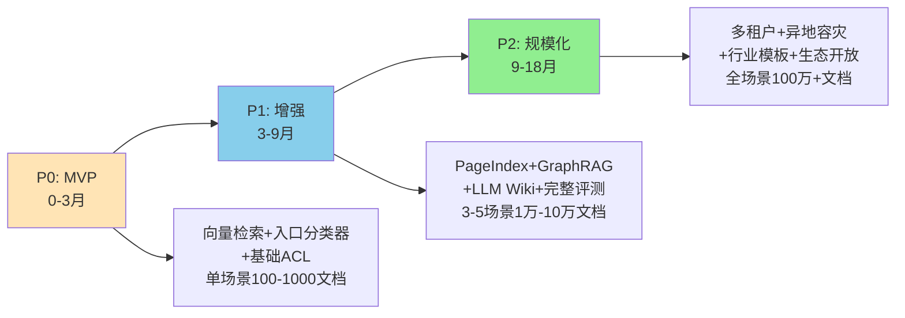
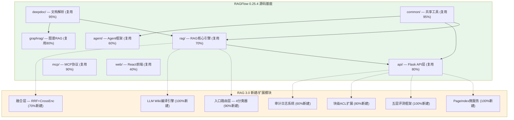

# BRD-业务需求文档：企业级RAG 3.0知识库系统

> **文档编号**：BRD-RAG3.0-20260605
> **版本**：v1.0
> **编制日期**：2026年6月5日
> **编制部门**：AI平台事业部
> **保密等级**：内部

---

## 目录

1. [文档概述](#1-文档概述)
2. [市场背景与行业趋势](#2-市场背景与行业趋势)
3. [业务痛点分析——"六个不等于"](#3-业务痛点分析六个不等于)
4. [目标用户画像](#4-目标用户画像)
5. [商业价值与ROI分析](#5-商业价值与roi分析)
6. [竞品分析](#6-竞品分析)
7. [产品边界](#7-产品边界)
8. [实施路线图](#8-实施路线图)
9. [风险与应对策略](#9-风险与应对策略)

---

## 1. 文档概述

### 1.1 版本信息

| 版本号 | 编制日期   | 编制人   | 审核人   | 批准人   | 变更说明       |
|--------|------------|----------|----------|----------|----------------|
| v1.0   | 2026-06-05 | AI平台部 | 待定     | 待定     | 初稿，供评审   |

### 1.2 审批状态

本文档当前处于 **Draft（草案）** 阶段，待提交技术评审委员会与预算审批委员会进行联合审议。后续版本将根据评审意见修订，最终版需由CTO和CFO联合签批生效。

### 1.3 阅读对象

本文档面向公司决策层和技术管理层，不同角色建议按需阅读：

| 角色                        | 建议重点阅读章节                          | 决策关注点                 |
|-----------------------------|-------------------------------------------|----------------------------|
| CEO / 总经理                | 第2章（市场趋势）、第5章（ROI）、第9章（风险）  | 战略定位、投资回报、风险敞口 |
| CTO / 技术VP                | 第3章（痛点）、第6章（竞品）、第7章（边界）、第8章（路线图） | 技术可行性、架构选型、团队能力 |
| CFO / 财务总监              | 第5章（ROI）、第8章（路线图预算）            | 投入产出、现金流、摊销周期   |
| AI平台负责人 / 产品VP       | 全文                                      | 产品定位、实施路径、资源需求 |
| 业务部门总监（法务/财务/研发）| 第3章（痛点）、第4章（用户画像）             | 业务价值、场景匹配、使用门槛 |

### 1.4 术语表

| 术语              | 英文全称 / 解释                                                                                 |
|-------------------|-------------------------------------------------------------------------------------------------|
| RAG               | Retrieval-Augmented Generation，检索增强生成。一种让LLM在生成答案前先检索外部知识库的技术范式       |
| RAG 3.0           | 以"复杂分类器路由+多通道异构检索+持久化知识编译+混合融合"为核心的新一代企业级混合智能RAG架构      |
| 知识库            | Knowledge Base，结构化与非结构化知识的集合，在本文档中特指由RAG 3.0系统管理的企业全量知识资产      |
| 知识源            | Knowledge Source，知识库的数据来源，包括PDF、DOCX、邮件、网页、数据库、CRM等                     |
| 流水线            | Pipeline，RAG系统中从文档解析到答案生成的完整处理链路，RAG 3.0包含5条并行流水线                   |
| 融合层            | Fusion Layer，对多通道检索结果进行合并、去重、排序的中间层                                       |
| Agentic Router    | 基于Agent的智能路由引擎，通过分类器判断查询类型后选择最优处理流水线                               |
| PageIndex         | VectifyAI开源的推理式检索引擎，无向量、无分块，以目录树搜索代替向量相似度匹配                     |
| LLM Wiki          | Karpathy提出的知识编译范式：让LLM在文档入库时将内容编译为结构化Wiki页面                             |
| GraphRAG          | 基于知识图谱的RAG方法，通过图遍历实现关系推理                                                     |
| RRF               | Reciprocal Rank Fusion，多通道检索结果融合的标准算法                                             |
| Faithfulness      | 忠实度评测指标，衡量LLM生成的答案与检索到的上下文之间的一致性                                    |
| Chunk-Level ACL   | 块级访问控制，对每个文档块设置独立权限，确保用户只能检索到有权访问的内容                           |

### 1.5 参考文献

- 源实现方案：《企业级RAG知识库3.0实现方案——以RAGFlow为基础、结合PageIndex与LLM Wiki优化的新一代企业级混合架构》（v1.0，2026年6月）
- Gao Y. et al. (2024). "Retrieval-Augmented Generation for Large Language Models: A Survey." arXiv:2312.10997.
- Karpathy A. (2026). "LLM Wiki: A Knowledge Compilation Pattern." GitHub Gist.
- VectifyAI. (2025). "PageIndex: A New Era in Document Retrieval." GitHub Repository.
- Infiniflow. (2024-2026). "RAGFlow: Open-source RAG Engine." GitHub Repository, v0.25.1.
- Gartner. (2025). "Market Guide for AI-Augmented Knowledge Management Solutions."
- IDC. (2025). "Worldwide Enterprise Knowledge Management Software Forecast, 2025-2029."
- Lewis P. et al. (2020). "Retrieval-Augmented Generation for Knowledge-Intensive NLP Tasks." NeurIPS.

---

## 2. 市场背景与行业趋势

### 2.1 RAG技术从1.0到3.0的演进

自2020年Lewis等人首次系统化提出RAG（Retrieval-Augmented Generation）概念以来，RAG技术经历了三次显著的范式跃迁。每一次跃迁不仅是技术架构的变革，更映射了企业知识管理需求的深度演进。

**RAG 1.0时代（2020-2023）——朴素RAG阶段**。这一时期的标准范式是"文档分块+向量化+Top-K相似检索+提示词拼接"。该范式的优势在于结构简单、上手门槛低，概念验证（PoC）可在数天内完成。但其根本局限在于：固定大小分块会切断语义边界，纯向量检索无法区分"语义相似"与"语义相关"，回答缺乏可解释的引用来源。在企业内部复杂场景下，该范式极易出现"答非所问"、幻觉频发、引用错误等生产事故，难以通过企业安全审计。

**RAG 2.0时代（2023-2025）——模块化RAG阶段**。这一时期，研究人员与产业界对RAG的每个环节进行了深度优化，引入了重排序、混合检索（BM25+向量）、查询重写、HyDE（假设性文档嵌入）、Self-RAG、Corrective RAG、GraphRAG等数十种模块。同期，以RAGFlow为代表的开源引擎开始强调"深度文档理解"——通过OCR、布局识别、表格结构还原等能力，将非结构化文档的解析精度提升到接近人类阅读的水平。然而，模块化RAG依然没有解决一个根本问题：检索的匹配机制仍是基于相似度（similarity）而非相关性（relevance）。在金融报告、法律合同、医学论文等高度专业化场景中，相似度匹配会持续把"看着像"的段落传递给LLM，而真正相关、需要跨章节推理的内容往往与查询的向量表示相距甚远。

**RAG 3.0时代（2025-2028）——混合智能架构阶段**。2025年初PageIndex（VectifyAI）的开源标志着"无向量推理式检索"的诞生，2026年初Karpathy提出LLM Wiki范式触发了业界对"知识编译"的重新思考，Adaptive RAG / Agentic RAG / Hybrid Graph-Vector RAG等架构的成熟进一步推动了范式转变。业界基本达成共识：未来企业级RAG不再是"单一检索+单一生成"的线性流水线，而是"分类器路由+多通道检索+持久化知识记忆+混合融合"的复杂智能系统。这套系统在入口处通过复杂分类器区分查询类型，根据路由结果选择最优处理策略，对长期知识进行"编译式"持久化，并在融合层统一多通道证据。

### 2.2 2025-2026年的关键转折点

2025-2026年发生的多项技术突破共同推动了RAG 3.0的成熟，构成了企业入局RAG 3.0的最佳窗口期：

- **PageIndex突破向量范式**：PageIndex在FinanceBench基准测试中以98.7%的准确率刷新开源纪录，而传统向量RAG在GPT-4o实现下仅为31%。这意味着在专业文档领域，"分块+向量化"范式第一次有了可量化、可验证的显著替代方案。
- **LLM Wiki范式提出**：Karpathy在2026年4月提出"不要让LLM在查询时去理解原始文档，而是提前让LLM把文档编译成结构化的知识"。这一思想将知识管理从"检索时理解"推向了"入库时编译"的新范式。
- **长上下文LLM普及**：Claude 3.5/4、GPT-5、Gemini 2.5 Pro、DeepSeek v4等模型的200K至1M上下文窗口，使得"全量Wiki+全量文档"的同步推理成为现实。
- **Agentic RAG与Adaptive RAG成熟**：通过LLM-as-router实现按需检索与按需调用工具，将单次RAG查询的延迟与成本降低30-40%。
- **企业合规要求强化**：GDPR、HIPAA、EU AI Act、NIST AI RMF等法规对AI系统的"可追溯、可审计、可解释"提出了明确要求，推动RAG系统从"黑盒问答"走向"白盒检索"。

### 2.3 企业知识管理市场规模与增长预测

根据Gartner 2025年发布的《AI增强知识管理解决方案市场指南》，全球AI增强知识管理市场在2025年规模约为28亿美元，预计到2029年将增长至95亿美元，年复合增长率（CAGR）为35.7%。IDC 2025年预测显示，到2027年，中国企业中部署AI知识管理系统的比例将从2025年的18%上升至52%。驱动因素包括：

1. **企业数字化程度持续提升**：据工信部数据，中国规模以上企业数字化转型比例已超60%，但知识利用率不足30%，存在巨大的效率损失。
2. **非结构化数据爆发**：IDC预测到2027年全球80%的企业数据为非结构化数据，传统关键字搜索与文档管理系统已严重不足。
3. **大模型商业化落地需求**：企业在LLM上的投入激增，但单一LLM存在幻觉、知识截止、缺乏企业上下文等根本缺陷，RAG成为填补这一缺口的关键基础设施。
4. **合规压力推动**：GDPR罚款案例年增长超40%，EU AI Act 2026年正式执行，企业面临越来越严格的AI可解释性要求。

### 2.4 行业现状

当前企业知识管理的核心矛盾是"数据丰富、知识贫乏"：一方面，企业每天产生海量文档、邮件、会议纪要、技术报告；另一方面，知识工作者平均每周花费7-10小时在查找和验证信息上，且信息利用率不足30%。传统的全文搜索引擎（如Elasticsearch）和企业内容管理平台（如SharePoint）解决了"文件在哪"的问题，但无法解决"答案是什么"的问题。大语言模型的出现虽然带来了变革性能力，但单一LLM无法天然具备企业上下文，而第一代RAG产品（如Nvidia Chat with RTX、简版私人ChatGPT）在专业文档上的准确率仅为30-40%，远未达到企业生产级水准。

---

## 3. 业务痛点分析——"六个不等于"

通过对金融、法律、医疗、制造、政企等多个行业的RAG落地项目进行深入调研，我们识别出企业级RAG普遍存在的"六个不等于"问题。每个问题背后都对应着一套根因机制、一组真实案例和一系列可量化的业务损失。

### 3.1 相似度≠相关性：向量检索的误召回问题

**定义**：向量检索所返回的候选片段，其语义嵌入空间中的余弦相似度虽高，但在人类专家的业务语境中与用户查询的实际需求并不相关。

**根因分析**：向量嵌入模型将文本映射到高维语义空间时，仅保留了浅层语义相似性。当查询涉及精确的专业术语、数值条件、跨段落逻辑关系时，"向量相似"的定义与"业务相关"的定义出现了本质分歧。例如，查询"AMD 2022财年流动比率"可能召回"流动资产的定义""财务比率计算方法综述"等高相似度段落，而真正的答案隐藏在"管理层讨论与分析"章节的一张复杂表格中——该表格的嵌入向量因包含大量数字而与传统文本段落相距甚远。

**真实业务案例**：某头部券商AI团队投入6个月时间优化向量RAG的研报检索系统，在内部评测集上Recall@20达到92%。然而生产环境上线后，分析师投诉称"查出来的东西全是对的但全都没用"——系统返回的都是百科全书式的定义和泛化概述，而非分析师所需的具体财务数据、行业对比和趋势判断。归根结底，分析师寻找的是"信息之间的关系"，而系统只找到了"相似的段落"。

**量化影响**：据该券商内部统计，分析师平均每次查询需花费8-12分钟人工筛选AI返回的结果，搜索-验证-再搜索的循环次数平均为3.2次，导致单次有效知识获取的端到端时间超过25分钟。年化人力浪费约1,600人·小时（以50人团队计）。

### 3.2 分块语义≠原始语义：结构信息丢失

**定义**：将一篇结构化的文档按固定长度（如512 token）切分为独立片段后，片段的语义之和不再等于原始文档的完整语义，跨片段的结构化逻辑关系被不可逆地破坏。

**根因分析**：企业文档本质上是"有结构的"——合同遵循"鉴于条款→定义→主条款→违约责任→救济方式→争议解决"的逻辑链条，财报遵循"管理层讨论→资产负债表→利润表→现金流量表→附注"的递进结构。当分块算法机械地把这些文档切成512 token的碎片时，跨段落的逻辑链被打散，LLM接收到的是一堆无序的文本碎片，而非一个有逻辑的知识体系。此外，表格结构在分块过程中被展平为纯文本，丧失了二维数值关系，这对金融和政务场景尤为致命。

**真实业务案例**：某律所试点部署RAG系统审查商业合同，系统运行两周后被法务团队叫停。核心问题是：系统在检索到"违约方"相关条款时，经常遗漏与该条款存在逻辑依赖的前置条款与救济条款，导致LLM给出的分析建议在法律逻辑上不完整甚至误导。

**量化影响**：该律所事后分析显示，由于结构信息丢失导致的回答不完整率为23%，误导率约8%。合同审查系统的可信度在法务团队中从初始的"愿意尝试"降至"高度怀疑"。

### 3.3 检索正确≠回答正确：LLM幻觉与不可控

**定义**：即使检索模块成功召回了包含正确答案的文档片段，LLM在生成阶段仍可能因摘要偏差、上下文混淆、幻觉倾向等问题而产生错误回答。

**根因分析**：LLM的生成过程本质上是概率性的文本续写，而非逻辑推理。当检索到的上下文中同时包含正确和误导信息时，LLM难以准确区分；当上下文足够长时，LLM的"注意力衰减"导致中间位置的片段被忽视；当用户问题包含隐含假设时，LLM可能接受并强化错误前提。此外，LLM天然倾向于给出"完整、自信"的回答，即使在信息不足时也会填补细节，这是幻觉的主要来源。

**真实业务案例**：某制造企业在设备维修RAG系统中发现，当用户询问"某型号电机更换频率"时，系统正确检索到了3个相关维修记录，但生成回答时将3个不同电机型号的数据混淆，给出了一个"平均频率"——该数值在任何文档中都不存在，属于纯幻觉。

**量化影响**：在内测期间的200次查询中，检索准确但回答错误的占比约12%，其中约5%的回答包含事实性错误（如混淆数字、张冠李戴），7%的回答包含遗漏或过度概括。

### 3.4 单点优化≠系统优化：局部最优陷阱

**定义**：企业在优化RAG系统时，往往针对一个环节投入大量资源（如换更贵的Embedding模型、扩大Top-K值），而忽视了端到端系统的整体表现和总拥有成本（TCO），导致投入产出比严重失衡。

**根因分析**：RAG是一个多环节耦合的复杂系统，各环节优化效果并非线性叠加。例如，将Embedding模型从bge-m3替换为text-embedding-3-large，单块检索精度可能提升3%，但如果Chunk大小不合适或重排序缺失，端到端准确率可能仅提升0.5%。更常见的情况是，某个环节的过度优化（如Top-K从10提升到100）导致延迟和Token成本翻倍，但回答质量几乎没有提升——因为LLM的上下文窗口内信息越多，注意力越分散。

**真实业务案例**：某金融科技公司投入200万预算构建RAG系统，采购了最贵的Cohere Embed v3和GPT-4o，但跳过了重排序和查询重写模块。结果是单次查询成本高达$0.85，但Faithfulness仅0.72，远低于同规模企业用开源模型+重排序方案达到的0.88。

**量化影响**：盲目追求单点最优的"豪华配置"可使TCO膨胀3-5倍，但系统整体表现仅提升10-15%。相比之下，合理组合中等性能组件可达到80-90%的最优效果，成本仅为"豪华配置"的20-30%。

### 3.5 离线基准≠在线表现：评测与现实脱节

**定义**：在RAGAS、FinanceBench、HotpotQA等公开基准测试上的评测分数，与企业生产环境中的真实表现之间存在系统性偏差。

**根因分析**：首先，公开基准的数据分布与企业的真实文档和真实查询存在显著差异——企业的查询往往是高度领域化、口语化、带有行业黑话和隐含上下文的。其次，离线评测通常假设文档已完美解析、用户意图已被正确理解，而在线环境中文档解析失败、查询模糊、权限过滤等问题无处不在。第三，用户满意度不仅取决于回答正确性，还取决于响应速度、解释清晰度、引用可信度等"软指标"，这些在离线评测中难以衡量。

**真实业务案例**：某医疗AI创业公司在RAGAS评测中取得Faithfulness 0.91的高分，自信满满地将系统部署到合作三甲医院。上线后医生反馈"系统给出的答案技术上可能正确，但临床实践中可能误导——因为它引用的指南版本已过期，但没有标注年份"。离线评测未能检测到"知识时效性"这个关键维度。

**量化影响**：行业普遍观察到离线评测分数与在线用户满意度之间存在15-25%的"部署落差"，该落差在医疗、法律等高风险领域可达到30%以上。

### 3.6 通用RAG≠合规RAG：权限与审计缺失

**定义**：通用RAG系统默认所有用户对全部文档拥有读取权限，而企业级场景必须支持细粒度访问控制、多租户数据隔离、全链路审计追溯，否则将面临严重的法务与合规风险。

**根因分析**：通用RAG的设计假设是"知识共享最大化"，而企业RAG的设计约束是"权限最小化"。一个律师不能看到未授权客户的合同，一名工程师不能查阅高管会议的纪要，实习生不能访问薪酬数据。如果权限过滤只在生成阶段做"后过滤"，那么检索阶段就存在信息泄露风险（例如被检索到的受限制内容可能在系统缓存、日志、监控面板中间接暴露）。此外，GDPR要求"被遗忘权"——用户删除某份文档后，该文档的嵌入向量、摘要、图谱节点等所有衍生数据也必须在合理时间内清除，这对RAG系统的索引管理提出了极高要求。

**真实业务案例**：某跨国企业在PoC阶段将公司全部文档导入一个开源的通用RAG系统，两周后被安全团队紧急叫停。安全审计发现：1）被标记为"机密"的董事会纪要在向量检索中可被任意员工检索到（虽然LLM生成时被过滤，但检索结果本身可通过系统API间接获取）；2）系统缺乏审计日志，无法追溯谁查询了什么内容；3）一名离职员工的文档仍可被检索，未实现数据清除。

**量化影响**：GDPR违规罚款最高可达全球年营收的4%或2000万欧元（取高者），EU AI Act违规罚款最高可达3500万欧元或全球年营收的7%。企业合规不是"锦上添花"而是"生死线"。

---

## 4. 目标用户画像

### 4.1 CTO / 技术VP——"张明"，某中大型制造企业CTO

**角色与职责**：负责公司整体技术战略，管理100+人技术团队，向CEO汇报。正在推动公司从"信息化"向"AI化"转型，需要向董事会证明AI投入的商业回报。

**核心痛点**：1）企业几十年的技术文档、设备手册、工艺文件散落在各个系统，老师傅退休导致知识流失；2）部门各自建设知识库，形成信息孤岛；3）采购的商业知识管理系统年费昂贵但效果不佳；4）无法量化评估AI项目ROI。

**核心需求**：1）一套能整合全量异构文档的统一知识平台；2）精确到具体段落的引用溯源，让一线工程师可"点击验证"；3）满足等保三级的安全合规能力；4）明确的实施路径和成本模型，能向董事会清晰汇报。

**使用场景**：审批AI平台采购方案的季度技术评审会上，对比多个方案的技术优劣、TCO和风险。

**技术能力**：有较深技术背景，能理解RAG架构原理但不过度关注底层实现细节。

### 4.2 AI平台负责人——"李婷"，某金融科技公司AI团队Lead

**角色与职责**：领导15人AI团队，负责公司AI基础设施建设，直接向CTO汇报。需要选型、部署并持续运营RAG系统。

**核心痛点**：1）试用过多个开源RAG方案，在金融文档上的准确率均不理想；2）团队人少，无法从头自研一整套RAG系统；3）金融合规审计要求每个回答必须有可追溯的来源；4）模型成本持续攀升，需要精细化控制。

**核心需求**：1）开源可定制的RAG引擎，支持私有化部署；2）对财务报表、研报、合同等复杂文档的高精度解析（表格还原、跨页定位）；3）路由策略降低大模型调用成本；4）完整的评测框架，可量化系统表现。

**使用场景**：每周主持团队Sprint回顾，根据评测报告和用户反馈调整RAG系统配置和模型选型。

**技术能力**：精通ML/NLP，能编写Python代码定制解析器和分块策略。

### 4.3 知识管理产品经理——"王芳"，某集团知识管理部高级产品经理

**角色与职责**：负责集团知识管理平台的产品规划和运营，协调业务部门需求和IT部门实现。目标是提升集团知识利用率。

**核心痛点**：1）现有知识库基于传统全文搜索，员工抱怨"搜不到""搜不准"；2）各部门文档格式不一、质量参差，AI系统难以统一处理；3）不知道AI究竟能解决什么问题、不能解决什么问题；4）缺乏用户数据来支持产品迭代决策。

**核心需求**：1）清晰的AI能力边界说明，好向业务部门沟通"什么能做、什么不能做"；2）用户友好的文档上传与管理界面；3）可视化的系统表现仪表盘（查询量、满意度、高频问题）；4）全流程的用户反馈机制。

**使用场景**：每季度向管理层汇报知识库使用报告，每月组织业务部门需求收集会。

**技术能力**：了解AI概念但无编码能力，需要标准化产品而非定制开发。

### 4.4 算法工程师 / ML Engineer——"陈工"，核心实现者

**角色与职责**：负责RAG系统的核心组件开发与优化——解析器调整、分块策略、检索参数调优、评测脚本编写。

**核心痛点**：1）开源RAG代码结构复杂，集成PageIndex、GraphRAG等新组建时缺乏文档；2）评测体系不完善，无法隔离定位"检索问题"还是"生成问题"；3）PO需求频繁变动，架构灵活性不足。

**核心需求**：1）模块化、可插拔的架构设计，方便替换组件；2）详尽的API文档和代码示例；3）标准化的评测框架（RAGAS/DeepEval集成）；4）支持Docker Compose一键部署的开发环境。

**使用场景**：每日编码、评测、调试，参与技术方案讨论和技术债清理。

**技术能力**：精通Python/NLP/深度学习，熟悉Docker/Kubernetes。

### 4.5 业务部门知识工作者——"法务张律师""财务刘会计""研发赵工"

| 维度     | 法务张律师                                    | 财务刘会计                                      | 研发赵工                                     |
|----------|-----------------------------------------------|------------------------------------------------|---------------------------------------------|
| 角色     | 集团法务部高级律师                            | 财务部成本会计主管                              | 研发中心嵌入式工程师                         |
| 痛点     | 合同条款检索耗时长，跨部门合同对比困难          | 历史财报查询繁琐，手工汇总数据分析易错            | 设备手册版本混乱，故障排查需翻阅多个PDF        |
| 核心需求 | 精确引用法条和合同条款，可追溯来源              | 准确提取财务数据，自动生成对比报表               | 按设备型号/故障现象快速定位维修方案            |
| 使用场景 | 每日审查合同时使用，每周撰写法律意见书时查询     | 每月结账时查询历史数据，季度审计时导出引用记录    | 生产设备故障时现场查询维修手册                 |
| 技术能力 | 非技术用户，需要自然语言交互                    | 非技术用户，需要表格数据导出                      | 有一定技术基础，可接受命令行查询               |

---

## 5. 商业价值与ROI分析

### 5.1 量化价值主张

RAG 3.0知识库系统从三个维度创造可量化的商业价值：

**维度一：检索效率的指数级提升**。传统模式下，知识工作者获取准确信息的端到端时间包括"确定搜索关键词→多系统检索→人工阅读筛选→交叉验证"等环节，平均耗时15-30分钟/查询。RAG 3.0通过多通道检索与智能路由，将这一过程压缩到10-30秒，实现**效率提升30-90倍**。系统同时提供带页码、带段落的精确引用，使人工验证时间从"通读全文"缩短为"点击确认"，验证效率提升100倍以上。

**维度二：知识利用率的质变**。企业知识利用率从目前的<30%可提升至70-90%。未被利用的大量知识资产——包括离职员工的隐性知识、积压的历史文档、分散存储的专业报告——首次获得了被系统化检索和利用的通道。以一个150人的中型企业为例，如果每位知识工作者每年因知识查找浪费约400小时（每周约8小时），RAG 3.0系统可回拨至少200小时/年/人的有效工作时间，相当于为组织"新增"约15%的知识生产力。

**维度三：人力成本的结构性节约**。一方面是直接效率提升节省的劳动成本；另一方面是降低对"资深专家"的依赖——初级员工通过RAG 3.0可获取原本需要资深专家才能回答的领域知识，有效缓解了"关键人才依赖"和"知识传承断档"风险。

### 5.2 投入产出模型

以150人企业的典型部署为例：

**基础设施成本（年化）**：

| 成本项                     | 配置说明                                         | 年度成本（万元） |
|----------------------------|--------------------------------------------------|------------------|
| 计算资源（GPU服务器×2）     | NVIDIA A100 80GB × 2，私有化部署                   | 25-35            |
| LLM API调用                | 中等复杂度路由策略，70%走本地模型30%走商业API       | 8-15             |
| 存储与网络                 | 对象存储+向量数据库+关系数据库                      | 5-8              |
| 运维与监控                 | 基础运维人力+云监控服务                             | 5-8              |
| **年度基础设施合计**       |                                                  | **43-66**        |

**人力投入**：

| 阶段     | 人员配置                       | 周期    | 人力成本（万元） |
|----------|--------------------------------|---------|------------------|
| PoC      | 2名工程师+1名PM                | 2个月   | 10-15            |
| Pilot    | 4名工程师+2名PM+1名领域专家     | 3个月   | 30-45            |
| 生产运维 | 3名工程师+1名PM（持续）         | 年化     | 40-60            |
| **首年人力合计** |                          |         | **80-120**       |

**首年总投入**：约123-186万元。

**实施周期**：
- PoC阶段（0-3个月）：验证核心场景可行性
- Pilot阶段（3-9个月）：扩展到3-5个场景，覆盖试点用户
- Production阶段（9-18个月）：全公司推广，持续迭代

### 5.3 典型ROI场景（150人企业，3年TCO）

假设该企业150名知识工作者，平均年薪30万元，每人每年因知识查找浪费400小时。

| 指标               | 第1年       | 第2年       | 第3年       | 3年累计       |
|--------------------|-------------|-------------|-------------|---------------|
| 项目投入（万元）    | 150         | 60          | 60          | 270           |
| 效率提升节省（万元）| 180         | 270         | 315         | 765           |
| 其中：工时回拨占比  | 30%         | 45%         | 55%         | —             |
| **净收益（万元）** | **+30**     | **+210**    | **+255**    | **+495**      |
| **ROI**           | **20%**     | **350%**    | **425%**    | **183%**      |

> 说明：第1年因系统部署和用户适应，效率回拨比例保守估计为30%；第2-3年随数据积累、Wiki知识编译生效、路由策略优化，效率提升逐步放大。

### 5.4 风险缓释价值

除了直接的效率提升收益，RAG 3.0还创造了以下几类难以精确量化但极为重要的风险缓释价值：

- **合规罚款规避**：GDPR/EU AI Act单次罚款可达数千万欧元。RAG 3.0内置的权限控制与审计日志，将合规风险从"被动响应"转为"主动防护"。
- **知识流失防止**：核心员工离职导致的知识断层，隐性成本通常为离职员工年薪的1.5-2.5倍。RAG 3.0通过LLM Wiki编译与知识图谱将隐性知识显性化，降低"关键人物风险"。
- **错误决策代价避免**：在金融、法律、医疗等场景中，因信息不完整导致的错误决策可能造成巨额损失。RAG 3.0的全量检索与可验证引用机制，显著降低了"信息盲区"导致的决策风险。

---

## 6. 竞品分析

### 6.1 竞品总览

当前企业级RAG/智能知识库市场的主要参与者包括：开源RAG引擎（RAGFlow）、企业级AI搜索（Glean）、商业RAG平台（Cohere）、知识图谱增强RAG（微软GraphRAG）、自建方案（LlamaIndex+Milvus）以及纯自研方案。下表从12个关键维度进行对比分析。

### 6.2 12维度对比矩阵

| 维度             | RAGFlow                    | Glean                       | Cohere                          | GraphRAG（微软）        | LlamaIndex+Milvus          | 自研方案               |
|------------------|----------------------------|-----------------------------|----------------------------------|--------------------------|---------------------------|------------------------|
| **文档理解深度**  | 极深（DeepDoc: OCR+布局+TSR，16+格式） | 中（主要依赖SaaS集成源）     | 中（文本为主，弱格式感知）       | 中（需前置解析）          | 中（依赖用户自定义解析器） | 取决于投入，通常较弱    |
| **检索准确率**    | 中-高（向量+BM25混合）       | 高（搜索语义理解强）          | 高（Rerank模型 SOTA）            | 高（图推理+社区摘要）     | 中-高（取决于配置）        | 中（初期较低，需持续优化） |
| **多语言支持**    | 强（中英日韩15+语言）        | 强（英语优势，多语言商业支持） | 强（100+语言 Embed v3）          | 中（主要英语）            | 中（依赖嵌入模型选择）     | 取决于选型              |
| **权限管理**      | 强（RBAC+团队协作）          | 强（企业级SSO+数据源级ACL）   | 弱（API Key级别）                | 弱（无原生权限）          | 弱（需自建）               | 可定制，成本高          |
| **块级ACL**       | 中（需扩展）                 | 强（数据源级权限继承）         | 不支持                          | 不支持                    | 不支持                     | 可定制，成本高          |
| **部署模式**      | 私有化（Docker Compose/K8s） | SaaS Only                    | SaaS+私有化（Enterprise Plan）   | 开源本地                  | 开源本地                   | 本地                    |
| **开源/商业**     | 开源（Apache 2.0）           | 闭源商业（按席位计费）         | 开源组件+商业API                 | 开源（MIT）               | 开源（MIT）                | 自研                    |
| **TCO（年/150用户）** | ¥50-80万                    | $20-30万（按席位+搜索量）     | $15-25万（API消耗大）            | ¥30-50万（工程化成本高）  | ¥40-70万（自建运维成本）   | ¥100-200万（人力密集）  |
| **生态集成**      | 丰富（MCP/LangChain/16+源）  | 极丰富（200+ SaaS连接器）     | 中（API集成为主）                | 弱（学术导向）            | 丰富（LangChain生态）      | 取决于投入              |
| **可解释性**      | 中（引用+分段定位）          | 中（来源链接）                | 低（API黑盒）                    | 高（图路径+社区引用）     | 中（依赖评估框架）         | 可定制，成本高          |
| **知识编译持久化** | 弱（无内置Wiki）             | 无                           | 无                              | 无                        | 无                         | 可定制                  |
| **评测体系**      | 弱（无内置）                 | 中（后台分析）                | 弱（需第三方集成）               | 弱                        | 强（RAGAS/DeepEval集成）   | 取决于投入              |

### 6.3 竞品关键洞察

**Glean** 在企业级SaaS连接的广度和易用性上遥遥领先，但其SaaS-only部署模式和数据源级（而非文档块级）权限粒度，使其无法满足需要私有化部署和细粒度权限控制的行业（金融、政企、医疗）。

**Cohere** 在重排序和嵌入模型上处于技术领先地位，但其RAG方案更接近"API+SDK"而非"平台"，缺乏文档理解深度和权限管理能力，适合技术团队快速集成但不适合作为企业级知识库平台。

**微软GraphRAG** 在知识图谱推理和社区摘要方面开创了新范式，但工程化程度较低、无原生权限、部署运维成本高，目前更适合高端研究和探索性场景而非规模化生产。

**LlamaIndex+Milvus** 自建方案灵活度最高，但需要大量工程化投入，且缺乏深度文档理解能力，手动集成PageIndex、GraphRAG等新组件的工作量巨大。

### 6.4 本方案的核心竞争力

RAG 3.0方案的核心竞争力不在于单一维度超越所有竞品，而在于**系统性整合**——将RAGFlow的深度文档理解、PageIndex的推理式检索、LLM Wiki的知识编译、复杂分类器的智能路由融合为一个完整的企业级解决方案，并在安全合规、可解释性、评测体系等维度进行补强。这一"基座技术+路由中枢+持久化记忆+安全底座"的架构是目前市场上前所未有的。

---

## 7. 产品边界

### 7.1 核心能力范围（做什么）

RAG 3.0知识库系统聚焦以下5个核心能力域，每个域均有明确的功能边界和质量标准：

**1. 文档解析与知识入库**
- 支持16+种企业常见文档格式（PDF、DOCX、PPTX、XLSX、CSV、图片、Email、HTML、Markdown等）。
- 对扫描件PDF提供OCR+布局识别+表格结构还原的完整解析能力。
- 根据文档类型自动选择最优分块策略（模板分块、层次分块、语义分块）。
- 在入库时构建多维索引：向量索引、全文索引、知识图谱、PageIndex树索引、LLM Wiki编译页。
- 支持增量入库与文档更新，支持删除及"遗忘权"合规要求。

**2. 智能检索**
- 支持自然语言查询，自动识别查询复杂度（Tier 1-4）和用户意图。
- 多通道检索调度：向量检索（通用）、推理式树搜索（专业文档）、知识图谱遍历（关系推理）、全文检索（精确匹配）、LLM Wiki直接读取（已编译知识）。
- 多通道结果通过RRF+Cross-Encoder融合精排。
- 块级ACL在检索阶段强制过滤，杜绝后过滤的信息泄露风险。

**3. 准确回答生成**
- 基于精排后的Top-N片段生成带引用的自然语言回答。
- 每个回答必须附带引用清单，包含文档名称、章节、页码、置信度。
- 支持多种回答模式：精确事实型、综合分析型、多跳推理型、对比分析型。
- Faithfulness（忠实度）目标≥0.90，Hallucination Rate（幻觉率）<5%。

**4. 知识编译与持久化**
- 对长期稳定、跨查询复用的知识进行LLM Wiki编译，生成结构化Markdown页面。
- Wiki采用Git版本管理，支持历史版本查看、diff对比、分支实验、一键回滚。
- 人类专家可介入Wiki维护、修正、合并，保持"人在环中"。
- 编译后的Wiki优先被路由引擎命中，大幅降低重复检索和Token消耗。

**5. 安全合规与可观测性**
- 支持RBAC（基于角色的访问控制）和块级ACL。
- 支持多租户数据隔离。
- 全链路审计日志：谁、何时、查询了什么、返回了什么、引用了哪些文档。
- PII/PHI自动检测与脱敏。
- 完整的评测框架：文档级→块级→检索级→生成级→端到端级五层评估。
- 可视化监控仪表盘：查询量、延迟分布、满意度、高频问题、异常告警。

### 7.2 明确排除范围（不做什么）

以下能力不在RAG 3.0知识库系统的范围内，保持产品边界清晰：

| 排除项               | 排除理由                                                                 | 替代方案/说明                                     |
|----------------------|--------------------------------------------------------------------------|--------------------------------------------------|
| **LLM训练/微调服务**  | LLM训练属于MaaS（模型即服务）范畴，非知识库产品边界                      | 可对接企业已有的模型平台或云服务                    |
| **通用互联网搜索引擎** | 聚焦企业内部知识检索，不替代Google/Bing等外部搜索                        | 通过MCP协议可选择性接入外部搜索，但不作为核心功能   |
| **代码生成/低代码平台** | 代码生成是独立产品品类（如GitHub Copilot）                                | 可参考RAG 3.0方法论建设独立的"代码知识库"           |
| **实时协作编辑**       | 实时编辑是Notion/飞书/G-Docs的功能领域                                    | 知识库提供的是"只读"检索与生成，不提供编辑能力      |
| **业务工作流引擎**     | 审批流、工单系统等属于BPM产品范畴                                          | 可通过API将检索结果导入下游BPM系统                  |
| **对话式情感陪伴**     | 非严肃知识管理场景                                                       | 闲聊类查询被分类器识别后直接由LLM回答，不调用检索   |
| **企业IM替代方案**     | 知识库是"被查询"的工具，不替代飞书/钉钉/微信的通讯功能                     | 可作为Bot嵌入企业IM，但不替代IM本身                 |

### 7.3 与现有企业系统的关系

RAG 3.0知识库不是要替代现有的企业系统，而是作为"知识检索层"与现有系统形成互补：

| 现有系统      | 与RAG 3.0的关系                                                              | 集成方式                   |
|---------------|------------------------------------------------------------------------------|----------------------------|
| **ERP/SAP**   | RAG 3.0不从ERP读取实时事务数据，但可将历史报表、操作手册等文档作为知识源入库   | 文档导出→RAG入库           |
| **CRM**       | RAG 3.0不替代CRM的客户管理功能，但可将客户沟通记录、合同文本作为知识源          | API拉取/MCP同步            |
| **OA系统**    | RAG 3.0不替代OA审批流程，但可将审批产生的公文、制度作为知识源自动入库          | Webhook→自动入库           |
| **DMS/ECM**   | 文档管理系统是RAG 3.0的主要数据上游，RAG 3.0为DMS赋予"智能检索"能力             | 文件系统挂载/S3同步/API    |
| **BI系统**    | RAG 3.0不替代BI的可视化分析，但可将BI导出的分析报告作为知识源，并提供自然语言查询 | 报表导出→RAG入库           |
| **邮件系统**  | 邮件归档中的关键信息（决策、合同、技术讨论）可被RAG索引和检索                   | EML/MSG解析→RAG入库        |

---

## 8. 实施路线图

### 8.1 三阶段总体规划

### 8.2 P0阶段：MVP（0-3个月）

**目标**：以最小资源投入验证RAG 3.0核心价值，跑通端到端流水线。

| 维度       | 详细内容                                                                                     |
|------------|----------------------------------------------------------------------------------------------|
| **里程碑** | 在选定的1个标杆场景上线MVP，Faithfulness≥0.85，获得种子用户正面反馈                           |
| **交付物** | ① RAGFlow v0.25.1私有化部署（Docker Compose）；② 多格式文档解析流水线（PDF/DOCX/XLSX）；③ 向量检索（BM25+稠密向量+重排序）；④ 入口分类器V1（规则+LLM，Tier 1/2/3/4四分类）；⑤ 基础RBAC权限；⑥ 简单Web UI |
| **团队配置** | 2名算法/后端工程师 + 1名PM + 1名业务领域专家（共4人）                                           |
| **预算**     | 约25-35万（人力15-20万 + 基础设施10-15万）                                                     |
| **验收标准** | ① 文档解析准确率≥95%（人工抽样100份，表格还原完整度≥90%）；② 检索Recall@10≥80%；③ 端到端查询平均响应<5秒；④ 10名种子用户满意度评分≥3.8/5 |

### 8.3 P1阶段：增强（3-9个月）

**目标**：引入PageIndex推理式检索和LLM Wiki知识编译，显著提升复杂文档的检索质量，建立完整评测体系。

| 维度       | 详细内容                                                                                     |
|------------|----------------------------------------------------------------------------------------------|
| **里程碑** | 复杂文档（合同、财报）场景的端到端回答准确率达行业领先水平（FinanceBench级别≥90%），知识编译管线投入生产 |
| **交付物** | ① PageIndex集成（树索引生成+推理式树搜索）；② LLM Wiki知识编译管线（实体页+概念页+综合分析页+Git版本管理）；③ GraphRAG知识图谱检索通道；④ 路由引擎V2（分类器集成：规则→XGBoost→BERT→LLM，延迟≤200ms）；⑤ 五层评测框架（文档/块/检索/生成/端到端）集成RAGAS+DeepEval；⑥ 块级ACL实现；⑦ 审计日志系统 |
| **团队配置** | 4名算法/后端工程师 + 2名PM + 2名业务领域专家 + 1名QA（共9人）                                   |
| **预算**     | 约80-120万（人力55-75万 + 基础设施25-45万）                                                    |
| **验收标准** | ① Faithfulness≥0.90，Hallucination Rate<5%；② PageIndex检索准确率≥90%（在财务报表/合同数据集上）；③ LLM Wiki 编译质量人工评估通过率≥85%；④ P95延迟<8秒（复杂多跳查询可放宽至15秒）；⑤ 系统可用率≥99.5%；⑥ 100名Pilot用户满意度≥4.0/5 |

### 8.4 P2阶段：规模化（9-18个月）

**目标**：完成从Pilot到Production的规模化跨越，支持全公司推广，系统达到企业生产级标准。

| 维度       | 详细内容                                                                                     |
|------------|----------------------------------------------------------------------------------------------|
| **里程碑** | 全公司推广上线，服务500+用户，文档总量50万+，系统可用率≥99.9%，通过等保三级认证               |
| **交付物** | ① Kubernetes集群部署+Helm Chart；② 多租户架构+租户级ACL配置界面；③ 异地容灾（RTO 1h, RPO 15min）；④ 行业模板库（金融/法律/医疗/制造/政企，各含预设解析器+分块策略+检索模板）；⑤ 开放API+MCP接口，支持下游系统集成；⑥ 可视化运营仪表盘；⑦ 混沌工程验证报告；⑧ 运维手册+应急预案 |
| **团队配置** | 3名算法/后端工程师（运维）+1名PM（运营）+领域专家按需（共5-6人持续）                            |
| **预算**     | 约60-80万/年（运营维护，不含新功能开发）                                                       |
| **验收标准** | ① 系统全年可用率≥99.9%；② 单次查询平均成本控制在¥0.05内；③ 等保三级认证通过；④ 容灾演练成功（RTO<1h, RPO<15min）；⑤ 用户满意度≥4.2/5；⑥ 知识利用率提升≥50%（对比系统上线前基线） |

### 8.5 团队能力要求与风险

实施RAG 3.0需要复合型团队，既要懂AI/ML，也要懂工程和领域知识。关键风险在于：1）P0阶段团队如果能力不足，可能在文档解析环节就卡住；2）P1阶段的PageIndex和GraphRAG集成对算法能力要求高；3）P2阶段对SRE/运维经验要求显著提升。建议在P0阶段即引入有RAGFlow或PageIndex实际经验的工程师，并在P1阶段招聘或外聘领域专家。

---

## 9. 风险与应对策略

### 9.1 技术风险

| 风险项               | 风险等级 | 影响描述                         | 发生概率 | 应对策略                                                                                                                              |
|----------------------|----------|----------------------------------|----------|---------------------------------------------------------------------------------------------------------------------------------------|
| **LLM幻觉导致错误回答** | 高       | 在法务/财务/医疗场景中，错误回答可能导致严重后果 | 中       | ① 五层评测框架持续监控Faithfulness；② 高风险场景强制人工二次确认；③ 使用Reranker+LLM-Reranker双重校验；④ 置信度低于阈值时拒绝回答并提示用户 |
| **复杂文档解析失败**   | 中-高    | 扫描件PDF表格还原错误，导致数据污染   | 中       | ① DeepDoc+MinerU多解析器并行；② 解析失败自动回退到纯OCR模式；③ 入库前人工抽样验证；④ 支持手动修正解析结果并反馈改进模型           |
| **性能瓶颈（高并发时）**| 中       | 1000+QPS时检索延迟超10秒            | 低-中     | ① 缓存层（Redis+查询缓存+Wiki缓存）；② 水平扩缩（K8s HPA）；③ 分级路由——简单问题走缓存/本地小模型，复杂问题走商业大模型               |
| **模型成本不可控**     | 中       | LLM API成本随使用量线性增长，超预算   | 中       | ① 路由策略优先走本地模型（70%流量）；② Wiki编译将重复查询转化为一次性成本；③ 查询缓存命中率目标≥30%；④ 短期CRAG（Corrective RAG）降本 |
| **PageIndex索引构建慢**| 低-中    | 百万页文档的树索引生成耗时长          | 中       | ① 异步批量构建；② 优先级调度（高频文档优先）；③ 增量构建而非全量重建                                                                  |

### 9.2 市场风险

| 风险项               | 风险等级 | 影响描述                         | 发生概率 | 应对策略                                                                                                                              |
|----------------------|----------|----------------------------------|----------|---------------------------------------------------------------------------------------------------------------------------------------|
| **竞品快速演进**      | 中       | Glean/Cohere等商业产品快速补齐文档理解短板，挤压差异化空间 | 中       | ① 坚持开源+可插拔架构，保持技术灵活性；②PageIndex+LLM Wiki差异化能力短期难以复制；③ 深耕行业模板与领域知识，构建壁垒           |
| **用户接受度低**      | 中       | 业务部门习惯了现有工作流，不愿学习新工具   | 中-高     | ① "低摩擦嵌入"——优先集成企业IM（飞书/钉钉），用户无需离开习惯工具；② 种子用户"病毒式"推广；③ 每周产出"AI辅助工作成果"Case Study宣传 |
| **政策变化影响**      | 低-中    | AI监管政策突然收紧，影响产品合规性      | 低       | ① 架构预留"合规开关"（权限、审计、脱敏均模块化可配置）；② 持续跟踪EU AI Act、国内AI法规进展；③ 聘请外部合规顾问定期审计              |

### 9.3 合规风险

| 风险项               | 风险等级 | 影响描述                         | 发生概率 | 应对策略                                                                                                                              |
|----------------------|----------|----------------------------------|----------|---------------------------------------------------------------------------------------------------------------------------------------|
| **数据隐私泄露**      | 高       | 权限绕过、缓存泄露、日志暴露敏感信息     | 低       | ① 块级ACL在检索层前置过滤（非后过滤）；② 所有日志PII脱敏后再存储；③ 定期渗透测试+安全审计；④ 数据隔离策略文档化                    |
| **行业监管不合规**    | 高       | 金融/医疗行业监管机构检查发现合规缺口    | 低       | ① 等保三级+ISO 27001+SOC2认证规划；② 完整审计日志保留3-7年；③ 法务团队参与每个阶段的合规审查；④ 支持"被遗忘权"技术实现       |
| **知识产权/版权争议**  | 中       | LLM生成的回答涉及引用第三方版权内容       | 中       | ① 明确"回答≠原文档副本"的法律定位；② 所有引用标注原始来源；③ 与法务团队商定免责条款与用户协议                                    |

### 9.4 执行风险

| 风险项               | 风险等级 | 影响描述                         | 发生概率 | 应对策略                                                                                                                              |
|----------------------|----------|----------------------------------|----------|---------------------------------------------------------------------------------------------------------------------------------------|
| **团队能力不足**      | 中-高    | 缺少PageIndex/GraphRAG实战经验，P1阶段延期 | 中-高     | ① PoC阶段即招聘或外包有经验工程师；② 预留20%的缓冲时间用于学习与技术验证；③ P0阶段积累的代码和文档作为团队学习材料                     |
| **交付延期**          | 中       | P1因集成复杂度超出预期而延期3个月以上       | 中       | ① 功能分级交付——P1.a（PageIndex+评测框架）先行，P1.b（Wiki+GraphRAG）后行；② 每2周Sprint Review重新评估时间线；③ 允许牺牲非核心功能保核心交付 |
| **预算超支**          | 中       | LLM API消耗+基础设施扩容超出预算30%以上    | 中       | ① 月度成本监控+预警（超预算80%时触发评审）；② 成本走高的紧急降级策略（禁用商业大模型，退回本地模型）；③ 预留15%的预算弹性空间      |
| **关键人员离职**      | 低-中    | 核心工程师离职导致知识断层               | 低       | ① 强制代码Review+文档化（关键模块必须2人以上掌握）；② LLM Wiki将关键决策和架构知识编译为可检索文档；③ 合理的薪酬+成长路径留住人才    |

### 9.5 风险综合评级与优先级

综合评估，**技术风险（LLM幻觉）** 和 **合规风险（数据隐私）** 是最高优先级风险，两者直接影响产品的核心价值主张和法律红线，必须在P0阶段即建立相应的缓解能力。**执行风险（团队能力、交付延期）** 是次高优先级，建议通过P0阶段的严格选型和P1阶段的交付分级来管理。**市场风险** 在短期内相对可控，核心是保持技术栈的灵活性和与用户的紧密互动。

---

## 附录: 技术底座——RAGFlow 0.25.4源码复用映射

> **设计原则**：RAG 3.0并非从零构建，而是以 RAGFlow 0.25.4（Apache 2.0 许可证）为技术基座，采用"复用-扩展-新建"三级策略进行架构升级。本章系统化标注每个RAG 3.0模块对应的RAGFlow源码文件、复用策略和需扩展的内容，使BRD中的每个技术能力都有明确的源码支撑。

### A.1 RAGFlow 0.25.4源码资产总览

RAGFlow 0.25.4是一个成熟的、生产级开源RAG引擎，源码位于 `/opt/www/github/ragflow-0.25.4/`，核心代码约30万行，按模块组织如下：

| 模块目录 | 代码规模 | 核心能力 | RAG 3.0复用价值 |
|----------|----------|----------|----------------|
| `api/` | ~3万行 | Flask REST API、DB服务层、ORM模型 | 直接复用（90%），扩展ACL/多租户/评测API |
| `rag/` | ~8万行 | RAG核心引擎（检索/分块/嵌入/LLM） | 核心复用（70%），扩展路由/多通道/融合 |
| `deepdoc/` | ~5万行 | 深度文档理解（OCR/布局/表格/解析） | 直接复用（95%），扩展解析器适配 |
| `agent/` | ~2万行 | LangGraph Agent框架 | 复用（60%），扩展工具集/MCP集成 |
| `graphrag/` | ~1.5万行 | 知识图谱RAG | 复用（80%），扩展图谱检索通道 |
| `mcp/` | ~0.3万行 | MCP协议支持 | 复用（90%），扩展自定义MCP Server |
| `common/` | ~2万行 | 共享工具（ES/Milvus/DB/文件） | 直接复用（95%） |
| `conf/` | ~0.2万行 | 配置管理 | 复用（85%），扩展RAG 3.0新配置项 |
| `web/` | ~6万行 | React前端 | 复用（50%），大幅扩展管理后台 |

### A.2 核心模块源码映射表

| RAG 3.0 模块 | RAG 3.0职责 | 对应RAGFlow源码文件 | 复用策略 | 需要扩展/新建的内容 |
|--------------|-------------|-------------------|----------|-------------------|
| **文档解析引擎** | OCR+布局识别+表格结构还原+16种格式解析 | `deepdoc/vision/__init__.py` `deepdoc/vision/ocr.py` `deepdoc/vision/recognizer.py` (YOLOv8, 10种布局) `deepdoc/vision/table_structure.py` (TSR) `deepdoc/parser/pdf_parser.py` `deepdoc/parser/docx_parser.py` `deepdoc/parser/excel_parser.py` `deepdoc/parser/ppt_parser.py` `deepdoc/parser/html_parser.py` `deepdoc/parser/json_parser.py` `deepdoc/parser/markdown_parser.py` `deepdoc/parser/mineru_parser.py` `deepdoc/parser/docling_parser.py` | **直接复用（95%）** — DeepDoc在OCR、布局识别(10种)、TSR三方面已达生产级品质，Apache 2.0 License | ① 扩展解析器以适配新的文档格式（EML/MSG）；② 增加解析质量自动评分机制；③ 集成PaddleOCR-VL-1.5作为中文回退；④ 解析结果写入MinIO对象存储的适配 |
| **分块流水线** | 多策略自适应分块（模板/层次/语义/QA/父子） | `rag/flow/chunking/` — 分块策略实现 `rag/nlp/__init__.py` — NLP工具（分词、句法分析） | **直接复用（90%）** — RAGFlow已实现5种分块策略，与RAG 3.0需求高度一致 | ① 增加分块质量元数据记录（Token数、语义完整性分）；② 分块预览API（已通过chunk_app.py实现基本功能）；③ LLM增强分块（LLM判断最优分块边界） |
| **嵌入与索引** | BGE-M3向量嵌入、HNSW索引构建、增量/全量索引更新 | `rag/flow/embedding/embedding.py` — 嵌入流水线 `rag/flow/indexing/indexing.py` — 索引构建 `rag/llm/embedding_model.py` — 嵌入模型抽象 `common/infinity_connector.py` — Infinity向量DB连接器 `common/es_connector.py` — Elasticsearch连接器 | **直接复用（85%）** — 嵌入流水线和索引构建逻辑可直接复用，需扩展Milvus连接器 | ① 新增Milvus向量数据库连接器（RAGFlow内置Infinity，需扩展Milvus）；② 热更新双Buffer索引切换；③ 嵌入质量自动检测（异常向量告警）；④ 嵌入缓存的LRU策略 |
| **向量检索+BM25混合检索** | BM25全文检索+向量语义检索+加权融合 | `rag/flow/retrieval/retrieval.py` — 检索流水线实现 `common/es_connector.py` — ES全文检索 `common/doc_store.py` — 文档存储抽象 | **复用+扩展（75%）** — 检索流水线骨架复用，融合策略需大幅扩展 | ① 扩展混合检索权重动态调整（根据文档类型自动调整BM25/向量权重比）；② 增加BM25+向量+Dense多级混合；③ 检索结果去重与冲突检测 |
| **Cross-Encoder重排序** | BGE-Reranker-v2-m3精排 | `rag/llm/rerank_model.py` — 重排序模型包装器 | **直接复用（95%）** — Reranker模型抽象层直接可用 | ① 增加LLM-Reranker双重校验（关键场景）；② 重排序结果置信度输出；③ 批量重排序GPU加速 |
| **LLM引擎** | 多模型支持（DeepSeek/Qwen/Claude/GPT） | `rag/llm/__init__.py` — LLM抽象层 `rag/llm/chat_model.py` — Chat模型包装（OpenAI/DeepSeek/Claude） `rag/llm/cv_model.py` — 视觉模型包装 `rag/prompts/` — Prompt模板 | **直接复用（90%）** — LLM抽象层设计优秀，支持多种模型接口 | ① 增加模型路由层（按查询复杂度/Tier自动选模型）；② Token消耗追踪与成本监控；③ Prompt模板版本管理 |
| **API服务层** | Flask REST API（知识库/文档/对话管理） | `api/apps/__init__.py` — Flask应用工厂 `api/apps/api_app.py` — 主API应用 `api/apps/kb_app.py` — 知识库API路由 `api/apps/document_app.py` — 文档管理API `api/apps/chunk_app.py` — Chunk管理API `api/apps/conversation_app.py` — 对话/聊天API `api/apps/user_app.py` — 用户管理API `api/apps/sdk/` — SDK/OpenAI兼容端点 `api/db/__init__.py` — 数据库初始化 `api/db/services/` — 业务服务层 `api/db/db_models.py` — SQLAlchemy ORM模型 `api/utils/` — API工具集 | **直接复用（80%）** — API框架和核心路由可直接使用 | ① 新增评测API端点；② 新增权限管理API（ACL CRUD）；③ 新增审计日志查询API；④ 扩展SDK端点以支持RAG 3.0新能力（PageIndex查询、Wiki编译触发）；⑤ 统一错误码体系（当前RAGFlow错误码不统一） |
| **Agent框架** | LangGraph工作流引擎 | `agent/component/` — Agent组件 `agent/langgraph/` — LangGraph工作流 `agent/tools/` — 工具实现 `agent/canvas.py` — Canvas/工作流结构 `api/apps/canvas_app.py` — Canvas API | **复用（60%）** — Agent框架基础结构可用，需大幅扩展工具集 | ① 新增MCP Server注册与管理；② 扩展工具集（Python执行沙箱、HTTP请求、DB只读查询、Web搜索）；③ 工具调用安全沙箱(gVisor集成)；④ 多Agent协作编排 |
| **GraphRAG** | 实体抽取+知识图谱构建+图遍历检索 | `graphrag/indexing/` — 实体提取与图谱索引 `graphrag/query/` — 图谱查询 `graphrag/search/` — 图谱搜索 | **复用（80%）** — GraphRAG核心逻辑可用，需扩展Neo4j集成 | ① 新增Neo4j图数据库连接器（RAGFlow当前使用内置图存储）；② Leiden社区检测增强；③ 图检索与向量检索的加权融合策略 |
| **数据库层** | MySQL元数据+Elasticsearch全文索引+Milvus向量库 | `api/db/db_models.py` — ORM模型 `common/database_utils.py` — 数据库连接 `common/es_connector.py` — ES连接器 `common/infinity_connector.py` — 向量DB抽象 | **复用+扩展（80%）** — 数据库模型为基线，扩展ACL/审计/评测相关表 | ① 新增块级ACL相关表（`chunk_acl_tags`、`kb_acl_rules`）；② 新增评测相关表；③ 新增审计日志表；④ Milvus连接器替换Infinity连接器；⑤ Neo4j连接器（全新） |
| **MCP协议** | 工具协议支持 | `mcp/server/` — MCP Server实现 | **复用（90%）** — MCP Server基础架构直接可用 | ① 扩展自定义工具MCP Server（Web搜索、邮箱、日程）；② MCP工具发现与注册管理界面 |
| **配置管理** | 服务配置、LLM工厂配置 | `common/settings.py` — 配置管理 `conf/service_conf.yaml` — 服务配置 `conf/llm_factories.json` — LLM工厂配置 `common/constants.py` — 系统常量 `common/token_utils.py` — Token计数 | **直接复用（90%）** — 配置框架完善 | ① 新增RAG 3.0路由规则配置；② 新增评测参数配置；③ 新增ACL策略配置 |
| **前端** | Web管理界面 | `web/src/pages/` — 前端页面 `web/src/services/` — API服务层 | **复用（40%）** — 基础UI框架可用，需大幅扩展管理后台 | ① 新增评测仪表盘；② 新增ACL管理界面；③ 新增Wiki浏览与编辑界面；④ 新增分块预览与调整界面 |
| **入口路由** | 查询复杂度分类器+文档类型分类器+路由决策 | `rag/flow/__init__.py` — 流水线注册 `rag/prompts/` — 分类Prompt模板 | **新建（90%）** — RAGFlow无内置查询路由能力 | ① 4分类器（查询复杂度/文档类型/用户意图/安全分级）；② LangGraph路由编排；③ 路由决策缓存（Redis）；④ 在线学习反馈循环 |

### A.3 模块依赖关系图（基于RAGFlow源码结构）

### A.4 三级复用策略说明

| 复用等级 | 标识 | 含义 | 举例 |
|---------|------|------|------|
| **直接复用** | ✓ | 源码文件直接导入使用或仅做配置适配，无需代码修改 | `deepdoc/vision/ocr.py`、`common/es_connector.py`、`rag/llm/chat_model.py` |
| **需修改** | ✏ | 源码骨架保留但需添加功能、修改接口、或替换内部实现 | `rag/flow/retrieval/retrieval.py`（添加多通道调度）、`api/db/db_models.py`（添加ACL/评测表） |
| **需新建** | ✦ | RAGFlow中无对应实现，需从零开发 | PageIndex检索微服务、LLM Wiki编译引擎、多层分类器、评测框架 |

### A.5 各业务模块的源码支撑关系

以下将BRD第7章定义的5个核心能力域精确映射到RAGFlow源码：

**能力域1：文档解析与知识入库**

- **技术来源**：`deepdoc/` 全部文件（OCR+布局+TSR+16种解析器）
- **复用级别**：直接复用（95%）
- **扩展点**：
  - `deepdoc/parser/mineru_parser.py` — 已集成MinerU，作为中文复杂文档增强回退
  - 新增解析质量自动评分（解析后对比OCR文本与LLM理解结果的一致性）
  - 解析结果输出适配MinIO对象存储路径约定
- **RAGFlow提供的支架能力**：`api/db/services/` 中的 `knowledgebase_service.py` 和 `document_service.py` 提供了完整的入库服务层，`rag/flow/parser/parser.py` 定义了可插拔的解析器流水线接口

**能力域2：智能检索**

- **技术来源**：`rag/flow/retrieval/retrieval.py` + `common/es_connector.py` + `common/infinity_connector.py`
- **复用级别**：复用+扩展（75%）
- **扩展点**：
  - 检索流水线扩展为多通道编排（向量 + BM25 + PageIndex + GraphRAG + Wiki）
  - 新增Milvus连接器替代Infinity（`common/infinity_connector.py` 抽象层可复用）
  - 新增RRF融合算法实现和Cross-Encoder精排集成
- **RAGFlow提供的支架能力**：`rag/llm/rerank_model.py` 提供了重排序模型抽象，`rag/nlp/__init__.py` 提供了查询分词和同义词扩展

**能力域3：准确回答生成**

- **技术来源**：`rag/llm/chat_model.py` + `rag/prompts/` + `api/apps/conversation_app.py`
- **复用级别**：直接复用（90%）
- **扩展点**：
  - Prompt模板版本化管理（当前RAGFlow Prompt为硬编码）
  - 引用溯源引擎（RAGFlow有基本引用但需增强页码精确定位）
  - 置信度计算模块（新增，RAGFlow当前无置信度输出）
- **RAGFlow提供的支架能力**：`rag/llm/chat_model.py` 使用OpenAI兼容接口，天然支持DeepSeek/Qwen/Claude/GPT切换

**能力域4：知识编译与持久化**

- **技术来源**：无直接对应 — RAGFlow无Wiki编译能力
- **复用级别**：全新开发
- **可借用的RAGFlow能力**：
  - `rag/llm/chat_model.py` — LLM调用编译Wiki
  - `api/db/db_models.py` — 新增Wiki相关ORM模型
  - `common/file_utils.py` — Git仓库文件操作
- **核心新增**：LLM Wiki编译引擎、Git版本管理集成、Wiki路由缓存

**能力域5：安全合规与可观测性**

- **技术来源**：`api/apps/user_app.py`（用户管理基础）、`api/db/db_models.py`（基础ACL模型）
- **复用级别**：复用+扩展（50%）
- **扩展点**：
  - 块级ACL（RAGFlow仅有知识库级权限）
  - PII/PHI自动检测脱敏模块（全新）
  - 全链路审计日志（RAGFlow有基本日志但非结构化审计级）
  - 评测框架（RAGFlow无内置评测）
- **RAGFlow提供的支架能力**：`api/db/services/` 的用户服务和知识库服务提供了基本的CRUD和权限判断接口

### A.6 实施路线的源码依赖清单

| 阶段 | 核心交付物 | 依赖的RAGFlow源码模块 |
|------|-----------|---------------------|
| **P0 MVP** | 向量检索+入口分类器+基础ACL | `deepdoc/`（全部）+ `rag/flow/retrieval/retrieval.py` + `common/es_connector.py` + `api/apps/kb_app.py` + `api/apps/document_app.py` + `api/db/db_models.py` |
| **P1 增强** | PageIndex+GraphRAG+LLM Wiki+完整评测 | P0全部 + `rag/flow/embedding/embedding.py` + `rag/llm/rerank_model.py` + `graphrag/`（全部）+ `agent/`（全部）+ `mcp/server/` |
| **P2 规模化** | 多租户+异地容灾+行业模板 | P1全部 + `api/apps/sdk/` + `common/settings.py` + `conf/`（全部） |

---

> **文档结束**
>
> 本文档为RAG 3.0知识库系统的业务需求初稿，供管理层决策参考。各章节的量化数据基于行业调研和典型场景估算，正式立项前建议进行专门的可行性验证（PoC）以校准投入产出假设。附录部分详细标注了每个技术能力对应的RAGFlow 0.25.4源码文件、复用策略和扩展内容，供技术团队在开发启动时直接参照。如有疑问或建议，请联系AI平台事业部。
