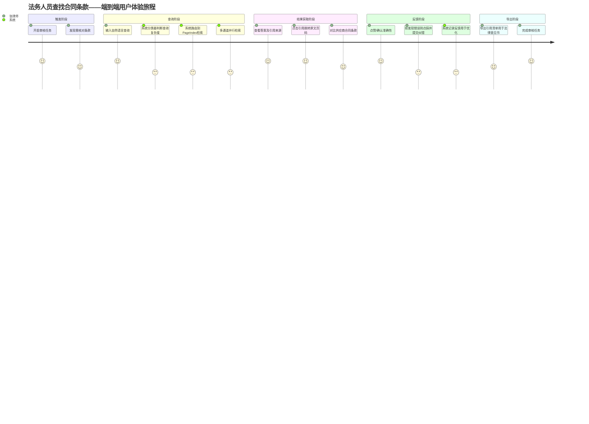

# PRD-产品需求文档：企业级RAG 3.0知识库系统

> **文档编号**：PRD-RAG3.0-20260605
> **版本**：v1.0
> **编制日期**：2026年6月5日
> **编制部门**：AI平台事业部
> **保密等级**：内部
> **关联文档**：BRD-业务需求文档.md（v1.0，同目录）

---

## 目录

1. [文档概述](#1-文档概述)
2. [用户画像与使用场景](#2-用户画像与使用场景)
3. [Epic与用户故事](#3-epic与用户故事)
4. [功能规格说明](#4-功能规格说明)
5. [非功能需求](#5-非功能需求)
6. [用户体验设计](#6-用户体验设计)
7. [数据字典总览](#7-数据字典总览)
8. [验收标准](#8-验收标准)

---

## 1. 文档概述

### 1.1 版本信息

| 版本号 | 编制日期   | 编制人   | 审核人   | 批准人   | 变更说明       |
|--------|------------|----------|----------|----------|----------------|
| v1.0   | 2026-06-05 | AI平台部 | 待定     | 待定     | 初稿，供技术评审 |

### 1.2 文档状态

本文档当前处于 **Draft（草案）** 阶段，与BRD-业务需求文档.md同步提交技术评审委员会审议。后续版本将根据评审意见、原型验证结果和可用性测试反馈进行迭代修订。

### 1.3 阅读对象

本文档是连接业务需求与技术实现的核心枢纽，面向以下五类读者：

| 角色               | 建议重点阅读章节                           | 使用方式                                   |
|--------------------|-------------------------------------------|-------------------------------------------|
| **产品经理（PM）**  | 全文，重点关注第2章（用户画像）、第3章（Epic/User Story）、第8章（验收标准） | 作为需求优先级排序、Sprint Planning和产品验收的权威依据 |
| **架构师**         | 全文，重点关注第4章（功能规格）、第5章（非功能需求）、第7章（数据字典）       | 作为技术选型、架构设计、接口定义的参照基准               |
| **开发工程师**     | 第3章（User Story）、第4章（功能规格）、第7章（数据字典）                   | 作为编码实现、单元测试的直接输入                       |
| **测试工程师**     | 第3章（Acceptance Criteria）、第4章（功能规格）、第8章（验收标准）          | 作为测试用例设计、自动化测试脚本编写的依据               |
| **UX设计师**       | 第2章（用户画像/旅程地图）、第6章（UX设计）                                 | 作为交互设计、视觉设计、可用性测试的输入                 |

### 1.4 与BRD的关系

本文档是BRD-业务需求文档.md的下游产物，二者关系如下：

| 维度       | BRD（业务需求文档）                          | PRD（产品需求文档）                          |
|------------|----------------------------------------------|----------------------------------------------|
| 关注层级   | **Why** — 为什么做，为谁做，值不值得做          | **What** — 做什么，怎么做，做到什么程度        |
| 核心内容   | 市场趋势、商业价值、ROI、竞品、产品边界         | 用户故事、功能规格、非功能需求、验收标准        |
| 粒度       | 粗粒度，面向决策层                            | 细粒度，面向工程团队                            |
| 术语       | 定义核心术语表，PRD原文复用                     | 直接引用BRD术语表，不重复定义                   |

**术语表复用声明**：本文档涉及的全部技术术语（RAG 3.0、PageIndex、LLM Wiki、GraphRAG、RRF、Faithfulness、Chunk-Level ACL等）已在BRD第1.4节完整定义，本文档直接复用，不再重复列举。

### 1.5 产品愿景

构建一套"分类器路由+多通道异构检索+持久化知识编译+混合融合"的新一代企业级RAG 3.0知识库系统，让企业内的每一位知识工作者都能在10秒内获取精确、可追溯、合规的答案。

---

## 2. 用户画像与使用场景

### 2.1 五类用户画像（产品视角角色卡片）

基于BRD第4章"目标用户画像"，从产品功能使用视角进行扩展，形成5张角色卡片。

#### 角色A：决策者——张明，CTO

| 属性       | 描述                                                                 |
|------------|----------------------------------------------------------------------|
| **一句话画像** | 需要向董事会证明AI投入ROI、推动公司从"信息化"走向"AI化"的技术决策者       |
| **使用频率**   | 低频（每周1-2次，主要为系统表现审查）                                   |
| **核心使用路径** | 登录管理后台 → 查看系统运营仪表盘 → 导出成本与用量报告 → 评估ROI        |
| **关键痛点**   | "我花了200万上RAG系统，但拿不出数据向CEO证明它值这个钱"                   |
| **关注指标**   | ROI、用户活跃率、知识利用率提升比例、系统可用率                          |
| **决策影响**   | 决定项目是否继续投入、是否扩大范围、是否追加预算                         |
| **权限等级**   | 最高管理员，可查看全量数据但无知识内容增删改权限（维护职责分离）           |

#### 角色B：平台运营者——李婷，AI平台负责人

| 属性       | 描述                                                                 |
|------------|----------------------------------------------------------------------|
| **一句话画像** | 需要选型、部署、持续调优RAG系统的15人AI团队Leader                         |
| **使用频率**   | 高频（每日多次，包括配置管理、评测查看、问题排查）                        |
| **核心使用路径** | 登录管理后台 → 配置流水线/分块策略/嵌入模型 → 查看评测报告 → 调整路由规则 → 处理告警 |
| **关键痛点**   | "系统在某个场景的准确率突然从85%掉到了70%，我不知道是检索问题还是生成问题"   |
| **关注指标**   | Faithfulness、Recall@10、P95延迟、Token消耗、用户满意度                 |
| **权限等级**   | 平台管理员，可配置系统参数、管理知识库、查看审计日志                       |

#### 角色C：知识管理员——王芳，知识管理产品经理

| 属性       | 描述                                                                 |
|------------|----------------------------------------------------------------------|
| **一句话画像** | 负责知识库的日常运营、文档管理、用户反馈收集和产品迭代协调的知识管理员         |
| **使用频率**   | 中高频（每日，主要为文档管理和用户反馈处理）                              |
| **核心使用路径** | 登录知识库管理后台 → 上传/分类文档 → 查看分块预览 → 处理用户反馈(纠错/投诉) → 生成运营报告 |
| **关键痛点**   | "法务部刚上传了20份新版合同模板，但我不确定AI是否正确解析了其中的复杂表格"   |
| **关注指标**   | 知识库覆盖率、文档解析成功率、用户反馈响应率、查询命中率                   |
| **权限等级**   | 知识库管理员，可管理文档、查看所属知识库的统计数据                          |

#### 角色D：系统开发者——陈工，算法工程师

| 属性       | 描述                                                                 |
|------------|----------------------------------------------------------------------|
| **一句话画像** | 负责RAG系统核心组件开发与优化的实现者                                      |
| **使用频率**   | 高频（每日编码、调试、评测）                                              |
| **核心使用路径** | API调用 → SDK集成 → 评测脚本执行 → 结果分析 → 参数调优 → 代码提交          |
| **关键痛点**   | "评测显示Faithfulness下降了，但我无法隔离到底层Embedding换了还是Prompt模板改了导致的问题" |
| **关注指标**   | 分层评测指标（检索/生成/端到端）、API响应时间、组件热替换灵活性              |
| **权限等级**   | 开发者权限，可访问所有API、查看底层日志、管理Pipeline配置                    |

#### 角色E：终端用户——知识工作者（法务张律师/财务刘会计/研发赵工）

| 属性       | 法务张律师                                    | 财务刘会计                                      | 研发赵工                                     |
|------------|-----------------------------------------------|------------------------------------------------|---------------------------------------------|
| **使用频率** | 高频（每日10-20次查询）                        | 中频（月末/季度末密集使用，日均5-10次）           | 高频（设备故障时即时查询）                     |
| **核心使用路径** | 输入合同条款查询 → 查看引用来源 → 点击验证原文 → 反馈(点赞/纠错) → 导出引用报告 | 输入财务数据查询 → 查看表格答案 → 验证来源 → 导出数据 | 输入设备型号+故障现象 → 获取维修方案 → 点击查看原文页码 |
| **关键痛点** | "系统给了我一个看起来正确的答案，但我需要确认它引用的条款是否最新版本" | "系统把两个季度的数据搞混了，我不敢完全信任它的回答" | "维修手册版本更新了，但系统还回答旧版本的内容"      |
| **技术要求** | 零，需要自然语言交互和清晰的UI引导              | 零，需要表格导出和打印功能                        | 有一定技术基础，可接受高级搜索语法                |

### 2.2 核心使用场景矩阵

以下矩阵将5类角色与8个核心场景交叉，标注使用频率（H=高频/M=中频/L=低频）和优先级（P0/P1/P2）：

| 场景 / 角色          | 决策者(CTO) | 平台运营者 | 知识管理员 | 系统开发者 | 终端用户  | 优先级 |
|----------------------|-------------|------------|------------|------------|-----------|--------|
| 知识库创建与管理      | L           | H          | H          | H          | —         | P0     |
| 文档上传与解析        | —           | M          | H          | H          | —         | P0     |
| 自然语言查询          | L           | L          | L          | M          | H         | P0     |
| 引用溯源验证          | —           | M          | M          | H          | H         | P0     |
| 评测与质量监控        | L           | H          | H          | H          | —         | P1     |
| 权限配置与审计        | M           | H          | M          | L          | —         | P1     |
| 系统仪表盘查看        | H           | H          | H          | M          | —         | P1     |
| 反馈与纠错            | —           | M          | H          | —          | H         | P1     |

### 2.3 用户旅程地图：法务人员查找合同条款

以下以终端用户"法务张律师"为起点，绘制一条端到端的完整用户旅程：

**场景设定**：张律师正在审核一份供应商合同，需要确认"延迟交货违约金"条款是否与公司标准合同模板一致。



**情绪曲线分析**：

| 阶段       | 情绪值 | 波动原因                                                         | 优化机会                                   |
|------------|--------|------------------------------------------------------------------|--------------------------------------------|
| 触发阶段   | 3-4    | 预期有大量搜索和核对工作，略感压力                                   | 在首页提供"近期审核的合同"快捷入口            |
| 查询阶段   | 3-4    | 不确定如何用自然语言精确表达法律问题                                | 提供查询示例模板 + 查询重写建议               |
| 结果获取   | 4-5    | 系统在3秒内返回精确答案并准确标注来源，惊喜                         | 这是核心"魔法时刻"，确保不降级               |
| 反馈阶段   | 4      | 对引用准确性满意，但希望纠错流程更简单                               | 纠错按钮提供快捷选项（"条款版本过旧"/"引用错误"等） |
| 导出阶段   | 4-5    | 一键导出引用清单，可直接嵌入法律意见书，大幅减少重复劳动              | 提供"导出为Word"和"导出为邮件"两种格式       |

---

## 3. Epic与用户故事

### 3.1 Epic总览

| Epic编号 | Epic名称       | 对应BRD产品边界 | Story数量 | 优先级 | MVP范围 |
|----------|----------------|-----------------|-----------|--------|---------|
| E1       | 知识库管理     | 知识域1：文档解析与知识入库 | 12        | P0     | 含   |
| E2       | 智能查询       | 知识域2+3：智能检索与准确回答 | 12        | P0     | 含   |
| E3       | 权限与合规     | 知识域5：安全合规与可观测性 | 10        | P0(基础)/P1(高级) | 基础RBAC含 |
| E4       | 评测与监控     | 知识域5：评测框架 | 12        | P1     | 否   |
| E5       | 系统管理       | 跨域           | 10        | P1     | 基础配置含 |

---

### Epic 1: 知识库管理

> **Epic目标**：为知识管理员和平台运营者提供从知识库创建、文档入库、智能分块到索引管理、统计分析的完整生命周期管理能力。

#### US-1.1：创建知识库

**作为** 知识管理员（王芳），
**我希望能** 创建新的知识库并为其设置名称、描述、所属团队和默认语言，
**以便** 将不同部门的知识内容进行逻辑隔离和组织管理。

**验收标准**：
- [ ] 知识库创建表单包含：名称（必填，2-50字符，支持中英文及特殊符号）、描述（可选，最多200字符）、默认语言（枚举：中文/英文/日文/其他）、图标（可选，支持Emoji和上传图片）
- [ ] 创建成功后自动跳转至该知识库详情页，展示空白状态引导（"上传第一份文档"CTA）
- [ ] 知识库列表页按最近更新时间降序排列，支持搜索和按团队过滤
- [ ] 同一用户创建的多个知识库之间数据完全隔离
- [ ] 名称验证规则：不允许为空、不允许与同用户已有知识库重名、不允许纯数字/纯符号
- [ ] 创建失败时给出明确错误提示（如"知识库名称已存在，请更换"）

#### US-1.2：上传文档

**作为** 知识管理员（王芳），
**我希望能** 通过拖拽、点击上传或URL导入方式将文档添加到知识库，
**以便** 快速将企业各类知识资产纳入系统进行统一管理。

**验收标准**：
- [ ] 支持拖拽上传（拖拽区域热区≥400×200px，高亮显示拖入状态）
- [ ] 支持文件选择器批量上传，单次最多100个文件，单文件大小上限100MB（可配置）
- [ ] 支持URL导入模式（输入文档URL，系统自动下载并入库）
- [ ] 上传列表显示：文件名、大小、格式图标、上传进度条、状态（等待中/上传中/解析中/已完成/失败）、耗时
- [ ] 支持16种格式：PDF、DOCX、PPTX、XLSX、CSV、TXT、MD、HTML、XML、JSON、EML（邮件）、MSG（Outlook邮件）、PNG/JPG（图片）、RTF、Log、源代码文件（.py/.js/.java/.cpp/.go）
- [ ] 上传失败时提供：失败原因（如"文件损坏"/"格式不支持"/"文件过大"/"存储不足"） + 重试按钮
- [ ] 支持暂停单个文档的上传和解析队列
- [ ] 队列视图显示待处理文档数量和预计完成时间

#### US-1.3：文档解析与预览

**作为** 知识管理员（王芳），
**我希望能** 在上传完成后查看文档的解析效果预览（包括OCR识别、表格还原、布局识别结果），
**以便** 在入库前验证解析质量，避免"垃圾进垃圾出"。

**验收标准**：
- [ ] 解析完成后自动在文档详情页展示"解析预览"区域
- [ ] 预览区包含三栏：左侧目录导航、中间文档渲染（含表格/图表/公式）、右侧JSON/结构化数据视图
- [ ] 表格预览支持单元格级高亮对比（原始扫描件 vs 解析结果）
- [ ] OCR识别区域自动用蓝色边框标注，鼠标悬停显示识别文本值
- [ ] 布局识别结果（标题/正文/表格/图表/列表/页眉/页脚/代码块/公式/脚注共10种）用不同颜色标签标注
- [ ] 解析质量评分显示（0-100分，80分以下标黄预警，60分以下标红并自动标记为待人工复核）
- [ ] 支持手动修正解析结果（如纠正OCR错误、调整分块边界）并保存修正版
- [ ] 修正数据自动进入解析模型反馈训练集

#### US-1.4：文档分块预览

**作为** 系统开发者（陈工），
**我希望能** 在上传文档后预览系统自动分块的结果（每个Chunk的边界、内容、粒度），
**以便** 验证分块策略是否正确，并在需要时手动调整分块参数。

**验收标准**：
- [ ] 分块预览以卡片列表形式展示，每张卡片显示：Chunk编号、内容摘要（前80字符）、Token数量、字符数
- [ ] 每张卡片右侧标注该Chunk的分块策略（"模板分块"/"语义分块"/"父子分块"/"LLM增强"）
- [ ] 支持手动合并相邻Chunk、拆分过大Chunk、标记特定Chunk为不参与检索
- [ ] 支持按分块大小过滤（如"展示Token>512的Chunk"）
- [ ] Chunk预览卡片点击后展开完整内容，并用高亮标注与相邻Chunk的语义重叠区域
- [ ] 分块策略切换后支持"重新分块"操作，保留原始手动调整
- [ ] 显示分块统计：总Chunk数、平均Token数、最大/最小Token数、重叠Chunk比例

#### US-1.5：索引状态管理

**作为** 平台运营者（李婷），
**我希望能** 查看每个知识库的索引构建状态（向量索引、全文索引、PageIndex树索引、图谱索引、Wiki编译进度），
**以便** 确保所有文档已正确索引、及时发现索引构建失败问题。

**验收标准**：
- [ ] 索引状态仪表盘以5列卡片显示：向量索引、全文索引、PageIndex树索引、知识图谱索引、LLM Wiki编译
- [ ] 每列显示：已索引文档数/总文档数、进度百分比、最近索引时间、索引耗时
- [ ] 索引失败文档列表显示失败原因和重试按钮
- [ ] 支持"全部重建索引"批量操作（需二次确认）
- [ ] 增量索引自动在文档更新后触发（30秒内检测到变更）
- [ ] 索引健康度评分（0-100，70分以下标黄，50分以下告警）
- [ ] 支持索引构建暂停/恢复控制

#### US-1.6：知识库搜索

**作为** 知识管理员（王芳），
**我希望能** 在知识库管理后台搜索和筛选已入库的文档，
**以便** 快速定位特定文档进行查看、编辑或删除操作。

**验收标准**：
- [ ] 搜索支持：文档名称模糊搜索、文档类型筛选、上传时间范围筛选、标签筛选、上传者筛选
- [ ] 搜索结果列表显示：文档标题、格式图标、上传时间、上传者、文件大小、状态标签（已索引/索引中/解析失败）
- [ ] 支持全文搜索文档内容（非对话式，为管理后台精确搜索功能）
- [ ] 搜索结果支持批量操作：标签设置、移动到其他知识库、批量删除
- [ ] 搜索响应时间<500ms（10万文档规模下）

#### US-1.7：知识库导出

**作为** 知识管理员（王芳），
**我希望能** 导出知识库的文档列表、统计数据和分块结果，
**以便** 生成知识库运营报告或进行离线分析。

**验收标准**：
- [ ] 导出范围可选：仅元数据（CSV）、含文档原文（ZIP）、含分块结果（JSON）
- [ ] 导出格式支持：CSV、JSON、PDF（统计报告）
- [ ] 大知识库（>1万文档）导出采用异步任务，完成后通过站内通知和邮件通知
- [ ] 导出任务列表可查看历史导出记录和下载链接（7天内有效）
- [ ] 导出过程中知识库仍可正常使用（无锁等待）

#### US-1.8：知识库删除

**作为** 知识管理员（王芳），
**我希望能** 安全删除不再需要的知识库及其全部关联数据，
**以便** 管理系统存储空间并符合数据治理要求。

**验收标准**：
- [ ] 删除操作需输入知识库名称进行确认（防误删）
- [ ] 删除后30天内进入"回收站"状态，期间可恢复
- [ ] 回收站中显示：知识库名称、删除时间、删除者、剩余恢复天数
- [ ] 三十天后自动永久删除，包括文档、分块、向量索引、Wiki编译页、图谱节点等全部衍生数据
- [ ] 支持"被遗忘权"合规：管理员可指定单个文档即时彻底删除（跳过回收站），30分钟内所有副本和衍生数据从所有系统中清除
- [ ] 删除操作写入审计日志

#### US-1.9：知识库统计仪表盘

**作为** 平台运营者（李婷），
**我希望能** 通过一个可视化仪表盘查看知识库的整体运营数据，
**以便** 监控知识库增长趋势、识别低质量文档和优化方向。

**验收标准**：
- [ ] 仪表盘包含以下卡片指标：总文档数、总Chunk数、总存储大小、本月新增文档数、平均解析质量分
- [ ] 趋势图（折线图）：近30天文档上传量、查询命中量、用户查询量
- [ ] 分布图（饼图）：文档格式分布、分块策略分布
- [ ] 排行榜：最多查询的知识库Top5、最多被引用的文档Top10、查询失败最多的文档Top10
- [ ] 数据刷新频率：每5分钟自动刷新，支持手动强制刷新
- [ ] 支持时间范围选择：最近7天/30天/90天/自定义
- [ ] 所有图表支持导出为PNG图片，供周报使用

#### US-1.10：外部数据源同步

**作为** 知识管理员（王芳），
**我希望能** 配置知识库自动从S3/MinIO/Confluence/Notion等外部数据源同步文档，
**以便** 减少手动上传工作、保持知识库与外部系统的实时同步。

**验收标准**：
- [ ] 支持的同步源：S3/MinIO（对象存储）、Confluence Cloud/Server、Notion、SharePoint Online、本地文件系统挂载
- [ ] 同步配置界面支持：连接信息填写（URL/Access Key/Secret）、测试连接按钮、目录/空间选择、同步频率（实时/每小时/每天/每周）
- [ ] 同步状态显示：上次同步时间、同步文档数、失败文档数
- [ ] 同步冲突策略可选：覆盖/跳过/重命名
- [ ] 支持手动触发单次即时同步
- [ ] 同步失败时自动重试3次，最终失败后发送告警通知

#### US-1.11：媒体文件处理

**作为** 知识管理员（王芳），
**我希望能** 将包含重要信息的图片（扫描件、截图、图表）上传至知识库，
**以便** 让系统能检索和理解图像中的文字信息和视觉内容。

**验收标准**：
- [ ] 支持PNG、JPG、TIFF、BMP格式图片上传
- [ ] 自动对图片执行OCR识别，提取的文字作为该Chunk的可检索文本
- [ ] 支持多模态检索：查询"包含柱状图的页面"时可返回图像
- [ ] 图片预览支持OCR文字层叠加显示（可开关）
- [ ] 图像内容自动生成描述性Alt文本和标签（用于检索）

#### US-1.12：文档版本管理

**作为** 知识管理员（王芳），
**我希望能** 上传文档的新版本并管理版本历史，
**以便** 确保用户查询时始终获取最新版本的文档内容。

**验收标准**：
- [ ] 支持上传新版本文档替换已有文档，自动触发解析和重新索引
- [ ] 版本历史列表显示：版本号（V1/V2/...）、上传时间、上传者、变更说明
- [ ] 旧版本索引和新版本索引并存30天，期间可通过版本切换查看历史版本
- [ ] 支持版本回退（回至Vx），回退后自动重新索引该版本
- [ ] 版本对比视图：左右分屏高亮显示两个版本间的差异
- [ ] 用户查询默认使用最新版本文档，但可在查询时显式指定版本号

#### 源码基础 — Epic 1: 知识库管理

以下列出支撑Epic 1各User Story的RAGFlow 0.25.4核心源码文件，标注复用策略与扩展内容：

| User Story | 对应RAGFlow源码 | RAGFlow提供 | RAG 3.0扩展 |
|------------|----------------|-------------|-------------|
| US-1.1 创建知识库 | `api/apps/kb_app.py` — 知识库API路由<br/>`api/db/services/knowledgebase_service.py` — KB服务层<br/>`api/db/db_models.py` — Knowledgebase ORM模型 | 完整的知识库CRUD API（创建/列表/详情/更新/删除），`POST /api/v1/knowledge_bases` | ① 扩展KB模型字段（icon_url、language、pipeline_config）；② 添加默认分块策略配置；③ 租户级KB数量配额检查 |
| US-1.2 上传文档 | `api/apps/document_app.py` — 文档管理API<br/>`api/db/services/document_service.py` — 文档服务层<br/>`common/file_utils.py` — 文件处理工具 | 文件上传（multipart/form-data）、格式校验、URL导入、批量上传 | ① 扩展支持格式到16+种；② 上传进度跟踪；③ 暂停/恢复上传队列；④ URL导入异步化 |
| US-1.3 文档解析与预览 | `deepdoc/vision/ocr.py` — OCR模块<br/>`deepdoc/vision/recognizer.py` — 布局识别(YOLOv8, 10种)<br/>`deepdoc/vision/table_structure.py` — 表格结构还原<br/>`deepdoc/parser/pdf_parser.py` — PDF解析器<br/>`rag/flow/parser/parser.py` — 解析流水线 | DeepDoc OCR+布局+TSR三元引擎，PDF/DOCX/XLSX/PPTX解析 | ① 解析质量自动评分（0-100）；② 解析预览UI（三栏视图）；③ 手动修正解析结果并反馈训练；④ PDF bbox坐标输出 |
| US-1.4 文档分块预览 | `rag/flow/chunking/` — 分块策略<br/>`api/apps/chunk_app.py` — Chunk管理API | 5种分块策略（通用/模板/层次/语义/QA/父子），Chunk列表API | ① 分块预览卡片UI；② 手动合并/拆分Chunk；③ 分块策略热切换+重新分块；④ Token计数与统计 |
| US-1.5 索引状态管理 | `rag/flow/indexing/indexing.py` — 索引构建<br/>`rag/flow/embedding/embedding.py` — 嵌入流水线<br/>`common/es_connector.py` — ES索引管理 | 向量索引+全文索引构建流程，索引状态跟踪 | ① 五维索引状态仪表盘（向量/全文/PageIndex/图谱/Wiki）；② 增量索引自动触发；③ 索引健康度评分 |
| US-1.10 外部数据源同步 | `common/connector/` — 外部连接器框架 | SaaS源连接器基础框架 | ① 扩展S3/MinIO/Confluence/Notion/SharePoint连接器；② 定时+事件驱动同步；③ 增量同步策略 |
| US-1.12 文档版本管理 | `api/db/db_models.py` — Document Version字段 | 基础version字段 | ① 完整版本历史表；② 新旧版并存30天；③ 版本对比视图；④ 版本回退+重新索引 |

**Epic 1源码依赖总结**：
- **直接复用文件**（无需改动）：`deepdoc/`全部、`common/file_utils.py`、`rag/flow/parser/parser.py`
- **需修改文件**（骨架保留）：`api/apps/kb_app.py`（添加字段）、`api/apps/document_app.py`（扩展上传格式）、`api/db/db_models.py`（新增表）、`rag/flow/chunking/`（增加LLM增强分块）
- **需新建文件**（全新开发）：分块预览前端组件、解析质量评分模块、外部数据源连接器扩展包

---

### Epic 2: 智能查询

> **Epic目标**：为终端用户提供自然语言驱动的智能查询能力，支持多文档跨库检索、流式回答、引用溯源、多轮对话和多语言能力。

#### US-2.1：自然语言提问

**作为** 法务人员（张律师），
**我希望能** 用日常中文（口语化、含行业术语）向系统提问，
**以便** 不需要学习任何查询语法就能获取我需要的法律信息。

**验收标准**：
- [ ] 查询输入框支持多行文本（最少3行、最多500字符），自动调整高度
- [ ] 支持口语化表达的处理能力，例如："上次那个XX供应商的违约条款，就是拖了货要赔钱那个，具体是合同的第几条？"
- [ ] 查询分类器自动判断查询复杂度（简单事实/中等推理/复杂多跳/专业知识），并在后台日志记录
- [ ] 查询按钮按下后显示加载动画+进度文案（"正在理解您的问题..."/"正在检索相关文档..."/"正在生成答案..."）
- [ ] 查询超时（>30秒）时自动取消并提示用户"查询时间较长，请简化问题或稍后重试"
- [ ] 输入框有内容时回车键触发查询（可配置关闭）
- [ ] 空查询提交时输入框边框变红并提示"请输入您的问题"

#### US-2.2：多文档跨库查询

**作为** 财务人员（刘会计），
**我希望能** 一次查询同时检索多个知识库中的多个文档，
**以便** 跨数据中心/跨部门地获取综合分析结果。

**验收标准**：
- [ ] 查询时可选择检索范围：全部知识库 / 指定知识库 / 指定文档 / 指定文档类型
- [ ] 跨库查询结果在回答中明确标注每条引用的来源知识库名称
- [ ] 跨库检索的延迟不超过单库检索的1.5倍（同级基础设施条件下）
- [ ] 跨库检索结果通过RRF融合、去重后统一呈现
- [ ] 当用户选择全部知识库时，权限过滤器自动排除用户无权访问的知识库中的结果

#### US-2.3：引用溯源

**作为** 法务人员（张律师），
**我希望能** 在系统生成的每个答案中看到精确的引用来源（文档名、章节、页码、原文段落引用），
**以便** 我能点击验证AI回答的准确性，并在法律意见书中引用。

**验收标准**：
- [ ] 答案中每个关键事实点后跟随引用标记，格式为 `[1]`、`[2]`，可点击
- [ ] 引用标记点击后弹出信息卡片，包含：文档名称、页码、章节标题、原文片段（高亮匹配关键词）
- [ ] 答案底部显示"引用列表"，列出本次回答引用的全部文档来源
- [ ] 引用列表每个条目支持：点击跳转原文PDF（精确定位到对应页码和段落）、复制引用格式、标记该引用为"有价值"/"不相关"
- [ ] 无引用来源的AI推断内容用灰色斜体显示并标注"(仅供参考)"
- [ ] 引用来源中如果包含用户无权查看的文档，该条引用自动脱敏（显示为"[引用已脱敏]"）
- [ ] 对于PageIndex检索结果，引用信息直达原文bbox坐标区域（视觉高亮）
- [ ] 对于扫描件PDF，引用区域在图片上用红色边框标注OCR识别范围

#### US-2.4：流式回答

**作为** 研发人员（赵工），
**我希望能** 系统在生成答案时以打字机效果逐字显示，
**以便** 我不需要等待完整生成就提前开始阅读，提升交互体验。

**验收标准**：
- [ ] 答案生成采用SSE（Server-Sent Events）流式传输，首个Token延迟<500ms
- [ ] 流式输出速度可配置（默认每字符约30ms，模拟人类打字节奏）
- [ ] 流式生成过程中显示"生成中..."状态指示器（呼吸灯或逐字闪烁光标）
- [ ] 流式生成过程中用户可点击"停止生成"按钮提前终止
- [ ] 流式生成完成后所有引用标记和格式渲染正确（不出现标记断裂）
- [ ] 异常断连时自动重连并继续生成，最多重试两次
- [ ] 流式输出的纯文本Token计数显示在回答末尾（可收起）

#### US-2.5：对话历史

**作为** 平台运营者（李婷），
**我希望能** 查看和管理所有用户的对话历史记录，
**以便** 分析查询模式、发现高频问题和优化知识库覆盖范围。

**验收标准**：
- [ ] 终端用户端：对话历史以会话（Session）维度组织，默认显示最近30天对话
- [ ] 会话列表显示：会话标题（自动摘要生成）、创建时间、消息条数、最后活跃时间
- [ ] 支持会话搜索、重命名、删除、存档
- [ ] 管理员端：可查看全局对话历史，按用户/知识库/时间/查询复杂度筛选
- [ ] 对话历史导出格式：CSV（统计分析）、JSON（完整上下文）
- [ ] 对话数据保留策略可配置（默认90天，合规场景可延长至3年）
- [ ] 历史查询支持"一键再问"——将历史问题重新提交给当前版本系统

#### US-2.6：查询重写建议

**作为** 法务人员（张律师），
**我希望能** 在查询结果不理想时看到系统推荐的备选查询方式，
**以便** 我可以用不同的表达方式获得更好的检索结果。

**验收标准**：
- [ ] 当查询返回的候选结果置信度低于阈值（默认0.6，可配置）时，答案下方自动展示"试试这样问："区域
- [ ] 查询重写建议最多显示3条，每条为自然语言表述的备选问法
- [ ] 建议分为三种类型：精确化（"XX合同第五条"）、泛化（"供应商违约条款"）、跨文档（"对比所有供应商合同的违约责任"）
- [ ] 用户点击建议后自动填充输入框并触发新查询
- [ ] 管理员可在后台查看已触发建议但未被点击的建议列表，用于优化建议生成模型

#### US-2.7：答案反馈

**作为** 财务人员（刘会计），
**我希望能** 对系统答案进行点赞、点踩或提交纠错反馈，
**以便** 帮助系统持续改进回答质量。

**验收标准**：
- [ ] 每个答案下方显示3个反馈按钮：点赞(👍)、点踩(👎)、纠错(✏️)
- [ ] 点赞/点踩为即时反馈，点击后按钮变色确认，无需额外操作
- [ ] 点踩后弹出追问弹窗，包含预设原因选项：回答错误、引用错误、信息过时、不完整、格式问题、其他
- [ ] 纠错按钮点击后弹出表单，包含：错误说明（必填）、正确内容建议（选填）、引用修正建议（选填）
- [ ] 所有反馈写入数据库，关联到当时的查询上下文和检索结果
- [ ] 管理员后台可查看反馈汇总：按时间/用户/知识库/问题类型统计
- [ ] 反馈数据自动进入评测数据集的负样本池

#### US-2.8：多轮对话上下文

**作为** 研发人员（赵工），
**我希望能** 与系统进行多轮对话，后续问题能理解之前对话的上下文，
**以便** 我可以自然地追问、澄清和深入探索一个技术问题。

**验收标准**：
- [ ] 系统识别指代关系（如"那这个型号的呢？"中的"这"指上一轮提到的设备型号）
- [ ] 系统识别省略查询（如"上季度的呢？"省略了具体指标）
- [ ] 多轮上下文的Token限制管理：当上下文+新查询超出LLM窗口时，自动对历史对话做摘要压缩
- [ ] 上下文有效期：同一会话内无超时限制；跨会话通过会话ID关联
- [ ] 会话切换时自动清空上下文，系统给出明确提示
- [ ] 支持"新话题"按钮——点击后系统标记上下文断点，新查询不继承历史上下文

#### US-2.9：多语言查询

**作为** 市场部同事（跨国企业场景），
**我希望能** 用英文/日文/中文等多种语言查询知识库并获取对应语言或指定语言的回答，
**以便** 跨国团队都能无障碍使用系统。

**验收标准**：
- [ ] 支持检测15+种查询语言（中/英/日/韩/法/德/西/葡/俄/阿/印地/泰/越/印尼/马来）
- [ ] 语言检测准确率≥98%（在>10字符的查询上）
- [ ] 回答语言默认与查询语言一致，但用户可在输入框旁通过下拉菜单显式指定回答语言
- [ ] 混合语言查询支持：中英夹杂的用户查询可正常处理（如"找一下Q3的KPI report里面关于revenue growth的部分"）
- [ ] 跨语言检索支持：用中文查询英文文档，或反之（通过多语言嵌入模型实现）
- [ ] 语言检测结果在后台日志中记录，管理员可查看语言分布统计

#### US-2.10：高级搜索语法

**作为** 研发人员（赵工），
**我希望能** 使用高级搜索语法（如`site:`、`filetype:`、`before:`、`after:`）进行精确过滤查询，
**以便** 在已知条件下快速定位特定文档中的特定内容。

**验收标准**：
- [ ] 支持的搜索运算符：
  - `kb:知识库名称` — 限定知识库
  - `doc:文档名称` — 限定特定文档
  - `filetype:pdf|docx|xlsx` — 限定文档格式
  - `before:2025-01-01` / `after:2025-01-01` — 限定文档时间范围
  - `author:用户名` — 限定文档上传者
  - `version:V2` — 限定文档版本
- [ ] 高级搜索语法和自然语言可混合使用
- [ ] 语法错误时给出友好提示（如"未找到filetype:pdd格式，支持的类型有pdf、docx、xlsx..."）
- [ ] 高级搜索语法不区分大小写
- [ ] 在输入框旁提供"高级语法帮助"入口（？图标），点击弹出语法速查卡

#### US-2.11：答案置信度评分

**作为** 终端用户（法务/财务/研发），
**我希望能** 在系统答案中看到置信度评分（如"置信度：85%"），
**以便** 快速判断该回答是否需要人工二次验证。

**验收标准**：
- [ ] 每个回答均显示置信度评分（百分比），位置在答案顶部右上角
- [ ] 置信度评分颜色编码：绿色(≥85%)表示可信、黄色(70-84%)表示需注意、红色(<70%)表示建议验证
- [ ] 置信度<70%时追加提示文字"该回答置信度较低，建议查阅原始文档进行验证"
- [ ] 置信度计算基于：检索命中质量、Cross-Encoder分数、LLM生成一致性、来源权威性
- [ ] 管理员可在后台查看导致低置信度的具体原因拆解

#### US-2.12：答案对比模式

**作为** 法务人员（张律师），
**我希望能** 将两个不同版本的文档或多个不同来源的回答进行对比展示，
**以便** 快速识别差异做出判断。

**验收标准**：
- [ ] 用户可在查询时勾选"对比模式"，并选择2-3个对比来源（文档版本/知识库）
- [ ] 对比结果以表格形式展示：行=对比维度（AI自动提取的关键维度），列=来源
- [ ] 差异单元格用黄色高亮标注
- [ ] 每个对比维度后面标注各来源的置信度
- [ ] 对比结果支持导出为CSV表格

#### 源码基础 — Epic 2: 智能查询

| User Story | 对应RAGFlow源码 | RAGFlow提供 | RAG 3.0扩展 |
|------------|----------------|-------------|-------------|
| US-2.1 自然语言提问 | `rag/llm/chat_model.py` — Chat模型包装<br/>`rag/prompts/` — Prompt模板<br/>`api/apps/conversation_app.py` — 对话API | LLM调用封装（OpenAI兼容接口），基础Chat API | ① 查询复杂度分类器（Tier 1-4，RAGFlow无此能力）；② 口语化/行业术语查询理解；③ 查询超时熔断 |
| US-2.2 多文档跨库查询 | `rag/flow/retrieval/retrieval.py` — 检索流水线<br/>`api/apps/sdk/` — 跨KB检索SDK | 单KB检索能力完善，SDK层支持指定KB列表 | ① 跨KB结果融合与去重；② 来源知识库标注；③ 权限过滤器跨库生效 |
| US-2.3 引用溯源 | `rag/flow/retrieval/retrieval.py` — 检索结果含元数据<br/>`api/apps/chunk_app.py` — Chunk信息查询 | 检索结果附带doc_id、页码等基本信息 | ① 精确页码bbox定位（RAGFlow仅有页码无坐标）；② 引用卡片弹出UI（文档名/章节/片段/页面区域高亮）；③ 引用脱敏处理 |
| US-2.4 流式回答 | `api/apps/conversation_app.py` — 对话SSE流<br/>`rag/llm/chat_model.py` — 支持stream=True | OpenAI兼容SSE流式输出 | ① 首个Token延迟优化（<500ms）；② 流式进度事件（routing/searching/token/citation/done）；③ 断连自动重连续接 |
| US-2.5 对话历史 | `api/apps/conversation_app.py` — 对话CRUD<br/>`api/db/services/conversation_service.py` — 对话服务层 | 完整的对话/消息CRUD API | ① 管理员全局对话查看；② 对话搜索与分析（按用户/KB/时间/复杂度）；③ 策略可配置的数据保留 |
| US-2.6 查询重写建议 | 无直接对应 — RAGFlow无查询重写功能 | — | ① 查询重写LLM Prompt模板（精确化/泛化/跨文档）；② 重写建议触发阈值配置；③ 建议点击率跟踪 |
| US-2.8 多轮对话上下文 | `api/db/services/conversation_service.py` — 上下文管理<br/>`agent/component/` — Agent记忆组件 | 基本多轮对话能力 | ① 指代消解（"这个型号"→上一轮实体）；② 上下文窗口Token管理+自动摘要压缩；③ "新话题"断点标记 |
| US-2.9 多语言查询 | `deepdoc/vision/ocr.py` — 多语言OCR（15+语言）<br/>`rag/nlp/__init__.py` — NLP工具 | 15+语言OCR、语言检测基础 | ① 查询语言自动检测（15+语言）；② 跨语言检索（中文查英文文档）；③ 回答语言跟随/指定 |
| US-2.10 高级搜索语法 | `common/es_connector.py` — ES查询DSL | ES原生支持高级搜索语法 | ① 自定义语法解析器（kb:/doc:/filetype:/before:/after:/author:/version:）；② 语法错误友好提示；③ 自然语言+语法混合解析 |

**Epic 2源码依赖总结**：
- **直接复用文件**：`rag/llm/chat_model.py`、`api/apps/conversation_app.py`、`rag/nlp/__init__.py`
- **需修改文件**（扩展检索逻辑）：`rag/flow/retrieval/retrieval.py`（多通道调度+引用增强+跨KB支持）
- **需新建文件**：查询复杂度分类器、查询重写模块、高级搜索语法解析器、多语言检测模块

---

### Epic 3: 权限与合规

> **Epic目标**：构建多层级的权限控制体系和全链路合规能力，确保系统满足企业级安全和监管要求。

#### US-3.1：知识库级权限

**作为** 平台运营者（李婷），
**我希望能** 为每个知识库设置查看、编辑、管理三种级别的权限并分配给用户或团队，
**以便** 确保不同部门的知识资产互不可见。

**验收标准**：
- [ ] 知识库权限包含三级：查看者（可查询不可管理）、编辑者（可上传/修改/删除文档）、管理员（可管理权限和删除知识库）
- [ ] 权限分配支持按用户和按团队（用户组）两种粒度
- [ ] 权限继承规则：团队权限下所有成员继承团队权限；用户级权限优先于团队级权限
- [ ] 未授权知识库在查询范围选择列表中不可见
- [ ] 管理员可查看知识库的权限变更历史（谁、何时、修改了什么权限）
- [ ] 权限变更操作写入审计日志

#### US-3.2：文档级权限

**作为** 平台运营者（李婷），
**我希望能** 将知识库内特定文档标记为"仅限特定角色/用户访问"，
**以便** 在同一知识库中实现更细粒度的权限控制（如合同知识库中的保密协议仅法务总监可查看）。

**验收标准**：
- [ ] 文档权限支持设置为：继承知识库权限（默认）、指定用户/团队访问、指定角色访问
- [ ] 文档权限设置影响该文档下所有Chunk和衍生数据
- [ ] 权限过滤在检索层前置执行：未授权文档的Chunk不在候选集中出现
- [ ] 文档权限变更后，该文档的向量索引、全文索引、PageIndex树索引在5分钟内同步更新权限标记
- [ ] 管理员可设置"文档级默认权限模板"（如"法务文档默认仅法务人员可见"）

#### US-3.3：块级ACL

**作为** 平台运营者（李婷），
**我希望能** 为文档中的特定段落（Chunk）设置独立访问权限，
**以便** 保护单份文档中嵌入的敏感段落（如合同中的价格条款、技术文档中的专利信息）。

**验收标准**：
- [ ] 分块预览页支持为每个Chunk设置权限标记：公开/内部/机密/绝密
- [ ] 块级ACL在向量检索、全文检索、图谱检索中均前置执行，未授权Chunk不出现在候选集中
- [ ] 权限标记自动从文档级权限继承，支持显式设置更严格(升级)或更宽松(降级需二次确认)
- [ ] 权限过滤的性能开销控制在P99检索延迟增加<50ms
- [ ] 块级ACL变更历史可追溯
- [ ] 跨Chunk引用时，若部分引用Chunk被权限过滤，答案中对应引用标记显示为"[访问受限]"

#### US-3.4：角色管理与RBAC

**作为** 平台运营者（李婷），
**我希望能** 创建自定义角色并为其配置细粒度的操作权限，
**以便** 适应企业内不同岗位（如"审计员"只读审计日志、"内容编辑"只能管理文档内容）的差异化权限需求。

**验收标准**：
- [ ] 预置6种系统角色：超级管理员、平台管理员、知识库管理员、审计员、开发者、终端用户
- [ ] 支持创建自定义角色，勾选组合权限：知识库创建/删除、文档上传/删除/修改、权限管理、审计查看、系统配置、API密钥管理
- [ ] 角色分配支持按用户和按团队
- [ ] 用户可同时拥有多个角色，权限取并集
- [ ] 预置"最小权限"原则检查：自定义角色默认无权限，需显式添加
- [ ] 角色变更即时生效，已在线的用户当前会话在5分钟内刷新权限

#### US-3.5：多租户数据隔离

**作为** 平台运营者（李婷），
**我希望能** 在同一系统实例中为不同的子公司/部门创建独立租户，确保租户间数据完全隔离，
**以便** 满足集团型企业的多级管理需求。

**验收标准**：
- [ ] 同一系统实例支持创建多个租户，每个租户有独立的域名/URL入口或通过登录后选择器切换
- [ ] 租户级别数据隔离：知识库、文档、对话、用户、审计日志按租户完全隔离
- [ ] 向量数据库按租户使用独立Collection/Namespace
- [ ] 跨租户数据查询前需要获取对方租户的显式授权（通过系统间共享协议）
- [ ] 租户管理需超级管理员权限
- [ ] 平台级费用/用量统计可隔离到租户维度

#### US-3.6：审计日志查看

**作为** 审计员（合规团队），
**我希望能** 按时间/用户/操作类型/资源类型等维度查询完整的审计日志，
**以便** 满足内部合规审查和外部监管检查的要求。

**验收标准**：
- [ ] 审计日志记录项包含（4W1H）：Who（用户ID）、When（时间戳，精确到毫秒）、What（操作类型）、Where（资源类型和ID）、How（操作结果+详情JSON）
- [ ] 支持的查询条件：时间范围、用户、操作类型（查询/上传/删除/权限变更/配置变更）、资源类型、知识库、关键字段模糊搜索
- [ ] 审计数据保留期可在系统级配置（默认3年，合规场景建议7年）
- [ ] 审计日志支持导出为CSV/JSON格式，支持按时间段分片导出
- [ ] 审计日志查询响应时间<3秒（亿级日志量、索引优化后）
- [ ] 审计日志页面需审计员或更高角色权限才可访问

#### US-3.7：数据脱敏标记

**作为** 平台运营者（李婷），
**我希望能** 在答案生成时自动检测并脱敏PII（个人身份信息）和PHI（受保护健康信息），
**以便** 防止敏感信息在答案中泄露。

**验收标准**：
- [ ] 自动检测以下类型的敏感信息：身份证号、手机号、邮箱、银行卡号、家庭地址、IP地址、社保号、病历号
- [ ] 脱敏策略可选：替换为`***`、替换为`[脱敏-身份证]`标签、假名化（保留格式但替换数据）
- [ ] 脱敏规则支持正则表达式配置和基于NER（命名实体识别）的自动发现
- [ ] 脱敏结果在答案中高亮显示（浅黄色底色+虚线框），提示用户原始内容已脱敏
- [ ] 脱敏日志记录：哪些实体被脱敏、使用哪种策略、在哪个文档的哪个位置
- [ ] 具有"查看脱敏原文"权限的高级用户在点击脱敏标记后可查看原始值（该操作写入审计日志）

#### US-3.8：合规报告导出

**作为** 审计员，
**我希望能** 按监管要求一键生成合规审查报告（含系统安全状态、审计摘要、数据流转图、权限矩阵），
**以便** 提交给外部审计机构或监管单位。

**验收标准**：
- [ ] 合规报告模板包含章节：系统部署架构、数据流转图、权限矩阵、风险清单、审计日志摘要、安全事件记录、数据保留策略
- [ ] 报告格式支持：PDF（正式提交）、CSV（数据分析）
- [ ] 报告生成可指定时间范围，自动汇总相关数据
- [ ] 报告生成采用异步任务，完成后通知用户下载
- [ ] 每次生成的报告存档，支持历史报告查看

#### US-3.9：提示注入防御

**作为** 平台运营者（李婷），
**我希望能** 系统自动检测并拦截用户查询中的提示注入（Prompt Injection）攻击，
**以便** 防止恶意用户通过查询篡改系统行为或窃取数据。

**验收标准**：
- [ ] 检测以下注入类型：直接指令注入（"忽略之前指令"）、间接注入（通过上传文档嵌入指令）、越狱（Jailbreak）
- [ ] 检测到注入攻击时自动拒绝查询，返回通用提示"您的查询无法处理，如有疑问请联系管理员"
- [ ] 注入检测准确率：误报率<1%，漏报率<5%
- [ ] 注入攻击事件写入安全日志，触发告警通知安全管理员
- [ ] 注入检测模块独立于生成模块，确保检测本身不被绕过

#### US-3.10：文档投毒检测

**作为** 平台运营者（李婷），
**我希望能** 在文档上传时自动扫描是否包含恶意内容（嵌入指令、恶意链接、对抗性文本），
**以便** 防止攻击者通过上传投毒文档污染知识库。

**验收标准**：
- [ ] 上传文档自动扫描：隐藏文本检测、对抗性段落检测、恶意URL/代码检测
- [ ] 检测到可疑文档时自动标记为"隔离审查"状态，不进入常规索引
- [ ] 标记文档通知知识库管理员审核，管理员可批准放行或确认拒绝
- [ ] 审核结果记录反馈给检测模型，持续优化检测准确率
- [ ] 文档投毒检测的性能开销在管道中控制在上传总耗时的<10%

#### 源码基础 — Epic 3: 权限与合规

| User Story | 对应RAGFlow源码 | RAGFlow提供 | RAG 3.0扩展 |
|------------|----------------|-------------|-------------|
| US-3.1 知识库级权限 | `api/apps/user_app.py` — 用户管理API<br/>`api/db/db_models.py` — User/Tenant/Role ORM模型<br/>`api/db/services/user_service.py` — 用户服务层 | 基础RBAC模型（用户/角色/租户），知识库级权限控制（owner/团队成员） | ① 三级权限模型（查看者/编辑者/管理员）替代RAGFlow二级模型；② 权限继承规则；③ 权限变更历史+审计 |
| US-3.2 文档级权限 | `api/db/db_models.py` — Document权限字段<br/>`api/apps/document_app.py` — 文档API | 基础文档权限（knowledge base级），无独立文档ACL | ① 文档独立权限设置；② 权限继承与覆盖；③ 权限变更5分钟同步到所有索引；④ 文档级默认权限模板 |
| US-3.3 块级ACL | `api/db/db_models.py` — 需扩展Chunk模型<br/>`common/infinity_connector.py` — 向量DB标量过滤 | 无块级ACL — RAGFlow仅有知识库级权限，Chunk无独立权限标记 | ① Chunk级保密标记（public/internal/confidential/restricted）；② 检索前置ACL过滤（Milvus expr表达式）；③ ACL标签继承链（文档→Chunk）；④ 性能开销<50ms |
| US-3.4 多租户隔离 | `api/db/db_models.py` — Tenant模型<br/>`api/db/services/` — 租户服务 | 完整的多租户模型（Tenant→KB→Document→Chunk），Collection级数据隔离 | ① 扩展租户配额管理（用户数/KB数/存储量）；② 租户级限流（token bucket）；③ 租户状态管理（active/suspended/deleted） |
| US-3.8 审计日志 | `api/apps/` — 各API路由内嵌日志<br/>`common/constants.py` — 日志常量 | 基础操作日志（Flask日志），非结构化、无审计链 | ① 全链路审计日志（who/when/what/how/result）；② 链式哈希防篡改；③ Kafka→ClickHouse持久化；④ 3-7年保留合规 |
| US-3.9 PII/PHI脱敏 | 无直接对应 — RAGFlow无脱敏功能 | — | ① NER自动PII识别（邮箱/手机/身份证/银行卡/IP）；② 按用户密级分级脱敏（public/internal/confidential/restricted）；③ 脱敏规则可配置 |
| US-3.10 文档投毒检测 | 无直接对应 — RAGFlow无安全检测 | — | ① 隐藏文本/对抗性段落/恶意URL检测；② 来源可信度评分；③ 隔离审查工作流 |

**Epic 3源码依赖总结**：
- **直接复用文件**：`api/db/db_models.py`（Tenant/User/Role模型）、`api/apps/user_app.py`
- **需修改文件**（大幅扩展）：`api/db/db_models.py`（新增ACL/审计/脱敏相关表）、`common/infinity_connector.py`（Milvus ACL标量过滤表达式）
- **需新建文件**：块级ACL中间件、审计日志采集器（Kafka producer）、PII/PHI脱敏引擎、文档投毒检测器

---

### Epic 4: 评测与监控

> **Epic目标**：构建完整的五层评测体系（文档级→块级→检索级→生成级→端到端级），并建立系统健康监控和成本监控能力。

#### US-4.1：检索质量评测

**作为** 系统开发者（陈工），
**我希望能** 对检索层进行Precision/Recall/MRR/nDCG等标准指标的自动评测，
**以便** 验证检索策略变更是否带来了真实的检索质量提升。

**验收标准**：
- [ ] 支持上传标准评测数据集（格式：query + relevant_chunk_ids），或从已标注的对话数据中采样
- [ ] 评测结果展示：Recall@5/10/20、Precision@5/10/20、MRR、nDCG@5/10，以表格和柱状图呈现
- [ ] 支持对比两个版本的检索配置（A/B对比），差异用红色/绿色高亮
- [ ] 评测报告包含按查询难度分层的指标拆解
- [ ] 支持批量评测（100+查询），评测进度显示进度条，完成后自动生成报告
- [ ] 评测数据保留历史，支持趋势对比（本周vs上周vs上月）

#### US-4.2：生成质量评测

**作为** 系统开发者（陈工），
**我希望能** 对LLM生成层进行Faithfulness/Relevance/Hallucination等指标的自动评测，
**以便** 验证Prompt模板变更或模型切换是否影响了生成质量。

**验收标准**：
- [ ] 集成RAGAS框架指标：Faithfulness、Answer Relevancy、Context Precision、Context Recall
- [ ] 集成DeepEval框架指标：Hallucination Rate、Toxicity、Bias
- [ ] 每个指标的计算公式和阈值可在评测报告首部查询
- [ ] 评测结果以雷达图可视化（5个核心维度）和详细表格展示
- [ ] 支持对比评测（Prompt模板A vs B / LLM模型A vs B）
- [ ] 评测报告包含"幻觉样本展示"：Faithfulness<0.5的样本单独列表，附原文+检索内容+生成答案

#### US-4.3：端到端评测

**作为** 平台运营者（李婷），
**我希望能** 创建端到端评测任务，从用户视角评估"查询→回答"的完整质量，
**以便** 模拟真实用户体验验证系统整体表现。

**验收标准**：
- [ ] 支持上传端到端评测数据集（query + expected_answer + metadata）
- [ ] 评测指标：EM（精确匹配率）、F1 Score、回答相似度、人工评测通过率
- [ ] 评测进度可视化：评测中的Query数量、已完成数量、失败数量
- [ ] 评测结果可以按Tier 1-4分类下钻查看
- [ ] 支持定时评测（每日/每周，如每天凌晨2:00自动运行回归评测）
- [ ] 评测完成后的邮件/站内通知（失败率上升>5%时发送告警）

#### US-4.4：评测报告生成

**作为** 平台运营者（李婷），
**我希望能** 一键生成包含检索质量、生成质量和端到端质量的综合评测报告（PDF），
**以便** 定期向CTO和业务部门展示系统质量状况。

**验收标准**：
- [ ] 报告包含：executive summary（一句话总结）、趋势折线图、对比雷达图、问题样本展示、改进建议
- [ ] 报告模板支持自定义：选择包含哪些评测指标、选择时间范围、选择对比基线
- [ ] 报告自动生成后保存到报告库，支持历史对比查看
- [ ] 报告支持导出PDF和在线分享链接（可设置过期时间）

#### US-4.5：系统健康监控

**作为** 平台运营者（李婷），
**我希望能** 通过可视化仪表盘实时监控系统健康状态，
**以便** 在系统出现异常时第一时间发现和处理。

**验收标准**：
- [ ] 健康仪表盘展示以下指标（实时+历史趋势）：
  - 服务状态：各组件运行状态（绿/黄/红），包括API服务/向量库/ES/图谱数据库/Wiki Git仓库/GPU节点
  - QPS：每秒查询量，支持按知识库和查询复杂度分类
  - 延迟：P50/P90/P95/P99 延迟，按检索/路由/生成阶段拆分
  - 错误率：4xx/5xx错误率，按错误类型分类
  - 模型调用：GPU利用率、LLM API调用量
- [ ] 数据刷新频率：实时指标每10秒、趋势指标每1分钟
- [ ] 组件状态变更时弹窗提醒+可配置多渠道通知（邮件/飞书/钉钉webhook）
- [ ] 健康仪表盘可与Grafana集成（作为备选方案）

#### US-4.6：告警配置

**作为** 平台运营者（李婷），
**我希望能** 自定义告警规则，当各项指标超过阈值时自动通知，
**以便** 我不需要7×24盯着仪表盘就能掌握系统状态。

**验收标准**：
- [ ] 支持的告警类型：延迟超标、错误率超标、组件宕机、成本超标、磁盘使用率过高
- [ ] 告警规则配置：指标、阈值、持续时长（如"P95延迟>5秒且持续超过5分钟"）、通知渠道、通知频率（实时/汇总）
- [ ] 支持通知渠道：邮件、飞书Webhook、钉钉Webhook、企业微信Webhook、短信（紧急级别）
- [ ] 告警级别分为：紧急（立即通知+电话）、严重（通知+每日汇总）、警告（仅每日汇总）
- [ ] 告警历史可查询，包含触发时间、指标值、处理状态（待处理/处理中/已处理/误报）
- [ ] 告警静默期支持（如维护窗口期间关闭告警）

#### US-4.7：Token消耗统计

**作为** 平台运营者（李婷），
**我希望能** 看到精确到每次查询的Token消耗（输入Token/输出Token/总计），
**以便** 进行成本归因和预算管控。

**验收标准**：
- [ ] Token消耗统计仪表盘包含：按日/周/月的Token总量、按模型/按知识库/按查询类型的Token分布
- [ ] 支持按用户/按部门/按租户维度的摊分统计和成本中心划分
- [ ] Token成本计算：支持配置不同模型的单价（￥/1K Token），自动换算为成本
- [ ] 预算告警：当月度Token成本达到预算的80%/90%/100%时自动发送告警
- [ ] Token消耗趋势预测：基于最近30天的消耗数据线性回归预测下月消耗
- [ ] 管理员可针对特定用户/部门设置Token消耗硬限制（超限后查询返回"本月配额已用尽"）

#### US-4.8：查询延迟监控

**作为** 系统开发者（陈工），
**我希望能** 查看查询链路各阶段的耗时拆解（路由-检索-融合-生成），
**以便** 定位性能瓶颈进行针对性优化。

**验收标准**：
- [ ] 延迟拆解以瀑布图（Waterfall Chart）展示每个阶段的耗时
- [ ] 阶段拆解包含：认证鉴权(Auth)、查询分类(Classify)、路由决策(Route)、缓存检查(Cache)、各检索通道(Retrieve)、融合排序(Fusion)、LLM生成(Generate)、后处理(PostProcess)
- [ ] 每个阶段显示P50/P95/P99和平均值
- [ ] 支持按查询复杂度(Tier 1-4)筛选分析
- [ ] 支持慢查询记录：P95耗时>10秒的查询自动记录，附带上下文信息供优化分析
- [ ] 延迟数据支持Prometheus + Grafana集成

#### US-4.9：用户满意度追踪

**作为** 知识管理员（王芳），
**我希望能** 汇总所有用户反馈（点赞/点踩/纠错），生成满意度趋势报告，
**以便** 量化用户体验变化，在质量下降时及时干预。

**验收标准**：
- [ ] 满意度仪表盘展示：整体满意度评分（点赞率）、按知识库/按部门/按时间维度
- [ ] 趋势图：周度/月度满意度变化折线图
- [ ] 差评分析：Top 10差评原因（按标签分布），差评查询案例列表（可逐条查看）
- [ ] 满意度追踪面板数据每周自动生成摘要邮件发送给平台运营者和知识管理员

#### US-4.10：评测数据集管理

**作为** 系统开发者（陈工），
**我希望能** 管理评测数据集——上传、标注、划分为训练/验证/测试集并版本控制，
**以便** 确保评测的可复现性和持续积累。

**验收标准**：
- [ ] 支持从多种来源导入评测数据：CSV/JSON文件上传、从对话历史中选择性导入、LLM自动合成
- [ ] 评测数据支持人工审核校准（修改标准答案、修正标注）
- [ ] 数据集版本管理：每次修改保存为新版本，支持版本回退
- [ ] 支持数据集划分：手动/随机/按难度分层三种划分方式
- [ ] 每个数据集显示统计信息：查询总数、难度分布、领域分布、平均答案长度
- [ ] 评测数据支持标注状态管理：已标注/待审核/审核通过

#### US-4.11：A/B评测对比

**作为** 系统开发者（陈工），
**我希望能** 同时运行两个版本的配置（如旧Prompt vs 新Prompt）并自动对比评测结果，
**以便** 用数据驱动配置变更决策。

**验收标准**：
- [ ] A/B评测配置界面：选择基线版本(A)和实验版本(B)，选择评测数据集，启动对比评测
- [ ] 对比结果以可视化图表展示：每个指标的A vs B条形图、A优于B的Query数量、B优于A的Query数量
- [ ] 显著性检验标注（如P值<0.05用星号标记）
- [ ] Ab评测结果支持共享链接供团队讨论，可加评论
- [ ] 历史A/B评测记录列表可查询和对比

#### US-4.12：线上流量回放

**作为** 系统开发者（陈工），
**我希望能** 将生产环境的真实查询流量匿名化后导入评测环境进行回放评测，
**以便** 验证系统升级后在线表现不会退化。

**验收标准**：
- [ ] 支持采样线上真实查询（可选按时间范围、按用户去重、随机采样N条）
- [ ] 采样数据自动去除PII/PHI后再存储到评测环境
- [ ] 回放评测支持：仅回放查询并对比answer embedding相似度、人工抽查
- [ ] 回放结果对比：版本变更前后的答案变化分析（有多少答案"变好了"/"变差了"/"无变化"）
- [ ] 回放评测的延迟数据与生产环境对比（识别性能退化）

#### 源码基础 — Epic 4: 评测与监控

| User Story | 对应RAGFlow源码 | RAGFlow提供 | RAG 3.0扩展 |
|------------|----------------|-------------|-------------|
| US-4.1 检索质量评测 | 无直接对应 — RAGFlow无内置评测框架 | RAGFlow仅提供基本的API日志，无结构化评测能力 | ① 集成RAGAS+DeepEval评测框架；② Precision/Recall/MRR/nDCG指标计算；③ 评测数据集管理与版本控制 |
| US-4.3 Faithfulness评测 | `rag/prompts/` — Prompt模板<br/>`rag/llm/chat_model.py` — LLM调用 | LLM调用能力可复用于评测——用LLM判断Faithfulness | ① RAGAS Faithfulness指标集成；② 自动对比生成答案与检索上下文的一致性；③ 评测结果Prometheus推送 |
| US-4.5 评测报告 | `api/apps/` — 无对应API | 无评测报告生成能力 | ① 分层评测报告（文档/块/检索/生成/端到端五层）；② 趋势图与环比变化；③ 自动异常检测（指标突降告警） |
| US-4.7 系统健康监控 | `common/settings.py` — 基本健康检查<br/>`api/apps/api_app.py` — Flask健康端点 | 基础健康检查端点（/healthz） | ① Prometheus指标暴露（`rag_requests_total`等）；② Grafana仪表盘（QPS/延迟/召回率/Faithfulness/成本）；③ OpenTelemetry分布式追踪（Jaeger） |
| US-4.8 成本监控 | `rag/llm/chat_model.py` — Token计数 | LLM调用返回Token计数（usage字段） | ① Token消耗→成本换算（按模型单价）；② 按知识库/用户/查询维度聚合成本；③ 成本超预算告警（日/周/月）；④ 成本优化建议（缓存命中率/Wiki命中率） |
| US-4.10 评测数据集管理 | 无直接对应 | — | ① CSV/JSON数据集导入；② 对话历史→评测集转换；③ LLM自动合成评测Query；④ 人工标注审核工作流；⑤ 数据集版本管理 |
| US-4.11 A/B评测对比 | 无直接对应 | — | ① 双版本配置并行运行；② 指标差异统计检验（p-value）；③ A/B结果可视化对比 |
| US-4.12 回放评测 | `api/apps/conversation_app.py` — 历史查询数据 | 对话历史数据可作为回放数据源 | ① 线上查询采样（去重/去PII）；② 离线回放执行；③ 版本变更前后答案变化分析（"变好"/"变差"/"无变化"） |

**Epic 4源码依赖总结**：
- **直接复用文件**：`rag/llm/chat_model.py`（Token计数）、`api/apps/conversation_app.py`（历史查询数据）
- **需修改文件**：`api/apps/api_app.py`（添加Prometheus指标暴露端点、评测API路由）
- **需新建文件**：评测框架集成层（RAGAS/DeepEval wrapper）、评测数据集管理模块、A/B评测执行器、Grafana仪表盘JSON模板、Prometheus指标定义文件

---

### Epic 5: 系统管理

> **Epic目标**：为平台运营者和系统开发者提供流水线配置、模型管理、系统备份恢复和灰度发布等高级管理能力。

#### US-5.1：流水线配置

**作为** 平台运营者（李婷），
**我希望能** 通过可视化界面配置RAG处理流水线（选择解析器、分块策略、嵌入模型、检索通道、生成模型），
**以便** 无需修改代码即可调整系统行为。

**验收标准**：
- [ ] 流水线编辑器以流程图形式展示：文档解析→分块→索引→检索→融合→生成，每个节点可点选/配置
- [ ] 节点配置包含下拉选择器（如"分块策略：模板分块/语义分块/父子分块"）和参数输入框（如Chunk大小、重叠大小）
- [ ] 流水线配置支持保存为模板，模板可导出/导入（JSON格式）
- [ ] 流水线模板支持版本管理，每次修改保存为新版本
- [ ] 支持按知识库绑定特定流水线模板（不同知识库可用不同配置）
- [ ] 流水线配置变更后需点击"应用并重新索引"按钮生效（已索引文档需重建索引）
- [ ] 配置变更写入审计日志

#### US-5.2：模型切换

**作为** 平台运营者（李婷），
**我希望能** 在后台切换或添加新的LLM模型（如从DeepSeek切换到Qwen，或同时接入多个模型），
**以便** 根据成本、效果和配额灵活选择生成模型。

**验收标准**：
- [ ] LLM模型配置界面：模型名称、API Endpoint、API Key、默认上下文窗口大小、是否支持流式、温度/Top-P默认值
- [ ] 支持同时配置多个模型，每个模型可分配用途标签（如生成/分类/评测/编译）
- [ ] 模型切换支持灰度：可将x%的流量路由到新模型
- [ ] 模型列表显示健康状态（Ping测试结果）、当前QPS、今日Token消耗
- [ ] 支持模型配额管理：设置调用频率上限、Token消耗上限
- [ ] API Key加密存储，不可明文查看

#### US-5.3：Prompt模板管理

**作为** 系统开发者（陈工），
**我希望能** 管理和版本控制Prompt模板（System Prompt、User Prompt、RAG Prompt），
**以便** 快速迭代优化生成效果。

**验收标准**：
- [ ] Prompt模板管理编辑器（代码编辑器，支持语法高亮和变量预览）
- [ ] 模板变量采用`{variable_name}`格式，变量列表自动提取并校验
- [ ] 模板版本管理：每次修改保存为新版本，支持版本对比和历史版本回退
- [ ] 支持按查询类型/知识库绑定特定Prompt模板
- [ ] 模板测试功能：输入测试查询，预览渲染后的完整Prompt和LLM输出
- [ ] 模板Marketplace：预置行业模板（金融/法律/医疗/制造），可一键使用
- [ ] 模板语法校验：变量未定义时给出警告

#### US-5.4：分块策略配置

**作为** 系统开发者（陈工），
**我希望能** 按文档类型配置不同的分块策略和参数，
**以便** 针对合同、财报、论文等不同文档类型采用最优的分块方式。

**验收标准**：
- [ ] 分块策略支持四种：模板分块（按标题层级）、语义分块（按语义相似度阈值）、父子分块（大Chunk+小Chunk嵌套）、LLM增强分块（LLM辅助判断）
- [ ] 每种策略支持参数配置：
  - 模板分块：分隔符列表、最小Chunk大小
  - 语义分块：语义相似度阈值、合并策略
  - 父子分块：父块Token数、子块Token数
  - LLM增强：Token上限、提示Prompt
- [ ] 分块策略与文档类型自动匹配规则可配置
- [ ] 分块策略变更需通过评测验证（不会导致检索质量退化>5%才可生效）
- [ ] 分块策略可导出/导入，支持团队间共享

#### US-5.5：嵌入模型选择

**作为** 平台运营者（李婷），
**我希望能** 选择和管理嵌入（Embedding）模型，
**以便** 在质量、速度、成本之间找到最优平衡。

**验收标准**：
- [ ] 支持配置多个嵌入模型：开源模型（bge-m3/bge-large-zh/bce-embedding-base_v1）和商业模型（text-embedding-3-small/large、Cohere Embed v3）
- [ ] 嵌入模型配置项：模型维度、支持的最大Token数、API Endpoint
- [ ] 切换嵌入模型后自动触发全量重新索引（异步任务，显示进度）
- [ ] 嵌入模型的评测基准分数展示（如MTEB得分列在模型选择器旁）
- [ ] 支持按知识库使用不同的嵌入模型

#### US-5.6：向量库切换

**作为** 平台运营者（李婷），
**我希望能** 切换底层向量数据库（如从Milvus切换到Qdrant或Elasticsearch向量），
**以便** 根据性能和成本需求选择最适合的向量存储方案。

**验收标准**：
- [ ] 支持的向量数据库：Milvus（开源版和Zilliz Cloud）、Qdrant、Elasticsearch向量插件、Weaviate、pgvector
- [ ] 向量库切换操作向导：步骤化指引（备份现有索引→创建新库连接→迁移数据→切换路由→验证）
- [ ] 切换过程中的数据迁移采用异步任务，显示迁移进度
- [ ] 切换后支持并行运行（新旧库双写）宽限期（7天）后再切换只读
- [ ] 向量库连接信息（host/port/credentials）加密存储

#### US-5.7：系统备份恢复

**作为** 平台运营者（李婷），
**我希望能** 定期备份系统全量数据和配置，并在需要时快速恢复，
**以便** 满足灾备需求和数据安全保障。

**验收标准**：
- [ ] 支持备份的数据范围：全量备份（向量索引、全文索引、图谱数据、Wiki仓库、配置、审计日志）和增量备份
- [ ] 备份策略配置：全量备份频率（每天/每周）、增量备份频率（每6小时）、保留份数
- [ ] 备份进度显示和备份任务历史列表
- [ ] 恢复操作向导：选择备份点→预览待恢复数据→确认→执行恢复→验证
- [ ] 恢复后自动检查数据完整性（抽样验证文档数、Chunk数、索引条目数）
- [ ] 备份数据加密存储（AES-256）

#### US-5.8：灰度发布

**作为** 平台运营者（李婷），
**我希望能** 将新版本配置或新功能以可控比例逐步发布给用户，
**以便** 降低全量发布失败的风险。

**验收标准**：
- [ ] 灰度发布支持的对象：路由规则、Prompt模板、分块策略、嵌入模型、LLM模型
- [ ] 灰度比例控制：0%/5%/10%/25%/50%/100%，支持手动逐步扩大
- [ ] 灰度效果对比面板：显示灰度组和对照组的关键指标（Faithfulness/延迟/满意度）实时对比
- [ ] 异常自动回滚：灰度组指标劣化超过设定阈值时自动回滚到100%对照组配置
- [ ] 灰度发布历史记录：发布内容、时间、比例变更记录、对应指标变化

#### US-5.9：API Key管理

**作为** 平台运营者（李婷），
**我希望能** 创建和管理API Key供外部系统和开发者调用，
**以便** 实现RAG系统与企业内部其他系统的集成。

**验收标准**：
- [ ] 支持创建API Key：名称、用途描述、权限范围（只读查询/管理操作）、过期时间、IP白名单
- [ ] API Key生成后仅展示一次（复制并安全保存），后续不可再查看完整Key
- [ ] API Key列表显示（脱敏后）：名称、用途、创建时间、过期时间、最近调用时间、启用/禁用状态
- [ ] 支持API Key的调用统计：调用次数、成功/失败率、Token消耗量
- [ ] API Key泄露处理：一键吊销 + 自动通知管理员

#### US-5.10：全局搜索配置

**作为** 平台运营者（李婷），
**我希望能** 配置系统级的搜索行为（默认Top-K、重排序开关、融合策略、缓存策略），
**以便** 统一调整全局用户体验无需逐知识库配置。

**验收标准**：
- [ ] 系统级搜索配置：默认Top-K候选数、默认Top-N精排数、重排序默认开启/关闭、RRF k值参数
- [ ] 缓存配置：查询缓存TTL（默认1小时）、缓存策略（精确匹配/语义相似匹配）、缓存最大容量
- [ ] 安全配置：查询超时时间（默认30秒）、最大输入Token限制、注入检测开关
- [ ] 所有系统级配置支持被知识库级配置覆盖（继承→覆盖逻辑）
- [ ] 配置变更需经过"配置变更+确认"两步，防止误操作

---

## 4. 功能规格说明

本章按RAG 3.0的五层架构，逐层定义各模块的功能规格。每层规格包含：模块列表、角色职责、输入/输出、处理逻辑和关键约束。

### 4.1 L1 入口路由层

L1层作为整个系统的"智能调度中心"，负责在请求入口处完成分类、路由决策和安全初筛。

#### 4.1.1 查询复杂度分类器

**模块职责**：将用户自然语言查询自动评估为四种复杂度级别，指导后续处理流水线选择。

| 级别 | 名称 | 定义 | 典型示例 | 处理策略 |
|------|------|------|----------|----------|
| Tier 1 | 简单事实查询 | 单条事实提取，答案在单份文档的单个段落中即可找到 | "AMD 2022年Q3营收是多少？"、"公司章程第几条关于董事选举？" | 向量检索Top-3 + Wiki缓存命中，跳过复杂管道 |
| Tier 2 | 中等推理查询 | 需要跨段落或跨文档提取并关联信息，涉及1-2步逻辑推理 | "AMD 2022年毛利率下降的原因？"、"对比甲乙方违约责任条款" | PageIndex推理式检索 + 向量兜底 |
| Tier 3 | 复杂多跳查询 | 需要多步推理、跨多个文档整合信息，可能涉及数值计算或对比分析 | "AMD收购Xilinx后对数据中心业务的影响？"、"该公司近三年毛利趋势及原因分析" | PageIndex + GraphRAG + Wiki协同检索 + 多步推理生成 |
| Tier 4 | 专业知识探索 | 开放式、探索性查询，可能涉及领域知识的综合分析与建议 | "分析半导体行业未来三年的主要竞争格局"、"针对本次诉讼，建议采取的法律策略" | 多Agent协作 + 工具调用 + LLM Wiki综合页面 |

**实现规格**：
- 分类器采用四级级联架构：规则匹配（关键词/正则）→ XGBoost模型 → 微调BERT → LLM最终判定
- P99分类延迟目标：规则级<5ms，XGBoost级<20ms，BERT级<100ms，LLM级<500ms
- 分类置信度低于阈值（0.7）时默认降级为Tier 2处理（安全优先）
- 分类结果写入查询上下文metadata，供L2-L5各层参考

#### 4.1.2 文档类型分类器

**模块职责**：根据查询涉及的文档类型和文档本身特征，路由到最优的解析器和检索器。

**支持文档类型及路由逻辑**：

| 文档类别 | 包含格式 | 解析器 | 默认检索通道 | 特殊处理 |
|----------|----------|--------|--------------|----------|
| 结构化PDF | 财报、合同、论文、报告 | DeepDoc（OCR+布局+TSR） | PageIndex推理式检索 | 表格→表格搜索引擎；目录结构→树索引 |
| 办公文档 | DOCX/PPTX/XLSX | 原生解析器 + DeepDoc增强 | 向量检索 + BM25全文 | PPT每页为独立Chunk、Excel按Sheet保持结构 |
| 扫描件 | 图片PDF/PNG/TIFF | DeepDoc OCR（高精度） | 向量检索 | OCR置信度<90%的Chunk标记人工复核 |
| 网页 | HTML/Markdown | BeautifulSoup+MarkdownIt | 向量检索 + 全文检索 | 保留标题层级、剥离广告/导航等噪音 |
| 邮件 | EML/MSG | 邮件解析器（header+body+附件） | 向量检索 + 全文检索 | 发件人/收件人/时间作为结构化字段 |
| 代码 | .py/.js/.java/.cpp/.go | 代码解析器（语法树感知） | 专用代码搜索 | Function级分块、import依赖图 |
| 多模态 | 包含图片的PDF/PPTX | 多模态解析器 | 多模态向量检索 | 图文关联保持 |
| 数据库 | SQL Dump/CSV | Schema解析器 | 全文+Table QA | 保持表结构和列语义 |

**路由决策矩阵**（查询复杂度 × 文档类型）：

|           | Tier 1（简单） | Tier 2（中等） | Tier 3（复杂） | Tier 4（探索） |
|-----------|:----------:|:----------:|:----------:|:----------:|
| 结构化PDF  | 向量+Wiki | PageIndex | PageIndex+GraphRAG | PageIndex+GraphRAG+工具 |
| 办公文档   | 向量+全文   | PageIndex+向量 | GraphRAG+向量 | 多Agent |
| 扫描件    | 向量        | 向量+全文    | 向量+GraphRAG | 多Agent |
| 网页      | 向量+全文   | PageIndex    | GraphRAG+向量 | 工具调用+Agent |
| 邮件      | 全文        | 向量+全文    | PageIndex+全文 | 多Agent |
| 代码      | 代码搜索    | 代码搜索+向量 | GraphRAG+代码 | 工具调用+Agent |
| 多模态    | 多模态检索  | 多模态+向量  | 多模态+GraphRAG | 多Agent |
| 数据库    | 全文+TableQA | TableQA | TableQA+GraphRAG | 工具调用 |

#### 4.1.3 检索策略路由

**模块职责**：基于查询复杂度和文档类型，从5种检索通道中选择最优的1-2种策略（主+辅）。

| 检索通道 | 适用场景 | 召回质量 | 响应速度 | 成本 | 选中条件 |
|----------|----------|:----:|:----:|:----:|----------|
| BM25全文检索 | 精确关键词匹配（条款号、产品代码、人名） | 中（精确匹配高） | 极快(<50ms) | 极低 | 查询含精确关键词或词项权重高的短查询 |
| 稠密向量检索 | 语义概念查询、长文本查询 | 中-高 | 快(<200ms) | 低 | Tier 1-2默认通道，语义查询首选 |
| PageIndex树搜索 | 需要跨章节推理的专业文档查询 | 极高 | 慢(1-5s) | 中 | 文档有清晰目录结构且查询为Tier 2-3 |
| GraphRAG知识图谱 | 实体关系查询、多跳推理 | 高 | 中(500ms-2s) | 中 | 查询含多实体且实体间存在已知关系 |
| LLM Wiki直接读取 | 高频重复查询、已编译的稳定知识 | 高（预编译） | 极快(<100ms) | 极低 | Wiki命中（语义匹配度>0.85） |

**策略选择规则**：主策略由查询复杂度决定，辅策略由文档类型决定，当主策略置信度下降时退化为全通道并行检索。

#### 4.1.4 生成策略路由

**模块职责**：根据查询特征选择最优的生成策略。

| 生成策略 | 描述 | 适用查询 | Token预算 | 延迟目标 |
|----------|------|----------|:------:|:------:|
| 直接回答 | 单次LLM调用，基于检索到的Top-N片段直接生成答案 | Tier 1简单事实型 | <4K | <3s |
| 多跳推理 | 分步推理（Chain-of-Thought），逐步引用并整合多个片段 | Tier 2-3推理型 | <8K | <8s |
| 工具调用 | LLM自主判断需要调用外部工具（计算器/搜索/API）辅助回答 | 含计算、查最新数据 | <16K | <15s |
| 编译式回答 | 直接输出预编译的Wiki页面内容，仅做少量上下文适配 | 长期稳定知识 | <1K | <1s |

---

### 4.2 L2 文档处理层

#### 4.2.1 文档上传

**输入通道与规格**：

| 上传方式 | 协议 | 单文件上限 | 批量上限 | 适用场景 |
|----------|------|:------:|:------:|----------|
| Web拖拽上传 | HTTP/HTTPS Multipart | 100MB | 100个/次 | 日常文档管理 |
| 文件选择器 | HTTP/HTTPS Multipart | 100MB | 100个/次 | 常规批量上传 |
| URL导入 | HTTP GET | 100MB | 10个/次 | 导入在线文档 |
| S3/MinIO同步 | AWS S3 SDK | 1GB | 无限制(异步) | 大规模数据迁移 |
| Confluence同步 | Confluence REST API | 按页面 | 按空间 | 知识库迁移 |
| Notion同步 | Notion API | 按页面 | 按数据库 | 知识库迁移 |
| API上传 | REST API POST | 100MB | 100个/次 | 程序化接入 |

**上传流程**：文件接收 → 格式校验（魔数+扩展名双重验证） → 病毒扫描（可选ClamAV） → 投毒检测 → 临时存储 → 加入解析队列 → 解析完成 → 入库 → 清理临时文件

#### 4.2.2 文档解析

**解析器矩阵**：

| 格式 | 解析器主选 | 解析器备选 | 解析能力 | 输出格式 |
|------|-----------|-----------|----------|----------|
| PDF（电子版） | DeepDoc | MinerU | 文本提取+段落结构+目录识别 | 结构化JSON |
| PDF（扫描件） | DeepDoc OCR | Tesseract+EasyOCR | OCR+布局识别(10类)+TSR表格还原 | 结构化JSON + 图像标注 |
| DOCX | python-docx | LibreOffice | 正文+样式+表格+页眉页脚+批注 | 结构化JSON |
| PPTX | python-pptx | LibreOffice | 每页文本+表格+备注+母版结构 | 按页结构化JSON |
| XLSX | openpyxl | pandas | 多Sheet表格+公式+图表+合并单元格 | 按Sheet结构化JSON |
| 图片 | DeepDoc OCR | EasyOCR+PaddleOCR | OCR+布局+表格+图像分类 | 结构化JSON + 图像Caption |
| HTML | BeautifulSoup | lxml | DOM解析+主体提取+广告/导航剥离 | 结构化JSON |
| Markdown | markdown-it | Python-Markdown | AST解析+代码块+表格+链接 | 结构化JSON |
| EML/MSG | email.parser | mail-parser | Header+Body+附件+内嵌图片 | 结构化JSON |
| 代码 | tree-sitter | pygments | AST解析+函数/类提取+依赖分析 | 结构化JSON |

**OCR与布局识别**：
- 支持10种布局元素分类：Title、Text、Figure、Table、List、Header、Footer、CodeBlock、Formula、Footnote
- 表格结构识别（TSR）：支持有框/无框表格、合并单元格、跨页表格拼接
- 自动旋转检测：倾斜角度±45°内自动校正
- OCR置信度评估：字符级置信度标注，低置信度字符黄色高亮标记

#### 4.2.3 智能分块

**四种分块策略规格**：

| 策略名称 | 算法原理 | 核心参数 | 优势 | 劣势 | 最佳适用文档 |
|----------|----------|----------|------|------|-------------|
| 模板分块 | 基于文档结构（标题/章节/段落/表格）按层级切分 | 分隔符列表、最小Chunk大小(100 Token) | 保持结构完整性、快速 | 需文档有清晰结构 | 有标题层级的标准文档 |
| 语义分块 | 计算相邻段落的嵌入相似度，在语义边界处切分 | 相似度阈值(0.5-0.8)、合并窗口大小(3-5) | 保持语义连贯性 | 需额外Embedding计算 | 无清晰结构的非结构化文本 |
| 父子分块 | 大Chunk(512-1024 Token)提供上下文 + 小Chunk(128-256 Token)精确定位 | 父块大小、子块大小、父子绑定关系 | 兼顾上下文与精度 | 存储冗余约+20% | 需要丰富上下文的长文本文档 |
| LLM增强分块 | 用LLM判断文档的语义段落边界并输出分块方案 | LLM Token限制、Prompt模板 | 最高语义质量 | 成本高、速度慢 | 质量要求极高的核心知识资产 |

**分块策略选择算法**：
```
IF doc.type IN ['合同', '财报', '论文'] AND doc.hasHeadingStructure:
    → 模板分块（主） + 语义分块（备）
ELIF doc.type IN ['邮件', '聊天记录', '技术博客']:
    → 语义分块（主） + 模板分块（备）
ELIF doc.size > 50 pages AND isCore:
    → 父子分块
ELIF isPremium AND docQueryFrequency > 100/month:
    → LLM增强分块
```

#### 4.2.4 嵌入与索引

**嵌入模型选择规格**：

| 模型 | 维度 | 最大Token | 中文质量 | 英文质量 | 速度 | 适用场景 |
|------|:---:|:------:|:----:|:----:|:----:|----------|
| bge-m3 | 1024 | 8192 | 高 | 高 | 中 | 通用场景首选 |
| bge-large-zh | 1024 | 512 | 极高 | — | 快 | 纯中文场景 |
| text-embedding-3-large | 3072 | 8191 | 高 | 极高 | 快 | 对英文准确率要求高的场景 |
| text-embedding-3-small | 1536 | 8191 | 中 | 高 | 极快 | 对成本敏感的场景 |
| Cohere Embed v3 | 1024 | 512 | 中 | 极高 | 中 | 多语言国际化企业 |

**向量索引构建**：
- 默认采用HNSW索引结构，构建参数：M=16, efConstruction=200
- 增量索引：文档入库后30秒内完成Chunk嵌入和索引追加
- 全量重建：切换嵌入模型时触发，支持异步任务+进度显示
- 索引容量预留：向量库容量预留30%增长空间

---

### 4.3 L3 多通道检索层

#### 4.3.1 向量检索通道（RAGFlow）

**混合检索**：BM25稀疏检索 + 稠密向量检索
- BM25部分：基于Elasticsearch 8.x，权重k1=1.5, b=0.75
- 稠密向量：HNSW索引，efSearch=100，Top-K=30
- 融合方式：线性加权融合，权重α=0.3(BM25) + β=0.7(向量)，无路由指定时使用此默认通道
- 中文分词：ik_max_word（索引）/ ik_smart（搜索）

#### 4.3.2 PageIndex推理检索通道

**核心机制**：替代"分块+向量化"，采用"树索引+推理式搜索"

**两步流程**：
1. **树索引生成（Ingest Time）**：读取文档目录结构→构建层级导航树→每个节点绑定对应页码和核心内容摘要→生成导航Markdown→存入树索引存储
2. **推理式树搜索（Query Time）**：LLM读取树索引导航页→推理查询相关的路径→沿路径下钻到目标页码范围→返回精确页码和段落引用

**触发条件**：文档有清晰目录结构且查询复杂度为Tier 2或更高，或文档类型为结构化PDF

**关键参数**：搜索深度3-5层、每层展开节点数5-10

#### 4.3.3 GraphRAG知识图谱通道

**构建流程**：
1. 实体识别与关系抽取（NER + RE模型）
2. 社区检测（Leiden Algorithm，分层聚类）
3. 社区摘要生成（LLM为每个社区生成描述性摘要）
4. 图谱存储（Neo4j或图存储库）

**查询流程**：
1. 实体链接（将查询中的实体映射到图谱节点）
2. 图遍历（BFS/DFS从起始实体出发n跳内搜索）
3. 子图提取 + 社区摘要拼接
4. 合并为结构化上下文输入LLM

**适用场景**：包含2+实体且存在明确关系路径的推理查询

#### 4.3.4 LLM Wiki知识编译通道

**三层结构**：
1. **原始资料页（Source Pages）**：自动提取的关键原文段落，按主题聚类，保留精确原文引用
2. **实体/概念页（Entity Pages）**：对关键实体/概念的结构化描述（属性表+关系列表+历史事件时间线+引用标注）
3. **综合分析页（Synthesis Pages）**：跨主题、跨文档的综合分析内容（对比/趋势/总结/FAQ），每页控制在1-4K Token

**增量编译**：新文档入库时自动触发Wiki增量更新（补充新实体页、更新相关综合页）

**Git版本管理**：所有Wiki页面纳入Git仓库管理，支持版本对比、branch实验、一键回滚

#### 4.3.5 工具调用通道

**MCP协议集成**：支持标准MCP（Model Context Protocol），可接入的典型工具：
- 计算器（数值计算/公式求值）
- Web搜索（补充最新互联网信息）
- 邮件发送（生成法律意见书后发送）
- 数据库查询（查询结构化生产数据）

**Agent工作流**：对Tier 4开放式查询，启用ReAct模式——LLM自主规划、调用工具、分析结果、迭代直至得出答案

---

### 4.4 L4 融合与重排序层

#### 4.4.1 RRF倒数排名融合

**算法规格**：
$$RRF\_score(d) = \sum_{r \in R} \frac{1}{k + rank_r(d)}$$

其中R为检索通道集合，rank_r(d)为文档d在通道r中的排名，k为平滑参数（默认值60）。

**处理流程**：
1. 收集所有活跃通道的Top-K候选（每通道K=20-30）
2. 去重（基于Chunk ID合并同一Chunk的多通道结果）
3. RRF计算融合得分
4. 按RRF得分降序排列，取前50个候选进入精排

#### 4.4.2 Cross-Encoder重排序

**模型选择**：优先BGE-Reranker-v2-m3（中英文双优），备选Cohere Rerank v3

**处理流程**：
1. 对候选集中的每个(query, chunk_document)对，计算Cross-Encoder相关性分数
2. 融合公式（权重可配）：
   $$final\_score = 0.3 \times normalize(RRF\_score) + 0.7 \times normalize(CE\_score)$$
3. 按final_score降序排列，取Top-N（默认N=5，最大可配10）
4. Top-N片段按score降序拼接为LLM上下文

**性能控制**：Cross-Encoder重排序控制在候选集≤50个时执行，超大候选集时仅对Top-20做重排序

#### 4.4.3 Passthrough透传模式

当单通道检索结果置信度极高（如Wiki命中>0.95或BM25精确匹配Top-1得分>其他所有通道）时，跳过融合和重排序，直接透传该通道的Top-3结果。透传条件：
- Wiki语义匹配度>0.95（该查询已有预编译的精确答案）
- 单通道Top-1得分比第二通道Top-1得分高3倍以上

#### 4.4.4 冲突消解策略

当多个通道返回相互矛盾的结果时，采用以下消解策略：
1. 置信度优先：通道标注的置信度高的结果优先
2. 时效性优先：时间更新的文档优先
3. 权威性优先：人工标记为"权威来源"的文档优先
4. 显式矛盾标注：当无法自动消解时，在答案中显式标注"来源A显示...，来源B显示...，建议进一步核实"

---

### 4.5 L5 生成与审计层

#### 4.5.1 Prompt组装

**System Prompt模板结构**：
```
你是[企业名称]的知识助手，负责回答与[知识库名称]相关的问题。

回答规则：
1. 仅基于提供的「参考文档」内容回答，不可编造信息。
2. 每个事实点后标注引用编号[1][2]...并列出引用清单。
3. 如果信息不足以回答问题，明确说明"根据现有资料，无法确定..."
4. 专业术语保留英文原名并附中文解释。
5. 复杂问题分步骤回答，逻辑清晰。
```

**上下文窗口管理**：当Top-N片段总Token超过LLM上下文窗口的70%时，自动执行摘要压缩（保留核心信息，删减冗余和重复段落）。

**引用格式**：`[编号] 文档名 | 章节: 页码 | 原文片段 [置信度: XX%]`

#### 4.5.2 LLM生成

**模型选择**：支持DeepSeek-V4、Qwen2.5/3、GPT-4o/GPT-5、Claude 3.5/4、Gemini 2.5 Pro等多模型

**生成参数**：
- 温度(Temperature)：事实型查询0.1-0.3，分析型查询0.3-0.5
- Top-P：0.9
- Max Token：4K（默认，可上调至16K）
- 流式输出：默认开启

**流式输出**：采用SSE协议，格式如下：
```
data: {"type": "token", "content": "根"}
data: {"type": "token", "content": "据"}
...
data: {"type": "citation", "citations": [{"id": 1, "doc": "...", "page": 5}]}
data: {"type": "done", "token_count": 342, "latency_ms": 2340}
```

#### 4.5.3 引用溯源粒度

答案中每个事实点后跟随引用标记`[n]`，点击展开引用卡片。引用标记支持的溯源粒度：

| 溯源级别 | 信息内容 | 适用文档类型 | 技术实现 |
|----------|----------|:---------:|----------|
| 文档级 | 文档名 + 上传时间 | 全部 | Chunk metadata |
| 章节级 | 文档名 + 章节标题 + 文档内逻辑页码 | 有结构文档 | 模板分块保留的标题层级 |
| 段落级 | 文档名 + 页码 + 段落起始句 | 全部 | Chunk起始位置记录 |
| BBox级 | 文档名 + 页码 + bbox坐标(x1,y1,x2,y2) + 原文图片高亮 | 结构化PDF | DeepDoc位置追踪 |

#### 4.5.4 置信度评估

LLM输出后对每个事实点评估置信度，综合以下因素：
- Cross-Encoder相关性分数
- 引用来源文档的权威等级
- 引用来源的时效性（越新越高）
- LLM生成一致性的内部评分
- 跨通道验证的一致性

#### 4.5.5 审计记录

每次查询生成完整的审计日志记录（4W1H格式）：
- Who：用户ID + 角色 + IP
- When：请求时间戳 + 各阶段耗时
- What：查询操作 + 查询内容（脱敏后） + 路由决策 + 检索结果摘要 + 生成答案
- Where：访问的知识库ID + 文档IDs + Chunk IDs
- How：请求状态 + Token消耗 + 置信度评分 + 错误信息（if any）

日志存储采用Elasticsearch + 对象存储（冷数据归档），保留期3-7年（可配置）。

---

## 5. 非功能需求——"四高四低"

### 5.1 指标体系总览

| 维度 | 指标 | 目标值 | 测量方法 | 验收标准 |
|------|------|:------:|----------|----------|
| **高准确率** | 事实性召回率 | ≥95% | 在评测数据集上计算Recall@10 | P0验收：Recall@10≥90%；P1验收：Recall@10≥95% |
| **高准确率** | 关键数据点引用准确率 | ≥99% | 人工抽样检验（100个样本） | 错误引用<1个/100样本 |
| **高准确率** | Faithfulness | ≥0.90 | RAGAS框架自动评测 | P0验收≥0.85；P1验收≥0.90 |
| **高准确率** | Hallucination Rate | <5% | DeepEval自动检测 | P1验收<5%，不允许出现错误数字或张冠李戴 |
| **高可解释** | 引用可溯源率 | 100% | 每个回答至少1条来源引用 | 断言型答案必须附带引用，推断型内容标注"(仅供参考)" |
| **高可解释** | 引用溯源定位精度 | 至少到章节级 | 人工抽样检验 | BBox级比例≥80%（结构化PDF） |
| **高可用** | 系统可用率 | ≥99.9% (P2) | 监控系统Uptime统计 | P1≥99.5%；P2≥99.9%（年宕机<8.76小时） |
| **高可用** | P95端到端延迟 | <3秒 (Tier1-2) | 在生产环境中统计P95值 | P0验收<5秒(Tier1-2)；P1验收<3秒(Tier1-2), <10秒(Tier3-4) |
| **高可用** | 单日最大QPS | ≥1000 | 压测验证 | 1000 QPS下P95延迟不超过基准的2倍 |
| **高合规** | 数据处理权限过滤率 | 100% | 安全测试渗透 | 过滤率=100%，不允许有权限绕过案例 |
| **高合规** | 审计日志完整率 | 100% | 全量日志抽样对比 | 所有查询操作100%有对应审计记录 |
| **低成本** | 单次查询Token消耗 | 对比通用RAG降低50% | Token计数统计 | 路由策略+Wiki缓存实现30-70%降低 |
| **低成本** | 查询缓存命中率 | ≥30% | 缓存统计 | 高频重复查询缓存命中率达标 |
| **低幻觉** | 幻觉率 | <5% (P1) | RAGAS+DeepEval | Faithfulness≥0.90且人工抽检无严重幻觉 |
| **低运维** | 单运维人员管理规模 | 1人维护10万+文档 | 运维工时统计 | 日常运维包含监控告警+文档管理≤0.5人/天 |
| **低运维** | 自动化评测覆盖率 | 100% | 评测框架覆盖检查 | 每次代码变更自动触发回归评测 |
| **低耦合** | 组件可替换性 | 每层组件支持热替换 | 技术验证 | 非核心组件替换无需修改其他层代码 |
| **低耦合** | 标准化接口 | OpenAI API/MCP协议 | 接口规范检查 | 全部对外的API遵循OpenAPI 3.0规范 |

### 5.2 高准确率

**指标定义**：系统在专业文档上的端到端回答正确率、事实性召回率和关键数据点的引用准确率。

**测量方法**：
1. 检索层：在标注数据集（query→relevant_chunk_ids）上计算Recall@K，K={5,10,20}
2. 生成层：通过RAGAS Faithfulness指标和DeepEval Hallucination Rate自动评测
3. 端到端：人工评测团队（3人以上）对抽样100条回答做交叉验证

**验收标准**：
- P0 MVP阶段：Benchmark测试集Recall@10≥80%，Faithfulness≥0.85
- P1增强阶段：Benchmark测试集Recall@10≥90%，Faithfulness≥0.90，Hallucination<5%
- P2规模化阶段：生产环境端到端准确率≥90%（按月统计用户纠错反馈比例）

### 5.3 高可解释

**指标定义**：每个回答提供的引用信息的完整性、可验证性和溯源性。

**测量方法**：对抽样100条回答的引用信息做以下检查：
1. 回答中的每个事实性断言是否有对应的引用标记
2. 引用标记是否能精确定位到原文位置（文档→章节→页码）
3. 引用原文片段与回答内容是否一致

**验收标准**：
- 引用覆盖率=100%（纯推断内容需显式标注）
- 引用准确性≥95%（人工验证引用内容与回答一致的比例）
- 溯源粒度：结构化文档支持bbox级溯源比例≥80%

### 5.4 高可用

**指标定义**：系统的服务可用性、响应延迟和并发处理能力。

**测量方法**：
- 可用率：监控系统记录的服务Up/Down时间比
- 延迟：在生产环境中统计P50/P90/P95/P99的端到端延迟
- 并发：使用Locust/JMeter进行压力测试

**验收标准**（分阶段）：
- P0：可用率≥99.0%，P95延迟<5秒(T1-2)，支持50 QPS
- P1：可用率≥99.5%，P95延迟<3秒(T1-2)，支持500 QPS
- P2：可用率≥99.9%，P95延迟<2秒(T1-2)，支持1000+ QPS

### 5.5 高合规

**指标定义**：系统满足企业级安全标准和监管合规要求的能力。

**验证方法**：
1. 权限过滤验证：定期渗透测试（每月1次），验证Chunk-Level ACL在检索层正确执行
2. 审计完整性：抽样检查审计日志与实际操作的一致性
3. 数据脱敏：PII检测模块在测试集上的精确率和召回率

**验收标准**：
- Chunk-Level ACL绕过率=0（安全测试验证）
- 审计日志完整率=100%（所有查询均有完整审计记录）
- PII检测Precision≥95%, Recall≥98%
- 满足中国等保三级 + ISO 27001 + GDPR合规要求（P2阶段）

### 5.6 低成本

**指标定义**：系统在Token消耗、算力开销和运维人力上的经济性。

**测量方法**：
- Token消耗：按天/周/月统计LLM API调用总量和成本
- 缓存命中：统计查询结果从缓存直接返回的比例
- 运维开销：运维人力工时统计

**验收标准**：
- 多通道路由+Wiki编译使Token消耗比"全量向量检索"方案降低30-70%
- 缓存命中率≥30%（高频重复查询场景）
- 单次查询平均Token消耗<通用RAG方案的50%
- 细粒度查询成本可追溯（到用户/部门/知识库）

### 5.7 低幻觉

**指标定义**：系统生成的回答中不包含事实性错误或捏造信息的比例。

**测量方法**：
- 自动化评测：RAGAS Faithfulness（句级幻觉检测）+ DeepEval Hallucination Rate
- 人工抽检：每月抽取100条中等置信度(0.6-0.85)的回答做人工审核

**验收标准**：
- RAGAS Faithfulness≥0.90
- 人工抽检严重幻觉率<2%（严重幻觉=关键数字错误、张冠李戴、无中生有）

### 5.8 低运维

**指标定义**：系统日常运行维护所需的人力投入。

**测量方法**：统计运维团队投入的工时，包含：监控处理、告警响应、配置变更、日常巡检、用户支持。

**验收标准**：
- 单运维人员可管理10万+文档的系统
- 日常运维工时≤0.5人/天
- 自动化评测覆盖100%（代码变更自动触发回归评测）
- 告警误报率<20%

### 5.9 低耦合

**指标定义**：系统各组件间的依赖关系和可替换性。

**测量方法**：
- 接口标准化检查：对所有组件间的交互点做接口清单和标准化程度评分
- 可替换性验证：验证关键组件（向量库、LLM、重排序模型）的替换成本

**验收标准**：
- 各层组件通过OpenAI兼容API或MCP协议交互
- 非核心组件替换无需修改其他层代码（仅需配置变更）
- 5条流水线互为独立服务，可独立部署和扩缩容

---

## 6. 用户体验设计

### 6.1 Web UI布局规划

系统Web UI采用三区布局：

```
┌─────────────────────────────────────────────────┐
│  顶部导航栏：Logo | 全局搜索入口 | 用户头像 | 帮助  │
├──────────┬──────────────────────┬────────────────┤
│ 左侧边栏 │    主内容区           │   右侧面板     │
│ (260px)  │    (自适应)           │   (360px)     │
├──────────┤                      │                │
│ 📁 知识库 │   ┌──────────────┐   │ 引用来源面板   │
│ ├ 法务库  │   │              │   │ ┌──────────┐  │
│ ├ 财务库  │   │  对话/主区域  │   │ │[1] 合同.. │  │
│ ├ 研发库  │   │              │   │ │[2] 法条.. │  │
│ └ 市场库  │   │              │   │ │[3] 判例.. │  │
│           │   └──────────────┘   │ └──────────┘  │
│ 📊 仪表盘 │   ┌──────────────┐   │                │
│ ⚙️ 设置   │   │  输入框       │   │ 置信度面板     │
│           │   │ [________] 🚀 │   │ ┌──────────┐  │
└──────────┴──────────────────────┴────────────────┘
```

**三区职责**：

| 区域 | 功能 | 默认状态 |
|------|------|----------|
| 左侧边栏（260px） | 知识库列表（树形）、导航菜单（仪表盘/设置/管理后台）、快速跳转 | 始终可见，支持折叠 |
| 主内容区 | 对话视图或知识管理视图（根据当前Tab切换） | 对话视图为默认首页 |
| 右侧面板（360px） | 引用来源详情、置信度展示、文档预览 | 默认收起，引用点击时滑出 |

**三种核心视图**：

1. **对话视图**（终端用户默认）：顶部查询输入框 + 中间对话流 + 右侧引用面板
2. **知识管理视图**（知识管理员）：左侧树形导航 + 中间文档列表/详情 + 右侧元数据面板
3. **管理后台视图**（平台运营者）：顶部全局导航 + 左侧功能菜单 + 主内容配置面板

### 6.2 对话界面交互规范

**查询输入**：
- 输入框高度自适应（最小3行，最大8行），右下角显示字符计数
- 输入框上方工具栏：知识库选择器（单/多选下拉）、语言选择器、高级搜索语法帮助入口
- 提交按钮（🚀图标）位于输入框右下角，回车也可提交（可配置关闭）
- 输入框获得焦点时边框变为品牌主色（#0052D9）

**答案展示**：
- 答案以卡片形式逐条展示，新答案从底部推入
- 答案卡片包含：顶部置信度标签（颜色编码）、答案正文（含引用标记 `[1]`）、底部操作栏（👍 👎 ✏️ 📋 📤）、引用脚注列表
- 引用标记 `[1]` 为可点击蓝色超链接，点击后右侧面板滑出显示引用详情
- 引用详情卡片：文档名、页码、章节标题、原文片段（高亮关键词匹配区域）、置信度信息、一键跳转原文按钮

**反馈交互**：
- 点赞/点踩为即时反馈，点击后按钮变色并出现微动画确认
- 点踩后弹出轻量追问弹窗（预设选项+自定义输入，可跳过）
- 纠错按钮点击后展开内联表单（不超过答案卡片宽度，保持上下文可见）

**对话历史**：
- 左侧边栏底部显示"历史对话"，按时间分组（今天/昨天/本周/更早）
- 每个会话项显示：自动生成的标题 + 最后活跃时间 + 消息数
- 支持会话搜索、重命名、删除（滑出操作菜单）

### 6.3 API调用体验

**API设计原则**：
- 所有API遵循OpenAPI 3.0规范，提供完整的Swagger文档
- 接口URL采用RESTful风格：`/api/v1/knowledge-bases/{id}/documents`
- 响应格式统一JSON：`{"code": 0, "data": {...}, "message": "success"}`

**速率限制**：
- 默认速率限制：每用户100次/分钟查询；每API Key 600次/分钟
- 超限返回HTTP 429 `{"code": 429, "message": "请求过于频繁，请稍后重试", "retry_after": 30}`
- Rate Limit响应头：`X-RateLimit-Limit`, `X-RateLimit-Remaining`, `X-RateLimit-Reset`
- 管理员可按角色/用户/API Key自定义速率限制

**错误码规范**：

| HTTP Code | 错误类型 | 说明 | 示例 |
|:---------:|----------|------|------|
| 400 | Bad Request | 请求参数错误 | 知识库名称为空、文档格式不支持 |
| 401 | Unauthorized | 未认证 | API Key缺失或无效 |
| 403 | Forbidden | 无权限 | 尝试访问无权限的知识库 |
| 404 | Not Found | 资源不存在 | 知识库或文档ID无效 |
| 413 | Payload Too Large | 上传文件过大 | 超过100MB限制 |
| 429 | Too Many Requests | 速率限制 | 超过100次/分钟查询 |
| 500 | Internal Server Error | 服务端异常 | 检索引擎异常、LLM超时 |
| 503 | Service Unavailable | 服务不可用 | 组件故障、正在维护 |

**Webhook通知**：
- 支持事件类型：文档解析完成、索引构建完成、评测报告生成完成、告警触发
- Webhook配置：URL、Secret签名密钥、订阅事件类型列表、重试策略
- 交付保证：At-Least-Once，重试3次（间隔1分钟→5分钟→15分钟）

### 6.4 响应式与无障碍

**响应式设计**：
- 支持分辨率：1920×1080（桌面端，主要目标）、1440×900（笔记本）、768×1024（平板，查询和阅读场景）
- 桌面端三栏布局；平板端两栏（左侧边栏折叠为汉堡菜单）；手机端仅支持对话视图
- 核心操作（查询、查看引用）在平板端可用，复杂管理操作建议在桌面端进行

**无障碍规范**：
- 符合WCAG 2.1 AA级别
- 所有交互元素支持键盘导航（Tab/Enter/Escape）
- 所有图标按钮提供`aria-label`
- 色彩对比度≥4.5:1（文本）和≥3:1（大文本/图标）
- 支持屏幕阅读器：答案文本和引用信息可通过`aria-live`区域自动播报

---

## 7. 数据字典总览

### 7.1 核心实体关系

```
┌──────────┐        ┌──────────┐        ┌──────────┐
│  Tenant  │ 1    N │Knowledge │ 1    N │ Document │
│  (租户)   ├────────┤  Base     ├────────┤  (文档)   │
└──────────┘        │ (知识库)  │        └────┬─────┘
                    └──────────┘             │
                                     1     N │
                                    ┌────────┴─────┐
                                    │    Chunk     │
                                    │   (分块)     │
                                    └────┬─────────┘
                                         │
                          ┌──────────────┼──────────────┐
                    N   1 │        N   1 │        N   1 │
                  ┌───────┴────┐ ┌───────┴────┐ ┌───────┴────┐
                  │VectorIndex │ │FulltextIdx │ │ GraphNode  │
                  │ (向量索引) │ │ (全文索引) │ │ (图谱节点) │
                  └────────────┘ └────────────┘ └────────────┘

┌──────────┐        ┌──────────┐        ┌──────────┐
│   User   │ 1    N │ Session  │ 1    N │ Message  │
│  (用户)   ├────────┤ (会话)    ├────────┤ (消息)    │
└────┬─────┘        └──────────┘        └──────────┘
     │
     │  N    N (通过角色关联)
     │
┌────┴─────┐        ┌──────────┐
│   Role   │ 1    N │Permission │
│  (角色)   ├────────┤ (权限)    │
└──────────┘        └──────────┘
```

**核心实体描述**：

| 实体 | 核心字段 | 约束说明 |
|------|----------|----------|
| Tenant | tenant_id, name, status, created_at, plan | 多租户隔离根节点，删除级联清理全部下属数据 |
| KnowledgeBase | kb_id, tenant_id, name, description, default_lang, created_by, chunk_strategy | 与Tenant N:1关系，支持20+个知识库/租户 |
| Document | doc_id, kb_id, filename, file_type, size_bytes, uploader, version, status, parse_quality_score | 与KB N:1关系，单KB暂定10万文档上限 |
| Chunk | chunk_id, doc_id, chunk_index, content, token_count, strategy, acl_level, page_range | 与Document N:1关系，单文档最大5万Chunk |
| User | user_id, tenant_id, username, email, role_ids[], status | 与Tenant N:1关系 |
| Role | role_id, name, permissions: {resource: [actions]} | 预置6种+可自定义 |
| Session | session_id, user_id, kb_ids[], title, last_active_at | 与会话历史关联 |
| Message | msg_id, session_id, role(user/assistant/system), content, citations[], feedback, token_count | 与Session N:1，含查询和回答 |
| AuditLog | log_id, user_id, action, resource_type, resource_id, detail_json, timestamp | 只追加不修改不删除 |

### 7.2 数据生命周期

```
创建 ──→ 活跃 ──→ 归档 ──→ 删除
 ↓        ↓        ↓        ↓
入库    频繁查询   低频查询   彻底清除
索引    实时更新   索引保留   索引删除
                   冷存储     跳过回收站
```

**生命周期各阶段**：

| 阶段 | 触发条件 | 状态特征 | 保留时长 | 恢复能力 |
|------|----------|----------|:------:|----------|
| **创建** | 用户上传文档/创建知识库 | 文档上传中→解析中→索引中→已入库 | — | — |
| **活跃** | 完成入库后 | 全部索引在线，参与查询，实时更新 | 无上限 | — |
| **归档** | 管理员标记归档/90天无查询 | 索引仅保留全文检索，向量索引卸载，不参与默认查询 | 1年 | 可手动取消归档 |
| **删除（软）** | 用户手动删除 | 进入回收站，数据完整保留但不可见 | 30天 | 30天内可恢复 |
| **删除（硬）** | 回收站到期/管理强制删除 | 文档、Chunk、向量、图谱节点、Wiki页面全部清理 | — | 不可恢复 |

**数据治理要点**：
- 被遗忘权合规：管理员可强制即时硬删除，需二次确认，操作写入审计日志
- 归档数据不占用热存储，但审计日志不受影响
- 对话数据保留期默认90天，合规场景可延长至3-7年

---

## 8. 验收标准

### 8.1 功能验收清单（按Epic组织）

#### Epic 1: 知识库管理

| 编号 | 验收项 | 验收方式 | 通过条件 | 阶段 |
|:----:|--------|:------:|----------|:----:|
| E1-F1 | 创建知识库全流程 | 功能测试 | 成功创建、列表展示、搜索过滤正常 | P0 |
| E1-F2 | 16种格式文档上传 | 功能测试 | 每种格式至少1份样例文档上传成功并正确解析 | P0 |
| E1-F3 | 4种分块策略配置和预览 | 功能测试+目视检查 | 切换4种策略后分块预览正常显示，Chunk边界合理 | P0 |
| E1-F4 | 索引状态仪表盘 | 功能测试 | 5种索引状态均正确显示进度和健康度 | P1 |
| E1-F5 | 文档解析质量预览 | 功能测试+人工抽检 | 100份样本中OCR正确率≥95%，表格还原完整度≥90% | P0 |
| E1-F6 | 知识库导出功能 | 功能测试 | CSV/JSON/PDF/ZIP四种导出格式均生成成功 | P1 |
| E1-F7 | 回收站与恢复 | 功能测试 | 删除→回收站→恢复→数据完整，永久删除→无法恢复 | P0 |
| E1-F8 | 外部数据源同步 | 功能测试 | S3和Confluence连接成功、同步完成 | P1 |
| E1-F9 | 文档版本管理 | 功能测试 | 上传新版本→版本列表正确→回退成功 | P1 |
| E1-F10 | 统计仪表盘渲染 | 功能测试+UI审查 | 所有图表加载成功、数据正确、5分钟自动刷新 | P1 |

#### Epic 2: 智能查询

| 编号 | 验收项 | 验收方式 | 通过条件 | 阶段 |
|:----:|--------|:------:|----------|:----:|
| E2-F1 | 自然语言查询（Tier 1-4均覆盖） | 功能测试+评测 | 每个Tier选取20条代表性查询，端到端成功率≥95% | P0 |
| E2-F2 | 跨库查询 | 功能测试 | 选择2个知识库发起查询，结果来自2个知识库且有明确标注 | P0 |
| E2-F3 | 引用溯源到页码/段落 | 人工验证 | 100条回答中引用信息的页码/段落定位准确率≥95% | P0 |
| E2-F4 | 流式回答 | 功能测试+性能测试 | 首个Token延迟<500ms，流式过程中可正常停止 | P0 |
| E2-F5 | 对话历史管理 | 功能测试 | 会话列表展示正确、搜索/重命名/删除操作正常 | P0 |
| E2-F6 | 查询重写建议 | 功能测试 | 低置信度回答后展示最多3条重写建议，点击后可触发新查询 | P1 |
| E2-F7 | 点赞/点踩/纠错全流程 | 功能测试 | 点赞即时反馈、点踩弹出追问、纠错表单提交成功 | P0 |
| E2-F8 | 多轮对话上下文(3轮以上) | 功能测试 | "那上个季度的呢？"正确理解指代关系并给出正确回答 | P0 |
| E2-F9 | 多语言查询 | 功能测试 | 中/英/日三种语言的查询均正确检测语言并返回对应语言回答 | P1 |
| E2-F10 | 答案置信度评分 | 功能测试+人工对比 | 高置信度(≥85%)回答无严重错误，低置信度(<70%)回答标注"建议验证" | P1 |
| E2-F11 | 高级搜索语法 | 功能测试 | site:/filetype:/before:/after:等6种运算符对结果过滤正确 | P1 |

#### Epic 3: 权限与合规

| 编号 | 验收项 | 验收方式 | 通过条件 | 阶段 |
|:----:|--------|:------:|----------|:----:|
| E3-F1 | 知识库三级权限 | 安全测试 | 查看者无法上传/删除文档，编辑者无法管理权限 | P0 |
| E3-F2 | 文档级权限 | 安全测试 | 受限文档的Chunk不出现在未授权用户的检索结果中 | P1 |
| E3-F3 | 块级ACL | 安全测试+渗透测试 | 标记为机密的Chunk不在未授权用户的候选集中出现（检索层前置过滤） | P1 |
| E3-F4 | RBAC角色管理 | 功能测试 | 创建自定义角色→配置权限→分配用户→权限生效 | P0 |
| E3-F5 | 多租户隔离 | 安全测试 | 租户A的用户无法访问租户B的任何数据（知识库/文档/对话/审计日志） | P1 |
| E3-F6 | 审计日志完整记录 | 功能测试+抽样检查 | 抽样100条操作→审计日志均存在完整记录（4W1H格式） | P0 |
| E3-F7 | PII/PHI自动脱敏 | 安全测试 | 测试数据集上Precision≥95%, Recall≥98% | P1 |
| E3-F8 | 合规报告一键导出 | 功能测试 | PDF/CSV两种格式生成成功，内容包含权限矩阵+审计摘要 | P2 |
| E3-F9 | 提示注入拦截 | 安全测试 | 测试10种常见注入攻击，拦截率100% | P1 |
| E3-F10 | 文档投毒检测 | 安全测试 | 上传含隐藏指令的文档→系统自动标记为"隔离审查" | P1 |

#### Epic 4: 评测与监控

| 编号 | 验收项 | 验收方式 | 通过条件 | 阶段 |
|:----:|--------|:------:|----------|:----:|
| E4-F1 | Recall/Precision/MRR/nDCG自动评测 | 功能测试 | 上传评测数据集→评测完成→4项指标均正确计算和展示 | P1 |
| E4-F2 | Faithfulness/Relevance/Hallucination评测 | 功能测试 | RAGAS和DeepEval指标正确计算、雷达图正常展示 | P1 |
| E4-F3 | 端到端评测 | 功能测试 | 评测数据集执行完成后生成完整对比报告 | P1 |
| E4-F4 | 评测报告PDF生成 | 功能测试 | 报告包含趋势图+雷达图+问题样本+改进建议 | P1 |
| E4-F5 | 系统健康仪表盘 | 功能测试+7天持续观察 | 所有组件状态正确、延迟数据显示、无假报警 | P1 |
| E4-F6 | 告警配置和通知 | 功能测试 | 触发测试告警后5分钟内收到飞书/邮件通知 | P1 |
| E4-F7 | Token消耗统计（按用户/部门/模型） | 功能测试+数据校验 | 统计数字与实际API调用记录一致，成本换算准确 | P1 |
| E4-F8 | 查询延迟拆解瀑布图 | 功能测试 | 各阶段耗时正确分拆展示，支持按Tier筛选 | P1 |

#### Epic 5: 系统管理

| 编号 | 验收项 | 验收方式 | 通过条件 | 阶段 |
|:----:|--------|:------:|----------|:----:|
| E5-F1 | 流水线可视化配置 | 功能测试 | 流程图编辑器节点均可选/可配，模板可保存导出导入 | P1 |
| E5-F2 | LLM模型切换 | 功能测试 | 切换模型后10次查询有8次以上正确路由到新模型 | P1 |
| E5-F3 | Prompt模板版本管理 | 功能测试 | 创建/编辑/回退/对比4项操作正常 | P0 |
| E5-F4 | 嵌入模型切换+全量重建索引 | 功能测试 | 切换嵌入模型后异步任务创建、进度正确显示、新索引验证通过 | P1 |
| E5-F5 | 系统备份与恢复 | 功能测试 | 执行全量备份→清空数据→从备份恢复→验证数据完整性 | P1 |
| E5-F6 | 灰度发布与自动回滚 | 功能测试 | 10%灰度→指标劣化→自动回滚到100%基线配置 | P2 |
| E5-F7 | API Key全生命周期 | 功能测试 | 创建→查看(仅首次)→调用→吊销→吊销后调用返回401 | P0 |

### 8.2 性能验收指标

| 指标 | P0 MVP目标 | P1 增强目标 | P2 规模化目标 | 测量方法 |
|------|:------:|:------:|:------:|----------|
| 端到端查询P50延迟（Tier 1-2） | <3秒 | <2秒 | <1.5秒 | 生产环境统计 |
| 端到端查询P95延迟（Tier 1-2） | <5秒 | <3秒 | <2秒 | 生产环境统计 |
| 端到端查询P95延迟（Tier 3-4） | <15秒 | <10秒 | <8秒 | 生产环境统计 |
| 首个Token延迟 | <1秒 | <500ms | <300ms | SSE首Token时间戳 |
| 单日最大QPS | 50 | 500 | 1000+ | JMeter/Locust压测 |
| 文档解析（中等PDF，20页） | <60秒 | <30秒 | <20秒 | 计时统计 |
| 知识库创建 | <5秒 | <3秒 | <2秒 | 计时统计 |
| 索引构建（1000页文档） | <30分钟 | <15分钟 | <5分钟 | 计时统计 |

### 8.3 安全验收检查项

| 编号 | 检查项 | 验证方法 | 通过标准 |
|:----:|--------|:------:|----------|
| S1 | 认证绕过 | 渗透测试 | 无有效认证凭据无法访问任何API |
| S2 | 权限提升(普通用户→管理员) | 渗透测试 | 角色变更需管理员确认，无绕过路径 |
| S3 | Chunk-Level ACL绕过 | 渗透测试+代码审查 | 检索层前置过滤，无后过滤数据泄露风险 |
| S4 | 跨租户数据访问 | 渗透测试 | 租户A无法通过任何路径访问租户B数据 |
| S5 | 提示注入攻击 | 安全测试套件 | 10种注入攻击100%拦截，误报率<1% |
| S6 | API密钥泄露防护 | 安全扫描 | API Key全程加密存储，日志/缓存中无明文 |
| S7 | SQL/LDAP/命令注入 | SAST+DAST扫描 | 零高风险漏洞（OWASP Top 10覆盖） |
| S8 | 敏感数据日志泄露 | 代码审查+抽样 | PII/API Key/密码不出现在任何日志中 |
| S9 | 数据传输加密 | 配置检查 | 全部外部通信使用TLS 1.3，内网通信建议TLS |
| S10 | 被遗忘权合规 | 功能测试 | 硬删除后30分钟内全部衍生数据清除 |

### 8.4 UAT用户验收测试场景

以下5个端到端场景用于UAT（User Acceptance Testing），需真实用户在预生产环境中完成：

#### 场景1：法务合同审查（终端用户-法务张律师）

| 步骤 | 操作 | 预期结果 |
|:----:|------|----------|
| 1 | 使用法务专用账号登录系统 | 登录成功，左侧显示"法务知识库" |
| 2 | 输入："XX公司采购合同中延迟交货的违约金条款是什么？赔偿比例是多少？" | — |
| 3 | 系统返回答案 | 答案包含具体条款内容和赔偿比例，引用标记[1][2]可点击 |
| 4 | 点击引用标记[1] | 右侧面板滑出，显示文档名称、页码、原文高亮 |
| 5 | 验证条款准确性 | 引用原文与答案一致、页码正确 |
| 6 | 点击"点赞"按钮 | 按钮变为已点赞状态（绿色） |
| 7 | 导出引用清单 | 导出PDF成功，包含本次查询的引用来源 |
| **通过标准** | 答案准确、引用定位到具体页码、原文验证无误 | |

#### 场景2：财务数据分析（终端用户-财务刘会计）

| 步骤 | 操作 | 预期结果 |
|:----:|------|----------|
| 1 | 使用财务专用账号登录 | 仅显示"财务知识库"，无法看到法务知识库 |
| 2 | 输入："公司2024年Q3和2025年Q3的毛利率分别是多少？变化趋势如何？" | — |
| 3 | 系统返回答案 | 包含两年Q3的毛利率数值，并有趋势分析说明 |
| 4 | 验证数字与原财报一致 | 数字准确无误 |
| 5 | 尝试导出对比表格 | 导出成功，CSV格式可控 |
| **通过标准** | 数据准确（×2次验证）、权限隔离正常、导出格式正确 | |

#### 场景3：知识库日常管理（知识管理员-王芳）

| 步骤 | 操作 | 预期结果 |
|:----:|------|----------|
| 1 | 登录管理后台，创建新知识库"2026年管理制度" | 创建成功 |
| 2 | 上传5份混合格式文档（PDF/DOCX/XLSX各1-2份） | 上传成功，进入解析队列 |
| 3 | 查看文档解析进度和预览 | 解析完成，预览中表格还原正确 |
| 4 | 检查分块预览，手动调整1个Chunk边界 | 分块预览正常，手动调整成功 |
| 5 | 查看索引状态仪表盘 | 5种索引状态均为绿色"已索引" |
| 6 | 发起一次测试查询，验证新上传文档可检索 | 查询可命中新上传文档 |
| **通过标准** | 上传→解析→分块→索引→可检索全链路正常 | |

#### 场景4：评测与报告（平台运营者-李婷）

| 步骤 | 操作 | 预期结果 |
|:----:|------|----------|
| 1 | 进入评测管理页面，上传评测数据集（50条查询+标准答案） | 上传成功 |
| 2 | 启动端到端评测任务 | 评测开始，进度条更新 |
| 3 | 评测完成后查看报告 | 报告展示Recall/Precision/MRR/nDCG/Faithfulness/Hallucination |
| 4 | 导出评测报告PDF | PDF格式正确、图表清晰 |
| 5 | 查看系统健康仪表盘 | 指标展示正常、无异常告警 |
| **通过标准** | 评测完整执行、所有指标正确计算、报告导出可用 | |

#### 场景5：权限变更与审计（平台运营者-李婷 + 审计员）

| 步骤 | 操作 | 预期结果 |
|:----:|------|----------|
| 1 | 法务人员尝试访问财务知识库 | 财务知识库在知识库选择器中不可见 |
| 2 | 管理员授予法务人员财务知识库"查看者"权限 | — |
| 3 | 法务人员刷新后查询财务知识库 | 可检索、可查看引用，但不可上传/删除文档 |
| 4 | 审计员登录查看审计日志 | 审计日志中记录了权限变更操作（谁、何时、做了什么） |
| 5 | 管理员设置文档A为"仅管理员可见" | — |
| 6 | 法务人员查询涉及文档A的内容 | 文档A的Chunk不在检索结果中，回答标注为"来源受限" |
| 7 | 审计员导出合规报告（近30天） | 报告包含权限矩阵、权限变更记录、越权尝试记录 |
| **通过标准** | 权限隔离生效（前置过滤）、审计完整、合规报告可用 | |

---

> **文档结束**
>
> 本文档为RAG 3.0知识库系统的产品需求初稿，是BRD的下游实施文档。各章节的功能规格和验收标准将在技术评审和原型验证过程中持续细化。本文档中所有User Story的Acceptance Criteria构成开发团队的Sprint Backlog基础要件和QA团队的Test Case设计基准。如有疑问或修订建议，请联系AI平台事业部产品团队。
