# 前端界面实现方案：企业级RAG 3.0知识库系统

> **文档编号**：FE-RAG3.0-20260606
> **版本**：v1.5
> **编制日期**：2026年6月6日
> **编制部门**：AI平台事业部
> **关联文档**：TAD-技术架构设计.md / API-RAG3.0-接口设计.md / PRD-产品需求文档.md / DBD-数据库设计.md

---

## 目录

1. [技术栈与工程架构](#1-技术栈与工程架构)
2. [全局布局与导航设计](#2-全局布局与导航设计)
3. [知识库管理模块](#3-知识库管理模块)（含 §3.7–§3.11）
4. [智能对话模块](#4-智能对话模块)（含 §4.4 Chat 设置 / §4.5 答案对比 / §4.6 高级语法）
5. [评测中心模块](#5-评测中心模块)（含 §5.4 数据集 / §5.5 满意度）
6. [系统管理模块](#6-系统管理模块)（含 §6.5–§6.8 Prompt/灰度/备份/向量库）
7. [公共组件库](#7-公共组件库)（含 §7.9–§7.25 增补组件）
8. [前端性能优化](#8-前端性能优化)
9. [前端安全](#9-前端安全)
10. [RAGFlow兼容层](#10-ragflow兼容层)
11. [RAG 3.0增强层](#11-rag-30增强层)
12. [融合信息架构与实施优先级](#12-融合信息架构与实施优先级)
13. [设计文档版本索引](#13-设计文档版本索引)
14. [v1.3 PageIndex & Wiki 双层 Hub](#14-v13-pageindex--wiki-双层-hub)
15. [v1.4 文档一致性优化](#15-v14-文档一致性优化)
16. [v1.5-alpha 元数据与导航同步](#16-v15-alpha-元数据与导航同步)
17. [v1.5-beta 工程深化](#17-v15-beta-工程深化)
18. [v1.5-gamma 实现前深化](#18-v15-gamma-实现前深化)

---

## 1. 技术栈与工程架构

### 1.1 技术栈选型

| 类别 | 技术选型 | 版本 | 选型理由 |
|------|----------|------|----------|
| **UI框架** | React | 18.3+ | 生态成熟、并发渲染、Suspense支持、团队经验丰富 |
| **类型系统** | TypeScript | 5.4+ | 类型安全、IDE智能提示、减少运行时错误 |
| **组件库** | Ant Design | 5.x | 企业级组件丰富、开箱即用、主题定制强 |
| **状态管理** | Zustand | 4.5+ | 轻量（~1KB）、无Provider包裹、支持中间件、TypeScript友好 |
| **数据请求** | TanStack React Query | 5.x | 缓存/重试/轮询/分页/SSE内置、自动后台刷新 |
| **路由** | React Router | 6.20+ | 嵌套路由、数据Loader、懒加载支持 |
| **构建工具** | Vite | 5.x | HMR极快（<50ms）、ESBuild预构建、Rollup生产包 |
| **图表库** | ECharts | 5.5+ | 丰富图表类型、大数据量渲染、深色主题支持 |
| **HTTP客户端** | Axios | 1.7+ | 拦截器、请求取消、重试机制 |
| **代码规范** | ESLint + Prettier | 最新 | 统一代码风格 |
| **测试** | Vitest + React Testing Library | 最新 | Vite原生集成、组件级测试 |

### 1.2 项目目录结构

```
rag3-web/
├── public/
│   ├── favicon.ico
│   └── locales/                  # 静态国际化资源
│       ├── zh-CN.json
│       └── en-US.json
├── src/
│   ├── components/               # 公共组件
│   │   ├── KnowledgeBaseSelector/
│   │   │   └── index.tsx
│   │   ├── DocumentUploader/
│   │   │   └── index.tsx
│   │   ├── CitationCard/
│   │   │   └── index.tsx
│   │   ├── QueryClassifierBadge/
│   │   │   └── index.tsx
│   │   ├── PipelineStatusTag/
│   │   │   └── index.tsx
│   │   ├── ChunkPreviewCard/
│   │   │   └── index.tsx
│   │   ├── ConfidenceGauge/
│   │   │   └── index.tsx
│   │   ├── StreamingMessage/
│   │   │   └── index.tsx
│   │   ├── QueryTraceTimeline/   # 查询链路 Trace
│   │   ├── ChunkMethodForm/      # 分块方法动态表单
│   │   ├── ChatSettingsPanel/    # 对话设置侧栏
│   │   ├── WikiBrowser/          # Wiki 浏览器
│   │   ├── PageIndexTreeView/    # PageIndex 树预览
│   │   ├── KnowledgeGraphView/   # 知识图谱可视化
│   │   ├── AgentCanvas/          # Agent 画布编辑器
│   │   ├── SearchResultPanel/    # 搜索应用结果面板
│   │   ├── KBSubNav/             # 知识库详情左侧子导航 §10.3.1
│   │   ├── MediaPreviewLayer/    # 媒体/OCR 预览层 §3.11
│   │   └── Layout/               # 全局布局组件
│   │       ├── AppLayout.tsx
│   │       ├── Sidebar.tsx
│   │       ├── TopBar.tsx
│   │       └── StatusBar.tsx
│   ├── pages/                    # 页面组件
│   │   ├── KnowledgeBase/        # 知识库管理
│   │   │   ├── ListPage.tsx
│   │   │   ├── DetailPage.tsx
│   │   │   ├── DocumentPage.tsx
│   │   │   ├── ParsePreviewPage.tsx
│   │   │   ├── ChunkPreviewPage.tsx
│   │   │   ├── IndexStatusPage.tsx
│   │   │   ├── RecycleBinPage.tsx
│   │   │   ├── ExportTasksPage.tsx
│   │   │   ├── DocVersionPage.tsx
│   │   │   ├── RetrievalTestPage.tsx
│   │   │   ├── KBSettingsPage.tsx
│   │   │   ├── KnowledgeGraphPage.tsx
│   │   │   ├── wiki/               # Wiki Hub（§11.1）
│   │   │   │   ├── WikiHubPage.tsx
│   │   │   │   ├── WikiBrowserTab.tsx
│   │   │   │   ├── WikiCompileQueueTab.tsx
│   │   │   │   ├── WikiCompileSettingsTab.tsx
│   │   │   │   ├── WikiStatsTab.tsx
│   │   │   │   ├── WikiEditorPage.tsx
│   │   │   │   └── WikiHistoryPage.tsx
│   │   │   ├── KBDetailLayout.tsx    # 知识库详情主框架 §10.3.1
│   │   │   ├── KBPermissionsPage.tsx # 知识库权限 §3.10
│   │   │   ├── pageindex/          # PageIndex Hub（§11.2）
│   │   │   │   ├── PageIndexHubPage.tsx
│   │   │   │   ├── PageIndexOverviewTab.tsx
│   │   │   │   ├── PageIndexDocListTab.tsx
│   │   │   │   ├── PageIndexDocDetailPage.tsx
│   │   │   │   └── PageIndexSettingsTab.tsx
│   │   │   ├── KBDataSourcesPage.tsx
│   │   │   └── KBLogsPage.tsx
│   │   ├── Home/                 # 首页工作台
│   │   │   └── HomePage.tsx
│   │   ├── Chat/                 # 智能对话
│   │   │   ├── ChatPage.tsx
│   │   │   ├── ConversationList.tsx
│   │   │   ├── MessageArea.tsx
│   │   │   ├── ChatSettingsPanel.tsx
│   │   │   ├── AnswerComparePanel.tsx
│   │   │   └── QueryEnhancePanel.tsx
│   │   ├── Search/               # 搜索应用（RAGFlow 兼容）
│   │   │   ├── SearchListPage.tsx
│   │   │   └── SearchPage.tsx
│   │   ├── Agent/                # Agent / Pipeline
│   │   │   ├── AgentListPage.tsx
│   │   │   ├── AgentEditorPage.tsx
│   │   │   └── DataflowResultPage.tsx
│   │   ├── Evaluation/           # 评测中心
│   │   │   ├── DashboardPage.tsx
│   │   │   ├── TaskPage.tsx
│   │   │   ├── ABTestPage.tsx
│   │   │   ├── DatasetPage.tsx
│   │   │   ├── SatisfactionPage.tsx
│   │   │   ├── CostCenterPage.tsx
│   │   │   ├── ReplayEvalPage.tsx
│   │   │   └── RouteLearningPage.tsx
│   │   ├── System/               # 系统管理
│   │   │   ├── UserManagePage.tsx
│   │   │   ├── RoleManagePage.tsx
│   │   │   ├── PipelineConfigPage.tsx
│   │   │   ├── AuditLogPage.tsx
│   │   │   ├── MonitorPage.tsx
│   │   │   ├── DataSourcesPage.tsx
│   │   │   ├── ModelProvidersPage.tsx
│   │   │   ├── MCPPage.tsx
│   │   │   ├── TeamPage.tsx
│   │   │   ├── APIPage.tsx
│   │   │   ├── ProfilePage.tsx
│   │   │   ├── ClassifierConfigPage.tsx
│   │   │   ├── PromptTemplatePage.tsx
│   │   │   ├── GrayReleasePage.tsx
│   │   │   ├── BackupRestorePage.tsx
│   │   │   ├── VectorDBSwitchPage.tsx
│   │   │   ├── TracesPage.tsx
│   │   │   └── security/         # 安全合规子模块
│   │   │       ├── PoisonQueuePage.tsx
│   │   │       ├── PIIRulesPage.tsx
│   │   │       ├── ComplianceReportPage.tsx
│   │   │       └── ACLSimulatorPage.tsx
│   │   ├── Login/                # 登录
│   │   │   └── LoginPage.tsx
│   │   ├── Share/                # 公开分享页（无 Layout）
│   │   │   └── SharePage.tsx
│   │   └── NotFound/             # 404
│   │       └── index.tsx
│   ├── stores/                   # Zustand状态管理
│   │   ├── useAuthStore.ts       # 认证状态
│   │   ├── useKBStore.ts         # 知识库状态
│   │   ├── useChatStore.ts       # 对话状态
│   │   ├── useUIStore.ts         # UI状态（侧边栏折叠/主题等）
│   │   ├── useEvalStore.ts       # 评测状态
│   │   ├── useWikiStore.ts       # Wiki Hub UI 状态
│   │   └── usePageIndexStore.ts  # PageIndex Hub UI 状态
│   ├── services/                 # API请求封装
│   │   ├── api.ts                # Axios实例+拦截器
│   │   ├── kbService.ts          # 知识库API
│   │   ├── docService.ts         # 文档API
│   │   ├── chatService.ts        # 对话API（含SSE）
│   │   ├── evalService.ts        # 评测API
│   │   ├── authService.ts        # 认证API
│   │   ├── systemService.ts      # 系统管理API
│   │   ├── wikiService.ts        # Wiki Hub API
│   │   └── pageIndexService.ts   # PageIndex Hub API
│   ├── hooks/                    # 自定义Hooks
│   │   ├── useSSE.ts             # SSE流式连接Hook
│   │   ├── usePermission.ts      # 权限检查Hook
│   │   ├── useDebounce.ts        # 防抖Hook
│   │   └── useVirtualList.ts     # 虚拟列表Hook
│   ├── utils/                    # 工具函数
│   │   ├── format.ts             # 格式化（日期/大小/数字）
│   │   ├── sanitize.ts           # XSS清洗
│   │   ├── token.ts              # JWT Token管理
│   │   └── constants.ts          # 全局常量
│   ├── types/                    # TypeScript类型定义
│   │   ├── api.ts                # API响应类型
│   │   ├── kb.ts                 # 知识库相关类型
│   │   ├── chat.ts               # 对话相关类型
│   │   ├── eval.ts               # 评测相关类型
│   │   ├── wiki.ts               # Wiki Hub 类型
│   │   ├── pageindex.ts          # PageIndex Hub 类型
│   │   └── system.ts             # 系统管理类型
│   ├── styles/                   # 全局样式
│   │   ├── theme.ts              # Ant Design主题Token
│   │   ├── global.css            # 全局CSS
│   │   └── variables.css         # CSS变量
│   ├── router/                   # 路由配置
│   │   ├── index.tsx             # 路由表
│   │   └── guards.tsx            # 路由守卫
│   ├── App.tsx                   # 根组件
│   └── main.tsx                  # 入口文件
├── .env                          # 环境变量
├── .env.production               # 生产环境变量
├── vite.config.ts                # Vite配置
├── tsconfig.json                 # TypeScript配置
└── package.json
```

### 1.3 路由设计（v1.4 完整版）

采用 React Router v6 嵌套路由。知识库详情子页统一挂载在 `KBDetailLayout` 下（§10.3.1）。本文档以本节为**唯一权威路由表**；§12.3 仅保留路由索引摘要。

```typescript
// src/router/index.tsx
import { lazy, Suspense } from 'react';
import { createBrowserRouter, Navigate, Outlet } from 'react-router-dom';
import { AuthGuard, PermissionGuard } from './guards';
import AppLayout from '@/components/Layout/AppLayout';
import PageSkeleton from '@/components/PageSkeleton';

const lazyPage = (factory: () => Promise<{ default: React.ComponentType }>) => {
  const Page = lazy(factory);
  return <Suspense fallback={<PageSkeleton />}><Page /></Suspense>;
};

// —— 页面懒加载（节选，完整列表见 §1.2）——
const HomePage = lazy(() => import('@/pages/Home/HomePage'));
const KBListPage = lazy(() => import('@/pages/KnowledgeBase/ListPage'));
const KBDetailLayout = lazy(() => import('@/pages/KnowledgeBase/KBDetailLayout'));
const KBDetailPage = lazy(() => import('@/pages/KnowledgeBase/DetailPage'));
const WikiHubPage = lazy(() => import('@/pages/KnowledgeBase/wiki/WikiHubPage'));
const PageIndexHubPage = lazy(() => import('@/pages/KnowledgeBase/pageindex/PageIndexHubPage'));
// ... 其余页面同理 lazy 导入

export const router = createBrowserRouter([
  { path: '/login', element: lazyPage(() => import('@/pages/Login/LoginPage')) },
  // 公开分享页（无 AppLayout）
  { path: '/share/:type/:id', element: lazyPage(() => import('@/pages/Share/SharePage')) },
  { path: '/document/:docId', element: lazyPage(() => import('@/pages/KnowledgeBase/DocumentPreviewPage')) },
  {
    path: '/',
    element: <AuthGuard><AppLayout /></AuthGuard>,
    children: [
      { index: true, element: lazyPage(() => import('@/pages/Home/HomePage')) },
      // 搜索应用
      {
        path: 'search',
        children: [
          { index: true, element: lazyPage(() => import('@/pages/Search/SearchListPage')) },
          { path: ':searchId', element: lazyPage(() => import('@/pages/Search/SearchPage')) },
        ],
      },
      // Agent
      {
        path: 'agent',
        children: [
          { index: true, element: lazyPage(() => import('@/pages/Agent/AgentListPage')) },
          { path: ':agentId', element: lazyPage(() => import('@/pages/Agent/AgentEditorPage')) },
        ],
      },
      { path: 'dataflow-result/:runId', element: lazyPage(() => import('@/pages/Agent/DataflowResultPage')) },
      // 知识库
      {
        path: 'kb',
        children: [
          { index: true, element: lazyPage(() => import('@/pages/KnowledgeBase/ListPage')) },
          { path: 'recycle-bin', element: lazyPage(() => import('@/pages/KnowledgeBase/RecycleBinPage')) },
          {
            path: ':kbId',
            element: lazyPage(() => import('@/pages/KnowledgeBase/KBDetailLayout')),
            children: [
              { index: true, element: lazyPage(() => import('@/pages/KnowledgeBase/DetailPage')) },
              { path: 'documents', element: lazyPage(() => import('@/pages/KnowledgeBase/DocumentPage')) },
              { path: 'documents/:docId/parse', element: lazyPage(() => import('@/pages/KnowledgeBase/ParsePreviewPage')) },
              { path: 'documents/:docId/chunks', element: lazyPage(() => import('@/pages/KnowledgeBase/ChunkPreviewPage')) },
              { path: 'index-status', element: lazyPage(() => import('@/pages/KnowledgeBase/IndexStatusPage')) },
              { path: 'retrieval-test', element: lazyPage(() => import('@/pages/KnowledgeBase/RetrievalTestPage')) },
              { path: 'settings', element: lazyPage(() => import('@/pages/KnowledgeBase/KBSettingsPage')) },
              { path: 'knowledge-graph', element: lazyPage(() => import('@/pages/KnowledgeBase/KnowledgeGraphPage')) },
              { path: 'data-sources', element: lazyPage(() => import('@/pages/KnowledgeBase/KBDataSourcesPage')) },
              { path: 'logs', element: lazyPage(() => import('@/pages/KnowledgeBase/KBLogsPage')) },
              { path: 'permissions', element: lazyPage(() => import('@/pages/KnowledgeBase/KBPermissionsPage')) },
              { path: 'export', element: lazyPage(() => import('@/pages/KnowledgeBase/ExportTasksPage')) },
              // Wiki Hub
              {
                path: 'wiki',
                element: lazyPage(() => import('@/pages/KnowledgeBase/wiki/WikiHubPage')),
                children: [
                  { index: true, element: lazyPage(() => import('@/pages/KnowledgeBase/wiki/WikiBrowserTab')) },
                  { path: 'compile', element: lazyPage(() => import('@/pages/KnowledgeBase/wiki/WikiCompileQueueTab')) },
                  { path: 'settings', element: lazyPage(() => import('@/pages/KnowledgeBase/wiki/WikiCompileSettingsTab')) },
                  { path: 'stats', element: lazyPage(() => import('@/pages/KnowledgeBase/wiki/WikiStatsTab')) },
                  { path: 'pages/:slug/edit', element: lazyPage(() => import('@/pages/KnowledgeBase/wiki/WikiEditorPage')) },
                  { path: 'pages/:slug/history', element: lazyPage(() => import('@/pages/KnowledgeBase/wiki/WikiHistoryPage')) },
                ],
              },
              // PageIndex Hub
              {
                path: 'pageindex',
                element: lazyPage(() => import('@/pages/KnowledgeBase/pageindex/PageIndexHubPage')),
                children: [
                  { index: true, element: lazyPage(() => import('@/pages/KnowledgeBase/pageindex/PageIndexOverviewTab')) },
                  { path: 'documents', element: lazyPage(() => import('@/pages/KnowledgeBase/pageindex/PageIndexDocListTab')) },
                  { path: 'documents/:docId', element: lazyPage(() => import('@/pages/KnowledgeBase/pageindex/PageIndexDocDetailPage')) },
                  { path: 'settings', element: lazyPage(() => import('@/pages/KnowledgeBase/pageindex/PageIndexSettingsTab')) },
                ],
              },
              { path: 'pageindex-tree', element: <Navigate to="../pageindex" replace /> },
            ],
          },
        ],
      },
      // 对话
      {
        path: 'chat',
        children: [
          { index: true, element: lazyPage(() => import('@/pages/Chat/ChatPage')) },
          { path: ':convId', element: lazyPage(() => import('@/pages/Chat/ChatPage')) },
        ],
      },
      // 评测中心
      {
        path: 'evaluation',
        element: <PermissionGuard requiredPermission="eval:read"><Outlet /></PermissionGuard>,
        children: [
          { index: true, element: lazyPage(() => import('@/pages/Evaluation/DashboardPage')) },
          { path: 'tasks', element: lazyPage(() => import('@/pages/Evaluation/TaskPage')) },
          { path: 'ab-test', element: lazyPage(() => import('@/pages/Evaluation/ABTestPage')) },
          { path: 'datasets', element: lazyPage(() => import('@/pages/Evaluation/DatasetPage')) },
          { path: 'satisfaction', element: lazyPage(() => import('@/pages/Evaluation/SatisfactionPage')) },
          { path: 'cost', element: lazyPage(() => import('@/pages/Evaluation/CostCenterPage')) },
          { path: 'replay', element: lazyPage(() => import('@/pages/Evaluation/ReplayEvalPage')) },
          { path: 'route-learning', element: lazyPage(() => import('@/pages/Evaluation/RouteLearningPage')) },
        ],
      },
      // 系统管理
      {
        path: 'system',
        element: <PermissionGuard requiredPermission="system:read"><Outlet /></PermissionGuard>,
        children: [
          { path: 'users', element: lazyPage(() => import('@/pages/System/UserManagePage')) },
          { path: 'roles', element: lazyPage(() => import('@/pages/System/RoleManagePage')) },
          { path: 'pipeline', element: lazyPage(() => import('@/pages/System/PipelineConfigPage')) },
          { path: 'classifier', element: lazyPage(() => import('@/pages/System/ClassifierConfigPage')) },
          { path: 'audit', element: lazyPage(() => import('@/pages/System/AuditLogPage')) },
          { path: 'monitor', element: lazyPage(() => import('@/pages/System/MonitorPage')) },
          { path: 'data-sources', element: lazyPage(() => import('@/pages/System/DataSourcesPage')) },
          { path: 'models', element: lazyPage(() => import('@/pages/System/ModelProvidersPage')) },
          { path: 'mcp', element: lazyPage(() => import('@/pages/System/MCPPage')) },
          { path: 'team', element: lazyPage(() => import('@/pages/System/TeamPage')) },
          { path: 'api', element: lazyPage(() => import('@/pages/System/APIPage')) },
          { path: 'profile', element: lazyPage(() => import('@/pages/System/ProfilePage')) },
          { path: 'prompt-templates', element: lazyPage(() => import('@/pages/System/PromptTemplatePage')) },
          { path: 'gray-release', element: lazyPage(() => import('@/pages/System/GrayReleasePage')) },
          { path: 'backup', element: lazyPage(() => import('@/pages/System/BackupRestorePage')) },
          { path: 'vector-db-switch', element: lazyPage(() => import('@/pages/System/VectorDBSwitchPage')) },
          { path: 'traces', element: lazyPage(() => import('@/pages/System/TracesPage')) },
          { path: 'security/poison', element: lazyPage(() => import('@/pages/System/security/PoisonQueuePage')) },
          { path: 'security/pii', element: lazyPage(() => import('@/pages/System/security/PIIRulesPage')) },
          { path: 'security/compliance', element: lazyPage(() => import('@/pages/System/security/ComplianceReportPage')) },
          { path: 'security/acl-simulator', element: lazyPage(() => import('@/pages/System/security/ACLSimulatorPage')) },
        ],
      },
      { path: '*', element: lazyPage(() => import('@/pages/NotFound')) },
    ],
  },
]);
```

#### 路由结构示意

```
/  → HomePage
/kb  → ListPage
/kb/recycle-bin
/kb/:kbId  → KBDetailLayout
  ├─ (index) 概览
  ├─ documents / index-status / retrieval-test / settings / permissions ...
  ├─ wiki/*     → WikiHubPage（§11.1）
  └─ pageindex/* → PageIndexHubPage（§11.2）
/search/*  /agent/*  /chat/*  /evaluation/*  /system/*
/share/:type/:id  /document/:docId  （无 Layout）
```

路由守卫设计：

```typescript
// src/router/guards.tsx
export function AuthGuard({ children }: { children: ReactNode }) {
  const token = useAuthStore(s => s.token);
  if (!token) return <Navigate to="/login" replace />;
  return <>{children}</>;
}

export function PermissionGuard({
  children,
  requiredPermission,
  requiredRole,
}: {
  children: ReactNode;
  requiredPermission?: string;
  requiredRole?: string;
}) {
  const { permissions, roles } = useAuthStore();
  if (requiredPermission && !permissions.includes(requiredPermission)) {
    return <Result status="403" title="无访问权限" />;
  }
  if (requiredRole && !roles.includes(requiredRole)) {
    return <Result status="403" title="角色权限不足" />;
  }
  return <>{children}</>;
}
```

### 1.4 主题与国际化方案

#### 主题定制

基于Ant Design 5的Design Token体系：

```typescript
// src/styles/theme.ts
import type { ThemeConfig } from 'antd';

export const lightTheme: ThemeConfig = {
  token: {
    colorPrimary: '#1677ff',
    borderRadius: 6,
    fontSize: 14,
    colorBgContainer: '#ffffff',
    colorBgLayout: '#f5f5f5',
  },
  components: {
    Menu: { itemBg: 'transparent', subMenuItemBg: 'transparent' },
    Card: { borderRadiusLG: 8 },
  },
};

export const darkTheme: ThemeConfig = {
  token: {
    colorPrimary: '#1668dc',
    colorBgContainer: '#141414',
    colorBgLayout: '#000000',
    colorText: 'rgba(255,255,255,0.85)',
  },
};
```

#### 国际化

采用`react-i18next`+ Ant Design的`ConfigProvider`双层国际化：

```typescript
// 国际化初始化（src/main.tsx片段）
import i18n from 'i18next';
import { initReactI18next } from 'react-i18next';
import zhCN from 'antd/locale/zh_CN';
import enUS from 'antd/locale/en_US';

i18n.use(initReactI18next).init({
  resources: {
    'zh-CN': { translation: await import('/public/locales/zh-CN.json') },
    'en-US': { translation: await import('/public/locales/en-US.json') },
  },
  lng: localStorage.getItem('lang') || 'zh-CN',
  fallbackLng: 'zh-CN',
  interpolation: { escapeValue: false },
});

// Ant Design语言包映射
const antdLocales: Record<string, typeof zhCN> = { 'zh-CN': zhCN, 'en-US': enUS };
```

---

## 2. 全局布局与导航设计

### 2.1 主布局结构

```
┌──────────────────────────────────────────────────────────────────────┐
│ TopBar [搜索框]            [通知🔔] [帮助❓] [用户头像▼] [语言🌐]  │
├────────┬─────────────────────────────────────────────────────────────┤
│        │                                                             │
│ Side   │  Content Area                                              │
│ bar    │                                                             │
│        │  ┌─────────────────────────────────────────────────────┐   │
│ ┌────┐ │  │  Breadcrumb / Page Header                           │   │
│ │KB  │ │  ├─────────────────────────────────────────────────────┤   │
│ │管理│ │  │                                                     │   │
│ ├────┤ │  │  Main Content                                       │   │
│ │智能│ │  │                                                     │   │
│ │对话│ │  │                                                     │   │
│ ├────┤ │  │                                                     │   │
│ │评测│ │  │                                                     │   │
│ │中心│ │  │                                                     │   │
│ ├────┤ │  │                                                     │   │
│ │系统│ │  │                                                     │   │
│ │管理│ │  └─────────────────────────────────────────────────────┘   │
│ └────┘ │                                                             │
│        ├─────────────────────────────────────────────────────────────┤
│        │ StatusBar [连接状态●] [版本v1.0] [环境:PROD] [耗时120ms]   │
├────────┴─────────────────────────────────────────────────────────────┤
│ Footer © 2026 RAG 3.0 Knowledge Base System                        │
└──────────────────────────────────────────────────────────────────────┘
```

### 2.2 侧边栏导航菜单

```typescript
// src/components/Layout/Sidebar.tsx — 菜单配置
interface NavItem {
  key: string;
  label: string;         // i18n key
  icon: ReactNode;
  path: string;
  permission?: string;   // 需要的权限
  children?: NavItem[];
}

const navConfig: NavItem[] = [
  {
    key: 'home',
    label: 'nav.home',
    icon: <HomeOutlined />,
    path: '/',
  },
  {
    key: 'kb',
    label: 'nav.knowledgeBase',
    icon: <DatabaseOutlined />,
    path: '/kb',
  },
  {
    key: 'chat',
    label: 'nav.smartChat',
    icon: <MessageOutlined />,
    path: '/chat',
  },
  {
    key: 'search',
    label: 'nav.search',
    icon: <SearchOutlined />,
    path: '/search',
  },
  {
    key: 'agent',
    label: 'nav.agent',
    icon: <RobotOutlined />,
    path: '/agent',
  },
  {
    key: 'evaluation',
    label: 'nav.evaluation',
    icon: <DashboardOutlined />,
    path: '/evaluation',
    permission: 'eval:read',
    children: [
      { key: 'eval-dashboard', label: 'nav.evalDashboard', path: '/evaluation' },
      { key: 'eval-tasks', label: 'nav.evalTasks', path: '/evaluation/tasks' },
      { key: 'eval-ab', label: 'nav.abTest', path: '/evaluation/ab-test' },
      { key: 'eval-dataset', label: 'nav.evalDataset', path: '/evaluation/datasets' },
      { key: 'eval-cost', label: 'nav.costCenter', path: '/evaluation/cost' },
      { key: 'eval-replay', label: 'nav.replayEval', path: '/evaluation/replay' },
      { key: 'eval-satisfaction', label: 'nav.satisfaction', path: '/evaluation/satisfaction' },
      { key: 'eval-route-learning', label: 'nav.routeLearning', path: '/evaluation/route-learning' },
    ],
  },
  {
    key: 'system',
    label: 'nav.system',
    icon: <SettingOutlined />,
    path: '/system',
    permission: 'system:read',
    children: [
      { key: 'system-users', label: 'nav.users', icon: <TeamOutlined />, path: '/system/users' },
      { key: 'system-roles', label: 'nav.roles', icon: <SafetyOutlined />, path: '/system/roles' },
      { key: 'system-team', label: 'nav.team', path: '/system/team' },
      { key: 'system-pipeline', label: 'nav.pipeline', icon: <ApartmentOutlined />, path: '/system/pipeline' },
      { key: 'system-classifier', label: 'nav.classifier', path: '/system/classifier' },
      { key: 'system-models', label: 'nav.models', path: '/system/models' },
      { key: 'system-data-sources', label: 'nav.dataSources', path: '/system/data-sources' },
      { key: 'system-mcp', label: 'nav.mcp', path: '/system/mcp' },
      { key: 'system-prompt-templates', label: 'nav.promptTemplates', path: '/system/prompt-templates' },
      { key: 'system-gray-release', label: 'nav.grayRelease', path: '/system/gray-release' },
      { key: 'system-backup', label: 'nav.backup', path: '/system/backup' },
      { key: 'system-vector-db', label: 'nav.vectorDbSwitch', path: '/system/vector-db-switch' },
      {
        key: 'system-security',
        label: 'nav.security',
        path: '/system/security/poison',
        children: [
          { key: 'security-poison', label: 'nav.poisonQueue', path: '/system/security/poison' },
          { key: 'security-pii', label: 'nav.piiRules', path: '/system/security/pii' },
          { key: 'security-compliance', label: 'nav.complianceReport', path: '/system/security/compliance' },
          { key: 'security-acl', label: 'nav.aclSimulator', path: '/system/security/acl-simulator' },
        ],
      },
      { key: 'system-audit', label: 'nav.audit', icon: <FileSearchOutlined />, path: '/system/audit' },
      { key: 'system-monitor', label: 'nav.monitor', icon: <MonitorOutlined />, path: '/system/monitor' },
      { key: 'system-traces', label: 'nav.traces', path: '/system/traces' },
      { key: 'system-api', label: 'nav.apiKeys', path: '/system/api' },
      { key: 'system-profile', label: 'nav.profile', path: '/system/profile' },
    ],
  },
];
```

> **路由权威来源**：完整路由定义见 **§1.3**；`navConfig` 须与 §1.3 保持同步，新增路由时两处同时更新。

权限驱动菜单可见性：

```typescript
// 根据用户权限过滤菜单
function filterNavByPermission(items: NavItem[], permissions: string[]): NavItem[] {
  return items
    .filter(item => !item.permission || permissions.includes(item.permission))
    .map(item => ({
      ...item,
      children: item.children ? filterNavByPermission(item.children, permissions) : undefined,
    }));
}
```

### 2.3 顶部栏

```typescript
// src/components/Layout/TopBar.tsx — 功能设计
interface TopBarProps {
  onSearch: (query: string) => void;  // 全局搜索回调
}

// 功能列表：
// 1. 全局搜索框 — 搜索知识库/文档/对话历史，Ant Design AutoComplete组件
// 2. 通知铃铛 — Popover展示最新通知（解析完成/评测报告/A/B测试结果）
// 3. 帮助按钮 — 打开帮助文档/反馈入口
// 4. 用户菜单 — 头像+下拉（个人信息/主题切换/语言切换/退出登录）
// 5. 面包屑 — 根据当前路由自动生成
```

### 2.4 底部状态栏

```typescript
// src/components/Layout/StatusBar.tsx
// 展示内容：
// - WebSocket/SSE连接状态指示灯（绿色=连接/红色=断开/黄色=重连中）
// - 当前环境标识（DEV/STAGING/PROD）
// - 系统版本号
// - 最近一次API请求耗时
// - GPU利用率（如有权限）
```

### 2.5 布局状态管理

```typescript
// src/stores/useUIStore.ts
import { create } from 'zustand';
import { persist } from 'zustand/middleware';

interface UIState {
  sidebarCollapsed: boolean;
  theme: 'light' | 'dark';
  locale: 'zh-CN' | 'en-US';
  toggleSidebar: () => void;
  setTheme: (theme: 'light' | 'dark') => void;
  setLocale: (locale: 'zh-CN' | 'en-US') => void;
}

export const useUIStore = create<UIState>()(
  persist(
    (set) => ({
      sidebarCollapsed: false,
      theme: 'light',
      locale: 'zh-CN',
      toggleSidebar: () => set((s) => ({ sidebarCollapsed: !s.sidebarCollapsed })),
      setTheme: (theme) => set({ theme }),
      setLocale: (locale) => set({ locale }),
    }),
    { name: 'rag3-ui-settings' }  // 持久化到localStorage
  )
);
```

### 2.6 全局布局交互流程

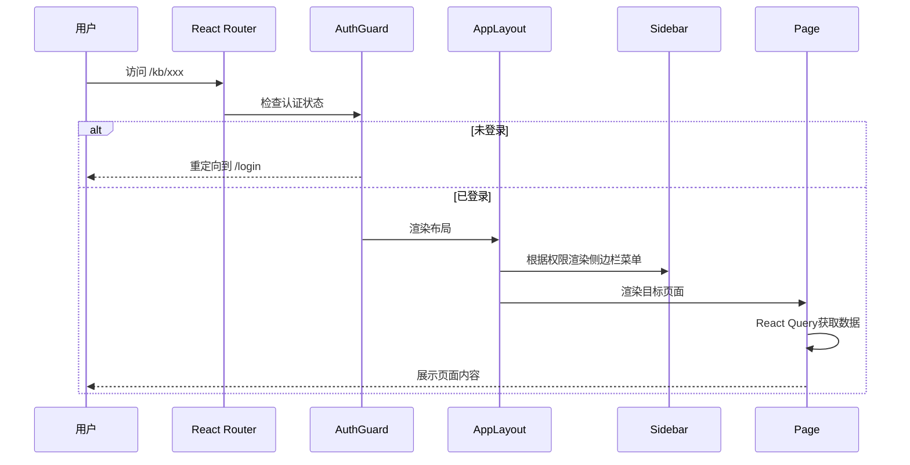

---

## 3. 知识库管理模块

### 3.1 知识库列表页

#### 页面布局

```
┌─────────────────────────────────────────────────────────────────┐
│ 知识库管理                    [🗑 回收站]      [+ 创建知识库]  │
├─────────────────────────────────────────────────────────────────┤
│ [搜索知识库...]  [状态▼] [排序▼]                📊视图切换     │
├─────────────────────────────────────────────────────────────────┤
│ ┌──────────┐ ┌──────────┐ ┌──────────┐ ┌──────────┐          │
│ │ 📚 法务  │ │ 📊 财务  │ │ 🔬 研发  │ │ 📋 合规  │          │
│ │ 合同知识库│ │ 报告知识库│ │ 文档知识库│ │ 政策知识库│          │
│ │          │ │          │ │          │ │          │          │
│ │ 156 文档 │ │ 89 文档  │ │ 234 文档 │ │ 45 文档  │          │
│ │ 12,840块 │ │ 6,230块  │ │ 18,500块 │ │ 3,200块  │          │
│ │          │ │          │ │          │ │          │          │
│ │ ● 活跃   │ │ ● 索引中 │ │ ● 活跃   │ │ ● 活跃   │          │
│ │ 更新2小时前│ │ 更新5分钟前│ │ 更新1天前│ │ 更新3天前│          │
│ │ [⋮ 更多] │ │ [⋮ 更多] │ │ [⋮ 更多] │ │ [⋮ 更多] │          │
│ └──────────┘ └──────────┘ └──────────┘ └──────────┘          │
│                                                                 │
│ ┌──────────┐ ┌──────────┐                                     │
│ │ 📖 培训  │ │ 🏗️ 产品  │   ...                              │
│ │ 材料知识库│ │ 手册知识库│                                     │
│ │ ...      │ │ ...      │                                     │
│ └──────────┘ └──────────┘                                     │
├─────────────────────────────────────────────────────────────────┤
│                       < 1 2 3 ... 8 >                          │
└─────────────────────────────────────────────────────────────────┘
```

#### 创建/编辑知识库对话框

```
┌─────────────────────────────────────────┐
│ 创建知识库                          [×] │
├─────────────────────────────────────────┤
│                                         │
│  知识库名称 *                           │
│  ┌─────────────────────────────────┐   │
│  │ 输入知识库名称（2-50字符）       │   │
│  └─────────────────────────────────┘   │
│                                         │
│  描述                                   │
│  ┌─────────────────────────────────┐   │
│  │ 输入描述（选填，最多200字符）    │   │
│  └─────────────────────────────────┘   │
│                                         │
│  默认语言        默认分块策略            │
│  [中文 ▼]       [通用分块 ▼]           │
│                                         │
│  嵌入模型        LLM模型                │
│  [BGE-M3 ▼]     [DeepSeek-v4 ▼]       │
│                                         │
│  Reranker模型                           │
│  [BGE-Reranker-v2-m3 ▼]               │
│                                         │
│         [取消]  [创建]                  │
└─────────────────────────────────────────┘
```

#### 关键交互流程

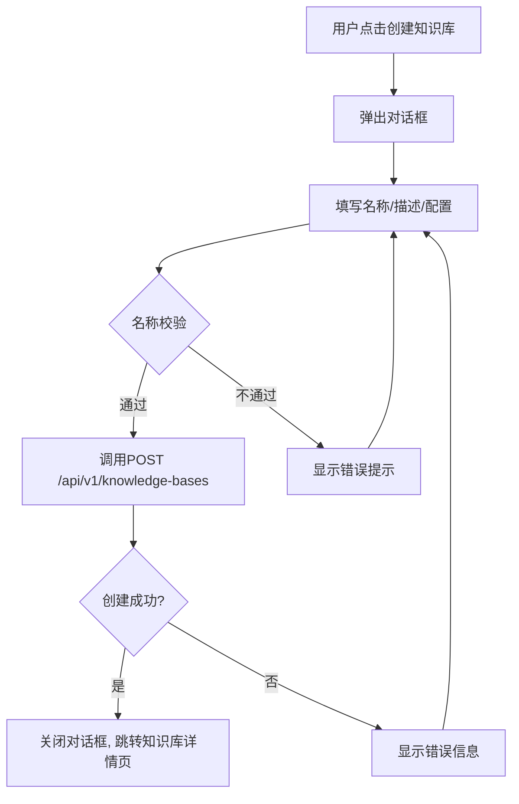

#### 状态管理设计

```typescript
// src/stores/useKBStore.ts
interface KBState {
  kbList: KnowledgeBase[];
  total: number;
  loading: boolean;
  currentKB: KnowledgeBase | null;
  // Actions由React Query管理，Store仅保存UI状态
  setCurrentKB: (kb: KnowledgeBase | null) => void;
}
```

#### API调用映射

| 操作 | 方法 | API端点 | React Query Key |
|------|------|---------|-----------------|
| 获取列表 | GET | `/api/v1/knowledge-bases` | `['kb-list', {page, pageSize, status, search}]` |
| 创建知识库 | POST | `/api/v1/knowledge-bases` | invalidate `['kb-list']` |
| 获取详情 | GET | `/api/v1/knowledge-bases/{kb_id}` | `['kb-detail', kbId]` |
| 更新知识库 | PUT | `/api/v1/knowledge-bases/{kb_id}` | invalidate `['kb-detail', kbId]` |
| 删除知识库 | DELETE | `/api/v1/knowledge-bases/{kb_id}` | invalidate `['kb-list']` |
| 获取统计 | GET | `/api/v1/knowledge-bases/{kb_id}/stats` | `['kb-stats', kbId, period]` |

---

### 3.2 知识库详情页

> v1.3 起采用 **左侧子导航 + 右侧内容区**（对齐 RAGFlow Dataset，见 §10.3）。概览为默认页；Wiki / PageIndex 通过侧栏独立 Hub 入口进入。

#### 页面布局（概览，默认 `/kb/:kbId`）

```
┌──────────────────────────────────────────────────────────────────────────┐
│ ← 知识库列表  法务合同知识库                              [⋮ 更多操作]  │
├──────────────┬───────────────────────────────────────────────────────────┤
│ 知识库菜单   │  概览                                                     │
│              │                                                           │
│ ● 概览       │  ┌────────┐ ┌────────┐ ┌────────┐ ┌────────┐          │
│   文件       │  │ 📄 156 │ │ 📦12,840│ │ 💾500MB│ │ ⭐ 92.5│          │
│   检索测试   │  │ 文档   │ │ Chunk  │ │ 存储   │ │ 解析质量│          │
│   索引状态   │  └────────┘ └────────┘ └────────┘ └────────┘          │
│   PageIndex  │                                                           │
│   知识图谱   │  RAG 3.0 增强索引快捷卡片                                 │
│   Wiki       │  ┌──────────────────────┐ ┌──────────────────────┐      │
│   数据源     │  │ 🌳 PageIndex  85/156 │ │ 📖 Wiki  12/42 页    │      │
│   配置       │  │ 建树率 54.5% 失败 12 │ │ 待审核 3  编译中 2   │      │
│   权限       │  │ [进入 PageIndex →]   │ │ [进入 Wiki →]        │      │
│   日志       │  └──────────────────────┘ └──────────────────────┘      │
│              │                                                           │
│              │  近30天查询趋势              最近上传 / 高频查询           │
└──────────────┴───────────────────────────────────────────────────────────┘
```

**侧栏菜单完整列表**：见 §10.3.1。

---

### 3.3 文档管理页

> **布局约定**：继承 §10.3.1 `KBDetailLayout`，左侧子导航高亮「文件」。

#### 3.3.1 完整布局（KBDetailLayout + 文件页）

全局侧栏 + 知识库子导航 + 右侧内容区三栏合一，供实现时对照 `KBDetailLayout.tsx` / `KBSubNav.tsx`。

```
┌──────────────────────────────────────────────────────────────────────────┐
│ TopBar  [🔍 全局搜索...]                          [通知] [帮助] [用户▼] │
├────────┬──────────────┬──────────────────────────────────────────────────┤
│ ● 首页 │ 知识库菜单   │  Breadcrumb: 法务合同知识库 > 文档管理           │
│   知识库│              ├──────────────────────────────────────────────────┤
│   对话 │   概览       │  [+ 上传] [🔗 URL 导入] [导出任务 →]              │
│   搜索 │ ● 文件       │  ─────────────────────────────────────────────  │
│   Agent│   检索测试   │  ┌──────────────────────────────────────────┐  │
│   评测 │   索引状态   │  │  📂 拖拽文件至此处，或点击选择文件        │  │
│   系统 │   PageIndex  │  │  支持 16+ 格式，单文件 ≤100MB            │  │
│        │   知识图谱   │  └──────────────────────────────────────────┘  │
│        │   Wiki       │  上传队列 (2/5)  合同.pdf [暂停]  表.xlsx [暂停] │
│        │   数据源     │  ─────────────────────────────────────────────  │
│        │   配置       │  [搜索文档...] [类型▼] [状态▼]    [批量操作▼]  │
│        │   权限       │  ☐ 供应商合同V5.pdf  2.3MB  PDF  ✅已解析  96 ⋮ │
│        │   日志       │  ☐ 合规审查报告.pdf  5.0MB  PDF  ✅已解析  94 ⋮ │
│        │              │  ☐ 采购协议.docx     1.0MB  DOCX 🔄解析中   -- ⋮ │
│        │              │                    < 1 2 3 ... 8 >  （虚拟滚动）│
└────────┴──────────────┴──────────────────────────────────────────────────┘
```

**要点**：侧栏高亮「文件」；`[导出任务 →]` 跳转 `/kb/:kbId/export`（非侧栏项，见 §10.3）；文档列表 >100 项启用 §8.2 虚拟滚动。

#### 3.3.2 右侧内容区详图

```
┌─────────────────────────────────────────────────────────────────┐
│ 法务合同知识库 > 文档管理                       [+ 上传] [🔗URL] │
├─────────────────────────────────────────────────────────────────┤
│ ┌─────────────────────────────────────────────────────────────┐ │
│ │                                                             │ │
│ │         📂 拖拽文件至此处，或点击选择文件                    │ │
│ │                                                             │ │
│ │    支持 PDF/DOCX/PPTX/XLSX/CSV/TXT/MD/HTML 等16+格式      │ │
│ │    单文件上限 100MB，批量上传最多100个                       │ │
│ │                                                             │ │
│ └─────────────────────────────────────────────────────────────┘ │
├─────────────────────────────────────────────────────────────────┤
│ 上传队列 (3/5) ──────────────────────────── [清空已完成]       │
│ ┌──────────────────┬──────────┬──────────┬─────────┐          │
│ │ 文件名           │ 大小     │ 进度     │ 状态    │          │
│ ├──────────────────┼──────────┼──────────┼─────────┤          │
│ │ 合同模板V6.pdf   │ 2.3MB    │ ████████ │ ✅完成  │          │
│ │ 审计报告.pdf     │ 5.0MB    │ ████░░░░ │ 🔄解析中│ [暂停]   │
│ │ 数据表.xlsx      │ 1.2MB    │ ██░░░░░░ │ ⬆上传中 │ [暂停]   │
│ └──────────────────┴──────────┴──────────┴─────────┘          │
├─────────────────────────────────────────────────────────────────┤
│ 文档行操作（⋮ 菜单）: [暂停解析] [恢复解析] [重新分块] [删除]   │
├─────────────────────────────────────────────────────────────────┤
│ [搜索文档...]  [类型▼] [状态▼] [标签▼]       [批量操作▼]      │
├─────────────────────────────────────────────────────────────────┤
│ ☐ │ 📄 供应商合同模板V5.pdf │ 2.3MB │ PDF │ ✅已解析 │ 96分 │ ⋮│
│ ☐ │ 📄 2024合规审查报告.pdf │ 5.0MB │ PDF │ ✅已解析 │ 94分 │ ⋮│
│ ☐ │ 📄 采购协议条款.docx   │ 1.0MB │ DOCX│ 🔄解析中 │  --  │ ⋮│
│ ☐ │ 📊 财务数据Q2.xlsx     │ 0.8MB │ XLSX│ ❌失败   │  --  │ ⋮│
├─────────────────────────────────────────────────────────────────┤
│                       < 1 2 3 ... 8 >                          │
└─────────────────────────────────────────────────────────────────┘
```

#### 上传组件交互流程

```mermaid
flowchart TD
    A[拖拽/选择文件] --> B{文件校验}
    B -->|格式不支持| C[提示错误: 不支持的格式]
    B -->|文件过大| D[提示错误: 文件超过100MB]
    B -->|校验通过| E[tus-js-client分片上传]
    E --> F{上传进度}
    F -->|上传中| G[显示进度条]
    F -->|上传完成| H[调用POST /api/v1/knowledge-bases/{kbId}/documents]
    H --> I{后端返回}
    I -->|成功| J[状态变为"解析中", 轮询解析状态]
    I -->|失败| K[显示错误+重试按钮]
    J --> L{轮询解析状态}
    L -->|parsing| M[显示解析进度]
    L -->|parsed| N[状态变为"已解析", 显示质量评分]
    L -->|failed| O[状态变为"失败", 显示错误原因+重新解析按钮]

    P[点击上传队列暂停] --> Q[POST upload-queue/{task_id}/pause]
    Q --> R[队列项状态→已暂停, tus 暂停分片]
    R --> S[点击恢复] --> T[POST upload-queue/{task_id}/resume]

    U[点击解析暂停] --> V[POST documents/{doc_id}/parse/pause]
    V --> W[文档状态→解析已暂停]
    W --> X[点击恢复解析] --> Y[POST documents/{doc_id}/parse/resume]
```

#### API调用映射

| 操作 | 方法 | API端点 | 说明 |
|------|------|---------|------|
| 上传文档 | POST | `/api/v1/knowledge-bases/{kb_id}/documents` | multipart/form-data |
| URL导入 | POST | `/api/v1/knowledge-bases/{kb_id}/documents/import` | JSON |
| 上传队列列表 | GET | `/api/v1/knowledge-bases/{kb_id}/upload-queue` | 含进度、预计完成时间 |
| 暂停上传 | POST | `/api/v1/knowledge-bases/{kb_id}/upload-queue/{task_id}/pause` | tus 客户端同步 pause |
| 恢复上传 | POST | `/api/v1/knowledge-bases/{kb_id}/upload-queue/{task_id}/resume` | 从断点续传 |
| 清空已完成 | DELETE | `/api/v1/knowledge-bases/{kb_id}/upload-queue/completed` | 批量清理 |
| 文档列表 | GET | `/api/v1/knowledge-bases/{kb_id}/documents` | 分页+筛选+搜索（US-1.6） |
| 文档详情 | GET | `/api/v1/knowledge-bases/{kb_id}/documents/{doc_id}` | 含版本历史 |
| 删除文档 | DELETE | `/api/v1/knowledge-bases/{kb_id}/documents/{doc_id}` | 软删除 |
| 重新解析 | POST | `/api/v1/knowledge-bases/{kb_id}/documents/{doc_id}/reparse` | 覆盖解析器 |
| 暂停解析 | POST | `/api/v1/knowledge-bases/{kb_id}/documents/{doc_id}/parse/pause` | US-1.2 |
| 恢复解析 | POST | `/api/v1/knowledge-bases/{kb_id}/documents/{doc_id}/parse/resume` | US-1.2 |
| 解析状态 | GET | `/api/v1/knowledge-bases/{kb_id}/documents/{doc_id}/status` | 轮询 |
| 分块预览 | GET | `/api/v1/knowledge-bases/{kb_id}/documents/{doc_id}/chunks` | 分页 |
| 文档搜索（US-1.6） | GET | `/api/v1/knowledge-bases/{kb_id}/documents/search` | `q` 模糊/全文；服务端分页 |
| 批量打标签 | POST | `/api/v1/knowledge-bases/{kb_id}/documents/batch/tags` | 批量操作 |
| 批量移动 | POST | `/api/v1/knowledge-bases/{kb_id}/documents/batch/move` | 目标 `kb_id` |
| 批量删除 | POST | `/api/v1/knowledge-bases/{kb_id}/documents/batch/delete` | 软删除 |

#### 3.3.3 文档搜索与大规模性能（US-1.6）

知识库文件页的 `[搜索文档...]` 为**管理后台精确搜索**（非对话式检索），10 万文档规模下 P95 响应 <500ms。

**搜索能力**：

| 维度 | UI 控件 | 查询参数 |
|------|---------|---------|
| 文档名称 | 搜索框（debounce 300ms） | `q` |
| 文档类型 | `[类型▼]` | `file_type` |
| 上传时间 | DateRangePicker | `uploaded_from` / `uploaded_to` |
| 标签 | `[标签▼]` 多选 | `tags[]` |
| 上传者 | `[上传者▼]` | `uploaded_by` |
| 全文内容 | `[✓] 搜索正文` 开关 | `search_content=true` |

**性能策略**（与 §8.2 / §8.3 / §8.4 联动）：

```typescript
// 文档列表 — 服务端分页 + 虚拟滚动，禁止一次拉取全量
const { data } = useQuery({
  queryKey: queryKeys.kb.docs(kbId, { page, page_size: 50, ...filters }),
  queryFn: () => docService.search(kbId, { page, page_size: 50, ...filters }),
  staleTime: CACHE_CONFIG.docList.staleTime,
});

// >100 条时使用 react-window（§8.2），行高 80px
// 搜索框 useDebouncedValue(300ms)；仅 debounce 后发起请求
// 后端 ES/MySQL 全文索引；前端不本地 filter 10 万行
```

**批量操作**：勾选行 → `[批量操作▼]` → 打标签 / 移动到其他库 / 删除；操作后 `invalidate` `queryKeys.kb.docs`。

---

### 3.4 解析预览页

> **布局约定**：全屏三栏工作区，面包屑返回文档列表；可折叠 §10.3.1 左侧子导航。

#### 三栏布局

```
┌───────────┬──────────────────────────────┬──────────────────┐
│ 📑 目录   │  📄 文档渲染                 │  📊 结构化数据    │
│           │                              │                  │
│ ▸ 第一条  │  ┌────────────────────────┐  │  {               │
│   定义    │  │ 第一条 定义              │  │    "type": "h1", │
│ ▸ 第二条  │  │                        │  │    "text": "...",│
│   权利    │  │ 1.1 "供应商"系指...     │  │    "page": 1,    │
│ ▸ 第五条  │  │ ┌───┬───────┬───────┐ │  │    "bbox": []   │
│   违约责任│  │ │序号│ 条款  │ 金额  │ │  │  },             │
│   └5.1    │  │ ├───┼───────┼───────┤ │  │  {               │
│   └5.2    │  │ │ 1 │ 延迟  │ 0.5%  │ │  │    "type":"table"│
│ ▸ 第八条  │  │ │ 2 │ 不合规│ 赔偿  │ │  │    "rows": [...] │
│   保密    │  │ └───┴───────┴───────┘ │  │  }               │
│           │  │                        │  │                  │
│           │  │ [蓝色框=OCR标注区域]    │  │  [JSON/表格切换] │
│           │  └────────────────────────┘  │                  │
│           │                              │                  │
│ [质量96分]│  [原始 ↔ 解析 对比]          │  [复制] [下载]   │
└───────────┴──────────────────────────────┴──────────────────┘
```

#### 关键交互

- 左侧目录点击 → 中间渲染区跳转到对应章节+页码
- OCR标注区域 → 鼠标悬停显示识别文本值
- 表格区域 → 支持原始扫描件与解析结果的对比高亮
- 质量评分 < 80 → 标黄预警；< 60 → 标红+标记待人工复核
- 布局识别标签（10种）用不同颜色：标题=蓝、正文=灰、表格=绿、图表=橙...

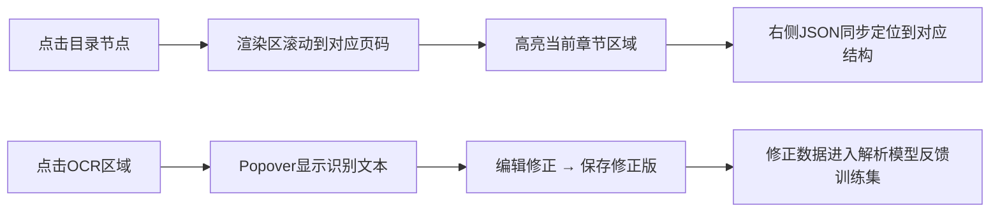

---

### 3.5 分块预览页

> **布局约定**：同 §3.4，继承 `KBDetailLayout` 面包屑，侧栏可折叠。

#### 页面布局

```
┌─────────────────────────────────────────────────────────────────┐
│ 供应商合同模板V5.pdf > 分块预览                    [重新分块]   │
├─────────────────────────────────────────────────────────────────┤
│ 分块策略: [通用▼]  Chunk大小: [512▼]  重叠: [128▼]            │
│ 统计: 85块 | 平均487 Token | 最大512 | 最小128 | 重叠率 84%    │
├─────────────────────────────────────────────────────────────────┤
│ [按类型▼] [Token范围▼]                                          │
├─────────────────────────────────────────────────────────────────┤
│ ┌─────────────────────────────────────────────────────────┐    │
│ │ #0  第一条 定义                    模板分块 │ 512 Token│    │
│ │ "第一条 定义 1.1 供应商系指根据本合同约定向采购方..."   │    │
│ │ 页码: 1  │  📄文本  │  🔒internal  │  [拆分] [排除]   │    │
│ └─────────────────────────────────────────────────────────┘    │
│ ┌─────────────────────────────────────────────────────────┐    │
│ │ #1  第二条 权利义务                模板分块 │ 508 Token│    │
│ │ "第二条 权利义务 2.1 采购方有权对供应商提供的货物..." │    │
│ │ 页码: 1-2 │ 📄文本 │ 🔒internal │ [合并↓] [拆分] [排除]│    │
│ └─────────────────────────────────────────────────────────┘    │
│ ┌─────────────────────────────────────────────────────────┐    │
│ │ #4  违约金计算表                    表格分块 │ 256 Token│    │
│ │ ┌──────┬──────────┬──────┐                              │    │
│ │ │ 类型 │ 计算标准  │ 上限 │                              │    │
│ │ ├──────┼──────────┼──────┤                              │    │
│ │ │ 延迟 │ 日0.5%   │ 20% │                              │    │
│ │ └──────┴──────────┴──────┘                              │    │
│ │ 页码: 3 │ 📊表格 │ 🔒internal │ [编辑] [排除]         │    │
│ └─────────────────────────────────────────────────────────┘    │
│ ...                                                             │
└─────────────────────────────────────────────────────────────────┘
```

#### 交互流程

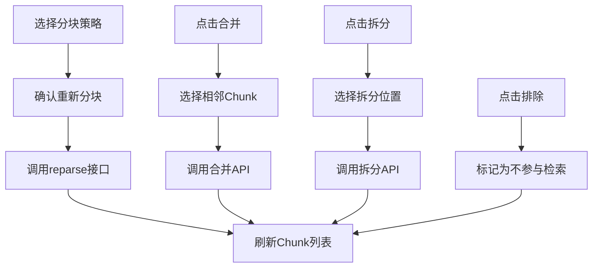

#### 3.5.1 相邻 Chunk 重叠高亮（US-1.4）

选中 Chunk `#N` 时，与 `#N-1` / `#N+1` 的**重叠 Token 区间**在卡片内以浅黄底高亮，便于核对分块边界。

```
┌─ Chunk #1 ─────────────────────────────────────────┐
│ ...采购方有权对供应商提供的货物进行检验。           │
│ ░░░重叠区░░░（与 #2 共享 128 tokens）              │
└────────────────────────────────────────────────────┘
┌─ Chunk #2 ─────────────────────────────────────────┐
│ ░░░重叠区░░░ 2.1 采购方有权...                      │
│ ...其余正文...                                      │
└────────────────────────────────────────────────────┘
```

**实现**：`ChunkPreviewCard` 接收 `overlapPrev?: number` / `overlapNext?: number`（来自 API `chunks[].overlap_tokens`）；`onSelectChunk(id)` 联动高亮相邻卡片重叠段。合并 Chunk 后重新计算重叠率统计行。

---

### 3.6 索引状态页

> **布局约定**：继承 §10.3.1，侧栏高亮「索引状态」。

#### 五列索引状态卡片

```
┌─────────────────────────────────────────────────────────────────┐
│ 法务合同知识库 > 索引状态                     [全部重建索引]   │
├─────────────────────────────────────────────────────────────────┤
│                                                                 │
│  ┌──────────┐ ┌──────────┐ ┌──────────┐ ┌──────────┐ ┌──────┐│
│  │ 🔢向量   │ │ 📝全文   │ │ 🌳PageIdx│ │ 🔗图谱   │ │ 📖Wiki││
│  │ 索引     │ │ 索引     │ │ 树索引   │ │ 索引     │ │ 编译 ││
│  │          │ │          │ │          │ │          │ │      ││
│  │ 154/156  │ │ 156/156  │ │ 85/156   │ │ 42/156   │ │12/42 ││
│  │ ██████░░ │ │ ████████ │ │ ████░░░░ │ │ ██░░░░░░ │ │█░░░░ ││
│  │ 98.7%    │ │ 100%     │ │ 54.5%    │ │ 26.9%    │ │28.6% ││
│  │          │ │          │ │          │ │          │ │      ││
│  │ 健康度98 │ │ 健康度100│ │ 健康度85 │ │ 健康度72 │ │健康60││
│  │ ⏱2min前 │ │ ⏱5min前 │ │ ⏱1h前   │ │ ⏱3h前   │ │⏱1d前││
│  │          │ │          │ │          │ │          │ │      ││
│  │ [重试2]  │ │          │ │[管理→]  │ │[暂停/恢复]│ │[管理→]││
│  │          │ │          │ │[重试12] │ │          │ │[编译] ││
│  └──────────┘ └──────────┘ └──────────┘ └──────────┘ └──────┘│
│  [管理→] PageIndex → /kb/:kbId/pageindex                      │
│  [管理→] Wiki      → /kb/:kbId/wiki                           │
│                                                                 │
│  失败文档列表                                                  │
│  ┌──────────────────────────────────────────────────────────┐  │
│  │ 📄 复杂表格报告.pdf │ 向量索引 │ 嵌入超时 │ [重试] [跳过]│  │
│  │ 📄 扫描件合同.pdf   │ PageIndex│ LLM超时  │ [重试] [跳过]│  │
│  └──────────────────────────────────────────────────────────┘  │
│                                                                 │
└─────────────────────────────────────────────────────────────────┘
```

#### 索引状态数据流

```typescript
// 索引状态轮询 Hook
function useIndexStatus(kbId: string) {
  return useQuery({
    queryKey: ['kb-index-status', kbId],
    queryFn: () => api.get(`/api/v1/knowledge-bases/${kbId}/stats`).then(r => r.data),
    refetchInterval: (data) => {
      // 有正在进行的索引任务时5秒轮询，否则30秒
      const hasRunning = data?.index_statuses?.some(s => s.status === 'running');
      return hasRunning ? 5000 : 30000;
    },
  });
}
```

#### 索引暂停/恢复（US-1.5）

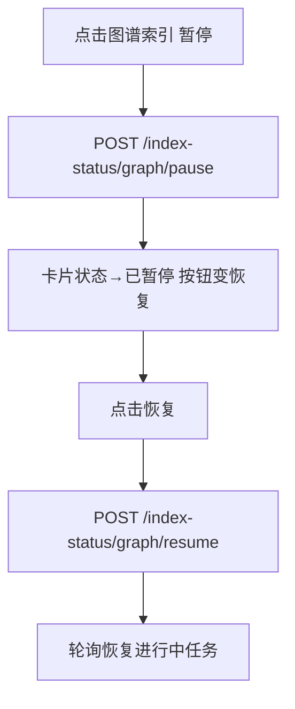

| 操作 | 方法 | API 端点 |
|------|------|---------|
| 暂停索引 | POST | `/api/v1/knowledge-bases/{kb_id}/index-status/{type}/pause` |
| 恢复索引 | POST | `/api/v1/knowledge-bases/{kb_id}/index-status/{type}/resume` |
| 单文档重试 | POST | `/api/v1/knowledge-bases/{kb_id}/index-status/retry` |

`{type}`: `vector` | `fulltext` | `pageindex` | `graph` | `wiki`

#### 与 Hub 页的联动

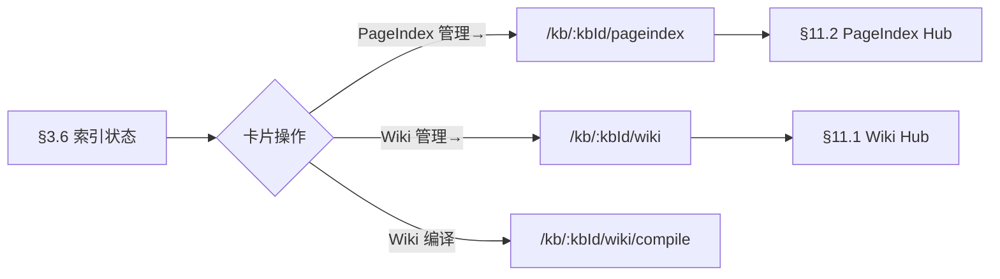

---

### 3.7 回收站（US-1.8）

#### 页面布局

```
┌─────────────────────────────────────────────────────────────────┐
│ 知识库管理 > 回收站                    [清空回收站] [批量恢复]  │
├─────────────────────────────────────────────────────────────────┤
│ 🔍 搜索...  [类型▼ 全部/知识库/文档]  [删除时间▼]             │
├─────────────────────────────────────────────────────────────────┤
│ ☐ │ 名称              │ 类型   │ 原属知识库 │ 删除时间 │ 剩余 │
│───┼───────────────────┼────────┼────────────┼──────────┼──────│
│ ☐ │ 供应商合同V4.pdf  │ 文档   │ 法务合同   │ 6/4 14:20│ 28天 │
│ ☐ │ 旧版合规政策库    │ 知识库 │ —          │ 6/2 09:15│ 26天 │
│ ☐ │ 财务Q1报告.docx   │ 文档   │ 财务报告   │ 5/28     │ 22天 │
├─────────────────────────────────────────────────────────────────┤
│ 已选 0 项                              [恢复] [永久删除]       │
│ 提示：回收站内容保留 30 天，到期自动永久删除                  │
└─────────────────────────────────────────────────────────────────┘
```

#### 交互流程

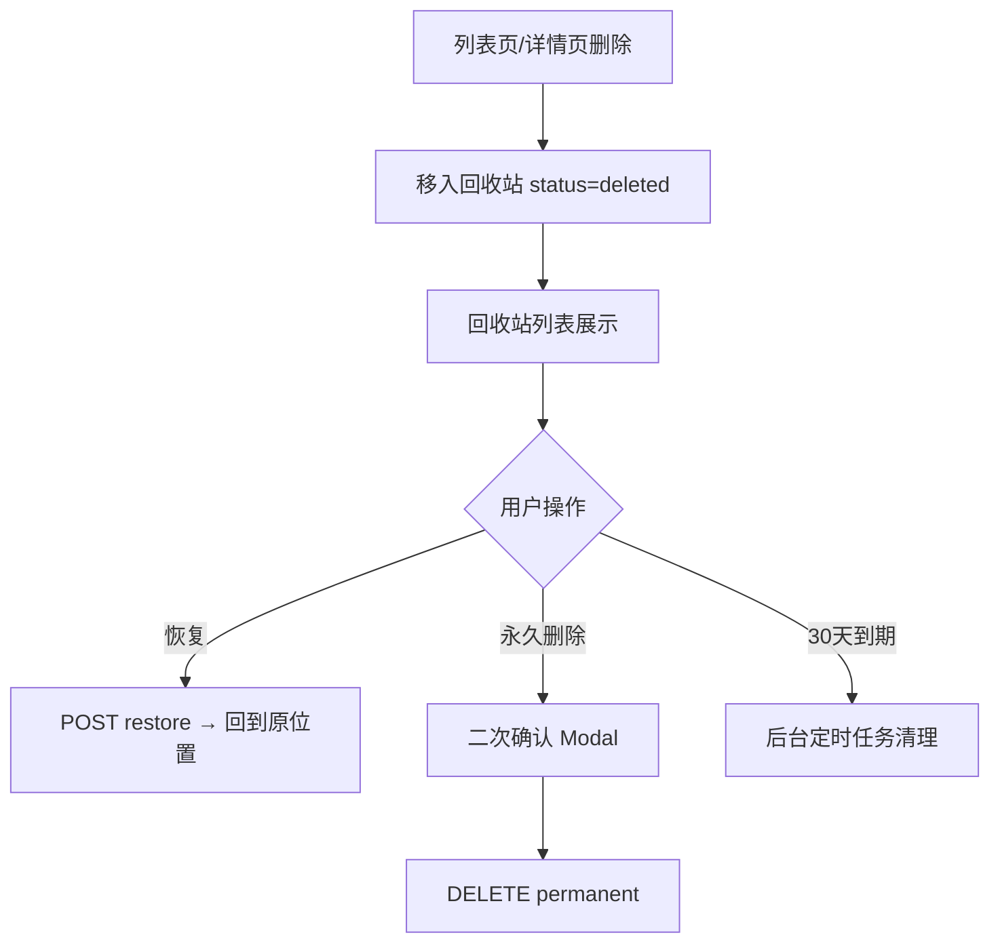

#### API 映射

| 操作 | 方法 | API 端点 |
|------|------|---------|
| 回收站列表 | GET | `/api/v1/recycle-bin` |
| 恢复 | POST | `/api/v1/recycle-bin/{id}/restore` |
| 永久删除 | DELETE | `/api/v1/recycle-bin/{id}` |
| 清空 | DELETE | `/api/v1/recycle-bin` |

---

### 3.8 导出任务（US-1.7）

#### 页面布局

```
┌─────────────────────────────────────────────────────────────────┐
│ 法务合同知识库 > 导出任务                      [+ 新建导出]    │
├─────────────────────────────────────────────────────────────────┤
│ 任务列表                                                        │
│ ┌──────────────────────────────────────────────────────────┐   │
│ │ 📦 全库 Chunk 导出        │ 进行中 ████░░ 68% │ [取消]  │   │
│ │ 格式: JSONL │ 范围: 全部文档 │ 发起: 李婷 6/6 10:00     │   │
│ └──────────────────────────────────────────────────────────┘   │
│ ┌──────────────────────────────────────────────────────────┐   │
│ │ 📦 Wiki 页面导出          │ ✅ 已完成         │ [下载]    │   │
│ │ 格式: Markdown │ 1,240 页 │ 大小: 86MB │ 6/5 16:30      │   │
│ └──────────────────────────────────────────────────────────┘   │
└─────────────────────────────────────────────────────────────────┘

新建导出对话框：
┌─────────────────────────────────────────┐
│ 新建导出任务                        [×] │
├─────────────────────────────────────────┤
│ 导出范围: ○ 全部文档  ○ 选中文档       │
│ 导出内容: ☑ Chunk  ☑ 元数据  ☐ Wiki    │
│ 文件格式: [JSONL ▼]  (JSONL/CSV/MD)    │
│ 压缩:     [✓] ZIP                        │
│         [取消]  [开始导出]              │
└─────────────────────────────────────────┘
```

#### API 映射

| 操作 | 方法 | API 端点 |
|------|------|---------|
| 创建导出 | POST | `/api/v1/knowledge-bases/{kb_id}/export` |
| 任务列表 | GET | `/api/v1/knowledge-bases/{kb_id}/export/tasks` |
| 下载 | GET | `/api/v1/export/tasks/{task_id}/download` |

---

### 3.9 文档版本历史（US-1.12）

#### 页面布局（侧栏抽屉）

```
┌─────────────────────────────────────────────────────────────────┐
│ 供应商合同V5.pdf                              [版本历史 ▼]   │
├──────────────────────────────────┬──────────────────────────────┤
│ 当前文档预览区                   │  版本历史                    │
│                                  │                              │
│  （PDF/解析预览）                 │  v3  6/6 09:00  李婷  [当前] │
│                                  │      变更: 更新第五条违约金  │
│                                  │      [对比] [回滚]           │
│                                  │  v2  6/1 14:20  王强         │
│                                  │      变更: 新增附件A         │
│                                  │      [对比] [回滚]           │
│                                  │  v1  5/28 10:00 系统导入     │
│                                  │      [查看]                  │
└──────────────────────────────────┴──────────────────────────────┘

版本对比视图：
┌─────────────────────────────────────────────────────────────────┐
│ 版本对比: v2 ↔ v3                              [关闭对比]     │
├──────────────────────────┬──────────────────────────────────────┤
│ v2 第五条（旧）          │ v3 第五条（新）                      │
│ 违约金 0.3%/日           │ 违约金 0.5%/日  ← 高亮差异          │
└──────────────────────────┴──────────────────────────────────────┘
```

#### API 映射

| 操作 | 方法 | API 端点 |
|------|------|---------|
| 版本列表 | GET | `/api/v1/documents/{doc_id}/versions` |
| 版本对比 | GET | `/api/v1/documents/{doc_id}/versions/diff` |
| 回滚 | POST | `/api/v1/documents/{doc_id}/versions/{ver}/rollback` |

---

### 3.10 知识库权限页（/kb/:kbId/permissions）

> **布局约定**：继承 §10.3.1，侧栏高亮「权限」。团队权限 + Chunk ACL + ACL 模拟器入口。

#### 页面布局

```
┌─────────────────────────────────────────────────────────────────┐
│ 法务合同知识库 > 权限管理                                       │
├─────────────────────────────────────────────────────────────────┤
│ ── 团队可见性（RAGFlow permission）──                           │
│ 可见范围: ● 仅自己(me)  ○ 团队(team)              [保存]      │
│                                                                 │
│ ── Chunk 级 ACL 规则 ──                         [+ 添加规则]   │
│ ┌──────────────────────────────────────────────────────────┐   │
│ │ #1 高管可看全部  角色=executive  read  条件: 全部密级     │   │
│ │ #2 财务分析师    角色=finance   read  条件: !=restricted │   │
│ │ #3 实习生        角色=intern    read  条件: ==public    │   │
│ └──────────────────────────────────────────────────────────┘   │
│                                                                 │
│ ── ACL 效果验证 ──                                              │
│ [打开 ACL 模拟器 →]  /system/security/acl-simulator?kbId=xxx  │
└─────────────────────────────────────────────────────────────────┘
```

#### API 映射

| 操作 | 方法 | API 端点 |
|------|------|---------|
| 获取权限 | GET | `/api/v1/knowledge-bases/{kb_id}/permissions` |
| 更新团队可见性 | PUT | `/api/v1/knowledge-bases/{kb_id}/permissions/visibility` |
| ACL 规则列表 | GET | `/api/v1/knowledge-bases/{kb_id}/acl` |
| 设置 ACL | POST | `/api/v1/knowledge-bases/{kb_id}/acl` |

---

### 3.11 媒体文件预览层（US-1.11）

> 图片类文档（PNG/JPG/TIFF/BMP）在 §3.4 解析预览基础上叠加**媒体预览层**；`picture` 分块方法见 §7.10 / §10.4。

#### 页面布局（解析预览 + 媒体层）

```
┌───────────┬──────────────────────────────┬──────────────────┐
│ 缩略图    │  图像画布                     │  OCR / 元数据     │
│ 导航      │  ┌────────────────────────┐  │                  │
│ [1][2][3] │  │  [扫描件图表.png]       │  │  Alt 文本:       │
│           │  │  ┌──── OCR 叠加层 ────┐ │  │  「Q2营收柱状图」│
│           │  │  │ 营收  ████ 1.2亿   │ │  │                  │
│           │  │  └────────────────────┘ │  │  自动标签:       │
│           │  │  [显示OCR层 ✓] [原图]   │  │  #图表 #财务     │
│           │  └────────────────────────┘  │  多模态描述:     │
│           │  缩放 100%  旋转  全屏       │  「包含三组柱状…」│
└───────────┴──────────────────────────────┴──────────────────┘
```

#### 关键交互

- `[显示OCR层]` 开关：叠加半透明 bbox + 识别文本（默认开）
- 悬停 bbox → Popover 显示置信度与可编辑 OCR 文本（修正后 `POST .../corrections`）
- 多模态检索标签展示在右侧，供管理端核对（查询侧见 §4.1 多模态通道）
- 画廊模式：文档列表中图片类型显示缩略图列，点击进 §3.4 媒体层

#### API 映射

| 操作 | 方法 | API 端点 |
|------|------|---------|
| 图像预览 | GET | `/api/v1/knowledge-bases/{kb_id}/documents/{doc_id}/preview/image` |
| OCR 层数据 | GET | `/api/v1/knowledge-bases/{kb_id}/documents/{doc_id}/ocr-regions` |
| 保存 OCR 修正 | POST | `/api/v1/knowledge-bases/{kb_id}/documents/{doc_id}/corrections` |
| 生成 Alt/标签 | POST | `/api/v1/knowledge-bases/{kb_id}/documents/{doc_id}/image-caption` |

**组件**：`MediaPreviewLayer`（§7.25）— 封装画布缩放、OCR 叠加、图层开关。

---

## 4. 智能对话模块

### 4.1 对话界面

#### 整体布局（ChatGPT风格）

```
┌──────────────┬──────────────────────────────────────────────────┐
│ 💬 对话历史  │  法务合同知识库                                   │
│              │                                                  │
│ [+ 新对话]   │  ┌──────────────────────────────────────────┐   │
│              │  │ 👤 用户                                   │   │
│ 🔍 搜索...  │  │ 供应商延迟交货的违约金如何计算？          │   │
│              │  └──────────────────────────────────────────┘   │
│ ── 今天 ──  │                                                  │
│ 📌 合同违约  │  ┌──────────────────────────────────────────┐   │
│   条款查询   │  │ 🤖 RAG 3.0                               │   │
│ 📌 保密协议  │  │                                          │   │
│   范围确认   │  │ 根据公司标准采购合同模板（V5）第五条...    │   │
│              │  │                                          │   │
│ ── 昨天 ──  │  │ 供应商迟延交货的，每迟延一日应按迟延     │   │
│ 📌 2024年度  │  │ 交付货物价值的千分之五[1]向采购方支付     │   │
│   合规审查   │  │ 违约金。                                  │   │
│ 📌 数据保护  │  │                                          │   │
│   条款       │  │ 迟延超过30日的，采购方有权解除合同[2]。   │   │
│              │  │                                          │   │
│ ── 更早 ──  │  │ ┌──── 引用 [1] ─────────────────────┐    │   │
│ 📌 知识产权  │  │ │ 📄 供应商合同模板V5.pdf  P3       │    │   │
│   归属       │  │ │ 5.1 供应商迟延交货的，每迟延...    │    │   │
│ 📌 竞业限制  │  │ │ 相关度: 95.6%  [查看原文]         │    │   │
│   条款       │  │ └───────────────────────────────────┘    │   │
│              │  │                                          │   │
│              │  │ 📊 置信度: 0.92 (高)  Tier2 │ 页面索引   │   │
│              │  │                                          │   │
│              │  │ ▼ 查询链路 Trace (QueryTraceTimeline)    │   │
│              │  │ L1分类120ms→L2路由45ms→L3检索1.4s→L4精排360ms→L5生成1.1s│
│              │  │                                          │   │
│              │  │ 👍 👎 ✏️纠错                    2.1s    │   │
│              │  └──────────────────────────────────────────┘   │
│              │                                                  │
│              │  ┌──────────────────────────────────────────┐   │
│              │  │ 💡 试试这样问：                           │   │
│              │  │  • 供应商违约金上限是多少？[精确化]       │   │
│              │  │  • 对比不同合同的违约条款 [跨文档]        │   │
│              │  └──────────────────────────────────────────┘   │
│              │                                                  │
│              │  ┌──────────────────────────────────────────┐   │
│ [⚙] [📎]    │  │ 输入您的问题... (Enter发送, Shift+Enter换行)│   │
│              │  └──────────────────────────────────────────┘   │
└──────────────┴──────────────────────────────────────────────────┘
```

#### 消息气泡组件设计

```typescript
// 消息类型定义
interface ChatMessage {
  id: string;
  role: 'user' | 'assistant' | 'system';
  content: string;
  citations?: Citation[];
  confidence?: { score: number; level: 'high' | 'medium' | 'low' };
  routingInfo?: {
    tier: string;
    channels: string[];
    model: string;
  };
  feedbackStatus?: 'none' | 'thumbs_up' | 'thumbs_down';
  isStreaming?: boolean;
  createdAt: string;
}

// 用户消息 — 右对齐，蓝色背景
// 系统回答 — 左对齐，灰色背景，含引用卡片+置信度标签
// 引用编号 [1] — 悬停弹出引用卡片，点击跳转原文页码
```

#### 引用溯源交互流程

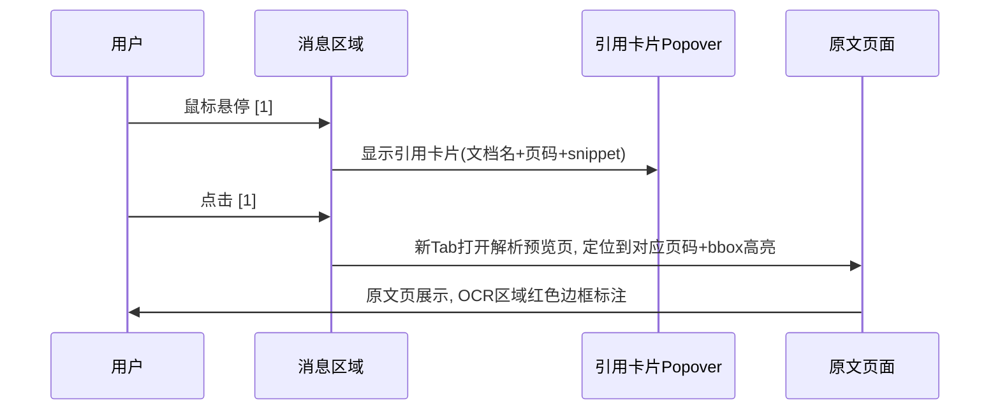

#### 流式输出实现

```typescript
// src/hooks/useSSE.ts — SSE流式连接Hook
import { useEffect, useRef, useCallback } from 'react';

interface SSEOptions {
  onToken: (content: string, index: number) => void;
  onCitation: (citation: Citation) => void;
  onRouting: (info: RoutingInfo) => void;
  onConfidence: (confidence: ConfidenceInfo) => void;
  onDone: (usage: TokenUsage) => void;
  onError: (error: SSEError) => void;
}

export function useSSE() {
  const abortRef = useRef<AbortController | null>(null);

  const startStream = useCallback(async (
    url: string,
    body: Record<string, unknown>,
    options: SSEOptions
  ) => {
    abortRef.current = new AbortController();

    const response = await fetch(url, {
      method: 'POST',
      headers: {
        'Content-Type': 'application/json',
        'Authorization': `Bearer ${getToken()}`,
        'Accept': 'text/event-stream',
      },
      body: JSON.stringify(body),
      signal: abortRef.current.signal,
    });

    const reader = response.body?.getReader();
    const decoder = new TextDecoder();
    let buffer = '';

    while (reader) {
      const { done, value } = await reader.read();
      if (done) break;

      buffer += decoder.decode(value, { stream: true });
      const lines = buffer.split('\n');
      buffer = lines.pop() || '';

      for (const line of lines) {
        if (line.startsWith('event: ')) {
          const eventType = line.slice(7).trim();
          continue;
        }
        if (line.startsWith('data: ')) {
          const data = JSON.parse(line.slice(6));
          switch (data.type || eventType) {
            case 'token': options.onToken(data.content, data.index); break;
            case 'citation': options.onCitation(data); break;
            case 'routing': options.onRouting(data); break;
            case 'confidence': options.onConfidence(data); break;
            case 'done': options.onDone(data); break;
            case 'error': options.onError(data); break;
          }
        }
      }
    }
  }, []);

  const stopStream = useCallback(() => {
    abortRef.current?.abort();
  }, []);

  return { startStream, stopStream };
}
```

#### 对话状态管理

```typescript
// src/stores/useChatStore.ts
interface ChatState {
  conversations: Conversation[];
  currentConvId: string | null;
  messages: Record<string, ChatMessage[]>;  // convId → messages
  isStreaming: boolean;
  streamingMessageId: string | null;

  // Actions
  createConversation: (kbIds: string[]) => Promise<string>;
  sendMessage: (convId: string, content: string) => Promise<void>;
  stopStreaming: () => void;
  submitFeedback: (convId: string, msgId: string, feedback: Feedback) => Promise<void>;
  loadHistory: (convId: string) => Promise<void>;
}
```

#### API调用映射

| 操作 | 方法 | API端点 | 说明 |
|------|------|---------|------|
| 创建对话 | POST | `/api/v1/conversations` | 指定知识库ID |
| 发送消息(非流式) | POST | `/api/v1/conversations/{conv_id}/messages` | stream=false |
| 发送消息(流式) | POST | `/api/v1/conversations/{conv_id}/messages` | stream=true, SSE |
| 获取历史 | GET | `/api/v1/conversations/{conv_id}/messages` | cursor分页 |
| 删除对话 | DELETE | `/api/v1/conversations/{conv_id}` | |
| 消息反馈 | POST | `/api/v1/conversations/{conv_id}/messages/{msg_id}/feedback` | |

---

### 4.2 查询增强面板

#### 面板布局（可展开/收起）

```
┌─────────────────────────────────────────────────────────────────┐
│ 🔍 查询增强面板                                          [收起]│
├─────────────────────────────────────────────────────────────────┤
│                                                                 │
│ 📝 查询重写                                                     │
│ ┌─────────────────────────────────────────────────────────┐    │
│ │ 原始: "那个违约的事情怎么赔"                             │    │
│ │ → 精确化: "供应商合同模板中违约金的条款有哪些？"          │    │
│ │ → 泛化: "供应商违约责任有哪些类型？"                     │    │
│ │ → 跨文档: "对比不同合同中违约金计算标准"                  │    │
│ └─────────────────────────────────────────────────────────┘    │
│                                                                 │
│ 🏷️ 分类器路由                                                   │
│ ┌──────────┐ ┌──────────┐ ┌──────────┐ ┌──────────┐          │
│ │ 复杂度   │ │ 文档类型 │ │ 用户意图 │ │ 安全分级 │          │
│ │ Tier 2   │ │ 财报/PDF │ │ 精确答案 │ │ 内部     │          │
│ │ 中等推理 │ │          │ │          │ │          │          │
│ └──────────┘ └──────────┘ └──────────┘ └──────────┘          │
│                                                                 │
│ 🔀 多通道检索结果                                               │
│ ┌─────────────────────────────────────────────────────────┐    │
│ │ 通道1: PageIndex (主) ████████ Top-5  延迟520ms         │    │
│ │   1. 供应商合同V5 P3 评分1.0                            │    │
│ │   2. 采购协议条款 P8   评分0.95                          │    │
│ │                                                          │    │
│ │ 通道2: 向量检索 (辅) ████████ Top-5  延迟45ms           │    │
│ │   1. 供应商合同V5 P3 评分0.956                           │    │
│ │   2. 采购协议条款 P8   评分0.867                         │    │
│ │                                                          │    │
│ │ 融合: RRF加权 → Top-5精排(Cross-Encoder)                │    │
│ └─────────────────────────────────────────────────────────┘    │
│                                                                 │
│ 📎 知识来源                                                     │
│ ┌──────┐ ┌──────┐ ┌──────┐ ┌──────┐                          │
│ │ 📄合 │ │ 📄采 │ │ 📊财 │ │ 📄物 │                          │
│ │ 同V5 │ │ 购条 │ │ 务Q2 │ │ 流V2 │                          │
│ │ P3-5 │ │ 款P8 │ │ P12  │ │ P5   │                          │
│ └──────┘ └──────┘ └──────┘ └──────┘                          │
│                                                                 │
└─────────────────────────────────────────────────────────────────┘
```

#### 分类器路由可视化交互

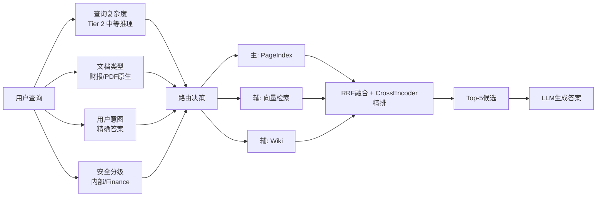

#### API调用映射

| 操作 | 方法 | API端点 | 说明 |
|------|------|---------|------|
| 查询重写 | POST | `/api/v1/knowledge-bases/{kb_id}/query/rewrite` | |
| 多通道对比 | POST | `/api/v1/knowledge-bases/{kb_id}/query/compare` | 仅开发者 |

---

### 4.3 反馈与纠错

#### 纠错对话框

```
┌─────────────────────────────────────────┐
│ 提交纠错                            [×] │
├─────────────────────────────────────────┤
│                                         │
│  问题类型 *                             │
│  ☐ 回答错误  ☐ 引用错误                │
│  ☐ 信息过时  ☐ 不完整                  │
│  ☐ 格式问题  ☐ 其他                    │
│                                         │
│  错误说明 *                             │
│  ┌─────────────────────────────────┐   │
│  │ 请描述具体的错误...              │   │
│  └─────────────────────────────────┘   │
│                                         │
│  正确内容建议                           │
│  ┌─────────────────────────────────┐   │
│  │ 如果知道正确答案，请填写...      │   │
│  └─────────────────────────────────┘   │
│                                         │
│  引用修正建议                           │
│  ┌─────────────────────────────────┐   │
│  │ 请指出应引用的文档或条款...      │   │
│  └─────────────────────────────────┘   │
│                                         │
│         [取消]  [提交纠错]              │
└─────────────────────────────────────────┘
```

#### 纠错交互流程

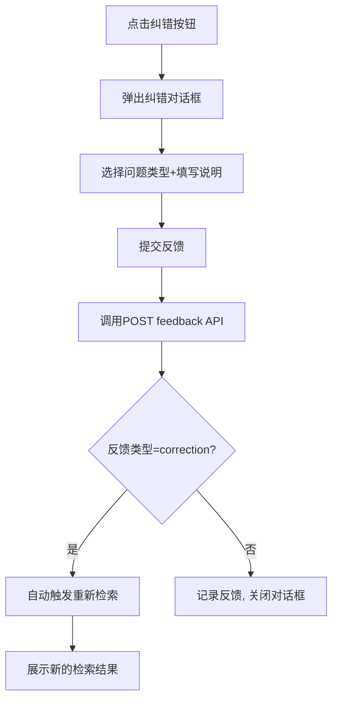

---

### 4.4 Chat 设置侧栏（对齐 RAGFlow ChatSettings）

点击对话区 `[⚙]` 从右侧滑出设置面板，分三大块：基础设置、检索参数、高级选项。

#### 面板布局

```
┌─────────────────────────────────────────────────────────────────┐
│ 对话设置                                                    [×] │
├─────────────────────────────────────────────────────────────────┤
│ ── 基础设置 ──                                                  │
│ 关联知识库:  [法务合同知识库 ▼]  [+ 添加]                      │
│ 对话名称:    [合同违约条款查询____________]                     │
│ 系统提示词:  [你是企业法务助手...___________]  [模板▼]         │
│ 开场白:      [您好，我可以帮您查询合同条款...]                  │
│                                                                 │
│ ── 检索参数 ──                                                  │
│ 相似度阈值:  [====●====] 0.2                                    │
│ 向量权重:    [======●==] 0.7                                    │
│ Top-K:       [10]    Rerank: [✓]  模型: [BGE-Reranker ▼]       │
│ [✓] 知识图谱增强  [✓] Wiki 通道  [✓] PageIndex 通道           │
│ 元数据过滤:  department=法务  [+ 添加条件]                     │
│                                                                 │
│ ── 高级选项 ──                                                  │
│ 温度: [0.3]  Max Tokens: [2048]  模型: [DeepSeek-v4 ▼]         │
│ [✓] 显示引用来源  [✓] 显示查询 Trace  [✓] 流式输出             │
│ 空回复提示:  [未找到相关内容，请尝试...]                        │
│ TTS 语音:    [🔴 关闭]                                          │
│                                                                 │
│                              [重置默认]  [保存设置]             │
└─────────────────────────────────────────────────────────────────┘
```

#### 状态管理

```typescript
interface ChatSettings {
  kbIds: string[];
  systemPrompt: string;
  opener: string;
  similarityThreshold: number;
  vectorWeight: number;
  topK: number;
  rerank: { enabled: boolean; model: string };
  channels: { graph: boolean; wiki: boolean; pageIndex: boolean };
  metadataFilters: MetadataFilter[];
  llm: { model: string; temperature: number; maxTokens: number };
  display: { citations: boolean; trace: boolean; streaming: boolean };
}
```

#### API 映射

| 操作 | 方法 | API 端点 |
|------|------|---------|
| 获取设置 | GET | `/api/v1/conversations/{conv_id}/settings` |
| 保存设置 | PUT | `/api/v1/conversations/{conv_id}/settings` |
| Prompt 模板 | GET | `/api/v1/prompt-templates` |

---

### 4.5 答案对比模式（US-2.12）

在对话消息区支持「多策略并行回答」对比视图，用于调试检索策略差异。

#### 对比布局

```
┌─────────────────────────────────────────────────────────────────┐
│ 答案对比 — 「供应商违约金如何计算？」              [关闭对比]  │
├──────────────────────────┬──────────────────────────────────────┤
│ 策略 A: PageIndex 主通道 │ 策略 B: 纯向量检索                   │
│                          │                                      │
│ 根据第五条，违约金按日   │ 根据相关条款，违约金标准为...        │
│ 0.5% 计算[1]             │ 0.3%-0.5% 不等[1][2]                 │
│                          │                                      │
│ 置信度: 0.92             │ 置信度: 0.78                         │
│ 延迟: 2.1s               │ 延迟: 1.2s                           │
│ 引用: 1 条               │ 引用: 2 条                           │
├──────────────────────────┴──────────────────────────────────────┤
│ 差异摘要: A 更精确引用第五条；B 召回范围更广但置信度较低      │
│ [采纳 A] [采纳 B] [合并为正式回答]                              │
└─────────────────────────────────────────────────────────────────┘
```

**入口**：Chat 设置侧栏「高级选项」→「启用答案对比」；或开发者模式快捷键 `Ctrl+Shift+C`。

#### API 映射

| 操作 | 方法 | API 端点 |
|------|------|---------|
| 并行查询 | POST | `/api/v1/conversations/{conv_id}/compare` |
| 采纳策略 | POST | `/api/v1/conversations/{conv_id}/messages/{msg_id}/adopt` |

---

### 4.6 高级检索语法（US-2.10）

输入框支持 `field:value` 语法与布尔运算符，输入时实时语法高亮与自动补全。

#### 语法提示浮层

```
┌─────────────────────────────────────────────────────────────────┐
│ 输入: department:法务 AND type:合同 违约金                      │
├─────────────────────────────────────────────────────────────────┤
│ 语法帮助:                                                       │
│   field:value   — 元数据过滤 (department, type, date, author)   │
│   AND / OR / NOT — 布尔组合                                     │
│   "精确短语"    — 引号包裹                                      │
│   page:3-5      — 页码范围                                      │
│                                                                 │
│ 自动补全: department: [法务] [财务] [研发]                      │
└─────────────────────────────────────────────────────────────────┘
```

#### 解析流程

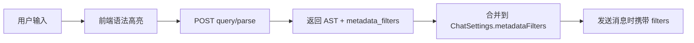

---

## 5. 评测中心模块

### 5.1 评测仪表盘

#### 页面布局

```
┌─────────────────────────────────────────────────────────────────┐
│ 评测中心                               [时间▼] [知识库▼]       │
├─────────────────────────────────────────────────────────────────┤
│                                                                 │
│  ┌──────────┐ ┌──────────┐ ┌──────────┐ ┌──────────┐         │
│  │ 🎯       │ │ 📐       │ │ 📊       │ │ ⚠️       │         │
│  │Faithful  │ │Context   │ │Answer    │ │Hallucin  │         │
│  │ness      │ │Precision │ │Relevancy │ │ationRate │         │
│  │          │ │          │ │          │ │          │         │
│  │  0.92    │ │  0.88    │ │  0.91    │ │  0.04    │         │
│  │  ↑ +0.03 │ │  ↑ +0.01 │ │  ↓ -0.02 │ │  ↓ -0.01 │         │
│  └──────────┘ └──────────┘ └──────────┘ └──────────┘         │
│                                                                 │
│  ┌─────────────────────────────────────────────────────────┐   │
│  │ 核心指标趋势                    [日▼] [周] [月]          │   │
│  │                                                         │   │
│  │  1.0 ┤                                    ╭──╮         │   │
│  │      │                        ╭──╮  ╭──╮╭╯  ╰╮       │   │
│  │  0.9 ┤ ╭──╮  ╭──╮  ╭──╮ ╭╮╭╯  ╰╮╭╯  ╰╯     ╰      │   │
│  │      │╭╯  ╰╮╭╯  ╰╮╭╯  ╰─╯╰╯     ╰╯              │   │
│  │  0.8 ┤╯     ╰╯     ╰╯                              │   │
│  │      ├──┬──┬──┬──┬──┬──┬──┬──┬──┬──┬──┬──           │   │
│  │      1月  2月  3月  4月  5月  6月                     │   │
│  │      ── Faithfulness  -- Answer Relevancy             │   │
│  │      ── Context Precision  -- Hallucination Rate      │   │
│  └─────────────────────────────────────────────────────────┘   │
│                                                                 │
│  ┌─────────────────────────────────────────────────────────┐   │
│  │ 分层评测                                               │   │
│  │                                                         │   │
│  │ 文档级  ██████████████████████░░░░  92%  解析质量      │   │
│  │ 块级    ██████████████████░░░░░░░░  88%  分块合理性    │   │
│  │ 检索级  ████████████████░░░░░░░░░░  82%  Recall@10    │   │
│  │ 生成级  ██████████████████████░░░░  92%  Faithfulness  │   │
│  │ 端到端  ████████████████████░░░░░░  86%  综合评分      │   │
│  └─────────────────────────────────────────────────────────┘   │
│                                                                 │
└─────────────────────────────────────────────────────────────────┘
```

#### 评测数据流

```typescript
// 评测仪表盘数据获取
function useEvalDashboard(kbId?: string, period: string = '30d') {
  return useQuery({
    queryKey: ['eval-dashboard', kbId, period],
    queryFn: () => evalService.getDashboard({ kb_id: kbId, period }),
    refetchInterval: 60000,  // 1分钟刷新
  });
}
```

---

### 5.2 评测任务管理

#### 创建评测任务对话框

```
┌─────────────────────────────────────────┐
│ 创建评测任务                        [×] │
├─────────────────────────────────────────┤
│                                         │
│  评测名称 *                             │
│  ┌─────────────────────────────────┐   │
│  │ 6月Faithfulness回归评测          │   │
│  └─────────────────────────────────┘   │
│                                         │
│  目标知识库 *                           │
│  [法务合同知识库 ▼]                     │
│                                         │
│  评测集                                 │
│  ○ 使用默认评测集                       │
│  ○ 上传自定义评测集 (CSV/JSON)          │
│  ○ 从历史查询生成                       │
│                                         │
│  评测指标 *                             │
│  ☑ Faithfulness  ☑ Context Precision   │
│  ☑ Answer Relevancy  ☐ Hallucination   │
│  ☐ Context Recall  ☐ Bleu Score        │
│                                         │
│  基线对比                               │
│  ☑ 与上次评测结果对比                   │
│                                         │
│         [取消]  [创建评测]              │
└─────────────────────────────────────────┘
```

#### 评测结果详情页

```
┌─────────────────────────────────────────────────────────────────┐
│ 评测结果: 6月Faithfulness回归评测                               │
├─────────────────────────────────────────────────────────────────┤
│ 状态: ✅完成  │ 耗时: 12min │ 测试集: 500条 │ 时间: 2026-06-05 │
├─────────────────────────────────────────────────────────────────┤
│                                                                 │
│  ┌────────────────────────────────────────────────────────┐    │
│  │ 综合评分                 与基线对比                      │    │
│  │ Faithfulness: 0.92  ↑0.03 ✅                           │    │
│  │ Context Precision: 0.88 ↑0.01 ✅                       │    │
│  │ Answer Relevancy: 0.91 ↓0.02 ⚠️                       │    │
│  │ Hallucination: 0.04 ↓0.01 ✅                           │    │
│  └────────────────────────────────────────────────────────┘    │
│                                                                 │
│  失败案例 Top 10                                               │
│  ┌────────────────────────────────────────────────────────┐    │
│  │ #1 查询: "供应商保密义务范围"                          │    │
│  │    期望: 保密条款第8.1-8.5条                           │    │
│  │    实际: 引用了过期的V4版本条款                         │    │
│  │    Faithfulness: 0.45  ↓  [查看详情]                   │    │
│  │────────────────────────────────────────────────────────│    │
│  │ #2 查询: "延迟交货违约金上限"                          │    │
│  │    期望: 合同金额20%                                   │    │
│  │    实际: 回答"不超过30%"                                │    │
│  │    Faithfulness: 0.52  ↓  [查看详情]                   │    │
│  └────────────────────────────────────────────────────────┘    │
│                                                                 │
└─────────────────────────────────────────────────────────────────┘
```

---

### 5.3 A/B测试面板

#### 页面布局

```
┌─────────────────────────────────────────────────────────────────┐
│ A/B测试                                          [+ 创建测试]  │
├─────────────────────────────────────────────────────────────────┤
│                                                                 │
│  活跃测试                                                      │
│  ┌──────────────────────────────────────────────────────────┐  │
│  │ 🧪 BGE-M3 vs BCE-Embedding 嵌入模型对比                 │  │
│  │ 状态: 🟢运行中  │ 流量: 50/50  │ 运行: 3天              │  │
│  │                                                          │  │
│  │ Variant A (BGE-M3)     Variant B (BCE-Embedding)        │  │
│  │ Faithfulness: 0.92      Faithfulness: 0.89              │  │
│  │ Recall@10: 0.85         Recall@10: 0.83                 │  │
│  │ P95延迟: 1.8s           P95延迟: 1.5s                   │  │
│  │ 样本量: 1,250           样本量: 1,248                    │  │
│  │                                                          │  │
│  │ 统计显著性: p=0.032 ✅ 达到95%置信度                     │  │
│  │                                                          │  │
│  │ [查看详情]  [停止测试]  [全量切换到A]                    │  │
│  └──────────────────────────────────────────────────────────┘  │
│                                                                 │
│  历史测试                                                      │
│  ┌──────────────────────────────────────────────────────────┐  │
│  │ DeepDoc vs MinerU 解析引擎对比  ✅已完成  6月1日-6月3日  │  │
│  │ 胜出: DeepDoc (Faithfulness +0.04)  [查看报告]          │  │
│  └──────────────────────────────────────────────────────────┘  │
│                                                                 │
└─────────────────────────────────────────────────────────────────┘
```

#### A/B测试交互流程

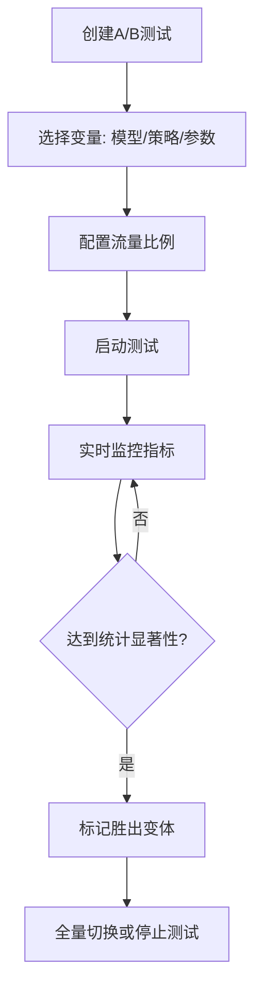

---

### 5.4 评测数据集管理（US-4.10）

#### 页面布局

```
┌─────────────────────────────────────────────────────────────────┐
│ 评测数据集                                    [+ 新建] [导入]   │
├─────────────────────────────────────────────────────────────────┤
│ 🔍 搜索...  [知识库▼]  [标签▼]                                 │
├─────────────────────────────────────────────────────────────────┤
│ 数据集名称        │ 样本数 │ 知识库     │ 更新    │ 操作      │
│ 合同问答黄金集    │  320   │ 法务合同   │ 6/5     │ [编辑][跑]│
│ 财务指标基准集    │  156   │ 财务报告   │ 6/1     │ [编辑][跑]│
├─────────────────────────────────────────────────────────────────┤
│ 选中数据集详情                                                  │
│ ┌──────────────────────────────────────────────────────────┐   │
│ │ #42  Q: 违约金上限？  A: 不超过合同总额20%  [编辑][删]  │   │
│ │ #43  Q: 保密期限？    A: 合同终止后5年      [编辑][删]  │   │
│ │ [+ 添加样本]  [批量导入 CSV/JSON]  [从对话采样]          │   │
│ └──────────────────────────────────────────────────────────┘   │
└─────────────────────────────────────────────────────────────────┘
```

#### API 映射

| 操作 | 方法 | API 端点 |
|------|------|---------|
| 数据集列表 | GET | `/api/v1/eval/datasets` |
| 创建/更新 | POST/PUT | `/api/v1/eval/datasets/{id}` |
| 导入样本 | POST | `/api/v1/eval/datasets/{id}/import` |
| 从对话采样 | POST | `/api/v1/eval/datasets/sample-from-chat` |

---

### 5.5 用户满意度分析（US-4.9）

#### 页面布局

```
┌─────────────────────────────────────────────────────────────────┐
│ 用户满意度                         [时间▼ 近30天] [知识库▼]    │
├─────────────────────────────────────────────────────────────────┤
│ ┌──────────┐ ┌──────────┐ ┌──────────┐ ┌──────────┐         │
│ │ 👍 好评率 │ │ 👎 差评率 │ │ 纠错率   │ │ NPS      │         │
│ │  87.3%   │ │  4.2%    │ │  2.1%    │ │  +42     │         │
│ └──────────┘ └──────────┘ └──────────┘ └──────────┘         │
│                                                                 │
│ 满意度趋势图（按日/周）                                         │
│ ████████████████████████████████████████░░░░                   │
│                                                                 │
│ 差评原因分布          │ 低满意度对话 Top10                       │
│ 引用错误 38%          │ #conv-8821  违约金计算错误  [查看]      │
│ 回答不完整 27%        │ #conv-8756  条款过时        [查看]      │
│ 信息过时 19%          │ ...                                      │
└─────────────────────────────────────────────────────────────────┘
```

#### API 映射

| 操作 | 方法 | API 端点 |
|------|------|---------|
| 满意度概览 | GET | `/api/v1/eval/satisfaction/summary` |
| 趋势数据 | GET | `/api/v1/eval/satisfaction/trend` |
| 差评详情 | GET | `/api/v1/eval/satisfaction/negative-cases` |

---

## 6. 系统管理模块

### 6.1 用户与权限管理（RBAC）

#### 用户列表页

```
┌─────────────────────────────────────────────────────────────────┐
│ 用户管理                                     [+ 添加用户]      │
├─────────────────────────────────────────────────────────────────┤
│ [搜索用户...]  [角色▼] [部门▼] [状态▼]                         │
├─────────────────────────────────────────────────────────────────┤
│ ☐ │ 张伟   │ zhang.wei@   │ 法务部  │ 知识库管理员 │ 活跃 │ ⋮ │
│ ☐ │ 李婷   │ li.ting@     │ AI平台  │ 平台管理员   │ 活跃 │ ⋮ │
│ ☐ │ 陈工   │ chen.gong@   │ 算法组  │ 开发者       │ 活跃 │ ⋮ │
│ ☐ │ 王芳   │ wang.fang@   │ 知识管理│ 知识库管理员 │ 活跃 │ ⋮ │
├─────────────────────────────────────────────────────────────────┤
│ 批量操作: [分配角色] [修改密级] [禁用]                          │
└─────────────────────────────────────────────────────────────────┘
```

#### 角色管理页

```
┌─────────────────────────────────────────────────────────────────┐
│ 角色管理                                     [+ 创建角色]      │
├─────────────────────────────────────────────────────────────────┤
│ ┌──────────────────────────────────────────────────────────┐  │
│  系统角色                                                  │  │
│  ┌────────┐ ┌────────┐ ┌────────┐ ┌────────┐             │  │
│  │超级管理│ │平台管理│ │知识库  │ │开发者  │             │  │
│  │员      │ │员      │ │管理员  │ │        │             │  │
│  │3人     │ │2人     │ │5人     │ │8人     │             │  │
│  └────────┘ └────────┘ └────────┘ └────────┘             │  │
│                                                           │  │
│  自定义角色                                                │  │
│  ┌────────┐ ┌────────┐                                   │  │
│  │法务主管│ │日志审计│   [+ 创建自定义角色]                │  │
│  │2人     │ │1人     │                                   │  │
│  └────────┘ └────────┘                                   │  │
│  └──────────────────────────────────────────────────────────┘  │
└─────────────────────────────────────────────────────────────────┘
```

#### Chunk级ACL规则配置

> 知识库权限页完整设计见 **§3.10**；以下为规则编辑区核心 ASCII（`KBPermissionsPage` 内嵌）。

```
┌─────────────────────────────────────────────────────────────────┐
│ ACL规则配置 — 法务合同知识库                                     │
├─────────────────────────────────────────────────────────────────┤
│ [+ 添加规则]                                                    │
│                                                                 │
│ ┌──────────────────────────────────────────────────────────┐  │
│  #1  规则名称: 高管可看全部                                │  │
│  被授权者: 角色=executive                                  │  │
│  权限: read                                               │  │
│  条件: confidentiality IN (public, internal, confidential, │  │
│        restricted)                                         │  │
│  状态: ✅启用                     [编辑] [禁用] [删除]     │  │
│  ──────────────────────────────────────────────────────── │  │
│  #2  规则名称: 财务分析师可看内部及以下                    │  │
│  被授权者: 角色=finance_analyst                            │  │
│  权限: read                                               │  │
│  条件: confidentiality != restricted                      │  │
│  状态: ✅启用                     [编辑] [禁用] [删除]     │  │
│  ──────────────────────────────────────────────────────── │  │
│  #3  规则名称: 实习生仅可看公开                            │  │
│  被授权者: 角色=intern                                     │  │
│  权限: read                                               │  │
│  条件: confidentiality == public                          │  │
│  状态: ✅启用                     [编辑] [禁用] [删除]     │  │
│  └──────────────────────────────────────────────────────────┘  │
│                                                                 │
└─────────────────────────────────────────────────────────────────┘
```

#### API调用映射

| 操作 | 方法 | API端点 | 说明 |
|------|------|---------|------|
| 用户列表 | GET | `/api/v1/tenants/{tenant_id}/users` | |
| 添加用户 | POST | `/api/v1/tenants/{tenant_id}/users` | |
| 修改角色 | PUT | `/api/v1/tenants/{tenant_id}/users/{user_id}/role` | |
| 设置ACL | POST | `/api/v1/knowledge-bases/{kb_id}/acl` | |

---

### 6.2 流水线配置

#### 页面布局

```
┌─────────────────────────────────────────────────────────────────┐
│ 流水线配置 — 法务合同知识库                                      │
├─────────────────────────────────────────────────────────────────┤
│                                                                 │
│  五大流水线开关                                                 │
│  ┌──────────────────────────────────────────────────────────┐  │
│  │ P1 向量检索流水线    [🟢启用] ████████████ 配置          │  │
│  │ P2 PageIndex流水线   [🟢启用] ████████████ 配置          │  │
│  │ P3 GraphRAG流水线    [🟡仅索引] ████████████ 配置        │  │
│  │ P4 LLM Wiki流水线    [🔴禁用] ████████████ 配置          │  │
│  │ P5 Agent工具流水线   [🔴禁用] ████████████ 配置          │  │
│  └──────────────────────────────────────────────────────────┘  │
│                                                                 │
│  模型配置                                                      │
│  ┌──────────────────────────────────────────────────────────┐  │
│  │ 嵌入模型:    [BAAI/bge-m3 ▼]                            │  │
│  │ LLM模型:     [deepseek-v4 ▼]                            │  │
│  │ Reranker模型: [BAAI/bge-reranker-v2-m3 ▼]              │  │
│  │ 分类器模型:  [gpt-4o-mini ▼]                            │  │
│  └──────────────────────────────────────────────────────────┘  │
│                                                                 │
│  路由规则可视化编辑器                                           │
│  ┌──────────────────────────────────────────────────────────┐  │
│  │                                                          │  │
│  │  查询复杂度 ──┐                                          │  │
│  │  文档类型   ──┼──→ [路由决策] ──→ 主通道+辅通道          │  │
│  │  用户意图   ──┘                                          │  │
│  │  安全分级   ──┘                                          │  │
│  │                                                          │  │
│  │  ┌─────────────────────────────────────────────┐        │  │
│  │  │ Tier1 + 财报 + 精确答案 → Wiki + 向量        │        │  │
│  │  │ Tier2 + 财报 + 数据分析 → PageIndex + 向量   │        │  │
│  │  │ Tier3 + 合同 + 综合分析 → PageIndex + 图谱   │        │  │
│  │  │ Tier4 + 全部 + 策略建议 → Agent + 向量+图谱  │        │  │
│  │  └─────────────────────────────────────────────┘        │  │
│  │                                              [+ 添加规则]│  │
│  └──────────────────────────────────────────────────────────┘  │
│                                                                 │
│                                              [保存配置]         │
└─────────────────────────────────────────────────────────────────┘
```

#### 路由规则可视化编辑器交互

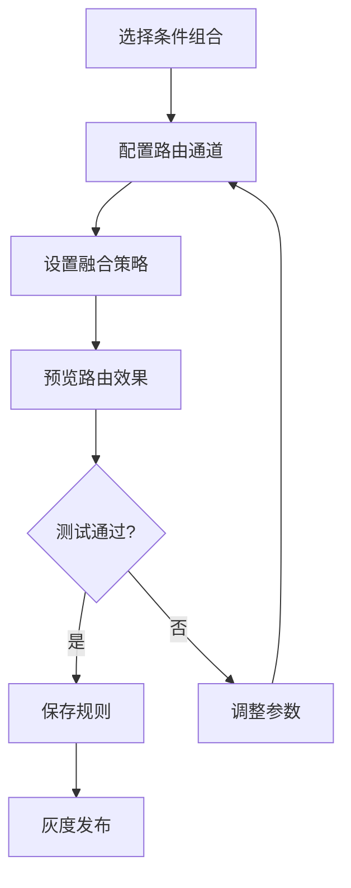

---

### 6.3 审计日志

#### 页面布局

```
┌─────────────────────────────────────────────────────────────────┐
│ 审计日志                                       [导出CSV]       │
├─────────────────────────────────────────────────────────────────┤
│ 时间范围: [2026-06-01] ~ [2026-06-06]                           │
│ 操作者: [全部▼]  操作类型: [全部▼]  资源: [全部▼]               │
├─────────────────────────────────────────────────────────────────┤
│ 时间              │ 用户  │ 操作     │ 资源          │ IP       │
│ 2026-06-06 10:30 │ 张伟  │ 查询     │ kb_法务合同   │10.0.1.5  │
│ 2026-06-06 10:28 │ 王芳  │ 上传文档 │ doc_合同V6    │10.0.2.3  │
│ 2026-06-06 10:15 │ 李婷  │ 修改配置 │ pipeline_P1   │10.0.1.8  │
│ 2026-06-06 09:55 │ 陈工  │ API调用  │ kb_研发文档   │10.0.3.12 │
│ 2026-06-06 09:30 │ 张伟  │ 删除文档 │ doc_旧合同    │10.0.1.5  │
├─────────────────────────────────────────────────────────────────┤
│                       < 1 2 3 ... 50 >                         │
└─────────────────────────────────────────────────────────────────┘
```

#### API调用映射

| 操作 | 方法 | API端点 | 说明 |
|------|------|---------|------|
| 查询日志 | GET | `/api/v1/audit-logs` | 时间/用户/操作/资源筛选 |
| 导出日志 | GET | `/api/v1/audit-logs/export` | CSV/JSON格式 |

---

### 6.4 系统监控

Tab 容器：`MonitorPage.tsx`，路由 `/system/monitor`，通过 `?tab=` 切换子面板。

#### 6.4.1 基础设施 Tab（默认）

```
┌─────────────────────────────────────────────────────────────────┐
│ 系统监控                                                        │
├─────────────────────────────────────────────────────────────────┤
│ [基础设施] [流水线] [RAG3索引] [成本]                           │
│  ●────────    ○          ○        ○                             │
├─────────────────────────────────────────────────────────────────┤
│  ┌──────────┐ ┌──────────┐ ┌──────────┐ ┌──────────┐         │
│  │ QPS      │ │ P95延迟  │ │ 错误率   │ │ GPU利用率│         │
│  │ 1,250/s  │ │ 1.8s     │ │ 0.3%     │ │ 78%      │         │
│  │ ↑ +15%   │ │ ↓ -0.2s  │ │ 稳定     │ │ ↑ +5%    │         │
│  └──────────┘ └──────────┘ └──────────┘ └──────────┘         │
│                                                                 │
│  服务状态: API🟢  Milvus🟢  ES🟢  Neo4j🟡  Wiki Git🟢  GPU🟢  │
│                                                                 │
│  告警规则                                                      │
│  P0: Faithfulness突降30%+ → 电话+企微              [编辑]      │
│  P1: P95延迟>10s          → 企微                    [编辑]      │
│                                              [+ 添加告警规则]   │
└─────────────────────────────────────────────────────────────────┘
```

#### 6.4.2 RAG3索引 Tab（v1.3，平台管理员跨库巡检）

```
┌─────────────────────────────────────────────────────────────────┐
│ 系统监控                                                        │
├─────────────────────────────────────────────────────────────────┤
│ [基础设施] [流水线] [RAG3索引] [成本]                           │
│  ○          ○          ●          ○                             │
├─────────────────────────────────────────────────────────────────┤
│ 🔍 搜索知识库...  [告警▼ 仅告警]  [刷新]  上次更新: 10:30      │
├─────────────────────────────────────────────────────────────────┤
│ 知识库       │ Wiki      │ PageIndex │ 图谱    │ 告警 │ 操作   │
│──────────────┼───────────┼───────────┼─────────┼──────┼────────│
│ 法务合同     │ 12/42     │ 85/156    │ 42/156  │  2   │[进入库]│
│              │ 待审核 3  │ 失败 12   │         │Wiki+PI│        │
│ 财务报告     │  8/20     │ 60/89     │ 30/89   │  0   │[进入库]│
│ 研发文档     │ 编译中 5  │ 120/234   │ —       │  5   │[进入库]│
├─────────────────────────────────────────────────────────────────┤
│ 汇总: Wiki 编译中 12 │ 待审核 5 │ PageIndex 失败 8 │ 图谱构建 3│
└─────────────────────────────────────────────────────────────────┘
```

**深链规则**（详见 §14.2）：

| 告警类型 | 跳转 |
|---------|------|
| Wiki 编译失败 | `/kb/:kbId/wiki/compile?status=failed` |
| Wiki 待审核 | `/kb/:kbId/wiki/compile?status=pending_review` |
| PageIndex 失败 | `/kb/:kbId/pageindex/documents?filter=failed` |

**API**：`GET /api/v1/admin/index-status/aggregate`

#### 6.4.3 流水线 Tab

```
┌─────────────────────────────────────────────────────────────────┐
│ 系统监控                                                        │
├─────────────────────────────────────────────────────────────────┤
│ [基础设施] [●流水线] [RAG3索引] [成本]                          │
├─────────────────────────────────────────────────────────────────┤
│ 流水线延迟分布                     [1h] [6h] [24h] [7d]        │
│  P1 向量     ████████░░  平均 450ms   P95 820ms                │
│  P2 PageIdx  ██████████  平均 520ms   P95 1.2s                 │
│  P3 GraphRAG ██████████████  平均 1.2s                         │
│  P4 Wiki     ████░░░░░░░░  平均 180ms                          │
│  P5 Agent    ████████████████████  平均 3.5s                   │
│                                              [跳转流水线配置 →] │
└─────────────────────────────────────────────────────────────────┘
```

#### 6.4.4 成本 Tab

```
┌─────────────────────────────────────────────────────────────────┐
│ 系统监控                                                        │
├─────────────────────────────────────────────────────────────────┤
│ [基础设施] [流水线] [RAG3索引] [●成本]                          │
├─────────────────────────────────────────────────────────────────┤
│ 今日 Token 2.5M  ¥38.5  │  本月 45M  ¥680  │  预算已用 68%    │
│ 模型分布: DeepSeek 68% | Qwen3 22% | Claude 10%                │
│                                              [打开成本中心 →]   │
│                                              /evaluation/cost   │
└─────────────────────────────────────────────────────────────────┘
```

#### 告警规则配置交互

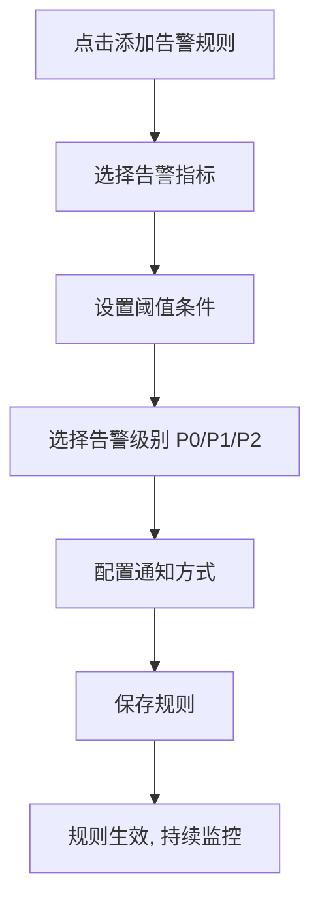

---

### 6.5 Prompt 模板管理（US-5.3）

#### 页面布局

```
┌─────────────────────────────────────────────────────────────────┐
│ Prompt 模板管理                              [+ 新建] [导入]   │
├─────────────────────────────────────────────────────────────────┤
│ 分类: [全部▼]  场景: [对话/检索/评测/Wiki编译]                 │
├─────────────────────────────────────────────────────────────────┤
│ 模板名称          │ 场景   │ 版本 │ 使用次数 │ 操作            │
│ 法务助手系统提示  │ 对话   │ v3   │ 12,400   │ [编辑][预览][删]│
│ 财报摘要生成      │ Wiki   │ v1   │  3,200   │ [编辑][预览][删]│
├─────────────────────────────────────────────────────────────────┤
│ 编辑区（选中模板）                                              │
│ 变量: {{kb_name}} {{user_role}} {{date}}                       │
│ ┌──────────────────────────────────────────────────────────┐   │
│ │ 你是 {{kb_name}} 的专业助手，面向 {{user_role}}...       │   │
│ └──────────────────────────────────────────────────────────┘   │
│ [变量插入▼]  [A/B 测试]  [保存]  [发布]                       │
└─────────────────────────────────────────────────────────────────┘
```

---

### 6.6 灰度发布（US-5.8）

#### 页面布局

```
┌─────────────────────────────────────────────────────────────────┐
│ 灰度发布                                        [+ 新建发布]   │
├─────────────────────────────────────────────────────────────────┤
│ 发布: Pipeline P2 v2.3 → PageIndex 树搜索优化                   │
│ 状态: 🟢 灰度中  │ 流量: 15%  │ 开始: 6/6 08:00               │
│                                                                 │
│ 灰度流量滑块:  [====●=============] 15%                         │
│ 目标用户:      [按部门▼] 研发部, 测试组                         │
│ 监控指标:      Faithfulness / P95延迟 / 错误率                  │
│                                                                 │
│ 实时对比（灰度 vs 基线）                                        │
│ Faithfulness  0.91 vs 0.89  ↑   P95  1.6s vs 1.8s  ↓         │
│                                                                 │
│ [扩量至 50%]  [全量发布]  [回滚]                                │
└─────────────────────────────────────────────────────────────────┘
```

---

### 6.7 备份与恢复（US-5.7）

#### 页面布局

```
┌─────────────────────────────────────────────────────────────────┐
│ 备份与恢复                                      [立即备份]     │
├─────────────────────────────────────────────────────────────────┤
│ 自动备份: [✓] 每日 02:00  保留 30 天  存储: S3/MinIO           │
├─────────────────────────────────────────────────────────────────┤
│ 备份记录                                                        │
│ 2026-06-06 02:00 │ 全量 │ 86GB │ ✅ 成功 │ [下载] [恢复] [删] │
│ 2026-06-05 02:00 │ 全量 │ 85GB │ ✅ 成功 │ [下载] [恢复] [删] │
├─────────────────────────────────────────────────────────────────┤
│ 恢复向导（点击恢复后）                                          │
│ Step 1: 选择备份点 → Step 2: 选择范围(全库/单库) → Step 3: 确认 │
│ ⚠️ 恢复将覆盖当前数据，需二次确认 + 管理员密码                   │
└─────────────────────────────────────────────────────────────────┘
```

---

### 6.8 向量库切换向导（US-5.6）

#### 四步向导布局

```
┌─────────────────────────────────────────────────────────────────┐
│ 向量库切换向导                                                  │
├─────────────────────────────────────────────────────────────────┤
│ ① 选择目标  →  ② 映射配置  →  ③ 迁移预览  →  ④ 执行切换      │
│ ●──────────────○──────────────○──────────────○                 │
├─────────────────────────────────────────────────────────────────┤
│ 当前: Milvus 2.4          目标: [Qdrant 1.9 ▼]                 │
│                                                                 │
│ 索引映射:                                                       │
│   collection_kb_法务  →  qdrant_kb_legal  [维度 1024 ✓]        │
│   collection_kb_财务  →  qdrant_kb_finance [维度 1024 ✓]       │
│                                                                 │
│ 预估迁移: 1.86M 向量 │ 约 4.2 小时 │ 停机窗口建议 02:00-06:00  │
│                                                                 │
│                              [上一步]  [开始迁移]               │
└─────────────────────────────────────────────────────────────────┘
```

---

## 7. 公共组件库

### 7.1 KnowledgeBaseSelector — 知识库选择器

**功能**：在对话/查询页面选择一个或多个知识库

**布局**：

```
┌─────────────────────────────┐
│ 🔍 搜索知识库...            │
├─────────────────────────────┤
│ ☑ 📚 法务合同知识库         │
│ ☑ 📊 财务报告知识库         │
│ ☐ 🔬 研发文档知识库         │
│ ☐ 📋 合规政策知识库         │
├─────────────────────────────┤
│ 已选择 2 个知识库    [确认] │
└─────────────────────────────┘
```

**Props**：

```typescript
interface KnowledgeBaseSelectorProps {
  mode?: 'single' | 'multiple';       // 单选/多选
  value?: string[];                    // 已选知识库ID
  onChange?: (kbIds: string[]) => void;
  disabled?: boolean;
}
```

**API映射**：`GET /api/v1/knowledge-bases` — 获取用户有权访问的知识库列表

---

### 7.2 DocumentUploader — 文档上传组件

**功能**：支持拖拽+点击上传，显示批量上传进度

**布局**：

```
┌─────────────────────────────────────────┐
│                                         │
│    📂 拖拽文件至此，或点击选择文件       │
│                                         │
│    支持16+格式 | 单文件≤100MB           │
│                                         │
├─────────────────────────────────────────┤
│ 上传队列 (2/3)                          │
│ ┌───────────────────────────────────┐   │
│ │ 📄 合同V5.pdf  2.3MB  ████████ ✅│   │
│ │ 📄 报告.pdf    5.0MB  ████░░░ 🔄│   │
│ │ 📊 数据.xlsx   0.8MB  ██░░░░░ ⬆│   │
│ └───────────────────────────────────┘   │
└─────────────────────────────────────────┘
```

**Props**：

```typescript
interface DocumentUploaderProps {
  kbId: string;
  maxFileSize?: number;                 // 默认100MB
  maxFileCount?: number;                // 默认100
  acceptedFormats?: string[];           // 支持的格式
  onUploadComplete?: (docs: Document[]) => void;
  onUploadError?: (errors: UploadError[]) => void;
}
```

**关键实现**：

- 使用`tus-js-client`进行大文件分片上传
- 使用`tus-js-client`的`onProgress`回调更新进度条
- 上传完成后自动触发解析状态轮询
- 支持暂停/恢复单个上传任务

**API映射**：`POST /api/v1/knowledge-bases/{kb_id}/documents`

---

### 7.3 CitationCard — 引用卡片组件

**功能**：展示引用来源信息，支持悬停预览和点击跳转

**布局**：

```
┌───────────────────────────────────────────────┐
│ 📄 供应商合同模板V5.pdf  第3页  第五条 违约责任 │
├───────────────────────────────────────────────┤
│ "5.1 供应商迟延交货的，每迟延一日应按迟延     │
│  交付货物价值的千分之五向采购方支付违约金。"   │
│                                               │
│ 相关度: ████████░░ 95.6%                      │
│                                               │
│ [查看原文]  [复制引用]  [标记不相关]           │
└───────────────────────────────────────────────┘
```

**Props**：

```typescript
interface CitationCardProps {
  citation: {
    index: number;
    docId: string;
    docName: string;
    chunkId: string;
    section: string;
    pageNumber: number;
    snippet: string;
    relevanceScore: number;
    bboxCoordinates?: number[];   // [x1, y1, x2, y2] 用于原文高亮
  };
  onViewOriginal?: (citation: Citation) => void;  // 跳转原文
  compact?: boolean;             // 紧凑模式(用于Popover)
}
```

**关键实现**：

- 紧凑模式：仅显示文档名+页码，用于悬停Popover
- 完整模式：展示snippet+相关度+操作按钮
- `bboxCoordinates`不为空时，点击"查看原文"跳转到解析预览页并高亮对应区域
- 相关度颜色编码：>0.9=绿色, 0.7-0.9=黄色, <0.7=红色

---

### 7.4 QueryClassifierBadge — 分类器标签组件

**功能**：可视化展示分类器路由结果

**布局**：

```
┌────────┬──────────┬──────────┬──────────┐
│ Tier 2 │ 财报/PDF │ 精确答案 │ 内部     │
│ 中等推理│          │          │          │
└────────┴──────────┴──────────┴──────────┘
```

**Props**：

```typescript
interface QueryClassifierBadgeProps {
  routingInfo: {
    classifiedTier: 'tier_1' | 'tier_2' | 'tier_3' | 'tier_4';
    documentType?: string;
    userIntent?: string;
    securityLevel?: string;
    primaryChannel: string;
    secondaryChannels: string[];
  };
}
```

**关键实现**：

- Tier级别颜色：Tier1=绿, Tier2=蓝, Tier3=橙, Tier4=红
- 使用Ant Design的`Tag`组件，每个分类维度一个标签
- 点击标签可展开查看分类器的reasoning和confidence

---

### 7.5 PipelineStatusTag — 流水线状态标签

**功能**：显示流水线/索引的当前状态

**Props**：

```typescript
interface PipelineStatusTagProps {
  status: 'running' | 'completed' | 'failed' | 'paused' | 'not_applicable';
  progress?: number;           // 0-100
  label?: string;
}

// 状态映射:
// running → 🔄蓝色+进度条
// completed → ✅绿色
// failed → ❌红色
// paused → ⏸️黄色
// not_applicable → —灰色
```

---

### 7.6 ChunkPreviewCard — 分块预览卡片

**功能**：展示单个Chunk的预览信息和操作

**布局**：

```
┌─────────────────────────────────────────────────────────┐
│ #0  第一条 定义                    模板分块 │ 512 Token│
│ "第一条 定义 1.1 供应商系指根据本合同约定向采购方..."   │
│ 页码: 1  │  📄文本  │  🔒internal  │  [拆分] [排除]   │
└─────────────────────────────────────────────────────────┘
```

**Props**：

```typescript
interface ChunkPreviewCardProps {
  chunk: {
    chunkId: string;
    chunkIndex: number;
    contentPreview: string;
    contentType: 'text' | 'table' | 'image_description' | 'formula' | 'code';
    chunkStrategy: string;
    tokenCount: number;
    pageNumber: number;
    sectionTitle: string;
    aclTags: AclTag[];
  };
  onSplit?: (chunkId: string) => void;
  onMerge?: (chunkId: string, targetChunkId: string) => void;
  onExclude?: (chunkId: string) => void;
  onEdit?: (chunkId: string, content: string) => void;
}
```

---

### 7.7 ConfidenceGauge — 置信度仪表盘

**功能**：可视化展示答案置信度评分

**布局**：

```
        ╭─────╮
      ╱   0.92  ╲
     │    高     │
      ╲        ╱
        ╰─────╯
  检索质量: 0.95
  生成一致性: 0.93
  来源权威性: 0.90
  精排评分: 0.91
```

**Props**：

```typescript
interface ConfidenceGaugeProps {
  confidence: {
    score: number;      // 0-1
    level: 'high' | 'medium' | 'low';
    factors: {
      retrievalQuality: number;
      generationConsistency: number;
      sourceAuthority: number;
      crossEncoderScore: number;
    };
  };
  size?: 'small' | 'medium' | 'large';
}
```

**关键实现**：

- 使用ECharts Gauge图表渲染
- 颜色映射：>0.8=绿色, 0.6-0.8=黄色, <0.6=红色
- small模式仅显示数字和颜色标签，用于消息气泡底部

---

### 7.8 StreamingMessage — 流式消息组件

**功能**：支持逐字显示的SSE流式消息渲染

**Props**：

```typescript
interface StreamingMessageProps {
  content: string;           // 当前已接收的全部文本
  isStreaming: boolean;      // 是否正在流式输出
  citations: Citation[];     // 引用列表(延迟加载)
  onStop?: () => void;       // 停止生成回调
}
```

**关键实现**：

- 使用Markdown渲染组件(`react-markdown`+`rehype-highlight`)
- 流式输出时显示闪烁光标
- 引用标记`[1]`在对应SSE citation事件到达后才渲染为可点击链接
- 支持停止生成按钮
- 流式结束后渲染完整Markdown格式

**SSE事件处理流程**：

```mermaid
flowchart TD
    A[SSE: routing事件] --> B[显示路由信息Badge]
    C[SSE: token事件] --> D[追加文本到content]
    D --> E[Markdown渲染+闪烁光标]
    F[SSE: citation事件] --> G[收集citations]
    G --> H[将[1]标记渲染为可点击链接]
    I[SSE: confidence事件] --> J[显示置信度仪表盘]
    K[SSE: done事件] --> L[移除光标, 完整渲染]
    M[SSE: error事件] --> N[显示错误提示+重试按钮]
```

---

### 7.9 QueryTraceTimeline — 查询链路时间线

**功能**：在对话回答下方展示 L1→L5 五层 Trace，可展开查看 Span 详情。

**布局**：

```
┌─────────────────────────────────────────────────────────────────┐
│ ▼ 查询链路 Trace                                    总耗时 3.0s │
├─────────────────────────────────────────────────────────────────┤
│ ● L1 四分类器    120ms  Tier2/合同/精确答案/内部               │
│ ● L2 路由决策     45ms  → P2 PageIndex + P1 向量 + P4 Wiki     │
│ ● L3 多通道检索  1.4s   PageIndex 5条 │ 向量 5条 │ Wiki 2条    │
│ ● L4 RRF+精排    360ms  Top-5 候选 → CrossEncoder 重排         │
│ ● L5 LLM 生成    1.1s   DeepSeek-v4 │ 1,024 tokens              │
│                                              [查看完整 Trace →] │
└─────────────────────────────────────────────────────────────────┘
```

**Props**：`traceId: string` | `spans: TraceSpan[]` | `collapsed?: boolean`

---

### 7.10 ChunkMethodForm — 分块方法动态表单

**功能**：根据 `chunk_strategy` 动态渲染 RAGFlow `parser_config` 字段；用于 §10.4 知识库配置页与 Agent `Parser` 节点。

**Props**：

```typescript
type ChunkStrategy =
  | 'naive' | 'qa' | 'paper' | 'laws' | 'book' | 'table'
  | 'presentation' | 'picture' | 'email' | 'tag'
  | 'one' | 'resume' | 'manual' | 'knowledge_graph' | 'audio';

interface ChunkMethodFormProps {
  strategy: ChunkStrategy;
  value: ParserConfig;              // 当前 parser_config JSON
  onChange: (v: ParserConfig) => void;
  disabled?: boolean;
  onStrategyChange?: (next: ChunkStrategy) => void;  // 切换前 Modal.confirm
}

interface ParserConfig {
  chunk_token?: number;
  delimiter?: string;
  layout_recognize?: boolean;
  // 各 strategy 扩展字段见下表
  [key: string]: unknown;
}
```

**状态机**：

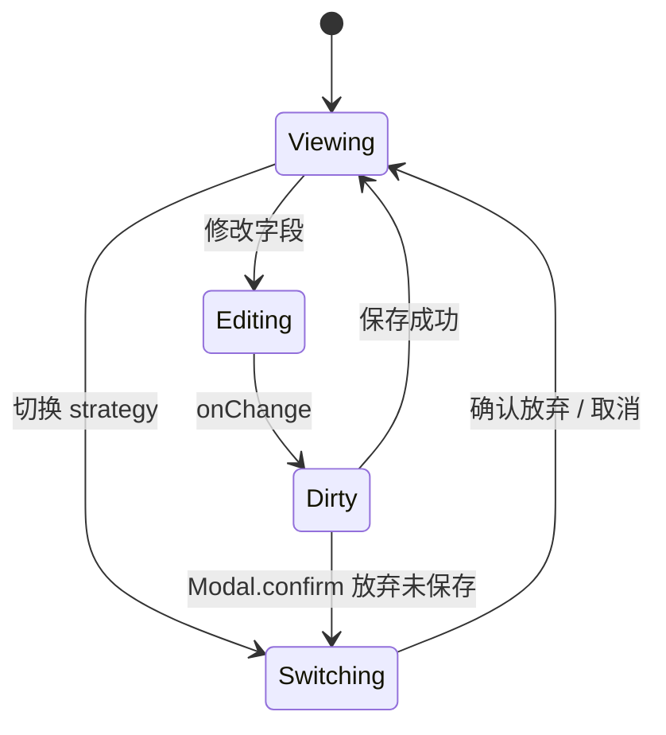

**15 种分块方法 `parser_config` 字段摘要**（完整 JSON Schema 见附录 C）：

| strategy | 关键字段 | 默认值 |
|----------|---------|--------|
| `naive` | `chunk_token`, `delimiter`, `layout_recognize` | 512, `\n`, true |
| `qa` | `qa_separator`, `question_label`, `answer_label` | `Q:`, `A:` |
| `paper` | `title_pattern`, `abstract_section`, `reference_section` | — |
| `laws` | `article_regex`, `hierarchy_detect`, `cross_ref_link` | 第N条 |
| `book` | `chapter_pattern`, `toc_extract` | 第N章 |
| `table` | `table_header_row`, `merge_cells`, `row_as_chunk` | true |
| `presentation` | `slide_per_page`, `speaker_notes` | true |
| `picture` | `ocr_engine`, `caption_extract`, `multimodal_tags` | deepdoc |
| `email` | `thread_group`, `attachment_parse` | true |
| `tag` | `tag_field`, `auto_tag_llm` | — |
| `one` | `whole_doc_as_chunk` | true |
| `resume` | `section_headers`, `field_extract` | 工作经历 |
| `manual` | `manual_toc`, `fixed_chunk_size` | — |
| `knowledge_graph` | `entity_extract`, `relation_types` | — |
| `audio` | `asr_model`, `speaker_diarization` | whisper |

**示例（laws）**：

```
分块方法: [laws ▼]
├── 条文层级识别: [✓]
├── 条款编号正则: [第[一二三四五六七八九十]+条]
├── 引用关联:     [✓] 自动链接「见第X条」
└── 最大 Chunk:   [768] tokens
```

---

### 7.11 ChatSettingsPanel — 对话设置侧栏

见 §4.4。封装为可复用 Drawer 组件，供 Chat / Search / Agent 调试模式共用。

---

### 7.12 WikiBrowser — Wiki 浏览器

见 §11.1.1（Wiki Hub 内「浏览器」Tab）。左侧目录树 + 右侧 Markdown 渲染 + 底部引用来源链。

---

### 7.13 PageIndexTreeView — PageIndex 树预览

见 §11.2.3（PageIndex Hub 内单文档详情）。Ant Design Tree + 节点点击联动 PDF bbox 高亮。

---

### 7.14 KnowledgeGraphView — 知识图谱可视化

**功能**：`/kb/:kbId/knowledge-graph` 力导向图；节点=实体，边=关系，点击跳转 Chunk 原文。

**Props**：

```typescript
interface KnowledgeGraphViewProps {
  kbId: string;
  data: { nodes: KGNode[]; edges: KGEdge[] };
  loading?: boolean;
  layout?: 'force' | 'circular' | 'dagre';
  maxNodes?: number;           // 默认 500，超出提示「缩小筛选范围」
  onNodeClick?: (node: KGNode) => void;   // 打开 Chunk 侧栏
  onEdgeClick?: (edge: KGEdge) => void;
  highlightEntityIds?: string[];        // 检索测试联动高亮
}

interface KGNode {
  id: string;
  label: string;
  type: 'entity' | 'concept' | 'event';
  chunk_ids: string[];
  degree: number;
}
```

**性能约束**：节点 >500 启用 G6 `gpu` 布局 + 聚合（super-node）；缩放 <0.3 时隐藏边标签；初始加载显示骨架，数据来自 `GET .../knowledge-graph`。

**交互**：滚轮缩放、拖拽平移、双击节点展开 1-hop 邻居；右侧抽屉展示实体属性与关联 Chunk 列表。

---

### 7.15 AgentCanvas — Agent 画布编辑器

**功能**：`/agent/:agentId` React Flow 画布；节点面板 + 属性面板 + 运行日志（§10.7.2）。

**Props**：

```typescript
interface AgentCanvasProps {
  agentId: string;
  nodes: AgentFlowNode[];
  edges: AgentFlowEdge[];
  selectedNodeId?: string;
  runStatus: 'idle' | 'running' | 'success' | 'failed';
  onNodesChange: OnNodesChange;
  onEdgesChange: OnEdgesChange;
  onSave: () => Promise<void>;
  onRun: () => Promise<void>;
}
```

**状态机**：

| 状态 | UI | 允许操作 |
|------|-----|---------|
| `idle` | 画布可编辑 | 拖拽节点、连线、保存 |
| `saving` | 顶栏 `[保存中...]` | 禁用运行 |
| `running` | 节点逐个点亮 + 底部日志滚动 | 可 `[停止]` |
| `success` / `failed` | 失败节点红框 + 日志错误行 | 可 `[重跑]` / 编辑 |

**节点类型与属性表单**（右侧 `NodePropertyPanel` 按 `node.type` 动态渲染）：

| 节点 type | 属性字段 | 校验 |
|-----------|---------|------|
| `Begin` | `greeting`, `input_variables[]` | 至少 0 个输入变量 |
| `Categorize` | `categories[]`, `llm_model`, `fallback_tier` | categories 非空 |
| `Retrieval` | `kb_ids[]`, `top_k`, `similarity_threshold`, `rerank`, `channels[]` | kb_ids 必填 |
| `RouteDecision` | `use_global_matrix`, `override_rules[]` | RAG 3.0 扩展 |
| `WikiRead` | `kb_id`, `page_slugs[]`, `layer` | layer: 1\|2\|3 |
| `PageIndexSearch` | `kb_id`, `doc_ids[]`, `max_depth` | kb_id 必填 |
| `Parser` | `parser_id`, `chunk_strategy` → `ChunkMethodForm` | 联动 §7.10 |
| `Tool` | `mcp_server_id`, `tool_name`, `params` JSON | tool 存在于 MCP 列表 |
| `Generate` | `model`, `temperature`, `max_tokens`, `system_prompt` | model 必填 |
| `Answer` | `template`, `show_citations` | — |

**RAG 3.0 扩展节点**：`RouteDecision`、`WikiRead`、`PageIndexSearch`（画布节点库独立分组）。

---

### 7.16 SearchResultPanel — 搜索应用结果面板

见 §10.6。支持高亮、Mindmap、相关搜索、AI 摘要四个 Tab。

---

### 7.17 MetadataFilterBuilder — 元数据过滤构建器

```
字段 [department ▼]  运算符 [等于 ▼]  值 [法务____]  [+ 添加 AND]
```

用于检索测试、Chat 设置、Search 配置三处复用。

---

### 7.18 DocVersionDiff — 文档版本对比

左右分栏 diff 视图，差异行高亮。见 §3.9。

---

### 7.19 ClassifierRuleMatrix — 分类器路由矩阵

可编辑表格 + 行内校验。见 §11.3.1。

---

### 7.20 DataflowTimeline — Pipeline 运行时间线

见 §10.7.3。纵向时间线展示各节点输入/输出/耗时/错误。

---

### 7.21 WikiHubPage — Wiki Hub 壳层

**功能**：Wiki 管理域 Tab 容器，挂载于 `KBDetailLayout` 的 Outlet 内。

**布局**：Hub 顶栏（浏览器 / 编译队列 / 编译设置 / 统计）+ `<Outlet />` 渲染子 Tab 或全屏编辑页。

**Props**：`kbId: string`；编译队列 Tab 显示 Badge 待处理数。

---

### 7.22 PageIndexHubPage — PageIndex Hub 壳层

**功能**：PageIndex 管理域 Tab 容器。

**布局**：Hub 顶栏（概览 / 文档列表 / 建树设置）+ `<Outlet />`。单文档详情页（§11.2.3）使用独立布局，不显示 Hub Tab 栏。

**Props**：`kbId: string`；概览 Tab 展示 §11.2.1 四维指标卡片。

---

### 7.23 KBDetailLayout — 知识库详情主框架

见 §10.3.1。左侧 `KBSubNav`（11 项菜单）+ 右侧 Breadcrumb + Outlet。所有 `/kb/:kbId/*` 子页共用。

---

### 7.24 KBSubNav — 知识库左侧子导航

**功能**：渲染 §10.3 菜单树，根据当前路由高亮；Wiki 编译队列 Badge、PageIndex 失败数 Badge。

**Props**：`kbId: string` | `activeKey: string` | `badges?: { wiki?: number; pageindex?: number }`

**菜单项**：概览、文件、检索测试、索引状态、PageIndex、知识图谱、Wiki、数据源、配置、权限、日志

---

### 7.25 MediaPreviewLayer — 媒体预览层

**功能**：US-1.11 图像文档 OCR 叠加、图层开关、缩略图导航；挂载于 §3.4 / §3.11 中间画布区。

**Props**：

```typescript
interface MediaPreviewLayerProps {
  docId: string;
  pages: ImagePage[];           // 多页 TIFF 等
  ocrRegions: OCRRegion[];      // bbox + text + confidence
  showOcrOverlay: boolean;
  altText?: string;
  tags?: string[];
  onOcrEdit?: (regionId: string, text: string) => void;
  onToggleOcr?: (visible: boolean) => void;
}
```

---

## 8. 前端性能优化

### 8.1 路由懒加载

采用 §1.3 的 `lazyPage` 辅助函数（`React.lazy` + `Suspense`），每个页面模块独立打包。Hub 子路由与 `KBDetailLayout` 嵌套懒加载，避免首屏拉取 Wiki/PageIndex 代码：

```typescript
// src/router/index.tsx — 与 §1.3 权威路由表保持一致
import { lazy, Suspense } from 'react';
import { createBrowserRouter } from 'react-router-dom';
import PageSkeleton from '@/components/PageSkeleton';

const lazyPage = (factory: () => Promise<{ default: React.ComponentType }>) => {
  const Page = lazy(factory);
  return <Suspense fallback={<PageSkeleton />}><Page /></Suspense>;
};

export const router = createBrowserRouter([
  {
    path: '/kb/:kbId',
    element: lazyPage(() => import('@/pages/KnowledgeBase/KBDetailLayout')),
    children: [
      { index: true, element: lazyPage(() => import('@/pages/KnowledgeBase/DetailPage')) },
      { path: 'documents', element: lazyPage(() => import('@/pages/KnowledgeBase/DocumentPage')) },
      {
        path: 'wiki',
        element: lazyPage(() => import('@/pages/KnowledgeBase/wiki/WikiHubPage')),
        children: [
          { index: true, element: lazyPage(() => import('@/pages/KnowledgeBase/wiki/WikiBrowserTab')) },
          { path: 'compile', element: lazyPage(() => import('@/pages/KnowledgeBase/wiki/WikiCompileQueueTab')) },
        ],
      },
      {
        path: 'pageindex',
        element: lazyPage(() => import('@/pages/KnowledgeBase/pageindex/PageIndexHubPage')),
        children: [
          { index: true, element: lazyPage(() => import('@/pages/KnowledgeBase/pageindex/PageIndexOverviewTab')) },
        ],
      },
    ],
  },
]);
```

**代码分割策略**：

| 包 | 包含 | 触发加载 |
|----|------|---------|
| `core` | AppLayout、Sidebar、Home、Login | 首屏 |
| `kb` | ListPage、KBDetailLayout、DocumentPage | 进入 `/kb` |
| `wiki-hub` | WikiHubPage + 4 Tab | 进入 `/kb/:id/wiki` |
| `pageindex-hub` | PageIndexHubPage + 3 Tab | 进入 `/kb/:id/pageindex` |
| `system` | Classifier、Monitor、Security 子页 | 进入 `/system` |

**预期效果**：首屏 JS 从 ~800KB 降至 ~200KB（gzip），首屏加载时间 <1.5s。

---

### 8.2 虚拟列表

使用`react-window`处理大量文档/Chunk列表：

```typescript
// 文档列表虚拟滚动
import { FixedSizeList as List } from 'react-window';

function DocumentVirtualList({ documents }: { documents: Document[] }) {
  const Row = ({ index, style }: { index: number; style: CSSProperties }) => (
    <div style={style}>
      <DocumentCard document={documents[index]} />
    </div>
  );

  return (
    <List
      height={600}
      itemCount={documents.length}
      itemSize={80}
      width="100%"
    >
      {Row}
    </List>
  );
}
```

**适用场景**：文档列表（>100项）、Chunk预览列表（>50项）、审计日志（>200项）。

---

### 8.3 防抖节流

```typescript
// src/hooks/useDebounce.ts
import { useDeferredValue, useState } from 'react';

export function useDebouncedValue<T>(value: T, delay: number = 300): T {
  const [debouncedValue, setDebouncedValue] = useState(value);
  
  useEffect(() => {
    const timer = setTimeout(() => setDebouncedValue(value), delay);
    return () => clearTimeout(timer);
  }, [value, delay]);

  return debouncedValue;
}

// 使用场景:
// 1. 知识库搜索框 — 输入300ms后触发搜索
// 2. 文档名称筛选 — 输入500ms后触发
// 3. 全局搜索框 — 输入200ms后展示建议
```

---

### 8.4 React Query缓存策略

```typescript
// src/services/api.ts — 全局React Query配置
const queryClient = new QueryClient({
  defaultOptions: {
    queries: {
      staleTime: 5 * 60 * 1000,       // 5分钟内数据视为新鲜
      gcTime: 30 * 60 * 1000,          // 30分钟后垃圾回收
      retry: 2,                         // 失败重试2次
      refetchOnWindowFocus: false,      // 窗口聚焦不自动刷新
    },
  },
});

// queryKey 命名约定（与 §1.2 services 对应）
export const queryKeys = {
  kb: {
    list: (params: object) => ['kb', 'list', params] as const,
    detail: (kbId: string) => ['kb', 'detail', kbId] as const,
    docs: (kbId: string, params: object) => ['kb', kbId, 'docs', params] as const,
    uploadQueue: (kbId: string) => ['kb', kbId, 'upload-queue'] as const,
    indexStatus: (kbId: string) => ['kb', kbId, 'index-status'] as const,
  },
  wiki: {
    pages: (kbId: string) => ['wiki', kbId, 'pages'] as const,
    compileQueue: (kbId: string, status?: string) => ['wiki', kbId, 'compile', status] as const,
    stats: (kbId: string) => ['wiki', kbId, 'stats'] as const,
    settings: (kbId: string) => ['wiki', kbId, 'settings'] as const,
  },
  pageindex: {
    stats: (kbId: string) => ['pageindex', kbId, 'stats'] as const,
    documents: (kbId: string, filter?: string) => ['pageindex', kbId, 'docs', filter] as const,
    tree: (kbId: string, docId: string) => ['pageindex', kbId, 'tree', docId] as const,
    settings: (kbId: string) => ['pageindex', kbId, 'settings'] as const,
  },
  classifier: {
    matrix: () => ['classifier', 'routing-matrix'] as const,
    complexity: () => ['classifier', 'complexity'] as const,
    documentType: () => ['classifier', 'document-type'] as const,
    intent: () => ['classifier', 'intent'] as const,
    security: () => ['classifier', 'security'] as const,
  },
  eval: {
    datasets: () => ['eval', 'datasets'] as const,
    satisfaction: (period: string) => ['eval', 'satisfaction', period] as const,
  },
};

// 各模块差异化缓存策略
const CACHE_CONFIG = {
  kbList:       { staleTime: 10 * 60 * 1000 },
  kbDetail:     { staleTime: 2 * 60 * 1000 },
  docList:      { staleTime: 30 * 1000 },
  uploadQueue:  { staleTime: 5 * 1000, refetchInterval: 3_000 },  // 上传/解析中轮询
  indexStatus:  { staleTime: 5 * 1000, refetchInterval: dynamicInterval },
  wikiPages:    { staleTime: 5 * 60 * 1000 },
  wikiCompile:  { staleTime: 10 * 1000, refetchInterval: 5_000 },  // 编译队列 Badge
  wikiStats:    { staleTime: 2 * 60 * 1000 },
  pageIndexDocs:{ staleTime: 30 * 1000 },
  pageIndexTree:{ staleTime: 10 * 60 * 1000 },                       // 单文档树变更少
  classifier:   { staleTime: 30 * 60 * 1000 },                      // 配置类长缓存
  evalData:     { staleTime: 30 * 60 * 1000 },
  chatHistory:  { staleTime: 0 },
};

// invalidate 联动示例
// 上传完成 → invalidate queryKeys.kb.docs + queryKeys.kb.uploadQueue
// Wiki 审核通过 → invalidate queryKeys.wiki.compileQueue + queryKeys.wiki.stats
// 分类器保存 → invalidate queryKeys.classifier.matrix
```

---

### 8.5 WebSocket/SSE连接管理

```typescript
// SSE连接管理器
class SSEConnectionManager {
  private connections: Map<string, AbortController> = new Map();
  private reconnectAttempts: Map<string, number> = new Map();
  private maxReconnectAttempts = 2;

  async connect(url: string, options: SSEOptions): Promise<void> {
    const controller = new AbortController();
    this.connections.set(url, controller);

    try {
      await this.doConnect(url, controller, options);
    } catch (error) {
      if (error instanceof DOMException && error.name === 'AbortError') return;
      
      const attempts = (this.reconnectAttempts.get(url) || 0) + 1;
      if (attempts <= this.maxReconnectAttempts) {
        this.reconnectAttempts.set(url, attempts);
        setTimeout(() => this.connect(url, options), 1000 * attempts);
      } else {
        options.onError({ code: 5003, message: 'SSE连接失败，请刷新页面' });
      }
    }
  }

  disconnect(url: string): void {
    this.connections.get(url)?.abort();
    this.connections.delete(url);
    this.reconnectAttempts.delete(url);
  }

  disconnectAll(): void {
    this.connections.forEach((controller) => controller.abort());
    this.connections.clear();
    this.reconnectAttempts.clear();
  }
}
```

---

### 8.6 大文件上传分片

使用`tus-js-client`实现可恢复的分片上传：

```typescript
import { Upload } from 'tus-js-client';

function uploadLargeFile(
  file: File,
  kbId: string,
  onProgress: (percentage: number) => void,
): Promise<UploadResult> {
  return new Promise((resolve, reject) => {
    const upload = new Upload(file, {
      endpoint: `/api/v1/knowledge-bases/${kbId}/documents/upload`,
      chunkSize: 5 * 1024 * 1024,           // 5MB分片
      retryDelays: [0, 3000, 5000, 10000],  // 重试策略
      metadata: {
        filename: file.name,
        filetype: file.type,
      },
      headers: {
        Authorization: `Bearer ${getToken()}`,
      },
      onProgress: (bytesUploaded, bytesTotal) => {
        onProgress(Math.round((bytesUploaded / bytesTotal) * 100));
      },
      onSuccess: () => resolve(upload.url!),
      onError: (error) => reject(error),
    });

    upload.start();
  });
}
```

---

## 9. 前端安全

### 9.1 XSS防护

```typescript
// src/utils/sanitize.ts
import DOMPurify from 'dompurify';

// Markdown渲染前清洗
export function sanitizeHTML(dirty: string): string {
  return DOMPurify.sanitize(dirty, {
    ALLOWED_TAGS: [
      'h1', 'h2', 'h3', 'h4', 'h5', 'h6',
      'p', 'br', 'hr',
      'strong', 'em', 'u', 's', 'code', 'pre',
      'ul', 'ol', 'li',
      'table', 'thead', 'tbody', 'tr', 'th', 'td',
      'blockquote',
      'a', 'img',
      'sup', 'sub',
    ],
    ALLOWED_ATTR: ['href', 'src', 'alt', 'title', 'class', 'id', 'target'],
    ALLOW_DATA_ATTR: false,
    FORBID_TAGS: ['script', 'style', 'iframe', 'form', 'input'],
    FORBID_ATTR: ['onerror', 'onload', 'onclick'],
  });
}

// 在react-markdown中使用
import ReactMarkdown from 'react-markdown';

function SafeMarkdown({ content }: { content: string }) {
  return (
    <ReactMarkdown
      components={{
        // 强制所有链接在新Tab打开
        a: ({ href, children }) => (
          <a href={href} target="_blank" rel="noopener noreferrer">
            {children}
          </a>
        ),
      }}
    >
      {content}
    </ReactMarkdown>
  );
}
```

---

### 9.2 CSRF Token

```typescript
// src/services/api.ts — Axios拦截器
const api = axios.create({
  baseURL: import.meta.env.VITE_API_BASE_URL,
  timeout: 30000,
  withCredentials: true,
});

// 请求拦截器: 添加CSRF Token
api.interceptors.request.use((config) => {
  const csrfToken = document.querySelector<HTMLMetaElement>(
    'meta[name="csrf-token"]'
  )?.content;
  
  if (csrfToken) {
    config.headers['X-CSRF-Token'] = csrfToken;
  }
  return config;
});
```

---

### 9.3 JWT Token管理

```typescript
// src/utils/token.ts
const TOKEN_KEY = 'rag3_access_token';
const REFRESH_KEY = 'rag3_refresh_token';

export const tokenManager = {
  getAccessToken(): string | null {
    return localStorage.getItem(TOKEN_KEY);
  },

  getRefreshToken(): string | null {
    return localStorage.getItem(REFRESH_KEY);
  },

  setTokens(access: string, refresh: string): void {
    localStorage.setItem(TOKEN_KEY, access);
    localStorage.setItem(REFRESH_KEY, refresh);
  },

  clearTokens(): void {
    localStorage.removeItem(TOKEN_KEY);
    localStorage.removeItem(REFRESH_KEY);
  },

  isTokenExpired(token: string): boolean {
    try {
      const payload = JSON.parse(atob(token.split('.')[1]));
      return Date.now() >= payload.exp * 1000;
    } catch {
      return true;
    }
  },
};

// src/services/api.ts — 自动刷新Token
api.interceptors.response.use(
  (response) => response,
  async (error) => {
    const originalRequest = error.config;
    
    if (error.response?.status === 401 && !originalRequest._retry) {
      originalRequest._retry = true;
      
      const refreshToken = tokenManager.getRefreshToken();
      if (!refreshToken) {
        tokenManager.clearTokens();
        window.location.href = '/login';
        return Promise.reject(error);
      }

      try {
        const { data } = await axios.post('/api/v1/auth/refresh', {
          refresh_token: refreshToken,
        });
        tokenManager.setTokens(data.data.access_token, data.data.refresh_token);
        originalRequest.headers.Authorization = `Bearer ${data.data.access_token}`;
        return api(originalRequest);
      } catch {
        tokenManager.clearTokens();
        window.location.href = '/login';
        return Promise.reject(error);
      }
    }
    
    return Promise.reject(error);
  }
);
```

---

### 9.4 敏感数据脱敏展示

```typescript
// src/utils/format.ts — 脱敏工具
export function desensitize(text: string, userClearance: string): string {
  if (['executive', 'admin'].includes(userClearance)) return text;

  // 邮箱脱敏
  text = text.replace(
    /([A-Za-z0-9._%+-])[A-Za-z0-9._%+-]*@([A-Za-z0-9.-]+\.[A-Z|a-z]{2,})/g,
    '$1***@$2'
  );
  
  // 手机号脱敏
  text = text.replace(/(1[3-9]\d)\d{4}(\d{4})/g, '$1****$2');
  
  // 身份证脱敏
  text = text.replace(
    /([1-9]\d{5})(19|20)\d{2}(0[1-9]|1[0-2])(0[1-9]|[12]\d|3[01])\d{3}[\dXx]/g,
    '$1***********'
  );

  return text;
}

// 在展示对话历史/审计日志时根据用户密级自动脱敏
```

---

### 9.5 CSP策略

```html
<!-- index.html — Content-Security-Policy meta标签 -->
<meta http-equiv="Content-Security-Policy"
  content="default-src 'self';
           script-src 'self' 'unsafe-inline';
           style-src 'self' 'unsafe-inline' https://fonts.googleapis.com;
           font-src 'self' https://fonts.gstatic.com;
           img-src 'self' data: blob: https://static.example.com;
           connect-src 'self' https://api.rag3.example.com wss://api.rag3.example.com;
           frame-ancestors 'none';
           base-uri 'self';
           form-action 'self';" />
```

---

## 附录A：全局TypeScript类型定义

```typescript
// src/types/api.ts — API通用类型
interface ApiResponse<T> {
  code: number;
  message: string;
  data: T;
  request_id: string;
  timestamp: string;
}

interface PaginatedData<T> {
  items: T[];
  pagination: {
    total: number;
    page: number;
    page_size: number;
    total_pages: number;
  };
}

interface CursorPaginatedData<T> {
  items: T[];
  pagination: {
    cursor: string | null;
    next_cursor: string | null;
    limit: number;
    has_more: boolean;
  };
}

// src/types/kb.ts — 知识库类型
interface KnowledgeBase {
  kb_id: string;
  tenant_id: string;
  name: string;
  description: string;
  icon_url: string | null;
  embedding_model: string;
  chunk_strategy: string;
  reranker_model: string;
  llm_model: string;
  language: string;
  status: 'active' | 'indexing' | 'archived' | 'deleted';
  doc_count: number;
  chunk_count: number;
  total_size_bytes: number;
  creator_id: string;
  created_at: string;
  updated_at: string;
}

interface Document {
  doc_id: string;
  kb_id: string;
  original_name: string;
  file_type: string;
  file_size: number;
  parse_status: 'pending' | 'parsing' | 'parsed' | 'failed';
  parse_engine: string;
  chunk_count: number;
  page_count: number;
  parse_quality_score: number;
  tags: string[];
  uploaded_by: string;
  uploaded_at: string;
}

interface DocumentChunk {
  chunk_id: string;
  chunk_index: number;
  content_preview: string;
  content_type: 'text' | 'table' | 'image_description' | 'formula' | 'code';
  chunk_strategy: string;
  token_count: number;
  page_number: number;
  section_title: string;
  embedding_status: 'pending' | 'embedded' | 'failed';
  acl_tags: AclTag[];
}

interface AclTag {
  tag_type: string;
  tag_value: string;
}

// src/types/chat.ts — 对话类型
interface Conversation {
  conversation_id: string;
  user_id: string;
  kb_ids: string[];
  title: string;
  model: string;
  strategy: 'auto' | 'immediate' | 'precise' | 'comprehensive';
  status: 'active' | 'archived';
  message_count: number;
  created_at: string;
}

interface Citation {
  index: number;
  doc_id: string;
  doc_name: string;
  chunk_id: string;
  section: string;
  page_number: number;
  snippet: string;
  relevance_score: number;
  bbox_coordinates: number[] | null;
}

interface ConfidenceInfo {
  score: number;
  level: 'high' | 'medium' | 'low';
  factors: {
    retrieval_quality: number;
    generation_consistency: number;
    source_authority: number;
    cross_encoder_score: number;
  };
}

interface RoutingInfo {
  classified_tier: string;
  primary_channel: string;
  secondary_channels: string[];
  model_used: string;
  reranker_used: string;
}

// src/types/eval.ts — 评测类型
interface EvaluationRun {
  run_id: string;
  name: string;
  kb_id: string;
  status: 'pending' | 'running' | 'completed' | 'failed';
  metrics: string[];
  scores: Record<string, number>;
  baseline_scores: Record<string, number>;
  test_set_size: number;
  started_at: string;
  completed_at: string | null;
}

interface ABTest {
  test_id: string;
  name: string;
  status: 'draft' | 'running' | 'completed' | 'stopped';
  variant_a: TestVariant;
  variant_b: TestVariant;
  traffic_ratio: [number, number];
  results: ABTestResults | null;
}

// src/types/system.ts — 系统管理类型
interface User {
  user_id: string;
  username: string;
  email: string;
  display_name: string;
  department: string;
  clearance_level: string;
  roles: Role[];
  permissions: string[];
  status: 'active' | 'disabled' | 'locked';
}

interface Role {
  role_id: string;
  name: string;
  role_type: 'system' | 'custom';
  permissions: string[];
}

// src/types/wiki.ts — Wiki Hub 类型
interface WikiPage {
  slug: string;
  title: string;
  layer: 'raw' | 'entity' | 'synthesis';
  status: 'draft' | 'compiling' | 'pending_review' | 'published' | 'failed';
  citation_rate: number | null;
  updated_at: string;
}

interface WikiCompileSettings {
  trigger: 'auto' | 'scheduled' | 'manual';
  llm_model: string;
  entity_threshold: number;
  review_threshold: number;
  git_branch: 'main' | 'experiment';
}

// src/types/pageindex.ts — PageIndex Hub 类型
interface PageIndexDocSummary {
  doc_id: string;
  doc_name: string;
  tree_depth: number | null;
  node_count: number | null;
  status: 'built' | 'building' | 'failed' | 'skipped';
}

interface PageIndexStats {
  built_count: number;
  total_docs: number;
  build_rate: number;
  avg_depth: number;
  failed_count: number;
}
```

---

## 附录B：API Service层封装示例

```typescript
// src/services/kbService.ts
import { api } from './api';
import type { ApiResponse, PaginatedData, KnowledgeBase } from '@/types';

export const kbService = {
  // 获取知识库列表
  getList: (params: {
    page?: number;
    page_size?: number;
    status?: string;
    search?: string;
  }) => api.get<ApiResponse<PaginatedData<KnowledgeBase>>>('/api/v1/knowledge-bases', { params }),

  // 获取知识库详情
  getDetail: (kbId: string) =>
    api.get<ApiResponse<KnowledgeBase>>(`/api/v1/knowledge-bases/${kbId}`),

  // 创建知识库
  create: (data: Partial<KnowledgeBase>) =>
    api.post<ApiResponse<KnowledgeBase>>('/api/v1/knowledge-bases', data),

  // 更新知识库
  update: (kbId: string, data: Partial<KnowledgeBase>) =>
    api.put<ApiResponse<KnowledgeBase>>(`/api/v1/knowledge-bases/${kbId}`, data),

  // 删除知识库
  delete: (kbId: string, confirmName: string) =>
    api.delete<ApiResponse<void>>(`/api/v1/knowledge-bases/${kbId}`, {
      params: { confirm_name: confirmName },
    }),

  // 获取统计
  getStats: (kbId: string, period: string = '30d') =>
    api.get<ApiResponse<KBStats>>(`/api/v1/knowledge-bases/${kbId}/stats`, {
      params: { period },
    }),
};

// src/services/chatService.ts — 对话服务(含SSE)
export const chatService = {
  // 创建对话
  createConversation: (data: { kb_ids: string[]; model?: string }) =>
    api.post<ApiResponse<Conversation>>('/api/v1/conversations', data),

  // 发送消息(非流式)
  sendMessage: (convId: string, data: { message: string; stream?: false }) =>
    api.post<ApiResponse<AssistantMessage>>(
      `/api/v1/conversations/${convId}/messages`,
      data
    ),

  // 发送消息(流式) — 返回SSE URL
  getStreamUrl: (convId: string) =>
    `${api.defaults.baseURL}/api/v1/conversations/${convId}/messages`,

  // 获取历史消息
  getMessages: (convId: string, params: { cursor?: string; limit?: number }) =>
    api.get<ApiResponse<CursorPaginatedData<ChatMessage>>>(
      `/api/v1/conversations/${convId}/messages`,
      { params }
    ),

  // 提交反馈
  submitFeedback: (
    convId: string,
    msgId: string,
    data: { feedback_type: string; reason?: string; detail?: string }
  ) =>
    api.post<ApiResponse<void>>(
      `/api/v1/conversations/${convId}/messages/${msgId}/feedback`,
      data
    ),
};

// src/services/wikiService.ts — Wiki Hub API（§11.1）
export const wikiService = {
  getPages: (kbId: string) =>
    api.get<ApiResponse<WikiPageSummary[]>>(`/api/v1/knowledge-bases/${kbId}/wiki/pages`),
  getPage: (kbId: string, slug: string) =>
    api.get<ApiResponse<WikiPage>>(`/api/v1/knowledge-bases/${kbId}/wiki/pages/${slug}`),
  getCompileQueue: (kbId: string, params?: { status?: string }) =>
    api.get<ApiResponse<WikiCompileTask[]>>(
      `/api/v1/knowledge-bases/${kbId}/wiki/compile/queue`,
      { params }
    ),
  triggerCompile: (kbId: string, data?: { page_slugs?: string[] }) =>
    api.post<ApiResponse<void>>(`/api/v1/knowledge-bases/${kbId}/wiki/compile`, data),
  approvePage: (kbId: string, slug: string, data?: { comment?: string }) =>
    api.post<ApiResponse<void>>(
      `/api/v1/knowledge-bases/${kbId}/wiki/pages/${slug}/approve`,
      data
    ),
  getSettings: (kbId: string) =>
    api.get<ApiResponse<WikiSettings>>(`/api/v1/knowledge-bases/${kbId}/wiki/settings`),
  updateSettings: (kbId: string, data: Partial<WikiSettings>) =>
    api.put<ApiResponse<WikiSettings>>(`/api/v1/knowledge-bases/${kbId}/wiki/settings`, data),
  getStats: (kbId: string) =>
    api.get<ApiResponse<WikiStats>>(`/api/v1/knowledge-bases/${kbId}/wiki/stats`),
};

// src/services/pageIndexService.ts — PageIndex Hub API（§11.2）
export const pageIndexService = {
  getStats: (kbId: string) =>
    api.get<ApiResponse<PageIndexStats>>(
      `/api/v1/knowledge-bases/${kbId}/pageindex/stats`
    ),
  getDocuments: (kbId: string, params?: { filter?: string }) =>
    api.get<ApiResponse<PageIndexDocSummary[]>>(
      `/api/v1/knowledge-bases/${kbId}/pageindex/documents`,
      { params }
    ),
  getTree: (kbId: string, docId: string) =>
    api.get<ApiResponse<PageIndexTreeNode[]>>(
      `/api/v1/knowledge-bases/${kbId}/pageindex/documents/${docId}/tree`
    ),
  search: (kbId: string, data: { query: string; doc_id?: string }) =>
    api.post<ApiResponse<PageIndexSearchResult[]>>(
      `/api/v1/knowledge-bases/${kbId}/pageindex/search`,
      data
    ),
  rebuild: (kbId: string, data: { doc_ids: string[] }) =>
    api.post<ApiResponse<void>>(`/api/v1/knowledge-bases/${kbId}/pageindex/rebuild`, data),
  getSettings: (kbId: string) =>
    api.get<ApiResponse<PageIndexSettings>>(
      `/api/v1/knowledge-bases/${kbId}/pageindex/settings`
    ),
  updateSettings: (kbId: string, data: Partial<PageIndexSettings>) =>
    api.put<ApiResponse<PageIndexSettings>>(
      `/api/v1/knowledge-bases/${kbId}/pageindex/settings`,
      data
    ),
};

// src/services/indexStatusService.ts — 索引状态与暂停/恢复（§3.6）
export const indexStatusService = {
  getStatus: (kbId: string) =>
    api.get<ApiResponse<IndexStatusCards>>(
      `/api/v1/knowledge-bases/${kbId}/index-status`
    ),
  pause: (kbId: string, type: IndexType) =>
    api.post<ApiResponse<void>>(
      `/api/v1/knowledge-bases/${kbId}/index-status/${type}/pause`
    ),
  resume: (kbId: string, type: IndexType) =>
    api.post<ApiResponse<void>>(
      `/api/v1/knowledge-bases/${kbId}/index-status/${type}/resume`
    ),
  retry: (kbId: string, type: IndexType) =>
    api.post<ApiResponse<void>>(
      `/api/v1/knowledge-bases/${kbId}/index-status/${type}/retry`
    ),
};

// src/services/evalService.ts — 评测中心 API（§5 / §11.5）
export const evalService = {
  getDatasets: () =>
    api.get<ApiResponse<EvalDataset[]>>('/api/v1/eval/datasets'),
  createDataset: (data: Partial<EvalDataset>) =>
    api.post<ApiResponse<EvalDataset>>('/api/v1/eval/datasets', data),
  importSamples: (datasetId: string, file: FormData) =>
    api.post<ApiResponse<void>>(`/api/v1/eval/datasets/${datasetId}/import`, file),
  getSatisfactionSummary: (params: { period?: string }) =>
    api.get<ApiResponse<SatisfactionSummary>>('/api/v1/eval/satisfaction/summary', { params }),
  getSatisfactionTrend: (params: { period?: string }) =>
    api.get<ApiResponse<SatisfactionTrendPoint[]>>('/api/v1/eval/satisfaction/trend', { params }),
  getRouteLearningStatus: () =>
    api.get<ApiResponse<RouteLearningStatus>>('/api/v1/eval/route-learning/status'),
  trainRouteLearning: (data?: { sample_ids?: string[] }) =>
    api.post<ApiResponse<void>>('/api/v1/eval/route-learning/train', data),
};
```

---

## 附录C：`parser_config` JSON Schema 摘要

> 与 §7.10 `ChunkMethodForm`、§10.4 配置页联动。实现时用 Zod / JSON Schema 校验保存请求。

```typescript
// src/types/parserConfig.ts — 按 chunk_strategy  discriminated union
type ParserConfig =
  | { strategy: 'naive'; chunk_token: number; delimiter: string; layout_recognize: boolean }
  | { strategy: 'qa'; qa_separator: string; question_label: string; answer_label: string }
  | { strategy: 'paper'; title_pattern: string; abstract_section?: string; reference_section?: string }
  | { strategy: 'laws'; article_regex: string; hierarchy_detect: boolean; cross_ref_link: boolean; chunk_token: number }
  | { strategy: 'book'; chapter_pattern: string; toc_extract: boolean }
  | { strategy: 'table'; table_header_row: number; merge_cells: boolean; row_as_chunk: boolean }
  | { strategy: 'presentation'; slide_per_page: boolean; speaker_notes: boolean }
  | { strategy: 'picture'; ocr_engine: string; caption_extract: boolean; multimodal_tags: boolean }
  | { strategy: 'email'; thread_group: boolean; attachment_parse: boolean }
  | { strategy: 'tag'; tag_field: string; auto_tag_llm: boolean }
  | { strategy: 'one'; whole_doc_as_chunk: true }
  | { strategy: 'resume'; section_headers: string[]; field_extract: Record<string, string> }
  | { strategy: 'manual'; manual_toc: boolean; fixed_chunk_size: number }
  | { strategy: 'knowledge_graph'; entity_extract: boolean; relation_types: string[] }
  | { strategy: 'audio'; asr_model: string; speaker_diarization: boolean };

// 保存时 PUT /api/v1/knowledge-bases/{kb_id}/settings 的 parser_config 字段
```

---

## 10. RAGFlow兼容层

> **设计目标**：在 RAG 3.0 前端中保留 RAGFlow（`ragflow_rag30/web`）已验证的交互模式与配置能力，降低后端复用成本。兼容层页面可直接映射 RAGFlow 路由，通过适配器对接 RAG 3.0 API。

### 10.1 融合后的顶层导航

```
┌──────────────────────────────────────────────────────────────────────────┐
│ RAG 3.0  [全局搜索]              [通知] [帮助] [语言] [用户▼]           │
├────────┬─────────────────────────────────────────────────────────────────┤
│ 首页   │                                                                 │
│ 知识库 │  Content Area                                                  │
│ 对话   │                                                                 │
│ 搜索   │                                                                 │
│ Agent  │                                                                 │
│ 评测   │                                                                 │
│ 系统   │                                                                 │
└────────┴─────────────────────────────────────────────────────────────────┘
```

| 导航项 | RAGFlow 原路由 | RAG 3.0 路由 | 兼容策略 |
|--------|---------------|-------------|---------|
| 首页 | `/` | `/` | 复用工作台：最近知识库 + 应用快捷入口 |
| 知识库 | `/datasets`, `/dataset/*` | `/kb/*` | 保留 Dataset 侧栏结构，扩展 Wiki/PageIndex Tab |
| 对话 | `/chats`, `/chat/:id` | `/chat/*` | 复用三栏布局 + ChatSettings 面板 |
| 搜索 | `/searches`, `/search/:id` | `/search/*` | 保留独立 Search 应用（非对话合并） |
| Agent | `/agents`, `/agent/:id` | `/agent/*` | 复用画布编辑器 + Pipeline 模式 |
| 评测 | — | `/evaluation/*` | RAG 3.0 新增，吸收 RAGFlow 日志/测试能力 |
| 系统 | `/user-setting/*`, `/admin/*` | `/system/*` | 合并用户设置与 Admin |

### 10.2 首页工作台

```
┌─────────────────────────────────────────────────────────────────┐
│ 欢迎回来，李婷                                    [创建知识库]  │
├─────────────────────────────────────────────────────────────────┤
│ 最近知识库                                                      │
│ ┌──────────┐ ┌──────────┐ ┌──────────┐ ┌──────────┐          │
│ │ 法务合同 │ │ 财务报告 │ │ 研发文档 │ │ + 更多   │          │
│ └──────────┘ └──────────┘ └──────────┘ └──────────┘          │
├─────────────────────────────────────────────────────────────────┤
│ 应用快捷入口                                                    │
│ [+ 新建对话] [+ 新建搜索] [+ 新建 Agent] [+ 新建评测]          │
├─────────────────────────────────────────────────────────────────┤
│ 运营概览（US-1.9）                                              │
│ 总文档 12,486 │ Chunk 1.86M │ 本月查询 45,200 │ 命中率 94.2%  │
├─────────────────────────────────────────────────────────────────┤
│ RAG 3.0 增强索引运营（平台管理员 Widget，§14.2）                │
│ Wiki 编译中 12 │ 待审核 5 │ PageIndex 失败 8 │ [查看全部 →]   │
├─────────────────────────────────────────────────────────────────┤
│ 运营排行榜（US-1.9）                                            │
│ 最多查询知识库 Top5    │ 最多被引用文档 Top10  │ 查询失败 Top10 │
│ 1.法务合同  4,520次   │ 1.合同V5.pdf  1,240  │ 1.扫描件.pdf 89│
│ 2.财务报告  2,100次   │ 2.合规政策.pdf  890  │ 2.旧版合同  56 │
│ 3.研发文档  1,850次   │ ...                  │ ...            │
└─────────────────────────────────────────────────────────────────┘
```

**路由**：`/` → `HomePage.tsx`（懒加载）

### 10.3 知识库详情侧栏（融合 RAGFlow Dataset）

```
知识库详情侧栏（/kb/:kbId）— KBSubNav 共 11 项，与 §11.6 映射表一致
├── 概览          → /kb/:kbId                  （默认页，§3.2）★P0
├── 文件          → /kb/:kbId/documents        （RAGFlow: files）
├── 检索测试      → /kb/:kbId/retrieval-test   （RAGFlow: retrieval）★P0
├── 解析/分块     → /kb/:kbId/documents/:docId/parse|chunks  （非侧栏项，从文件页进入）
├── 索引状态      → /kb/:kbId/index-status
├── PageIndex     → /kb/:kbId/pageindex        （RAG 3.0 Hub）★P1
│   ├── 概览      → /kb/:kbId/pageindex
│   ├── 文档列表  → /kb/:kbId/pageindex/documents
│   ├── 单文档树  → /kb/:kbId/pageindex/documents/:docId
│   └── 建树设置  → /kb/:kbId/pageindex/settings
├── 知识图谱      → /kb/:kbId/knowledge-graph  （RAGFlow: knowledge-graph）
├── Wiki          → /kb/:kbId/wiki             （RAG 3.0 Hub）★P1
│   ├── 浏览器    → /kb/:kbId/wiki
│   ├── 编译队列  → /kb/:kbId/wiki/compile
│   ├── 编译设置  → /kb/:kbId/wiki/settings
│   ├── 统计      → /kb/:kbId/wiki/stats
│   └── 编辑/历史 → /kb/:kbId/wiki/pages/:slug/edit|history
├── 数据源        → /kb/:kbId/data-sources     （RAGFlow: LinkDataSource）★P0
├── 配置          → /kb/:kbId/settings         （RAGFlow: configuration）★P0
├── 权限          → /kb/:kbId/permissions      （§3.10）
└── 日志          → /kb/:kbId/logs             （RAGFlow: logs）

【非侧栏项 — 从其他入口进入】
├── 导出任务      → /kb/:kbId/export           （US-1.7；概览页或文件页 [导出] 按钮进入，§3.8）
└── 回收站        → /kb/recycle-bin            （US-1.8；知识库列表页入口，§3.7）
```

#### 10.3.1 知识库详情主框架（左侧子导航 ASCII）

所有 `/kb/:kbId/*` 子页共享此框架；当前菜单项高亮，右侧渲染对应 Hub 或功能页。

```
┌──────────────────────────────────────────────────────────────────────────┐
│ TopBar  全局搜索 ...                                                     │
├────────┬──────────────┬──────────────────────────────────────────────────┤
│ 首页   │ 知识库菜单   │  Breadcrumb: 法务合同知识库 > Wiki 管理 > 编译队列│
│ 知识库 │              ├──────────────────────────────────────────────────┤
│ 对话   │ ● 概览       │                                                  │
│ 搜索   │   文件       │  （Wiki Hub 顶栏 Tab，见 §11.1）                 │
│ Agent  │   检索测试   │  [浏览器] [编译队列 3] [编译设置] [统计]           │
│ 评测   │   索引状态   │  ─────────────────────────────────────────────  │
│ 系统   │   PageIndex  │                                                  │
│        │   知识图谱   │  Main Content（Outlet 子路由渲染区）             │
│        │ ● Wiki       │                                                  │
│        │   数据源     │                                                  │
│        │   配置       │                                                  │
│        │   权限       │                                                  │
│        │   日志       │                                                  │
└────────┴──────────────┴──────────────────────────────────────────────────┘
```

**组件**：`KBDetailLayout.tsx` — 左侧 `KBSubNav` + 右侧 `<Outlet />`。Wiki / PageIndex 子页在 Outlet 内再嵌套各自 Hub Tab 栏。

### 10.4 知识库配置页（对齐 RAGFlow Configuration）

> **布局约定**：继承 §10.3.1，侧栏高亮「配置」。

#### 页面布局

```
┌─────────────────────────────────────────────────────────────────┐
│ 法务合同知识库 > 配置                              [保存配置]  │
├─────────────────────────────────────────────────────────────────┤
│ [基础信息] [解析分块] [全局索引] [数据源] [标签元数据]         │
├─────────────────────────────────────────────────────────────────┤
│ 解析类型: ○ Built-in  ○ Data Pipeline                          │
│                                                                 │
│ 分块方法: [General ▼]  （15种：naive/qa/paper/laws/book/...）  │
│ 布局识别: [DeepDOC ▼]  Chunk Token: [512]  重叠: [128]       │
│ 嵌入模型: [BGE-M3 ▼]   权限: [团队 ▼]                         │
│                                                                 │
│ ── GraphRAG ──                                                  │
│ [🟢启用] 实体类型: [ORG,PERSON,...]  方法: [general ▼]         │
│ LLM: [DeepSeek-v4 ▼]  [生成图谱] [查看日志]                    │
│                                                                 │
│ ── RAPTOR ──                                                    │
│ [🔴禁用] max_token/threshold/cluster 参数表单                  │
└─────────────────────────────────────────────────────────────────┘
```

**RAGFlow 字段映射**：

| RAGFlow 字段 | RAG 3.0 API 字段 | 前端组件 |
|-------------|-----------------|---------|
| `parser_id` / `chunk_method` | `chunk_strategy` | `ChunkMethodSelect` |
| `embd_id` | `embedding_model` | `ModelSelect type=embedding` |
| `parser_config` | `parser_config` | `ChunkMethodForm`（按方法动态渲染） |
| `graphrag` | `graphrag_config` | `GraphRAGConfigPanel` |
| `raptor` | `raptor_config` | `RAPTORConfigPanel` |
| `permission` | `visibility` | `me \| team` Radio |

#### 标签与元数据 Tab

```
┌─────────────────────────────────────────────────────────────────┐
│ [基础信息] [解析分块] [全局索引] [数据源] [标签元数据] ← 当前  │
├─────────────────────────────────────────────────────────────────┤
│ 标签管理                                                        │
│ [合规] [合同] [2024年度] [+ 新建标签]                          │
│                                                                 │
│ 元数据字段 Schema（上传时自动提取 / 手动标注）                  │
│ ┌──────────┬──────────┬──────────┬────────────────────────┐   │
│ │ 字段名   │ 类型     │ 必填     │ 示例值                 │   │
│ │ department│ enum    │ 是       │ 法务, 财务, 研发       │   │
│ │ doc_type  │ enum    │ 是       │ 合同, 报告, 政策       │   │
│ │ effective_date│ date│ 否       │ 2024-01-01             │   │
│ └──────────┴──────────┴──────────┴────────────────────────┘   │
│                                              [+ 添加字段]      │
└─────────────────────────────────────────────────────────────────┘
```

#### 分块方法子表单（ChunkMethodForm 按方法切换）

| 分块方法 | 关键表单项 |
|---------|-----------|
| `naive` | chunk_token, delimiter, layout_recognize |
| `qa` | qa_separator, question_label, answer_label |
| `paper` | title_pattern, abstract_section, reference_section |
| `laws` | article_regex, hierarchy_detect, cross_ref_link |
| `book` | chapter_pattern, toc_extract |
| `table` | table_header_row, merge_cells, row_as_chunk |
| `presentation` | slide_per_page, speaker_notes |
| `picture` | ocr_engine, caption_extract, multimodal_tags |
| `email` | thread_group, attachment_parse |
| `tag` | tag_field, auto_tag_llm |
| `one` | whole_doc_as_chunk |
| `resume` | section_headers, field_extract |
| `manual` | manual_toc, fixed_chunk_size |
| `knowledge_graph` | entity_extract, relation_types |
| `audio` | asr_model, speaker_diarization |

切换分块方法时，`ChunkMethodForm` 动态挂载对应字段组，未保存切换需 `Modal.confirm` 防丢失。完整 JSON Schema 见**附录 C**。

### 10.5 检索测试页

> **布局约定**：继承 §10.3.1，侧栏高亮「检索测试」。

```
┌─────────────────────────────────────────────────────────────────┐
│ 法务合同知识库 > 检索测试                                       │
├──────────────────┬──────────────────────────────────────────────┤
│ 测试配置         │  检索结果                                    │
│                  │                                              │
│ 测试问题:        │  #1 供应商合同V5 P3  评分 0.956  [查看]     │
│ [输入框...]      │  #2 采购协议条款 P8  评分 0.867  [查看]     │
│                  │  ...                                         │
│ 相似度阈值 [0.2] │                                              │
│ 向量权重   [0.7] │  分页 < 1 2 3 >                              │
│ [✓] Rerank       │                                              │
│ Rerank模型 [▼]   │                                              │
│ [✓] 知识图谱     │                                              │
│ 跨语言 [zh,en]   │                                              │
│ 元数据过滤 [+]   │                                              │
│                  │                                              │
│ [执行检索]       │                                              │
└──────────────────┴──────────────────────────────────────────────┘
```

**API**：`POST /api/v1/knowledge-bases/{kb_id}/retrieval/test`

### 10.6 搜索应用（独立）

> 对齐 RAGFlow `/searches`、`/search/:id`。与 Chat 分离，面向「搜索即答案」场景。

#### 10.6.1 搜索应用列表

```
┌─────────────────────────────────────────────────────────────────┐
│ 搜索应用                                      [+ 新建搜索应用]  │
├─────────────────────────────────────────────────────────────────┤
│ 🔍 搜索...  [排序: 最近更新▼]                                   │
├─────────────────────────────────────────────────────────────────┤
│ ┌──────────────┐ ┌──────────────┐ ┌──────────────┐           │
│ │ 🔍 合同条款  │ │ 🔍 财报指标  │ │ 🔍 合规政策  │           │
│ │ 快速检索     │ │ 查询         │ │ 搜索         │           │
│ │ 法务合同库   │ │ 财务报告库   │ │ 合规政策库   │           │
│ │ 更新 6/6     │ │ 更新 6/5     │ │ 更新 6/1     │           │
│ │ [打开] [设置]│ │ [打开] [设置]│ │ [打开] [设置]│           │
│ └──────────────┘ └──────────────┘ └──────────────┘           │
└─────────────────────────────────────────────────────────────────┘
```

**路由**：`/search` → `SearchListPage.tsx`

#### 10.6.2 搜索应用主界面

```
┌──────────────┬──────────────────────────────────────────────────┐
│ 搜索历史     │  合同条款快速检索                    [⚙ 设置]  │
│              │                                                  │
│ [+ 新搜索]   │  ┌──────────────────────────────────────────┐   │
│              │  │ 🔍 供应商违约金计算标准                   │   │
│ 今天         │  └──────────────────────────────────────────┘   │
│ • 违约金上限 │                              [搜索] [语音]      │
│ • 保密期限   │                                                  │
│              │  ── 结果 Tab ──                                  │
│ 昨天         │  [搜索结果] [AI摘要] [相关搜索] [思维导图]     │
│ • 合同解除   │                                                  │
│              │  #1 供应商合同V5 P3  评分 0.956  ★★★★★        │
│              │     ...违约金按日 0.5% 计算，上限 20%...         │
│              │     [查看原文] [复制]                            │
│              │  #2 采购协议条款 P8  评分 0.867                  │
│              │  ...                                             │
│              │  AI 摘要: 供应商违约金标准为每日 0.5%，上限20%   │
└──────────────┴──────────────────────────────────────────────────┘
```

#### 10.6.3 搜索应用设置侧栏

```
┌─────────────────────────────────────────────────────────────────┐
│ 搜索应用设置                                                [×] │
├─────────────────────────────────────────────────────────────────┤
│ 关联知识库:  [法务合同知识库 ▼]                                 │
│ 相似度阈值:  [0.2]   Top-K: [10]   向量权重: [0.7]             │
│ [✓] Rerank  [✓] 知识图谱  [✓] 高亮关键词                       │
│ [✓] Web 搜索（Tavily）  [✓] AI 摘要  [✓] 相关搜索  [✓] Mindmap │
│ 元数据过滤:  [MetadataFilterBuilder]                            │
│ 跨语言:      [zh, en]                                           │
│                              [重置]  [保存]                     │
└─────────────────────────────────────────────────────────────────┘
```

#### API 映射

| 操作 | 方法 | API 端点 |
|------|------|---------|
| 应用列表 | GET | `/api/v1/search-apps` |
| 创建应用 | POST | `/api/v1/search-apps` |
| 执行搜索 | POST | `/api/v1/search-apps/{id}/query` |
| AI 摘要 | POST | `/api/v1/search-apps/{id}/summarize` |
| Mindmap | POST | `/api/v1/search-apps/{id}/mindmap` |

---

### 10.7 Agent / Pipeline 编辑器

#### 10.7.1 Agent 列表页

```
┌─────────────────────────────────────────────────────────────────┐
│ Agent 应用                                    [+ 新建] [模板库] │
├─────────────────────────────────────────────────────────────────┤
│ 名称              │ 类型     │ 最近运行  │ 状态   │ 操作        │
│ 合同审查 Agent    │ Pipeline │ 6/6 10:00 │ 🟢     │ [编辑][运行]│
│ 财报分析 Agent    │ Agent    │ 6/5 16:30 │ ⚪     │ [编辑][运行]│
│ 合规巡检 Agent    │ Pipeline │ 6/4 09:00 │ 🟡草稿 │ [编辑]      │
└─────────────────────────────────────────────────────────────────┘
```

**路由**：`/agent` → `AgentListPage.tsx`

#### 10.7.2 Agent 画布编辑器

```
┌──────────────────────────────────────────────────────────────────────────┐
│ 合同审查 Agent  v3                    [保存] [运行] [版本历史] [发布]   │
├────────┬─────────────────────────────────────────────────┬───────────────┤
│ 节点库 │                                                 │ 属性面板      │
│        │    ┌─────────┐                                  │               │
│ Begin  │    │ Begin   │                                  │ 选中: Retrieval│
│ Retrieval│  └────┬────┘                                  │               │
│ Categorize│       │                                      │ 知识库:       │
│ Tool   │    ┌────▼────┐    ┌──────────┐                 │ [法务合同 ▼]  │
│ Parser │    │Categorize│───▶│Retrieval │──┐              │ Top-K: [5]    │
│ Wiki   │    └─────────┘    └──────────┘  │              │               │
│ PageIdx│                              ┌────▼────┐         │               │
│ Generate│                             │ Generate│         │               │
│ Answer │                              └────┬────┘         │               │
│        │                                   │              │               │
│        │                              ┌────▼────┐         │               │
│        │                              │ Answer  │         │               │
│        │                              └─────────┘         │               │
├────────┴─────────────────────────────────────────────────┴───────────────┤
│ 运行日志: [10:00:01] Begin → Categorize(Tier2) → Retrieval(5条) → ...   │
└──────────────────────────────────────────────────────────────────────────┘
```

**RAG 3.0 扩展节点**：`RouteDecision`（路由决策）、`WikiRead`（Wiki 读取）、`PageIndexSearch`（树搜索）

节点属性面板字段明细见 **§7.15**。

#### 10.7.3 Pipeline 运行结果页（Dataflow Result）

```
┌─────────────────────────────────────────────────────────────────┐
│ Pipeline 运行结果 — run_20260606_100001          [重跑] [导出] │
├─────────────────────────────────────────────────────────────────┤
│ 状态: ✅ 成功  │ 总耗时: 4.2s  │ 触发: 手动  │ Agent v3       │
├──────────────────────────┬──────────────────────────────────────┤
│ DataflowTimeline         │  节点详情（选中 Retrieval）          │
│                          │                                      │
│ ● Begin        12ms      │  输入: query="违约金如何计算"        │
│ ● Categorize  120ms      │  输出: 5 条 Chunk                    │
│ ● Retrieval  1.8s  ←     │  ┌────────────────────────────────┐ │
│ ● Generate   2.1s        │  │ #1 供应商合同V5 P3  0.956      │ │
│ ● Answer      45ms       │  │ #2 采购协议 P8      0.867      │ │
│                          │  └────────────────────────────────┘ │
└──────────────────────────┴──────────────────────────────────────┘
```

**路由**：`/dataflow-result/:runId` → `DataflowResultPage.tsx`

#### 10.7.4 版本管理

```
版本历史抽屉:
  v3  6/6 09:00  李婷  [当前]  变更: 新增 Wiki 节点
  v2  6/1 14:00  王强  [回滚]  变更: 调整 Categorize 规则
  v1  5/28       系统  [查看]  初始版本
```

#### API 映射

| 操作 | 方法 | API 端点 |
|------|------|---------|
| Agent 列表 | GET | `/api/v1/agents` |
| 保存画布 | PUT | `/api/v1/agents/{id}/canvas` |
| 运行 | POST | `/api/v1/agents/{id}/run` |
| 运行结果 | GET | `/api/v1/dataflow/runs/{run_id}` |
| 版本列表 | GET | `/api/v1/agents/{id}/versions` |

### 10.8 用户设置（合并至系统管理）

| 子页 | 路由 | RAGFlow 对应 |
|------|------|-------------|
| 数据源 | `/system/data-sources` | `/user-setting/data-source` |
| 模型提供商 | `/system/models` | `/user-setting/model` |
| MCP | `/system/mcp` | `/user-setting/mcp` |
| 团队 | `/system/team` | `/user-setting/team` |
| API & Key | `/system/api` | `/user-setting/api` |
| 个人资料 | `/system/profile` | `/user-setting/profile` |

#### 10.8.1 数据源管理

```
┌─────────────────────────────────────────────────────────────────┐
│ 数据源管理                                    [+ 添加数据源]   │
├─────────────────────────────────────────────────────────────────┤
│ 名称          │ 类型      │ 状态   │ 最近同步    │ 操作        │
│ 企业网盘      │ S3        │ 🟢     │ 6/6 08:00   │ [配置][同步]│
│ Confluence    │ Web       │ 🟡     │ 6/5 02:00   │ [配置][同步]│
│ 法务邮件归档  │ IMAP      │ 🔴失败 │ —           │ [配置][重试]│
├─────────────────────────────────────────────────────────────────┤
│ 数据源详情（侧栏）                                              │
│ 类型: S3  Bucket: rag-docs  Prefix: /legal/                    │
│ 同步策略: 每日 02:00  增量  关联知识库: [法务合同 ▼]            │
│ 字段映射: path→filename, last_modified→upload_date             │
└─────────────────────────────────────────────────────────────────┘
```

#### 10.8.2 模型提供商

```
┌─────────────────────────────────────────────────────────────────┐
│ 模型提供商                                    [+ 添加提供商]   │
├─────────────────────────────────────────────────────────────────┤
│ 提供商        │ 类型           │ 模型数 │ API Key    │ 操作      │
│ DeepSeek      │ LLM            │   3    │ sk-***4f2  │ [配置]    │
│ 阿里云        │ Embedding      │   2    │ sk-***8a1  │ [配置]    │
│ OpenAI        │ LLM+Embedding  │   5    │ sk-***9c3  │ [配置]    │
├─────────────────────────────────────────────────────────────────┤
│ 模型列表（展开 DeepSeek）                                       │
│ deepseek-v4      LLM      context 128K   [设为默认] [测试]      │
│ deepseek-r1      LLM      推理增强       [测试]                 │
└─────────────────────────────────────────────────────────────────┘
```

#### 10.8.3 MCP 管理

```
┌─────────────────────────────────────────────────────────────────┐
│ MCP 服务器                                    [+ 添加 MCP]     │
├─────────────────────────────────────────────────────────────────┤
│ 名称          │ 传输      │ 工具数 │ 状态   │ 操作              │
│ 文件系统 MCP  │ stdio     │   4    │ 🟢     │ [配置][测试][禁用]│
│ 数据库 MCP    │ sse       │   2    │ 🟢     │ [配置][测试][禁用]│
├─────────────────────────────────────────────────────────────────┤
│ 工具列表: read_file, write_file, list_dir, search_files          │
│ 在 Agent 画布 Tool 节点中可选                                    │
└─────────────────────────────────────────────────────────────────┘
```

#### 10.8.3.1 MCP 工具调试（WebSocket 沙箱）

点击 `[测试]` 打开侧栏调试台，通过 WebSocket 调用 MCP 工具并预览 JSON 结果（供 Agent `Tool` 节点联调）。

```
┌─────────────────────────────────────────────────────────────────┐
│ MCP 调试 — 文件系统 MCP                          [连接] [断开] │
├──────────────────────────┬──────────────────────────────────────┤
│ 工具: [read_file ▼]      │  请求 JSON（可编辑）                 │
│ 参数:                    │  { "path": "/tmp/demo.txt" }        │
│ path [/tmp/demo.txt]     │  ─────────────────────────────────  │
│                          │  响应                                │
│ [发送]                   │  { "content": "...", "size": 128 }  │
│                          │  耗时: 45ms  状态: ✅               │
├──────────────────────────┴──────────────────────────────────────┤
│ 连接: ws://localhost:8765/mcp/{server_id}  日志: 已连接 10:00:01│
└─────────────────────────────────────────────────────────────────┘
```

| 操作 | 方法 / 协议 | 端点 |
|------|------------|------|
| 建立沙箱连接 | WebSocket | `ws://{host}/api/v1/mcp/{server_id}/debug` |
| 调用工具 | WS message | `{ "type": "tool_call", "tool": "read_file", "params": {} }` |
| 断开 | WS close / REST | `DELETE /api/v1/mcp/{server_id}/debug/session` |

**前端**：`useMCPDebugSocket` Hook — 自动重连 1 次、超时 30s、错误 Toast。

#### 10.8.4 团队管理

```
┌─────────────────────────────────────────────────────────────────┐
│ 团队管理                                                        │
├─────────────────────────────────────────────────────────────────┤
│ 当前团队: AI平台事业部                    [邀请成员] [创建团队] │
├─────────────────────────────────────────────────────────────────┤
│ 成员          │ 角色       │ 加入时间   │ 操作                  │
│ 李婷          │ 管理员     │ 2025-01-01 │ [改角色] [移除]       │
│ 王强          │ 开发者     │ 2025-03-15 │ [改角色] [移除]       │
│ 张伟          │ 只读       │ 2025-06-01 │ [改角色] [移除]       │
└─────────────────────────────────────────────────────────────────┘
```

#### 10.8.5 API & Key

```
┌─────────────────────────────────────────────────────────────────┐
│ API & Key                                     [+ 创建 API Key] │
├─────────────────────────────────────────────────────────────────┤
│ 名称              │ 前缀      │ 权限范围    │ 过期    │ 操作    │
│ CI 流水线 Key     │ rag_ci_   │ kb:read     │ 永不过期│ [吊销]  │
│ 外部集成 Key      │ rag_ext_  │ chat:write  │ 90天    │ [吊销]  │
├─────────────────────────────────────────────────────────────────┤
│ API 文档: [打开 Swagger]  速率限制: 1000 req/min                │
└─────────────────────────────────────────────────────────────────┘
```

#### 10.8.6 个人资料

```
┌─────────────────────────────────────────────────────────────────┐
│ 个人资料                                                        │
├─────────────────────────────────────────────────────────────────┤
│  [头像]   李婷                                                  │
│           li.ting@company.com                                   │
│           角色: 知识库管理员                                      │
│                                                                 │
│  显示名称: [李婷________]   语言: [简体中文 ▼]                  │
│  时区:     [Asia/Shanghai ▼]  主题: ○浅色 ●深色 ○跟随系统      │
│  通知:     [✓] 邮件  [✓] 站内  [✓] 索引完成  [ ] 每日摘要      │
│                                                                 │
│  修改密码: [当前密码] [新密码] [确认]          [保存]            │
└─────────────────────────────────────────────────────────────────┘
```

### 10.9 认证与通用页补全

#### 10.9.1 登录页

```
┌─────────────────────────────────────────────────────────────────┐
│                                                                 │
│              ┌─────────────────────────────────┐               │
│              │      RAG 3.0 知识库系统          │               │
│              │                                 │               │
│              │  邮箱    [________________]     │               │
│              │  密码    [________________] 👁  │               │
│              │  [✓] 记住我        [忘记密码?]  │               │
│              │                                 │               │
│              │         [    登 录    ]         │               │
│              │                                 │               │
│              │  ─────── 或使用 ───────         │               │
│              │  [企业 SSO]  [GitHub]  [飞书]   │               │
│              └─────────────────────────────────┘               │
│                                                                 │
└─────────────────────────────────────────────────────────────────┘
```

#### 10.9.2 403 无权限页

```
┌─────────────────────────────────────────────────────────────────┐
│                                                                 │
│              ┌─────────────────────────────────┐               │
│              │         🚫 403                   │               │
│              │     您没有访问此页面的权限        │               │
│              │                                 │               │
│              │  所需权限: system:security:read  │               │
│              │                                 │               │
│              │  [申请权限]  [返回首页]  [联系管理员]│               │
│              └─────────────────────────────────┘               │
└─────────────────────────────────────────────────────────────────┘
```

#### 10.9.3 404 页面

```
┌─────────────────────────────────────────────────────────────────┐
│  404  页面不存在                    [返回首页]  [返回上一页]    │
└─────────────────────────────────────────────────────────────────┘
```

#### 10.9.4 分享页（/share/:type/:id）

```
┌─────────────────────────────────────────────────────────────────┐
│ RAG 3.0 分享对话                              [Powered by RAG]│
├─────────────────────────────────────────────────────────────────┤
│  👤 供应商违约金如何计算？                                      │
│  🤖 根据合同第五条，违约金按日 0.5%...  [引用1][引用2]         │
│  （只读，无输入框；type=chat|search|agent）                     │
└─────────────────────────────────────────────────────────────────┘
```

**嵌入模式**（Chat / Search 设置页「分享」Tab 生成）：

| 模式 | 用法 | 前端实现 |
|------|------|---------|
| **链接** | 复制 `/share/chat/:id?token=xxx` | 默认 |
| **iframe** | `<iframe src=".../share/chat/:id?embed=1" />` | `SharePage` 检测 `embed=1` 隐藏顶栏品牌 |
| **Widget** | `<script src=".../widget.js" data-share-id="..." />` | 浮动按钮 → 展开 400×600 对话窗 |

```
Widget 预览（设置页）:
┌─────────────────────────────────────┐
│  您的网站                    [💬]   │  ← 右下角浮动按钮
│                                     │
│  ┌─────────────────────────────┐   │
│  │ RAG 助手（嵌入）        [×] │   │
│  │ 只读对话内容...              │   │
│  └─────────────────────────────┘   │
└─────────────────────────────────────┘
```

| 操作 | 方法 | API 端点 |
|------|------|---------|
| 创建分享 | POST | `/api/v1/share` |
| 获取分享内容 | GET | `/api/v1/share/{type}/{id}` |
| 生成嵌入代码 | GET | `/api/v1/share/{id}/embed-code` |

#### 10.9.5 文档全屏预览（/document/:docId）

全屏无侧栏，PDF/Office 预览 + 页码导航 + 右上角「在知识库中打开」。

### 10.10 知识库详情补全页

> 以下页面均继承 §10.3.1 `KBDetailLayout`，侧栏高亮对应菜单项。

#### 10.10.1 知识库数据源（/kb/:kbId/data-sources）

```
┌─────────────────────────────────────────────────────────────────┐
│ 法务合同知识库 > 数据源                       [+ 关联数据源]  │
├─────────────────────────────────────────────────────────────────┤
│ 已关联数据源                                                    │
│ 企业网盘/legal/     S3    同步: 每日02:00  上次: 6/6 ✅  [解绑] │
│ Confluence/法务空间   Web   同步: 每周一    上次: 6/3 ✅  [解绑] │
│ 手动上传            —     —              156 文档         —    │
└─────────────────────────────────────────────────────────────────┘
```

#### 10.10.2 知识库日志（/kb/:kbId/logs）

```
┌─────────────────────────────────────────────────────────────────┐
│ 法务合同知识库 > 日志                          [导出] [刷新]   │
├─────────────────────────────────────────────────────────────────┤
│ 级别: [全部▼]  类型: [解析/索引/GraphRAG/Wiki/错误]            │
├─────────────────────────────────────────────────────────────────┤
│ 时间         │ 级别 │ 类型   │ 文档/任务        │ 摘要         │
│ 6/6 10:05    │ INFO │ 索引   │ 合同V6.pdf       │ 向量索引完成 │
│ 6/6 10:03    │ WARN │ GraphRAG│ 合同V6.pdf      │ 实体抽取慢   │
│ 6/6 09:58    │ ERROR│ 解析   │ 扫描件.pdf       │ OCR 超时     │
└─────────────────────────────────────────────────────────────────┘
```

#### 10.10.3 知识图谱（/kb/:kbId/knowledge-graph）

```
┌─────────────────────────────────────────────────────────────────┐
│ 法务合同知识库 > 知识图谱              [重新生成] [全屏] [筛选] │
├─────────────────────────────────────────────────────────────────┤
│ 实体类型: [全部▼]  关系: [全部▼]  布局: [力导向▼]              │
│                                                                 │
│     (ORG)供应商公司 ──签署──▶ (DOC)采购合同                    │
│           │                        │                            │
│        违约条款                   包含                          │
│           ▼                        ▼                            │
│     (CLAUSE)违约金条款 ◀──引用── (CLAUSE)保密义务              │
│                                                                 │
│ 选中: 违约金条款  │  来源: 合同V5 P3  │  [查看 Chunk] [跳转]  │
└─────────────────────────────────────────────────────────────────┘
```

---

## 11. RAG 3.0增强层

> **设计目标**：实现架构文档《5-企业级RAG知识库3.0实现方案》定义的差异化能力，这些是 RAGFlow 原生不具备、必须在 RAG 3.0 前端新建的模块。

### 11.1 LLM Wiki 知识编译管理（Hub）

> **v1.3 架构**：Wiki 为 **库内 Hub**，路由 `/kb/:kbId/wiki/*`。从知识库侧栏「Wiki」进入；Hub 顶栏 Tab 切换子功能；编辑器/历史为全屏子路由。平台管理员跨库巡检见 §14.2。Spec：`docs/superpowers/specs/2026-06-06-pageindex-wiki-hub-design.md`。

#### Hub 路由与组件

```
/kb/:kbId/wiki
├── (index)              → 浏览器 Tab（§11.1.1）
├── /compile             → 编译队列 Tab（§11.1.2）
├── /settings            → 编译设置 Tab（§11.1.5）
├── /stats               → 统计 Tab（§11.1.6）
├── /pages/:slug/edit    → 全屏编辑器（§11.1.3）
└── /pages/:slug/history → 全屏 Git 版本（§11.1.4）
```

**Hub 壳层 ASCII**（各 Tab 共享顶栏，下方为 Outlet 内容区）：

```
┌─────────────────────────────────────────────────────────────────┐
│ 法务合同知识库 > Wiki 管理                    [触发全量编译]      │
├─────────────────────────────────────────────────────────────────┤
│ [●浏览器] [编译队列 3] [编译设置] [统计]                        │
├─────────────────────────────────────────────────────────────────┤
│                                                                 │
│                    （当前 Tab 内容，见下方各节）                 │
│                                                                 │
└─────────────────────────────────────────────────────────────────┘
```

**组件**：`WikiHubPage.tsx`（Hub Tab 导航 + `<Outlet />`）

#### Hub 内导航流程

```mermaid
flowchart TD
    A[侧栏点击 Wiki] --> B[WikiHubPage /kb/:kbId/wiki]
    B --> C[浏览器 Tab]
    B --> D[编译队列 Tab]
    B --> E[编译设置 Tab]
    B --> F[统计 Tab]
    C --> G[点击编辑] --> H[/pages/:slug/edit]
    C --> I[点击版本历史] --> J[/pages/:slug/history]
    D --> K[审核通过/退回/重编译]
```

#### 11.1.1 Wiki 浏览器 Tab

```
┌─────────────────────────────────────────────────────────────────┐
│ [●浏览器] [编译队列 3] [编译设置] [统计]                        │
├──────────┬──────────────────────────────────────────────────────┤
│ 目录树   │  [[供应商违约金]]                                    │
│ Layer:   │  ─────────────────────────────────────────────────  │
│ [实体]   │  ## 概述                                             │
│ [概念]   │  供应商违约金按日 0.5% 计算，上限 20%...             │
│ [综合]   │                                                      │
│ [原始]   │  ## 关键数据                                         │
│          │  | 类型 | 标准 | 上限 |                              │
│          │  ## 引用来源 → 供应商合同V5.pdf P3                   │
│          │  ## 相关页面 → [[合同解除]] [[保密义务]]             │
│          │  [编辑] [版本历史] [审核通过]                         │
└──────────┴──────────────────────────────────────────────────────┘
```

**Layer 切换**：Layer1 原始资料 / Layer2 实体概念 / Layer3 综合分析

| 操作 | API |
|------|-----|
| 页面列表 | `GET /api/v1/knowledge-bases/{kb_id}/wiki/pages` |
| 页面详情 | `GET /api/v1/knowledge-bases/{kb_id}/wiki/pages/{slug}` |
| 触发编译 | `POST /api/v1/knowledge-bases/{kb_id}/wiki/compile` |
| 审核通过 | `POST /api/v1/knowledge-bases/{kb_id}/wiki/pages/{slug}/approve` |

#### 11.1.2 Wiki 编译队列 Tab

```
┌─────────────────────────────────────────────────────────────────┐
│ [浏览器] [●编译队列 3] [编译设置] [统计]                        │
├─────────────────────────────────────────────────────────────────┤
│ 状态: [全部] [待编译] [编译中] [待审核] [已发布] [失败]        │
├─────────────────────────────────────────────────────────────────┤
│ 页面/实体         │ 状态     │ 引用率 │ 优先级 │ 操作          │
│ [[供应商违约金]]  │ 待审核   │  92%   │ 高     │ [预览][通过][退]│
│ [[合同解除]]      │ 编译中   │  —     │ 中     │ ████░░ 60%    │
│ [[保密义务]]      │ 已发布   │  78%   │ 中     │ [查看][重编译] │
│ [[采购流程]]      │ 失败     │  —     │ 低     │ [重试][跳过]   │
├─────────────────────────────────────────────────────────────────┤
│ [通过选中] [退回修改]  审核说明: [________________]            │
└─────────────────────────────────────────────────────────────────┘
```

引用率 > 80% 的「待审核」项默认置顶（架构§23 实践2）。

#### 11.1.3 Wiki 编辑器（全屏子路由）

```
┌─────────────────────────────────────────────────────────────────┐
│ ← 返回浏览器  编辑: [[供应商违约金]]      [预览] [保存] [取消] │
├──────────────────────────┬──────────────────────────────────────┤
│ Markdown 编辑区          │  实时预览                            │
│ ## 概述                  │  概述                                │
│ 供应商违约金按日 0.5%... │  供应商违约金按日 0.5% 计算...       │
│ ## 关键数据              │  （渲染表格）                        │
│ [[合同解除]]             │  相关: 合同解除                      │
├──────────────────────────┴──────────────────────────────────────┤
│ 引用来源: 供应商合同V5.pdf P3  [定位原文]  编译于 6/6 08:00   │
└─────────────────────────────────────────────────────────────────┘
```

#### 11.1.4 Wiki Git 版本历史（全屏子路由）

```
┌─────────────────────────────────────────────────────────────────┐
│ ← 返回浏览器  [[供应商违约金]] > 版本历史                       │
├─────────────────────────────────────────────────────────────────┤
│ commit_6f2a  6/6 08:00  李婷  「更新违约金上限为20%」  [对比]  │
│ commit_3b1c  6/1 14:00  系统  「LLM 自动编译初版」    [回滚]  │
│ commit_9d4e  5/28       系统  「从 Chunk 聚合生成」    [查看]  │
├─────────────────────────────────────────────────────────────────┤
│ Diff:  - 上限 30%  /  + 上限 20%                               │
└─────────────────────────────────────────────────────────────────┘
```

| 操作 | API |
|------|-----|
| Git 历史 | `GET /api/v1/knowledge-bases/{kb_id}/wiki/history` |
| 回滚 | `POST /api/v1/knowledge-bases/{kb_id}/wiki/rollback` |

#### 11.1.5 Wiki 编译设置 Tab

```
┌─────────────────────────────────────────────────────────────────┐
│ [浏览器] [编译队列 3] [●编译设置] [统计]                          │
├─────────────────────────────────────────────────────────────────┤
│ 触发策略: ○ 新文档自动  ○ 定时全量(02:00)  ● 手动               │
│ 编译 LLM: [DeepSeek-v4 ▼]   实体抽取阈值: [0.75]               │
│ 审核策略: [✓] 引用率 > [80]% 需人工审核                         │
│ Git 分支: ● main  ○ experiment   [✓] 自动 commit               │
│ 增量策略: [✓] 新实体建页  [✓] 更新关联综合页                    │
│                                              [重置] [保存]      │
└─────────────────────────────────────────────────────────────────┘
```

| 操作 | API |
|------|-----|
| 获取/保存设置 | `GET/PUT /api/v1/knowledge-bases/{kb_id}/wiki/settings` |

#### 11.1.6 Wiki 统计 Tab（v1.3 新增）

```
┌─────────────────────────────────────────────────────────────────┐
│ [浏览器] [编译队列 3] [编译设置] [●统计]                        │
├─────────────────────────────────────────────────────────────────┤
│ ┌──────────┐ ┌──────────┐ ┌──────────┐ ┌──────────┐         │
│ │ 已发布   │ │ 待审核   │ │ 编译中   │ │ Wiki命中率│         │
│ │  12 页   │ │   3 页   │ │   2 页   │ │  34.2%   │         │
│ └──────────┘ └──────────┘ └──────────┘ └──────────┘         │
│                                                                 │
│ 高频 Wiki 页 Top10          │  编译成本（本月）                │
│ [[供应商违约金]]  1,240 次  │  LLM Token: 2.1M  ≈ ¥32        │
│ [[合同解除]]        890 次  │  节省检索 Token: ≈ ¥180（估算）  │
│                                                                 │
│ 引用率分布:  >90%: 4页  80-90%: 3页  <80%: 5页                  │
└─────────────────────────────────────────────────────────────────┘
```

| 操作 | API |
|------|-----|
| Wiki 统计 | `GET /api/v1/knowledge-bases/{kb_id}/wiki/stats` |

### 11.2 PageIndex 树索引管理（Hub）

> **v1.3 架构**：PageIndex 为 **库内 Hub**，路由 `/kb/:kbId/pageindex/*`。原 `/kb/:kbId/pageindex-tree` 废弃（301 → Hub）。§3.6 卡片 `[管理→]` 跳转本 Hub；单文档调试从文档列表进入。

#### Hub 路由与组件

```
/kb/:kbId/pageindex
├── (index)              → 概览 Tab（§11.2.1）
├── /documents           → 文档列表 Tab（§11.2.2）
├── /documents/:docId  → 单文档详情（§11.2.3，全宽，无 Hub Tab）
└── /settings          → 建树设置 Tab（§11.2.4）
```

**Hub 壳层 ASCII**（§11.2.3 单文档页除外，使用独立顶栏 + 返回按钮）：

```
┌─────────────────────────────────────────────────────────────────┐
│ 法务合同知识库 > PageIndex 管理                  [批量重建]    │
├─────────────────────────────────────────────────────────────────┤
│ [●概览] [文档列表] [建树设置]                                   │
├─────────────────────────────────────────────────────────────────┤
│                    （当前 Tab 内容）                             │
└─────────────────────────────────────────────────────────────────┘
```

**组件**：`PageIndexHubPage.tsx`（Hub Tab 导航 + `<Outlet />`）

#### Hub 内导航流程

```mermaid
flowchart TD
    A[侧栏点击 PageIndex] --> B[PageIndexHubPage]
    B --> C[概览 Tab]
    B --> D[文档列表 Tab]
    B --> E[建树设置 Tab]
    D --> F[点击查看/调试] --> G[/documents/:docId]
    G --> H[树预览 + 树搜索调试]
    C --> I[批量重建]
    F3[§3.6 管理→] --> B
```

#### 11.2.1 库级概览 Tab

```
┌─────────────────────────────────────────────────────────────────┐
│ [●概览] [文档列表] [建树设置]                    [批量重建]      │
├─────────────────────────────────────────────────────────────────┤
│ ┌──────────┐ ┌──────────┐ ┌──────────┐ ┌──────────┐           │
│ │ 已建树   │ │ 建树率   │ │ 平均深度 │ │ 失败     │           │
│ │ 85/156   │ │ 54.5%    │ │ 4.2 层   │ │ 12 文档  │           │
│ └──────────┘ └──────────┘ └──────────┘ └──────────┘           │
│                                                                 │
│ 建树进度（进行中）                                              │
│ 合同模板V6.pdf  ████████░░ 80%  预计 2min                     │
│                                                                 │
│ 最近失败                                         [查看全部 →]  │
│ 扫描件合同.pdf  LLM超时  6/6 09:58  [重试] [进入调试]           │
└─────────────────────────────────────────────────────────────────┘
```

#### 11.2.2 文档列表 Tab

```
┌─────────────────────────────────────────────────────────────────┐
│ [概览] [●文档列表] [建树设置]                  [批量重建选中]  │
├─────────────────────────────────────────────────────────────────┤
│ 🔍 搜索...  [状态▼ 全部/已建树/失败/建树中]                     │
├─────────────────────────────────────────────────────────────────┤
│ ☐ │ 文档名           │ 树深度 │ 节点数 │ 状态   │ 操作          │
│ ☐ │ 供应商合同V5.pdf │   6    │   42   │ ✅     │ [查看][调试] │
│ ☐ │ 采购协议模板.pdf │   5    │   38   │ ✅     │ [查看][调试] │
│ ☐ │ 扫描件合同.pdf   │   —    │   —    │ ❌超时 │ [重试][跳过] │
└─────────────────────────────────────────────────────────────────┘
```

#### 11.2.3 单文档树预览与调试

```
┌─────────────────────────────────────────────────────────────────┐
│ ← 返回文档列表  供应商合同V5.pdf > PageIndex 树                  │
├──────────────────┬──────────────────────────────────────────────┤
│ 树结构预览       │  树搜索调试                                  │
│ ▾ 文档根         │  测试查询: [违约金如何计算]                  │
│   ├ 第一条 定义  │  推理路径:                                   │
│   ├ 第五条 违约  │   1. 扫描目录 → 命中「第五条」              │
│   │  ├ 5.1 延迟  │   2. 定位 P3 → bbox 高亮（联动解析预览）    │
│   │  └ 5.2 质量  │   3. 返回节点 Token: 512                    │
│   └ 第八条 保密  │  [执行树搜索]  [在对话中测试]                │
└──────────────────┴──────────────────────────────────────────────┘
```

**路由**：`/kb/:kbId/pageindex/documents/:docId` → `PageIndexDocDetailPage.tsx`

#### 11.2.4 建树设置 Tab

```
┌─────────────────────────────────────────────────────────────────┐
│ [概览] [文档列表] [●建树设置]                                   │
├─────────────────────────────────────────────────────────────────┤
│ 目录识别: ● 自动(DeepDoc TOC)  ○ 手动正则 [第[一二...]+条]   │
│ 最大树深度: [8]    节点 Token 上限: [512]                      │
│ 适用文档类型: [✓]合同 [✓]财报 [✓]论文 [ ]邮件                  │
│ 自动建树: [✓] 新文档入库自动触发  [✓] 文档更新后增量重建       │
│ LLM 辅助: [DeepSeek-v4 ▼]  目录语义补全                         │
│                                              [重置] [保存]      │
└─────────────────────────────────────────────────────────────────┘
```

#### API 映射

| 操作 | API |
|------|-----|
| 库级统计 | `GET /api/v1/knowledge-bases/{kb_id}/pageindex/stats` |
| 文档列表 | `GET /api/v1/knowledge-bases/{kb_id}/pageindex/documents` |
| 单文档树 | `GET .../pageindex/documents/{doc_id}/tree` |
| 树搜索调试 | `POST .../pageindex/search` |
| 批量重建 | `POST .../pageindex/rebuild` |
| 建树设置 | `GET/PUT .../pageindex/settings` |

### 11.3 复杂分类器路由配置

#### 11.3.1 四分类器配置面板

```
┌─────────────────────────────────────────────────────────────────┐
│ 分类器路由配置 — 全局                          [保存] [测试]   │
├─────────────────────────────────────────────────────────────────┤
│ ┌──────────┐ ┌──────────┐ ┌──────────┐ ┌──────────┐         │
│ │查询复杂度│ │文档类型  │ │用户意图  │ │安全分级  │         │
│ │Tier1-4   │ │12种类型  │ │6种意图   │ │4级密级   │         │
│ │[配置]    │ │[配置]    │ │[配置]    │ │[配置]    │         │
│ └──────────┘ └──────────┘ └──────────┘ └──────────┘         │
│                                                                 │
│ 路由决策矩阵（可编辑表格）                                      │
│ ┌────────┬────────┬────────┬────────┬────────────────────┐   │
│ │复杂度  │文档类型│意图    │密级    │推荐流水线          │   │
│ ├────────┼────────┼────────┼────────┼────────────────────┤   │
│ │Tier1   │财报    │精确答案│内部    │P1+P4 Wiki          │   │
│ │Tier2   │合同    │精确答案│机密    │P2 PageIndex+ACL    │   │
│ │...     │...     │...     │...     │...                 │   │
│ └────────┴────────┴────────┴────────┴────────────────────┘   │
│                                              [+ 添加规则]      │
└─────────────────────────────────────────────────────────────────┘
```

**路由**：`/system/classifier` 或嵌入流水线配置页 Tab

#### API 映射（主面板 + 路由矩阵）

| 操作 | 方法 | API 端点 | 说明 |
|------|------|---------|------|
| 获取路由矩阵 | GET | `/api/v1/admin/classifiers/routing-matrix` | 四分类器组合 → 流水线 |
| 保存路由矩阵 | PUT | `/api/v1/admin/classifiers/routing-matrix` | 行内编辑后批量保存 |
| 添加/删除规则 | POST/DELETE | `/api/v1/admin/classifiers/routing-matrix/rules` | `[+ 添加规则]` |
| 综合测试分类 | POST | `/api/v1/admin/classifiers/test` | body: `{ query, kb_id?, filename? }` |
| 获取全局配置 | GET | `/api/v1/admin/classifiers/config` | 含四分类器开关与默认模型 |
| 保存全局配置 | PUT | `/api/v1/admin/classifiers/config` | `[保存]` 主面板 |

#### 11.3.2 查询链路可视化（对话页内嵌）

对话回答下方展示 L1→L5 五层 Trace：

```
L1 分类器(120ms) → L2 路由(45ms) → L3 PageIndex+向量(1.4s) → L4 RRF精排(360ms) → L5 生成(1.1s)
```

组件：`QueryTraceTimeline`（复用评测中心流水线拆解 UI）

#### 11.3.3 查询复杂度分类器配置

```
┌─────────────────────────────────────────────────────────────────┐
│ 查询复杂度分类器（Tier 1-4）                                    │
├─────────────────────────────────────────────────────────────────┤
│ Tier 1 简单事实    │ 单实体单属性查询    │ 例: 「违约金比例？」  │
│ Tier 2 中等推理    │ 需跨段落综合        │ 例: 「违约+解除条件」 │
│ Tier 3 复杂分析    │ 多文档对比推理      │ 例: 「对比三款合同」  │
│ Tier 4 开放探索    │ 无明确答案探索      │ 例: 「行业最佳实践」  │
│                                                                 │
│ LLM 分类模型: [qwen-turbo ▼]  置信度阈值: [0.85]               │
│ 规则覆盖（优先于 LLM）: [+ 添加关键词规则]                      │
│   IF query CONTAINS "对比" THEN Tier >= 3                       │
└─────────────────────────────────────────────────────────────────┘
```

| 操作 | 方法 | API 端点 |
|------|------|---------|
| 获取配置 | GET | `/api/v1/admin/classifiers/complexity` |
| 保存配置 | PUT | `/api/v1/admin/classifiers/complexity` |
| 测试分类 | POST | `/api/v1/admin/classifiers/complexity/test` |

#### 11.3.4 文档类型分类器配置

```
┌─────────────────────────────────────────────────────────────────┐
│ 分类器路由 > 文档类型                              [保存][测试]│
├─────────────────────────────────────────────────────────────────┤
│ 自动检测: [✓] parser_id + 文件名  [✓] LLM 二次确认              │
├─────────────────────────────────────────────────────────────────┤
│ 类型        │ 识别特征           │ 默认流水线        │ [编辑]   │
│ 合同        │ laws/book parser   │ P2 PageIndex      │          │
│ 财报        │ paper/table        │ P1向量+P4 Wiki    │          │
│ 邮件        │ email parser       │ P1全文            │          │
│ ...（共12种）│                   │                   │          │
├─────────────────────────────────────────────────────────────────┤
│ 测试: [上传样本文件名或选择文档▼]  [运行分类]  → 合同 0.92     │
└─────────────────────────────────────────────────────────────────┘
```

| 操作 | 方法 | API 端点 |
|------|------|---------|
| 获取配置 | GET | `/api/v1/admin/classifiers/document-type` |
| 保存配置 | PUT | `/api/v1/admin/classifiers/document-type` |
| 测试分类 | POST | `/api/v1/admin/classifiers/document-type/test` |

#### 11.3.5 用户意图分类器配置

```
┌─────────────────────────────────────────────────────────────────┐
│ 分类器路由 > 用户意图                              [保存][测试]│
├─────────────────────────────────────────────────────────────────┤
│ 意图类型     │ 说明              │ 拒答/路由策略               │
│ 精确答案     │ 单点事实          │ 标准检索管道                │
│ 摘要归纳     │ 长文压缩          │ 增大 Top-K + 摘要模型       │
│ 对比分析     │ 跨文档对比        │ Tier>=3 多通道              │
│ 流程指引     │ 步骤说明          │ Wiki 优先                   │
│ 代码查询     │ 技术片段          │ 代码分块加权                │
│ 闲聊拒答     │ 越权/无关         │ 返回预设话术，不检索        │
├─────────────────────────────────────────────────────────────────┤
│ 拒答话术: [您好，我是企业知识库助手，请咨询业务相关问题...]    │
│ 测试查询: [今天天气怎么样]  → 意图=闲聊拒答  ✅                │
└─────────────────────────────────────────────────────────────────┘
```

| 操作 | 方法 | API 端点 |
|------|------|---------|
| 获取配置 | GET | `/api/v1/admin/classifiers/intent` |
| 保存配置 | PUT | `/api/v1/admin/classifiers/intent` |
| 测试分类 | POST | `/api/v1/admin/classifiers/intent/test` |

#### 11.3.6 安全分级分类器配置

```
┌─────────────────────────────────────────────────────────────────┐
│ 分类器路由 > 安全分级                              [保存][测试]│
├─────────────────────────────────────────────────────────────────┤
│ 密级   │ 标签值      │ 查询要求           │ 附加策略            │
│ 公开   │ public      │ 无限制             │ —                   │
│ 内部   │ internal    │ 需登录用户         │ 审计日志            │
│ 机密   │ confidential│ 需机密+角色        │ 禁 Web 搜索         │
│ 绝密   │ restricted  │ 需绝密+审批角色    │ 强制审计+人工复核   │
├─────────────────────────────────────────────────────────────────┤
│ [✓] 与用户 Chunk ACL 交叉校验  [打开 ACL 模拟器 →]             │
└─────────────────────────────────────────────────────────────────┘
```

| 操作 | 方法 | API 端点 |
|------|------|---------|
| 获取配置 | GET | `/api/v1/admin/classifiers/security` |
| 保存配置 | PUT | `/api/v1/admin/classifiers/security` |
| ACL 交叉校验 | POST | `/api/v1/admin/classifiers/security/acl-check` |

#### 11.3.7 路由在线学习（US-4.x / 架构§29，P2）

**路由**：`/evaluation/route-learning` → `RouteLearningPage.tsx`

```
┌─────────────────────────────────────────────────────────────────┐
│ 路由策略在线学习                                [导入样本][训练]│
├─────────────────────────────────────────────────────────────────┤
│ 基于线上反馈（👍👎/纠错）自动优化路由矩阵权重                  │
│ 当前版本 v12  │  样本 8,400  │  Faithfulness +0.02 vs v11       │
│ [A/B 对比 v11 vs v12]  [发布到生产]  [回滚]                     │
└─────────────────────────────────────────────────────────────────┘
```

| 操作 | 方法 | API 端点 |
|------|------|---------|
| 学习状态 | GET | `/api/v1/eval/route-learning/status` |
| 导入样本 | POST | `/api/v1/eval/route-learning/import` |
| 触发训练 | POST | `/api/v1/eval/route-learning/train` |
| 发布到生产 | POST | `/api/v1/eval/route-learning/publish` |
| 回滚版本 | POST | `/api/v1/eval/route-learning/rollback` |

### 11.4 安全合规中心

| 子页 | 路由 | 功能 |
|------|------|------|
| 投毒检测队列 | `/system/security/poison` | 隔离文档人工复核 |
| PII 脱敏规则 | `/system/security/pii` | 字段规则 + 预览 |
| 合规报告 | `/system/security/compliance` | GDPR/HIPAA 导出 |
| ACL 模拟器 | `/system/security/acl-simulator` | 输入角色+查询 → 可见 Chunk 预览 |

#### 11.4.1 投毒检测队列

```
┌─────────────────────────────────────────────────────────────────┐
│ 投毒检测队列                              [批量放行] [批量隔离] │
├─────────────────────────────────────────────────────────────────┤
│ 文档            │ 风险分 │ 命中规则        │ 状态   │ 操作      │
│ 外部白皮书.pdf  │  0.92  │ 隐藏指令注入    │ 隔离中 │ [复核][删]│
│ 竞品分析.docx   │  0.78  │ 异常高频术语    │ 待复核 │ [放行][隔离]│
├─────────────────────────────────────────────────────────────────┤
│ 复核详情: 高亮可疑 Chunk + 规则命中说明 + 人工备注              │
└─────────────────────────────────────────────────────────────────┘
```

#### 11.4.2 PII 脱敏规则

```
┌─────────────────────────────────────────────────────────────────┐
│ PII 脱敏规则                                  [+ 添加规则]     │
├─────────────────────────────────────────────────────────────────┤
│ 字段类型    │ 检测方式      │ 脱敏策略    │ 预览                │
│ 身份证号    │ 正则          │ 保留前3后4  │ 110***********1234  │
│ 手机号      │ 正则+NER      │ 中间4位*    │ 138****8000         │
│ 邮箱        │ 正则          │ 用户名*     │ z***@company.com    │
├─────────────────────────────────────────────────────────────────┤
│ 测试文本: [输入含 PII 的样本...]  [运行脱敏预览]                │
└─────────────────────────────────────────────────────────────────┘
```

#### 11.4.3 合规报告

```
┌─────────────────────────────────────────────────────────────────┐
│ 合规报告生成                                                    │
├─────────────────────────────────────────────────────────────────┤
│ 框架: [GDPR ▼] [HIPAA] [等保2.0]  时间范围: [近90天]           │
│ 包含: [✓] 访问日志  [✓] 数据留存  [✓] 删除请求  [✓] 脱敏记录  │
│                              [生成报告]  [导出 PDF]             │
├─────────────────────────────────────────────────────────────────┤
│ 报告预览: 数据处理活动摘要 / 用户权利响应 / 违规事件 0 件       │
└─────────────────────────────────────────────────────────────────┘
```

#### 11.4.4 ACL 模拟器

```
┌─────────────────────────────────────────────────────────────────┐
│ ACL 模拟器                                                      │
├─────────────────────────────────────────────────────────────────┤
│ 模拟用户: [张伟 ▼]  角色: 法务专员  部门: 法务部                │
│ 查询:     [供应商违约金条款________________]  [模拟检索]        │
├─────────────────────────────────────────────────────────────────┤
│ 可见 Chunk (12/156)        │  被过滤 Chunk (144)  [展开原因]    │
│ #1 合同V5 P3  评分 0.95    │  #x 机密附件 — 密级不足            │
│ #2 采购协议 P8  0.87       │  #y 其他部门文档 — ACL 拒绝       │
└─────────────────────────────────────────────────────────────────┘
```

### 11.5 成本与可观测性增强

| 子页 | 路由 | 功能 |
|------|------|------|
| 成本中心 | `/evaluation/cost` | Token→费用，按库/用户/模型聚合（US-4.8） |
| 回放评测 | `/evaluation/replay` | 线上查询采样离线回放（US-4.12） |
| Trace 查看 | `/system/traces` | Langfuse/Phoenix Span 链路 |

#### 11.5.1 成本中心

```
┌─────────────────────────────────────────────────────────────────┐
│ 成本中心                           [本月▼] [按库] [按用户] [按模型]│
├─────────────────────────────────────────────────────────────────┤
│ 本月总成本: ¥680   Token: 45M   环比: ↑ 12%                    │
│ ┌──────────┐ ┌──────────┐ ┌──────────┐ ┌──────────┐         │
│ │ LLM 生成 │ │ Embedding│ │ Rerank   │ │ Wiki编译 │         │
│ │ ¥420     │ │ ¥180     │ │ ¥45      │ │ ¥35      │         │
│ └──────────┘ └──────────┘ └──────────┘ └──────────┘         │
│ 成本趋势图 + Top10 知识库/用户消耗表                            │
│ 预算告警: 已用 68% / 月预算 ¥1,000  [调整预算]                │
└─────────────────────────────────────────────────────────────────┘
```

#### 11.5.2 回放评测

```
┌─────────────────────────────────────────────────────────────────┐
│ 回放评测                                      [新建回放任务]   │
├─────────────────────────────────────────────────────────────────┤
│ 从线上采样 1,000 条查询（6/1-6/6）→ 离线重跑当前 Pipeline      │
│ 对比指标: Faithfulness / Answer Relevancy / P95 延迟            │
│                                                                 │
│ 回放任务 #12  状态: 进行中 ████████░░ 80%                      │
│ 线上 Faithfulness 0.89  →  回放 0.91  ↑ +0.02  ✅ 无回归      │
│                                              [查看详情] [报告]  │
└─────────────────────────────────────────────────────────────────┘
```

#### 11.5.3 Trace 详情页

```
┌─────────────────────────────────────────────────────────────────┐
│ Trace 详情 — trace_8f3a2b1c                    [在 Langfuse 打开]│
├─────────────────────────────────────────────────────────────────┤
│ 查询: 「违约金如何计算」  用户: 李婷  耗时: 3.0s  状态: ✅      │
├──────────────────────────┬──────────────────────────────────────┤
│ Span 树                  │  Span 详情（retrieval.pageindex）    │
│ ▾ root                 │  duration: 1.4s                      │
│   ├ classifier         │  input: { query, kb_id }             │
│   ├ router             │  output: { chunks: [5 items] }       │
│   ├ retrieval          │  attributes: { channel: pageindex }  │
│   │  ├ pageindex       │                                      │
│   │  └ vector          │                                      │
│   ├ rerank             │                                      │
│   └ llm.generate       │                                      │
└──────────────────────────┴──────────────────────────────────────┘
```

### 11.6 知识库详情侧栏与子页映射（§3.2 / §10.3 延伸）

v1.3 知识库详情不再使用顶部 Tab，统一为 **§10.3.1 左侧子导航**。下表为菜单项与章节映射：

| 侧栏菜单 | 路由 | 设计章节 |
|---------|------|---------|
| 概览 | `/kb/:kbId` | §3.2（含 Wiki/PageIndex 快捷卡片） |
| 文件 | `/kb/:kbId/documents` | §3.3 |
| 检索测试 | `/kb/:kbId/retrieval-test` | §10.5 |
| 索引状态 | `/kb/:kbId/index-status` | §3.6 → Hub 深链 |
| **PageIndex** | `/kb/:kbId/pageindex/*` | **§11.2 Hub** |
| 知识图谱 | `/kb/:kbId/knowledge-graph` | §10.10.3 |
| **Wiki** | `/kb/:kbId/wiki/*` | **§11.1 Hub** |
| 数据源 | `/kb/:kbId/data-sources` | §10.10.1 |
| 配置 | `/kb/:kbId/settings` | §10.4 |
| 权限 | `/kb/:kbId/permissions` | §3.10 |
| 日志 | `/kb/:kbId/logs` | §10.10.2 |

**其他关联**：

- 回收站（US-1.8）：知识库列表页入口 → §3.7
- 导出任务（US-1.7）：概览页或文件页操作 → §3.8
- 文档版本（US-1.12）：文档预览右上角 → §3.9

---

## 12. 融合信息架构与实施优先级

### 12.1 双层架构模型

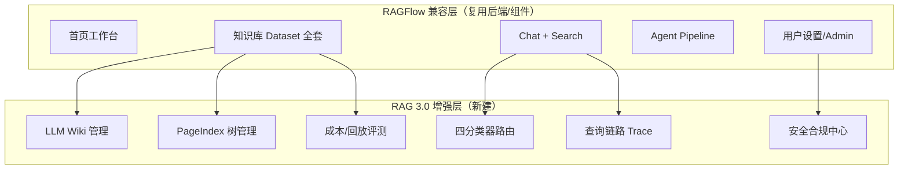

### 12.2 实施优先级

| 优先级 | 页面/模块 | 来源 | 工期估算 |
|--------|----------|------|---------|
| **P0** | 知识库配置（15种分块+GraphRAG） | RAGFlow | 2 周 |
| **P0** | 检索测试页 | RAGFlow | 1 周 |
| **P0** | 模型提供商 + 数据源 | RAGFlow | 2 周 |
| **P0** | KBDetailLayout + 侧栏子导航 | PRD v1.4 | 1 周 |
| **P0** | 知识库权限页 §3.10 | PRD | 0.5 周 |
| **P0** | 查询链路 Trace | RAG 3.0 | 1 周 |
| **P0** | Chat 设置侧栏 | RAGFlow | 1 周 |
| **P0** | 搜索应用（§10.6） | RAGFlow | 2 周 |
| **P0** | 回收站/导出/文档版本 | PRD | 1 周 |
| **P1** | Wiki Hub（浏览器+编译队列+设置+Git） | RAG 3.0 | 3 周 |
| **P1** | PageIndex Hub（概览+文档列表+单文档调试+设置） | RAG 3.0 | 2.5 周 |
| **P2** | 全局运营（首页 Widget + 监控 RAG3 Tab） | RAG 3.0 | 1 周 |
| **P1** | 四分类器 + 路由矩阵 | RAG 3.0 | 2 周 |
| **P1** | 知识图谱可视化 | RAGFlow | 1 周 |
| **P2** | Agent 画布扩展 | RAGFlow+RAG3 | 3 周 |
| **P2** | MCP / 团队 / API Key | RAGFlow | 1 周 |
| **P2** | 安全合规中心 | RAG 3.0 | 2 周 |
| **P2** | 成本中心 + 回放评测 | RAG 3.0 | 2 周 |
| **P3** | Memory / Skills / 分享嵌入 | RAGFlow 可选 | 按需 |

### 12.3 路由索引（摘要）

> **v1.4 起完整路由表以 §1.3 为唯一权威**，本节仅作快速索引。

| 模块 | 路由前缀 | 关键章节 |
|------|---------|---------|
| 首页 | `/` | §10.2 |
| 知识库列表/回收站 | `/kb`, `/kb/recycle-bin` | §3.1, §3.7 |
| 知识库详情 | `/kb/:kbId/*`（`KBDetailLayout`） | §10.3.1, §3–§3.10, §10.4–§10.10, §11.1–§11.2 |
| 搜索 / Agent | `/search/*`, `/agent/*` | §10.6–§10.7 |
| 对话 | `/chat/*` | §4 |
| 评测 | `/evaluation/*`（含 datasets/satisfaction/cost/replay/route-learning） | §5, §11.3.7, §11.5 |
| 系统 | `/system/*`（含 security/acl-simulator） | §6, §11.3–§11.4 |
| 公开页 | `/share/*`, `/document/:docId`, `/login` | §10.9 |

### 12.4 与架构文档的映射

| 架构章节 | 前端模块 |
|---------|---------|
| 第二部分 RAGFlow 详解 | §10 兼容层（配置/解析/分块/检索） |
| 第三部分 PageIndex | §11.2 PageIndex Hub + §14 全局运营 |
| 第四部分 LLM Wiki | §11.1 Wiki Hub + §14 全局运营 |
| 第五部分 分类器路由 | §11.3 分类器配置 |
| 第六部分 混合检索融合 | §10.5 检索测试 + §4.2 查询增强面板 |
| 第七部分 安全合规 | §11.4 安全合规中心 |
| 第八部分 评测可观测 | §5 + §11.5 成本/回放 |

---

## 13. 设计文档版本索引

> 各版本增量说明。当前最新版：**v1.5**。

### 13.1 PRD User Story 覆盖索引

| User Story | 章节 | 设计状态 | 引入版本 |
|-----------|------|---------|---------|
| US-1.2 上传暂停/恢复 | §3.3 上传队列 | ✅ ASCII + API + 流程图 | v1.5-beta |
| US-1.4 分块预览 | §3.5 + §3.5.1 | ✅ ASCII + 重叠高亮 | v1.5-gamma |
| US-1.5 索引暂停/恢复 | §3.6 | ✅ ASCII + API + 流程图 | v1.4 |
| US-1.6 知识库搜索 | §3.3.3 + §8.2/§8.3 | ✅ 性能策略 + API | v1.5-gamma |
| US-1.11 媒体处理 | §3.11 + §7.25 | ✅ ASCII + API + 组件 | v1.5-gamma |
| US-1.7 导出 | §3.8 | ✅ ASCII + API（非侧栏入口） | v1.2 |
| US-1.8 回收站 | §3.7 | ✅ ASCII + 流程 + API | v1.2 |
| US-1.9 运营排行榜 | §10.2 | ✅ ASCII | v1.4 |
| US-1.12 文档版本 | §3.9 | ✅ ASCII + API | v1.2 |
| US-2.10 高级检索语法 | §4.6 | ✅ ASCII + 流程 | v1.2 |
| US-2.12 答案对比 | §4.5 | ✅ ASCII + API | v1.2 |
| US-4.8 成本中心 | §11.5.1 | ✅ ASCII | v1.2 |
| US-4.9 满意度 | §5.5 | ✅ ASCII + API | v1.2 |
| US-4.10 评测数据集 | §5.4 | ✅ ASCII + API | v1.2 |
| US-4.12 回放评测 | §11.5.2 | ✅ ASCII | v1.2 |
| US-5.3 Prompt 模板 | §6.5 | ✅ ASCII | v1.2 |
| US-5.6 向量库切换 | §6.8 | ✅ 四步向导 | v1.2 |
| US-5.7 备份恢复 | §6.7 | ✅ ASCII | v1.2 |
| US-5.8 灰度发布 | §6.6 | ✅ ASCII | v1.2 |
| — 知识库权限（me/team + Chunk ACL） | §3.10 | ✅ ASCII + API | v1.4 |

### 13.2 RAGFlow 兼容层补全

| 模块 | 章节 | v1.1 → v1.2 |
|------|------|------------|
| Chat 设置侧栏 | §4.4 | 新增完整三大块面板 |
| 搜索应用 | §10.6 | 列表 + 主界面 + 设置 + API |
| Agent 编辑器 | §10.7 | 列表 + 画布 + Dataflow + 版本 |
| 用户设置 6 子页 | §10.8.1–10.8.6 | 各子页 ASCII |
| 登录/403/404/分享 | §10.9 | 登录 ASCII + 通用页表 |
| 知识库数据源/日志/图谱 | §10.10 | 三页 ASCII |
| 配置页标签/分块子表单 | §10.4 扩展 | 元数据 Tab + 15 种方法表 |

### 13.3 RAG 3.0 增强层补全

| 模块 | 章节 | v1.1 → v1.3 |
|------|------|------------|
| Wiki Hub（4 Tab + 全屏编辑/历史） | §11.1 | v1.3 Hub 壳层 + §11.1.6 统计 |
| PageIndex Hub（3 Tab + 单文档详情） | §11.2 | v1.3 库级概览/文档列表/设置 |
| 双层运营（库内管理+全局监控） | §14 | 首页 Widget + §6.4.2 RAG3 Tab |
| KBDetailLayout 左侧子导航 | §10.3.1 + §3.2 | 替代顶部 Tab |
| 四分类器子配置 | §11.3.3–11.3.6 | 各分类器独立 ASCII |
| 安全合规 4 子页 | §11.4.1–11.4.4 | 各子页 ASCII |
| 成本/回放/Trace | §11.5.1–11.5.3 | 各子页 ASCII |
| QueryTraceTimeline | §4.1 + §7.9 | 纳入对话消息 + 组件库 |

### 13.4 工程架构同步

| 同步项 | 章节 | 最新版本 |
|--------|------|---------|
| 顶层七模块侧边栏 + 系统子菜单 | §2.2 | **v1.5**（含 team/api/prompt/灰度/备份/向量库/security 子项） |
| KB 详情 11 项子导航 + 非侧栏入口说明 | §10.3 / §11.6 | **v1.5** |
| 目录结构 | §1.2 | v1.4 |
| 公共组件 | §7.9–§7.24 | v1.4 |
| **权威路由表** | **§1.3** | v1.4 |
| 路由快速索引 | §12.3 | v1.4 |
| 路由懒加载 + 代码分割 | §8.1 | **v1.5-beta** |
| React Query queryKey / 缓存 | §8.4 | **v1.5-beta** |
| Service 层示例（4+2） | 附录 B | **v1.5-beta** |
| 分类器 API 映射 | §11.3.1–§11.3.7 | **v1.5-beta** |
| 文件页完整 KBDetailLayout ASCII | §3.3.1 | **v1.5-beta** |
| 组件 Props / 状态机（ChunkMethod/KG/Agent/Media） | §7.10/§7.14/§7.15/§7.25 | **v1.5-gamma** |
| US-1.6 搜索性能 / US-1.11 媒体层 | §3.3.3 / §3.11 | **v1.5-gamma** |
| parser_config Schema / MCP 沙箱 / 分享嵌入 | 附录 C / §10.8.3.1 / §10.9.4 | **v1.5-gamma** |

### 13.5 仍待深化（P3 / 按需）

以下模块标记为可选或依赖 RAGFlow 源码逐项对齐，**不阻塞 P0–P2 前端脚手架**：

- Memory / Skills 可选模块（P3，对照表 §1 #6–8）
- RAGFlow 源码级 `parser_config` 字段微调（实现时 diff `ragflow_rag30/web` ChunkMethodForm）
- HTML 原型同步（用户选择暂缓）

---

## 14. v1.3 PageIndex & Wiki 双层 Hub

> v1.3 采纳方案 C：**库内 Hub 管理 + 全局运营看板**，服务知识库管理员（C-库内）与平台管理员（C-跨库）双角色。完整 spec 见 `docs/superpowers/specs/2026-06-06-pageindex-wiki-hub-design.md`。

### 14.1 双层架构

```mermaid
flowchart TB
    subgraph 库内管理["库内管理域（知识库管理员）"]
        W1["/kb/:kbId/wiki/*<br/>Wiki Hub"]
        P1["/kb/:kbId/pageindex/*<br/>PageIndex Hub"]
    end
    subgraph 全局运营["全局运营域（平台管理员）"]
        H1["首页 Widget<br/>§10.2"]
        M1["/system/monitor?tab=rag3-index<br/>§6.4"]
    end
    subgraph 只读仪表盘["只读进度（两类用户）"]
        I1["/kb/:kbId/index-status<br/>§3.6"]
    end
    I1 -->|管理→| W1 & P1
    H1 & M1 -->|进入库 深链| W1 & P1
```

| 页面 | 职责 | 写操作 |
|------|------|--------|
| §3.6 索引状态 | 五维索引进度卡片（含 PageIndex/Wiki） | 卡片级重试/编译 |
| Wiki Hub §11.1 | 浏览/编辑/编译队列/审核/Git | ✅ |
| PageIndex Hub §11.2 | 概览/文档列表/单文档调试/批量重建 | ✅ |
| 首页 Widget §10.2 | 跨库编译中/待审核/失败计数 | ❌ |
| 系统监控 RAG3 Tab §6.4 | 跨库 Wiki/PageIndex/图谱进度表 | ❌ |

### 14.2 全局运营深链规则

| 来源 | 条件 | 跳转目标 |
|------|------|---------|
| 首页 Widget | 查看全部 | `/system/monitor?tab=rag3-index` |
| 系统监控 | Wiki 告警 | `/kb/:kbId/wiki/compile?status=failed` |
| 系统监控 | Wiki 待审核 | `/kb/:kbId/wiki/compile?status=pending_review` |
| 系统监控 | PageIndex 失败 | `/kb/:kbId/pageindex/documents?filter=failed` |
| §3.6 卡片 | PageIndex 管理→ | `/kb/:kbId/pageindex` |
| §3.6 卡片 | Wiki 管理→ | `/kb/:kbId/wiki` |

### 14.3 v1.3 变更摘要

| 变更项 | 章节 |
|--------|------|
| Wiki 包装为 Hub Tab 容器 | §11.1 |
| Wiki Hub 4 Tab + 统计 §11.1.6 | §11.1 |
| PageIndex Hub 3 Tab + 单文档详情 | §11.2 |
| KBDetailLayout 左侧子导航 | §10.3.1 + §3.2 |
| 侧栏 `pageindex-tree` → `pageindex` | §10.3 |
| §3.6 卡片管理深链 + 联动流程图 | §3.6 |
| 首页 RAG3 Widget | §10.2 |
| 系统监控 RAG3索引 Tab 独立 ASCII | §6.4.2 |
| Hub 壳层组件 WikiHubPage / PageIndexHubPage | §7.21–§7.23 |
| 权威路由表 | §1.3（v1.4） |
| 废弃 `pageindex-tree` 重定向 | §1.3 |

### 14.4 全局 API（增补）

| 操作 | 方法 | API 端点 |
|------|------|---------|
| 跨库索引聚合 | GET | `/api/v1/admin/index-status/aggregate` |

---

## 15. v1.4 文档一致性优化

> v1.4 落实文档审查 P0–P2 全部优化项。

### 15.1 v1.4 变更清单

| 类别 | 变更 |
|------|------|
| **P0 路由** | §1.3 合并完整路由 + `KBDetailLayout` 嵌套；§12.3 改为索引 |
| **P0 布局** | §3.3–§3.6、§10.4–§10.10 统一「继承 §10.3.1」约定 |
| **P0 权限** | 新增 §3.10 知识库权限页 |
| **P1 ASCII** | §6.4.3/6.4.4；§11.3.4–11.3.7；§10.9 403/404/分享 |
| **P1 PRD** | §10.2 排行榜；§3.6 暂停/恢复；§3.3 上传暂停 |
| **P2 工程** | §1.2 stores/services/types；§7.24 KBSubNav；附录类型 |

### 15.2 仍待实现阶段深化

见 §13.5（Agent 节点表单、parser_config Schema、MCP 沙箱等）。

---

## 16. v1.5-alpha 元数据与导航同步

> v1.5-alpha 落实第二轮文档审查中的**元数据一致性**项，不涉及 HTML 原型。

### 16.1 v1.5-alpha 变更清单

| 类别 | 变更 |
|------|------|
| **§13 索引** | §13.1 扩展为完整 User Story 索引（含 US-1.2/1.5/1.9、§3.10）；§13.4 更新至 v1.5 |
| **§2.2 导航** | `navConfig` 补齐 team/api/prompt-templates/gray-release/backup/vector-db-switch；security 展开 4 子项 |
| **§10.3 侧栏** | 补「概览」为首项；明确导出/回收站为非侧栏入口策略 |
| **总索引** | `docs/prd/README.md` 同步前端方案 v1.5 与关联文档 |

### 16.2 v1.5-beta 计划

见 §17（本版已落实）。

---

## 17. v1.5-beta 工程深化

> v1.5-beta 落实第二轮审查中的**可落地性**项：API 映射、工程示例、完整布局范例。

### 17.1 v1.5-beta 变更清单

| 类别 | 变更 |
|------|------|
| **§3.3** | 新增 §3.3.1 完整 KBDetailLayout 文件页 ASCII；上传/解析 pause API + 流程图 |
| **§11.3** | §11.3.1–§11.3.7 补全分类器与路由在线学习 API 映射表 |
| **§8.1** | 对齐 §1.3 `lazyPage` + Hub 嵌套懒加载 + 代码分割策略表 |
| **§8.4** | 增补 `queryKeys`（wiki/pageindex/classifier）与 Hub 轮询缓存策略 |
| **附录 B** | 补 `wikiService` / `pageIndexService` / `indexStatusService` / `evalService` |

### 17.2 v1.5-gamma 计划

见 §18（本版已落实）。

---

## 18. v1.5-gamma 实现前深化

> v1.5-gamma 补齐**实现前设计债**：核心组件 Props/状态机、PRD 缺口 User Story、parser_config / MCP / 分享嵌入。

### 18.1 v1.5-gamma 变更清单

| 类别 | 变更 |
|------|------|
| **§3.3.3** | US-1.6 文档搜索筛选 + 10 万规模性能策略（服务端分页/虚拟滚动/debounce） |
| **§3.5.1** | US-1.4 相邻 Chunk 重叠高亮交互 |
| **§3.11** | US-1.11 媒体预览层 ASCII + API + `MediaPreviewLayer` |
| **§7.10** | ChunkMethodForm Props、状态机、15 种 parser_config 字段表 |
| **§7.14** | KnowledgeGraphView Props + 性能上限 |
| **§7.15** | AgentCanvas 状态机 + 10 类节点属性表单表 |
| **§7.25** | 新增 MediaPreviewLayer 组件 |
| **附录 C** | `parser_config` discriminated union TypeScript 摘要 |
| **§10.4** | 15 种分块方法表补全 |
| **§10.8.3.1** | MCP WebSocket 调试沙箱 ASCII + API |
| **§10.9.4** | 分享 iframe / widget 嵌入模式 |
| **§13.5** | 缩减为 P3 待办 |

### 18.2 文档版本里程碑

v1.5 系列（alpha → beta → gamma）完成后，前端方案文档**可进入脚手架实现阶段**；后续增量以 PR 驱动更新 §1.3 路由与对照表即可。

---

> **文档结束（v1.5）**
>
> 本文档为 RAG 3.0 知识库系统的前端界面实现方案。
>
> - **v1.0**：§1–§9 核心四模块（知识库/对话/评测/系统）
> - **v1.1**：§10 RAGFlow 兼容层 + §11 RAG 3.0 增强层 + §12 融合架构
> - **v1.2**：补全缺口页面 ASCII 设计；同步 §1.2/§2.2/§7 组件库
> - **v1.3**：PageIndex & Wiki 双层 Hub（§11.1/§11.2 重构 + §14）；全局运营 Widget/监控 Tab
> - **v1.4**：文档一致性优化（§1.3 权威路由、§3.10 权限、KB 子页布局统一、§15 变更索引）
> - **v1.5-alpha**：元数据与导航同步（§13 索引、§2.2 navConfig、§10.3 侧栏树、§16）
> - **v1.5-beta**：工程深化（§3.3 API/完整 ASCII、§11.3 API、§8.1/§8.4、附录 B、§17）
> - **v1.5-gamma**：实现前深化（§3.3.3/§3.5.1/§3.11、§7.10/§7.14/§7.15/§7.25、附录 C、MCP/分享嵌入、§18）
>
> 完整对照表见 `RAGFlow前端对照表.md`（v1.5）；Hub 设计 spec 见 `docs/superpowers/specs/2026-06-06-pageindex-wiki-hub-design.md`。
