# 前端界面实现方案：企业级RAG 3.0知识库系统

> **文档编号**：FE-RAG3.0-20260606
> **版本**：v1.1
> **编制日期**：2026年6月6日
> **编制部门**：AI平台事业部
> **关联文档**：TAD-技术架构设计.md / API-RAG3.0-接口设计.md / PRD-产品需求文档.md / DBD-数据库设计.md

---

## 目录

1. [技术栈与工程架构](#1-技术栈与工程架构)
2. [全局布局与导航设计](#2-全局布局与导航设计)
3. [知识库管理模块](#3-知识库管理模块)
4. [智能对话模块](#4-智能对话模块)
5. [评测中心模块](#5-评测中心模块)
6. [系统管理模块](#6-系统管理模块)
7. [公共组件库](#7-公共组件库)
8. [前端性能优化](#8-前端性能优化)
9. [前端安全](#9-前端安全)
10. [RAGFlow兼容层](#10-ragflow兼容层)
11. [RAG 3.0增强层](#11-rag-30增强层)
12. [融合信息架构与实施优先级](#12-融合信息架构与实施优先级)

---

## 1. 技术栈与工程架构

### 1.1 技术栈选型

| 类别 | 技术选型 | 版本 | 选型理由 |
|------|----------|------|----------|
| **UI框架** | React | 18.3+ | 生态成熟、并发渲染、Suspense支持、团队经验丰富 |
| **类型系统** | TypeScript | 5.4+ | 类型安全、IDE智能提示、减少运行时错误 |
| **组件库** | Ant Design | 5.x | 企业级组件丰富、开箱即用、主题定制强 |
| **状态管理** | Zustand | 4.5+ | 轻量（~1KB）、无Provider包裹、支持中间件、TypeScript友好 |
| **数据请求** | TanStack React Query | 5.x | 缓存/重试/轮询/分页/SSE内置、自动后台刷新 |
| **路由** | React Router | 6.20+ | 嵌套路由、数据Loader、懒加载支持 |
| **构建工具** | Vite | 5.x | HMR极快（<50ms）、ESBuild预构建、Rollup生产包 |
| **图表库** | ECharts | 5.5+ | 丰富图表类型、大数据量渲染、深色主题支持 |
| **HTTP客户端** | Axios | 1.7+ | 拦截器、请求取消、重试机制 |
| **代码规范** | ESLint + Prettier | 最新 | 统一代码风格 |
| **测试** | Vitest + React Testing Library | 最新 | Vite原生集成、组件级测试 |

### 1.2 项目目录结构

```
rag3-web/
├── public/
│   ├── favicon.ico
│   └── locales/                  # 静态国际化资源
│       ├── zh-CN.json
│       └── en-US.json
├── src/
│   ├── components/               # 公共组件
│   │   ├── KnowledgeBaseSelector/
│   │   │   └── index.tsx
│   │   ├── DocumentUploader/
│   │   │   └── index.tsx
│   │   ├── CitationCard/
│   │   │   └── index.tsx
│   │   ├── QueryClassifierBadge/
│   │   │   └── index.tsx
│   │   ├── PipelineStatusTag/
│   │   │   └── index.tsx
│   │   ├── ChunkPreviewCard/
│   │   │   └── index.tsx
│   │   ├── ConfidenceGauge/
│   │   │   └── index.tsx
│   │   ├── StreamingMessage/
│   │   │   └── index.tsx
│   │   └── Layout/               # 全局布局组件
│   │       ├── AppLayout.tsx
│   │       ├── Sidebar.tsx
│   │       ├── TopBar.tsx
│   │       └── StatusBar.tsx
│   ├── pages/                    # 页面组件
│   │   ├── KnowledgeBase/        # 知识库管理
│   │   │   ├── ListPage.tsx
│   │   │   ├── DetailPage.tsx
│   │   │   ├── DocumentPage.tsx
│   │   │   ├── ParsePreviewPage.tsx
│   │   │   ├── ChunkPreviewPage.tsx
│   │   │   └── IndexStatusPage.tsx
│   │   ├── Chat/                 # 智能对话
│   │   │   ├── ChatPage.tsx
│   │   │   ├── ConversationList.tsx
│   │   │   ├── MessageArea.tsx
│   │   │   └── QueryEnhancePanel.tsx
│   │   ├── Evaluation/           # 评测中心
│   │   │   ├── DashboardPage.tsx
│   │   │   ├── TaskPage.tsx
│   │   │   └── ABTestPage.tsx
│   │   ├── System/               # 系统管理
│   │   │   ├── UserManagePage.tsx
│   │   │   ├── RoleManagePage.tsx
│   │   │   ├── PipelineConfigPage.tsx
│   │   │   ├── AuditLogPage.tsx
│   │   │   └── MonitorPage.tsx
│   │   ├── Login/                # 登录
│   │   │   └── LoginPage.tsx
│   │   └── NotFound/             # 404
│   │       └── index.tsx
│   ├── stores/                   # Zustand状态管理
│   │   ├── useAuthStore.ts       # 认证状态
│   │   ├── useKBStore.ts         # 知识库状态
│   │   ├── useChatStore.ts       # 对话状态
│   │   ├── useUIStore.ts         # UI状态（侧边栏折叠/主题等）
│   │   └── useEvalStore.ts       # 评测状态
│   ├── services/                 # API请求封装
│   │   ├── api.ts                # Axios实例+拦截器
│   │   ├── kbService.ts          # 知识库API
│   │   ├── docService.ts         # 文档API
│   │   ├── chatService.ts        # 对话API（含SSE）
│   │   ├── evalService.ts        # 评测API
│   │   ├── authService.ts        # 认证API
│   │   └── systemService.ts      # 系统管理API
│   ├── hooks/                    # 自定义Hooks
│   │   ├── useSSE.ts             # SSE流式连接Hook
│   │   ├── usePermission.ts      # 权限检查Hook
│   │   ├── useDebounce.ts        # 防抖Hook
│   │   └── useVirtualList.ts     # 虚拟列表Hook
│   ├── utils/                    # 工具函数
│   │   ├── format.ts             # 格式化（日期/大小/数字）
│   │   ├── sanitize.ts           # XSS清洗
│   │   ├── token.ts              # JWT Token管理
│   │   └── constants.ts          # 全局常量
│   ├── types/                    # TypeScript类型定义
│   │   ├── api.ts                # API响应类型
│   │   ├── kb.ts                 # 知识库相关类型
│   │   ├── chat.ts               # 对话相关类型
│   │   ├── eval.ts               # 评测相关类型
│   │   └── system.ts             # 系统管理类型
│   ├── styles/                   # 全局样式
│   │   ├── theme.ts              # Ant Design主题Token
│   │   ├── global.css            # 全局CSS
│   │   └── variables.css         # CSS变量
│   ├── router/                   # 路由配置
│   │   ├── index.tsx             # 路由表
│   │   └── guards.tsx            # 路由守卫
│   ├── App.tsx                   # 根组件
│   └── main.tsx                  # 入口文件
├── .env                          # 环境变量
├── .env.production               # 生产环境变量
├── vite.config.ts                # Vite配置
├── tsconfig.json                 # TypeScript配置
└── package.json
```

### 1.3 路由设计

采用React Router v6嵌套路由+路由表配置模式：

```typescript
// src/router/index.tsx
import { lazy, Suspense } from 'react';
import { createBrowserRouter, Navigate } from 'react-router-dom';
import { AuthGuard, PermissionGuard } from './guards';
import AppLayout from '@/components/Layout/AppLayout';

// 路由懒加载
const KBListPage = lazy(() => import('@/pages/KnowledgeBase/ListPage'));
const KBDetailPage = lazy(() => import('@/pages/KnowledgeBase/DetailPage'));
const DocumentPage = lazy(() => import('@/pages/KnowledgeBase/DocumentPage'));
const ParsePreviewPage = lazy(() => import('@/pages/KnowledgeBase/ParsePreviewPage'));
const ChunkPreviewPage = lazy(() => import('@/pages/KnowledgeBase/ChunkPreviewPage'));
const IndexStatusPage = lazy(() => import('@/pages/KnowledgeBase/IndexStatusPage'));
const ChatPage = lazy(() => import('@/pages/Chat/ChatPage'));
const EvalDashboard = lazy(() => import('@/pages/Evaluation/DashboardPage'));
const EvalTaskPage = lazy(() => import('@/pages/Evaluation/TaskPage'));
const ABTestPage = lazy(() => import('@/pages/Evaluation/ABTestPage'));
const UserManagePage = lazy(() => import('@/pages/System/UserManagePage'));
const RoleManagePage = lazy(() => import('@/pages/System/RoleManagePage'));
const PipelineConfigPage = lazy(() => import('@/pages/System/PipelineConfigPage'));
const AuditLogPage = lazy(() => import('@/pages/System/AuditLogPage'));
const MonitorPage = lazy(() => import('@/pages/System/MonitorPage'));
const LoginPage = lazy(() => import('@/pages/Login/LoginPage'));

export const router = createBrowserRouter([
  {
    path: '/login',
    element: <LoginPage />,
  },
  {
    path: '/',
    element: <AuthGuard><AppLayout /></AuthGuard>,
    children: [
      { index: true, element: <Navigate to="/kb" replace /> },
      // 知识库管理
      {
        path: 'kb',
        children: [
          { index: true, element: <KBListPage /> },
          { path: ':kbId', element: <KBDetailPage /> },
          { path: ':kbId/documents', element: <DocumentPage /> },
          { path: ':kbId/documents/:docId/parse', element: <ParsePreviewPage /> },
          { path: ':kbId/documents/:docId/chunks', element: <ChunkPreviewPage /> },
          { path: ':kbId/index-status', element: <IndexStatusPage /> },
        ],
      },
      // 智能对话
      {
        path: 'chat',
        children: [
          { index: true, element: <ChatPage /> },
          { path: ':convId', element: <ChatPage /> },
        ],
      },
      // 评测中心
      {
        path: 'evaluation',
        element: <PermissionGuard requiredPermission="eval:read"><Suspense fallback={<></>}><Outlet /></Suspense></PermissionGuard>,
        children: [
          { index: true, element: <EvalDashboard /> },
          { path: 'tasks', element: <EvalTaskPage /> },
          { path: 'ab-test', element: <ABTestPage /> },
        ],
      },
      // 系统管理
      {
        path: 'system',
        element: <PermissionGuard requiredRole="platform_admin"><Suspense fallback={<></>}><Outlet /></Suspense></PermissionGuard>,
        children: [
          { path: 'users', element: <UserManagePage /> },
          { path: 'roles', element: <RoleManagePage /> },
          { path: 'pipeline', element: <PipelineConfigPage /> },
          { path: 'audit', element: <AuditLogPage /> },
          { path: 'monitor', element: <MonitorPage /> },
        ],
      },
    ],
  },
]);
```

路由守卫设计：

```typescript
// src/router/guards.tsx
export function AuthGuard({ children }: { children: ReactNode }) {
  const token = useAuthStore(s => s.token);
  if (!token) return <Navigate to="/login" replace />;
  return <>{children}</>;
}

export function PermissionGuard({
  children,
  requiredPermission,
  requiredRole,
}: {
  children: ReactNode;
  requiredPermission?: string;
  requiredRole?: string;
}) {
  const { permissions, roles } = useAuthStore();
  if (requiredPermission && !permissions.includes(requiredPermission)) {
    return <Result status="403" title="无访问权限" />;
  }
  if (requiredRole && !roles.includes(requiredRole)) {
    return <Result status="403" title="角色权限不足" />;
  }
  return <>{children}</>;
}
```

### 1.4 主题与国际化方案

#### 主题定制

基于Ant Design 5的Design Token体系：

```typescript
// src/styles/theme.ts
import type { ThemeConfig } from 'antd';

export const lightTheme: ThemeConfig = {
  token: {
    colorPrimary: '#1677ff',
    borderRadius: 6,
    fontSize: 14,
    colorBgContainer: '#ffffff',
    colorBgLayout: '#f5f5f5',
  },
  components: {
    Menu: { itemBg: 'transparent', subMenuItemBg: 'transparent' },
    Card: { borderRadiusLG: 8 },
  },
};

export const darkTheme: ThemeConfig = {
  token: {
    colorPrimary: '#1668dc',
    colorBgContainer: '#141414',
    colorBgLayout: '#000000',
    colorText: 'rgba(255,255,255,0.85)',
  },
};
```

#### 国际化

采用`react-i18next`+ Ant Design的`ConfigProvider`双层国际化：

```typescript
// 国际化初始化（src/main.tsx片段）
import i18n from 'i18next';
import { initReactI18next } from 'react-i18next';
import zhCN from 'antd/locale/zh_CN';
import enUS from 'antd/locale/en_US';

i18n.use(initReactI18next).init({
  resources: {
    'zh-CN': { translation: await import('/public/locales/zh-CN.json') },
    'en-US': { translation: await import('/public/locales/en-US.json') },
  },
  lng: localStorage.getItem('lang') || 'zh-CN',
  fallbackLng: 'zh-CN',
  interpolation: { escapeValue: false },
});

// Ant Design语言包映射
const antdLocales: Record<string, typeof zhCN> = { 'zh-CN': zhCN, 'en-US': enUS };
```

---

## 2. 全局布局与导航设计

### 2.1 主布局结构

```
┌──────────────────────────────────────────────────────────────────────┐
│ TopBar [搜索框]            [通知🔔] [帮助❓] [用户头像▼] [语言🌐]  │
├────────┬─────────────────────────────────────────────────────────────┤
│        │                                                             │
│ Side   │  Content Area                                              │
│ bar    │                                                             │
│        │  ┌─────────────────────────────────────────────────────┐   │
│ ┌────┐ │  │  Breadcrumb / Page Header                           │   │
│ │KB  │ │  ├─────────────────────────────────────────────────────┤   │
│ │管理│ │  │                                                     │   │
│ ├────┤ │  │  Main Content                                       │   │
│ │智能│ │  │                                                     │   │
│ │对话│ │  │                                                     │   │
│ ├────┤ │  │                                                     │   │
│ │评测│ │  │                                                     │   │
│ │中心│ │  │                                                     │   │
│ ├────┤ │  │                                                     │   │
│ │系统│ │  │                                                     │   │
│ │管理│ │  └─────────────────────────────────────────────────────┘   │
│ └────┘ │                                                             │
│        ├─────────────────────────────────────────────────────────────┤
│        │ StatusBar [连接状态●] [版本v1.0] [环境:PROD] [耗时120ms]   │
├────────┴─────────────────────────────────────────────────────────────┤
│ Footer © 2026 RAG 3.0 Knowledge Base System                        │
└──────────────────────────────────────────────────────────────────────┘
```

### 2.2 侧边栏导航菜单

```typescript
// src/components/Layout/Sidebar.tsx — 菜单配置
interface NavItem {
  key: string;
  label: string;         // i18n key
  icon: ReactNode;
  path: string;
  permission?: string;   // 需要的权限
  children?: NavItem[];
}

const navConfig: NavItem[] = [
  {
    key: 'kb',
    label: 'nav.knowledgeBase',
    icon: <DatabaseOutlined />,
    path: '/kb',
  },
  {
    key: 'chat',
    label: 'nav.smartChat',
    icon: <MessageOutlined />,
    path: '/chat',
  },
  {
    key: 'evaluation',
    label: 'nav.evaluation',
    icon: <DashboardOutlined />,
    path: '/evaluation',
    permission: 'eval:read',
  },
  {
    key: 'system',
    label: 'nav.system',
    icon: <SettingOutlined />,
    path: '/system',
    permission: 'system:read',
    children: [
      { key: 'system-users', label: 'nav.users', icon: <TeamOutlined />, path: '/system/users' },
      { key: 'system-roles', label: 'nav.roles', icon: <SafetyOutlined />, path: '/system/roles' },
      { key: 'system-pipeline', label: 'nav.pipeline', icon: <ApartmentOutlined />, path: '/system/pipeline' },
      { key: 'system-audit', label: 'nav.audit', icon: <FileSearchOutlined />, path: '/system/audit' },
      { key: 'system-monitor', label: 'nav.monitor', icon: <MonitorOutlined />, path: '/system/monitor' },
    ],
  },
];
```

权限驱动菜单可见性：

```typescript
// 根据用户权限过滤菜单
function filterNavByPermission(items: NavItem[], permissions: string[]): NavItem[] {
  return items
    .filter(item => !item.permission || permissions.includes(item.permission))
    .map(item => ({
      ...item,
      children: item.children ? filterNavByPermission(item.children, permissions) : undefined,
    }));
}
```

### 2.3 顶部栏

```typescript
// src/components/Layout/TopBar.tsx — 功能设计
interface TopBarProps {
  onSearch: (query: string) => void;  // 全局搜索回调
}

// 功能列表：
// 1. 全局搜索框 — 搜索知识库/文档/对话历史，Ant Design AutoComplete组件
// 2. 通知铃铛 — Popover展示最新通知（解析完成/评测报告/A/B测试结果）
// 3. 帮助按钮 — 打开帮助文档/反馈入口
// 4. 用户菜单 — 头像+下拉（个人信息/主题切换/语言切换/退出登录）
// 5. 面包屑 — 根据当前路由自动生成
```

### 2.4 底部状态栏

```typescript
// src/components/Layout/StatusBar.tsx
// 展示内容：
// - WebSocket/SSE连接状态指示灯（绿色=连接/红色=断开/黄色=重连中）
// - 当前环境标识（DEV/STAGING/PROD）
// - 系统版本号
// - 最近一次API请求耗时
// - GPU利用率（如有权限）
```

### 2.5 布局状态管理

```typescript
// src/stores/useUIStore.ts
import { create } from 'zustand';
import { persist } from 'zustand/middleware';

interface UIState {
  sidebarCollapsed: boolean;
  theme: 'light' | 'dark';
  locale: 'zh-CN' | 'en-US';
  toggleSidebar: () => void;
  setTheme: (theme: 'light' | 'dark') => void;
  setLocale: (locale: 'zh-CN' | 'en-US') => void;
}

export const useUIStore = create<UIState>()(
  persist(
    (set) => ({
      sidebarCollapsed: false,
      theme: 'light',
      locale: 'zh-CN',
      toggleSidebar: () => set((s) => ({ sidebarCollapsed: !s.sidebarCollapsed })),
      setTheme: (theme) => set({ theme }),
      setLocale: (locale) => set({ locale }),
    }),
    { name: 'rag3-ui-settings' }  // 持久化到localStorage
  )
);
```

### 2.6 全局布局交互流程

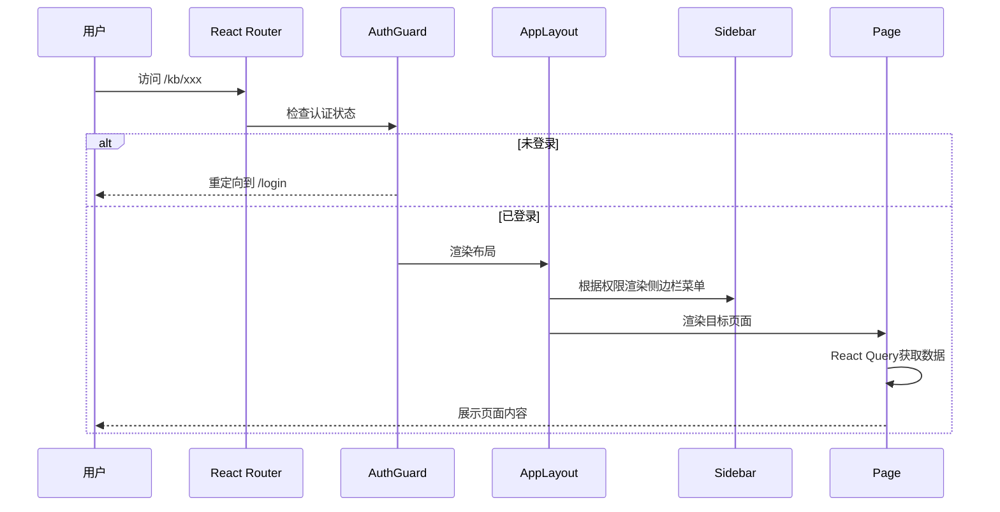

---

## 3. 知识库管理模块

### 3.1 知识库列表页

#### 页面布局

```
┌─────────────────────────────────────────────────────────────────┐
│ 知识库管理                                    [+ 创建知识库]   │
├─────────────────────────────────────────────────────────────────┤
│ [搜索知识库...]  [状态▼] [排序▼]                📊视图切换     │
├─────────────────────────────────────────────────────────────────┤
│ ┌──────────┐ ┌──────────┐ ┌──────────┐ ┌──────────┐          │
│ │ 📚 法务  │ │ 📊 财务  │ │ 🔬 研发  │ │ 📋 合规  │          │
│ │ 合同知识库│ │ 报告知识库│ │ 文档知识库│ │ 政策知识库│          │
│ │          │ │          │ │          │ │          │          │
│ │ 156 文档 │ │ 89 文档  │ │ 234 文档 │ │ 45 文档  │          │
│ │ 12,840块 │ │ 6,230块  │ │ 18,500块 │ │ 3,200块  │          │
│ │          │ │          │ │          │ │          │          │
│ │ ● 活跃   │ │ ● 索引中 │ │ ● 活跃   │ │ ● 活跃   │          │
│ │ 更新2小时前│ │ 更新5分钟前│ │ 更新1天前│ │ 更新3天前│          │
│ │ [⋮ 更多] │ │ [⋮ 更多] │ │ [⋮ 更多] │ │ [⋮ 更多] │          │
│ └──────────┘ └──────────┘ └──────────┘ └──────────┘          │
│                                                                 │
│ ┌──────────┐ ┌──────────┐                                     │
│ │ 📖 培训  │ │ 🏗️ 产品  │   ...                              │
│ │ 材料知识库│ │ 手册知识库│                                     │
│ │ ...      │ │ ...      │                                     │
│ └──────────┘ └──────────┘                                     │
├─────────────────────────────────────────────────────────────────┤
│                       < 1 2 3 ... 8 >                          │
└─────────────────────────────────────────────────────────────────┘
```

#### 创建/编辑知识库对话框

```
┌─────────────────────────────────────────┐
│ 创建知识库                          [×] │
├─────────────────────────────────────────┤
│                                         │
│  知识库名称 *                           │
│  ┌─────────────────────────────────┐   │
│  │ 输入知识库名称（2-50字符）       │   │
│  └─────────────────────────────────┘   │
│                                         │
│  描述                                   │
│  ┌─────────────────────────────────┐   │
│  │ 输入描述（选填，最多200字符）    │   │
│  └─────────────────────────────────┘   │
│                                         │
│  默认语言        默认分块策略            │
│  [中文 ▼]       [通用分块 ▼]           │
│                                         │
│  嵌入模型        LLM模型                │
│  [BGE-M3 ▼]     [DeepSeek-v4 ▼]       │
│                                         │
│  Reranker模型                           │
│  [BGE-Reranker-v2-m3 ▼]               │
│                                         │
│         [取消]  [创建]                  │
└─────────────────────────────────────────┘
```

#### 关键交互流程

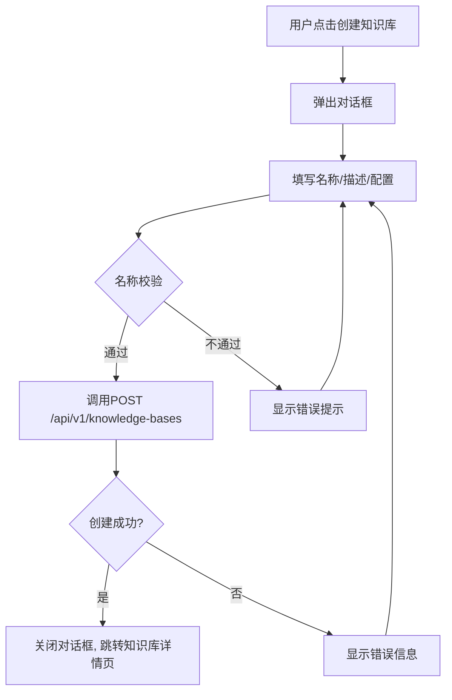

#### 状态管理设计

```typescript
// src/stores/useKBStore.ts
interface KBState {
  kbList: KnowledgeBase[];
  total: number;
  loading: boolean;
  currentKB: KnowledgeBase | null;
  // Actions由React Query管理，Store仅保存UI状态
  setCurrentKB: (kb: KnowledgeBase | null) => void;
}
```

#### API调用映射

| 操作 | 方法 | API端点 | React Query Key |
|------|------|---------|-----------------|
| 获取列表 | GET | `/api/v1/knowledge-bases` | `['kb-list', {page, pageSize, status, search}]` |
| 创建知识库 | POST | `/api/v1/knowledge-bases` | invalidate `['kb-list']` |
| 获取详情 | GET | `/api/v1/knowledge-bases/{kb_id}` | `['kb-detail', kbId]` |
| 更新知识库 | PUT | `/api/v1/knowledge-bases/{kb_id}` | invalidate `['kb-detail', kbId]` |
| 删除知识库 | DELETE | `/api/v1/knowledge-bases/{kb_id}` | invalidate `['kb-list']` |
| 获取统计 | GET | `/api/v1/knowledge-bases/{kb_id}/stats` | `['kb-stats', kbId, period]` |

---

### 3.2 知识库详情页

#### 页面布局（Tab切换）

```
┌─────────────────────────────────────────────────────────────────┐
│ ← 返回  法务合同知识库                                    [⋮]  │
├─────────────────────────────────────────────────────────────────┤
│ [概览]  [文档]  [索引状态]  [权限]  [设置]                     │
├─────────────────────────────────────────────────────────────────┤
│                                                                 │
│  ┌──────────┐ ┌──────────┐ ┌──────────┐ ┌──────────┐         │
│  │ 📄 156   │ │ 📦 12,840│ │ 💾 500MB │ │ ⭐ 92.5  │         │
│  │ 文档总数 │ │ Chunk数  │ │ 存储大小 │ │ 解析质量 │         │
│  └──────────┘ └──────────┘ └──────────┘ └──────────┘         │
│                                                                 │
│  ┌────────────────────────┐  ┌─────────────────────────┐      │
│  │ 近30天查询趋势         │  │ 文档类型分布             │      │
│  │ ╱╲    ╱╲              │  │ ██████ PDF: 85          │      │
│  │╱  ╲╱╱  ╲╱╲            │  │ ████ DOCX: 42          │      │
│  │           ╲            │  │ ██ XLSX: 18            │      │
│  └────────────────────────┘  └─────────────────────────┘      │
│                                                                 │
│  最近上传                           高频查询                    │
│  ┌─────────────────────────┐     ┌─────────────────────────┐  │
│  │ 📄 合同模板V5.pdf  2h前│     │ 供应商违约金条款 143次  │  │
│  │ 📄 审查报告.pdf    1d前│     │ 知识产权归属模板 98次   │  │
│  │ 📊 财务数据.xlsx   2d前│     │ ...                      │  │
│  └─────────────────────────┘     └─────────────────────────┘  │
│                                                                 │
└─────────────────────────────────────────────────────────────────┘
```

---

### 3.3 文档管理页

#### 页面布局

```
┌─────────────────────────────────────────────────────────────────┐
│ 法务合同知识库 > 文档管理                       [+ 上传] [🔗URL] │
├─────────────────────────────────────────────────────────────────┤
│ ┌─────────────────────────────────────────────────────────────┐ │
│ │                                                             │ │
│ │         📂 拖拽文件至此处，或点击选择文件                    │ │
│ │                                                             │ │
│ │    支持 PDF/DOCX/PPTX/XLSX/CSV/TXT/MD/HTML 等16+格式      │ │
│ │    单文件上限 100MB，批量上传最多100个                       │ │
│ │                                                             │ │
│ └─────────────────────────────────────────────────────────────┘ │
├─────────────────────────────────────────────────────────────────┤
│ 上传队列 (3/5) ──────────────────────────── [清空已完成]       │
│ ┌──────────────────┬──────────┬──────────┬─────────┐          │
│ │ 文件名           │ 大小     │ 进度     │ 状态    │          │
│ ├──────────────────┼──────────┼──────────┼─────────┤          │
│ │ 合同模板V6.pdf   │ 2.3MB    │ ████████ │ ✅完成  │          │
│ │ 审计报告.pdf     │ 5.0MB    │ ████░░░░ │ 🔄解析中│          │
│ │ 数据表.xlsx      │ 1.2MB    │ ██░░░░░░ │ ⬆上传中 │          │
│ └──────────────────┴──────────┴──────────┴─────────┘          │
├─────────────────────────────────────────────────────────────────┤
│ [搜索文档...]  [类型▼] [状态▼] [标签▼]       [批量操作▼]      │
├─────────────────────────────────────────────────────────────────┤
│ ☐ │ 📄 供应商合同模板V5.pdf │ 2.3MB │ PDF │ ✅已解析 │ 96分 │ ⋮│
│ ☐ │ 📄 2024合规审查报告.pdf │ 5.0MB │ PDF │ ✅已解析 │ 94分 │ ⋮│
│ ☐ │ 📄 采购协议条款.docx   │ 1.0MB │ DOCX│ 🔄解析中 │  --  │ ⋮│
│ ☐ │ 📊 财务数据Q2.xlsx     │ 0.8MB │ XLSX│ ❌失败   │  --  │ ⋮│
├─────────────────────────────────────────────────────────────────┤
│                       < 1 2 3 ... 8 >                          │
└─────────────────────────────────────────────────────────────────┘
```

#### 上传组件交互流程

```mermaid
flowchart TD
    A[拖拽/选择文件] --> B{文件校验}
    B -->|格式不支持| C[提示错误: 不支持的格式]
    B -->|文件过大| D[提示错误: 文件超过100MB]
    B -->|校验通过| E[tus-js-client分片上传]
    E --> F{上传进度}
    F -->|上传中| G[显示进度条]
    F -->|上传完成| H[调用POST /api/v1/knowledge-bases/{kbId}/documents]
    H --> I{后端返回}
    I -->|成功| J[状态变为"解析中", 轮询解析状态]
    I -->|失败| K[显示错误+重试按钮]
    J --> L{轮询解析状态}
    L -->|parsing| M[显示解析进度]
    L -->|parsed| N[状态变为"已解析", 显示质量评分]
    L -->|failed| O[状态变为"失败", 显示错误原因+重新解析按钮]
```

#### API调用映射

| 操作 | 方法 | API端点 | 说明 |
|------|------|---------|------|
| 上传文档 | POST | `/api/v1/knowledge-bases/{kb_id}/documents` | multipart/form-data |
| URL导入 | POST | `/api/v1/knowledge-bases/{kb_id}/documents/import` | JSON |
| 文档列表 | GET | `/api/v1/knowledge-bases/{kb_id}/documents` | 分页+筛选 |
| 文档详情 | GET | `/api/v1/knowledge-bases/{kb_id}/documents/{doc_id}` | 含版本历史 |
| 删除文档 | DELETE | `/api/v1/knowledge-bases/{kb_id}/documents/{doc_id}` | 软删除 |
| 重新解析 | POST | `/api/v1/knowledge-bases/{kb_id}/documents/{doc_id}/reparse` | 覆盖解析器 |
| 解析状态 | GET | `/api/v1/knowledge-bases/{kb_id}/documents/{doc_id}/status` | 轮询 |
| 分块预览 | GET | `/api/v1/knowledge-bases/{kb_id}/documents/{doc_id}/chunks` | 分页 |

---

### 3.4 解析预览页

#### 三栏布局

```
┌───────────┬──────────────────────────────┬──────────────────┐
│ 📑 目录   │  📄 文档渲染                 │  📊 结构化数据    │
│           │                              │                  │
│ ▸ 第一条  │  ┌────────────────────────┐  │  {               │
│   定义    │  │ 第一条 定义              │  │    "type": "h1", │
│ ▸ 第二条  │  │                        │  │    "text": "...",│
│   权利    │  │ 1.1 "供应商"系指...     │  │    "page": 1,    │
│ ▸ 第五条  │  │ ┌───┬───────┬───────┐ │  │    "bbox": []   │
│   违约责任│  │ │序号│ 条款  │ 金额  │ │  │  },             │
│   └5.1    │  │ ├───┼───────┼───────┤ │  │  {               │
│   └5.2    │  │ │ 1 │ 延迟  │ 0.5%  │ │  │    "type":"table"│
│ ▸ 第八条  │  │ │ 2 │ 不合规│ 赔偿  │ │  │    "rows": [...] │
│   保密    │  │ └───┴───────┴───────┘ │  │  }               │
│           │  │                        │  │                  │
│           │  │ [蓝色框=OCR标注区域]    │  │  [JSON/表格切换] │
│           │  └────────────────────────┘  │                  │
│           │                              │                  │
│ [质量96分]│  [原始 ↔ 解析 对比]          │  [复制] [下载]   │
└───────────┴──────────────────────────────┴──────────────────┘
```

#### 关键交互

- 左侧目录点击 → 中间渲染区跳转到对应章节+页码
- OCR标注区域 → 鼠标悬停显示识别文本值
- 表格区域 → 支持原始扫描件与解析结果的对比高亮
- 质量评分 < 80 → 标黄预警；< 60 → 标红+标记待人工复核
- 布局识别标签（10种）用不同颜色：标题=蓝、正文=灰、表格=绿、图表=橙...

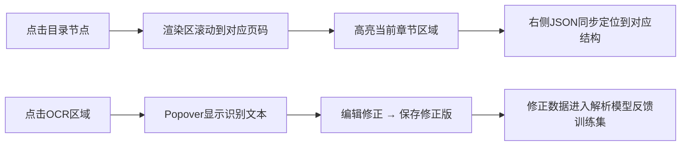

---

### 3.5 分块预览页

#### 页面布局

```
┌─────────────────────────────────────────────────────────────────┐
│ 供应商合同模板V5.pdf > 分块预览                    [重新分块]   │
├─────────────────────────────────────────────────────────────────┤
│ 分块策略: [通用▼]  Chunk大小: [512▼]  重叠: [128▼]            │
│ 统计: 85块 | 平均487 Token | 最大512 | 最小128 | 重叠率 84%    │
├─────────────────────────────────────────────────────────────────┤
│ [按类型▼] [Token范围▼]                                          │
├─────────────────────────────────────────────────────────────────┤
│ ┌─────────────────────────────────────────────────────────┐    │
│ │ #0  第一条 定义                    模板分块 │ 512 Token│    │
│ │ "第一条 定义 1.1 供应商系指根据本合同约定向采购方..."   │    │
│ │ 页码: 1  │  📄文本  │  🔒internal  │  [拆分] [排除]   │    │
│ └─────────────────────────────────────────────────────────┘    │
│ ┌─────────────────────────────────────────────────────────┐    │
│ │ #1  第二条 权利义务                模板分块 │ 508 Token│    │
│ │ "第二条 权利义务 2.1 采购方有权对供应商提供的货物..." │    │
│ │ 页码: 1-2 │ 📄文本 │ 🔒internal │ [合并↓] [拆分] [排除]│    │
│ └─────────────────────────────────────────────────────────┘    │
│ ┌─────────────────────────────────────────────────────────┐    │
│ │ #4  违约金计算表                    表格分块 │ 256 Token│    │
│ │ ┌──────┬──────────┬──────┐                              │    │
│ │ │ 类型 │ 计算标准  │ 上限 │                              │    │
│ │ ├──────┼──────────┼──────┤                              │    │
│ │ │ 延迟 │ 日0.5%   │ 20% │                              │    │
│ │ └──────┴──────────┴──────┘                              │    │
│ │ 页码: 3 │ 📊表格 │ 🔒internal │ [编辑] [排除]         │    │
│ └─────────────────────────────────────────────────────────┘    │
│ ...                                                             │
└─────────────────────────────────────────────────────────────────┘
```

#### 交互流程

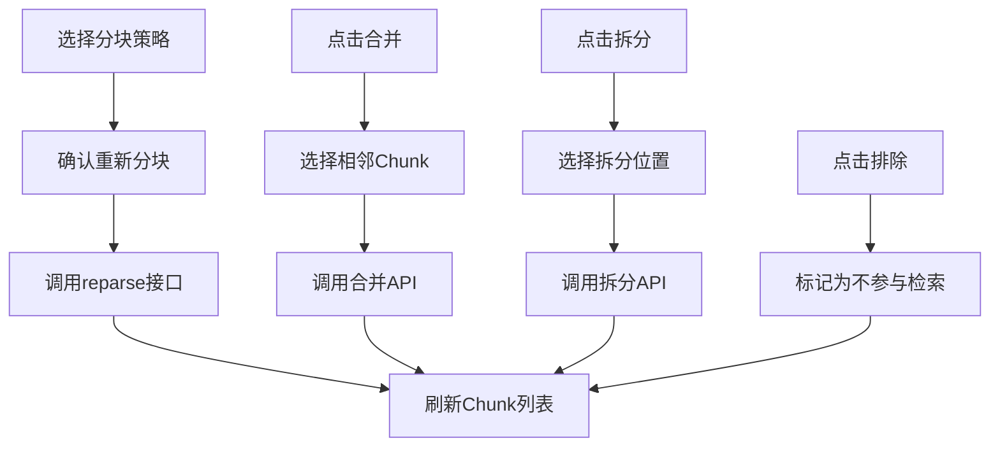

---

### 3.6 索引状态页

#### 五列索引状态卡片

```
┌─────────────────────────────────────────────────────────────────┐
│ 法务合同知识库 > 索引状态                     [全部重建索引]   │
├─────────────────────────────────────────────────────────────────┤
│                                                                 │
│  ┌──────────┐ ┌──────────┐ ┌──────────┐ ┌──────────┐ ┌──────┐│
│  │ 🔢向量   │ │ 📝全文   │ │ 🌳PageIdx│ │ 🔗图谱   │ │ 📖Wiki││
│  │ 索引     │ │ 索引     │ │ 树索引   │ │ 索引     │ │ 编译 ││
│  │          │ │          │ │          │ │          │ │      ││
│  │ 154/156  │ │ 156/156  │ │ 85/156   │ │ 42/156   │ │12/42 ││
│  │ ██████░░ │ │ ████████ │ │ ████░░░░ │ │ ██░░░░░░ │ │█░░░░ ││
│  │ 98.7%    │ │ 100%     │ │ 54.5%    │ │ 26.9%    │ │28.6% ││
│  │          │ │          │ │          │ │          │ │      ││
│  │ 健康度98 │ │ 健康度100│ │ 健康度85 │ │ 健康度72 │ │健康60││
│  │ ⏱2min前 │ │ ⏱5min前 │ │ ⏱1h前   │ │ ⏱3h前   │ │⏱1d前││
│  │          │ │          │ │          │ │          │ │      ││
│  │ [重试2]  │ │          │ │ [重试12] │ │ [暂停]   │ │[编译]││
│  └──────────┘ └──────────┘ └──────────┘ └──────────┘ └──────┘│
│                                                                 │
│  失败文档列表                                                  │
│  ┌──────────────────────────────────────────────────────────┐  │
│  │ 📄 复杂表格报告.pdf │ 向量索引 │ 嵌入超时 │ [重试] [跳过]│  │
│  │ 📄 扫描件合同.pdf   │ PageIndex│ LLM超时  │ [重试] [跳过]│  │
│  └──────────────────────────────────────────────────────────┘  │
│                                                                 │
└─────────────────────────────────────────────────────────────────┘
```

#### 索引状态数据流

```typescript
// 索引状态轮询 Hook
function useIndexStatus(kbId: string) {
  return useQuery({
    queryKey: ['kb-index-status', kbId],
    queryFn: () => api.get(`/api/v1/knowledge-bases/${kbId}/stats`).then(r => r.data),
    refetchInterval: (data) => {
      // 有正在进行的索引任务时5秒轮询，否则30秒
      const hasRunning = data?.index_statuses?.some(s => s.status === 'running');
      return hasRunning ? 5000 : 30000;
    },
  });
}
```

---

## 4. 智能对话模块

### 4.1 对话界面

#### 整体布局（ChatGPT风格）

```
┌──────────────┬──────────────────────────────────────────────────┐
│ 💬 对话历史  │  法务合同知识库                                   │
│              │                                                  │
│ [+ 新对话]   │  ┌──────────────────────────────────────────┐   │
│              │  │ 👤 用户                                   │   │
│ 🔍 搜索...  │  │ 供应商延迟交货的违约金如何计算？          │   │
│              │  └──────────────────────────────────────────┘   │
│ ── 今天 ──  │                                                  │
│ 📌 合同违约  │  ┌──────────────────────────────────────────┐   │
│   条款查询   │  │ 🤖 RAG 3.0                               │   │
│ 📌 保密协议  │  │                                          │   │
│   范围确认   │  │ 根据公司标准采购合同模板（V5）第五条...    │   │
│              │  │                                          │   │
│ ── 昨天 ──  │  │ 供应商迟延交货的，每迟延一日应按迟延     │   │
│ 📌 2024年度  │  │ 交付货物价值的千分之五[1]向采购方支付     │   │
│   合规审查   │  │ 违约金。                                  │   │
│ 📌 数据保护  │  │                                          │   │
│   条款       │  │ 迟延超过30日的，采购方有权解除合同[2]。   │   │
│              │  │                                          │   │
│ ── 更早 ──  │  │ ┌──── 引用 [1] ─────────────────────┐    │   │
│ 📌 知识产权  │  │ │ 📄 供应商合同模板V5.pdf  P3       │    │   │
│   归属       │  │ │ 5.1 供应商迟延交货的，每迟延...    │    │   │
│ 📌 竞业限制  │  │ │ 相关度: 95.6%  [查看原文]         │    │   │
│   条款       │  │ └───────────────────────────────────┘    │   │
│              │  │                                          │   │
│              │  │ 📊 置信度: 0.92 (高)  Tier2 │ 页面索引   │   │
│              │  │                                          │   │
│              │  │ 👍 👎 ✏️纠错                    2.1s    │   │
│              │  └──────────────────────────────────────────┘   │
│              │                                                  │
│              │  ┌──────────────────────────────────────────┐   │
│              │  │ 💡 试试这样问：                           │   │
│              │  │  • 供应商违约金上限是多少？[精确化]       │   │
│              │  │  • 对比不同合同的违约条款 [跨文档]        │   │
│              │  └──────────────────────────────────────────┘   │
│              │                                                  │
│              │  ┌──────────────────────────────────────────┐   │
│ [⚙] [📎]    │  │ 输入您的问题... (Enter发送, Shift+Enter换行)│   │
│              │  └──────────────────────────────────────────┘   │
└──────────────┴──────────────────────────────────────────────────┘
```

#### 消息气泡组件设计

```typescript
// 消息类型定义
interface ChatMessage {
  id: string;
  role: 'user' | 'assistant' | 'system';
  content: string;
  citations?: Citation[];
  confidence?: { score: number; level: 'high' | 'medium' | 'low' };
  routingInfo?: {
    tier: string;
    channels: string[];
    model: string;
  };
  feedbackStatus?: 'none' | 'thumbs_up' | 'thumbs_down';
  isStreaming?: boolean;
  createdAt: string;
}

// 用户消息 — 右对齐，蓝色背景
// 系统回答 — 左对齐，灰色背景，含引用卡片+置信度标签
// 引用编号 [1] — 悬停弹出引用卡片，点击跳转原文页码
```

#### 引用溯源交互流程

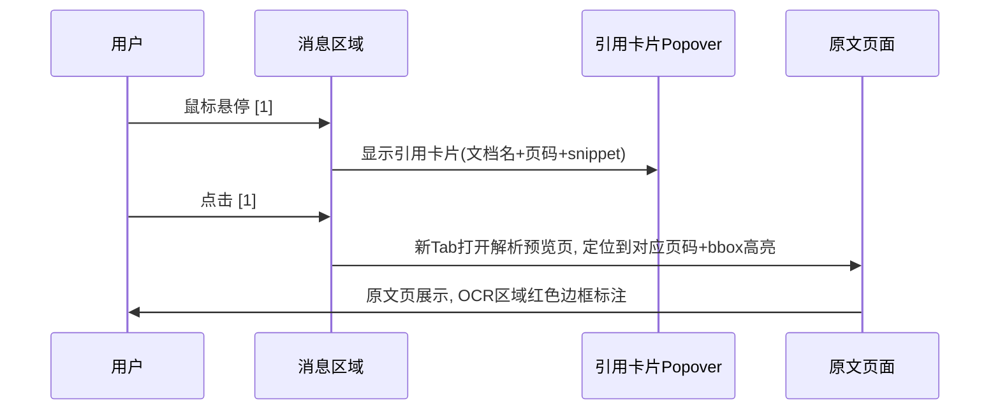

#### 流式输出实现

```typescript
// src/hooks/useSSE.ts — SSE流式连接Hook
import { useEffect, useRef, useCallback } from 'react';

interface SSEOptions {
  onToken: (content: string, index: number) => void;
  onCitation: (citation: Citation) => void;
  onRouting: (info: RoutingInfo) => void;
  onConfidence: (confidence: ConfidenceInfo) => void;
  onDone: (usage: TokenUsage) => void;
  onError: (error: SSEError) => void;
}

export function useSSE() {
  const abortRef = useRef<AbortController | null>(null);

  const startStream = useCallback(async (
    url: string,
    body: Record<string, unknown>,
    options: SSEOptions
  ) => {
    abortRef.current = new AbortController();

    const response = await fetch(url, {
      method: 'POST',
      headers: {
        'Content-Type': 'application/json',
        'Authorization': `Bearer ${getToken()}`,
        'Accept': 'text/event-stream',
      },
      body: JSON.stringify(body),
      signal: abortRef.current.signal,
    });

    const reader = response.body?.getReader();
    const decoder = new TextDecoder();
    let buffer = '';

    while (reader) {
      const { done, value } = await reader.read();
      if (done) break;

      buffer += decoder.decode(value, { stream: true });
      const lines = buffer.split('\n');
      buffer = lines.pop() || '';

      for (const line of lines) {
        if (line.startsWith('event: ')) {
          const eventType = line.slice(7).trim();
          continue;
        }
        if (line.startsWith('data: ')) {
          const data = JSON.parse(line.slice(6));
          switch (data.type || eventType) {
            case 'token': options.onToken(data.content, data.index); break;
            case 'citation': options.onCitation(data); break;
            case 'routing': options.onRouting(data); break;
            case 'confidence': options.onConfidence(data); break;
            case 'done': options.onDone(data); break;
            case 'error': options.onError(data); break;
          }
        }
      }
    }
  }, []);

  const stopStream = useCallback(() => {
    abortRef.current?.abort();
  }, []);

  return { startStream, stopStream };
}
```

#### 对话状态管理

```typescript
// src/stores/useChatStore.ts
interface ChatState {
  conversations: Conversation[];
  currentConvId: string | null;
  messages: Record<string, ChatMessage[]>;  // convId → messages
  isStreaming: boolean;
  streamingMessageId: string | null;

  // Actions
  createConversation: (kbIds: string[]) => Promise<string>;
  sendMessage: (convId: string, content: string) => Promise<void>;
  stopStreaming: () => void;
  submitFeedback: (convId: string, msgId: string, feedback: Feedback) => Promise<void>;
  loadHistory: (convId: string) => Promise<void>;
}
```

#### API调用映射

| 操作 | 方法 | API端点 | 说明 |
|------|------|---------|------|
| 创建对话 | POST | `/api/v1/conversations` | 指定知识库ID |
| 发送消息(非流式) | POST | `/api/v1/conversations/{conv_id}/messages` | stream=false |
| 发送消息(流式) | POST | `/api/v1/conversations/{conv_id}/messages` | stream=true, SSE |
| 获取历史 | GET | `/api/v1/conversations/{conv_id}/messages` | cursor分页 |
| 删除对话 | DELETE | `/api/v1/conversations/{conv_id}` | |
| 消息反馈 | POST | `/api/v1/conversations/{conv_id}/messages/{msg_id}/feedback` | |

---

### 4.2 查询增强面板

#### 面板布局（可展开/收起）

```
┌─────────────────────────────────────────────────────────────────┐
│ 🔍 查询增强面板                                          [收起]│
├─────────────────────────────────────────────────────────────────┤
│                                                                 │
│ 📝 查询重写                                                     │
│ ┌─────────────────────────────────────────────────────────┐    │
│ │ 原始: "那个违约的事情怎么赔"                             │    │
│ │ → 精确化: "供应商合同模板中违约金的条款有哪些？"          │    │
│ │ → 泛化: "供应商违约责任有哪些类型？"                     │    │
│ │ → 跨文档: "对比不同合同中违约金计算标准"                  │    │
│ └─────────────────────────────────────────────────────────┘    │
│                                                                 │
│ 🏷️ 分类器路由                                                   │
│ ┌──────────┐ ┌──────────┐ ┌──────────┐ ┌──────────┐          │
│ │ 复杂度   │ │ 文档类型 │ │ 用户意图 │ │ 安全分级 │          │
│ │ Tier 2   │ │ 财报/PDF │ │ 精确答案 │ │ 内部     │          │
│ │ 中等推理 │ │          │ │          │ │          │          │
│ └──────────┘ └──────────┘ └──────────┘ └──────────┘          │
│                                                                 │
│ 🔀 多通道检索结果                                               │
│ ┌─────────────────────────────────────────────────────────┐    │
│ │ 通道1: PageIndex (主) ████████ Top-5  延迟520ms         │    │
│ │   1. 供应商合同V5 P3 评分1.0                            │    │
│ │   2. 采购协议条款 P8   评分0.95                          │    │
│ │                                                          │    │
│ │ 通道2: 向量检索 (辅) ████████ Top-5  延迟45ms           │    │
│ │   1. 供应商合同V5 P3 评分0.956                           │    │
│ │   2. 采购协议条款 P8   评分0.867                         │    │
│ │                                                          │    │
│ │ 融合: RRF加权 → Top-5精排(Cross-Encoder)                │    │
│ └─────────────────────────────────────────────────────────┘    │
│                                                                 │
│ 📎 知识来源                                                     │
│ ┌──────┐ ┌──────┐ ┌──────┐ ┌──────┐                          │
│ │ 📄合 │ │ 📄采 │ │ 📊财 │ │ 📄物 │                          │
│ │ 同V5 │ │ 购条 │ │ 务Q2 │ │ 流V2 │                          │
│ │ P3-5 │ │ 款P8 │ │ P12  │ │ P5   │                          │
│ └──────┘ └──────┘ └──────┘ └──────┘                          │
│                                                                 │
└─────────────────────────────────────────────────────────────────┘
```

#### 分类器路由可视化交互

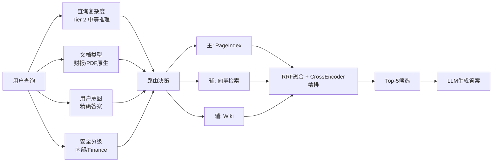

#### API调用映射

| 操作 | 方法 | API端点 | 说明 |
|------|------|---------|------|
| 查询重写 | POST | `/api/v1/knowledge-bases/{kb_id}/query/rewrite` | |
| 多通道对比 | POST | `/api/v1/knowledge-bases/{kb_id}/query/compare` | 仅开发者 |

---

### 4.3 反馈与纠错

#### 纠错对话框

```
┌─────────────────────────────────────────┐
│ 提交纠错                            [×] │
├─────────────────────────────────────────┤
│                                         │
│  问题类型 *                             │
│  ☐ 回答错误  ☐ 引用错误                │
│  ☐ 信息过时  ☐ 不完整                  │
│  ☐ 格式问题  ☐ 其他                    │
│                                         │
│  错误说明 *                             │
│  ┌─────────────────────────────────┐   │
│  │ 请描述具体的错误...              │   │
│  └─────────────────────────────────┘   │
│                                         │
│  正确内容建议                           │
│  ┌─────────────────────────────────┐   │
│  │ 如果知道正确答案，请填写...      │   │
│  └─────────────────────────────────┘   │
│                                         │
│  引用修正建议                           │
│  ┌─────────────────────────────────┐   │
│  │ 请指出应引用的文档或条款...      │   │
│  └─────────────────────────────────┘   │
│                                         │
│         [取消]  [提交纠错]              │
└─────────────────────────────────────────┘
```

#### 纠错交互流程

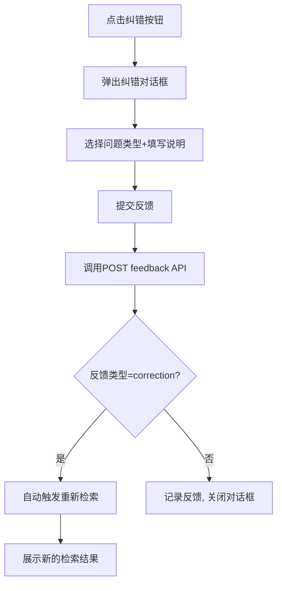

---

## 5. 评测中心模块

### 5.1 评测仪表盘

#### 页面布局

```
┌─────────────────────────────────────────────────────────────────┐
│ 评测中心                               [时间▼] [知识库▼]       │
├─────────────────────────────────────────────────────────────────┤
│                                                                 │
│  ┌──────────┐ ┌──────────┐ ┌──────────┐ ┌──────────┐         │
│  │ 🎯       │ │ 📐       │ │ 📊       │ │ ⚠️       │         │
│  │Faithful  │ │Context   │ │Answer    │ │Hallucin  │         │
│  │ness      │ │Precision │ │Relevancy │ │ationRate │         │
│  │          │ │          │ │          │ │          │         │
│  │  0.92    │ │  0.88    │ │  0.91    │ │  0.04    │         │
│  │  ↑ +0.03 │ │  ↑ +0.01 │ │  ↓ -0.02 │ │  ↓ -0.01 │         │
│  └──────────┘ └──────────┘ └──────────┘ └──────────┘         │
│                                                                 │
│  ┌─────────────────────────────────────────────────────────┐   │
│  │ 核心指标趋势                    [日▼] [周] [月]          │   │
│  │                                                         │   │
│  │  1.0 ┤                                    ╭──╮         │   │
│  │      │                        ╭──╮  ╭──╮╭╯  ╰╮       │   │
│  │  0.9 ┤ ╭──╮  ╭──╮  ╭──╮ ╭╮╭╯  ╰╮╭╯  ╰╯     ╰      │   │
│  │      │╭╯  ╰╮╭╯  ╰╮╭╯  ╰─╯╰╯     ╰╯              │   │
│  │  0.8 ┤╯     ╰╯     ╰╯                              │   │
│  │      ├──┬──┬──┬──┬──┬──┬──┬──┬──┬──┬──┬──           │   │
│  │      1月  2月  3月  4月  5月  6月                     │   │
│  │      ── Faithfulness  -- Answer Relevancy             │   │
│  │      ── Context Precision  -- Hallucination Rate      │   │
│  └─────────────────────────────────────────────────────────┘   │
│                                                                 │
│  ┌─────────────────────────────────────────────────────────┐   │
│  │ 分层评测                                               │   │
│  │                                                         │   │
│  │ 文档级  ██████████████████████░░░░  92%  解析质量      │   │
│  │ 块级    ██████████████████░░░░░░░░  88%  分块合理性    │   │
│  │ 检索级  ████████████████░░░░░░░░░░  82%  Recall@10    │   │
│  │ 生成级  ██████████████████████░░░░  92%  Faithfulness  │   │
│  │ 端到端  ████████████████████░░░░░░  86%  综合评分      │   │
│  └─────────────────────────────────────────────────────────┘   │
│                                                                 │
└─────────────────────────────────────────────────────────────────┘
```

#### 评测数据流

```typescript
// 评测仪表盘数据获取
function useEvalDashboard(kbId?: string, period: string = '30d') {
  return useQuery({
    queryKey: ['eval-dashboard', kbId, period],
    queryFn: () => evalService.getDashboard({ kb_id: kbId, period }),
    refetchInterval: 60000,  // 1分钟刷新
  });
}
```

---

### 5.2 评测任务管理

#### 创建评测任务对话框

```
┌─────────────────────────────────────────┐
│ 创建评测任务                        [×] │
├─────────────────────────────────────────┤
│                                         │
│  评测名称 *                             │
│  ┌─────────────────────────────────┐   │
│  │ 6月Faithfulness回归评测          │   │
│  └─────────────────────────────────┘   │
│                                         │
│  目标知识库 *                           │
│  [法务合同知识库 ▼]                     │
│                                         │
│  评测集                                 │
│  ○ 使用默认评测集                       │
│  ○ 上传自定义评测集 (CSV/JSON)          │
│  ○ 从历史查询生成                       │
│                                         │
│  评测指标 *                             │
│  ☑ Faithfulness  ☑ Context Precision   │
│  ☑ Answer Relevancy  ☐ Hallucination   │
│  ☐ Context Recall  ☐ Bleu Score        │
│                                         │
│  基线对比                               │
│  ☑ 与上次评测结果对比                   │
│                                         │
│         [取消]  [创建评测]              │
└─────────────────────────────────────────┘
```

#### 评测结果详情页

```
┌─────────────────────────────────────────────────────────────────┐
│ 评测结果: 6月Faithfulness回归评测                               │
├─────────────────────────────────────────────────────────────────┤
│ 状态: ✅完成  │ 耗时: 12min │ 测试集: 500条 │ 时间: 2026-06-05 │
├─────────────────────────────────────────────────────────────────┤
│                                                                 │
│  ┌────────────────────────────────────────────────────────┐    │
│  │ 综合评分                 与基线对比                      │    │
│  │ Faithfulness: 0.92  ↑0.03 ✅                           │    │
│  │ Context Precision: 0.88 ↑0.01 ✅                       │    │
│  │ Answer Relevancy: 0.91 ↓0.02 ⚠️                       │    │
│  │ Hallucination: 0.04 ↓0.01 ✅                           │    │
│  └────────────────────────────────────────────────────────┘    │
│                                                                 │
│  失败案例 Top 10                                               │
│  ┌────────────────────────────────────────────────────────┐    │
│  │ #1 查询: "供应商保密义务范围"                          │    │
│  │    期望: 保密条款第8.1-8.5条                           │    │
│  │    实际: 引用了过期的V4版本条款                         │    │
│  │    Faithfulness: 0.45  ↓  [查看详情]                   │    │
│  │────────────────────────────────────────────────────────│    │
│  │ #2 查询: "延迟交货违约金上限"                          │    │
│  │    期望: 合同金额20%                                   │    │
│  │    实际: 回答"不超过30%"                                │    │
│  │    Faithfulness: 0.52  ↓  [查看详情]                   │    │
│  └────────────────────────────────────────────────────────┘    │
│                                                                 │
└─────────────────────────────────────────────────────────────────┘
```

---

### 5.3 A/B测试面板

#### 页面布局

```
┌─────────────────────────────────────────────────────────────────┐
│ A/B测试                                          [+ 创建测试]  │
├─────────────────────────────────────────────────────────────────┤
│                                                                 │
│  活跃测试                                                      │
│  ┌──────────────────────────────────────────────────────────┐  │
│  │ 🧪 BGE-M3 vs BCE-Embedding 嵌入模型对比                 │  │
│  │ 状态: 🟢运行中  │ 流量: 50/50  │ 运行: 3天              │  │
│  │                                                          │  │
│  │ Variant A (BGE-M3)     Variant B (BCE-Embedding)        │  │
│  │ Faithfulness: 0.92      Faithfulness: 0.89              │  │
│  │ Recall@10: 0.85         Recall@10: 0.83                 │  │
│  │ P95延迟: 1.8s           P95延迟: 1.5s                   │  │
│  │ 样本量: 1,250           样本量: 1,248                    │  │
│  │                                                          │  │
│  │ 统计显著性: p=0.032 ✅ 达到95%置信度                     │  │
│  │                                                          │  │
│  │ [查看详情]  [停止测试]  [全量切换到A]                    │  │
│  └──────────────────────────────────────────────────────────┘  │
│                                                                 │
│  历史测试                                                      │
│  ┌──────────────────────────────────────────────────────────┐  │
│  │ DeepDoc vs MinerU 解析引擎对比  ✅已完成  6月1日-6月3日  │  │
│  │ 胜出: DeepDoc (Faithfulness +0.04)  [查看报告]          │  │
│  └──────────────────────────────────────────────────────────┘  │
│                                                                 │
└─────────────────────────────────────────────────────────────────┘
```

#### A/B测试交互流程

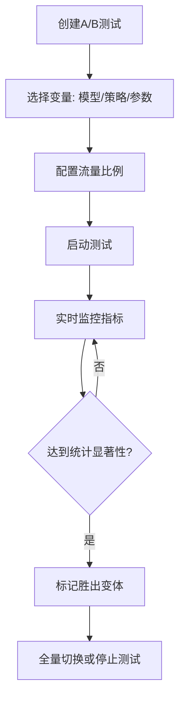

---

## 6. 系统管理模块

### 6.1 用户与权限管理（RBAC）

#### 用户列表页

```
┌─────────────────────────────────────────────────────────────────┐
│ 用户管理                                     [+ 添加用户]      │
├─────────────────────────────────────────────────────────────────┤
│ [搜索用户...]  [角色▼] [部门▼] [状态▼]                         │
├─────────────────────────────────────────────────────────────────┤
│ ☐ │ 张伟   │ zhang.wei@   │ 法务部  │ 知识库管理员 │ 活跃 │ ⋮ │
│ ☐ │ 李婷   │ li.ting@     │ AI平台  │ 平台管理员   │ 活跃 │ ⋮ │
│ ☐ │ 陈工   │ chen.gong@   │ 算法组  │ 开发者       │ 活跃 │ ⋮ │
│ ☐ │ 王芳   │ wang.fang@   │ 知识管理│ 知识库管理员 │ 活跃 │ ⋮ │
├─────────────────────────────────────────────────────────────────┤
│ 批量操作: [分配角色] [修改密级] [禁用]                          │
└─────────────────────────────────────────────────────────────────┘
```

#### 角色管理页

```
┌─────────────────────────────────────────────────────────────────┐
│ 角色管理                                     [+ 创建角色]      │
├─────────────────────────────────────────────────────────────────┤
│ ┌──────────────────────────────────────────────────────────┐  │
│  系统角色                                                  │  │
│  ┌────────┐ ┌────────┐ ┌────────┐ ┌────────┐             │  │
│  │超级管理│ │平台管理│ │知识库  │ │开发者  │             │  │
│  │员      │ │员      │ │管理员  │ │        │             │  │
│  │3人     │ │2人     │ │5人     │ │8人     │             │  │
│  └────────┘ └────────┘ └────────┘ └────────┘             │  │
│                                                           │  │
│  自定义角色                                                │  │
│  ┌────────┐ ┌────────┐                                   │  │
│  │法务主管│ │日志审计│   [+ 创建自定义角色]                │  │
│  │2人     │ │1人     │                                   │  │
│  └────────┘ └────────┘                                   │  │
│  └──────────────────────────────────────────────────────────┘  │
└─────────────────────────────────────────────────────────────────┘
```

#### Chunk级ACL规则配置

```
┌─────────────────────────────────────────────────────────────────┐
│ ACL规则配置 — 法务合同知识库                                     │
├─────────────────────────────────────────────────────────────────┤
│ [+ 添加规则]                                                    │
│                                                                 │
│ ┌──────────────────────────────────────────────────────────┐  │
│  #1  规则名称: 高管可看全部                                │  │
│  被授权者: 角色=executive                                  │  │
│  权限: read                                               │  │
│  条件: confidentiality IN (public, internal, confidential, │  │
│        restricted)                                         │  │
│  状态: ✅启用                     [编辑] [禁用] [删除]     │  │
│  ──────────────────────────────────────────────────────── │  │
│  #2  规则名称: 财务分析师可看内部及以下                    │  │
│  被授权者: 角色=finance_analyst                            │  │
│  权限: read                                               │  │
│  条件: confidentiality != restricted                      │  │
│  状态: ✅启用                     [编辑] [禁用] [删除]     │  │
│  ──────────────────────────────────────────────────────── │  │
│  #3  规则名称: 实习生仅可看公开                            │  │
│  被授权者: 角色=intern                                     │  │
│  权限: read                                               │  │
│  条件: confidentiality == public                          │  │
│  状态: ✅启用                     [编辑] [禁用] [删除]     │  │
│  └──────────────────────────────────────────────────────────┘  │
│                                                                 │
└─────────────────────────────────────────────────────────────────┘
```

#### API调用映射

| 操作 | 方法 | API端点 | 说明 |
|------|------|---------|------|
| 用户列表 | GET | `/api/v1/tenants/{tenant_id}/users` | |
| 添加用户 | POST | `/api/v1/tenants/{tenant_id}/users` | |
| 修改角色 | PUT | `/api/v1/tenants/{tenant_id}/users/{user_id}/role` | |
| 设置ACL | POST | `/api/v1/knowledge-bases/{kb_id}/acl` | |

---

### 6.2 流水线配置

#### 页面布局

```
┌─────────────────────────────────────────────────────────────────┐
│ 流水线配置 — 法务合同知识库                                      │
├─────────────────────────────────────────────────────────────────┤
│                                                                 │
│  五大流水线开关                                                 │
│  ┌──────────────────────────────────────────────────────────┐  │
│  │ P1 向量检索流水线    [🟢启用] ████████████ 配置          │  │
│  │ P2 PageIndex流水线   [🟢启用] ████████████ 配置          │  │
│  │ P3 GraphRAG流水线    [🟡仅索引] ████████████ 配置        │  │
│  │ P4 LLM Wiki流水线    [🔴禁用] ████████████ 配置          │  │
│  │ P5 Agent工具流水线   [🔴禁用] ████████████ 配置          │  │
│  └──────────────────────────────────────────────────────────┘  │
│                                                                 │
│  模型配置                                                      │
│  ┌──────────────────────────────────────────────────────────┐  │
│  │ 嵌入模型:    [BAAI/bge-m3 ▼]                            │  │
│  │ LLM模型:     [deepseek-v4 ▼]                            │  │
│  │ Reranker模型: [BAAI/bge-reranker-v2-m3 ▼]              │  │
│  │ 分类器模型:  [gpt-4o-mini ▼]                            │  │
│  └──────────────────────────────────────────────────────────┘  │
│                                                                 │
│  路由规则可视化编辑器                                           │
│  ┌──────────────────────────────────────────────────────────┐  │
│  │                                                          │  │
│  │  查询复杂度 ──┐                                          │  │
│  │  文档类型   ──┼──→ [路由决策] ──→ 主通道+辅通道          │  │
│  │  用户意图   ──┘                                          │  │
│  │  安全分级   ──┘                                          │  │
│  │                                                          │  │
│  │  ┌─────────────────────────────────────────────┐        │  │
│  │  │ Tier1 + 财报 + 精确答案 → Wiki + 向量        │        │  │
│  │  │ Tier2 + 财报 + 数据分析 → PageIndex + 向量   │        │  │
│  │  │ Tier3 + 合同 + 综合分析 → PageIndex + 图谱   │        │  │
│  │  │ Tier4 + 全部 + 策略建议 → Agent + 向量+图谱  │        │  │
│  │  └─────────────────────────────────────────────┘        │  │
│  │                                              [+ 添加规则]│  │
│  └──────────────────────────────────────────────────────────┘  │
│                                                                 │
│                                              [保存配置]         │
└─────────────────────────────────────────────────────────────────┘
```

#### 路由规则可视化编辑器交互

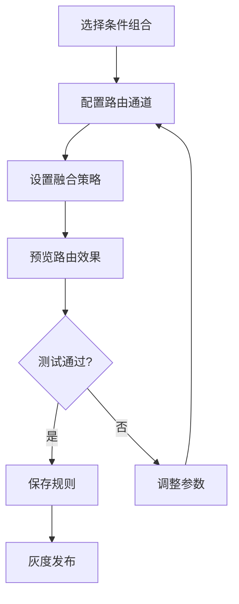

---

### 6.3 审计日志

#### 页面布局

```
┌─────────────────────────────────────────────────────────────────┐
│ 审计日志                                       [导出CSV]       │
├─────────────────────────────────────────────────────────────────┤
│ 时间范围: [2026-06-01] ~ [2026-06-06]                           │
│ 操作者: [全部▼]  操作类型: [全部▼]  资源: [全部▼]               │
├─────────────────────────────────────────────────────────────────┤
│ 时间              │ 用户  │ 操作     │ 资源          │ IP       │
│ 2026-06-06 10:30 │ 张伟  │ 查询     │ kb_法务合同   │10.0.1.5  │
│ 2026-06-06 10:28 │ 王芳  │ 上传文档 │ doc_合同V6    │10.0.2.3  │
│ 2026-06-06 10:15 │ 李婷  │ 修改配置 │ pipeline_P1   │10.0.1.8  │
│ 2026-06-06 09:55 │ 陈工  │ API调用  │ kb_研发文档   │10.0.3.12 │
│ 2026-06-06 09:30 │ 张伟  │ 删除文档 │ doc_旧合同    │10.0.1.5  │
├─────────────────────────────────────────────────────────────────┤
│                       < 1 2 3 ... 50 >                         │
└─────────────────────────────────────────────────────────────────┘
```

#### API调用映射

| 操作 | 方法 | API端点 | 说明 |
|------|------|---------|------|
| 查询日志 | GET | `/api/v1/audit-logs` | 时间/用户/操作/资源筛选 |
| 导出日志 | GET | `/api/v1/audit-logs/export` | CSV/JSON格式 |

---

### 6.4 系统监控

#### Prometheus指标面板

```
┌─────────────────────────────────────────────────────────────────┐
│ 系统监控                                                        │
├─────────────────────────────────────────────────────────────────┤
│                                                                 │
│  ┌──────────┐ ┌──────────┐ ┌──────────┐ ┌──────────┐         │
│  │ QPS      │ │ P95延迟  │ │ 错误率   │ │ GPU利用率│         │
│  │ 1,250/s  │ │ 1.8s     │ │ 0.3%     │ │ 78%      │         │
│  │ ↑ +15%   │ │ ↓ -0.2s  │ │ 稳定     │ │ ↑ +5%    │         │
│  └──────────┘ └──────────┘ └──────────┘ └──────────┘         │
│                                                                 │
│  ┌─────────────────────────────────────────────────────────┐   │
│  │ 流水线延迟分布                     [1h] [6h] [24h] [7d] │   │
│  │                                                         │   │
│  │  P1 向量  ████████░░  平均 450ms                        │   │
│  │  P2 PageIdx ██████████ 平均 520ms                       │   │
│  │  P3 GraphRAG ██████████████ 平均 1.2s                   │   │
│  │  P4 Wiki   ████░░░░░░░░ 平均 180ms                     │   │
│  │  P5 Agent  ████████████████████ 平均 3.5s               │   │
│  └─────────────────────────────────────────────────────────┘   │
│                                                                 │
│  ┌─────────────────────────────────────────────────────────┐   │
│  │ LLM Token消耗 & 成本                                    │   │
│  │  今日: 2.5M tokens  ¥38.5                              │   │
│  │  本月: 45M tokens    ¥680                              │   │
│  │  模型分布: DeepSeek 68% | Qwen3 22% | Claude 10%       │   │
│  └─────────────────────────────────────────────────────────┘   │
│                                                                 │
│  告警规则                                                      │
│  ┌──────────────────────────────────────────────────────────┐  │
│  │ P0: Faithfulness突降30%+ → 电话+企微    [编辑] [禁用]  │  │
│  │ P1: P95延迟>10s          → 企微          [编辑] [禁用]  │  │
│  │ P2: 日成本>¥500          → 邮件+Jira     [编辑] [禁用]  │  │
│  │                                                [+ 添加] │  │
│  └──────────────────────────────────────────────────────────┘  │
│                                                                 │
└─────────────────────────────────────────────────────────────────┘
```

#### 告警规则配置交互

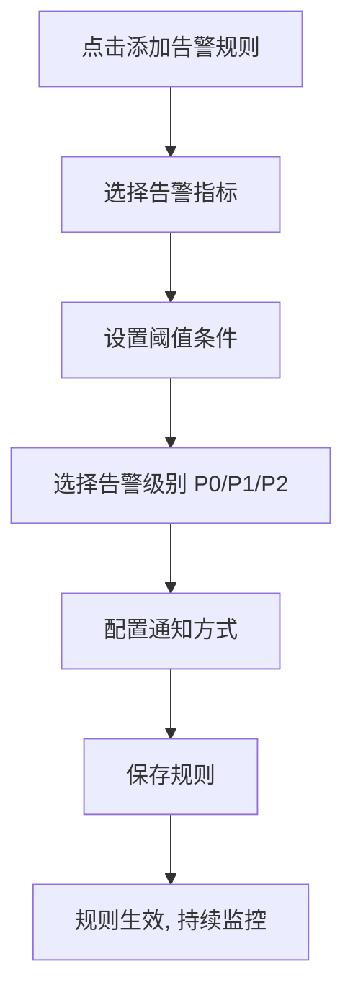

---

## 7. 公共组件库

### 7.1 KnowledgeBaseSelector — 知识库选择器

**功能**：在对话/查询页面选择一个或多个知识库

**布局**：

```
┌─────────────────────────────┐
│ 🔍 搜索知识库...            │
├─────────────────────────────┤
│ ☑ 📚 法务合同知识库         │
│ ☑ 📊 财务报告知识库         │
│ ☐ 🔬 研发文档知识库         │
│ ☐ 📋 合规政策知识库         │
├─────────────────────────────┤
│ 已选择 2 个知识库    [确认] │
└─────────────────────────────┘
```

**Props**：

```typescript
interface KnowledgeBaseSelectorProps {
  mode?: 'single' | 'multiple';       // 单选/多选
  value?: string[];                    // 已选知识库ID
  onChange?: (kbIds: string[]) => void;
  disabled?: boolean;
}
```

**API映射**：`GET /api/v1/knowledge-bases` — 获取用户有权访问的知识库列表

---

### 7.2 DocumentUploader — 文档上传组件

**功能**：支持拖拽+点击上传，显示批量上传进度

**布局**：

```
┌─────────────────────────────────────────┐
│                                         │
│    📂 拖拽文件至此，或点击选择文件       │
│                                         │
│    支持16+格式 | 单文件≤100MB           │
│                                         │
├─────────────────────────────────────────┤
│ 上传队列 (2/3)                          │
│ ┌───────────────────────────────────┐   │
│ │ 📄 合同V5.pdf  2.3MB  ████████ ✅│   │
│ │ 📄 报告.pdf    5.0MB  ████░░░ 🔄│   │
│ │ 📊 数据.xlsx   0.8MB  ██░░░░░ ⬆│   │
│ └───────────────────────────────────┘   │
└─────────────────────────────────────────┘
```

**Props**：

```typescript
interface DocumentUploaderProps {
  kbId: string;
  maxFileSize?: number;                 // 默认100MB
  maxFileCount?: number;                // 默认100
  acceptedFormats?: string[];           // 支持的格式
  onUploadComplete?: (docs: Document[]) => void;
  onUploadError?: (errors: UploadError[]) => void;
}
```

**关键实现**：

- 使用`tus-js-client`进行大文件分片上传
- 使用`tus-js-client`的`onProgress`回调更新进度条
- 上传完成后自动触发解析状态轮询
- 支持暂停/恢复单个上传任务

**API映射**：`POST /api/v1/knowledge-bases/{kb_id}/documents`

---

### 7.3 CitationCard — 引用卡片组件

**功能**：展示引用来源信息，支持悬停预览和点击跳转

**布局**：

```
┌───────────────────────────────────────────────┐
│ 📄 供应商合同模板V5.pdf  第3页  第五条 违约责任 │
├───────────────────────────────────────────────┤
│ "5.1 供应商迟延交货的，每迟延一日应按迟延     │
│  交付货物价值的千分之五向采购方支付违约金。"   │
│                                               │
│ 相关度: ████████░░ 95.6%                      │
│                                               │
│ [查看原文]  [复制引用]  [标记不相关]           │
└───────────────────────────────────────────────┘
```

**Props**：

```typescript
interface CitationCardProps {
  citation: {
    index: number;
    docId: string;
    docName: string;
    chunkId: string;
    section: string;
    pageNumber: number;
    snippet: string;
    relevanceScore: number;
    bboxCoordinates?: number[];   // [x1, y1, x2, y2] 用于原文高亮
  };
  onViewOriginal?: (citation: Citation) => void;  // 跳转原文
  compact?: boolean;             // 紧凑模式(用于Popover)
}
```

**关键实现**：

- 紧凑模式：仅显示文档名+页码，用于悬停Popover
- 完整模式：展示snippet+相关度+操作按钮
- `bboxCoordinates`不为空时，点击"查看原文"跳转到解析预览页并高亮对应区域
- 相关度颜色编码：>0.9=绿色, 0.7-0.9=黄色, <0.7=红色

---

### 7.4 QueryClassifierBadge — 分类器标签组件

**功能**：可视化展示分类器路由结果

**布局**：

```
┌────────┬──────────┬──────────┬──────────┐
│ Tier 2 │ 财报/PDF │ 精确答案 │ 内部     │
│ 中等推理│          │          │          │
└────────┴──────────┴──────────┴──────────┘
```

**Props**：

```typescript
interface QueryClassifierBadgeProps {
  routingInfo: {
    classifiedTier: 'tier_1' | 'tier_2' | 'tier_3' | 'tier_4';
    documentType?: string;
    userIntent?: string;
    securityLevel?: string;
    primaryChannel: string;
    secondaryChannels: string[];
  };
}
```

**关键实现**：

- Tier级别颜色：Tier1=绿, Tier2=蓝, Tier3=橙, Tier4=红
- 使用Ant Design的`Tag`组件，每个分类维度一个标签
- 点击标签可展开查看分类器的reasoning和confidence

---

### 7.5 PipelineStatusTag — 流水线状态标签

**功能**：显示流水线/索引的当前状态

**Props**：

```typescript
interface PipelineStatusTagProps {
  status: 'running' | 'completed' | 'failed' | 'paused' | 'not_applicable';
  progress?: number;           // 0-100
  label?: string;
}

// 状态映射:
// running → 🔄蓝色+进度条
// completed → ✅绿色
// failed → ❌红色
// paused → ⏸️黄色
// not_applicable → —灰色
```

---

### 7.6 ChunkPreviewCard — 分块预览卡片

**功能**：展示单个Chunk的预览信息和操作

**布局**：

```
┌─────────────────────────────────────────────────────────┐
│ #0  第一条 定义                    模板分块 │ 512 Token│
│ "第一条 定义 1.1 供应商系指根据本合同约定向采购方..."   │
│ 页码: 1  │  📄文本  │  🔒internal  │  [拆分] [排除]   │
└─────────────────────────────────────────────────────────┘
```

**Props**：

```typescript
interface ChunkPreviewCardProps {
  chunk: {
    chunkId: string;
    chunkIndex: number;
    contentPreview: string;
    contentType: 'text' | 'table' | 'image_description' | 'formula' | 'code';
    chunkStrategy: string;
    tokenCount: number;
    pageNumber: number;
    sectionTitle: string;
    aclTags: AclTag[];
  };
  onSplit?: (chunkId: string) => void;
  onMerge?: (chunkId: string, targetChunkId: string) => void;
  onExclude?: (chunkId: string) => void;
  onEdit?: (chunkId: string, content: string) => void;
}
```

---

### 7.7 ConfidenceGauge — 置信度仪表盘

**功能**：可视化展示答案置信度评分

**布局**：

```
        ╭─────╮
      ╱   0.92  ╲
     │    高     │
      ╲        ╱
        ╰─────╯
  检索质量: 0.95
  生成一致性: 0.93
  来源权威性: 0.90
  精排评分: 0.91
```

**Props**：

```typescript
interface ConfidenceGaugeProps {
  confidence: {
    score: number;      // 0-1
    level: 'high' | 'medium' | 'low';
    factors: {
      retrievalQuality: number;
      generationConsistency: number;
      sourceAuthority: number;
      crossEncoderScore: number;
    };
  };
  size?: 'small' | 'medium' | 'large';
}
```

**关键实现**：

- 使用ECharts Gauge图表渲染
- 颜色映射：>0.8=绿色, 0.6-0.8=黄色, <0.6=红色
- small模式仅显示数字和颜色标签，用于消息气泡底部

---

### 7.8 StreamingMessage — 流式消息组件

**功能**：支持逐字显示的SSE流式消息渲染

**Props**：

```typescript
interface StreamingMessageProps {
  content: string;           // 当前已接收的全部文本
  isStreaming: boolean;      // 是否正在流式输出
  citations: Citation[];     // 引用列表(延迟加载)
  onStop?: () => void;       // 停止生成回调
}
```

**关键实现**：

- 使用Markdown渲染组件(`react-markdown`+`rehype-highlight`)
- 流式输出时显示闪烁光标
- 引用标记`[1]`在对应SSE citation事件到达后才渲染为可点击链接
- 支持停止生成按钮
- 流式结束后渲染完整Markdown格式

**SSE事件处理流程**：

```mermaid
flowchart TD
    A[SSE: routing事件] --> B[显示路由信息Badge]
    C[SSE: token事件] --> D[追加文本到content]
    D --> E[Markdown渲染+闪烁光标]
    F[SSE: citation事件] --> G[收集citations]
    G --> H[将[1]标记渲染为可点击链接]
    I[SSE: confidence事件] --> J[显示置信度仪表盘]
    K[SSE: done事件] --> L[移除光标, 完整渲染]
    M[SSE: error事件] --> N[显示错误提示+重试按钮]
```

---

## 8. 前端性能优化

### 8.1 路由懒加载

采用`React.lazy` + `Suspense`实现按需加载，每个页面模块独立打包：

```typescript
// src/router/index.tsx
const KBListPage = lazy(() => import('@/pages/KnowledgeBase/ListPage'));
// 加载时显示骨架屏
<Suspense fallback={<PageSkeleton />}>
  <KBListPage />
</Suspense>
```

**预期效果**：首屏JS从~800KB降至~200KB（gzip），首屏加载时间<1.5s。

---

### 8.2 虚拟列表

使用`react-window`处理大量文档/Chunk列表：

```typescript
// 文档列表虚拟滚动
import { FixedSizeList as List } from 'react-window';

function DocumentVirtualList({ documents }: { documents: Document[] }) {
  const Row = ({ index, style }: { index: number; style: CSSProperties }) => (
    <div style={style}>
      <DocumentCard document={documents[index]} />
    </div>
  );

  return (
    <List
      height={600}
      itemCount={documents.length}
      itemSize={80}
      width="100%"
    >
      {Row}
    </List>
  );
}
```

**适用场景**：文档列表（>100项）、Chunk预览列表（>50项）、审计日志（>200项）。

---

### 8.3 防抖节流

```typescript
// src/hooks/useDebounce.ts
import { useDeferredValue, useState } from 'react';

export function useDebouncedValue<T>(value: T, delay: number = 300): T {
  const [debouncedValue, setDebouncedValue] = useState(value);
  
  useEffect(() => {
    const timer = setTimeout(() => setDebouncedValue(value), delay);
    return () => clearTimeout(timer);
  }, [value, delay]);

  return debouncedValue;
}

// 使用场景:
// 1. 知识库搜索框 — 输入300ms后触发搜索
// 2. 文档名称筛选 — 输入500ms后触发
// 3. 全局搜索框 — 输入200ms后展示建议
```

---

### 8.4 React Query缓存策略

```typescript
// src/services/api.ts — 全局React Query配置
const queryClient = new QueryClient({
  defaultOptions: {
    queries: {
      staleTime: 5 * 60 * 1000,       // 5分钟内数据视为新鲜
      gcTime: 30 * 60 * 1000,          // 30分钟后垃圾回收
      retry: 2,                         // 失败重试2次
      refetchOnWindowFocus: false,      // 窗口聚焦不自动刷新
    },
  },
});

// 各模块差异化缓存策略
const CACHE_CONFIG = {
  // 知识库列表 — 较长缓存，用户手动刷新时invalidate
  kbList:    { staleTime: 10 * 60 * 1000 },
  // 知识库详情 — 中等缓存
  kbDetail:  { staleTime: 2 * 60 * 1000 },
  // 文档列表 — 短缓存，上传后需及时更新
  docList:   { staleTime: 30 * 1000 },
  // 索引状态 — 索引进行时5秒轮询，否则30秒
  indexStatus: { staleTime: 5 * 1000, refetchInterval: dynamicInterval },
  // 评测数据 — 较长缓存
  evalData:  { staleTime: 30 * 60 * 1000 },
  // 对话历史 — 无缓存，每次重新获取
  chatHistory: { staleTime: 0 },
};
```

---

### 8.5 WebSocket/SSE连接管理

```typescript
// SSE连接管理器
class SSEConnectionManager {
  private connections: Map<string, AbortController> = new Map();
  private reconnectAttempts: Map<string, number> = new Map();
  private maxReconnectAttempts = 2;

  async connect(url: string, options: SSEOptions): Promise<void> {
    const controller = new AbortController();
    this.connections.set(url, controller);

    try {
      await this.doConnect(url, controller, options);
    } catch (error) {
      if (error instanceof DOMException && error.name === 'AbortError') return;
      
      const attempts = (this.reconnectAttempts.get(url) || 0) + 1;
      if (attempts <= this.maxReconnectAttempts) {
        this.reconnectAttempts.set(url, attempts);
        setTimeout(() => this.connect(url, options), 1000 * attempts);
      } else {
        options.onError({ code: 5003, message: 'SSE连接失败，请刷新页面' });
      }
    }
  }

  disconnect(url: string): void {
    this.connections.get(url)?.abort();
    this.connections.delete(url);
    this.reconnectAttempts.delete(url);
  }

  disconnectAll(): void {
    this.connections.forEach((controller) => controller.abort());
    this.connections.clear();
    this.reconnectAttempts.clear();
  }
}
```

---

### 8.6 大文件上传分片

使用`tus-js-client`实现可恢复的分片上传：

```typescript
import { Upload } from 'tus-js-client';

function uploadLargeFile(
  file: File,
  kbId: string,
  onProgress: (percentage: number) => void,
): Promise<UploadResult> {
  return new Promise((resolve, reject) => {
    const upload = new Upload(file, {
      endpoint: `/api/v1/knowledge-bases/${kbId}/documents/upload`,
      chunkSize: 5 * 1024 * 1024,           // 5MB分片
      retryDelays: [0, 3000, 5000, 10000],  // 重试策略
      metadata: {
        filename: file.name,
        filetype: file.type,
      },
      headers: {
        Authorization: `Bearer ${getToken()}`,
      },
      onProgress: (bytesUploaded, bytesTotal) => {
        onProgress(Math.round((bytesUploaded / bytesTotal) * 100));
      },
      onSuccess: () => resolve(upload.url!),
      onError: (error) => reject(error),
    });

    upload.start();
  });
}
```

---

## 9. 前端安全

### 9.1 XSS防护

```typescript
// src/utils/sanitize.ts
import DOMPurify from 'dompurify';

// Markdown渲染前清洗
export function sanitizeHTML(dirty: string): string {
  return DOMPurify.sanitize(dirty, {
    ALLOWED_TAGS: [
      'h1', 'h2', 'h3', 'h4', 'h5', 'h6',
      'p', 'br', 'hr',
      'strong', 'em', 'u', 's', 'code', 'pre',
      'ul', 'ol', 'li',
      'table', 'thead', 'tbody', 'tr', 'th', 'td',
      'blockquote',
      'a', 'img',
      'sup', 'sub',
    ],
    ALLOWED_ATTR: ['href', 'src', 'alt', 'title', 'class', 'id', 'target'],
    ALLOW_DATA_ATTR: false,
    FORBID_TAGS: ['script', 'style', 'iframe', 'form', 'input'],
    FORBID_ATTR: ['onerror', 'onload', 'onclick'],
  });
}

// 在react-markdown中使用
import ReactMarkdown from 'react-markdown';

function SafeMarkdown({ content }: { content: string }) {
  return (
    <ReactMarkdown
      components={{
        // 强制所有链接在新Tab打开
        a: ({ href, children }) => (
          <a href={href} target="_blank" rel="noopener noreferrer">
            {children}
          </a>
        ),
      }}
    >
      {content}
    </ReactMarkdown>
  );
}
```

---

### 9.2 CSRF Token

```typescript
// src/services/api.ts — Axios拦截器
const api = axios.create({
  baseURL: import.meta.env.VITE_API_BASE_URL,
  timeout: 30000,
  withCredentials: true,
});

// 请求拦截器: 添加CSRF Token
api.interceptors.request.use((config) => {
  const csrfToken = document.querySelector<HTMLMetaElement>(
    'meta[name="csrf-token"]'
  )?.content;
  
  if (csrfToken) {
    config.headers['X-CSRF-Token'] = csrfToken;
  }
  return config;
});
```

---

### 9.3 JWT Token管理

```typescript
// src/utils/token.ts
const TOKEN_KEY = 'rag3_access_token';
const REFRESH_KEY = 'rag3_refresh_token';

export const tokenManager = {
  getAccessToken(): string | null {
    return localStorage.getItem(TOKEN_KEY);
  },

  getRefreshToken(): string | null {
    return localStorage.getItem(REFRESH_KEY);
  },

  setTokens(access: string, refresh: string): void {
    localStorage.setItem(TOKEN_KEY, access);
    localStorage.setItem(REFRESH_KEY, refresh);
  },

  clearTokens(): void {
    localStorage.removeItem(TOKEN_KEY);
    localStorage.removeItem(REFRESH_KEY);
  },

  isTokenExpired(token: string): boolean {
    try {
      const payload = JSON.parse(atob(token.split('.')[1]));
      return Date.now() >= payload.exp * 1000;
    } catch {
      return true;
    }
  },
};

// src/services/api.ts — 自动刷新Token
api.interceptors.response.use(
  (response) => response,
  async (error) => {
    const originalRequest = error.config;
    
    if (error.response?.status === 401 && !originalRequest._retry) {
      originalRequest._retry = true;
      
      const refreshToken = tokenManager.getRefreshToken();
      if (!refreshToken) {
        tokenManager.clearTokens();
        window.location.href = '/login';
        return Promise.reject(error);
      }

      try {
        const { data } = await axios.post('/api/v1/auth/refresh', {
          refresh_token: refreshToken,
        });
        tokenManager.setTokens(data.data.access_token, data.data.refresh_token);
        originalRequest.headers.Authorization = `Bearer ${data.data.access_token}`;
        return api(originalRequest);
      } catch {
        tokenManager.clearTokens();
        window.location.href = '/login';
        return Promise.reject(error);
      }
    }
    
    return Promise.reject(error);
  }
);
```

---

### 9.4 敏感数据脱敏展示

```typescript
// src/utils/format.ts — 脱敏工具
export function desensitize(text: string, userClearance: string): string {
  if (['executive', 'admin'].includes(userClearance)) return text;

  // 邮箱脱敏
  text = text.replace(
    /([A-Za-z0-9._%+-])[A-Za-z0-9._%+-]*@([A-Za-z0-9.-]+\.[A-Z|a-z]{2,})/g,
    '$1***@$2'
  );
  
  // 手机号脱敏
  text = text.replace(/(1[3-9]\d)\d{4}(\d{4})/g, '$1****$2');
  
  // 身份证脱敏
  text = text.replace(
    /([1-9]\d{5})(19|20)\d{2}(0[1-9]|1[0-2])(0[1-9]|[12]\d|3[01])\d{3}[\dXx]/g,
    '$1***********'
  );

  return text;
}

// 在展示对话历史/审计日志时根据用户密级自动脱敏
```

---

### 9.5 CSP策略

```html
<!-- index.html — Content-Security-Policy meta标签 -->
<meta http-equiv="Content-Security-Policy"
  content="default-src 'self';
           script-src 'self' 'unsafe-inline';
           style-src 'self' 'unsafe-inline' https://fonts.googleapis.com;
           font-src 'self' https://fonts.gstatic.com;
           img-src 'self' data: blob: https://static.example.com;
           connect-src 'self' https://api.rag3.example.com wss://api.rag3.example.com;
           frame-ancestors 'none';
           base-uri 'self';
           form-action 'self';" />
```

---

## 附录A：全局TypeScript类型定义

```typescript
// src/types/api.ts — API通用类型
interface ApiResponse<T> {
  code: number;
  message: string;
  data: T;
  request_id: string;
  timestamp: string;
}

interface PaginatedData<T> {
  items: T[];
  pagination: {
    total: number;
    page: number;
    page_size: number;
    total_pages: number;
  };
}

interface CursorPaginatedData<T> {
  items: T[];
  pagination: {
    cursor: string | null;
    next_cursor: string | null;
    limit: number;
    has_more: boolean;
  };
}

// src/types/kb.ts — 知识库类型
interface KnowledgeBase {
  kb_id: string;
  tenant_id: string;
  name: string;
  description: string;
  icon_url: string | null;
  embedding_model: string;
  chunk_strategy: string;
  reranker_model: string;
  llm_model: string;
  language: string;
  status: 'active' | 'indexing' | 'archived' | 'deleted';
  doc_count: number;
  chunk_count: number;
  total_size_bytes: number;
  creator_id: string;
  created_at: string;
  updated_at: string;
}

interface Document {
  doc_id: string;
  kb_id: string;
  original_name: string;
  file_type: string;
  file_size: number;
  parse_status: 'pending' | 'parsing' | 'parsed' | 'failed';
  parse_engine: string;
  chunk_count: number;
  page_count: number;
  parse_quality_score: number;
  tags: string[];
  uploaded_by: string;
  uploaded_at: string;
}

interface DocumentChunk {
  chunk_id: string;
  chunk_index: number;
  content_preview: string;
  content_type: 'text' | 'table' | 'image_description' | 'formula' | 'code';
  chunk_strategy: string;
  token_count: number;
  page_number: number;
  section_title: string;
  embedding_status: 'pending' | 'embedded' | 'failed';
  acl_tags: AclTag[];
}

interface AclTag {
  tag_type: string;
  tag_value: string;
}

// src/types/chat.ts — 对话类型
interface Conversation {
  conversation_id: string;
  user_id: string;
  kb_ids: string[];
  title: string;
  model: string;
  strategy: 'auto' | 'immediate' | 'precise' | 'comprehensive';
  status: 'active' | 'archived';
  message_count: number;
  created_at: string;
}

interface Citation {
  index: number;
  doc_id: string;
  doc_name: string;
  chunk_id: string;
  section: string;
  page_number: number;
  snippet: string;
  relevance_score: number;
  bbox_coordinates: number[] | null;
}

interface ConfidenceInfo {
  score: number;
  level: 'high' | 'medium' | 'low';
  factors: {
    retrieval_quality: number;
    generation_consistency: number;
    source_authority: number;
    cross_encoder_score: number;
  };
}

interface RoutingInfo {
  classified_tier: string;
  primary_channel: string;
  secondary_channels: string[];
  model_used: string;
  reranker_used: string;
}

// src/types/eval.ts — 评测类型
interface EvaluationRun {
  run_id: string;
  name: string;
  kb_id: string;
  status: 'pending' | 'running' | 'completed' | 'failed';
  metrics: string[];
  scores: Record<string, number>;
  baseline_scores: Record<string, number>;
  test_set_size: number;
  started_at: string;
  completed_at: string | null;
}

interface ABTest {
  test_id: string;
  name: string;
  status: 'draft' | 'running' | 'completed' | 'stopped';
  variant_a: TestVariant;
  variant_b: TestVariant;
  traffic_ratio: [number, number];
  results: ABTestResults | null;
}

// src/types/system.ts — 系统管理类型
interface User {
  user_id: string;
  username: string;
  email: string;
  display_name: string;
  department: string;
  clearance_level: string;
  roles: Role[];
  permissions: string[];
  status: 'active' | 'disabled' | 'locked';
}

interface Role {
  role_id: string;
  name: string;
  role_type: 'system' | 'custom';
  permissions: string[];
}
```

---

## 附录B：API Service层封装示例

```typescript
// src/services/kbService.ts
import { api } from './api';
import type { ApiResponse, PaginatedData, KnowledgeBase } from '@/types';

export const kbService = {
  // 获取知识库列表
  getList: (params: {
    page?: number;
    page_size?: number;
    status?: string;
    search?: string;
  }) => api.get<ApiResponse<PaginatedData<KnowledgeBase>>>('/api/v1/knowledge-bases', { params }),

  // 获取知识库详情
  getDetail: (kbId: string) =>
    api.get<ApiResponse<KnowledgeBase>>(`/api/v1/knowledge-bases/${kbId}`),

  // 创建知识库
  create: (data: Partial<KnowledgeBase>) =>
    api.post<ApiResponse<KnowledgeBase>>('/api/v1/knowledge-bases', data),

  // 更新知识库
  update: (kbId: string, data: Partial<KnowledgeBase>) =>
    api.put<ApiResponse<KnowledgeBase>>(`/api/v1/knowledge-bases/${kbId}`, data),

  // 删除知识库
  delete: (kbId: string, confirmName: string) =>
    api.delete<ApiResponse<void>>(`/api/v1/knowledge-bases/${kbId}`, {
      params: { confirm_name: confirmName },
    }),

  // 获取统计
  getStats: (kbId: string, period: string = '30d') =>
    api.get<ApiResponse<KBStats>>(`/api/v1/knowledge-bases/${kbId}/stats`, {
      params: { period },
    }),
};

// src/services/chatService.ts — 对话服务(含SSE)
export const chatService = {
  // 创建对话
  createConversation: (data: { kb_ids: string[]; model?: string }) =>
    api.post<ApiResponse<Conversation>>('/api/v1/conversations', data),

  // 发送消息(非流式)
  sendMessage: (convId: string, data: { message: string; stream?: false }) =>
    api.post<ApiResponse<AssistantMessage>>(
      `/api/v1/conversations/${convId}/messages`,
      data
    ),

  // 发送消息(流式) — 返回SSE URL
  getStreamUrl: (convId: string) =>
    `${api.defaults.baseURL}/api/v1/conversations/${convId}/messages`,

  // 获取历史消息
  getMessages: (convId: string, params: { cursor?: string; limit?: number }) =>
    api.get<ApiResponse<CursorPaginatedData<ChatMessage>>>(
      `/api/v1/conversations/${convId}/messages`,
      { params }
    ),

  // 提交反馈
  submitFeedback: (
    convId: string,
    msgId: string,
    data: { feedback_type: string; reason?: string; detail?: string }
  ) =>
    api.post<ApiResponse<void>>(
      `/api/v1/conversations/${convId}/messages/${msgId}/feedback`,
      data
    ),
};
```

---

## 10. RAGFlow兼容层

> **设计目标**：在 RAG 3.0 前端中保留 RAGFlow（`ragflow_rag30/web`）已验证的交互模式与配置能力，降低后端复用成本。兼容层页面可直接映射 RAGFlow 路由，通过适配器对接 RAG 3.0 API。

### 10.1 融合后的顶层导航

```
┌──────────────────────────────────────────────────────────────────────────┐
│ RAG 3.0  [全局搜索]              [通知] [帮助] [语言] [用户▼]           │
├────────┬─────────────────────────────────────────────────────────────────┤
│ 首页   │                                                                 │
│ 知识库 │  Content Area                                                  │
│ 对话   │                                                                 │
│ 搜索   │                                                                 │
│ Agent  │                                                                 │
│ 评测   │                                                                 │
│ 系统   │                                                                 │
└────────┴─────────────────────────────────────────────────────────────────┘
```

| 导航项 | RAGFlow 原路由 | RAG 3.0 路由 | 兼容策略 |
|--------|---------------|-------------|---------|
| 首页 | `/` | `/` | 复用工作台：最近知识库 + 应用快捷入口 |
| 知识库 | `/datasets`, `/dataset/*` | `/kb/*` | 保留 Dataset 侧栏结构，扩展 Wiki/PageIndex Tab |
| 对话 | `/chats`, `/chat/:id` | `/chat/*` | 复用三栏布局 + ChatSettings 面板 |
| 搜索 | `/searches`, `/search/:id` | `/search/*` | 保留独立 Search 应用（非对话合并） |
| Agent | `/agents`, `/agent/:id` | `/agent/*` | 复用画布编辑器 + Pipeline 模式 |
| 评测 | — | `/evaluation/*` | RAG 3.0 新增，吸收 RAGFlow 日志/测试能力 |
| 系统 | `/user-setting/*`, `/admin/*` | `/system/*` | 合并用户设置与 Admin |

### 10.2 首页工作台

```
┌─────────────────────────────────────────────────────────────────┐
│ 欢迎回来，李婷                                    [创建知识库]  │
├─────────────────────────────────────────────────────────────────┤
│ 最近知识库                                                      │
│ ┌──────────┐ ┌──────────┐ ┌──────────┐ ┌──────────┐          │
│ │ 法务合同 │ │ 财务报告 │ │ 研发文档 │ │ + 更多   │          │
│ └──────────┘ └──────────┘ └──────────┘ └──────────┘          │
├─────────────────────────────────────────────────────────────────┤
│ 应用快捷入口                                                    │
│ [+ 新建对话] [+ 新建搜索] [+ 新建 Agent] [+ 新建评测]          │
├─────────────────────────────────────────────────────────────────┤
│ 运营概览（US-1.9）                                              │
│ 总文档 12,486 │ Chunk 1.86M │ 本月查询 45,200 │ 命中率 94.2%  │
└─────────────────────────────────────────────────────────────────┘
```

**路由**：`/` → `HomePage.tsx`（懒加载）

### 10.3 知识库详情侧栏（融合 RAGFlow Dataset）

```
知识库详情侧栏（/kb/:kbId）
├── 文件          → /kb/:kbId/documents        （RAGFlow: files）
├── 检索测试      → /kb/:kbId/retrieval-test   （RAGFlow: retrieval）★P0
├── 解析/分块     → /kb/:kbId/documents/:docId/parse|chunks
├── 索引状态      → /kb/:kbId/index-status
├── PageIndex树   → /kb/:kbId/pageindex-tree   （RAG 3.0 新增）★P1
├── 知识图谱      → /kb/:kbId/knowledge-graph  （RAGFlow: knowledge-graph）
├── Wiki          → /kb/:kbId/wiki             （RAG 3.0 新增）★P1
├── 数据源        → /kb/:kbId/data-sources     （RAGFlow: LinkDataSource）★P0
├── 配置          → /kb/:kbId/settings         （RAGFlow: configuration）★P0
├── 权限          → /kb/:kbId/permissions
└── 日志          → /kb/:kbId/logs             （RAGFlow: logs）
```

### 10.4 知识库配置页（对齐 RAGFlow Configuration）

#### 页面布局

```
┌─────────────────────────────────────────────────────────────────┐
│ 法务合同知识库 > 配置                              [保存配置]  │
├─────────────────────────────────────────────────────────────────┤
│ [基础信息] [解析分块] [全局索引] [数据源] [标签元数据]         │
├─────────────────────────────────────────────────────────────────┤
│ 解析类型: ○ Built-in  ○ Data Pipeline                          │
│                                                                 │
│ 分块方法: [General ▼]  （15种：naive/qa/paper/laws/book/...）  │
│ 布局识别: [DeepDOC ▼]  Chunk Token: [512]  重叠: [128]       │
│ 嵌入模型: [BGE-M3 ▼]   权限: [团队 ▼]                         │
│                                                                 │
│ ── GraphRAG ──                                                  │
│ [🟢启用] 实体类型: [ORG,PERSON,...]  方法: [general ▼]         │
│ LLM: [DeepSeek-v4 ▼]  [生成图谱] [查看日志]                    │
│                                                                 │
│ ── RAPTOR ──                                                    │
│ [🔴禁用] max_token/threshold/cluster 参数表单                  │
└─────────────────────────────────────────────────────────────────┘
```

**RAGFlow 字段映射**：

| RAGFlow 字段 | RAG 3.0 API 字段 | 前端组件 |
|-------------|-----------------|---------|
| `parser_id` / `chunk_method` | `chunk_strategy` | `ChunkMethodSelect` |
| `embd_id` | `embedding_model` | `ModelSelect type=embedding` |
| `parser_config` | `parser_config` | `ChunkMethodForm`（按方法动态渲染） |
| `graphrag` | `graphrag_config` | `GraphRAGConfigPanel` |
| `raptor` | `raptor_config` | `RAPTORConfigPanel` |
| `permission` | `visibility` | `me \| team` Radio |

### 10.5 检索测试页

```
┌─────────────────────────────────────────────────────────────────┐
│ 法务合同知识库 > 检索测试                                       │
├──────────────────┬──────────────────────────────────────────────┤
│ 测试配置         │  检索结果                                    │
│                  │                                              │
│ 测试问题:        │  #1 供应商合同V5 P3  评分 0.956  [查看]     │
│ [输入框...]      │  #2 采购协议条款 P8  评分 0.867  [查看]     │
│                  │  ...                                         │
│ 相似度阈值 [0.2] │                                              │
│ 向量权重   [0.7] │  分页 < 1 2 3 >                              │
│ [✓] Rerank       │                                              │
│ Rerank模型 [▼]   │                                              │
│ [✓] 知识图谱     │                                              │
│ 跨语言 [zh,en]   │                                              │
│ 元数据过滤 [+]   │                                              │
│                  │                                              │
│ [执行检索]       │                                              │
└──────────────────┴──────────────────────────────────────────────┘
```

**API**：`POST /api/v1/knowledge-bases/{kb_id}/retrieval/test`

### 10.6 搜索应用（独立）

保留 RAGFlow Search 应用，路由 `/search/:id`，配置项包括：关联知识库、相似度阈值、Web 搜索、AI 摘要、相关搜索、Mindmap、高亮、元数据过滤。

### 10.7 Agent / Pipeline 编辑器

复用 RAGFlow Agent 画布（React Flow），节点类型保留：Retrieval、Categorize、Tool、Parser、Tokenizer、File 等。RAG 3.0 扩展：

- 画布节点增加「路由决策」「Wiki 读取」「PageIndex 树搜索」节点
- Pipeline 运行结果跳转 `/dataflow-result`（时间线 + 重跑）

**路由**：`/agent/:id` → 懒加载 `AgentEditorPage.tsx`

### 10.8 用户设置（合并至系统管理）

| 子页 | 路由 | RAGFlow 对应 |
|------|------|-------------|
| 数据源 | `/system/data-sources` | `/user-setting/data-source` |
| 模型提供商 | `/system/models` | `/user-setting/model` |
| MCP | `/system/mcp` | `/user-setting/mcp` |
| 团队 | `/system/team` | `/user-setting/team` |
| API & Key | `/system/api` | `/user-setting/api` |
| 个人资料 | `/system/profile` | `/user-setting/profile` |

### 10.9 认证与通用页补全

| 页面 | 路由 | 要点 |
|------|------|------|
| 登录 | `/login` | 邮箱密码 + SSO + OAuth 渠道 + 记住我 |
| 403 | 内嵌 Result | 权限不足提示 + 申请权限入口 |
| 404 | `*` | 返回首页按钮 |
| 文档预览 | `/document/:id` | 独立全屏预览（RAGFlow 复用） |
| 分享页 | `/share/chat\|search\|agent` | 无 Layout 公开页 |

---

## 11. RAG 3.0增强层

> **设计目标**：实现架构文档《5-企业级RAG知识库3.0实现方案》定义的差异化能力，这些是 RAGFlow 原生不具备、必须在 RAG 3.0 前端新建的模块。

### 11.1 LLM Wiki 知识编译管理

#### 11.1.1 Wiki 浏览器

```
┌─────────────────────────────────────────────────────────────────┐
│ 法务合同知识库 > Wiki                          [编译队列] [设置]│
├──────────┬──────────────────────────────────────────────────────┤
│ 目录树   │  [[供应商违约金]]                                    │
│          │  ─────────────────────────────────────────────────  │
│ ▸ 实体   │  ## 概述                                             │
│   供应商 │  供应商违约金按日 0.5% 计算，上限 20%...             │
│   采购方 │                                                      │
│ ▸ 概念   │  ## 关键数据                                         │
│ ▸ 综合   │  | 类型 | 标准 | 上限 |                              │
│ ▸ 原始   │                                                      │
│          │  ## 引用来源 → 供应商合同V5.pdf P3                   │
│          │  ## 相关页面 → [[合同解除]] [[保密义务]]             │
│          │  [编辑] [版本历史] [审核通过]                         │
└──────────┴──────────────────────────────────────────────────────┘
```

**三层 Tab**：Layer1 原始资料 / Layer2 实体概念 / Layer3 综合分析

**API 映射**：

| 操作 | API |
|------|-----|
| Wiki 页面列表 | `GET /api/v1/knowledge-bases/{kb_id}/wiki/pages` |
| 页面详情 | `GET /api/v1/knowledge-bases/{kb_id}/wiki/pages/{slug}` |
| 触发编译 | `POST /api/v1/knowledge-bases/{kb_id}/wiki/compile` |
| Git 历史 | `GET /api/v1/knowledge-bases/{kb_id}/wiki/history` |
| 回滚 | `POST /api/v1/knowledge-bases/{kb_id}/wiki/rollback` |

#### 11.1.2 Wiki 编译队列

显示待编译/编译中/待审核/已发布任务，支持人工审核高引用率页面（架构§23 实践2）。

### 11.2 PageIndex 树索引管理

```
┌─────────────────────────────────────────────────────────────────┐
│ 供应商合同V5.pdf > PageIndex 树                                 │
├──────────────────┬──────────────────────────────────────────────┤
│ 树结构预览       │  树搜索调试                                  │
│                  │                                              │
│ ▾ 文档根         │  测试查询: [违约金如何计算]                  │
│   ├ 第一条 定义  │  推理路径:                                   │
│   ├ 第五条 违约  │   1. 扫描目录 → 命中「第五条」              │
│   │  ├ 5.1 延迟  │   2. 定位 P3 → bbox 高亮                    │
│   │  └ 5.2 质量  │   3. 返回节点 Token: 512                    │
│   └ 第八条 保密  │  [执行树搜索]                                │
└──────────────────┴──────────────────────────────────────────────┘
```

### 11.3 复杂分类器路由配置

#### 11.3.1 四分类器配置面板

```
┌─────────────────────────────────────────────────────────────────┐
│ 分类器路由配置 — 全局                          [保存] [测试]   │
├─────────────────────────────────────────────────────────────────┤
│ ┌──────────┐ ┌──────────┐ ┌──────────┐ ┌──────────┐         │
│ │查询复杂度│ │文档类型  │ │用户意图  │ │安全分级  │         │
│ │Tier1-4   │ │12种类型  │ │6种意图   │ │4级密级   │         │
│ │[配置]    │ │[配置]    │ │[配置]    │ │[配置]    │         │
│ └──────────┘ └──────────┘ └──────────┘ └──────────┘         │
│                                                                 │
│ 路由决策矩阵（可编辑表格）                                      │
│ ┌────────┬────────┬────────┬────────┬────────────────────┐   │
│ │复杂度  │文档类型│意图    │密级    │推荐流水线          │   │
│ ├────────┼────────┼────────┼────────┼────────────────────┤   │
│ │Tier1   │财报    │精确答案│内部    │P1+P4 Wiki          │   │
│ │Tier2   │合同    │精确答案│机密    │P2 PageIndex+ACL    │   │
│ │...     │...     │...     │...     │...                 │   │
│ └────────┴────────┴────────┴────────┴────────────────────┘   │
│                                              [+ 添加规则]      │
└─────────────────────────────────────────────────────────────────┘
```

**路由**：`/system/classifier` 或嵌入流水线配置页 Tab

#### 11.3.2 查询链路可视化（对话页内嵌）

对话回答下方展示 L1→L5 五层 Trace：

```
L1 分类器(120ms) → L2 路由(45ms) → L3 PageIndex+向量(1.4s) → L4 RRF精排(360ms) → L5 生成(1.1s)
```

组件：`QueryTraceTimeline`（复用评测中心流水线拆解 UI）

### 11.4 安全合规中心

| 子页 | 路由 | 功能 |
|------|------|------|
| 投毒检测队列 | `/system/security/poison` | 隔离文档人工复核 |
| PII 脱敏规则 | `/system/security/pii` | 字段规则 + 预览 |
| 合规报告 | `/system/security/compliance` | GDPR/HIPAA 导出 |
| ACL 模拟器 | `/system/security/acl-simulator` | 输入角色+查询 → 可见 Chunk 预览 |

### 11.5 成本与可观测性增强

| 子页 | 路由 | 功能 |
|------|------|------|
| 成本中心 | `/evaluation/cost` | Token→费用，按库/用户/模型聚合（US-4.8） |
| 回放评测 | `/evaluation/replay` | 线上查询采样离线回放（US-4.12） |
| Trace 查看 | `/system/traces` | Langfuse/Phoenix Span 链路 |

### 11.6 知识库详情 Tab 补全（§3.2 延伸）

**权限 Tab**：

- 团队权限（me/team）+ Chunk 级 ACL 规则列表（§6.1 已有设计）
- ACL 效果模拟按钮

**设置 Tab**：

- 合并 §10.4 知识库配置页为 Tab 内嵌，或跳转 `/kb/:kbId/settings`

**回收站**（US-1.8）：

- 知识库列表页增加「回收站」入口，30 天恢复期

---

## 12. 融合信息架构与实施优先级

### 12.1 双层架构模型

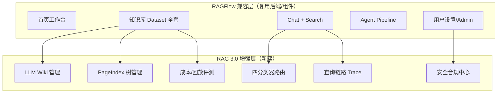

### 12.2 实施优先级

| 优先级 | 页面/模块 | 来源 | 工期估算 |
|--------|----------|------|---------|
| **P0** | 知识库配置（15种分块+GraphRAG） | RAGFlow | 2 周 |
| **P0** | 检索测试页 | RAGFlow | 1 周 |
| **P0** | 模型提供商 + 数据源 | RAGFlow | 2 周 |
| **P0** | 知识库详情 Tab 补全 | PRD 缺口 | 1 周 |
| **P0** | 查询链路 Trace | RAG 3.0 | 1 周 |
| **P1** | LLM Wiki 管理 | RAG 3.0 | 3 周 |
| **P1** | PageIndex 树预览/调试 | RAG 3.0 | 2 周 |
| **P1** | 四分类器 + 路由矩阵 | RAG 3.0 | 2 周 |
| **P1** | 知识图谱可视化 | RAGFlow | 1 周 |
| **P2** | Agent 画布扩展 | RAGFlow+RAG3 | 3 周 |
| **P2** | MCP / 团队 / API Key | RAGFlow | 1 周 |
| **P2** | 安全合规中心 | RAG 3.0 | 2 周 |
| **P2** | 成本中心 + 回放评测 | RAG 3.0 | 2 周 |
| **P3** | Memory / Skills / 分享嵌入 | RAGFlow 可选 | 按需 |

### 12.3 路由表增补（完整版）

```typescript
// src/router/index.tsx 增补路由
{ path: '/', element: <HomePage /> },
{ path: 'search', children: [
    { index: true, element: <SearchListPage /> },
    { path: ':searchId', element: <SearchPage /> },
]},
{ path: 'agent', children: [
    { index: true, element: <AgentListPage /> },
    { path: ':agentId', element: <AgentEditorPage /> },
]},
{ path: 'kb', children: [
    // ... 原有路由 ...
    { path: ':kbId/retrieval-test', element: <RetrievalTestPage /> },
    { path: ':kbId/settings', element: <KBSettingsPage /> },
    { path: ':kbId/knowledge-graph', element: <KnowledgeGraphPage /> },
    { path: ':kbId/wiki', element: <WikiBrowserPage /> },
    { path: ':kbId/wiki/compile', element: <WikiCompileQueuePage /> },
    { path: ':kbId/pageindex-tree', element: <PageIndexTreePage /> },
    { path: ':kbId/data-sources', element: <KBDataSourcesPage /> },
    { path: ':kbId/logs', element: <KBLogsPage /> },
    { path: ':kbId/permissions', element: <KBPermissionsPage /> },
    { path: 'recycle-bin', element: <KBRecycleBinPage /> },
]},
{ path: 'system', children: [
    // ... 原有路由 ...
    { path: 'data-sources', element: <DataSourcesPage /> },
    { path: 'models', element: <ModelProvidersPage /> },
    { path: 'mcp', element: <MCPPage /> },
    { path: 'team', element: <TeamPage /> },
    { path: 'api', element: <APIPage /> },
    { path: 'profile', element: <ProfilePage /> },
    { path: 'classifier', element: <ClassifierConfigPage /> },
    { path: 'security/poison', element: <PoisonQueuePage /> },
    { path: 'security/pii', element: <PIIRulesPage /> },
    { path: 'security/compliance', element: <ComplianceReportPage /> },
    { path: 'traces', element: <TracesPage /> },
]},
{ path: 'evaluation', children: [
    // ... 原有路由 ...
    { path: 'cost', element: <CostCenterPage /> },
    { path: 'replay', element: <ReplayEvalPage /> },
]},
{ path: 'dataflow-result', element: <DataflowResultPage /> },
{ path: 'document/:docId', element: <DocumentPreviewPage /> },
```

### 12.4 与架构文档的映射

| 架构章节 | 前端模块 |
|---------|---------|
| 第二部分 RAGFlow 详解 | §10 兼容层（配置/解析/分块/检索） |
| 第三部分 PageIndex | §11.2 树索引管理 |
| 第四部分 LLM Wiki | §11.1 Wiki 管理 |
| 第五部分 分类器路由 | §11.3 分类器配置 |
| 第六部分 混合检索融合 | §10.5 检索测试 + §4.2 查询增强面板 |
| 第七部分 安全合规 | §11.4 安全合规中心 |
| 第八部分 评测可观测 | §5 + §11.5 成本/回放 |

---

> **文档结束（v1.1）**
>
> 本文档为 RAG 3.0 知识库系统的前端界面实现方案。v1.1 在 v1.0 基础上新增：**§10 RAGFlow 兼容层**（首页、检索测试、知识库配置、Search/Agent、用户设置）、**§11 RAG 3.0 增强层**（Wiki、PageIndex、分类器路由、安全合规、成本可观测）、**§12 融合信息架构与实施优先级**。完整对照表见 `RAGFlow前端对照表.md`。本文档应与技术架构设计、API 接口设计、PRD 产品需求、`5-企业级RAG知识库3.0实现方案.md` 配合阅读。
