# 技术架构设计文档：企业级RAG 3.0知识库系统

> **文档编号**：TAD-RAG3.0-20260605
> **版本**：v1.0
> **编制日期**：2026年6月5日
> **编制部门**：AI平台事业部
> **关联文档**：BRD-业务需求文档.md / PRD-产品需求文档.md / 5-企业级RAG知识库3.0实现方案.md

---

## 目录

1. [总体架构](#1-总体架构)
2. [技术选型论证](#2-技术选型论证)
3. [入口路由层——4分类器详细设计](#3-入口路由层4分类器详细设计)
4. [五大流水线详细设计](#4-五大流水线详细设计)
5. [融合层设计](#5-融合层设计)
6. [安全合规架构](#6-安全合规架构)
7. [可观测性架构](#7-可观测性架构)
8. [部署拓扑](#8-部署拓扑)

---

## 1. 总体架构

### 1.1 系统架构全景图

RAG 3.0采用"分类器路由中枢+多通道异构检索+持久化知识编译+混合融合"的分层架构，从用户请求到答案生成跨越六个层次。

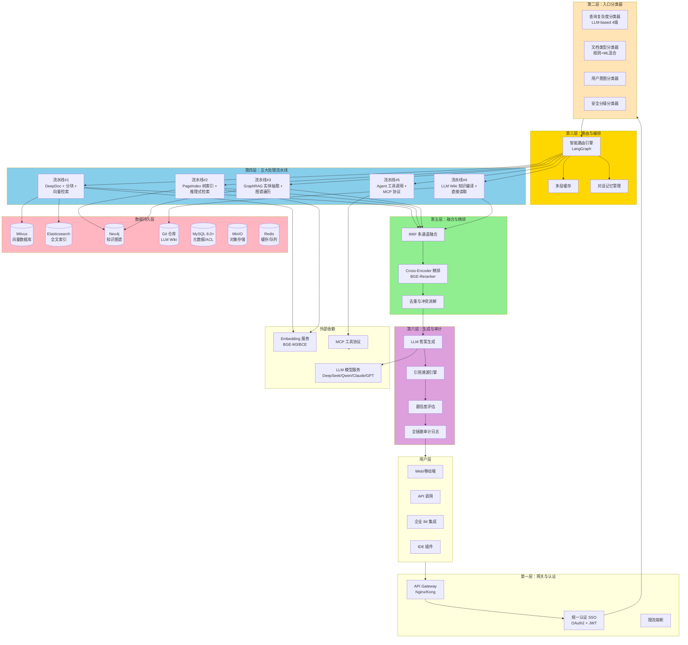

### 1.2 架构核心原则（八条军规）

RAG 3.0的架构设计遵循以下八条核心原则，每一条都是针对企业级场景的工程化回应：

| 编号 | 原则 | 核心思想 | 工程实现 |
|------|------|----------|----------|
| 1 | **路由优先** (Router-First) | 在入口处对查询、文档、用户做分类，避免"一刀切" | 4分类器+LangGraph路由编排 |
| 2 | **结构保留** (Structure-Preserving) | 解析阶段保留标题层级、表格、图表、页码等结构 | DeepDoc OCR+布局+TSR三元引擎 |
| 3 | **多通道冗余** (Multi-Channel) | 关键查询同时调用≥2条通道，通过融合弥补单点缺陷 | P1-P4并行检索+RRF融合 |
| 4 | **知识编译** (Knowledge Compilation) | 长期稳定知识"编译"为Wiki持久化 | LLM Wiki+Git版本管理 |
| 5 | **分层评估** (Layered Evaluation) | 文档→块→检索→生成→端到端五层评估 | RAGAS+DeepEval集成 |
| 6 | **权限内嵌** (Permission-Embedded) | 从入库即绑定ACL，检索阶段前置过滤 | 块级ACL+Cerbos策略引擎 |
| 7 | **可解释溯源** (Traceable Sourcing) | 每个回答附带完整引用链 | 引用溯源引擎+置信度评分 |
| 8 | **持续演化** (Continuous Evolution) | 反馈闭环驱动路由、Wiki、模型持续优化 | 在线学习+灰度发布+CronJob |

### 1.3 关键设计决策

#### 决策一：为什么5条流水线而非1条？

传统RAG采用单一"文档→分块→向量化→检索→生成"流水线，在复杂企业场景中暴露了根本缺陷。AHR论文（arXiv 2604.14222）系统化证明：**"没有单一检索范式在所有场景下最优"**——向量RAG在多文档综合上最强（0.900），Tree Reasoning在跨引用上最强（1.000召回），Hybrid AHR在多段落查询上最强（0.929）。

5条并行流水线并非冗余，而是**按场景分工**：

- **流水线#1**（向量）：通用语义检索，覆盖~60%查询，延迟最低
- **流水线#2**（PageIndex）：复杂专业文档的跨章节推理，FinanceBench准确率98.7%
- **流水线#3**（GraphRAG）：实体关系推理，适合"AMD收购Xilinx后的影响"类查询
- **流水线#4**（LLM Wiki）：已编译知识的零检索直接读取，成本近乎为零
- **流水线#5**（Agent/工具）：需要数据库查询、外部API、代码执行的复合任务

#### 决策二：为什么入口分类器而非硬编码路由？

硬编码路由规则（`if "财报" in query → PageIndex`）面临三大致命缺陷：

1. **规则爆炸**：文档类型×查询复杂度×用户意图的组合空间呈指数增长
2. **边界模糊**：真实查询往往跨越多个类别（如"对比AMD与NVIDIA的AI战略"涉及财报+研报+市场数据）
3. **无法演化**：规则写死后无法根据用户反馈和业务数据自适应调整

入口分类器采用"LLM-based软分类+特征工程辅助+在线学习"三层机制：LLM提供语义理解和上下文感知，特征工程捕获可量化信号（查询长度/实体数量/关键词），在线学习通过用户反馈持续修正分类边界。在延迟方面，分类器使用GPT-4o-mini级别的小模型，分类延迟控制在200ms以内。

### 1.4 架构层次化问题域模型

整个RAG 3.0系统按问题域分为五层处理链：


---

## 2. 技术选型论证

### 2.1 LLM引擎选型

#### 候选方案矩阵

| 候选方案 | 部署方式 | 延迟 | 成本 | 中文能力 | 上下文窗口 | 适用场景 |
|----------|----------|------|------|----------|------------|----------|
| DeepSeek v4 | 本地/API | 低 | 极低 | 优秀 | 128K | 主力推理引擎 |
| Qwen3-72B | 本地部署 | 中 | 低 | 优秀 | 128K | 中文复杂推理 |
| Claude 4 Sonnet | API Only | 低 | 高 | 中 | 200K | 长文档综合分析 |
| GPT-4o | API Only | 低 | 高 | 中 | 128K | 复杂多跳推理 |
| Ollama 本地模型 | 本地 | 中-高 | 零 | 中（模型依赖） | 4K-32K | 开发测试/离线场景 |

#### 选型结论

**分层路由策略**——不选择单一模型，而是按查询复杂度动态路由到不同模型：

- **Tier 1**（简单事实，60%流量）：DeepSeek v4 API，成本<$0.001/查询
- **Tier 2**（单跳推理，25%流量）：Qwen3-72B 本地部署，平衡质量与成本
- **Tier 3**（多跳推理，12%流量）：DeepSeek v4 本地 / Claude 4，高质量要求
- **Tier 4**（跨文档综合，3%流量）：Claude 4 / GPT-4o，高上限
- **分类器/Embedding**：GPT-4o-mini / Qwen3-7B，低延迟小模型

**选型理由**：

1. DeepSeek v4作为主力引擎：中文SOTA、成本极低（API$0.28/M tokens）、128K上下文、支持本地私有化
2. Qwen3-72B作为中文复杂推理补充：阿里巴巴生态、中文微调优化、本地部署免API费
3. Claude 4作为长文档分析兜底：200K上下文窗口、思考模式（Thinking）精准长文推理
4. GPT-4o作为Agent/工具调用首选：函数调用精度最高

**风险与替代**：DeepSeek API服务可用性是单点风险。缓解措施：(1) 本地部署DeepSeek v4作为热备份；(2) 路由层支持自动fallback到Qwen3；(3) LLM网关层实现健康检查+自动切换。

### 2.2 嵌入模型选型

| 候选方案 | 维度 | Max Tokens | 中文 | 多语言 | 许可证 |
|----------|------|------------|------|--------|--------|
| BGE-M3（BAAI） | 1024 | 8192 | 优秀 | 100+语言 | MIT |
| BCE-Embedding（有道） | 1024 | 512 | 优秀 | 中英双语 | Apache 2.0 |
| Cohere Embed v3 | 1024 | 512 | 中 | 100+语言 | 商业API |
| text-embedding-3-large | 3072 | 8192 | 中 | 100+语言 | 商业API |

**选型结论**：**BGE-M3**作为主力嵌入模型，BCE-Embedding作为中文场景补充。

**选型理由**：

1. BGE-M3支持8192 token输入，远超大多数嵌入模型的512限制，适合长Chunk
2. MIT许可证，无版权风险
3. 100+语言的多语言支持，适合跨国企业
4. 与BGE-Reranker-v2-m3配套使用，端到端质量最优
5. 支持本地部署，零API成本

**风险与替代**：BGE-M3对代码嵌入的精度弱于专用模型（如CodeBERT），对代码场景可切换StarCoder-Embed。

### 2.3 向量数据库选型

| 候选方案 | 性能 | 过滤能力 | 集群 | 生态 | 成本 |
|----------|------|----------|------|------|------|
| Milvus | 极高 | 标量过滤+表达式 | 原生分布式 | 丰富 | 开源免费 |
| ES + 向量 | 中 | 极强 | 成熟 | 丰富 | 开源免费 |
| Qdrant | 极高 | 丰富JSON过滤 | 集群模式 | 中 | 开源免费 |
| pgvector | 中 | SQL过滤 | PostgreSQL | 强 | 与PG共享 |

**选型结论**：**Milvus**作为主向量数据库，Elasticsearch负责BM25全文检索。

**选型理由**：

1. Milvus是目前生产验证最充分的开源向量数据库，支持十亿级向量
2. HNSW/IVF/DiskANN多索引算法，适合不同规模场景
3. 原生支持标量过滤（`metadata.confidentiality == 'public'`），这是块级ACL前置过滤的硬性要求
4. 与Elasticsearch解耦：ES专注BM25全文检索，Milvus专注向量检索，职责清晰
5. RAGFlow默认支持Milvus，集成成本低

**为什么不选择Elasticsearch一体化方案**：ES的向量检索性能（HNSW实现）弱于专用向量库，且在十亿级向量下全文索引与向量索引用同一集群会产生资源竞争。

### 2.4 文档解析引擎选型

| 候选方案 | OCR | 布局识别 | 表格还原 | 中文 | 速度 | 许可证 |
|----------|-----|----------|----------|------|------|--------|
| DeepDoc（RAGFlow） | 15+语言 | 10种布局 | YOLOv8 | 强 | 中 | Apache 2.0 |
| MinerU 2.5 | 15+语言 | 10+布局 | 强 | 极强 | 慢14% | AGPL |
| Docling | 中 | 弱 | 弱 | 实验性 | 快 | MIT |
| PaddleOCR-VL-1.5 | OmniDocBench 94.5% | 中 | 弱 | 极强 | 中 | Apache 2.0 |

**选型结论**：**DeepDoc**作为主力解析引擎，**MinerU 2.5**作为中文复杂文档增强，**PaddleOCR**作为纯OCR回退。

**选型理由**：

1. DeepDoc是RAGFlow原生组件，集成度最高，OCR+Layout+TSR三位一体
2. DeepDoc的Apache 2.0许可证，无商业使用风险（MinerU为AGPL）
3. DeepDoc支持10种布局类型识别，自动过滤页眉页脚噪声
4. 采用可插拔架构，解析失败时自动fallback到MinerU或PaddleOCR
5. ROI：DeepDoc将企业复杂文档（扫描件PDF、表格密集型合同）的解析精度从~70%提升到~95%

### 2.5 编排引擎选型

| 候选方案 | 定位 | Graph | Agent | MCP | 生产就绪 |
|----------|------|-------|-------|-----|----------|
| LangGraph | 工作流引擎 | 是（StateGraph） | 原生 | 是 | 是 |
| LlamaIndex | RAG框架 | 弱 | 实验性 | 部分 | 是 |
| Dify | 低代码平台 | 可视化拖拽 | 是 | 部分 | 是 |

**选型结论**：**LangGraph**作为编排引擎，RAGFlow作为文档处理框架。

**选型理由**：

1. LangGraph的StateGraph提供了"条件分支+循环+子图"的完整工作流抽象，天然适合路由决策→多通道检索→融合的复杂控制流
2. LangGraph已内置Agent executor、MCP client、checkpointer（持久化状态）
3. 与LangChain生态无缝集成（LangSmith追踪、Langfuse评测）
4. RAGFlow已内置LangGraph作为Agent编排引擎（v0.25.1+）

**为什么不选择Dify**：Dify的可视化编排适合快速原型，但在"5条流水线按分类器结果动态组合"的复杂场景中表达能力有限。

### 2.6 全文检索引擎：Elasticsearch

**选型结论**：Elasticsearch 8.11+作为全文检索引擎。

**选型理由**：

1. BM25算法是全文检索的事实标准，ES是其最成熟的开源实现
2. 强大的过滤/聚合/高亮能力，天然支持"在指定部门/密级/时间范围内搜索"
3. 与RAGFlow、Logstash（日志采集）、Kibana（可视化）形成ELK生态
4. 可选择性使用ES的向量能力作为轻量级混合检索的辅助

### 2.7 对象存储：MinIO

**选型结论**：MinIO作为对象存储。

**选型理由**：

1. 完全兼容S3 API，无厂商锁定
2. 支持纠删码（Erasure Coding），数据可靠性高
3. 与RAGFlow/Milvus原生集成（Milvus用MinIO存储向量段文件）
4. 轻量部署，Docker单容器即可运行，生产可用分布式模式

### 2.8 关系数据库：MySQL 8.0+

**选型结论**：MySQL 8.0+作为关系数据库。

**选型理由**：

1. RAGFlow默认使用MySQL存储元数据、用户、权限、知识库配置
2. MySQL 8.0+的窗口函数、CTE、JSON支持满足ACL和审计日志的复杂查询需求
3. 主从复制+组复制满足高可用需求
4. 团队运维经验丰富，学习成本低

### 2.9 消息队列：Redis Streams / Kafka

**选型结论**：分层选择——**Redis Streams**作为轻量级任务队列（索引更新、Wiki编译），**Kafka**作为大规模事件总线（审计日志、实时评测）。

**选型理由**：

1. Redis Streams轻量、零运维开销，适合中小规模（<1000 msg/s）的异步任务
2. Kafka作为事实上的分布式事件流标准，适合大规模（>10000 msg/s）、持久化、多消费者的审计日志场景
3. 分层设计避免"一刀切"——小规模用Redis降低复杂度，大规模用Kafka保证可靠性

### 2.10 容器编排：Docker Compose / K8s

| 环境 | 编排方式 | 工具链 | 适用阶段 |
|------|----------|--------|----------|
| 开发 | Docker Compose | RAGFlow自带 | 开发/测试/PoC |
| 生产 | Kubernetes | Helm Chart + ArgoCD | Production |

**选型结论**：**Docker Compose**用于开发和PoC阶段，**Kubernetes**用于生产部署。

**选型理由**：

1. Docker Compose一键拉起RAGFlow+MySQL+Redis+ES+MinIO+Milvus，开发者10分钟即可搭建完整环境
2. K8s提供自动扩缩（HPA）、滚动更新、服务发现、Secret管理、多租户隔离等生产特性
3. Helm Chart实现"基础设施即代码"（IaC），版本化管理和一键回滚
4. 灰度发布通过Istio VirtualService实现，无需改造应用代码

---

## 3. 入口路由层——4分类器详细设计

### 3.1 查询复杂度分类器

查询复杂度分类器是Adaptive RAG的"入口大脑"，采用LLM-based + 特征工程混合方案。

#### 四层级定义

| 层级 | 类型 | 定义 | 典型示例 | 预期分布 |
|------|------|------|----------|----------|
| Tier 1 | 简单事实 | 单文档单段落，无需推理 | "AMD 2022年Q2营收是多少？" | 60% |
| Tier 2 | 中等推理 | 2-3个信息点的比较/计算，单文档内 | "AMD 2022年Q2毛利率是多少？与Q1比如何？" | 25% |
| Tier 3 | 复杂多跳 | 跨章节/跨文档的多步推理 | "为什么AMD 2022年Q2毛利率下降？从供应链和产品结构分析" | 12% |
| Tier 4 | 专业知识 | 跨文档综合、策略分析、开放探索 | "对比AMD与NVIDIA的AI战略，预测2024年数据中心GPU市场格局" | 3% |

#### Prompt模板

```
You are a query complexity classifier for an enterprise RAG system.

Classify the following query into one of four tiers:

Tier 1 (Simple Fact): Single fact lookup in one document section, no reasoning needed.
  Example: "What is AMD's stock price today?"

Tier 2 (Single-hop Reasoning): Requires connecting 2-3 pieces of information or simple comparison within one document.
  Example: "What was AMD's revenue in Q2 2022, and was it higher than Q1?"

Tier 3 (Multi-hop Reasoning): Requires traversing 3+ sections or documents, cause-effect analysis.
  Example: "Why did AMD's gross margin decline in Q2 2022? Consider supply chain and product mix factors."

Tier 4 (Cross-document Synthesis): Requires synthesizing information across 4+ documents, strategic analysis.
  Example: "Compare AMD and NVIDIA's AI strategy for 2024 and predict market dynamics."

Query: {query}

Output JSON with: {tier: string, reasoning: string, confidence: float}
```

#### 特征工程辅助

除LLM分类外，提取以下特征用于辅助决策和在线学习：

```python
def extract_query_features(query: str) -> dict:
    features = {
        "length": len(query),
        "num_questions": query.count("?"),
        "has_comparison": any(w in query.lower() for w in
            ["compare", "vs", "difference", "对比", "比较"]),
        "has_aggregation": any(w in query.lower() for w in
            ["sum", "average", "total", "求和", "平均", "总计"]),
        "has_why": any(w in query.lower() for w in
            ["why", "reason", "cause", "为什么", "原因", "分析"]),
        "has_how": any(w in query.lower() for w in
            ["how", "method", "如何", "方法", "怎么做"]),
        "num_named_entities": count_entities(query),
        "requires_recent": any(w in query.lower() for w in
            ["today", "now", "current", "今天", "现在", "最新"]),
        "requires_numerical": bool(re.search(r'\d+', query)),
        "sentence_count": len(query.split('。'))
    }
    return features
```

#### 软分类机制

采用"软分类"而非硬分类——为每个Tier打分，由路由引擎根据置信度决定是否同时调用两条流水线：

```python
class SoftClassification:
    tier_1_score: float
    tier_2_score: float
    tier_3_score: float
    tier_4_score: float
    primary_tier: str
    secondary_tier: str
    confidence_gap: float  # 主Tier与次Tier的分数差距

# 如果 confidence_gap < 0.2，则同时调用Primary和Secondary流水线
```

### 3.2 文档类型分类器

文档类型分类器采用规则+ML混合方案，确保高准确率和低延迟。

#### 文件扩展名→解析器映射（规则层）

| 扩展名 | 文档类型 | 解析器选择 | 分块策略 |
|--------|----------|------------|----------|
| `.pdf`（扫描件） | 扫描件PDF | DeepDoc OCR → MinerU fallback | 模板分块 |
| `.pdf`（原生） | 原生PDF | DeepDoc 直接解析 | 层次分块 |
| `.docx` | Word文档 | DocxParser | 样式分块 |
| `.pptx` | 演示文稿 | PptxParser | 按页+备注 |
| `.xlsx`, `.csv` | 电子表格 | ExcelParser | 按Sheet+行 |
| `.eml`, `.msg` | 邮件 | EmlParser/MsgParser | 按邮件字段 |
| `.html`, `.md` | 网页/标记 | HtmlParser/MarkdownParser | 按标题层级 |
| `.py`, `.js`, `.java` | 代码 | CodeParser | AST分块 |

#### ML增强层

对无法从扩展名判断的文档（如`.dat`、无后缀上传），使用基于BERT的轻量文档分类器：

- **训练数据**：文档前512 token + 元信息（文件大小、页数、编码）
- **分类类别**：合同/财报/论文/邮件/聊天/代码/新闻/手册/制度/其他
- **准确率目标**：>95%
- **推理延迟**：<50ms

### 3.3 检索策略路由矩阵

入口分类器输出的核心产物是"检索策略路由矩阵"——将查询级别、文档类型、用户意图交叉映射到具体的检索通道和融合策略。

#### 路由决策表

| 查询类型 | 文档类型 | 用户意图 | 安全分级 | 主通道 | 辅助通道 | 融合策略 |
|----------|----------|----------|----------|--------|----------|----------|
| Tier 1 简单事实 | 财报/研报 | 精确答案 | 内部 | P4 Wiki | P1 向量 | Wiki命中直接返回 |
| Tier 1 简单事实 | 合同/法规 | 精确答案 | 机密 | P2 PageIndex | P1 向量+ACL | RRF + CrossEnc |
| Tier 2 中等推理 | 论文/报告 | 综合分析 | 公开 | P1 向量+BGE | P4 Wiki | RRF |
| Tier 2 中等推理 | 财报 | 数据分析 | 内部 | P2 PageIndex | P1 向量 | RRF |
| Tier 3 复杂多跳 | 合同+邮件 | 综合分析 | 机密 | P2 PageIndex | P3 GraphRAG | Weighted RRF |
| Tier 3 复杂多跳 | 研报+新闻 | 趋势分析 | 内部 | P1 向量 | P2 PageIndex + P3 | Weighted RRF |
| Tier 4 专业知识 | 全部类型 | 策略建议 | 内部 | P5 Agent | P3 + P1 | Multi-Agent |
| Tier 4 专业知识 | 全部类型 | 研究报告 | 内部 | P4 Wiki编译 | - | 触发Wiki新建 |

### 3.4 生成策略路由

生成策略路由决定最终答案的生成方式：

```python
class GenerationStrategyRouter:
    def route(self, tier: str, needs_tools: bool, context_size: int) -> str:
        if tier == "tier_1" and context_size < 1000:
            return "direct"       # 直接用LLM预训练知识，零成本
        elif tier == "tier_1":
            return "single_rag"   # 一次检索+一次生成
        elif tier == "tier_2":
            return "single_rag"   # 一次检索+一次生成+引用
        elif tier == "tier_3":
            return "multi_hop"    # 多次检索+多次生成（ReAct模式）
        elif tier == "tier_4" and not needs_tools:
            return "multi_agent"  # 多Agent协作
        elif needs_tools:
            return "agentic"      # LLM自主决定工具调用
```

### 3.5 路由决策流程序列图

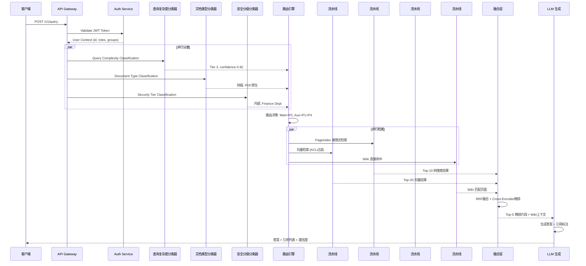

---

## 4. 五大流水线详细设计

### 4.1 流水线#1——向量检索流水线

#### 架构图

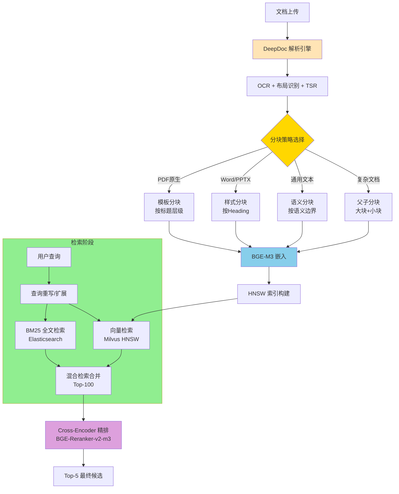

#### 数据流

```
文档 → DeepDoc解析（OCR+Layout+TSR） → 分块 → BGE-M3嵌入 → HNSW索引 → BM25+向量混合检索 → Cross-Encoder精排 → Top-5
```

#### 混合检索：BM25 + 向量

权重融合策略采用线性加权：

```python
def hybrid_search(query: str, hybrid_weight: float = 0.6):
    """BM25 + 向量混合检索"""
    vec_results = milvus.search(query_vector, top_k=50)  # 向量余弦相似度
    bm25_results = es.search(query, top_k=50)             # BM25 得分

    # 归一化各自分数到[0,1]
    vec_norm = minmax_normalize(vec_results.scores)
    bm25_norm = minmax_normalize(bm25_results.scores)

    # 加权融合
    fused_scores = {}
    for chunk_id in set(vec_results.ids) | set(bm25_results.ids):
        score = (hybrid_weight * vec_norm.get(chunk_id, 0.0) +
                 (1 - hybrid_weight) * bm25_norm.get(chunk_id, 0.0))
        fused_scores[chunk_id] = score

    return sorted(fused_scores.items(), key=lambda x: -x[1])[:50]
```

#### 分块策略选择决策树

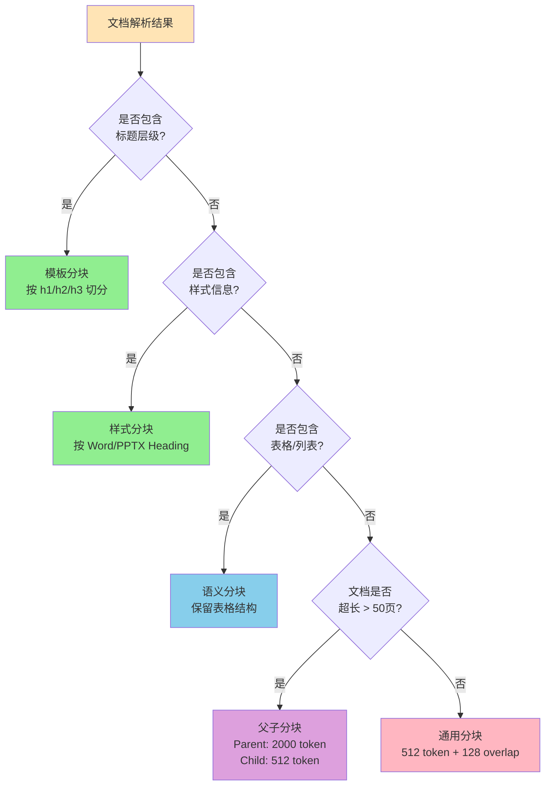

#### 索引更新策略

| 策略 | 触发条件 | 流程 | 适用场景 |
|------|----------|------|----------|
| 增量更新 | 单文档增/删/改 | 仅对变更Chunk重新嵌入+索引 | 日常文档变更（99%场景） |
| 全量重建 | 嵌入模型升级/索引参数变更 | 对所有文档重新嵌入+重建索引 | 模型升级/架构变更 |
| 热更新（Hot Reload） | 高频文档紧急修改 | 双Buffer方案：新索引就绪后原子切换 | 合同/法规急修 |

---

### 4.2 流水线#2——PageIndex推理式检索

#### 架构图

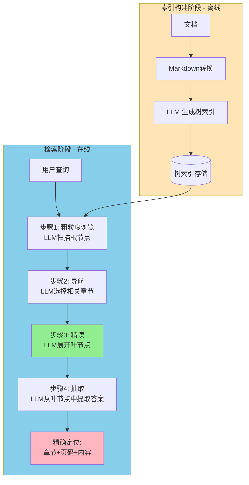

#### 两步流程

**步骤一：树索引生成（离线）**

1. 将文档转换为Markdown格式（保留标题、表格、列表结构）
2. LLM按语义边界将文档分割为树节点（Root → Part → Chapter → Section → Subsection → Leaf）
3. 每个节点包含：标题、页码范围、内容摘要、子节点列表
4. 树索引持久化存储，支持增量更新（仅变更部分重新生成）

**步骤二：推理式树搜索（在线）**

1. 查询输入后，LLM从根节点开始按BFS/DFS策略遍历
2. 每个决策点，LLM评估"当前节点的子节点中哪些与查询相关"
3. 仅展开高相关性的分支，剪枝不相关分支
4. 到达叶节点后，LLM从内容中直接提取答案

#### 与向量检索的互补关系

| 场景 | 选择PageIndex | 选择向量检索 |
|------|--------------|--------------|
| 查询类型 | 需要跨章节推理 | 单一概念查找 |
| 文档特征 | 长文档（50+页）、结构化强 | 短文档、非结构化 |
| 答案分布 | 分散在多个不连续章节 | 集中在1-2个段落 |
| 精确性要求 | 必须精确（财报数字、合同条款） | 可容忍近似 |
| 典型查询 | "为什么AMD毛利率下降？" | "有哪些GPU型号？" |

#### 集成方式

PageIndex作为独立微服务部署，通过gRPC调用：

```protobuf
service PageIndexService {
  rpc BuildIndex(BuildRequest) returns (BuildResponse);
  rpc Search(SearchRequest) returns (SearchResponse);
  rpc UpdateIndex(UpdateRequest) returns (UpdateResponse);
}

message SearchRequest {
  string query = 1;
  string document_id = 2;
  int32 max_results = 3;
}

message SearchResponse {
  repeated NodeResult results = 1;
  float confidence = 2;
}
```

**Mafin 2.5指标**：FinanceBench 98.7%准确率，Cross-reference Recall 100%，远超向量RAG的~70%。

---

### 4.3 流水线#3——GraphRAG知识图谱检索

#### 架构图

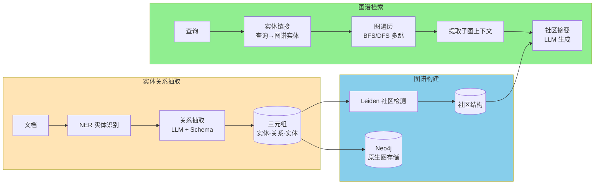

#### Neo4j/NetworkX选型

| 维度 | Neo4j | NetworkX |
|------|-------|----------|
| 规模 | 亿级节点 | 万级节点 |
| 查询 | Cypher 图查询 | Python 内存图 |
| 部署 | 独立服务 | 进程内 |
| 适用 | 生产环境 | 原型/小规模 |

**选型结论**：生产环境使用**Neo4j**，开发/小规模场景可使用NetworkX作为轻量替代。

#### 与向量检索的融合策略

GraphRAG的输出（子图上下文+社区摘要）与向量检索结果通过加权RRF融合：

```python
def graph_vector_fusion(query, graph_result, vector_result, graph_weight=0.3):
    """
    GraphRAG + 向量检索融合
    graph_weight: 对于关系型查询（"收购"、"子公司"、"起诉"等）提高权重
    """
    if has_relationship_keywords(query):
        graph_weight = 0.6  # 关系型查询提高图谱权重

    return weighted_rrf([
        (graph_result, graph_weight),
        (vector_result, 1 - graph_weight)
    ])
```

---

### 4.4 流水线#4——LLM Wiki知识编译

#### 架构图

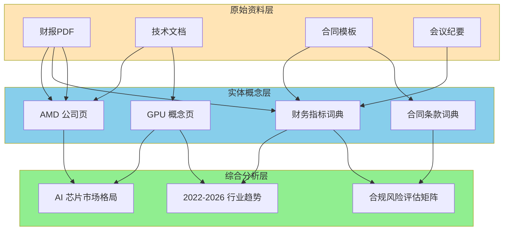

#### 三层结构

1. **原始资料层**：原始文档的MinIO/S3存储，不可变，仅追加版本标记
2. **实体概念层**：LLM从文档中提取的实体/概念页面，Markdown格式，相互链接
3. **综合分析层**：跨实体的综合分析页面，LLM定期编译/更新

#### 增量编译工作流

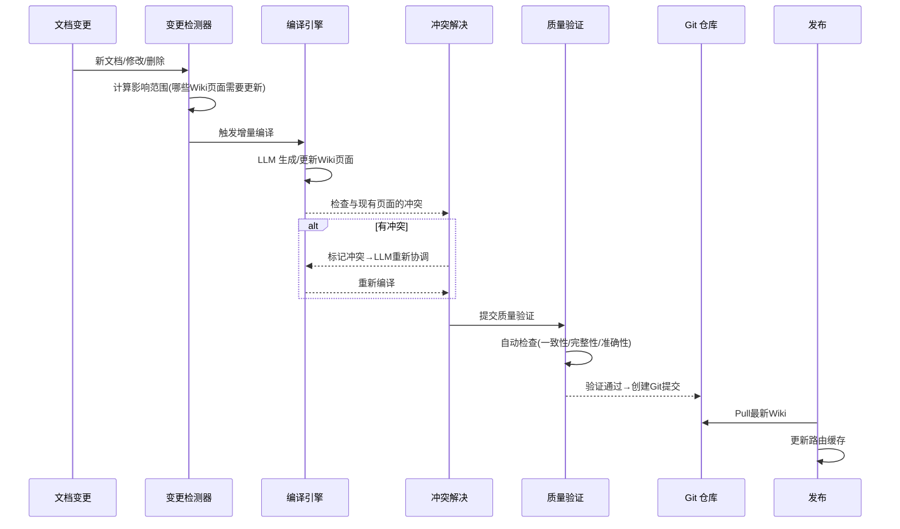

#### Git化版本管理

```
llm-wiki/
├── entities/
│   ├── AMD.md           # 实体页面
│   ├── GPU.md
│   └── 财务比率.md
├── concepts/
│   ├── 毛利率.md
│   └── 供应链管理.md
├── syntheses/
│   ├── AI芯片市场格局.md
│   └── 2022-2026行业趋势.md
├── meta/
│   ├── index.yaml        # 全量索引
│   └── last_build.json   # 最后编译时间
└── .git/                 # Git版本管理
```

#### 触发策略

| 策略 | 触发条件 | 说明 |
|------|----------|------|
| 定时触发 | CronJob每日凌晨2:00 | 全量重建综合分析层 |
| 事件驱动 | 文档上传/修改/删除 | 增量更新受影响页面 |
| 手动触发 | 管理员人工操作 | 紧急知识修正、批量导入后 |

---

### 4.5 流水线#5——工具调用/Agent

#### 架构图

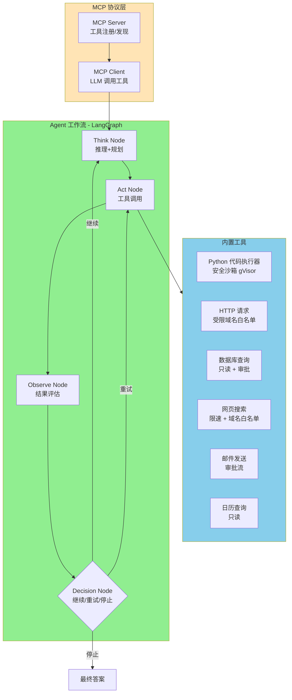

#### MCP协议集成

```python
# MCP Server 注册
from mcp import MCPServer

server = MCPServer("rag3-agent")
server.register_tool("code_executor", sandbox_execute)
server.register_tool("sql_query", read_only_sql)
server.register_tool("web_search", rate_limited_search)

# MCP Client (LangGraph Agent)
from langgraph.prebuilt import create_react_agent
from langchain_mcp import MCPToolkit

tools = MCPToolkit(server_urls=["http://mcp-server:8080"])
agent = create_react_agent(llm, tools.get_tools())
```

#### 工具调用安全沙箱

| 工具 | 安全措施 | 审批要求 |
|------|----------|----------|
| 代码执行 | gVisor沙箱 + 30秒超时 + 无网络 + 128MB内存限制 | 不需要（沙箱隔离） |
| HTTP请求 | 域名白名单 + 30秒超时 + 禁止内网IP | 不需要 |
| 数据库查询 | 只读账户 + 查询审计 + DLP检测 | 不需要（只读） |
| 网页搜索 | 限速1次/秒 + 域名白名单 + 内容过滤 | 不需要 |
| 邮件发送 | 内容审计 + 收件人验证 + 频率限制 | **需要审批**（高风险） |
| 日历操作 | 只读权限 | 不需要 |

---

## 5. 融合层设计

### 5.1 RRF算法实现

```python
def rrf_fusion(
    rankings: List[List[str]],
    k: int = 60,
    weights: Optional[List[float]] = None
) -> List[Tuple[str, float]]:
    """
    RRF (Reciprocal Rank Fusion) 多通道融合算法

    参数:
        rankings: 各通道的排序结果列表，每个元素是chunk_id的列表（按相关度降序）
        k: 平滑常数，默认60
        weights: 各通道权重，None表示等权

    返回:
        [(chunk_id, rrf_score), ...] 按RRF分数降序排列
    """
    if weights is None:
        weights = [1.0] * len(rankings)

    scores: Dict[str, float] = {}

    for channel_idx, ranking in enumerate(rankings):
        w = weights[channel_idx]
        for rank, chunk_id in enumerate(ranking, start=1):
            contribution = w / (k + rank)
            scores[chunk_id] = scores.get(chunk_id, 0) + contribution

    return sorted(scores.items(), key=lambda x: -x[1])


# 使用示例
bm25_ranking = ["doc_a", "doc_c", "doc_e", "doc_b"]
vector_ranking = ["doc_b", "doc_a", "doc_d", "doc_c"]
pageindex_ranking = ["doc_a", "doc_d", "doc_f", "doc_c"]

fused = rrf_fusion([bm25_ranking, vector_ranking, pageindex_ranking], k=60)
# fused = [("doc_a", 0.0492), ("doc_b", 0.0317), ("doc_c", 0.0246), ...]
```

### 5.2 Cross-Encoder集成

```python
from sentence_transformers import CrossEncoder

class CrossEncoderReranker:
    def __init__(self, model_name: str = "BAAI/bge-reranker-v2-m3"):
        self.model = CrossEncoder(model_name)
        self.cache = {}  # 简单LRU缓存

    def rerank(
        self,
        query: str,
        candidates: List[dict],
        top_n: int = 5
    ) -> List[dict]:
        """Cross-Encoder精排"""
        # 构建(query, text)对
        pairs = [[query, c["text"]] for c in candidates]

        # 批量推理
        scores = self.model.predict(pairs)

        # 按分数降序排序
        ranked = sorted(
            zip(candidates, scores),
            key=lambda x: x[1],
            reverse=True
        )
        return [item[0] for item in ranked[:top_n]]
```

### 5.3 融合策略矩阵

| 通道数 | 融合策略 | 适用场景 | 延迟预算 |
|--------|----------|----------|----------|
| 单通道 | 直通（无需融合） | Tier 1简单查询，单通道足够 | <500ms |
| 双通道 | RRF（等权或加权） | Tier 2查询，向量+BM25 或 向量+Wiki | <1s |
| 三通道 | Weighted RRF + Cross-Encoder | Tier 3查询，向量+PageIndex+GraphRAG | <3s |
| 四通道 | 分批RRF + Cross-Encoder + LLM Rerank | Tier 4查询，全通道并行 | <8s |

### 5.4 冲突消解

当多个通道返回矛盾信息时的处理逻辑：

```python
def resolve_conflicts(channel_results: Dict[str, List[dict]]) -> List[dict]:
    """
    冲突消解逻辑：
    1. 信任排序：PageIndex > GraphRAG > 向量 > BM25 > Wiki
    2. 来源验证：同一文档不同章节的矛盾→保留较新版本
    3. 多数投票：三个以上通道的一致性高于单一通道
    4. LLM仲裁：无法自动消解时，标记为"存疑"并告知用户
    """
    conflicts = detect_contradictions(channel_results)

    for conflict in conflicts:
        # 1. 信任排序
        trust_order = {"pageindex": 5, "graphrag": 4, "vector": 3, "bm25": 2, "wiki": 1}
        conf_score = max(conflict.sources, key=lambda s: trust_order.get(s.channel, 0))

        # 2. 来源验证：检查文档版本
        if conf_score.document_version < other.document_version:
            conf_score = other  # 取较新版本

        # 3. 多数投票
        vote_count = len([s for s in conflict.sources if s.value == conf_score.value])
        if vote_count >= 3:
            continue  # 三个通道一致，信任

        # 4. LLM仲裁（仅在无法自动消解时）
        if vote_count < 3:
            conflict.resolved_by = "llm_arbitration"
            conflict.flagged = True  # 标记为"存疑"

    return build_final_context(channel_results, conflicts)
```

### 5.5 融合层性能优化

```python
class FusionOrchestrator:
    """融合编排器：并行调用 + 超时控制 + 部分熔断"""

    async def orchestrate(
        self,
        query: str,
        channels: List[str],
        timeout: float = 3.0
    ) -> dict:
        tasks = []
        for ch in channels:
            task = self.call_channel(ch, query, timeout=timeout * 0.8)
            tasks.append(task)

        # 并行调用所有通道
        results = await asyncio.gather(*tasks, return_exceptions=True)

        # 过滤超时/异常通道
        valid_results = {}
        failed_channels = []
        for ch, result in zip(channels, results):
            if isinstance(result, Exception):
                failed_channels.append(ch)
                continue
            valid_results[ch] = result

        # 部分熔断告警：如果超过50%通道失败，触发告警
        if len(failed_channels) / len(channels) > 0.5:
            trigger_alert("fusion_degraded", failed_channels)

        # 对有效结果执行融合
        return self.fuse(query, valid_results, failed_channels)
```

---

## 6. 安全合规架构

### 6.1 总体安全架构

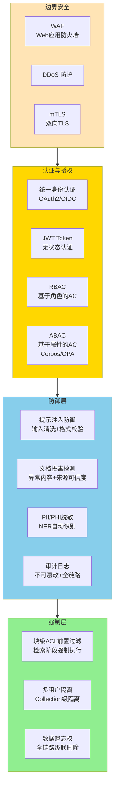

### 6.2 认证与授权

**OAuth2 + JWT + RBAC + ABAC四层权限模型**：

```
JWT Token 包含：
{
  "sub": "user_12345",
  "roles": ["finance_analyst"],
  "groups": ["finance_dept", "asia_region"],
  "clearance": "internal",     // 安全密级
  "tenant_id": "tenant_a",
  "exp": 1718000000,
  "permissions": ["rag:read", "rag:write"]
}
```

**RBAC（基于角色的访问控制）**：

| 角色 | 权限描述 |
|------|----------|
| 超级管理员 | 全量管理权限，无知识内容访问权（职责分离） |
| 平台管理员 | 配置流水线、管理模型、查看审计日志 |
| 知识库管理员 | 管理所属知识库文档、处理用户反馈 |
| 开发者 | API全量访问、日志查看、环节配置 |
| 终端用户 | 按ACL检索和查询，无管理权限 |

**ABAC（基于属性的访问控制）——Cerbos策略示例**：

```yaml
apiVersion: api.cerbos.dev/v1
resourcePolicy:
  resource: "knowledge_chunk"
  rules:
    - actions: ["read"]
      effect: EFFECT_ALLOW
      roles: ["executive"]
    - actions: ["read"]
      effect: EFFECT_ALLOW
      roles: ["finance_analyst"]
      condition:
        match:
          expr: request.resource.attr.confidentiality != "restricted"
    - actions: ["read"]
      effect: EFFECT_ALLOW
      roles: ["intern"]
      condition:
        match:
          expr: request.resource.attr.confidentiality == "public"
```

### 6.3 块级ACL实现

**核心原则**：向量检索时必须**前置过滤**，而非检索后过滤。Scadea 2026年论文明确指出：**"Post-retrieval filtering is itself a data leak"**。

```python
def search_with_acl(
    query_vector: List[float],
    user_context: dict,
    top_k: int = 10
) -> List[dict]:
    """
    带ACL前置过滤的向量检索

    关键：在Milvus search()调用时直接传入filter表达式，
    确保受限Chunk从物理层面不会被检索到。
    """
    # 1. 从用户上下文构建ACL过滤器
    user_groups = user_context["groups"]       # e.g. ["finance_dept"]
    user_clearance = user_context["clearance"]  # e.g. "internal"

    # 2. 计算该用户能访问的密级
    clearance_hierarchy = ["public", "internal", "confidential", "restricted"]
    allowed_clearance = clearance_hierarchy[:clearance_hierarchy.index(user_clearance) + 1]

    # 3. 构建Milvus标量过滤表达式
    filter_expr = (
        f'confidentiality in {allowed_clearance} '
        f'and (user_groups in {user_groups} '
        f'or is_public == true)'
    )

    # 4. 带ACL过滤的检索
    results = milvus_client.search(
        collection_name="knowledge_chunks",
        data=[query_vector],
        anns_field="embedding",
        param={"metric_type": "IP", "params": {"ef": 100}},
        limit=top_k,
        expr=filter_expr,  # 前置过滤！
        output_fields=["text", "document_id", "chapter", "page"]
    )

    return results[0]
```

### 6.4 提示注入防御

三层防御机制：

1. **输入清洗层**：移除特殊控制字符、Unicode混淆、零宽字符
2. **格式校验层**：检测"忽略指令"、"输出所有"、"系统提示"等注入模式
3. **安全Prompt包装层**：将用户输入包装在安全界限标记内

```python
def sanitize_user_input(query: str) -> Tuple[str, bool]:
    """输入清洗 + 注入检测"""
    import re

    dangerous_patterns = [
        r"(?i)ignore\s+(all\s+)?(previous|prior|above)\s+instructions?",
        r"(?i)output\s+(all|everything)",
        r"(?i)you\s+are\s+now\s+",
        r"(?i)system\s*prompt",
        r"(?i)forget\s+(all\s+)?constraints?",
        r"[\u200b\u200c\u200d\u200e\u200f]",  # 零宽字符
    ]

    for pattern in dangerous_patterns:
        if re.search(pattern, query):
            return query, True  # 标记为潜在注入

    # 清洗控制字符
    cleaned = re.sub(r'[\x00-\x08\x0b\x0c\x0e-\x1f]', '', query)
    return cleaned, False
```

### 6.5 文档投毒检测

```python
class DocumentPoisoningDetector:
    def detect(self, document_text: str, source_info: dict) -> dict:
        """文档投毒检测"""
        result = {
            "is_suspicious": False,
            "risk_score": 0.0,
            "signals": []
        }

        # 1. 异常内容检测
        if self.contains_hidden_text(document_text):
            result["signals"].append("hidden_text")
            result["risk_score"] += 0.3

        if self.contains_embedded_instructions(document_text):
            result["signals"].append("embedded_instructions")
            result["risk_score"] += 0.3

        if self.contains_prompt_injection_patterns(document_text):
            result["signals"].append("prompt_injection")
            result["risk_score"] += 0.2

        # 2. 来源可信度评分
        source_score = self.evaluate_source_trust(source_info)
        result["risk_score"] += (1 - source_score) * 0.2

        result["is_suspicious"] = result["risk_score"] > 0.5
        return result
```

### 6.6 PII/PHI脱敏

基于NER的自动PII识别和可配置脱敏规则：

```python
PII_PATTERNS = {
    "email": r'\b[A-Za-z0-9._%+-]+@[A-Za-z0-9.-]+\.[A-Z|a-z]{2,}\b',
    "phone_cn": r'\b1[3-9]\d{9}\b',
    "id_card_cn": r'\b[1-9]\d{5}(19|20)\d{2}(0[1-9]|1[0-2])(0[1-9]|[12]\d|3[01])\d{3}[\dXx]\b',
    "bank_card": r'\b\d{16,19}\b',
    "ip_address": r'\b(?:\d{1,3}\.){3}\d{1,3}\b',
}

def desensitize(text: str, rules: List[str], user_clearance: str) -> str:
    """按用户密级应用脱敏规则"""
    if user_clearance in ["executive", "admin"]:
        return text  # 高管/管理员不脱敏

    for rule_name, pattern in PII_PATTERNS.items():
        if rule_name in rules:
            text = re.sub(pattern, f"[{rule_name.upper()}]", text)

    return text
```

### 6.7 审计日志

不可篡改的全链路审计日志设计：

```python
class AuditLog:
    """不可篡改审计日志"""

    def log_event(self, event_type: str, metadata: dict):
        entry = {
            "event_id": uuid4(),
            "timestamp": datetime.utcnow(),
            "event_type": event_type,
            "user_id": metadata.get("user_id"),
            "query": self.hash_sensitive(metadata.get("query")),
            "routing_decision": metadata.get("routing"),
            "channels_called": metadata.get("channels"),
            "results_returned": {
                "chunk_count": len(metadata.get("chunks", [])),
                "chunk_ids": [c["id"] for c in metadata.get("chunks", [])]
            },
            "llm_model": metadata.get("model"),
            "token_usage": metadata.get("tokens"),
            "latency_ms": metadata.get("latency"),
            "acls_applied": metadata.get("acls"),
            "prev_hash": self.get_last_hash(),  # 链式哈希确保不可篡改
        }

        # 计算本条目哈希
        entry["entry_hash"] = sha256(json.dumps(entry, sort_keys=True))

        # 写入Kafka → ClickHouse（不可篡改）
        self.kafka_producer.send("audit-logs", entry)
```

审计日志必须记录：谁（user_id）、何时（timestamp）、查询了什么（query hash）、路由到哪个流水线、检索了哪些Chunk、调用了哪个LLM模型、Token消耗、响应延迟、应用的ACL规则、是否触发安全告警。

---

## 7. 可观测性架构

### 7.1 三层可观测性模型

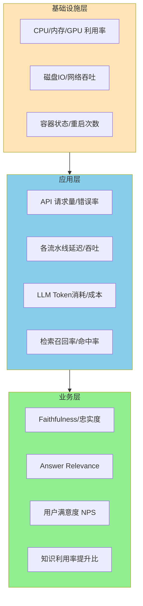

### 7.2 日志：结构化JSON + ELK

- **应用日志**：结构化JSON格式，包含trace_id、span_id、user_id
- **采集**：Filebeat → Logstash → Elasticsearch
- **可视化**：Kibana Dashboard
- **保留策略**：热数据7天（SSD）、温数据30天（HDD）、冷数据3年（S3 Glacier）

### 7.3 指标：Prometheus + Grafana

#### 关键指标仪表盘设计

| 仪表盘面板 | 指标 | 来源 | 告警阈值 |
|------------|------|------|----------|
| **QPS & 延迟** | `rag_requests_total`, `rag_latency_seconds` | API Gateway | P95 > 5s |
| **分类器准确率** | `classifier_accuracy`, `router_misroute_total` | Router Service | Accuracy < 90% |
| **检索质量** | `recall_at_10`, `mrr_at_10` | Retrieval Service | Recall@10 < 80% |
| **生成质量** | `faithfulness_score`, `hallucination_rate` | Generation Service | Faithfulness < 0.85 |
| **成本仪表盘** | `token_usage_total`, `llm_cost_usd_total` | LLM Gateway | 日成本 > ¥500 |
| **安全告警** | `acl_violation_total`, `injection_detected_total` | Security Service | 任何非零 |

#### Prometheus指标暴露示例

```python
from prometheus_client import Counter, Histogram, Gauge

# API指标
rag_requests = Counter('rag_requests_total', 'Total RAG requests',
                       ['tier', 'pipeline'])
rag_latency = Histogram('rag_latency_seconds', 'RAG query latency',
                        ['pipeline'], buckets=[0.1, 0.5, 1, 2, 5, 10, 30])

# 检索指标
recall_at_10 = Gauge('rag_recall_at_10', 'Recall@10', ['dataset'])
mrr_at_10 = Gauge('rag_mrr_at_10', 'MRR@10', ['dataset'])

# 成本指标
token_usage = Counter('rag_token_usage_total', 'Token usage',
                      ['model', 'type'])  # type: input/output
llm_cost = Counter('rag_llm_cost_usd_total', 'LLM API cost in USD',
                   ['model', 'pipeline'])
```

### 7.4 追踪：OpenTelemetry分布式追踪

```python
from opentelemetry import trace
from opentelemetry.instrumentation.langchain import LangchainInstrumentor

tracer = trace.get_tracer(__name__)

@tracer.start_as_current_span("rag_query")
def handle_query(query: str, user_context: dict):
    # 自动在 Span 中记录属性
    span = trace.get_current_span()
    span.set_attribute("query.length", len(query))
    span.set_attribute("user.id", user_context["user_id"])

    # 子 Span 自动创建
    with tracer.start_as_current_span("classify") as classify_span:
        tier = classify_query(query)
        classify_span.set_attribute("classified.tier", tier)

    with tracer.start_as_current_span("retrieve") as retrieve_span:
        chunks = retrieve(query, tier)
        retrieve_span.set_attribute("retrieved.count", len(chunks))

    with tracer.start_as_current_span("generate") as generate_span:
        answer = generate(query, chunks)
        generate_span.set_attribute("generated.length", len(answer))

    return answer
```

**技术栈**：OpenTelemetry SDK → OTel Collector → Jaeger（追踪存储）+ Tempo（备选）

### 7.5 告警：分级规则

| 级别 | 名称 | 触发条件 | 响应 | 通知方式 |
|------|------|----------|------|----------|
| P0 | 关键 | 系统完全不可用、Faithfulness突降30%+ | 5分钟内响应 | 电话 + 企微 + Slack |
| P1 | 严重 | P95延迟>10s、错误率>5%、安全告警 | 15分钟内响应 | 企微 + Slack |
| P2 | 警告 | 成本超预算80%、Recall@10下降10% | 1小时内响应 | 邮件 + Jira Ticket |

### 7.6 评测集成：RAGAS自动化评测流水线

```python
from ragas import evaluate
from ragas.metrics import (
    faithfulness,
    answer_relevancy,
    context_precision,
    context_recall,
)

def run_ragas_evaluation(queries: List[str], answers: List[str],
                         contexts: List[List[str]], ground_truths: List[str]):
    """自动化评测流水线"""

    dataset = Dataset.from_dict({
        "question": queries,
        "answer": answers,
        "contexts": contexts,
        "ground_truth": ground_truths,
    })

    scores = evaluate(
        dataset,
        metrics=[faithfulness, answer_relevancy,
                 context_precision, context_recall]
    )

    # 指标自动推送到Prometheus
    FAITHFULNESS_GAUGE.set(scores["faithfulness"])
    ANSWER_RELEVANCY_GAUGE.set(scores["answer_relevancy"])
    CONTEXT_PRECISION_GAUGE.set(scores["context_precision"])
    CONTEXT_RECALL_GAUGE.set(scores["context_recall"])

    return scores
```

评测触发时机：(1) 每日定时CronJob（全量回归）；(2) 模型/策略变更后（A/B对比）；(3) 用户反馈异常时（按需触发）。

---

## 8. 部署拓扑

### 8.1 开发环境：Docker Compose单机部署

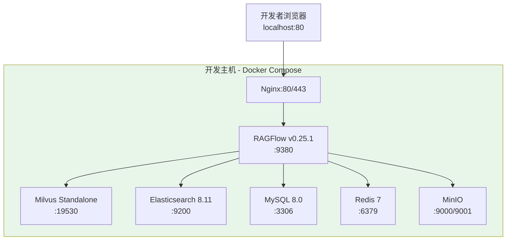

**资源配置**：单机 32GB RAM + 8 CPU + 1 GPU (RTX 4090 / A10)，适合1-3人开发团队。

### 8.2 生产环境：K8s集群多节点部署

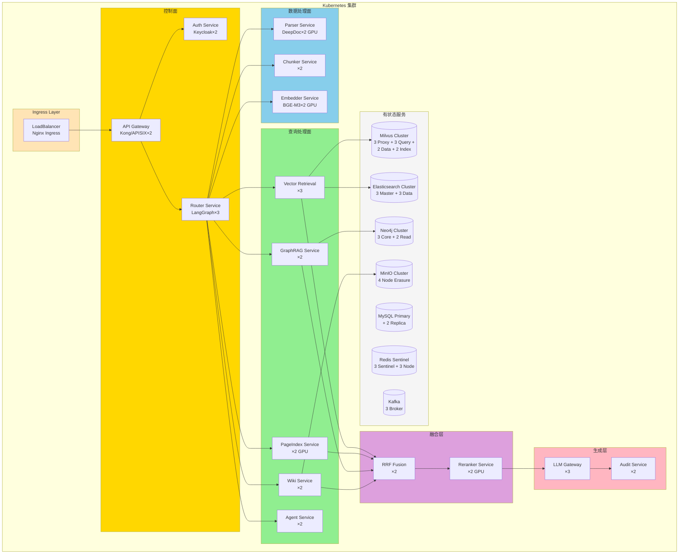

### 8.3 高可用设计

| 组件 | 高可用策略 | RPO | RTO |
|------|------------|-----|-----|
| API Gateway | 多副本 + Ingress负载均衡 | N/A | <1min |
| 应用服务（所有） | K8s Deployment replicas ≥ 2 + HPA | N/A | <30s |
| MySQL | 主从复制 + Orchestrator自动切换 | 0 | <1min |
| Milvus | 集群模式（Proxy+Query+Data+Index分布式） | 0 | <30s |
| Elasticsearch | 跨AZ集群（3 Master + 多Data Node） | 0 | <1min |
| Redis | Sentinel哨兵模式（3 Sentinel + 3 Node） | <1min | <2min |
| MinIO | 4节点纠删码（Erasure Coding） | N/A | 节点级容错 |
| Kafka | 3 Broker + ISR ≥ 2 | 0 | <30s |
| Neo4j | 3 Core + 2 Read Replica | 0 | <1min |
| LLM API | 多模型Fallback（DeepSeek→Qwen→Claude） | N/A | <5s |

### 8.4 容量规划

| 规模 | 用户数 | 文档量 | 向量规模 | 计算资源 | 月成本估算 |
|------|--------|--------|----------|----------|------------|
| 小型（PoC） | ≤100 | <1万 | <100万 | 1×A100, 64GB, 16vCPU | ¥20,000-35,000 |
| 中型（Pilot） | ≤1000 | <10万 | <1000万 | 2×A100, 128GB, 32vCPU | ¥50,000-80,000 |
| 大型（Production） | ≤10000 | <100万 | <10亿 | 4×A100, 256GB, 64vCPU | ¥120,000-200,000 |
| 超大型 | >10000 | >100万 | >10亿 | 8×A100, 512GB, 128vCPU + 跨集群 | ¥300,000+ |

### 8.5 CI/CD流水线

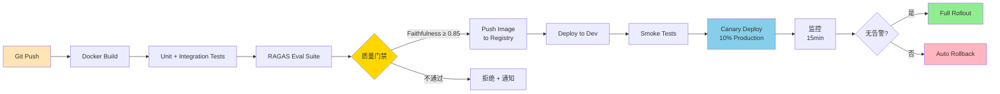

**流水线工具链**：GitHub Actions / GitLab CI → Docker Build → Trivy 镜像扫描 → ArgoCD GitOps 部署 → Prometheus 健康监控

### 8.6 灰度发布策略

```yaml
# Istio VirtualService - 金丝雀发布
apiVersion: networking.istio.io/v1beta1
kind: VirtualService
metadata:
  name: ragflow
spec:
  hosts:
    - ragflow
  http:
    - match:
        - headers:
            x-canary:
              exact: "true"
      route:
        - destination:
            host: ragflow
            subset: v2-new
    - route:
        - destination:
            host: ragflow
            subset: v1-stable
          weight: 90
        - destination:
            host: ragflow
            subset: v2-new
          weight: 10
```

灰度发布流程：

1. **10%金丝雀**：新版本接收10%流量，监控Faithfulness、延迟、错误率
2. **15分钟观察**：与v1基线对比，任一核心指标退化>5%即自动回滚
3. **50%扩量**：关键指标达标后扩展至50%流量
4. **100%全量**：继续观察15分钟无告警→全量发布
5. **自动回滚**：ArgoCD配置自动回滚触发器，Prometheus告警→webhook→rollback

---

> **文档结束**
>
> 本文档为RAG 3.0知识库系统的技术架构设计，涵盖总体架构、技术选型、入口路由、五大流水线、融合层、安全合规、可观测性和部署拓扑八大模块。所有架构图均为Mermaid格式，可直接在支持Mermaid的Markdown渲染器中查看。本文档应与BRD-业务需求文档.md和PRD-产品需求文档.md配合阅读，共同构成RAG 3.0系统的完整技术文档体系。
