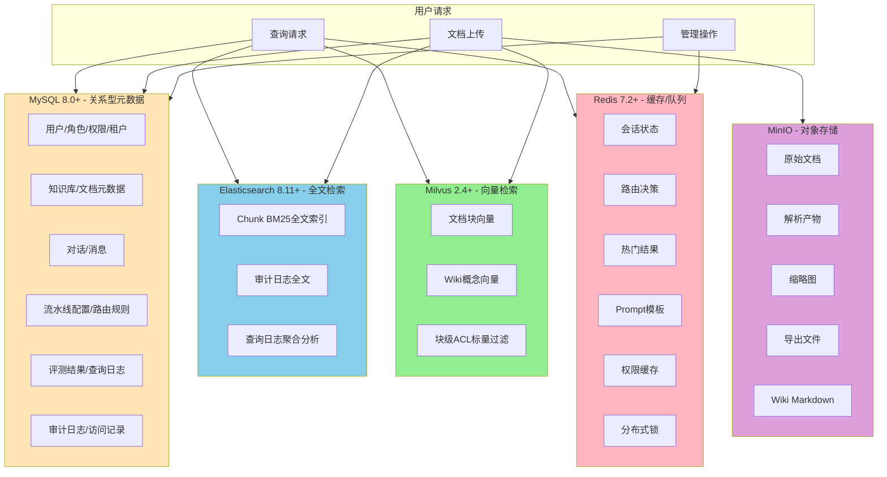
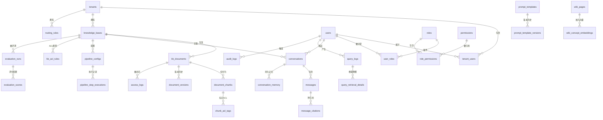
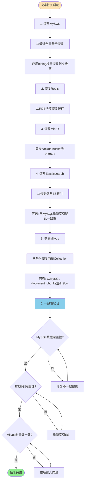

# 数据库设计文档：企业级RAG 3.0知识库系统

> **文档编号**：DBD-RAG3.0-20260605
> **版本**：v1.0
> **编制日期**：2026年6月5日
> **编制部门**：AI平台事业部
> **关联文档**：TAD-技术架构设计.md / PRD-产品需求文档.md / 5-企业级RAG知识库3.0实现方案.md

---

## 目录

1. [数据存储总览](#1-数据存储总览)
2. [ER图](#2-er图)
3. [MySQL表结构DDL](#3-mysql表结构ddl)
   - 3.1 [用户与权限模块](#31-用户与权限模块)
   - 3.2 [知识库模块](#32-知识库模块)
   - 3.3 [对话模块](#33-对话模块)
   - 3.4 [流水线与配置模块](#34-流水线与配置模块)
   - 3.5 [评测模块](#35-评测模块)
   - 3.6 [审计模块](#36-审计模块)
4. [Elasticsearch索引Mapping](#4-elasticsearch索引mapping)
   - 4.1 [全文检索索引](#41-全文检索索引-rag_doc_fulltext)
   - 4.2 [审计日志索引](#42-审计日志索引-rag_audit_logs)
   - 4.3 [查询日志索引](#43-查询日志索引-rag_query_logs)
5. [向量库Collection设计 (Milvus)](#5-向量库collection设计milvus)
   - 5.1 [文档块Collection](#51-文档块collection)
   - 5.2 [知识概念Collection](#52-知识概念collection)
   - 5.3 [对话记忆Collection](#53-对话记忆collection)
6. [MinIO对象存储设计](#6-minio对象存储设计)
7. [Redis缓存设计](#7-redis缓存设计)
8. [数据迁移与备份策略](#8-数据迁移与备份策略)

---

## 1. 数据存储总览

### 1.1 存储矩阵

RAG 3.0 知识库系统采用异构多存储架构，针对不同数据特性选择最优存储引擎：

| 存储引擎 | 版本 | 存储对象 | 数据规模 | 读写模式 | CAP倾向 |
|----------|------|----------|----------|----------|---------|
| **MySQL 8.0+** | 8.0.36+ | 用户、角色、权限、知识库元数据、对话元数据、流水线配置、评测结果、审计日志（关系型部分） | 百万行级 | 读多写少，OLTP | CP（一致性+分区容忍） |
| **Elasticsearch** | 8.11+ | 文档Chunk全文索引、BM25检索、审计日志全文、查询日志 | 十亿级文档 | 写少读多，OLAP | AP（可用性+分区容忍） |
| **Milvus** | 2.4+ | 文档Chunk向量嵌入、Wiki概念向量、ACL标签过滤 | 十亿级向量 | 写少读多，ANN检索 | AP（可用性+分区容忍） |
| **MinIO** | RELEASE.2024+ | 原始文档文件、解析产物、缩略图、导出文件、Wiki Markdown | TB-PB级 | 顺序写，随机读 | CP（一致性+分区容忍） |
| **Redis** | 7.2+ | 会话状态、路由决策缓存、热门查询结果、Prompt模板、用户权限缓存、分布式锁 | GB级 | 高频读写 | AP（可用性+分区容忍） |

### 1.2 各存储的职责边界



### 1.3 CAP与一致性策略选择

RAG 3.0 系统对不同数据实施差异化的一致性策略：

| 数据类型 | 一致性级别 | 策略 | 理由 |
|----------|------------|------|------|
| **用户权限（RBAC/ACL）** | 强一致性 | MySQL主写+Redis缓存TTL强制过期 | 权限变更必须立即生效，安全第一 |
| **知识库/文档元数据** | 最终一致性 | MySQL写入→异步通知ES/Milvus索引更新 | 元数据变更不频繁，允许秒级延迟 |
| **文档Chunk向量** | 最终一致性 | MySQL记录→异步Embedding→Milvus写入 | 嵌入计算耗时，异步流程 |
| **对话消息** | 强一致性 | MySQL事务写入 | 对话顺序不可乱，必须ACID保证 |
| **审计日志** | 强一致性（写入）/ 最终一致性（查询） | MySQL+Kafka双写→ES异步消费 | 写入不可丢（合规要求），查询可延迟 |
| **ES全文索引** | 最终一致性 | MySQL binlog → ES refresh_interval=1s | 索引更新允许亚秒级延迟 |
| **Redis缓存** | 弱一致性 | TTL + 主动失效 | 缓存命中与实时数据可接受差异 |
| **MinIO对象** | 强一致性 | Erasure Coding + 版本号 | 文件不可丢失或损坏 |

**核心原则**：安全与合规数据（权限、审计）走强一致性MySQL；检索性能数据（向量、全文）走最终一致性；热点数据走弱一致性缓存。

---

## 2. ER图

### 2.1 核心实体关系图



### 2.2 实体清单

| 编号 | 实体名称 | 所属模块 | 说明 |
|------|----------|----------|------|
| E01 | tenants | 用户与权限 | 租户/企业 |
| E02 | users | 用户与权限 | 用户账号 |
| E03 | roles | 用户与权限 | 角色定义 |
| E04 | permissions | 用户与权限 | 权限项 |
| E05 | user_roles | 用户与权限 | 用户-角色关联 |
| E06 | role_permissions | 用户与权限 | 角色-权限关联 |
| E07 | tenant_users | 用户与权限 | 租户-用户关联 |
| E08 | knowledge_bases | 知识库 | 知识库定义 |
| E09 | kb_documents | 知识库 | 知识库文档 |
| E10 | document_chunks | 知识库 | 文档分块 |
| E11 | document_versions | 知识库 | 文档版本历史 |
| E12 | chunk_acl_tags | 知识库 | 块级ACL标签 |
| E13 | kb_acl_rules | 知识库 | 知识库级ACL规则 |
| E14 | conversations | 对话 | 对话会话 |
| E15 | messages | 对话 | 对话消息 |
| E16 | message_citations | 对话 | 消息引用记录 |
| E17 | conversation_memory | 对话 | 对话长期记忆 |
| E18 | routing_rules | 流水线 | 路由规则 |
| E19 | prompt_templates | 流水线 | Prompt模板 |
| E20 | prompt_template_versions | 流水线 | Prompt模板版本 |
| E21 | pipeline_configs | 流水线 | 流水线配置 |
| E22 | pipeline_step_executions | 流水线 | 流水线执行记录 |
| E23 | evaluation_runs | 评测 | 评测任务 |
| E24 | evaluation_scores | 评测 | 评测分数 |
| E25 | query_logs | 评测 | 查询日志 |
| E26 | query_retrieval_details | 评测 | 查询检索明细 |
| E27 | audit_logs | 审计 | 审计日志 |
| E28 | access_logs | 审计 | 文档访问日志 |
| E29 | wiki_pages | 知识库 | Wiki知识页面 |
| E30 | wiki_concept_embeddings | 知识库 | Wiki概念向量 |
| E31 | embedding_models | 配置 | 嵌入模型注册 |
| E32 | llm_models | 配置 | LLM模型注册 |

---

## 3. MySQL表结构DDL

> 所有DDL基于MySQL 8.0.36+语法，字符集utf8mb4，排序规则utf8mb4_unicode_ci，存储引擎InnoDB。

### 3.1 用户与权限模块

#### 3.1.1 租户表 (tenants)

```sql
-- ============================================================
-- 表名: tenants
-- 描述: 租户/企业信息，支持多租户隔离
-- ============================================================
CREATE TABLE tenants (
    tenant_id       VARCHAR(64)     NOT NULL    COMMENT '租户唯一标识，UUID格式',
    name            VARCHAR(256)    NOT NULL    COMMENT '租户名称（企业名）',
    description     TEXT                        COMMENT '租户描述',
    contact_email   VARCHAR(256)                COMMENT '管理员联系邮箱',
    status          ENUM('active','suspended','deleted')
                        NOT NULL DEFAULT 'active'
                                                COMMENT '租户状态',
    max_users       INT             DEFAULT 0   COMMENT '最大用户数，0表示无限制',
    max_kb_count    INT             DEFAULT 0   COMMENT '最大知识库数，0表示无限制',
    max_storage_gb  DECIMAL(10,2)   DEFAULT 0   COMMENT '最大存储容量(GB)，0表示无限制',
    created_at      DATETIME        NOT NULL DEFAULT CURRENT_TIMESTAMP
                                                COMMENT '创建时间',
    updated_at      DATETIME        NOT NULL DEFAULT CURRENT_TIMESTAMP ON UPDATE CURRENT_TIMESTAMP
                                                COMMENT '更新时间',

    PRIMARY KEY (tenant_id),
    UNIQUE INDEX uk_tenants_name (name),
    INDEX idx_tenants_status (status),
    INDEX idx_tenants_created_at (created_at)
) ENGINE=InnoDB DEFAULT CHARSET=utf8mb4 COLLATE=utf8mb4_unicode_ci
COMMENT='租户/企业信息表';
```

#### 3.1.2 用户表 (users)

```sql
-- ============================================================
-- 表名: users
-- 描述: 用户账号信息，支持OAuth2/OIDC认证
-- ============================================================
CREATE TABLE users (
    user_id         VARCHAR(64)     NOT NULL    COMMENT '用户唯一标识，UUID格式',
    username        VARCHAR(128)    NOT NULL    COMMENT '用户名',
    email           VARCHAR(256)    NOT NULL    COMMENT '邮箱，用于登录与通知',
    password_hash   VARCHAR(256)                COMMENT '密码哈希（本地认证模式）',
    display_name    VARCHAR(256)                COMMENT '显示名称',
    avatar_url      VARCHAR(1024)               COMMENT '头像URL',
    phone           VARCHAR(32)                 COMMENT '手机号',
    department      VARCHAR(256)                COMMENT '部门',
    position        VARCHAR(256)                COMMENT '职位',
    oauth_provider  VARCHAR(64)                 COMMENT 'OAuth提供方（google/github/azureAD/custom）',
    oauth_subject   VARCHAR(256)                COMMENT 'OAuth Subject标识',
    clearance_level ENUM('public','internal','confidential','restricted')
                        NOT NULL DEFAULT 'internal'
                                                COMMENT '用户安全密级',
    status          ENUM('active','disabled','locked','deleted')
                        NOT NULL DEFAULT 'active'
                                                COMMENT '用户状态',
    last_login_at   DATETIME                    COMMENT '最后登录时间',
    created_at      DATETIME        NOT NULL DEFAULT CURRENT_TIMESTAMP
                                                COMMENT '创建时间',
    updated_at      DATETIME        NOT NULL DEFAULT CURRENT_TIMESTAMP ON UPDATE CURRENT_TIMESTAMP
                                                COMMENT '更新时间',

    PRIMARY KEY (user_id),
    UNIQUE INDEX uk_users_username (username),
    UNIQUE INDEX uk_users_email (email),
    UNIQUE INDEX uk_users_oauth (oauth_provider, oauth_subject),
    INDEX idx_users_status (status),
    INDEX idx_users_department (department),
    INDEX idx_users_clearance (clearance_level)
) ENGINE=InnoDB DEFAULT CHARSET=utf8mb4 COLLATE=utf8mb4_unicode_ci
COMMENT='用户账号信息表';
```

#### 3.1.3 角色表 (roles)

```sql
-- ============================================================
-- 表名: roles
-- 描述: 角色定义，支持RBAC权限模型
-- ============================================================
CREATE TABLE roles (
    role_id         VARCHAR(64)     NOT NULL    COMMENT '角色唯一标识',
    name            VARCHAR(128)    NOT NULL    COMMENT '角色名称',
    display_name    VARCHAR(256)                COMMENT '角色显示名称',
    description     TEXT                        COMMENT '角色描述',
    role_type       ENUM('system','tenant','custom')
                        NOT NULL DEFAULT 'custom'
                                                COMMENT '角色类型: system=系统预置, tenant=租户级, custom=自定义',
    tenant_id       VARCHAR(64)                 COMMENT '所属租户ID(system级为NULL)',
    is_active       TINYINT(1)      NOT NULL DEFAULT 1
                                                COMMENT '是否启用',
    created_at      DATETIME        NOT NULL DEFAULT CURRENT_TIMESTAMP
                                                COMMENT '创建时间',
    updated_at      DATETIME        NOT NULL DEFAULT CURRENT_TIMESTAMP ON UPDATE CURRENT_TIMESTAMP
                                                COMMENT '更新时间',

    PRIMARY KEY (role_id),
    UNIQUE INDEX uk_roles_name_tenant (name, tenant_id),
    INDEX idx_roles_tenant (tenant_id),
    INDEX idx_roles_type (role_type)
) ENGINE=InnoDB DEFAULT CHARSET=utf8mb4 COLLATE=utf8mb4_unicode_ci
COMMENT='角色定义表';
```

#### 3.1.4 权限表 (permissions)

```sql
-- ============================================================
-- 表名: permissions
-- 描述: 权限项定义，遵循 resource:action 命名规范
-- ============================================================
CREATE TABLE permissions (
    permission_id   VARCHAR(64)     NOT NULL    COMMENT '权限唯一标识',
    code            VARCHAR(256)    NOT NULL    COMMENT '权限码，格式 resource:action（如 kb:read, kb:write, user:manage）',
    name            VARCHAR(256)    NOT NULL    COMMENT '权限名称',
    description     TEXT                        COMMENT '权限描述',
    resource_type   VARCHAR(64)     NOT NULL    COMMENT '资源类型: kb/document/conversation/user/tenant/evaluation/audit',
    action          VARCHAR(64)     NOT NULL    COMMENT '操作类型: read/write/delete/manage/export',
    created_at      DATETIME        NOT NULL DEFAULT CURRENT_TIMESTAMP
                                                COMMENT '创建时间',

    PRIMARY KEY (permission_id),
    UNIQUE INDEX uk_permissions_code (code),
    INDEX idx_permissions_resource (resource_type)
) ENGINE=InnoDB DEFAULT CHARSET=utf8mb4 COLLATE=utf8mb4_unicode_ci
COMMENT='权限项定义表';
```

#### 3.1.5 用户-角色关联表 (user_roles)

```sql
-- ============================================================
-- 表名: user_roles
-- 描述: 用户与角色的多对多关联关系
-- ============================================================
CREATE TABLE user_roles (
    id              BIGINT          NOT NULL AUTO_INCREMENT
                                                COMMENT '自增主键',
    user_id         VARCHAR(64)     NOT NULL    COMMENT '用户ID',
    role_id         VARCHAR(64)     NOT NULL    COMMENT '角色ID',
    tenant_id       VARCHAR(64)                 COMMENT '关联的租户ID（租户级角色）',
    granted_by      VARCHAR(64)                 COMMENT '授予者用户ID',
    granted_at      DATETIME        NOT NULL DEFAULT CURRENT_TIMESTAMP
                                                COMMENT '授予时间',
    expires_at      DATETIME                    COMMENT '过期时间（NULL表示永久）',

    PRIMARY KEY (id),
    UNIQUE INDEX uk_user_roles (user_id, role_id, tenant_id),
    INDEX idx_user_roles_user (user_id),
    INDEX idx_user_roles_role (role_id),
    INDEX idx_user_roles_tenant (tenant_id),
    CONSTRAINT fk_ur_user_id FOREIGN KEY (user_id) REFERENCES users(user_id)
        ON DELETE CASCADE ON UPDATE CASCADE,
    CONSTRAINT fk_ur_role_id FOREIGN KEY (role_id) REFERENCES roles(role_id)
        ON DELETE CASCADE ON UPDATE CASCADE
) ENGINE=InnoDB DEFAULT CHARSET=utf8mb4 COLLATE=utf8mb4_unicode_ci
COMMENT='用户-角色关联表';
```

#### 3.1.6 角色-权限关联表 (role_permissions)

```sql
-- ============================================================
-- 表名: role_permissions
-- 描述: 角色与权限的多对多关联关系
-- ============================================================
CREATE TABLE role_permissions (
    id              BIGINT          NOT NULL AUTO_INCREMENT
                                                COMMENT '自增主键',
    role_id         VARCHAR(64)     NOT NULL    COMMENT '角色ID',
    permission_id   VARCHAR(64)     NOT NULL    COMMENT '权限ID',
    created_at      DATETIME        NOT NULL DEFAULT CURRENT_TIMESTAMP
                                                COMMENT '创建时间',

    PRIMARY KEY (id),
    UNIQUE INDEX uk_role_permissions (role_id, permission_id),
    INDEX idx_rp_permission (permission_id),
    CONSTRAINT fk_rp_role_id FOREIGN KEY (role_id) REFERENCES roles(role_id)
        ON DELETE CASCADE ON UPDATE CASCADE,
    CONSTRAINT fk_rp_permission_id FOREIGN KEY (permission_id) REFERENCES permissions(permission_id)
        ON DELETE CASCADE ON UPDATE CASCADE
) ENGINE=InnoDB DEFAULT CHARSET=utf8mb4 COLLATE=utf8mb4_unicode_ci
COMMENT='角色-权限关联表';
```

#### 3.1.7 租户-用户关联表 (tenant_users)

```sql
-- ============================================================
-- 表名: tenant_users
-- 描述: 租户与用户的多对多关联，定义用户在租户中的角色
-- ============================================================
CREATE TABLE tenant_users (
    id              BIGINT          NOT NULL AUTO_INCREMENT
                                                COMMENT '自增主键',
    tenant_id       VARCHAR(64)     NOT NULL    COMMENT '租户ID',
    user_id         VARCHAR(64)     NOT NULL    COMMENT '用户ID',
    invitation_status ENUM('pending','accepted','rejected','expired')
                        NOT NULL DEFAULT 'pending'
                                                COMMENT '邀请状态',
    is_active       TINYINT(1)      NOT NULL DEFAULT 1
                                                COMMENT '是否有效',
    joined_at       DATETIME                    COMMENT '加入时间',
    invited_at      DATETIME        NOT NULL DEFAULT CURRENT_TIMESTAMP
                                                COMMENT '邀请时间',
    left_at         DATETIME                    COMMENT '离开时间',

    PRIMARY KEY (id),
    UNIQUE INDEX uk_tenant_users (tenant_id, user_id),
    INDEX idx_tu_user (user_id),
    INDEX idx_tu_invitation (invitation_status),
    CONSTRAINT fk_tu_tenant_id FOREIGN KEY (tenant_id) REFERENCES tenants(tenant_id)
        ON DELETE CASCADE ON UPDATE CASCADE,
    CONSTRAINT fk_tu_user_id FOREIGN KEY (user_id) REFERENCES users(user_id)
        ON DELETE CASCADE ON UPDATE CASCADE
) ENGINE=InnoDB DEFAULT CHARSET=utf8mb4 COLLATE=utf8mb4_unicode_ci
COMMENT='租户-用户关联表';
```

---

### 3.2 知识库模块

#### 3.2.1 知识库表 (knowledge_bases)

```sql
-- ============================================================
-- 表名: knowledge_bases
-- 描述: 知识库核心定义，支持多租户隔离
-- ============================================================
CREATE TABLE knowledge_bases (
    kb_id           VARCHAR(64)     NOT NULL    COMMENT '知识库唯一标识',
    tenant_id       VARCHAR(64)     NOT NULL    COMMENT '所属租户ID',
    name            VARCHAR(256)    NOT NULL    COMMENT '知识库名称',
    description     TEXT                        COMMENT '知识库描述',
    icon_url        VARCHAR(1024)               COMMENT '图标URL',
    embedding_model VARCHAR(128)    NOT NULL DEFAULT 'BAAI/bge-m3'
                                                COMMENT '嵌入模型标识',
    chunk_strategy  ENUM('general','template','hierarchical','semantic','qa','parent_child')
                        NOT NULL DEFAULT 'general'
                                                COMMENT '默认分块策略',
    vector_store    VARCHAR(128)    NOT NULL DEFAULT 'milvus'
                                                COMMENT '向量存储引擎标识',
    reranker_model  VARCHAR(128)    DEFAULT 'BAAI/bge-reranker-v2-m3'
                                                COMMENT '默认重排序模型',
    llm_model       VARCHAR(128)                COMMENT '默认LLM模型',
    status          ENUM('active','indexing','error','archived','deleted')
                        NOT NULL DEFAULT 'active'
                                                COMMENT '知识库状态',
    doc_count       INT             DEFAULT 0   COMMENT '文档数量',
    chunk_count     BIGINT          DEFAULT 0   COMMENT '分块总数',
    total_size_bytes BIGINT         DEFAULT 0   COMMENT '文档总大小(字节)',
    creator_id      VARCHAR(64)     NOT NULL    COMMENT '创建者用户ID',
    created_at      DATETIME        NOT NULL DEFAULT CURRENT_TIMESTAMP
                                                COMMENT '创建时间',
    updated_at      DATETIME        NOT NULL DEFAULT CURRENT_TIMESTAMP ON UPDATE CURRENT_TIMESTAMP
                                                COMMENT '更新时间',

    PRIMARY KEY (kb_id),
    INDEX idx_kb_tenant (tenant_id),
    INDEX idx_kb_status (status),
    INDEX idx_kb_creator (creator_id),
    INDEX idx_kb_created (created_at),
    CONSTRAINT fk_kb_tenant FOREIGN KEY (tenant_id) REFERENCES tenants(tenant_id)
        ON DELETE CASCADE ON UPDATE CASCADE,
    CONSTRAINT fk_kb_creator FOREIGN KEY (creator_id) REFERENCES users(user_id)
        ON DELETE RESTRICT ON UPDATE CASCADE
) ENGINE=InnoDB DEFAULT CHARSET=utf8mb4 COLLATE=utf8mb4_unicode_ci
COMMENT='知识库核心定义表';
```

#### 3.2.2 知识库文档表 (kb_documents)

```sql
-- ============================================================
-- 表名: kb_documents
-- 描述: 知识库中的文档元数据
-- ============================================================
CREATE TABLE kb_documents (
    doc_id          VARCHAR(64)     NOT NULL    COMMENT '文档唯一标识',
    kb_id           VARCHAR(64)     NOT NULL    COMMENT '所属知识库ID',
    original_name   VARCHAR(512)    NOT NULL    COMMENT '原始文件名',
    file_type       VARCHAR(64)     NOT NULL    COMMENT '文件类型扩展名（pdf/docx/pptx/xlsx/jpg/png/md/html/eml）',
    file_size       BIGINT          NOT NULL    COMMENT '文件大小(字节)',
    file_hash       VARCHAR(128)    NOT NULL    COMMENT '文件SHA256哈希用于去重',
    file_path_minio VARCHAR(1024)   NOT NULL    COMMENT 'MinIO存储路径',
    parse_status    ENUM('pending','parsing','parsed','failed','skipped')
                        NOT NULL DEFAULT 'pending'
                                                COMMENT '解析状态',
    parse_engine    VARCHAR(64)                 COMMENT '解析引擎（deepdoc/mineru/paddleocr/docling）',
    parse_error_msg TEXT                        COMMENT '解析失败原因',
    chunk_count     INT             DEFAULT 0   COMMENT '分块总数',
    page_count      INT                         COMMENT '原始文档页数',
    word_count      BIGINT                      COMMENT '原始文档字数',
    language        VARCHAR(32)     DEFAULT 'zh' COMMENT '文档语言',
    metadata_json   JSON                        COMMENT '扩展元数据(作者/标题/关键词/创建日期等)',
    version         INT             NOT NULL DEFAULT 1
                                                COMMENT '当前版本号',
    is_active       TINYINT(1)      NOT NULL DEFAULT 1
                                                COMMENT '是否当前活跃版本',
    uploaded_by     VARCHAR(64)     NOT NULL    COMMENT '上传者用户ID',
    uploaded_at     DATETIME        NOT NULL DEFAULT CURRENT_TIMESTAMP
                                                COMMENT '上传时间',
    parsed_at       DATETIME                    COMMENT '解析完成时间',
    created_at      DATETIME        NOT NULL DEFAULT CURRENT_TIMESTAMP
                                                COMMENT '创建时间',
    updated_at      DATETIME        NOT NULL DEFAULT CURRENT_TIMESTAMP ON UPDATE CURRENT_TIMESTAMP
                                                COMMENT '更新时间',

    PRIMARY KEY (doc_id),
    INDEX idx_doc_kb (kb_id),
    INDEX idx_doc_parse_status (parse_status),
    INDEX idx_doc_file_type (file_type),
    INDEX idx_doc_file_hash (file_hash),
    INDEX idx_doc_uploaded_by (uploaded_by),
    INDEX idx_doc_uploaded_at (uploaded_at),
    CONSTRAINT fk_doc_kb FOREIGN KEY (kb_id) REFERENCES knowledge_bases(kb_id)
        ON DELETE CASCADE ON UPDATE CASCADE,
    CONSTRAINT fk_doc_uploader FOREIGN KEY (uploaded_by) REFERENCES users(user_id)
        ON DELETE RESTRICT ON UPDATE CASCADE
) ENGINE=InnoDB DEFAULT CHARSET=utf8mb4 COLLATE=utf8mb4_unicode_ci
COMMENT='知识库文档元数据表';
```

#### 3.2.3 文档分块表 (document_chunks)

```sql
-- ============================================================
-- 表名: document_chunks
-- 描述: 文档切分后的内容块，是检索的最小粒度
-- ============================================================
CREATE TABLE document_chunks (
    chunk_id        VARCHAR(64)     NOT NULL    COMMENT '分块唯一标识',
    doc_id          VARCHAR(64)     NOT NULL    COMMENT '所属文档ID',
    kb_id           VARCHAR(64)     NOT NULL    COMMENT '所属知识库ID',
    chunk_index     INT             NOT NULL    COMMENT '分块在文档中的序号（从0开始）',
    content         MEDIUMTEXT      NOT NULL    COMMENT '分块文本内容',
    content_hash    VARCHAR(128)                COMMENT '内容SHA256哈希，用于检测变更',
    chunk_strategy  VARCHAR(64)     NOT NULL    COMMENT '使用的分块策略',
    embedding_status ENUM('pending','embedding','embedded','failed')
                        NOT NULL DEFAULT 'pending'
                                                COMMENT '嵌入状态',
    token_count     INT             DEFAULT 0   COMMENT 'Token数量',
    page_number     INT                         COMMENT '原始页码',
    bbox_coordinates JSON                       COMMENT '边界框坐标 [x1,y1,x2,y2]',
    section_title   VARCHAR(512)                COMMENT '所属章节标题',
    parent_chunk_id VARCHAR(64)                 COMMENT '父分块ID（父子分块策略时使用）',
    content_type    ENUM('text','table','image_description','formula','code')
                        NOT NULL DEFAULT 'text'
                                                COMMENT '内容类型',
    metadata_json   JSON                        COMMENT '扩展元数据',
    created_at      DATETIME        NOT NULL DEFAULT CURRENT_TIMESTAMP
                                                COMMENT '创建时间',
    updated_at      DATETIME        NOT NULL DEFAULT CURRENT_TIMESTAMP ON UPDATE CURRENT_TIMESTAMP
                                                COMMENT '更新时间',

    PRIMARY KEY (chunk_id),
    INDEX idx_chunk_doc (doc_id),
    INDEX idx_chunk_kb (kb_id),
    INDEX idx_chunk_doc_index (doc_id, chunk_index),
    INDEX idx_chunk_embedding_status (embedding_status),
    INDEX idx_chunk_parent (parent_chunk_id),
    INDEX idx_chunk_content_type (content_type),
    CONSTRAINT fk_chunk_doc FOREIGN KEY (doc_id) REFERENCES kb_documents(doc_id)
        ON DELETE CASCADE ON UPDATE CASCADE,
    CONSTRAINT fk_chunk_kb FOREIGN KEY (kb_id) REFERENCES knowledge_bases(kb_id)
        ON DELETE CASCADE ON UPDATE CASCADE
) ENGINE=InnoDB DEFAULT CHARSET=utf8mb4 COLLATE=utf8mb4_unicode_ci
COMMENT='文档分块内容表';
```

#### 3.2.4 文档版本历史表 (document_versions)

```sql
-- ============================================================
-- 表名: document_versions
-- 描述: 文档变更版本历史，支持回滚
-- ============================================================
CREATE TABLE document_versions (
    version_id      VARCHAR(64)     NOT NULL    COMMENT '版本唯一标识',
    doc_id          VARCHAR(64)     NOT NULL    COMMENT '文档ID',
    version_number  INT             NOT NULL    COMMENT '版本号',
    file_path_minio VARCHAR(1024)   NOT NULL    COMMENT '该版本的MinIO存储路径',
    file_size       BIGINT          NOT NULL    COMMENT '文件大小',
    file_hash       VARCHAR(128)    NOT NULL    COMMENT '文件哈希',
    change_type     ENUM('created','updated','replaced','deleted','restored')
                        NOT NULL    COMMENT '变更类型',
    change_summary  TEXT                        COMMENT '变更摘要',
    changed_by      VARCHAR(64)     NOT NULL    COMMENT '变更人用户ID',
    changed_at      DATETIME        NOT NULL DEFAULT CURRENT_TIMESTAMP
                                                COMMENT '变更时间',

    PRIMARY KEY (version_id),
    INDEX idx_dv_doc (doc_id),
    INDEX idx_dv_changed_by (changed_by),
    INDEX idx_dv_changed_at (changed_at),
    CONSTRAINT fk_dv_doc FOREIGN KEY (doc_id) REFERENCES kb_documents(doc_id)
        ON DELETE CASCADE ON UPDATE CASCADE,
    CONSTRAINT fk_dv_changer FOREIGN KEY (changed_by) REFERENCES users(user_id)
        ON DELETE RESTRICT ON UPDATE CASCADE
) ENGINE=InnoDB DEFAULT CHARSET=utf8mb4 COLLATE=utf8mb4_unicode_ci
COMMENT='文档版本历史表';
```

#### 3.2.5 块级ACL标签表 (chunk_acl_tags)

```sql
-- ============================================================
-- 表名: chunk_acl_tags
-- 描述: 文档块的ACL标签，支持块级细粒度权限控制
-- ============================================================
CREATE TABLE chunk_acl_tags (
    id              BIGINT          NOT NULL AUTO_INCREMENT
                                                COMMENT '自增主键',
    chunk_id        VARCHAR(64)     NOT NULL    COMMENT '分块ID',
    tag_type        ENUM('department','confidentiality','user_group','user_id','access_condition')
                        NOT NULL    COMMENT '标签类型',
    tag_value       VARCHAR(256)    NOT NULL    COMMENT '标签值',
    created_at      DATETIME        NOT NULL DEFAULT CURRENT_TIMESTAMP
                                                COMMENT '创建时间',

    PRIMARY KEY (id),
    INDEX idx_cat_chunk (chunk_id),
    INDEX idx_cat_type_value (tag_type, tag_value),
    INDEX idx_cat_chunk_type (chunk_id, tag_type),
    CONSTRAINT fk_cat_chunk FOREIGN KEY (chunk_id) REFERENCES document_chunks(chunk_id)
        ON DELETE CASCADE ON UPDATE CASCADE
) ENGINE=InnoDB DEFAULT CHARSET=utf8mb4 COLLATE=utf8mb4_unicode_ci
COMMENT='块级ACL标签表';
```

#### 3.2.6 知识库级ACL规则表 (kb_acl_rules)

```sql
-- ============================================================
-- 表名: kb_acl_rules
-- 描述: 知识库级别的访问控制规则
-- ============================================================
CREATE TABLE kb_acl_rules (
    rule_id         VARCHAR(64)     NOT NULL    COMMENT '规则唯一标识',
    kb_id           VARCHAR(64)     NOT NULL    COMMENT '知识库ID',
    grantee_type    ENUM('user','role','group','department','tenant')
                        NOT NULL    COMMENT '被授权者类型',
    grantee_id      VARCHAR(64)     NOT NULL    COMMENT '被授权者ID',
    permission      ENUM('read','write','manage')
                        NOT NULL DEFAULT 'read'
                                                COMMENT '权限级别',
    conditions_json JSON                        COMMENT '条件限制（如IP范围、时间段等）',
    is_active       TINYINT(1)      NOT NULL DEFAULT 1
                                                COMMENT '是否生效',
    created_by      VARCHAR(64)     NOT NULL    COMMENT '创建者',
    created_at      DATETIME        NOT NULL DEFAULT CURRENT_TIMESTAMP
                                                COMMENT '创建时间',
    updated_at      DATETIME        NOT NULL DEFAULT CURRENT_TIMESTAMP ON UPDATE CURRENT_TIMESTAMP
                                                COMMENT '更新时间',

    PRIMARY KEY (rule_id),
    UNIQUE INDEX uk_kb_acl (kb_id, grantee_type, grantee_id, permission),
    INDEX idx_kbar_kb (kb_id),
    INDEX idx_kbar_grantee (grantee_type, grantee_id),
    CONSTRAINT fk_kbar_kb FOREIGN KEY (kb_id) REFERENCES knowledge_bases(kb_id)
        ON DELETE CASCADE ON UPDATE CASCADE
) ENGINE=InnoDB DEFAULT CHARSET=utf8mb4 COLLATE=utf8mb4_unicode_ci
COMMENT='知识库级ACL规则表';
```

---

### 3.3 对话模块

#### 3.3.1 对话表 (conversations)

```sql
-- ============================================================
-- 表名: conversations
-- 描述: 对话会话，关联用户与知识库
-- ============================================================
CREATE TABLE conversations (
    conversation_id VARCHAR(64)     NOT NULL    COMMENT '对话唯一标识',
    user_id         VARCHAR(64)     NOT NULL    COMMENT '发起用户ID',
    kb_id           VARCHAR(64)                 COMMENT '关联知识库ID（会话级绑定）',
    title           VARCHAR(512)                COMMENT '对话标题（可由LLM自动生成）',
    model           VARCHAR(128)    NOT NULL    COMMENT '使用的LLM模型',
    strategy        VARCHAR(64)     DEFAULT 'auto'
                                                COMMENT '路由策略标识',
    status          ENUM('active','completed','archived','deleted')
                        NOT NULL DEFAULT 'active'
                                                COMMENT '对话状态',
    message_count   INT             DEFAULT 0   COMMENT '消息总数',
    total_tokens    BIGINT          DEFAULT 0   COMMENT '累计Token消耗',
    total_latency_ms BIGINT         DEFAULT 0   COMMENT '累计延迟(毫秒)',
    estimated_cost_usd DECIMAL(10,6) DEFAULT 0  COMMENT '预估API成本(美元)',
    metadata_json   JSON                        COMMENT '扩展元数据',
    created_at      DATETIME        NOT NULL DEFAULT CURRENT_TIMESTAMP
                                                COMMENT '创建时间',
    updated_at      DATETIME        NOT NULL DEFAULT CURRENT_TIMESTAMP ON UPDATE CURRENT_TIMESTAMP
                                                COMMENT '最后活跃时间',

    PRIMARY KEY (conversation_id),
    INDEX idx_conv_user (user_id),
    INDEX idx_conv_kb (kb_id),
    INDEX idx_conv_status (status),
    INDEX idx_conv_created (created_at),
    INDEX idx_conv_updated (updated_at),
    CONSTRAINT fk_conv_user FOREIGN KEY (user_id) REFERENCES users(user_id)
        ON DELETE CASCADE ON UPDATE CASCADE,
    CONSTRAINT fk_conv_kb FOREIGN KEY (kb_id) REFERENCES knowledge_bases(kb_id)
        ON DELETE SET NULL ON UPDATE CASCADE
) ENGINE=InnoDB DEFAULT CHARSET=utf8mb4 COLLATE=utf8mb4_unicode_ci
COMMENT='对话会话表';
```

#### 3.3.2 消息表 (messages)

```sql
-- ============================================================
-- 表名: messages
-- 描述: 对话中的单条消息，支持多轮对话
-- ============================================================
CREATE TABLE messages (
    message_id      VARCHAR(64)     NOT NULL    COMMENT '消息唯一标识',
    conversation_id VARCHAR(64)     NOT NULL    COMMENT '所属对话ID',
    parent_message_id VARCHAR(64)               COMMENT '父消息ID（用于Agent多路分支）',
    role            ENUM('user','assistant','system','tool')
                        NOT NULL    COMMENT '消息角色',
    content         MEDIUMTEXT      NOT NULL    COMMENT '消息内容',
    content_type    ENUM('text','markdown','json','html')
                        NOT NULL DEFAULT 'text'
                                                COMMENT '消息内容类型',
    citations_json  JSON                        COMMENT '引用列表 [{chunk_id, doc_name, page, score, snippet}]',
    tokens_used     INT             DEFAULT 0   COMMENT '本次消息消耗Token数',
    latency_ms      INT             DEFAULT 0   COMMENT '响应延迟(毫秒)',
    retrieval_channels JSON                     COMMENT '使用的检索通道列表 ["vector","bm25","pageindex","wiki"]',
    routing_tier    VARCHAR(32)                 COMMENT '路由分级结果 tier_1/tier_2/tier_3/tier_4',
    feedback_status ENUM('none','thumbs_up','thumbs_down','reported')
                        NOT NULL DEFAULT 'none'
                                                COMMENT '用户反馈状态',
    feedback_detail TEXT                        COMMENT '用户反馈详细内容',
    hallucination_flag TINYINT(1) DEFAULT 0     COMMENT '是否被标记为幻觉',
    created_at      DATETIME        NOT NULL DEFAULT CURRENT_TIMESTAMP
                                                COMMENT '创建时间',

    PRIMARY KEY (message_id),
    INDEX idx_msg_conv (conversation_id),
    INDEX idx_msg_conv_created (conversation_id, created_at),
    INDEX idx_msg_parent (parent_message_id),
    INDEX idx_msg_role (role),
    INDEX idx_msg_feedback (feedback_status),
    CONSTRAINT fk_msg_conv FOREIGN KEY (conversation_id) REFERENCES conversations(conversation_id)
        ON DELETE CASCADE ON UPDATE CASCADE
) ENGINE=InnoDB DEFAULT CHARSET=utf8mb4 COLLATE=utf8mb4_unicode_ci
COMMENT='对话消息表';
```

#### 3.3.3 消息引用表 (message_citations)

```sql
-- ============================================================
-- 表名: message_citations
-- 描述: 消息中的引用明细，支持溯源与审计
-- ============================================================
CREATE TABLE message_citations (
    id              BIGINT          NOT NULL AUTO_INCREMENT
                                                COMMENT '自增主键',
    message_id      VARCHAR(64)     NOT NULL    COMMENT '消息ID',
    chunk_id        VARCHAR(64)     NOT NULL    COMMENT '被引用的分块ID',
    doc_id          VARCHAR(64)     NOT NULL    COMMENT '被引用的文档ID',
    citation_index  INT             NOT NULL    COMMENT '引用序号（对应答案中的[1][2]标记）',
    relevance_score DECIMAL(5,4)                COMMENT '相关性分数',
    snippet         TEXT                        COMMENT '引用片段文本',
    page_number     INT                         COMMENT '页码',
    created_at      DATETIME        NOT NULL DEFAULT CURRENT_TIMESTAMP
                                                COMMENT '创建时间',

    PRIMARY KEY (id),
    UNIQUE INDEX uk_msg_citation (message_id, citation_index),
    INDEX idx_mc_chunk (chunk_id),
    INDEX idx_mc_doc (doc_id),
    INDEX idx_mc_message (message_id),
    CONSTRAINT fk_mc_message FOREIGN KEY (message_id) REFERENCES messages(message_id)
        ON DELETE CASCADE ON UPDATE CASCADE
) ENGINE=InnoDB DEFAULT CHARSET=utf8mb4 COLLATE=utf8mb4_unicode_ci
COMMENT='消息引用溯源表';
```

#### 3.3.4 对话记忆表 (conversation_memory)

```sql
-- ============================================================
-- 表名: conversation_memory
-- 描述: Agent长期记忆，跨对话会话的知识积累
-- ============================================================
CREATE TABLE conversation_memory (
    id              BIGINT          NOT NULL AUTO_INCREMENT
                                                COMMENT '自增主键',
    user_id         VARCHAR(64)     NOT NULL    COMMENT '用户ID',
    kb_id           VARCHAR(64)                 COMMENT '知识库ID',
    memory_type     ENUM('user_preference','task_context','learned_fact','entity_link')
                        NOT NULL    COMMENT '记忆类型',
    memory_key      VARCHAR(512)    NOT NULL    COMMENT '记忆键',
    memory_value    TEXT            NOT NULL    COMMENT '记忆值',
    confidence      DECIMAL(3,2)    DEFAULT 1.00 COMMENT '置信度',
    source_conversation_id VARCHAR(64)          COMMENT '来源对话ID',
    expires_at      DATETIME                    COMMENT '过期时间',
    created_at      DATETIME        NOT NULL DEFAULT CURRENT_TIMESTAMP
                                                COMMENT '创建时间',
    updated_at      DATETIME        NOT NULL DEFAULT CURRENT_TIMESTAMP ON UPDATE CURRENT_TIMESTAMP
                                                COMMENT '更新时间',

    PRIMARY KEY (id),
    INDEX idx_cm_user (user_id),
    INDEX idx_cm_type (memory_type),
    INDEX idx_cm_user_key (user_id, memory_key(128)),
    INDEX idx_cm_expires (expires_at),
    CONSTRAINT fk_cm_conv FOREIGN KEY (source_conversation_id) REFERENCES conversations(conversation_id)
        ON DELETE SET NULL ON UPDATE CASCADE
) ENGINE=InnoDB DEFAULT CHARSET=utf8mb4 COLLATE=utf8mb4_unicode_ci
COMMENT='对话长期记忆表';
```

---

### 3.4 流水线与配置模块

#### 3.4.1 路由规则表 (routing_rules)

```sql
-- ============================================================
-- 表名: routing_rules
-- 描述: 查询路由规则，定义不同查询类型对应的处理流水线
-- ============================================================
CREATE TABLE routing_rules (
    rule_id         VARCHAR(64)     NOT NULL    COMMENT '规则唯一标识',
    tenant_id       VARCHAR(64)     NOT NULL    COMMENT '所属租户ID',
    name            VARCHAR(256)    NOT NULL    COMMENT '规则名称',
    description     TEXT                        COMMENT '规则描述',
    query_pattern   VARCHAR(1024)               COMMENT '查询匹配模式（正则或关键词）',
    complexity_level ENUM('tier_1','tier_2','tier_3','tier_4')
                                                COMMENT '复杂度级别',
    document_type   VARCHAR(256)                COMMENT '文档类型过滤',
    user_intent     VARCHAR(128)                COMMENT '用户意图',
    retrieval_channels_json JSON                COMMENT '检索通道配置 {"primary":"pageindex","secondary":["vector","wiki"]}',
    generation_strategy ENUM('direct','single_rag','multi_hop','multi_agent','agentic')
                        DEFAULT 'single_rag'
                                                COMMENT '生成策略',
    fusion_strategy VARCHAR(64)     DEFAULT 'rrf' COMMENT '融合策略 rrf/weighted_rrf/cross_encoder/llm_rerank',
    priority        INT             DEFAULT 0   COMMENT '优先级（数值越大越优先匹配）',
    is_active       TINYINT(1)      NOT NULL DEFAULT 1
                                                COMMENT '是否启用',
    created_at      DATETIME        NOT NULL DEFAULT CURRENT_TIMESTAMP
                                                COMMENT '创建时间',
    updated_at      DATETIME        NOT NULL DEFAULT CURRENT_TIMESTAMP ON UPDATE CURRENT_TIMESTAMP
                                                COMMENT '更新时间',

    PRIMARY KEY (rule_id),
    INDEX idx_rr_tenant (tenant_id),
    INDEX idx_rr_priority (priority),
    INDEX idx_rr_active (is_active),
    INDEX idx_rr_complexity (complexity_level),
    CONSTRAINT fk_rr_tenant FOREIGN KEY (tenant_id) REFERENCES tenants(tenant_id)
        ON DELETE CASCADE ON UPDATE CASCADE
) ENGINE=InnoDB DEFAULT CHARSET=utf8mb4 COLLATE=utf8mb4_unicode_ci
COMMENT='查询路由规则表';
```

#### 3.4.2 Prompt模板表 (prompt_templates)

```sql
-- ============================================================
-- 表名: prompt_templates
-- 描述: Prompt模板管理，支持多场景多版本
-- ============================================================
CREATE TABLE prompt_templates (
    template_id     VARCHAR(64)     NOT NULL    COMMENT '模板唯一标识',
    tenant_id       VARCHAR(64)     NOT NULL    COMMENT '所属租户ID',
    name            VARCHAR(256)    NOT NULL    COMMENT '模板名称',
    scenario        VARCHAR(128)    NOT NULL    COMMENT '适用场景: query_classification/doc_parsing/qa/agent/summary/citation',
    system_prompt   TEXT            NOT NULL    COMMENT '系统提示词',
    user_prompt_template TEXT       NOT NULL    COMMENT '用户提示词模板（支持 {query} {context} {history} 等变量）',
    variables_json  JSON                        COMMENT '变量定义 [{"name":"query","type":"string","required":true}]',
    max_tokens      INT             DEFAULT 4096 COMMENT '最大输出Token数',
    temperature     DECIMAL(3,2)    DEFAULT 0.7 COMMENT '温度参数',
    version         INT             NOT NULL DEFAULT 1
                                                COMMENT '当前版本号',
    is_active       TINYINT(1)      NOT NULL DEFAULT 1
                                                COMMENT '是否为当前激活版本',
    created_by      VARCHAR(64)     NOT NULL    COMMENT '创建者',
    created_at      DATETIME        NOT NULL DEFAULT CURRENT_TIMESTAMP
                                                COMMENT '创建时间',
    updated_at      DATETIME        NOT NULL DEFAULT CURRENT_TIMESTAMP ON UPDATE CURRENT_TIMESTAMP
                                                COMMENT '更新时间',

    PRIMARY KEY (template_id),
    INDEX idx_pt_tenant (tenant_id),
    INDEX idx_pt_scenario (scenario),
    INDEX idx_pt_active (is_active),
    CONSTRAINT fk_pt_tenant FOREIGN KEY (tenant_id) REFERENCES tenants(tenant_id)
        ON DELETE CASCADE ON UPDATE CASCADE
) ENGINE=InnoDB DEFAULT CHARSET=utf8mb4 COLLATE=utf8mb4_unicode_ci
COMMENT='Prompt模板表';
```

#### 3.4.3 Prompt模板版本表 (prompt_template_versions)

```sql
-- ============================================================
-- 表名: prompt_template_versions
-- 描述: Prompt模板版本历史，支持回滚与A/B测试
-- ============================================================
CREATE TABLE prompt_template_versions (
    version_id      VARCHAR(64)     NOT NULL    COMMENT '版本唯一标识',
    template_id     VARCHAR(64)     NOT NULL    COMMENT '模板ID',
    version_number  INT             NOT NULL    COMMENT '版本号',
    system_prompt   TEXT            NOT NULL    COMMENT '该版本的系统提示词',
    user_prompt_template TEXT       NOT NULL    COMMENT '该版本的用户提示词模板',
    variables_json  JSON                        COMMENT '变量定义',
    max_tokens      INT             DEFAULT 4096 COMMENT '最大Token数',
    temperature     DECIMAL(3,2)    DEFAULT 0.7 COMMENT '温度',
    change_note     TEXT                        COMMENT '变更说明',
    changed_by      VARCHAR(64)     NOT NULL    COMMENT '修改人',
    created_at      DATETIME        NOT NULL DEFAULT CURRENT_TIMESTAMP
                                                COMMENT '创建时间',

    PRIMARY KEY (version_id),
    INDEX idx_ptv_template (template_id),
    INDEX idx_ptv_template_version (template_id, version_number),
    CONSTRAINT fk_ptv_template FOREIGN KEY (template_id) REFERENCES prompt_templates(template_id)
        ON DELETE CASCADE ON UPDATE CASCADE
) ENGINE=InnoDB DEFAULT CHARSET=utf8mb4 COLLATE=utf8mb4_unicode_ci
COMMENT='Prompt模板版本历史表';
```

#### 3.4.4 流水线配置表 (pipeline_configs)

```sql
-- ============================================================
-- 表名: pipeline_configs
-- 描述: 知识库级别的流水线参数配置
-- ============================================================
CREATE TABLE pipeline_configs (
    config_id       VARCHAR(64)     NOT NULL    COMMENT '配置唯一标识',
    kb_id           VARCHAR(64)     NOT NULL    COMMENT '关联知识库ID',
    parser_type     VARCHAR(128)    NOT NULL DEFAULT 'deepdoc'
                                                COMMENT '解析器类型: deepdoc/mineru/docling/paddleocr',
    chunker_type    VARCHAR(128)    NOT NULL DEFAULT 'general'
                                                COMMENT '分块器类型',
    chunk_size      INT             NOT NULL DEFAULT 512
                                                COMMENT '分块大小(Token)',
    chunk_overlap   INT             NOT NULL DEFAULT 50
                                                COMMENT '块间重叠(Token)',
    embedding_model VARCHAR(128)    NOT NULL DEFAULT 'BAAI/bge-m3'
                                                COMMENT '嵌入模型',
    embedding_api_url VARCHAR(512)              COMMENT '嵌入服务API地址',
    reranker_model  VARCHAR(128)    DEFAULT 'BAAI/bge-reranker-v2-m3'
                                                COMMENT '重排序模型',
    llm_model       VARCHAR(128)    NOT NULL    COMMENT 'LLM模型',
    llm_api_url     VARCHAR(512)                COMMENT 'LLM API地址',
    llm_api_key_enc VARCHAR(512)                COMMENT 'LLM API密钥（加密存储）',
    temperature     DECIMAL(3,2)    DEFAULT 0.3 COMMENT 'LLM温度参数',
    max_tokens      INT             DEFAULT 2048 COMMENT '最大生成Token数',
    top_k           INT             DEFAULT 10  COMMENT '检索返回Top-K数',
    hybrid_weight   DECIMAL(3,2)    DEFAULT 0.6 COMMENT '混合检索权重(向量权重)',
    custom_params_json JSON                      COMMENT '自定义参数',
    created_at      DATETIME        NOT NULL DEFAULT CURRENT_TIMESTAMP
                                                COMMENT '创建时间',
    updated_at      DATETIME        NOT NULL DEFAULT CURRENT_TIMESTAMP ON UPDATE CURRENT_TIMESTAMP
                                                COMMENT '更新时间',

    PRIMARY KEY (config_id),
    UNIQUE INDEX uk_pc_kb (kb_id),
    INDEX idx_pc_parser (parser_type),
    INDEX idx_pc_embedding (embedding_model),
    INDEX idx_pc_llm (llm_model),
    CONSTRAINT fk_pc_kb FOREIGN KEY (kb_id) REFERENCES knowledge_bases(kb_id)
        ON DELETE CASCADE ON UPDATE CASCADE
) ENGINE=InnoDB DEFAULT CHARSET=utf8mb4 COLLATE=utf8mb4_unicode_ci
COMMENT='流水线配置表';
```

#### 3.4.5 流水线执行记录表 (pipeline_step_executions)

```sql
-- ============================================================
-- 表名: pipeline_step_executions
-- 描述: 流水线各步骤的执行记录，用于性能追踪和问题诊断
-- ============================================================
CREATE TABLE pipeline_step_executions (
    execution_id    VARCHAR(64)     NOT NULL    COMMENT '执行记录ID',
    message_id      VARCHAR(64)     NOT NULL    COMMENT '关联消息ID',
    step_name       VARCHAR(128)    NOT NULL    COMMENT '步骤名称: classify/route/retrieve/rerank/generate/cite',
    step_status     ENUM('pending','running','completed','failed','timeout')
                        NOT NULL DEFAULT 'pending'
                                                COMMENT '步骤状态',
    input_json      JSON                        COMMENT '步骤输入',
    output_json     JSON                        COMMENT '步骤输出',
    latency_ms      INT             DEFAULT 0   COMMENT '步骤延迟(毫秒)',
    error_message   TEXT                        COMMENT '错误信息',
    started_at      DATETIME                    COMMENT '开始时间',
    completed_at    DATETIME                    COMMENT '完成时间',
    created_at      DATETIME        NOT NULL DEFAULT CURRENT_TIMESTAMP
                                                COMMENT '创建时间',

    PRIMARY KEY (execution_id),
    INDEX idx_pse_message (message_id),
    INDEX idx_pse_step (step_name),
    INDEX idx_pse_status (step_status),
    INDEX idx_pse_started (started_at),
    CONSTRAINT fk_pse_message FOREIGN KEY (message_id) REFERENCES messages(message_id)
        ON DELETE CASCADE ON UPDATE CASCADE
) ENGINE=InnoDB DEFAULT CHARSET=utf8mb4 COLLATE=utf8mb4_unicode_ci
COMMENT='流水线步骤执行记录表';
```

---

### 3.5 评测模块

> **ORM 实现对照（2026-06-11）**：Peewee 模型见 `api/db/db_models.py` — `EvaluationDataset`（含 `metadata` JSON 标签）、`EvaluationRun`（`kb_id`/`progress`/`metrics`/`config_override`）、`EvaluationResult`（`retrieved_chunks`/`metrics` JSON）、`QueryLog` 及回放/A/B/路由学习扩展表。与设计稿字段名部分差异（如 `run_id` → `id`），以 ORM 为准。

#### 3.5.1 评测任务表 (evaluation_runs)

```sql
-- ============================================================
-- 表名: evaluation_runs
-- 描述: 评测任务记录，支持自动化定期评测
-- ============================================================
CREATE TABLE evaluation_runs (
    run_id          VARCHAR(64)     NOT NULL    COMMENT '评测任务ID',
    kb_id           VARCHAR(64)     NOT NULL    COMMENT '评估的知识库ID',
    dataset_name    VARCHAR(256)    NOT NULL    COMMENT '评测数据集名称',
    dataset_version VARCHAR(64)     DEFAULT 'v1' COMMENT '数据集版本',
    dataset_size    INT             DEFAULT 0   COMMENT '数据集样本数',
    metrics_json    JSON                        COMMENT '评测指标配置 ["faithfulness","answer_relevancy","context_precision","context_recall"]',
    evaluator_type  ENUM('ragas','deepeval','trulens','phoenix','custom')
                        NOT NULL DEFAULT 'ragas'
                                                COMMENT '评测框架',
    status          ENUM('pending','running','completed','failed','cancelled')
                        NOT NULL DEFAULT 'pending'
                                                COMMENT '评测状态',
    results_json    JSON                        COMMENT '评测结果摘要',
    total_queries   INT             DEFAULT 0   COMMENT '评测查询总数',
    passed_count    INT             DEFAULT 0   COMMENT '通过数量',
    failed_count    INT             DEFAULT 0   COMMENT '失败数量',
    avg_faithfulness DECIMAL(5,4)               COMMENT '平均忠实度',
    avg_relevancy   DECIMAL(5,4)                COMMENT '平均相关性',
    avg_latency_ms  INT                         COMMENT '平均延迟',
    triggered_by    VARCHAR(64)     NOT NULL    COMMENT '触发者（用户ID或system）',
    started_at      DATETIME                    COMMENT '开始时间',
    completed_at    DATETIME                    COMMENT '完成时间',
    created_at      DATETIME        NOT NULL DEFAULT CURRENT_TIMESTAMP
                                                COMMENT '创建时间',

    PRIMARY KEY (run_id),
    INDEX idx_er_kb (kb_id),
    INDEX idx_er_status (status),
    INDEX idx_er_dataset (dataset_name),
    INDEX idx_er_created (created_at),
    CONSTRAINT fk_er_kb FOREIGN KEY (kb_id) REFERENCES knowledge_bases(kb_id)
        ON DELETE CASCADE ON UPDATE CASCADE
) ENGINE=InnoDB DEFAULT CHARSET=utf8mb4 COLLATE=utf8mb4_unicode_ci
COMMENT='评测任务记录表';
```

#### 3.5.2 评测分数表 (evaluation_scores)

```sql
-- ============================================================
-- 表名: evaluation_scores
-- 描述: 单次评测中各项指标的具体分数
-- ============================================================
CREATE TABLE evaluation_scores (
    score_id        VARCHAR(64)     NOT NULL    COMMENT '分数记录ID',
    run_id          VARCHAR(64)     NOT NULL    COMMENT '关联评测任务ID',
    metric_name     VARCHAR(128)    NOT NULL    COMMENT '指标名称: faithfulness/answer_relevancy/context_precision/context_recall',
    score_value     DECIMAL(7,4)    NOT NULL    COMMENT '分数值',
    threshold       DECIMAL(7,4)                COMMENT '通过阈值',
    passed          TINYINT(1)      NOT NULL    COMMENT '是否通过阈值',
    details_json    JSON                        COMMENT '详细评分数据（每个Query的得分）',
    created_at      DATETIME        NOT NULL DEFAULT CURRENT_TIMESTAMP
                                                COMMENT '创建时间',

    PRIMARY KEY (score_id),
    INDEX idx_es_run (run_id),
    INDEX idx_es_metric (metric_name),
    INDEX idx_es_passed (passed),
    CONSTRAINT fk_es_run FOREIGN KEY (run_id) REFERENCES evaluation_runs(run_id)
        ON DELETE CASCADE ON UPDATE CASCADE
) ENGINE=InnoDB DEFAULT CHARSET=utf8mb4 COLLATE=utf8mb4_unicode_ci
COMMENT='评测分数明细表';
```

#### 3.5.3 查询日志表 (query_logs)

```sql
-- ============================================================
-- 表名: query_logs
-- 描述: 用户查询详细日志，用于分析、评测与优化
-- ============================================================
CREATE TABLE query_logs (
    log_id          VARCHAR(64)     NOT NULL    COMMENT '日志ID',
    user_id         VARCHAR(64)     NOT NULL    COMMENT '用户ID',
    kb_id           VARCHAR(64)                 COMMENT '知识库ID',
    conversation_id VARCHAR(64)                 COMMENT '对话ID',
    message_id      VARCHAR(64)                 COMMENT '消息ID',
    query_text      TEXT            NOT NULL    COMMENT '原始查询文本',
    rewritten_query TEXT                        COMMENT '重写后的查询',
    query_hash      VARCHAR(128)    NOT NULL    COMMENT '查询文本哈希（用于去重分析）',
    retrieval_channels JSON                     COMMENT '使用的检索通道',
    top_k           INT             DEFAULT 10  COMMENT '检索K值',
    rerank_top_n    INT             DEFAULT 5   COMMENT '重排序后N值',
    retrieval_latency_ms INT        DEFAULT 0   COMMENT '检索延迟',
    candidate_count INT             DEFAULT 0   COMMENT '检索候选数',
    response_text   MEDIUMTEXT                  COMMENT '最终回复内容',
    citations_count INT             DEFAULT 0   COMMENT '引用数量',
    tokens_total    INT             DEFAULT 0   COMMENT '总Token消耗',
    tokens_input    INT             DEFAULT 0   COMMENT '输入Token数',
    tokens_output   INT             DEFAULT 0   COMMENT '输出Token数',
    total_latency_ms INT            DEFAULT 0   COMMENT '端到端延迟',
    complexity_tier VARCHAR(32)                 COMMENT '复杂度分级结果',
    llm_model_used  VARCHAR(128)                COMMENT '实际使用的LLM模型',
    user_feedback   ENUM('none','positive','negative')
                        NOT NULL DEFAULT 'none'
                                                COMMENT '用户反馈',
    error_occurred  TINYINT(1)      DEFAULT 0   COMMENT '是否发生错误',
    error_message   TEXT                        COMMENT '错误信息',
    client_ip       VARCHAR(64)                 COMMENT '客户端IP',
    user_agent      VARCHAR(512)                COMMENT 'User-Agent',
    created_at      DATETIME        NOT NULL DEFAULT CURRENT_TIMESTAMP
                                                COMMENT '创建时间',

    PRIMARY KEY (log_id),
    INDEX idx_ql_user (user_id),
    INDEX idx_ql_kb (kb_id),
    INDEX idx_ql_hash (query_hash),
    INDEX idx_ql_conv (conversation_id),
    INDEX idx_ql_tier (complexity_tier),
    INDEX idx_ql_feedback (user_feedback),
    INDEX idx_ql_created (created_at),
    CONSTRAINT fk_ql_user FOREIGN KEY (user_id) REFERENCES users(user_id)
        ON DELETE CASCADE ON UPDATE CASCADE,
    CONSTRAINT fk_ql_conv FOREIGN KEY (conversation_id) REFERENCES conversations(conversation_id)
        ON DELETE SET NULL ON UPDATE CASCADE
) ENGINE=InnoDB DEFAULT CHARSET=utf8mb4 COLLATE=utf8mb4_unicode_ci
COMMENT='查询日志表';
```

#### 3.5.4 查询检索明细表 (query_retrieval_details)

```sql
-- ============================================================
-- 表名: query_retrieval_details
-- 描述: 单次查询中每个检索通道的详细结果
-- ============================================================
CREATE TABLE query_retrieval_details (
    id              BIGINT          NOT NULL AUTO_INCREMENT
                                                COMMENT '自增主键',
    log_id          VARCHAR(64)     NOT NULL    COMMENT '查询日志ID',
    channel         VARCHAR(64)     NOT NULL    COMMENT '检索通道: vector/bm25/pageindex/graphrag/wiki/agent',
    rank_position   INT             NOT NULL    COMMENT '融合后排名',
    chunk_id        VARCHAR(64)     NOT NULL    COMMENT '命中的分块ID',
    doc_id          VARCHAR(64)     NOT NULL    COMMENT '文档ID',
    original_score  DECIMAL(10,6)               COMMENT '原始检索分数',
    rerank_score    DECIMAL(10,6)               COMMENT '重排序分数',
    was_cited       TINYINT(1)      DEFAULT 0   COMMENT '是否被LLM引用',
    snippet         TEXT                        COMMENT '命中片段',
    created_at      DATETIME        NOT NULL DEFAULT CURRENT_TIMESTAMP
                                                COMMENT '创建时间',

    PRIMARY KEY (id),
    INDEX idx_qrd_log (log_id),
    INDEX idx_qrd_channel (channel),
    INDEX idx_qrd_chunk (chunk_id),
    INDEX idx_qrd_cited (was_cited),
    CONSTRAINT fk_qrd_log FOREIGN KEY (log_id) REFERENCES query_logs(log_id)
        ON DELETE CASCADE ON UPDATE CASCADE
) ENGINE=InnoDB DEFAULT CHARSET=utf8mb4 COLLATE=utf8mb4_unicode_ci
COMMENT='查询检索明细表';
```

---

### 3.6 审计模块

#### 3.6.1 审计日志表 (audit_logs)

```sql
-- ============================================================
-- 表名: audit_logs
-- 描述: 系统级操作审计日志（MySQL存储核心字段，全文索引在ES）
-- ============================================================
CREATE TABLE audit_logs (
    log_id          VARCHAR(64)     NOT NULL    COMMENT '审计日志ID',
    user_id         VARCHAR(64)     NOT NULL    COMMENT '操作用户ID',
    tenant_id       VARCHAR(64)     NOT NULL    COMMENT '所属租户ID',
    action          VARCHAR(128)    NOT NULL    COMMENT '操作类型: kb.create/doc.upload/doc.delete/query.execute/user.login/acl.update',
    resource_type   VARCHAR(64)     NOT NULL    COMMENT '资源类型: kb/document/chunk/user/role/pipeline/evaluation',
    resource_id     VARCHAR(64)                 COMMENT '资源ID',
    resource_name   VARCHAR(256)                COMMENT '资源名称（快照）',
    details_json    JSON                        COMMENT '操作详情',
    ip_address      VARCHAR(64)                 COMMENT '客户端IP地址',
    user_agent      VARCHAR(512)                COMMENT 'User-Agent',
    session_id      VARCHAR(64)                 COMMENT '会话ID',
    trace_id        VARCHAR(128)                COMMENT '分布式追踪ID',
    created_at      DATETIME        NOT NULL DEFAULT CURRENT_TIMESTAMP
                                                COMMENT '创建时间',

    PRIMARY KEY (log_id),
    INDEX idx_al_user (user_id),
    INDEX idx_al_tenant (tenant_id),
    INDEX idx_al_action (action),
    INDEX idx_al_resource (resource_type, resource_id),
    INDEX idx_al_created (created_at),
    INDEX idx_al_trace (trace_id)
) ENGINE=InnoDB DEFAULT CHARSET=utf8mb4 COLLATE=utf8mb4_unicode_ci
COMMENT='系统操作审计日志表';
```

#### 3.6.2 文档访问日志表 (access_logs)

```sql
-- ============================================================
-- 表名: access_logs
-- 描述: 文档/分块访问记录，用于合规审计和安全分析
-- ============================================================
CREATE TABLE access_logs (
    log_id          VARCHAR(64)     NOT NULL    COMMENT '访问日志ID',
    user_id         VARCHAR(64)     NOT NULL    COMMENT '访问用户ID',
    kb_id           VARCHAR(64)     NOT NULL    COMMENT '知识库ID',
    doc_id          VARCHAR(64)                 COMMENT '文档ID',
    chunk_ids_json  JSON                        COMMENT '访问的分块ID列表 ["chunk_001","chunk_002"]',
    access_type     VARCHAR(64)     NOT NULL    COMMENT '访问类型: search/read/download/export',
    granted         TINYINT(1)      NOT NULL    COMMENT '是否授权访问',
    denied_reason   VARCHAR(256)                COMMENT '拒绝原因（ACL规则/密级不足等）',
    clearance_level VARCHAR(32)                 COMMENT '访问时的密级要求',
    query_text      TEXT                        COMMENT '触发访问的查询文本（如有）',
    ip_address      VARCHAR(64)                 COMMENT '客户端IP',
    session_id      VARCHAR(64)                 COMMENT '会话ID',
    created_at      DATETIME        NOT NULL DEFAULT CURRENT_TIMESTAMP
                                                COMMENT '创建时间',

    PRIMARY KEY (log_id),
    INDEX idx_acl_user (user_id),
    INDEX idx_acl_kb (kb_id),
    INDEX idx_acl_doc (doc_id),
    INDEX idx_acl_access (access_type),
    INDEX idx_acl_granted (granted),
    INDEX idx_acl_created (created_at),
    CONSTRAINT fk_acl_kb FOREIGN KEY (kb_id) REFERENCES knowledge_bases(kb_id)
        ON DELETE CASCADE ON UPDATE CASCADE
) ENGINE=InnoDB DEFAULT CHARSET=utf8mb4 COLLATE=utf8mb4_unicode_ci
COMMENT='文档访问日志表';
```

---

### 3.7 配置与模型注册模块

#### 3.7.1 嵌入模型注册表 (embedding_models)

```sql
-- ============================================================
-- 表名: embedding_models
-- 描述: 嵌入模型注册信息，支持多种嵌入服务
-- ============================================================
CREATE TABLE embedding_models (
    model_id        VARCHAR(128)    NOT NULL    COMMENT '模型唯一标识（如 BAAI/bge-m3）',
    name            VARCHAR(256)    NOT NULL    COMMENT '模型名称',
    provider        VARCHAR(64)     NOT NULL    COMMENT '提供商: BAAI/OpenAI/Cohere/Youdao/Aliyun',
    dimensions      INT             NOT NULL    COMMENT '向量维度',
    max_tokens      INT             NOT NULL    COMMENT '最大输入Token数',
    api_url         VARCHAR(512)                COMMENT 'API地址（本地部署/远程）',
    api_key_enc     VARCHAR(512)                COMMENT 'API密钥（加密存储）',
    batch_size      INT             DEFAULT 64  COMMENT '推荐批处理大小',
    is_active       TINYINT(1)      NOT NULL DEFAULT 1
                                                COMMENT '是否启用',
    supported_languages VARCHAR(256) DEFAULT 'zh,en'
                                                COMMENT '支持的语言',
    created_at      DATETIME        NOT NULL DEFAULT CURRENT_TIMESTAMP
                                                COMMENT '创建时间',

    PRIMARY KEY (model_id),
    INDEX idx_em_provider (provider)
) ENGINE=InnoDB DEFAULT CHARSET=utf8mb4 COLLATE=utf8mb4_unicode_ci
COMMENT='嵌入模型注册表';
```

#### 3.7.2 LLM模型注册表 (llm_models)

```sql
-- ============================================================
-- 表名: llm_models
-- 描述: LLM模型注册信息，支持多模型路由
-- ============================================================
CREATE TABLE llm_models (
    model_id        VARCHAR(128)    NOT NULL    COMMENT '模型唯一标识（如 deepseek-v4/qwen3-72b）',
    name            VARCHAR(256)    NOT NULL    COMMENT '模型名称',
    provider        VARCHAR(64)     NOT NULL    COMMENT '提供商: OpenAI/Anthropic/DeepSeek/Qwen/Ollama',
    context_window  INT             NOT NULL    COMMENT '上下文窗口大小(Token)',
    max_output_tokens INT           NOT NULL    COMMENT '最大输出Token数',
    api_url         VARCHAR(512)                COMMENT 'API地址',
    api_key_enc     VARCHAR(512)                COMMENT 'API密钥（加密存储）',
    tier            ENUM('entry','standard','premium')
                        NOT NULL DEFAULT 'standard'
                                                COMMENT '模型等级（用于按复杂度路由）',
    cost_per_million_input DECIMAL(10,6)        COMMENT '每百万输入Token成本(美元)',
    cost_per_million_output DECIMAL(10,6)       COMMENT '每百万输出Token成本(美元)',
    supports_json_mode TINYINT(1) DEFAULT 0     COMMENT '是否支持JSON模式',
    supports_tool_calling TINYINT(1) DEFAULT 0  COMMENT '是否支持工具调用',
    is_active       TINYINT(1)      NOT NULL DEFAULT 1
                                                COMMENT '是否启用',
    created_at      DATETIME        NOT NULL DEFAULT CURRENT_TIMESTAMP
                                                COMMENT '创建时间',

    PRIMARY KEY (model_id),
    INDEX idx_lm_provider (provider),
    INDEX idx_lm_tier (tier),
    INDEX idx_lm_active (is_active)
) ENGINE=InnoDB DEFAULT CHARSET=utf8mb4 COLLATE=utf8mb4_unicode_ci
COMMENT='LLM模型注册表';
```

#### 3.7.3 Wiki页面表 (wiki_pages)

```sql
-- ============================================================
-- 表名: wiki_pages
-- 描述: LLM Wiki知识编译页面，支持三层架构和Git版本管理
-- ============================================================
CREATE TABLE wiki_pages (
    page_id         VARCHAR(64)     NOT NULL    COMMENT 'Wiki页面ID',
    kb_id           VARCHAR(64)     NOT NULL    COMMENT '所属知识库ID',
    title           VARCHAR(512)    NOT NULL    COMMENT '页面标题',
    page_type       ENUM('entity','concept','synthesis','index')
                        NOT NULL    COMMENT '页面类型: entity=实体页, concept=概念页, synthesis=综合分析页, index=索引页',
    content         MEDIUMTEXT      NOT NULL    COMMENT 'Markdown格式的Wiki内容',
    content_hash    VARCHAR(128)    NOT NULL    COMMENT '内容哈希（用于变更检测）',
    git_commit_hash VARCHAR(64)                 COMMENT 'Git提交哈希',
    references_json JSON                        COMMENT '引用的源文档ID列表',
    related_pages_json JSON                     COMMENT '关联的Wiki页面ID列表',
    compile_version INT             NOT NULL DEFAULT 1
                                                COMMENT '编译版本号',
    compile_status  ENUM('pending','compiling','compiled','failed')
                        NOT NULL DEFAULT 'pending'
                                                COMMENT '编译状态',
    compile_log     TEXT                        COMMENT '编译日志',
    last_compiled_at DATETIME                   COMMENT '最后编译时间',
    compiled_by     VARCHAR(128)                COMMENT '编译触发者（LLM标识或用户ID）',
    created_at      DATETIME        NOT NULL DEFAULT CURRENT_TIMESTAMP
                                                COMMENT '创建时间',
    updated_at      DATETIME        NOT NULL DEFAULT CURRENT_TIMESTAMP ON UPDATE CURRENT_TIMESTAMP
                                                COMMENT '更新时间',

    PRIMARY KEY (page_id),
    INDEX idx_wp_kb (kb_id),
    INDEX idx_wp_type (page_type),
    INDEX idx_wp_title (title(128)),
    INDEX idx_wp_compile_status (compile_status),
    INDEX idx_wp_compiled_at (last_compiled_at),
    CONSTRAINT fk_wp_kb FOREIGN KEY (kb_id) REFERENCES knowledge_bases(kb_id)
        ON DELETE CASCADE ON UPDATE CASCADE
) ENGINE=InnoDB DEFAULT CHARSET=utf8mb4 COLLATE=utf8mb4_unicode_ci
COMMENT='LLM Wiki知识编译页面表';
```

---

## 4. Elasticsearch索引Mapping

### 4.1 全文检索索引 (rag_doc_fulltext)

```json
PUT /rag_doc_fulltext
{
  "settings": {
    "index": {
      "number_of_shards": 3,
      "number_of_replicas": 1,
      "refresh_interval": "1s",
      "max_result_window": 10000
    },
    "analysis": {
      "analyzer": {
        "ik_max_word_custom": {
          "type": "custom",
          "tokenizer": "ik_max_word",
          "filter": ["lowercase", "unique"]
        },
        "ik_smart_custom": {
          "type": "custom",
          "tokenizer": "ik_smart",
          "filter": ["lowercase", "unique"]
        }
      }
    }
  },
  "mappings": {
    "dynamic": "strict",
    "properties": {
      "chunk_id": {
        "type": "keyword",
        "doc_values": true
      },
      "kb_id": {
        "type": "keyword",
        "doc_values": true
      },
      "doc_id": {
        "type": "keyword",
        "doc_values": true
      },
      "tenant_id": {
        "type": "keyword",
        "doc_values": true
      },
      "content": {
        "type": "text",
        "analyzer": "ik_max_word_custom",
        "search_analyzer": "ik_smart_custom",
        "fields": {
          "raw": {
            "type": "text",
            "analyzer": "standard"
          }
        }
      },
      "title": {
        "type": "text",
        "analyzer": "ik_max_word_custom",
        "search_analyzer": "ik_smart_custom",
        "fields": {
          "keyword": {
            "type": "keyword",
            "ignore_above": 512
          }
        }
      },
      "section_title": {
        "type": "text",
        "analyzer": "ik_max_word_custom",
        "fields": {
          "keyword": {
            "type": "keyword",
            "ignore_above": 512
          }
        }
      },
      "page_number": {
        "type": "integer"
      },
      "chunk_index": {
        "type": "integer"
      },
      "content_type": {
        "type": "keyword"
      },
      "language": {
        "type": "keyword"
      },
      "token_count": {
        "type": "integer"
      },
      "embedding": {
        "type": "dense_vector",
        "dims": 1024,
        "index": true,
        "similarity": "cosine",
        "index_options": {
          "type": "hnsw",
          "m": 16,
          "ef_construction": 200
        }
      },
      "confidentiality": {
        "type": "keyword"
      },
      "departments": {
        "type": "keyword"
      },
      "user_groups": {
        "type": "keyword"
      },
      "file_type": {
        "type": "keyword"
      },
      "document_name": {
        "type": "text",
        "fields": {
          "keyword": {
            "type": "keyword",
            "ignore_above": 512
          }
        }
      },
      "uploaded_at": {
        "type": "date",
        "format": "strict_date_optional_time||epoch_millis"
      },
      "metadata": {
        "type": "object",
        "enabled": true
      }
    }
  }
}
```

### 4.2 审计日志索引 (rag_audit_logs)

```json
PUT /rag_audit_logs
{
  "settings": {
    "index": {
      "number_of_shards": 3,
      "number_of_replicas": 1,
      "refresh_interval": "5s",
      "max_result_window": 10000,
      "codec": "best_compression"
    },
    "index.lifecycle.name": "rag_audit_logs_policy",
    "index.lifecycle.rollover_alias": "rag_audit_logs_write"
  },
  "mappings": {
    "dynamic": "strict",
    "properties": {
      "log_id": {
        "type": "keyword"
      },
      "timestamp": {
        "type": "date",
        "format": "strict_date_optional_time||epoch_millis"
      },
      "user_id": {
        "type": "keyword"
      },
      "tenant_id": {
        "type": "keyword"
      },
      "username": {
        "type": "keyword"
      },
      "action": {
        "type": "keyword"
      },
      "resource_type": {
        "type": "keyword"
      },
      "resource_id": {
        "type": "keyword"
      },
      "query": {
        "type": "text",
        "analyzer": "ik_smart_custom"
      },
      "response": {
        "type": "text",
        "index": false
      },
      "latency_ms": {
        "type": "integer"
      },
      "tokens": {
        "type": "integer"
      },
      "kb_id": {
        "type": "keyword"
      },
      "channels": {
        "type": "keyword"
      },
      "ip_address": {
        "type": "ip"
      },
      "user_agent": {
        "type": "keyword"
      },
      "session_id": {
        "type": "keyword"
      },
      "trace_id": {
        "type": "keyword"
      },
      "access_granted": {
        "type": "boolean"
      },
      "risk_level": {
        "type": "keyword"
      },
      "details": {
        "type": "object",
        "enabled": true
      }
    }
  }
}
```

### 4.3 查询日志索引 (rag_query_logs)

```json
PUT /rag_query_logs
{
  "settings": {
    "index": {
      "number_of_shards": 5,
      "number_of_replicas": 1,
      "refresh_interval": "2s",
      "max_result_window": 10000
    },
    "index.lifecycle.name": "rag_query_logs_policy",
    "index.lifecycle.rollover_alias": "rag_query_logs_write"
  },
  "mappings": {
    "dynamic": "strict",
    "properties": {
      "log_id": {
        "type": "keyword"
      },
      "user_id": {
        "type": "keyword"
      },
      "kb_id": {
        "type": "keyword"
      },
      "timestamp": {
        "type": "date",
        "format": "strict_date_optional_time||epoch_millis"
      },
      "query_text": {
        "type": "text",
        "analyzer": "ik_max_word_custom",
        "search_analyzer": "ik_smart_custom",
        "fields": {
          "keyword": {
            "type": "keyword",
            "ignore_above": 1024
          }
        }
      },
      "query_hash": {
        "type": "keyword"
      },
      "complexity_tier": {
        "type": "keyword"
      },
      "retrieval_channels": {
        "type": "keyword"
      },
      "latency_ms": {
        "type": "integer"
      },
      "tokens_total": {
        "type": "integer"
      },
      "citations_count": {
        "type": "integer"
      },
      "user_feedback": {
        "type": "keyword"
      },
      "llm_model": {
        "type": "keyword"
      },
      "error_occurred": {
        "type": "boolean"
      },
      "client_ip": {
        "type": "ip"
      },
      "user_agent": {
        "type": "keyword"
      },
      "response_snippet": {
        "type": "text",
        "analyzer": "ik_smart_custom"
      },
      "metadata": {
        "type": "object",
        "enabled": true
      }
    }
  }
}
```

### 4.4 ES索引生命周期策略

```json
PUT _ilm/policy/rag_audit_logs_policy
{
  "policy": {
    "phases": {
      "hot": {
        "min_age": "0ms",
        "actions": {
          "rollover": {
            "max_size": "50GB",
            "max_age": "7d"
          },
          "set_priority": {
            "priority": 100
          }
        }
      },
      "warm": {
        "min_age": "7d",
        "actions": {
          "forcemerge": {
            "max_num_segments": 1
          },
          "shrink": {
            "number_of_shards": 1
          },
          "set_priority": {
            "priority": 50
          }
        }
      },
      "cold": {
        "min_age": "30d",
        "actions": {
          "freeze": {},
          "set_priority": {
            "priority": 0
          }
        }
      },
      "delete": {
        "min_age": "365d",
        "actions": {
          "delete": {}
        }
      }
    }
  }
}
```

---

## 5. 向量库Collection设计 (Milvus)

### 5.1 文档块Collection (document_chunks)

```python
from pymilvus import (
    Collection, CollectionSchema, FieldSchema, DataType,
    connections, utility, IndexType
)

# 连接Milvus
connections.connect(alias="default", host="localhost", port="19530")

# ============================================================
# Collection: document_chunks
# 描述: 文档分块的向量索引，支持块级ACL前置过滤
# ============================================================

document_chunks_fields = [
    FieldSchema(
        name="chunk_id",
        dtype=DataType.VARCHAR,
        max_length=64,
        is_primary=True,
        description="分块唯一标识，与MySQL document_chunks.chunk_id 对应"
    ),
    FieldSchema(
        name="kb_id",
        dtype=DataType.VARCHAR,
        max_length=64,
        description="所属知识库ID，用于Collection级隔离"
    ),
    FieldSchema(
        name="doc_id",
        dtype=DataType.VARCHAR,
        max_length=64,
        description="所属文档ID"
    ),
    FieldSchema(
        name="tenant_id",
        dtype=DataType.VARCHAR,
        max_length=64,
        description="租户ID，用于多租户标量过滤"
    ),
    FieldSchema(
        name="chunk_index",
        dtype=DataType.INT32,
        description="分块在文档中的序号"
    ),
    FieldSchema(
        name="page_number",
        dtype=DataType.INT32,
        description="原始页码"
    ),
    FieldSchema(
        name="content",
        dtype=DataType.VARCHAR,
        max_length=65535,
        description="分块文本内容（最大65535字符）"
    ),
    FieldSchema(
        name="content_type",
        dtype=DataType.VARCHAR,
        max_length=32,
        description="内容类型: text/table/image_description/formula/code"
    ),
    FieldSchema(
        name="section_title",
        dtype=DataType.VARCHAR,
        max_length=512,
        description="所属章节标题"
    ),
    FieldSchema(
        name="embedding",
        dtype=DataType.FLOAT_VECTOR,
        dim=1024,
        description="BGE-M3生成的1024维向量嵌入"
    ),
    FieldSchema(
        name="sparse_embedding",
        dtype=DataType.SPARSE_FLOAT_VECTOR,
        description="稀疏向量嵌入（可选，用于BM25+向量混合检索精度增强）"
    ),
    FieldSchema(
        name="confidentiality",
        dtype=DataType.VARCHAR,
        max_length=32,
        description="安全密级: public/internal/confidential/restricted"
    ),
    FieldSchema(
        name="departments",
        dtype=DataType.ARRAY,
        element_type=DataType.VARCHAR,
        max_capacity=50,
        max_length=128,
        description="允许访问的部门列表"
    ),
    FieldSchema(
        name="user_groups",
        dtype=DataType.ARRAY,
        element_type=DataType.VARCHAR,
        max_capacity=50,
        max_length=128,
        description="允许访问的用户组列表"
    ),
    FieldSchema(
        name="allowed_user_ids",
        dtype=DataType.ARRAY,
        element_type=DataType.VARCHAR,
        max_capacity=100,
        max_length=64,
        description="允许访问的具体用户ID列表"
    ),
    FieldSchema(
        name="is_public",
        dtype=DataType.BOOL,
        default_value=False,
        description="是否为公开块, True时跳过ACL检查"
    ),
    FieldSchema(
        name="acl_tags",
        dtype=DataType.VARCHAR,
        max_length=512,
        description="ACL标签摘要（department:finance,confidentiality:internal,group:executives）"
    ),
    FieldSchema(
        name="language",
        dtype=DataType.VARCHAR,
        max_length=16,
        description="文档语言: zh/en/ja/ko/multilingual"
    ),
    FieldSchema(
        name="token_count",
        dtype=DataType.INT32,
        description="Token数量"
    ),
    FieldSchema(
        name="created_at",
        dtype=DataType.INT64,
        description="创建时间（Unix时间戳，毫秒）"
    ),
    FieldSchema(
        name="updated_at",
        dtype=DataType.INT64,
        description="更新时间（Unix时间戳，毫秒）"
    ),
    FieldSchema(
        name="chunk_metadata",
        dtype=DataType.JSON,
        description="扩展元数据（JSON格式）"
    ),
]

# 创建Collection Schema
doc_chunks_schema = CollectionSchema(
    fields=document_chunks_fields,
    description="RAG 3.0 文档分块向量索引",
    enable_dynamic_field=False     # 非动态Schema，严格控制字段
)

# 创建Collection
doc_chunks_collection = Collection(
    name="document_chunks",
    schema=doc_chunks_schema,
    using="default",
    shards_num=2                    # 分片数
)

# ============================================================
# 索引配置
# ============================================================

# 1. 稠密向量索引 (HNSW)
doc_chunks_collection.create_index(
    field_name="embedding",
    index_params={
        "metric_type": "COSINE",
        "index_type": "HNSW",
        "params": {
            "M": 16,                      # 每层最大连接数
            "efConstruction": 200,         # 构建时搜索宽度
            "ef": 100                      # 查询时搜索宽度
        }
    },
    index_name="embedding_hnsw_idx"
)

# 2. 稀疏向量索引 (SPARSE_WAND)
doc_chunks_collection.create_index(
    field_name="sparse_embedding",
    index_params={
        "metric_type": "IP",
        "index_type": "SPARSE_WAND",
        "params": {
            "drop_ratio_build": 0.2
        }
    },
    index_name="sparse_embedding_wand_idx"
)

# 3. 标量索引（ACL过滤字段）
doc_chunks_collection.create_index(
    field_name="confidentiality",
    index_name="confidentiality_idx"
)

doc_chunks_collection.create_index(
    field_name="kb_id",
    index_name="kb_id_idx"
)

doc_chunks_collection.create_index(
    field_name="tenant_id",
    index_name="tenant_id_idx"
)

doc_chunks_collection.create_index(
    field_name="doc_id",
    index_name="doc_id_idx"
)

doc_chunks_collection.create_index(
    field_name="language",
    index_name="language_idx"
)

doc_chunks_collection.create_index(
    field_name="content_type",
    index_name="content_type_idx"
)

# 加载Collection到内存
doc_chunks_collection.load()

# ============================================================
# 检索示例（带ACL前置过滤）
# ============================================================
def search_with_acl(query_embedding, user_context, top_k=10):
    """
    带块级ACL的向量检索

    Args:
        query_embedding: 查询嵌入向量
        user_context: dict, 包含 clearance, departments, user_groups, user_id
        top_k: 返回结果数

    Returns:
        检索结果列表
    """
    # 构建ACL过滤表达式
    clearance_hierarchy = ["public", "internal", "confidential", "restricted"]
    user_clearance = user_context.get("clearance", "internal")
    allowed_clearance = clearance_hierarchy[:clearance_hierarchy.index(user_clearance) + 1]

    # 过滤表达式: 公开块 或 密级满足且用户有权限
    clearance_expr = f"confidentiality in {allowed_clearance}"

    # 部门/用户组/用户ID过滤
    user_departments = user_context.get("departments", [])
    user_groups = user_context.get("user_groups", [])
    user_id = user_context.get("user_id", "")

    filter_expr = f"({clearance_expr}) and (is_public == true or departments in {user_departments} or user_groups in {user_groups} or '{user_id}' in allowed_user_ids)"

    # 执行检索
    search_params = {
        "metric_type": "COSINE",
        "params": {"ef": 150}
    }

    results = doc_chunks_collection.search(
        data=[query_embedding],
        anns_field="embedding",
        param=search_params,
        limit=top_k,
        expr=filter_expr,
        output_fields=[
            "chunk_id", "doc_id", "kb_id", "content", "page_number",
            "section_title", "chunk_index", "content_type", "confidentiality",
            "token_count", "language"
        ],
        consistency_level="Eventually"
    )

    return results[0]
```

### 5.2 知识概念Collection (wiki_concepts)

```python
# ============================================================
# Collection: wiki_concepts
# 描述: LLM Wiki编译后的实体概念向量索引
# ============================================================

wiki_concepts_fields = [
    FieldSchema(
        name="concept_id",
        dtype=DataType.VARCHAR,
        max_length=64,
        is_primary=True,
        description="概念唯一标识"
    ),
    FieldSchema(
        name="kb_id",
        dtype=DataType.VARCHAR,
        max_length=64,
        description="所属知识库ID"
    ),
    FieldSchema(
        name="wiki_page_id",
        dtype=DataType.VARCHAR,
        max_length=64,
        description="关联Wiki页面ID"
    ),
    FieldSchema(
        name="concept_name",
        dtype=DataType.VARCHAR,
        max_length=512,
        description="概念名称"
    ),
    FieldSchema(
        name="concept_type",
        dtype=DataType.VARCHAR,
        max_length=32,
        description="概念类型: entity/term/definition/person/organization/event/metric"
    ),
    FieldSchema(
        name="description",
        dtype=DataType.VARCHAR,
        max_length=65535,
        description="概念描述"
    ),
    FieldSchema(
        name="embedding",
        dtype=DataType.FLOAT_VECTOR,
        dim=1024,
        description="概念描述文本的向量嵌入"
    ),
    FieldSchema(
        name="related_concepts",
        dtype=DataType.ARRAY,
        element_type=DataType.VARCHAR,
        max_capacity=50,
        max_length=64,
        description="关联概念ID列表"
    ),
    FieldSchema(
        name="confidence_score",
        dtype=DataType.FLOAT,
        description="LLM编译时的置信度 0.0-1.0"
    ),
    FieldSchema(
        name="compile_version",
        dtype=DataType.INT32,
        description="编译版本号"
    ),
    FieldSchema(
        name="created_at",
        dtype=DataType.INT64,
        description="创建时间"
    ),
    FieldSchema(
        name="updated_at",
        dtype=DataType.INT64,
        description="更新时间"
    ),
]

wiki_concepts_schema = CollectionSchema(
    fields=wiki_concepts_fields,
    description="RAG 3.0 LLM Wiki概念向量索引"
)

wiki_concepts_collection = Collection(
    name="wiki_concepts",
    schema=wiki_concepts_schema,
    shards_num=1
)

# HNSW向量索引
wiki_concepts_collection.create_index(
    field_name="embedding",
    index_params={
        "metric_type": "COSINE",
        "index_type": "HNSW",
        "params": {"M": 16, "efConstruction": 200}
    },
    index_name="wiki_embedding_hnsw_idx"
)

# 标量索引
wiki_concepts_collection.create_index(field_name="concept_type", index_name="concept_type_idx")
wiki_concepts_collection.create_index(field_name="kb_id", index_name="wiki_kb_id_idx")
wiki_concepts_collection.create_index(field_name="concept_name", index_name="concept_name_idx")

wiki_concepts_collection.load()
```

### 5.3 对话记忆Collection (conversation_memory_vectors)

```python
# ============================================================
# Collection: conversation_memory_vectors
# 描述: 对话长期记忆的向量索引（用户偏好、学习事实、对话摘要）
# ============================================================

conversation_memory_vectors_fields = [
    FieldSchema(
        name="memory_id",
        dtype=DataType.VARCHAR,
        max_length=64,
        is_primary=True
    ),
    FieldSchema(
        name="user_id",
        dtype=DataType.VARCHAR,
        max_length=64,
        description="用户ID"
    ),
    FieldSchema(
        name="memory_type",
        dtype=DataType.VARCHAR,
        max_length=32,
        description="记忆类型: preference/fact/context/summary"
    ),
    FieldSchema(
        name="memory_text",
        dtype=DataType.VARCHAR,
        max_length=32768,
        description="记忆文本（摘要或关键事实）"
    ),
    FieldSchema(
        name="embedding",
        dtype=DataType.FLOAT_VECTOR,
        dim=1024,
        description="记忆文本的向量表示"
    ),
    FieldSchema(
        name="importance",
        dtype=DataType.FLOAT,
        description="重要性分数 0.0-1.0"
    ),
    FieldSchema(
        name="recency",
        dtype=DataType.FLOAT,
        description="最近访问评分"
    ),
    FieldSchema(
        name="access_count",
        dtype=DataType.INT32,
        description="被检索次数"
    ),
    FieldSchema(
        name="created_at",
        dtype=DataType.INT64,
        description="创建时间"
    ),
    FieldSchema(
        name="expires_at",
        dtype=DataType.INT64,
        description="过期时间"
    ),
]

conv_memory_schema = CollectionSchema(
    fields=conversation_memory_vectors_fields,
    description="RAG 3.0 对话记忆向量索引"
)

conv_memory_collection = Collection(
    name="conversation_memory_vectors",
    schema=conv_memory_schema,
    shards_num=1
)

conv_memory_collection.create_index(
    field_name="embedding",
    index_params={
        "metric_type": "COSINE",
        "index_type": "HNSW",
        "params": {"M": 8, "efConstruction": 100}
    }
)

conv_memory_collection.create_index(field_name="user_id")
conv_memory_collection.create_index(field_name="memory_type")

conv_memory_collection.load()
```

---

## 6. MinIO对象存储设计

### 6.1 Bucket结构与命名规范

```
s3://rag3-storage/
├── raw-docs/                    # 原始文档（永久保留）
│   └── {tenant_id}/
│       └── {kb_id}/
│           └── {doc_id}/
│               └── v{version}/
│                   └── {original_filename}
│                   例: t_abc123/kb_xyz/doc_001/v1/2024_年报.pdf
│
├── parsed-docs/                 # 解析产物（7天TTL）
│   └── {tenant_id}/
│       └── {kb_id}/
│           └── {doc_id}/
│               └── v{version}/
│                   ├── sections.json     # 解析后的章节结构
│                   ├── tables.json       # 提取的表格数据
│                   ├── layout.json       # 布局识别结果
│                   ├── images/           # 提取的图像
│                   │   ├── page_01_img_001.png
│                   │   └── page_03_img_002.jpg
│                   └── raw_text.md       # 纯文本Markdown
│                   例: t_abc123/kb_xyz/doc_001/v1/sections.json
│
├── thumbnails/                  # 缩略图（永久保留）
│   └── {tenant_id}/
│       └── {kb_id}/
│           └── {doc_id}/
│               └── v{version}/
│                   ├── page_001_thumb.jpg
│                   ├── page_002_thumb.jpg
│                   └── ...
│
├── exports/                     # 用户导出文件（30天TTL）
│   └── {tenant_id}/
│       └── {user_id}/
│           └── {export_id}/
│               ├── export_{timestamp}.zip
│               ├── export_{timestamp}.csv
│               └── report_{timestamp}.pdf
│
├── wiki/                        # LLM Wiki Markdown源码（永久保留，Git管理）
│   └── {tenant_id}/
│       └── {kb_id}/
│           ├── entities/
│           │   ├── AMD.md
│           │   └── GPU架构.md
│           ├── concepts/
│           │   ├── 毛利率.md
│           │   └── 供应链管理.md
│           ├── syntheses/
│           │   ├── AI芯片市场格局2024.md
│           │   └── 行业趋势报告.md
│           └── meta/
│               ├── index.yaml
│               └── last_build.json
│
└── models/                      # 模型权重（可选，永久保留）
    └── {model_type}/
        └── {model_name}/
            └── v{version}/
                └── model.bin
```

### 6.2 生命周期策略

```xml
<!-- MinIO Bucket Lifecycle Policy -->
<LifecycleConfiguration>
    <!-- 原始文档：永久保留，不可删除 -->
    <Rule>
        <ID>raw-docs-permanent</ID>
        <Filter>
            <Prefix>raw-docs/</Prefix>
        </Filter>
        <Status>Enabled</Status>
    </Rule>

    <!-- 解析产物：7天后自动删除 -->
    <Rule>
        <ID>parsed-docs-ttl</ID>
        <Filter>
            <Prefix>parsed-docs/</Prefix>
        </Filter>
        <Status>Enabled</Status>
        <Expiration>
            <Days>7</Days>
        </Expiration>
    </Rule>

    <!-- 用户导出：30天后自动删除 -->
    <Rule>
        <ID>exports-ttl</ID>
        <Filter>
            <Prefix>exports/</Prefix>
        </Filter>
        <Status>Enabled</Status>
        <Expiration>
            <Days>30</Days>
        </Expiration>
    </Rule>

    <!-- 不完整上传：1天后清理 -->
    <Rule>
        <ID>abort-incomplete-uploads</ID>
        <Filter>
            <Prefix></Prefix>
        </Filter>
        <Status>Enabled</Status>
        <AbortIncompleteMultipartUpload>
            <DaysAfterInitiation>1</DaysAfterInitiation>
        </AbortIncompleteMultipartUpload>
    </Rule>
</LifecycleConfiguration>
```

### 6.3 访问控制

```json
{
  "Version": "2012-10-17",
  "Statement": [
    {
      "Effect": "Allow",
      "Action": ["s3:GetObject"],
      "Resource": ["arn:aws:s3:::rag3-storage/raw-docs/*"],
      "Condition": {
        "StringLike": {
          "s3:prefix": "${aws:username}/*"
        }
      }
    },
    {
      "Effect": "Allow",
      "Action": ["s3:PutObject", "s3:GetObject", "s3:DeleteObject"],
      "Resource": ["arn:aws:s3:::rag3-storage/parsed-docs/*"],
      "Principal": {
        "AWS": ["arn:aws:iam::123456789012:role/rag3-parser-service"]
      }
    },
    {
      "Effect": "Allow",
      "Action": ["s3:GetObject"],
      "Resource": ["arn:aws:s3:::rag3-storage/thumbnails/*"],
      "Condition": {
        "StringLike": {
          "s3:prefix": "${aws:username}/*"
        }
      }
    },
    {
      "Effect": "Allow",
      "Action": ["s3:PutObject", "s3:GetObject"],
      "Resource": ["arn:aws:s3:::rag3-storage/exports/*"]
    },
    {
      "Effect": "Allow",
      "Action": ["s3:GetObject"],
      "Resource": ["arn:aws:s3:::rag3-storage/models/*"]
    }
  ]
}
```

### 6.4 Presigned URL策略

| 操作 | URL有效期 | 适用场景 |
|------|-----------|----------|
| 文档下载 | 15分钟 | 用户点击下载原始文档 |
| 缩略图预览 | 24小时 | 文档列表页缩略图 |
| 导出文件下载 | 1小时 | 批量导出结果 |
| API内部访问 | 5分钟 | 服务间文件传输 |
| 运维管理 | 30分钟 | 管理员查看/操作文件 |

### 6.5 纠删码配置

```bash
# MinIO 纠删码部署（4节点，每节点4磁盘）
# 提供N/2 = 2个节点的容错能力
MINIO_ERASURE_CODE_PARITY=2

# 或使用Kubernetes StatefulSet配置
spec:
  containers:
  - name: minio
    env:
    - name: MINIO_ERASURE_CODE_PARITY
      value: "2"
    args:
    - server
    - --address=:9000
    - --console-address=:9001
    - http://minio-{0...3}.minio-headless/export{0...3}
```

---

## 7. Redis缓存设计

### 7.1 缓存键设计规范

```
格式: rag:{module}:{entity}:{id}:{field}
示例:
  rag:session:user:usr_abc123                        会话状态
  rag:route:query:hash:md5(query_text)               路由决策结果
  rag:cache:query:hash:md5(query_text)               热门查询结果
  rag:prompt:template:scenario:qa                    场景Prompt缓存
  rag:acl:user:usr_abc123:permissions                用户权限缓存
  rag:kb:config:kb_xyz                               知识库配置
  rag:model:embedding:BAAI/bge-m3                    模型配置
  rag:rate:user:usr_abc123:minute                    用户速率限制
```

### 7.2 缓存策略详细设计

```python
# ============================================================
# 缓存策略配置类
# ============================================================

class CacheStrategy:
    """RAG 3.0 Redis缓存策略"""

    # 1. 会话状态缓存
    SESSION_CONFIG = {
        "key_pattern": "rag:session:user:{user_id}",
        "ttl_seconds": 1800,              # 30分钟
        "strategy": "active_expire",       # 活跃会话持续续期
        "estimated_keys": 10000,           # 预估10000活跃用户
        "estimated_size_bytes": 50_000_000 # 预估50MB
    }

    # 2. 路由决策结果缓存
    ROUTE_CONFIG = {
        "key_pattern": "rag:route:query:{query_hash}",
        "ttl_seconds": 300,               # 5分钟
        "strategy": "lru",                 # LRU淘汰
        "estimated_keys": 50000,
        "estimated_size_bytes": 25_000_000 # 预估25MB
    }

    # 3. 热门查询结果缓存
    QUERY_CACHE_CONFIG = {
        "key_pattern": "rag:cache:query:{query_hash}",
        "ttl_seconds": 600,               # 10分钟
        "strategy": "lfu",                 # LFU淘汰（保留高频查询）
        "max_keys": 10000,
        "estimated_size_bytes": 200_000_000 # 预估200MB
    }

    # 4. Prompt模板缓存
    PROMPT_CONFIG = {
        "key_pattern": "rag:prompt:template:{template_id}",
        "ttl_seconds": 3600,              # 1小时
        "strategy": "write_through",       # 写穿透（更新时同步更新缓存）
        "estimated_keys": 500,
        "estimated_size_bytes": 50_000_000 # 预估50MB
    }

    # 5. 用户权限缓存
    ACL_CONFIG = {
        "key_pattern": "rag:acl:user:{user_id}:permissions",
        "ttl_seconds": 300,               # 5分钟
        "strategy": "cache_aside",         # 旁路缓存（权限变更时主动失效）
        "estimated_keys": 10000,
        "estimated_size_bytes": 10_000_000 # 预估10MB
    }

    # 6. 知识库配置缓存
    KB_CONFIG = {
        "key_pattern": "rag:kb:config:{kb_id}",
        "ttl_seconds": 600,               # 10分钟
        "strategy": "write_through",
        "estimated_keys": 1000,
        "estimated_size_bytes": 5_000_000 # 预估5MB
    }

    # 7. 嵌入模型配置缓存
    EMBEDDING_CONFIG = {
        "key_pattern": "rag:model:embedding:{model_id}",
        "ttl_seconds": 86400,             # 24小时
        "strategy": "cache_aside",
        "estimated_keys": 20,
        "estimated_size_bytes": 1_000_000 # 预估1MB
    }

    # 8. 速率限制计数器（分布式）
    RATE_LIMIT_CONFIG = {
        "key_pattern": "rag:rate:{entity_type}:{entity_id}:{window}",
        "ttl_seconds": "window_duration", # 窗口时长
        "strategy": "sliding_window",
        "implementation": "sorted_set"    # 使用Redis Sorted Set实现滑动窗口
    }

    # 9. 分布式锁
    LOCK_CONFIG = {
        "key_pattern": "rag:lock:{resource_type}:{resource_id}",
        "ttl_seconds": 30,                # 30秒超时
        "strategy": "redlock",            # Redlock算法
        "implementation": "set_nx_px"
    }

    # 10. 文档解析任务队列
    TASK_QUEUE_CONFIG = {
        "key_pattern": "rag:task:{task_type}:{status}",
        "implementation": "stream",       # 使用Redis Streams
        "max_length": 10000,
        "consumer_group": "rag3-parsers"
    }
```

### 7.3 缓存实现伪代码

```python
import hashlib
import json
import redis
from typing import Optional, Dict, Any
from functools import wraps

redis_client = redis.Redis(
    host="localhost",
    port=6379,
    decode_responses=True,
    max_connections=50
)

class RAGCacheManager:
    """RAG 3.0 缓存管理器"""

    # ============================================================
    # 会话状态管理
    # ============================================================
    def get_session(self, user_id: str) -> Optional[Dict]:
        """获取用户会话"""
        key = f"rag:session:user:{user_id}"
        data = redis_client.get(key)
        if data:
            redis_client.expire(key, 1800)  # 续期
            return json.loads(data)
        return None

    def set_session(self, user_id: str, session_data: Dict, ttl: int = 1800):
        """设置用户会话"""
        key = f"rag:session:user:{user_id}"
        redis_client.setex(key, ttl, json.dumps(session_data, default=str))

    # ============================================================
    # 查询缓存
    # ============================================================
    def get_cached_query_result(self, query: str, kb_id: str) -> Optional[Dict]:
        """获取缓存的查询结果"""
        query_hash = hashlib.md5(f"{query}:{kb_id}".encode()).hexdigest()
        key = f"rag:cache:query:{query_hash}"
        data = redis_client.get(key)
        if data:
            return json.loads(data)
        return None

    def set_cached_query_result(self, query: str, kb_id: str, result: Dict, ttl: int = 600):
        """缓存查询结果"""
        query_hash = hashlib.md5(f"{query}:{kb_id}".encode()).hexdigest()
        key = f"rag:cache:query:{query_hash}"
        redis_client.setex(key, ttl, json.dumps(result, default=str))

    # ============================================================
    # 路由决策缓存
    # ============================================================
    def get_route_decision(self, query: str) -> Optional[Dict]:
        """获取查询路由决策"""
        query_hash = hashlib.md5(query.encode()).hexdigest()
        key = f"rag:route:query:{query_hash}"
        data = redis_client.get(key)
        return json.loads(data) if data else None

    def set_route_decision(self, query: str, decision: Dict, ttl: int = 300):
        """缓存路由决策"""
        query_hash = hashlib.md5(query.encode()).hexdigest()
        key = f"rag:route:query:{query_hash}"
        redis_client.setex(key, ttl, json.dumps(decision))

    # ============================================================
    # 用户权限缓存
    # ============================================================
    def get_user_permissions(self, user_id: str) -> Optional[Dict]:
        """获取用户权限"""
        key = f"rag:acl:user:{user_id}:permissions"
        data = redis_client.get(key)
        return json.loads(data) if data else None

    def set_user_permissions(self, user_id: str, permissions: Dict, ttl: int = 300):
        """缓存用户权限"""
        key = f"rag:acl:user:{user_id}:permissions"
        redis_client.setex(key, ttl, json.dumps(permissions))

    def invalidate_user_permissions(self, user_id: str):
        """主动失效用户权限缓存"""
        key = f"rag:acl:user:{user_id}:permissions"
        redis_client.delete(key)

    # ============================================================
    # 分布式锁
    # ============================================================
    def acquire_lock(self, resource_type: str, resource_id: str, ttl: int = 30) -> bool:
        """获取分布式锁"""
        key = f"rag:lock:{resource_type}:{resource_id}"
        lock_value = hashlib.md5(f"{resource_type}:{resource_id}".encode()).hexdigest()
        return bool(redis_client.set(key, lock_value, nx=True, ex=ttl))

    def release_lock(self, resource_type: str, resource_id: str):
        """释放分布式锁"""
        key = f"rag:lock:{resource_type}:{resource_id}"
        redis_client.delete(key)

    # ============================================================
    # 速率限制（滑动窗口）
    # ============================================================
    def check_rate_limit(self, user_id: str, window_seconds: int = 60, max_requests: int = 100) -> bool:
        """滑动窗口速率限制"""
        key = f"rag:rate:user:{user_id}:minute"
        now = redis_client.time()[0]
        window_start = now - window_seconds

        pipeline = redis_client.pipeline()
        pipeline.zremrangebyscore(key, 0, window_start)
        pipeline.zadd(key, {str(now): now})
        pipeline.zcard(key)
        pipeline.expire(key, window_seconds)
        _, _, count, _ = pipeline.execute()

        return count <= max_requests
```

### 7.4 内存估算

| 缓存类别 | 预估Key数量 | 单条大小(KB) | 总大小(MB) | 说明 |
|----------|-------------|-------------|------------|------|
| 会话状态 | 10,000 | 5 | 50 | 活跃用户30分钟TTL |
| 路由决策 | 50,000 | 0.5 | 25 | 频繁查询自动路由 |
| 热门查询结果 | 10,000 | 20 | 200 | LFU淘汰，高频查询 |
| Prompt模板 | 500 | 100 | 50 | 按场景缓存 |
| 用户权限 | 10,000 | 1 | 10 | 5分钟TTL快速切换 |
| 知识库配置 | 1,000 | 5 | 5 | 读多写少 |
| 嵌入模型配置 | 20 | 50 | 1 | 几乎不变 |
| 速率限制 | 50,000 | 0.2 | 10 | 滑动窗口计数器 |
| **总计** | **~130,000** | | **~351 MB** | |

**建议配置**：Redis实例4GB内存，预留3倍冗余应对高峰。

---

## 8. 数据迁移与备份策略

### 8.1 备份策略总览

| 备份类型 | 覆盖组件 | 频率 | 保留期 | 工具 |
|----------|----------|------|--------|------|
| 全量备份 | MySQL + ES + Milvus + MinIO | 每日凌晨2:00 | 30天 | 混合工具链 |
| 增量备份 | MySQL binlog + ES rollover + Milvus flush | 每15分钟 | 7天 | 组件原生工具 |
| 实时同步 | MySQL binlog → ES/Milvus/Kafka | 实时 | N/A | CDC管道 |

### 8.2 MySQL备份

```bash
#!/bin/bash
# MySQL全量备份脚本

BACKUP_DIR="/backup/mysql/full"
TIMESTAMP=$(date +%Y%m%d_%H%M%S)
RETENTION_DAYS=30

# 全量备份（所有RAG数据库）
mysqldump \
    --host=mysql-primary \
    --user=backup_user \
    --password="${MYSQL_BACKUP_PASSWORD}" \
    --single-transaction \
    --routines \
    --triggers \
    --events \
    --set-gtid-purged=OFF \
    --databases rag3 \
    | gzip > "${BACKUP_DIR}/rag3_full_${TIMESTAMP}.sql.gz"

# 删除过期备份
find ${BACKUP_DIR} -name "rag3_full_*.sql.gz" -mtime +${RETENTION_DAYS} -delete
```

```bash
#!/bin/bash
# MySQL增量备份（binlog）

BINLOG_DIR="/var/lib/mysql/binlog"
BACKUP_DIR="/backup/mysql/incremental"

# 使用mysqlbinlog工具备份自上次以来的binlog
mysqlbinlog \
    --start-position=$(cat ${BACKUP_DIR}/last_position) \
    --raw \
    --read-from-remote-server \
    --stop-never \
    --host=mysql-primary \
    --user=replication_user \
    --password="${MYSQL_REPL_PASSWORD}" \
    ${BINLOG_DIR}/mysql-bin.* \
    | while read file; do
        gzip "$file"
        mv "${file}.gz" "${BACKUP_DIR}/"
    done
```

### 8.3 Elasticsearch备份

```bash
#!/bin/bash
# ES快照备份（使用S3兼容的MinIO作为快照仓库）

# 1. 注册快照仓库（首次执行）
curl -X PUT "localhost:9200/_snapshot/rag3_backup" -H 'Content-Type: application/json' -d '{
  "type": "s3",
  "settings": {
    "bucket": "rag3-backups",
    "endpoint": "minio:9000",
    "protocol": "http",
    "path_style_access": "true"
  }
}'

# 2. 创建快照
curl -X PUT "localhost:9200/_snapshot/rag3_backup/snapshot_$(date +%Y%m%d)" \
  -H 'Content-Type: application/json' -d '{
    "indices": "rag_doc_fulltext,rag_query_logs,rag_audit_logs",
    "include_global_state": true,
    "wait_for_completion": true
  }'

# 3. 清理30天前的快照
curl -X DELETE "localhost:9200/_snapshot/rag3_backup/snapshot_$(date -d '30 days ago' +%Y%m%d)"
```

```bash
#!/bin/bash
# ES索引Rollover（增量备份自动化）

# 查询日志索引按大小自动Rollover
curl -X POST "localhost:9200/_aliases" -H 'Content-Type: application/json' -d '{
  "actions": [
    {
      "add": {
        "index": "rag_query_logs-000001",
        "alias": "rag_query_logs_write"
      }
    }
  ]
}'

# ILM策略通过Time-based或Size-based自动触发Rollover
```

### 8.4 Milvus备份

```bash
#!/bin/bash
# Milvus备份脚本

BACKUP_DIR="/backup/milvus"
TIMESTAMP=$(date +%Y%m%d_%H%M%S)

# 1. Flush所有segment到持久存储
curl -X POST "http://milvus:9091/api/v1/flush" -d '{
  "db_name": "default",
  "collection_names": ["document_chunks", "wiki_concepts", "conversation_memory_vectors"]
}'

# 2. 创建备份（Milvus Backup工具）
milvus-backup create \
    --name="milvus_backup_${TIMESTAMP}" \
    --collections="document_chunks,wiki_concepts,conversation_memory_vectors" \
    --backup-path="s3://rag3-backups/milvus/${TIMESTAMP}"

# 3. 检查备份状态
milvus-backup list

# 4. 清理旧备份
milvus-backup delete \
    --name="milvus_backup_$(date -d '30 days ago' +%Y%m%d)"
```

### 8.5 MinIO备份

```bash
#!/bin/bash
# MinIO镜像同步（使用mc命令行工具）

SOURCE_ALIAS="source"
TARGET_ALIAS="backup"

# 配置源和目的地
mc alias set ${SOURCE_ALIAS} http://minio:9000 ${MINIO_ACCESS_KEY} ${MINIO_SECRET_KEY}
mc alias set ${TARGET_ALIAS} http://backup-minio:9000 ${BACKUP_ACCESS_KEY} ${BACKUP_SECRET_KEY}

# 镜像同步 raw-docs（永久数据）
mc mirror --watch --remove --overwrite \
    ${SOURCE_ALIAS}/rag3-storage/raw-docs \
    ${TARGET_ALIAS}/rag3-backup/raw-docs

# 镜像同步 wiki（Git管理数据）
mc mirror --watch --remove --overwrite \
    ${SOURCE_ALIAS}/rag3-storage/wiki \
    ${TARGET_ALIAS}/rag3-backup/wiki

# 镜像同步 models（模型权重）
mc mirror --watch --remove --overwrite \
    ${SOURCE_ALIAS}/rag3-storage/models \
    ${TARGET_ALIAS}/rag3-backup/models
```

### 8.6 Redis备份

```bash
#!/bin/bash
# Redis备份

BACKUP_DIR="/backup/redis"
TIMESTAMP=$(date +%Y%m%d_%H%M%S)

# RDB快照（全量）
redis-cli BGSAVE
cp /data/dump.rdb ${BACKUP_DIR}/dump_${TIMESTAMP}.rdb

# AOF追加文件备份
cp /data/appendonly.aof ${BACKUP_DIR}/appendonly_${TIMESTAMP}.aof

# 清理旧备份
find ${BACKUP_DIR} -name "dump_*.rdb" -mtime +7 -delete
find ${BACKUP_DIR} -name "appendonly_*.aof" -mtime +7 -delete
```

### 8.7 恢复流程与RTO/RPO目标

#### 恢复优先级

| 优先级 | 组件 | 恢复顺序 | RTO | RPO | 恢复方式 |
|--------|------|----------|-----|-----|----------|
| P0 | MySQL | 第1步 | <15分钟 | <1分钟 | 最近全量备份 + binlog增量 |
| P0 | Redis | 第2步 | <5分钟 | 可接受15分钟丢失 | RDB快照恢复 |
| P1 | MinIO (raw-docs) | 第3步 | <30分钟 | 0（实时镜像） | 从备份Bucket恢复 |
| P1 | MinIO (wiki) | 第3步 | <15分钟 | 0（Git同步） | 从备份Bucket或Git恢复 |
| P2 | Elasticsearch | 第4步 | <1小时 | <5分钟 | 快照恢复 + 从MySQL重建索引 |
| P2 | Milvus | 第5步 | <2小时 | <15分钟 | 备份恢复 + 从MySQL重嵌入 |

#### 完整恢复流程



#### RTO/RPO目标矩阵

| 灾难级别 | 场景描述 | 目标RTO | 目标RPO | 恢复策略 |
|----------|----------|---------|---------|----------|
| L1 | 单组件故障（如MySQL主库宕机） | <5分钟 | 0 | 自动Failover到从库（MHA/Orchestrator） |
| L2 | 单AZ故障 | <30分钟 | <1分钟 | 跨AZ切换，K8s节点迁移 |
| L3 | 单Region故障 | <4小时 | <15分钟 | 跨Region灾备切换，DNS切换 |
| L4 | 全量数据损毁 | <8小时 | <24小时 | 从异地备份中心全量恢复 |

---

## 附录：DDL索引汇总

| 表名 | 主键 | 唯一索引 | 外键 | 业务索引 |
|------|------|----------|------|----------|
| tenants | tenant_id | uk_tenants_name | - | status, created_at |
| users | user_id | uk_users_username, uk_users_email, uk_users_oauth | - | status, department, clearance |
| roles | role_id | uk_roles_name_tenant | - | tenant_id, role_type |
| permissions | permission_id | uk_permissions_code | - | resource_type |
| user_roles | id(自增) | uk_user_roles | user_id→users, role_id→roles | user_id, role_id, tenant_id |
| role_permissions | id(自增) | uk_role_permissions | role_id→roles, permission_id→permissions | permission_id |
| tenant_users | id(自增) | uk_tenant_users | tenant_id→tenants, user_id→users | user_id, invitation_status |
| knowledge_bases | kb_id | - | tenant_id→tenants, creator_id→users | tenant_id, status, creator_id, created_at |
| kb_documents | doc_id | - | kb_id→knowledge_bases, uploaded_by→users | kb_id, parse_status, file_type, file_hash, uploaded_by, uploaded_at |
| document_chunks | chunk_id | - | doc_id→kb_documents, kb_id→knowledge_bases | doc_id, kb_id, doc_id/chunk_index, embedding_status, parent_chunk_id, content_type |
| document_versions | version_id | - | doc_id→kb_documents, changed_by→users | doc_id, changed_by, changed_at |
| chunk_acl_tags | id(自增) | - | chunk_id→document_chunks | chunk_id, tag_type/tag_value, chunk_id/tag_type |
| kb_acl_rules | rule_id | uk_kb_acl | kb_id→knowledge_bases | kb_id, grantee_type/grantee_id |
| conversations | conversation_id | - | user_id→users, kb_id→knowledge_bases | user_id, kb_id, status, created_at, updated_at |
| messages | message_id | - | conversation_id→conversations | conversation_id, conversation_id/created_at, parent_message_id, role, feedback_status |
| message_citations | id(自增) | uk_msg_citation | message_id→messages | chunk_id, doc_id, message_id |
| conversation_memory | id(自增) | - | source_conversation_id→conversations | user_id, memory_type, user_id/memory_key, expires_at |
| routing_rules | rule_id | - | tenant_id→tenants | tenant_id, priority, is_active, complexity_level |
| prompt_templates | template_id | - | tenant_id→tenants | tenant_id, scenario, is_active |
| prompt_template_versions | version_id | - | template_id→prompt_templates | template_id, template_id/version_number |
| pipeline_configs | config_id | uk_pc_kb | kb_id→knowledge_bases | parser_type, embedding_model, llm_model |
| pipeline_step_executions | execution_id | - | message_id→messages | message_id, step_name, status, started_at |
| evaluation_runs | run_id | - | kb_id→knowledge_bases | kb_id, status, dataset_name, created_at |
| evaluation_scores | score_id | - | run_id→evaluation_runs | run_id, metric_name, passed |
| query_logs | log_id | - | user_id→users, conversation_id→conversations | user_id, kb_id, query_hash, conversation_id, complexity_tier, user_feedback, created_at |
| query_retrieval_details | id(自增) | - | log_id→query_logs | log_id, channel, chunk_id, was_cited |
| audit_logs | log_id | - | - | user_id, tenant_id, action, resource_type/resource_id, created_at, trace_id |
| access_logs | log_id | - | kb_id→knowledge_bases | user_id, kb_id, doc_id, access_type, granted, created_at |
| embedding_models | model_id | - | - | provider |
| llm_models | model_id | - | - | provider, tier, is_active |
| wiki_pages | page_id | - | kb_id→knowledge_bases | kb_id, page_type, title, compile_status, last_compiled_at |

**总计：32张表，190+个索引，30+条外键约束。**

---

> **文档结束**
>
> 本文档为RAG 3.0知识库系统的数据库设计，涵盖MySQL关系型元数据、Elasticsearch全文检索、Milvus向量检索、MinIO对象存储、Redis缓存五大存储引擎的完整设计。共包含32张MySQL表（含190+索引），3个Elasticsearch索引，3个Milvus Collection，4个MinIO Bucket，以及10类Redis缓存策略。所有DDL基于MySQL 8.0+语法，ES Mapping基于8.11+版本，Milvus Schema基于Python SDK 2.4+版本。本文档应与TAD-技术架构设计.md和PRD-产品需求文档.md 配合阅读，共同构成RAG 3.0系统的完整技术文档体系。
